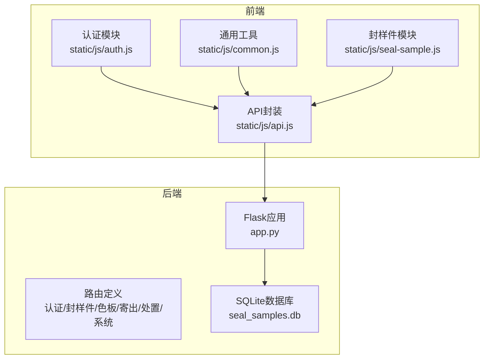
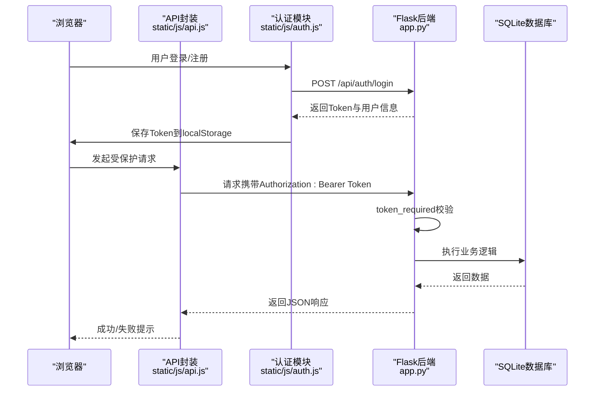
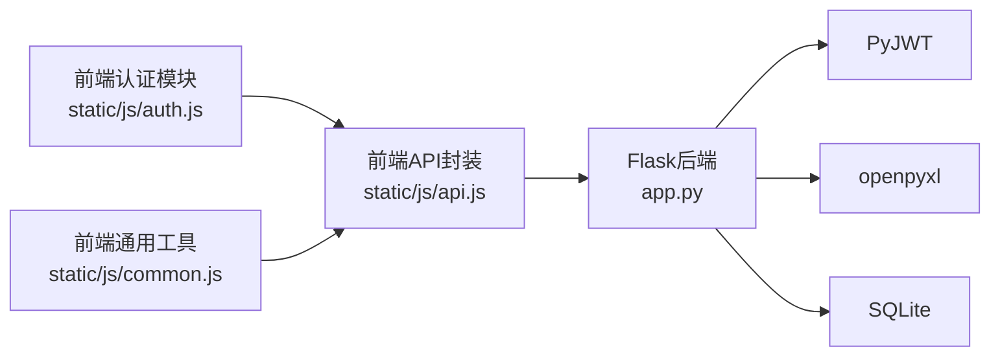

# API接口文档

<cite>
**本文档引用的文件**
- [app.py](file://app.py)
- [requirements.txt](file://requirements.txt)
- [api.js](file://static/js/api.js)
- [auth.js](file://static/js/auth.js)
- [common.js](file://static/js/common.js)
- [seal-sample.js](file://static/js/seal-sample.js)
</cite>

## 目录
1. [简介](#简介)
2. [项目结构](#项目结构)
3. [核心组件](#核心组件)
4. [架构总览](#架构总览)
5. [详细组件分析](#详细组件分析)
6. [依赖分析](#依赖分析)
7. [性能考虑](#性能考虑)
8. [故障排查指南](#故障排查指南)
9. [结论](#结论)
10. [附录](#附录)

## 简介
本系统为“封样件及色板接收登记管理系统”，采用Flask作为后端框架，SQLite作为数据存储，JWT实现认证授权，openpyxl支持Excel导入导出。系统提供完整的RESTful API，覆盖认证、用户管理、封样件管理、色板管理、寄出管理、处置记录、系统管理等模块。前端通过静态JS封装统一的API请求与JWT拦截器，支持动态筛选、分页查询、Excel导入导出等功能。

## 项目结构
- 后端主程序：app.py（Flask应用、路由定义、数据库初始化、JWT认证装饰器）
- 前端静态资源：static/js/*（API封装、认证、通用工具、各业务模块）
- 模板页面：templates/*（页面模板，供后端渲染）
- 依赖声明：requirements.txt（Flask、CORS、JWT、openpyxl）

图表来源
- [app.py:1-2197](file://app.py#L1-L2197)
- [api.js:1-88](file://static/js/api.js#L1-L88)
- [auth.js:1-204](file://static/js/auth.js#L1-L204)
- [common.js:1-135](file://static/js/common.js#L1-L135)
- [seal-sample.js:1-181](file://static/js/seal-sample.js#L1-L181)

章节来源
- [app.py:1-2197](file://app.py#L1-L2197)
- [requirements.txt:1-5](file://requirements.txt#L1-L5)

## 核心组件
- 认证与授权
  - JWT签名算法：HS256；Token有效期：24小时
  - 支持Header（Authorization: Bearer …）与Query参数（token）两种传递方式
  - 装饰器：token_required（校验Token、用户存在性、账户状态）、admin_required（管理员权限）
- 数据库与模型
  - 10张核心表：users、seal_invitation_codes、seal_samples、seal_color_samples、seal_send_records、seal_expiry_management、seal_evaluation_records、seal_scrapped_samples、seal_system_settings、seal_user_table_configs
  - 初始化：自动创建表、预置admin用户、预置ΔE阈值设置
- 工具函数
  - 分页：paginate
  - 动态筛选：apply_dynamic_filters（支持多种操作符）
  - 有效期状态：get_expiry_status（正常/待评定/已过期/已报废）
  - ΔE计算：calculate_delta_e（CIE76公式）
  - Excel导入导出：openpyxl

章节来源
- [app.py:48-84](file://app.py#L48-L84)
- [app.py:88-335](file://app.py#L88-L335)
- [app.py:377-449](file://app.py#L377-L449)
- [app.py:343-371](file://app.py#L343-L371)

## 架构总览
系统采用前后端分离架构：
- 前端通过API封装统一发起HTTP请求，自动附加JWT Token
- 后端路由按模块划分，使用装饰器进行鉴权与权限控制
- 数据持久化基于SQLite，支持Excel导入导出

图表来源
- [api.js:7-42](file://static/js/api.js#L7-L42)
- [auth.js:44-68](file://static/js/auth.js#L44-L68)
- [app.py:454-494](file://app.py#L454-L494)

## 详细组件分析

### 认证API
- 登录
  - 方法与URL：POST /api/auth/login
  - 请求体：{username, password}
  - 成功响应：{success: true, data: {token, user: {id, username, real_name, is_admin, must_change_password}}}
  - 失败响应：用户名或密码错误（401）、账户被停用（403）
- 注册
  - 方法与URL：POST /api/auth/register
  - 请求体：{username, real_name, password, confirmPassword, invitation_code}
  - 成功响应：{success: true, message: "注册成功，请登录"}
  - 失败响应：信息不完整（400）、密码不一致（400）、密码长度不足（400）、邀请码无效/过期/已达上限（400）
- 修改密码
  - 方法与URL：PUT /api/auth/change-password
  - 请求体：{oldPassword, newPassword, confirmPassword}
  - 成功响应：{success: true, message: "密码修改成功，请重新登录"}
  - 失败响应：信息不完整（400）、新密码不一致（400）、密码长度不足（400）、原密码不正确（400）
- 心跳/在线状态
  - 方法与URL：GET/POST /api/auth/ping
  - 成功响应：{success: true}
- 退出登录
  - 方法与URL：POST /api/auth/logout
  - 成功响应：{success: true, message: "已退出登录"}

章节来源
- [app.py:454-494](file://app.py#L454-L494)
- [app.py:495-543](file://app.py#L495-L543)
- [app.py:544-571](file://app.py#L544-L571)
- [app.py:572-589](file://app.py#L572-L589)

### 用户管理API
- 管理员：用户列表
  - 方法与URL：GET /api/admin/users
  - 查询参数：search（模糊搜索用户名/姓名）
  - 成功响应：{success: true, data: [{id, username, real_name, is_admin, is_active, last_active, is_online, invitation_code}]}

- 管理员：切换用户状态
  - 方法与URL：PUT /api/admin/users/<int:user_id>/status
  - 请求体：{isActive: boolean}
  - 成功响应：{success: true, message: "用户已启用"/"用户已禁用"}

- 管理员：删除用户
  - 方法与URL：DELETE /api/admin/users/<int:user_id>
  - 成功响应：{success: true, message: "用户已注销"}

- 管理员：邀请码管理
  - 获取邀请码列表：GET /api/admin/invitations
  - 创建邀请码：POST /api/admin/invitations（请求体：{maxUses, expiresAt, note}）
  - 切换邀请码状态：PUT /api/admin/invitations/<int:code_id>（请求体：{isActive: boolean}）
  - 删除邀请码：DELETE /api/admin/invitations/<int:code_id>（已使用邀请码禁止删除）

- 管理员：系统设置
  - 获取设置：GET /api/admin/settings
  - 更新设置：PUT /api/admin/settings（请求体：{settings: [{key, value}...]})

章节来源
- [app.py:1426-1452](file://app.py#L1426-L1452)
- [app.py:1454-1474](file://app.py#L1454-L1474)
- [app.py:1476-1495](file://app.py#L1476-L1495)
- [app.py:1499-1548](file://app.py#L1499-L1548)
- [app.py:1552-1577](file://app.py#L1552-L1577)

### 封样件管理API
- 列表查询（支持分页、动态筛选、兼容旧参数）
  - 方法与URL：GET /api/seal-samples
  - 查询参数：
    - page/pageSize：分页
    - f_field_i/f_op_i/f_val_i：动态筛选（i从0开始）
    - search/project：兼容旧参数
  - 成功响应：{success: true, data: {items, total, page, page_size, total_pages}}
  - 状态动态计算：正常/待评定/已过期/已报废

- 新增封样件
  - 方法与URL：POST /api/seal-samples
  - 请求体：{项目, 封样件名称, 签署人, 签署人日期, 有效期, 提醒天数, 备注}
  - 成功响应：{success: true, message: "封样件添加成功", data: {id}}

- 查看封样件
  - 方法与URL：GET /api/seal-samples/<int:id>
  - 成功响应：{success: true, data: {...}}

- 更新封样件
  - 方法与URL：PUT /api/seal-samples/<int:id>
  - 请求体：同新增（可部分更新）
  - 成功响应：{success: true, message: "更新成功"}

- 删除封样件
  - 方法与URL：DELETE /api/seal-samples/<int:id>
  - 成功响应：{success: true, message: "删除成功"}

- 导出Excel
  - 方法与URL：GET /api/seal-samples/export
  - 响应：xlsx文件（封样件台账）

- 导入Excel
  - 方法与URL：POST /api/seal-samples/import
  - 请求体：multipart/form-data（file）
  - 成功响应：{success: true, message: "成功导入X条数据，Y条跳过（首条错误: ...）"}

章节来源
- [app.py:593-624](file://app.py#L593-L624)
- [app.py:625-646](file://app.py#L625-L646)
- [app.py:647-659](file://app.py#L647-L659)
- [app.py:660-681](file://app.py#L660-L681)
- [app.py:682-691](file://app.py#L682-L691)
- [app.py:692-719](file://app.py#L692-L719)
- [app.py:720-795](file://app.py#L720-L795)

### 色板管理API
- 列表查询（支持分页、动态筛选、兼容旧参数）
  - 方法与URL：GET /api/color-samples
  - 查询参数：
    - page/pageSize：分页
    - f_field_i/f_op_i/f_val_i：动态筛选（i从0开始）
    - search/customer/model/colorName/supplier：兼容旧参数
  - 成功响应：{success: true, data: {items, total, page, page_size, total_pages}}

- 新增色板
  - 方法与URL：POST /api/color-samples
  - 请求体：{客户, 适用车型, 颜色名称, 接收数量, 有效期, ...（29个字段）}
  - 成功响应：{success: true, message: "色板添加成功", data: {id}}

- 查看色板
  - 方法与URL：GET /api/color-samples/<int:id>
  - 成功响应：{success: true, data: {...}}

- 更新色板
  - 方法与URL：PUT /api/color-samples/<int:id>
  - 请求体：可部分更新（同新增字段集合）
  - 成功响应：{success: true, message: "更新成功"}

- 删除色板
  - 方法与URL：DELETE /api/color-samples/<int:id>
  - 成功响应：{success: true, message: "删除成功"}
  - 失败响应：存在寄出记录（400）

- 导出Excel
  - 方法与URL：GET /api/color-samples/export
  - 响应：xlsx文件（色板台账）

- 导入Excel
  - 方法与URL：POST /api/color-samples/import
  - 请求体：multipart/form-data（file）
  - 成功响应：{success: true, message: "成功导入X条数据，Y条跳过（首条错误: ...）"}

章节来源
- [app.py:799-842](file://app.py#L799-L842)
- [app.py:843-869](file://app.py#L843-L869)
- [app.py:870-881](file://app.py#L870-L881)
- [app.py:882-902](file://app.py#L882-L902)
- [app.py:903-916](file://app.py#L903-L916)
- [app.py:917-952](file://app.py#L917-L952)
- [app.py:953-1041](file://app.py#L953-L1041)

### 寄出管理API
- 列表查询（支持分页、动态筛选）
  - 方法与URL：GET /api/send-records
  - 查询参数：
    - page/pageSize：分页
    - f_field_i/f_op_i/f_val_i：动态筛选（支持sr/色板客户、颜色名称、对方单位等字段）
  - 成功响应：{success: true, data: {items, total, page, page_size, total_pages}}

- 新增寄出记录
  - 方法与URL：POST /api/send-records
  - 请求体：{sample_id, 对方单位, 寄出数量, 寄出日期, 客户, 经手人, 备注}
  - 成功响应：{success: true, message: "寄出记录添加成功，库存已扣减"}
  - 失败响应：色板不存在或已过期（404）、寄出数量超出现有库存（400）

- 删除寄出记录
  - 方法与URL：DELETE /api/send-records/<int:id>
  - 成功响应：{success: true, message: "删除成功，库存已恢复"}

- 导出Excel
  - 方法与URL：GET /api/send-records/export
  - 响应：xlsx文件（寄出台账）

章节来源
- [app.py:1045-1109](file://app.py#L1045-L1109)
- [app.py:1110-1141](file://app.py#L1110-L1141)
- [app.py:1142-1156](file://app.py#L1142-L1156)
- [app.py:1157-1171](file://app.py#L1157-L1171)

### 有效期管理API
- 列表查询
  - 方法与URL：GET /api/expiry
  - 成功响应：{success: true, data: [...]}
- 新增有效期规则
  - 方法与URL：POST /api/expiry
  - 请求体：{item_type, item_id, 有效期类型, 有效期时长, 有效期单位, 有效期截止日期, 提醒天数, 备注}
  - 成功响应：{success: true, message: "有效期规则添加成功"}
- 更新有效期规则
  - 方法与URL：PUT /api/expiry/<int:id>
  - 请求体：{有效期类型, 有效期时长, 有效期单位, 有效期截止日期, 提醒天数, 备注}
  - 成功响应：{success: true, message: "更新成功"}

章节来源
- [app.py:1175-1196](file://app.py#L1175-L1196)
- [app.py:1197-1208](file://app.py#L1197-L1208)

### 评定提交API
- 列表查询
  - 方法与URL：GET /api/evaluations
  - 查询参数：type（item_type）、itemId（item_id）
  - 成功响应：{success: true, data: [...]}
- 提交评定
  - 方法与URL：POST /api/evaluations
  - 请求体：{item_type, item_id, result（pass/fail）, 当前L值, 当前a值, 当前b值, 计算ΔE值, 评定说明, 新有效期截止日}
  - 成功响应：{success: true, message: "评定提交成功(合格续期/不合格)", data: {deltaE}}
  - 失败响应：缺少必要参数（400）、记录不存在（404）、项目已报废（400）

章节来源
- [app.py:1212-1225](file://app.py#L1212-L1225)
- [app.py:1226-1287](file://app.py#L1226-L1287)

### 报废操作API
- 报废
  - 方法与URL：POST /api/scrap
  - 请求体：{item_type, item_id, 报废原因, 报废类型, 备注}
  - 成功响应：{success: true, message: "报废操作成功，该记录已锁定"}
  - 失败响应：信息不完整（400）、记录不存在（404）、项目已报废（400）

- 删除报废记录（管理员）
  - 方法与URL：DELETE /api/scrap/<int:id>?permanent=1
  - 成功响应：{success: true, message: "已永久删除"/"已恢复"}
  - 失败响应：仅管理员可执行（403）、报废记录不存在（404）

- 报废记录列表（支持动态筛选）
  - 方法与URL：GET /api/scrap
  - 查询参数：f_field_i/f_op_i/f_val_i（支持item_type、名称、报废原因、报废类型、报废日期、报废审批人等）
  - 成功响应：{success: true, data: [...]}
  - 失败响应：记录不存在（404）

章节来源
- [app.py:1291-1328](file://app.py#L1291-L1328)
- [app.py:1329-1355](file://app.py#L1329-L1355)
- [app.py:1356-1422](file://app.py#L1356-L1422)

### 处置记录（统一视图）API
- 列表查询（合并评定与报废，支持动态筛选、分页）
  - 方法与URL：GET /api/disposal-records
  - 查询参数：recordType（evaluation/scrap/all）、itemType（seal/color/all）、includeDeleted（1包含已删除）
  - 成功响应：{success: true, data: {items, total, page, page_size, total_pages}}

- 导出处置记录
  - 方法与URL：GET /api/disposal-records/export
  - 响应：xlsx文件（处置记录）

- 管理操作（管理员）
  - 软删除：POST /api/disposal-records/<record_type>/<int:record_id>/delete
  - 恢复：POST /api/disposal-records/<record_type>/<int:record_id>/restore
  - 永久删除：POST /api/disposal-records/<record_type>/<int:record_id>/permanent-delete
  - 回收站：GET /api/disposal-records/deleted-list

章节来源
- [app.py:1630-1807](file://app.py#L1630-L1807)
- [app.py:1808-1891](file://app.py#L1808-L1891)
- [app.py:1943-2038](file://app.py#L1943-L2038)
- [app.py:2040-2080](file://app.py#L2040-L2080)

### 系统管理API
- 用户表格配置（筛选+列设置）
  - 获取配置：GET /api/table-configs/<page_key>?type=filter/columns
  - 保存配置：PUT /api/table-configs/<page_key>（请求体：{type, config}）

- 仪表盘统计
  - 统计：GET /api/dashboard/stats（封样件总数、色板总数、待评定数、已报废总数）
  - 预警：GET /api/dashboard/warnings（有效期≤30天的封样件/色板列表）

章节来源
- [app.py:1582-1626](file://app.py#L1582-L1626)
- [app.py:2084-2115](file://app.py#L2084-L2115)
- [app.py:2116-2155](file://app.py#L2116-L2155)

## 依赖分析
- 技术栈
  - Flask：Web框架
  - Flask-CORS：跨域支持
  - PyJWT：JWT签名与解析
  - openpyxl：Excel导入导出
- 前端依赖
  - API封装：统一请求、Token附加、401自动跳转
  - 认证模块：登录/注册/强制改密
  - 通用工具：日期格式化、ΔE计算、状态标签、分页等

图表来源
- [requirements.txt:1-5](file://requirements.txt#L1-L5)
- [api.js:1-88](file://static/js/api.js#L1-L88)
- [auth.js:1-204](file://static/js/auth.js#L1-L204)
- [common.js:1-135](file://static/js/common.js#L1-L135)

章节来源
- [requirements.txt:1-5](file://requirements.txt#L1-L5)

## 性能考虑
- 分页与筛选
  - 列表接口支持page/pageSize分页，page_size<=0时返回全量（谨慎使用）
  - 动态筛选通过apply_dynamic_filters拼接SQL，注意字段白名单与LIKE/比较操作符映射
- 导入导出
  - Excel导入逐行解析，错误行记录首条错误信息，避免中断
  - 导出时按固定列顺序写入，避免多余系统列
- ΔE计算
  - 色板导入时若ΔE为空，按CIE76公式自动补算
- 在线状态
  - 心跳接口ping每请求一次更新用户last_active，便于在线状态判断

## 故障排查指南
- 认证相关
  - 401未提供Token或Token无效：检查Authorization头或token参数
  - Token过期：重新登录获取新Token
  - 账户被停用：提示“账户已被管理员停用”
- 参数校验
  - 必填字段缺失：返回400并提示具体字段
  - 密码长度不足：返回400
  - 邀请码无效/过期/已达上限：返回400
- 业务限制
  - 色板删除前需确保无寄出记录
  - 项目已报废不可再评定
  - 管理员操作需具备管理员权限
- 导入导出
  - 导入文件为空：返回400
  - 导入过程中部分行失败：返回成功消息并包含跳过行数与首条错误

章节来源
- [app.py:49-76](file://app.py#L49-L76)
- [app.py:506-528](file://app.py#L506-L528)
- [app.py:909-913](file://app.py#L909-L913)
- [app.py:1245-1247](file://app.py#L1245-L1247)
- [app.py:1535-1548](file://app.py#L1535-L1548)
- [app.py:723-795](file://app.py#L723-L795)
- [app.py:956-1041](file://app.py#L956-L1041)

## 结论
本系统提供了完整的封样件与色板生命周期管理能力，涵盖认证、用户管理、台账维护、寄出流转、评定报废、处置记录、系统配置与仪表盘统计等模块。通过JWT认证与权限装饰器保障安全性，通过动态筛选、分页与Excel导入导出提升易用性。建议在生产环境中增加API限流、审计日志与更严格的输入校验。

## 附录

### JWT认证机制
- Token生成：登录成功后返回JWT，包含user_id、username、is_admin、must_change_password
- Token传递：Header（Authorization: Bearer …）或Query参数（token）
- 校验逻辑：解码HS256，校验用户存在与账户状态，自动更新在线时间
- 过期处理：401并提示Token已过期

章节来源
- [app.py:48-76](file://app.py#L48-L76)
- [app.py:470-477](file://app.py#L470-L477)
- [api.js:7-42](file://static/js/api.js#L7-L42)

### 动态筛选与分页
- 动态筛选：f_field_i/f_op_i/f_val_i三元组，支持contains/not_contains/equals/not_equals/gt/gte/lt/lte/before/after/is_empty
- 分页：page/pageSize，page_size<=0返回全量

章节来源
- [app.py:403-449](file://app.py#L403-L449)
- [app.py:377-396](file://app.py#L377-L396)

### Excel导入导出规范
- 导入文件：与导出模板列顺序一致，支持跳过ID列
- 导入行为：逐行解析，错误行记录并跳过，完成后自动重算状态与ΔE
- 导出文件：按固定列顺序输出，中文状态映射

章节来源
- [app.py:694-719](file://app.py#L694-L719)
- [app.py:720-795](file://app.py#L720-L795)
- [app.py:918-952](file://app.py#L918-L952)
- [app.py:953-1041](file://app.py#L953-L1041)

### 前端API使用示例
- 登录：API.post('/auth/login', {username, password})
- 获取封样件列表：API.get('/seal-samples', {page, pageSize, f_field_0,...})
- 导入Excel：API.upload('/seal-samples/import', formData)

章节来源
- [auth.js:56](file://static/js/auth.js#L56)
- [seal-sample.js:21](file://static/js/seal-sample.js#L21)
- [seal-sample.js:171](file://static/js/seal-sample.js#L171)
- [api.js:49-83](file://static/js/api.js#L49-L83)