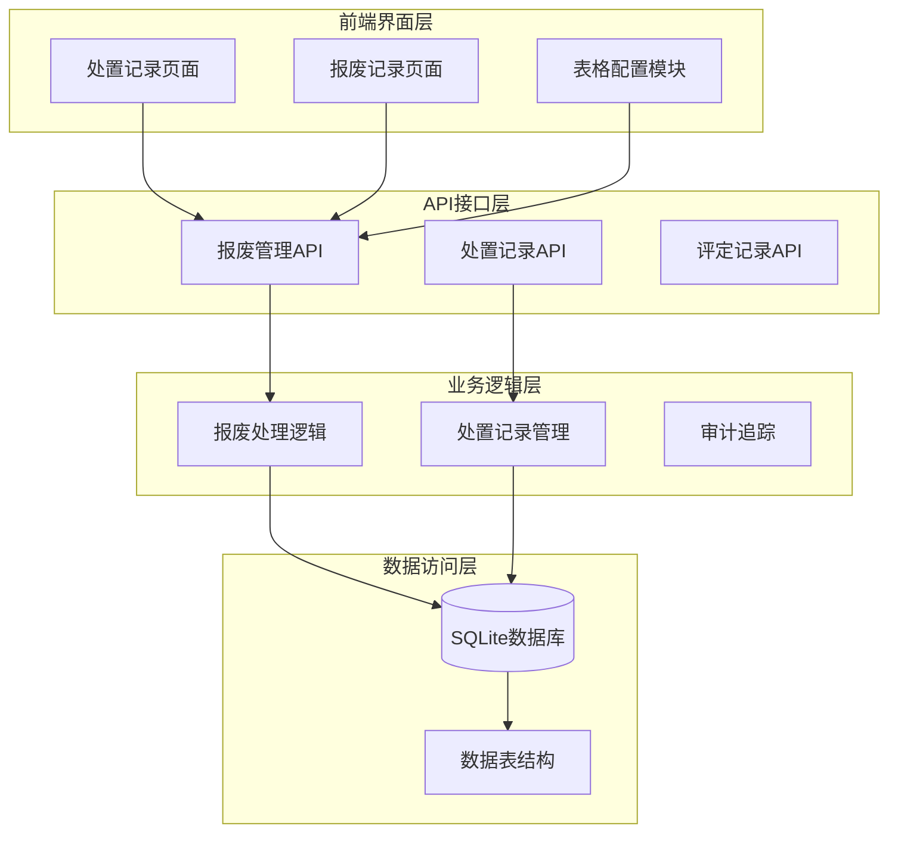
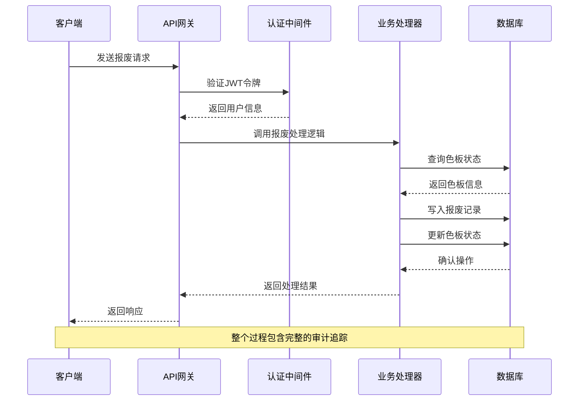
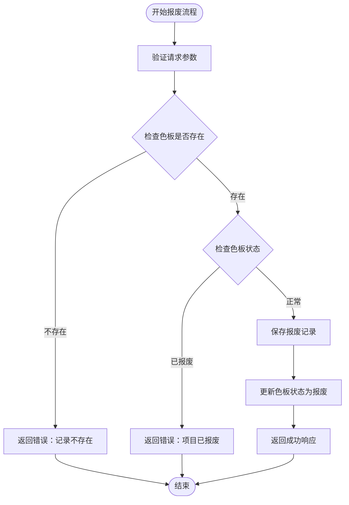
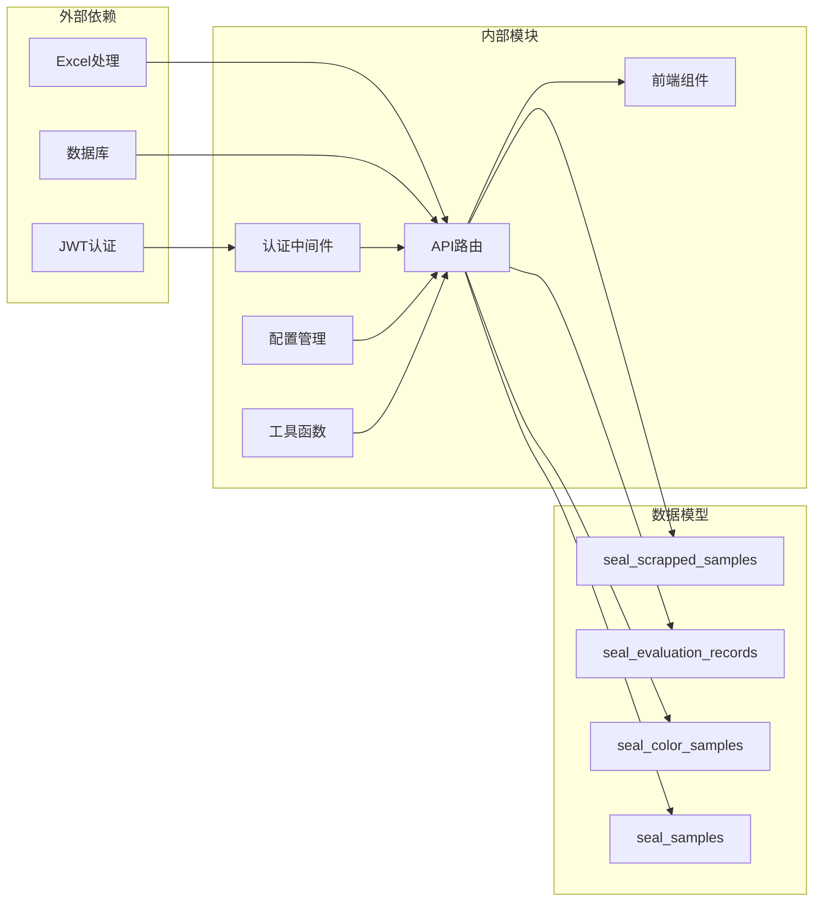

# 处置管理API

<cite>
**本文档引用的文件**
- [app.py](file://app.py)
- [disposal-records.js](file://static/js/disposal-records.js)
- [scrap-management.js](file://static/js/scrap-management.js)
- [disposal-records.html](file://templates/disposal-records.html)
- [scrap-list.html](file://templates/scrap-list.html)
- [table-config.js](file://static/js/table-config.js)
</cite>

## 目录
1. [简介](#简介)
2. [项目结构](#项目结构)
3. [核心组件](#核心组件)
4. [架构概览](#架构概览)
5. [详细组件分析](#详细组件分析)
6. [依赖关系分析](#依赖关系分析)
7. [性能考虑](#性能考虑)
8. [故障排除指南](#故障排除指南)
9. [结论](#结论)

## 简介

处置管理模块是封样件及色板接收登记管理系统中的重要组成部分，负责色板报废处理的完整生命周期管理。该模块提供了完整的报废记录创建、查询、更新、删除功能，并实现了与色板状态的关联管理。

本模块的核心功能包括：
- 色板报废申请和审批流程
- 报废记录的完整生命周期管理
- 与色板台账的状态联动更新
- 报废历史管理和审计追踪
- 完整的审批权限控制机制

## 项目结构

处置管理模块主要由以下组件构成：



**图表来源**
- [app.py:257-271](file://app.py#L257-L271)
- [disposal-records.html:1-38](file://templates/disposal-records.html#L1-L38)
- [scrap-list.html:1-24](file://templates/scrap-list.html#L1-L24)

**章节来源**
- [app.py:257-271](file://app.py#L257-L271)
- [disposal-records.html:1-38](file://templates/disposal-records.html#L1-L38)
- [scrap-list.html:1-24](file://templates/scrap-list.html#L1-L24)

## 核心组件

处置管理模块包含三个核心组件：

### 1. 报废管理API
负责色板报废的完整生命周期管理，包括创建、查询、删除等功能。

### 2. 处置记录管理API  
统一管理评定记录和报废记录，提供历史查询和审计功能。

### 3. 前端交互组件
提供用户友好的界面，支持动态筛选、列配置和批量操作。

**章节来源**
- [app.py:1291-1421](file://app.py#L1291-L1421)
- [app.py:1808-2079](file://app.py#L1808-L2079)
- [disposal-records.js:1-344](file://static/js/disposal-records.js#L1-L344)

## 架构概览

处置管理模块采用分层架构设计，确保了良好的可维护性和扩展性：



**图表来源**
- [app.py:49-84](file://app.py#L49-L84)
- [app.py:1291-1327](file://app.py#L1291-L1327)

## 详细组件分析

### 报废管理API

#### 报废记录创建接口

**接口定义**
- 方法：POST
- 路径：`/api/scrap`
- 权限：需要认证

**请求参数**
| 参数名 | 类型 | 必填 | 描述 |
|--------|------|------|------|
| item_type | string | 是 | 对象类型：'seal' 或 'color' |
| item_id | integer | 是 | 色板ID |
| 报废原因 | string | 是 | 报废的具体原因 |
| 报废类型 | string | 是 | 报废的分类类型 |
| 备注 | string | 否 | 可选的备注信息 |

**响应结构**
```json
{
  "success": true,
  "message": "报废操作成功，该记录已锁定",
  "data": {
    "id": 1
  }
}
```

**处理流程**


**图表来源**
- [app.py:1291-1327](file://app.py#L1291-L1327)

#### 报废记录查询接口

**接口定义**
- 方法：GET
- 路径：`/api/scrap`
- 权限：需要认证

**查询参数**
| 参数名 | 类型 | 描述 |
|--------|------|------|
| type | string | 对象类型过滤 |
| startDate | string | 开始日期过滤 |
| endDate | string | 结束日期过滤 |
| keyword | string | 关键词搜索 |
| f_field_i | string | 动态筛选字段 |
| f_op_i | string | 动态筛选操作符 |
| f_val_i | string | 动态筛选值 |

**响应数据结构**
```json
{
  "success": true,
  "data": [
    {
      "id": 1,
      "item_type": "color",
      "item_id": 101,
      "报废原因": "色差过大",
      "报废类型": "质量缺陷",
      "报废日期": "2024-01-15",
      "报废审批人": "张三",
      "created_by": 1,
      "created_at": "2024-01-15 10:30:00",
      "备注": "颜色偏差超出标准范围",
      "序号": "COLOR-001",
      "名称": "红色内饰件"
    }
  ]
}
```

**章节来源**
- [app.py:1356-1421](file://app.py#L1356-L1421)

#### 报废记录删除接口

**接口定义**
- 方法：DELETE
- 路径：`/api/scrap/{id}`
- 权限：管理员权限

**查询参数**
| 参数名 | 类型 | 描述 |
|--------|------|------|
| restore | string | 设置为'1'表示恢复 |
| permanent | string | 设置为'1'表示永久删除 |

**删除策略**
- 普通删除：将报废记录标记为已删除，但保留原始数据
- 恢复：撤销删除状态，恢复色板到正常状态
- 永久删除：彻底删除报废记录及相关联的寄出记录

**章节来源**
- [app.py:1329-1354](file://app.py#L1329-L1354)

### 处置记录管理API

#### 处置记录导出接口

**接口定义**
- 方法：GET
- 路径：`/api/disposal-records/export`
- 权限：需要认证

该接口支持将所有处置记录（包括评定记录和报废记录）导出为Excel文件，便于审计和报表生成。

**章节来源**
- [app.py:1808-1890](file://app.py#L1808-L1890)

#### 处置记录管理接口

**软删除接口**
- 路径：`/api/disposal-records/{record_type}/{record_id}/delete`
- 方法：POST
- 权限：管理员权限

**恢复接口**
- 路径：`/api/disposal-records/{record_type}/{record_id}/restore`
- 方法：POST
- 权限：管理员权限

**永久删除接口**
- 路径：`/api/disposal-records/{record_type}/{record_id}/permanent-delete`
- 方法：POST
- 权限：管理员权限

**回收站查询接口**
- 路径：`/api/disposal-records/deleted-list`
- 方法：GET
- 权限：管理员权限

**章节来源**
- [app.py:1943-2079](file://app.py#L1943-L2079)

### 前端交互组件

#### 处置记录页面

处置记录页面提供统一的界面来查看和管理所有处置记录，包括评定记录和报废记录。

**主要功能**
- 动态筛选和排序
- 分页显示
- 详情查看
- 批量操作（软删除、恢复、永久删除）

**章节来源**
- [disposal-records.html:1-38](file://templates/disposal-records.html#L1-L38)
- [disposal-records.js:1-344](file://static/js/disposal-records.js#L1-L344)

#### 报废记录页面

报废记录页面专门用于查看和管理报废记录。

**主要功能**
- 报废记录的详细查看
- 删除、恢复、永久删除操作
- 动态筛选和列配置

**章节来源**
- [scrap-list.html:1-24](file://templates/scrap-list.html#L1-L24)
- [scrap-management.js:1-118](file://static/js/scrap-management.js#L1-L118)

## 依赖关系分析

处置管理模块的依赖关系如下：



**图表来源**
- [app.py:1-25](file://app.py#L1-L25)
- [app.py:257-271](file://app.py#L257-L271)

**章节来源**
- [app.py:1-25](file://app.py#L1-L25)
- [app.py:257-271](file://app.py#L257-L271)

## 性能考虑

处置管理模块在设计时充分考虑了性能优化：

### 数据库优化
- 使用索引优化常用查询字段
- 实现分页查询避免大数据量加载
- 采用连接查询减少数据库往返次数

### 缓存策略
- 前端使用localStorage缓存用户配置
- 后端使用连接池管理数据库连接
- 实现查询结果缓存机制

### 并发控制
- 使用事务保证数据一致性
- 实现乐观锁防止并发冲突
- 采用异步处理提高响应速度

## 故障排除指南

### 常见问题及解决方案

**1. 报废操作失败**
- 检查色板是否已被报废
- 确认用户具有足够的权限
- 验证请求参数的完整性

**2. 查询结果为空**
- 检查筛选条件是否过于严格
- 确认数据是否已正确导入
- 验证用户的访问权限

**3. 权限相关错误**
- 确认用户已正确登录
- 检查用户角色是否为管理员
- 验证JWT令牌的有效性

**章节来源**
- [app.py:49-84](file://app.py#L49-L84)
- [app.py:1305-1327](file://app.py#L1305-L1327)

## 结论

处置管理模块为色板报废处理提供了完整、可靠的解决方案。通过标准化的API接口、完善的权限控制和审计追踪机制，确保了报废流程的规范性和可追溯性。

模块的主要优势包括：
- **完整的生命周期管理**：从申请到最终处置的全流程覆盖
- **严格的权限控制**：基于角色的访问控制和操作审计
- **灵活的数据管理**：支持软删除、恢复和永久删除
- **用户友好的界面**：提供直观的操作体验和强大的筛选功能

该模块为色板库存管理提供了重要的支撑，有助于提高库存管理效率和准确性。