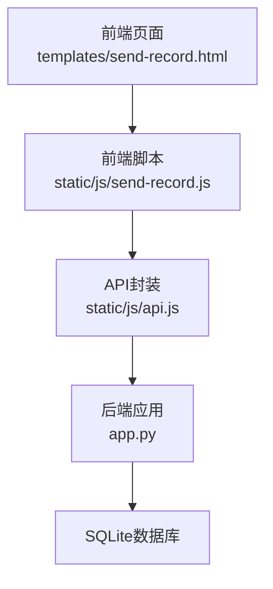
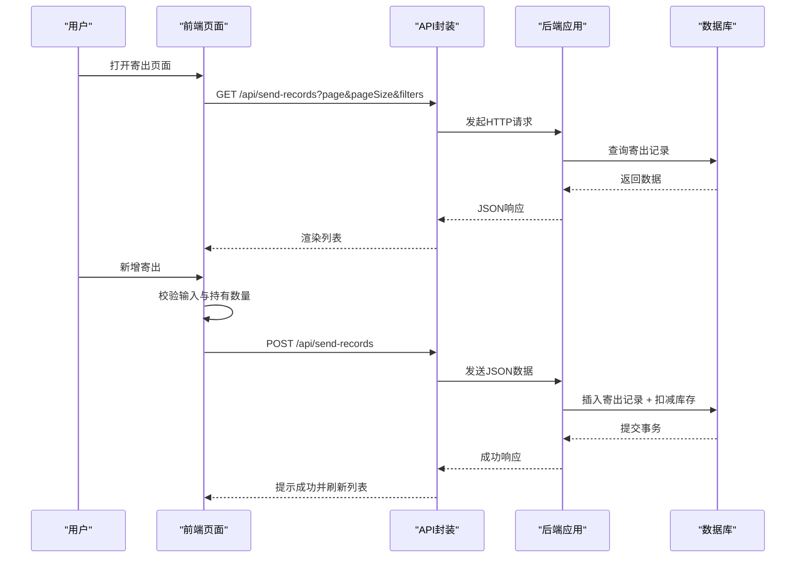
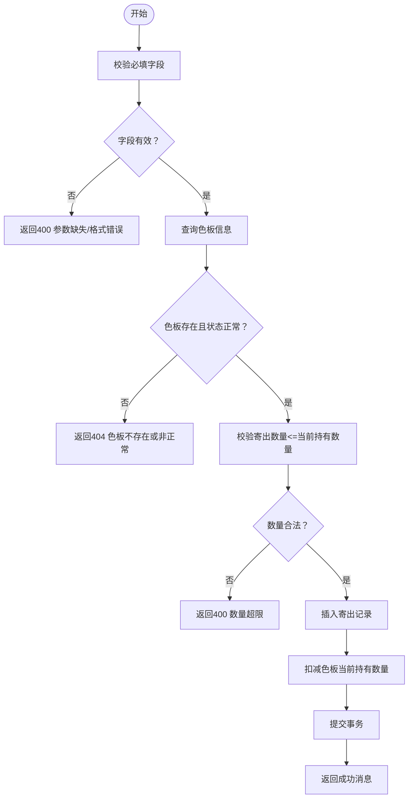
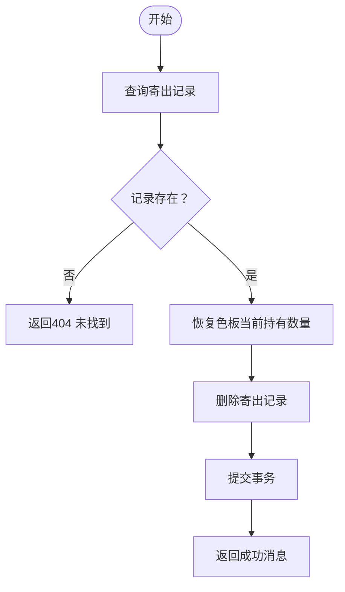
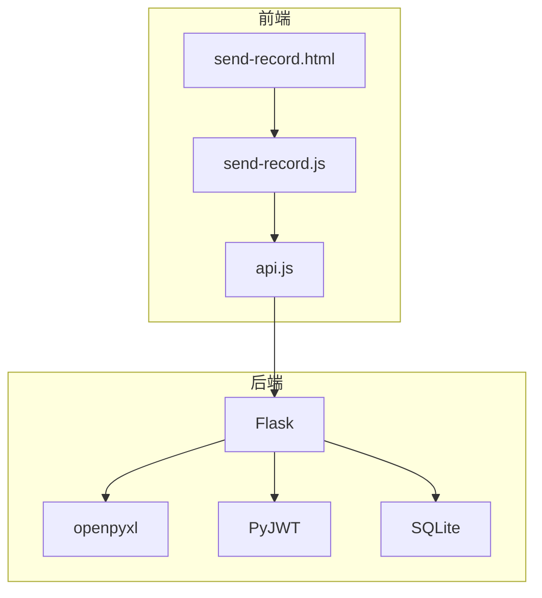

# 寄出管理API

<cite>
**本文引用的文件**
- [app.py](file://app.py)
- [send-record.js](file://static/js/send-record.js)
- [api.js](file://static/js/api.js)
- [send-record.html](file://templates/send-record.html)
</cite>

## 目录
1. [简介](#简介)
2. [项目结构](#项目结构)
3. [核心组件](#核心组件)
4. [架构总览](#架构总览)
5. [详细组件分析](#详细组件分析)
6. [依赖分析](#依赖分析)
7. [性能考虑](#性能考虑)
8. [故障排查指南](#故障排查指南)
9. [结论](#结论)
10. [附录](#附录)

## 简介
本文件为“寄出管理”模块的完整API文档，覆盖色板寄出记录的创建、查询、删除（恢复）全流程，重点说明：
- 寄出数量控制与库存实时更新
- 色板状态联动机制
- 寄出记录数据结构与字段说明
- Excel导入/导出规范与数据校验规则
- 请求与响应示例、异常处理机制

## 项目结构
寄出管理涉及后端Flask路由与前端交互脚本，核心文件如下：
- 后端：app.py 中定义了寄出管理相关路由与业务逻辑
- 前端：send-record.js 负责页面渲染、表单提交、与后端API交互
- 前端通用：api.js 提供统一的HTTP封装与鉴权拦截
- 页面：send-record.html 提供寄出记录列表与操作入口

图表来源
- [send-record.html](file://templates/send-record.html)
- [send-record.js](file://static/js/send-record.js)
- [api.js](file://static/js/api.js)
- [app.py](file://app.py)

章节来源
- [send-record.html](file://templates/send-record.html)
- [send-record.js](file://static/js/send-record.js)
- [api.js](file://static/js/api.js)
- [app.py](file://app.py)

## 核心组件
- 寄出记录表（seal_send_records）：存储每次寄出的明细，包含色板ID、客户、颜色名称、对方单位、寄出数量、寄出日期、经手人、备注等。
- 色板台账表（seal_color_samples）：存储色板基础信息与当前持有数量，寄出时会实时扣减。
- 前端交互：负责选择色板、输入寄出信息、校验数量、提交请求、刷新列表与库存提示。
- 后端路由：提供查询、创建、删除（恢复）寄出记录，以及导出功能；在创建/删除时同步更新库存。

章节来源
- [app.py](file://app.py)
- [send-record.js](file://static/js/send-record.js)

## 架构总览
寄出管理的端到端流程：
- 前端加载寄出记录列表，支持筛选与分页
- 选择色板并输入寄出信息（对方单位、寄出数量、寄出日期、经手人、备注）
- 前端校验数量不超过当前持有数量
- 后端创建寄出记录并扣减色板当前持有数量
- 删除寄出记录时恢复对应数量的库存
- 支持导出寄出记录为Excel

图表来源
- [send-record.js](file://static/js/send-record.js)
- [api.js](file://static/js/api.js)
- [app.py](file://app.py)

## 详细组件分析

### 数据模型与字段说明
寄出记录表（seal_send_records）字段：
- id：自增主键
- sample_id：关联色板ID（外键）
- 客户：来自色板的客户信息
- 颜色名称：来自色板的颜色名称
- 对方单位：收货单位
- 寄出数量：本次寄出数量
- 寄出日期：寄出日期
- 经手人：经手人姓名
- 备注：附加说明
- created_at：创建时间

色板表（seal_color_samples）与库存相关字段：
- 当前持有数量：寄出时实时扣减，删除寄出记录时恢复

章节来源
- [app.py](file://app.py)

### API定义与行为

#### 获取寄出记录列表
- 方法与路径：GET /api/send-records
- 认证：需要Token
- 查询参数：
  - page：页码，默认1
  - pageSize：每页条数，默认20；小于等于0表示不分页
  - f_field_i/f_op_i/f_val_i：动态筛选条件（支持多个）
  - customer：兼容旧参数，按客户或色板客户模糊匹配
  - recipient：兼容旧参数，按对方单位模糊匹配
- 返回：分页结果，包含寄出记录与色板客户、序号等关联字段
- 异常：401未授权、400参数错误、500服务器错误

章节来源
- [app.py](file://app.py)

#### 创建寄出记录
- 方法与路径：POST /api/send-records
- 认证：需要Token
- 请求体字段：
  - sample_id：色板ID（必填）
  - 对方单位：收货单位（必填）
  - 寄出数量：寄出数量（必填，必须为正整数）
  - 寄出日期：寄出日期（必填）
  - 客户：可选，来自色板的客户信息
  - 经手人：可选
  - 备注：可选
- 业务逻辑：
  - 校验色板存在且状态正常
  - 校验寄出数量不超过当前持有数量
  - 插入寄出记录
  - 扣减色板当前持有数量
- 返回：成功消息与提示
- 异常：400参数缺失/数量超限/色板不存在或非正常状态、404未找到、500服务器错误

章节来源
- [app.py](file://app.py)

#### 删除寄出记录（恢复库存）
- 方法与路径：DELETE /api/send-records/{id}
- 认证：需要Token
- 行为：删除指定寄出记录，并将寄出数量恢复到对应色板的当前持有数量
- 返回：成功消息与提示
- 异常：404记录不存在、500服务器错误

章节来源
- [app.py](file://app.py)

#### 导出寄出记录
- 方法与路径：GET /api/send-records/export
- 认证：需要Token
- 行为：导出所有寄出记录为Excel文件（列：ID、色板ID、客户、颜色名称、对方单位、寄出数量、寄出日期、经手人、备注、创建时间）
- 返回：Excel文件下载
- 异常：500服务器错误

章节来源
- [app.py](file://app.py)

### 前端交互与校验
- 页面入口：templates/send-record.html
- 加载与渲染：
  - 通过API获取列表，支持动态筛选与分页
  - 渲染表头与数据行，提供删除按钮
- 新增寄出：
  - 选择色板后展示颜色名称与当前持有数量
  - 输入对方单位、寄出数量、寄出日期、经手人、备注
  - 前端校验寄出数量不超过当前持有数量
  - 提交后提示成功并刷新列表
- 删除寄出：
  - 弹窗确认后调用删除接口，成功后恢复库存并刷新列表
- 导出：
  - 点击导出按钮，打开导出链接（携带Token）

章节来源
- [send-record.html](file://templates/send-record.html)
- [send-record.js](file://static/js/send-record.js)
- [api.js](file://static/js/api.js)

### 关键流程图：创建寄出记录

图表来源
- [app.py](file://app.py)

### 关键流程图：删除寄出记录

图表来源
- [app.py](file://app.py)

## 依赖分析
- 后端依赖：
  - Flask：Web框架
  - openpyxl：Excel导入导出
  - PyJWT：Token鉴权
  - SQLite：本地数据库
- 前端依赖：
  - api.js：统一HTTP请求封装与鉴权拦截
  - send-record.js：寄出记录页面逻辑
  - send-record.html：页面结构

图表来源
- [app.py](file://app.py)
- [api.js](file://static/js/api.js)
- [send-record.js](file://static/js/send-record.js)
- [send-record.html](file://templates/send-record.html)

章节来源
- [app.py](file://app.py)
- [api.js](file://static/js/api.js)
- [send-record.js](file://static/js/send-record.js)
- [send-record.html](file://templates/send-record.html)

## 性能考虑
- 分页查询：列表接口支持pageSize<=0返回全量，建议在大数据量场景下合理设置pageSize
- 动态筛选：通过f_field_i/f_op_i/f_val_i组合进行SQL拼接，注意参数绑定防止SQL注入
- 导出：一次性导出所有记录，建议在数据量较大时提示用户等待
- 前端渲染：列表渲染采用模板字符串拼接，建议在大量数据时优化虚拟滚动或服务端分页

## 故障排查指南
- 401未授权：
  - 检查请求头Authorization或URL参数token是否正确
  - Token过期或账户被停用会触发自动跳转登录
- 400参数错误：
  - 必填字段缺失或格式不正确（如寄出数量非正整数）
  - 寄出数量超过当前持有数量
- 404记录不存在：
  - 删除寄出记录时目标记录不存在
- 500服务器错误：
  - 数据库异常或Excel处理异常
- 前端提示：
  - UI.Toast会显示具体错误信息，检查控制台是否有网络错误

章节来源
- [api.js](file://static/js/api.js)
- [send-record.js](file://static/js/send-record.js)
- [app.py](file://app.py)

## 结论
寄出管理模块通过严格的数量校验与库存联动，确保寄出操作不会导致库存负数；前端提供直观的表单与校验，后端提供完善的查询、创建、删除与导出能力。建议在生产环境中：
- 对关键字段增加更严格的类型与范围校验
- 在高并发场景下考虑使用事务与锁机制
- 为Excel导入增加更细粒度的错误定位与修复建议

## 附录

### Excel导入/导出规范

- 导出文件：寄出台账.xlsx
  - 列标题：ID、色板ID、客户、颜色名称、对方单位、寄出数量、寄出日期、经手人、备注、创建时间
  - 下载地址：GET /api/send-records/export（需Token）

- 导入文件：与导出模板一致的Excel文件
  - 支持重新导入导出文件（含ID列时会跳过ID）
  - 日期字段自动截取YYYY-MM-DD
  - 状态字段（如有）会映射为内部编码（本模块主要针对寄出记录，色板状态映射见色板导入）

章节来源
- [app.py](file://app.py)

### 请求与响应示例

- 获取寄出记录列表
  - 请求：GET /api/send-records?page=1&pageSize=20&f_field_0=客户&f_op_0=contains&f_val_0=某客户
  - 响应：包含items、total、page、page_size、total_pages的分页对象

- 创建寄出记录
  - 请求：POST /api/send-records
  - 请求体示例（字段以中文命名）：
    - sample_id: 1
    - 对方单位: "某客户公司"
    - 寄出数量: 2
    - 寄出日期: "2025-04-01"
    - 客户: "某客户"
    - 经手人: "张三"
    - 备注: "项目A样品"
  - 响应：success为true，message包含成功提示

- 删除寄出记录
  - 请求：DELETE /api/send-records/{id}
  - 响应：success为true，message包含恢复库存提示

- 导出寄出记录
  - 请求：GET /api/send-records/export?token=xxx
  - 响应：Excel文件下载

章节来源
- [app.py](file://app.py)