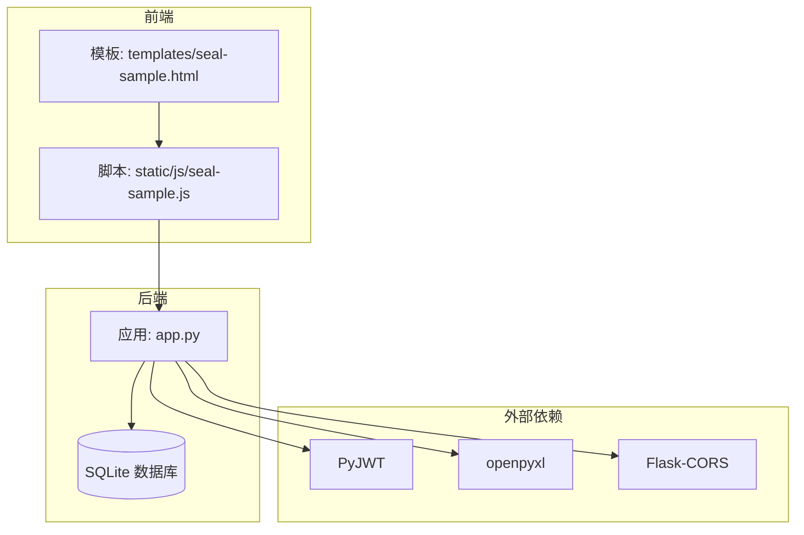
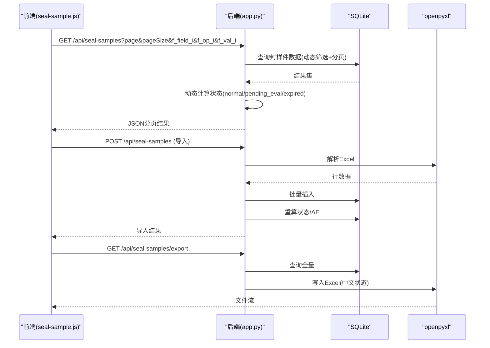
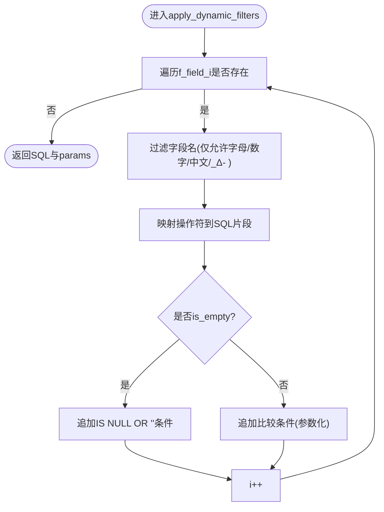
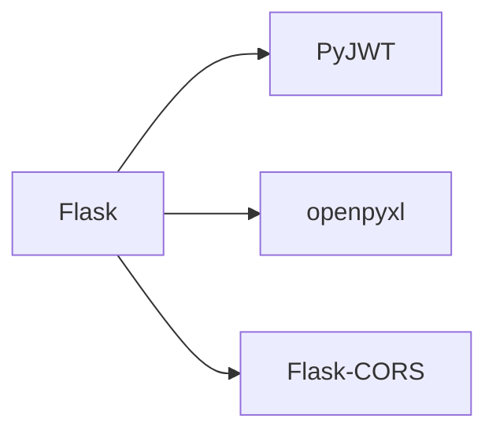

# 封样件管理API

<cite>
**本文引用的文件**
- [app.py](file://app.py)
- [requirements.txt](file://requirements.txt)
- [seal-sample.js](file://static/js/seal-sample.js)
- [seal-sample.html](file://templates/seal-sample.html)
</cite>

## 目录
1. [简介](#简介)
2. [项目结构](#项目结构)
3. [核心组件](#核心组件)
4. [架构总览](#架构总览)
5. [详细组件分析](#详细组件分析)
6. [依赖分析](#依赖分析)
7. [性能考虑](#性能考虑)
8. [故障排除指南](#故障排除指南)
9. [结论](#结论)
10. [附录](#附录)

## 简介
本文件为“封样件管理”模块的完整API文档，覆盖封样件台账的CRUD操作、动态筛选、分页查询、Excel导入导出、有效期管理与状态计算逻辑。文档面向前后端开发者与测试人员，提供端点定义、参数说明、响应格式、状态码以及安全与性能要点。

## 项目结构
后端基于Flask，采用SQLite作为数据存储，使用JWT进行认证，前端通过静态JS与模板渲染交互。封样件相关API集中在主应用文件中，并通过独立的前端脚本与页面模板进行调用与展示。

图表来源
- [app.py:1-25](file://app.py#L1-L25)
- [requirements.txt:1-5](file://requirements.txt#L1-L5)

章节来源
- [app.py:1-25](file://app.py#L1-L25)
- [requirements.txt:1-5](file://requirements.txt#L1-L5)

## 核心组件
- 认证与鉴权：基于JWT的token_required装饰器，支持Header与Query两种传参方式；管理员权限校验。
- 数据库：SQLite，表结构包含封样件台账、有效期管理、评定记录、报废记录等。
- 动态筛选：统一的apply_dynamic_filters函数，支持f_field_i、f_op_i、f_val_i三元组。
- 分页：paginate函数，支持page与pageSize参数，pageSize<=0时返回全量。
- Excel导入导出：基于openpyxl，导出中文状态标签，导入时自动重算状态与ΔE值。
- 状态计算：get_expiry_status根据有效期与提醒天数动态计算正常/待评定/已过期。

章节来源
- [app.py:48-84](file://app.py#L48-L84)
- [app.py:29-45](file://app.py#L29-L45)
- [app.py:403-449](file://app.py#L403-L449)
- [app.py:377-396](file://app.py#L377-L396)
- [app.py:692-718](file://app.py#L692-L718)
- [app.py:720-794](file://app.py#L720-L794)
- [app.py:350-371](file://app.py#L350-L371)

## 架构总览
后端提供REST风格API，前端通过AJAX调用，支持动态筛选、分页、导入导出与状态实时计算。

图表来源
- [app.py:593-623](file://app.py#L593-L623)
- [app.py:720-794](file://app.py#L720-L794)
- [app.py:692-718](file://app.py#L692-L718)
- [seal-sample.js:164-174](file://static/js/seal-sample.js#L164-L174)

## 详细组件分析

### 认证与鉴权
- Token位置：Header Authorization: Bearer <token> 或 Query ?token=<token>
- 用户状态：登录成功后更新last_active；心跳接口/ping也会刷新
- 管理员：admin_required装饰器限制特定管理端点

章节来源
- [app.py:49-76](file://app.py#L49-L76)
- [app.py:572-579](file://app.py#L572-L579)
- [app.py:78-84](file://app.py#L78-L84)

### 封样件台账API

#### 1) 列表查询
- 方法与路径：GET /api/seal-samples
- 认证：必需
- 查询参数
  - page: 整数，默认1
  - pageSize: 整数，<=0表示不分页返回全量
  - f_field_i, f_op_i, f_val_i: 动态筛选三元组，i从0递增
  - search: 兼容旧参数，模糊匹配封样件名称或签署人
  - project: 兼容旧参数，模糊匹配项目
- 动态筛选规则
  - 字段名白名单：仅允许字母、数字、中文、下划线、Δ、连字符
  - 操作符映射：contains/not_contains/equals/not_equals/gt/gte/lt/lte/before/after/is_empty
  - SQL注入防护：字段名过滤，参数化查询，LIKE值自动加通配符
- 分页规则
  - pageSize<=0：返回全量，page=1，total_pages=1
  - 否则按offset与limit切片
- 状态计算
  - 列表中状态为normal的项，动态计算为正常/待评定/已过期
- 响应
  - data.items: 列表项（含动态计算后的状态）
  - data.total/page/page_size/total_pages: 分页信息
- 状态码
  - 200 成功
  - 400 参数错误
  - 401 未认证/Token无效/过期
  - 403 权限不足
  - 404 资源不存在

章节来源
- [app.py:593-623](file://app.py#L593-L623)
- [app.py:403-449](file://app.py#L403-L449)
- [app.py:377-396](file://app.py#L377-L396)
- [app.py:350-371](file://app.py#L350-L371)

#### 2) 详情获取
- 方法与路径：GET /api/seal-samples/{id}
- 认证：必需
- 动态计算：若状态为normal，按有效期与提醒天数重新计算
- 响应：data为单条记录
- 状态码：200/404/401/403

章节来源
- [app.py:647-658](file://app.py#L647-L658)
- [app.py:350-371](file://app.py#L350-L371)

#### 3) 创建
- 方法与路径：POST /api/seal-samples
- 认证：必需
- 请求体字段（必填）
  - 项目、封样件名称、签署人、签署人日期、有效期
  - 可选：提醒天数（默认30）、备注
- 自动字段
  - 序号：自动生成GKYJ-YYYYMMDDHHMMSS
  - 状态：根据有效期与提醒天数计算
- 响应：data包含新建记录id
- 状态码：200/400/401/403

章节来源
- [app.py:625-645](file://app.py#L625-L645)
- [app.py:350-371](file://app.py#L350-L371)

#### 4) 更新
- 方法与路径：PUT /api/seal-samples/{id}
- 认证：必需
- 限制：状态为scrapped的记录不可更新
- 请求体字段：可部分更新（序号、项目、封样件名称、签署人、签署人日期、有效期、提醒天数、备注）
- 自动字段：状态根据新有效期与提醒天数重新计算
- 响应：成功消息
- 状态码：200/400/401/403/404

章节来源
- [app.py:660-680](file://app.py#L660-L680)
- [app.py:350-371](file://app.py#L350-L371)

#### 5) 删除
- 方法与路径：DELETE /api/seal-samples/{id}
- 认证：必需
- 限制：不存在或状态为scrapped时返回404
- 响应：成功消息
- 状态码：200/401/403/404

章节来源
- [app.py:682-690](file://app.py#L682-L690)

#### 6) Excel导出
- 方法与路径：GET /api/seal-samples/export
- 认证：必需
- 行为：导出所有封样件，状态映射为中文；若状态为normal，动态计算后写入
- 响应：application/vnd.openxmlformats-officedocument.spreadsheetml.sheet
- 状态码：200/401/403

章节来源
- [app.py:692-718](file://app.py#L692-L718)

#### 7) Excel导入
- 方法与路径：POST /api/seal-samples/import
- 认证：必需
- 请求：multipart/form-data，字段file为Excel文件
- 导入规则
  - 忽略首行ID（若存在）
  - 字段顺序：序号,项目,封样件名称,签署人,签署人日期,有效期,提醒天数,备注
  - 日期字段截断为YYYY-MM-DD
  - 提醒天数非整数时默认30
  - 状态默认normal
- 错误处理
  - 单行异常：记录首条错误，其余继续导入
  - 导入完成后：对本次新增记录按有效期与提醒天数重算状态
- 响应：成功消息（包含导入条数与跳过条数）
- 状态码：200/400/500

章节来源
- [app.py:720-794](file://app.py#L720-L794)

### 动态筛选与SQL注入防护
- 参数命名：f_field_i、f_op_i、f_val_i，i从0开始
- 字段名白名单：字母、数字、中文、下划线、Δ、连字符
- 操作符映射：LIKE/比较/日期比较/空值检查
- 防护措施：字段名过滤、参数化查询、LIKE值自动加通配符

图表来源
- [app.py:403-449](file://app.py#L403-L449)

章节来源
- [app.py:403-449](file://app.py#L403-L449)

### 分页查询
- 参数：page、pageSize
- 规则：pageSize<=0返回全量；否则按offset与page_size切片
- 返回：items、total、page、page_size、total_pages

章节来源
- [app.py:377-396](file://app.py#L377-L396)

### 状态计算与有效期管理
- 状态：normal/pending_eval/expired/scrapped
- 计算逻辑：get_expiry_status(有效期, 提醒天数)
  - 有效期为空：normal
  - 有效期距离今天>提醒天数：normal
  - 有效期距离今天在(0,提醒天数]：pending_eval
  - 有效期已过期：expired
- 提醒天数：默认30，可配置
- 报废：状态改为scrapped，不可更新

章节来源
- [app.py:350-371](file://app.py#L350-L371)
- [app.py:665-667](file://app.py#L665-L667)

### 前端集成要点
- 列表加载：loadSealSamples(page, filters)
- 动态筛选：TableConfig生成f_field_i/f_op_i/f_val_i参数
- 分页：renderSealTable(data)渲染分页控件
- 导入导出：通过按钮触发上传与下载
- 表单：新增/编辑/查看，序号与签署人日期/有效期在新增时不可修改

章节来源
- [seal-sample.js:8-24](file://static/js/seal-sample.js#L8-L24)
- [seal-sample.js:164-174](file://static/js/seal-sample.js#L164-L174)
- [seal-sample.html:10-32](file://templates/seal-sample.html#L10-L32)

## 依赖分析
- Flask：Web框架
- PyJWT：Token签发与解析
- openpyxl：Excel导入导出
- Flask-CORS：跨域支持

图表来源
- [requirements.txt:1-5](file://requirements.txt#L1-L5)

章节来源
- [requirements.txt:1-5](file://requirements.txt#L1-L5)

## 性能考虑
- 动态筛选：建议在常用筛选字段建立索引以提升查询性能（当前实现为纯SQL查询，未见显式索引）
- 分页：大数据量时建议合理设置pageSize，避免一次性返回过多数据
- 导入：批量插入后重算状态与ΔE，建议在导入完成后再进行批量更新，减少多次往返
- Excel：导出全量数据时注意内存占用，可考虑分批导出

## 故障排除指南
- 401 未认证/Token无效/过期
  - 检查Authorization头或Query参数token
  - 确认Token未过期且签名正确
- 403 权限不足
  - 管理员端点需管理员权限
- 404 资源不存在
  - 查看ID是否存在，状态是否为scrapped
- 导入失败
  - 确认文件格式为.xlsx/.xls
  - 检查字段顺序与日期格式
  - 查看返回消息中的首条错误定位问题

章节来源
- [app.py:49-76](file://app.py#L49-L76)
- [app.py:78-84](file://app.py#L78-L84)
- [app.py:682-690](file://app.py#L682-L690)
- [app.py:720-794](file://app.py#L720-L794)

## 结论
本API围绕封样件台账提供了完善的CRUD能力，结合动态筛选、分页、Excel导入导出与有效期状态计算，满足日常业务场景需求。建议在生产环境中进一步完善索引策略与错误日志，确保高并发下的稳定性与可观测性。

## 附录

### API端点一览
- GET /api/seal-samples
- POST /api/seal-samples
- GET /api/seal-samples/{id}
- PUT /api/seal-samples/{id}
- DELETE /api/seal-samples/{id}
- GET /api/seal-samples/export
- POST /api/seal-samples/import

章节来源
- [app.py:593-690](file://app.py#L593-L690)
- [app.py:692-718](file://app.py#L692-L718)
- [app.py:720-794](file://app.py#L720-L794)

### 请求与响应示例（路径指引）
- 列表查询
  - 请求：GET /api/seal-samples?page=1&pageSize=20&f_field_0=项目&f_op_0=contains&f_val_0=ABC
  - 响应：包含items与分页信息
- 创建
  - 请求体：包含项目、封样件名称、签署人、签署人日期、有效期、可选提醒天数与备注
  - 响应：包含新建记录id
- 更新
  - 请求体：可部分更新字段，状态将按新有效期与提醒天数重算
- 删除
  - 请求：DELETE /api/seal-samples/{id}
- 导出
  - 请求：GET /api/seal-samples/export
- 导入
  - 请求：POST /api/seal-samples/import，multipart/form-data，file字段

章节来源
- [app.py:593-690](file://app.py#L593-L690)
- [app.py:692-718](file://app.py#L692-L718)
- [app.py:720-794](file://app.py#L720-L794)