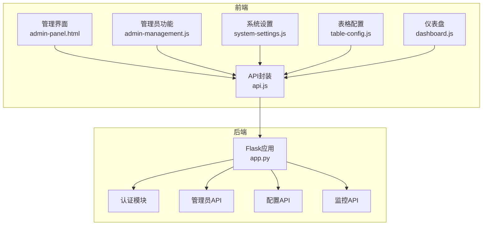
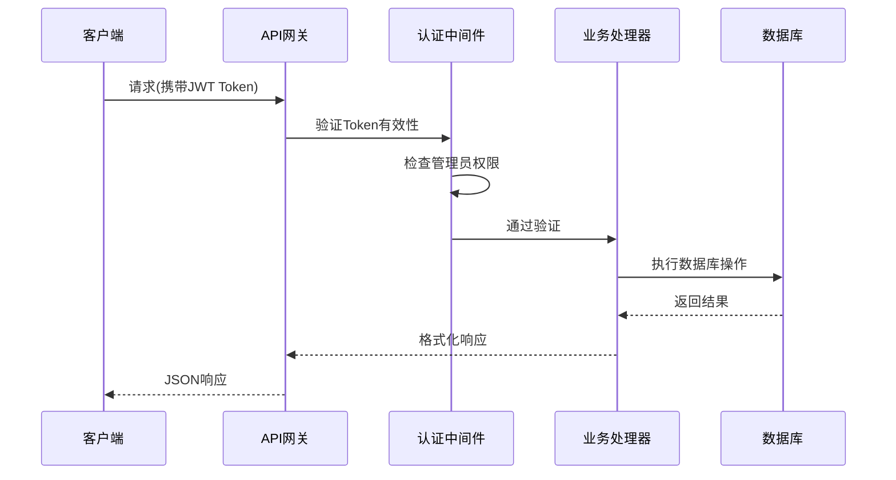
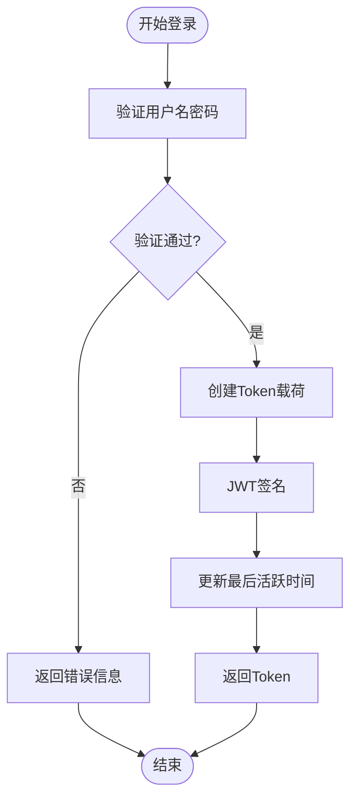
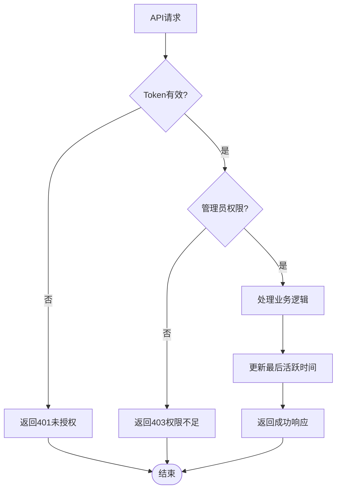
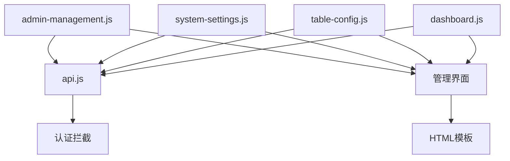
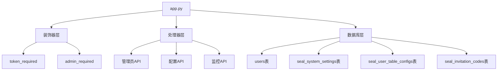

# 系统管理API

<cite>
**本文档引用的文件**
- [app.py](file://app.py)
- [admin-management.js](file://static/js/admin-management.js)
- [system-settings.js](file://static/js/system-settings.js)
- [table-config.js](file://static/js/table-config.js)
- [api.js](file://static/js/api.js)
- [admin-panel.html](file://templates/admin-panel.html)
- [dashboard.js](file://static/js/dashboard.js)
</cite>

## 目录
1. [简介](#简介)
2. [项目结构](#项目结构)
3. [核心组件](#核心组件)
4. [架构概览](#架构概览)
5. [详细组件分析](#详细组件分析)
6. [依赖分析](#依赖分析)
7. [性能考虑](#性能考虑)
8. [故障排除指南](#故障排除指南)
9. [结论](#结论)

## 简介
本文件为封样件及色板接收登记管理系统的系统管理模块API文档。系统采用Flask + SQLite + JWT的技术栈，提供完善的用户管理、系统设置、表格配置、邀请码管理以及基础监控功能。本文档详细说明管理员权限控制机制、用户CRUD操作、权限分配、账户启停用、ΔE阈值配置、有效期提醒天数设置、个性化表格配置、邀请码管理以及用户在线状态跟踪等核心功能。

## 项目结构
系统采用前后端分离架构，后端提供RESTful API，前端通过JavaScript模块进行交互。



**图表来源**
- [app.py:1-50](file://app.py#L1-L50)
- [admin-management.js:1-50](file://static/js/admin-management.js#L1-L50)
- [api.js:1-50](file://static/js/api.js#L1-L50)

**章节来源**
- [app.py:1-100](file://app.py#L1-L100)
- [admin-panel.html:1-50](file://templates/admin-panel.html#L1-L50)

## 核心组件
系统管理模块包含以下核心组件：

### 认证与授权
- JWT Token认证机制，支持Header和Query两种传递方式
- 管理员权限控制，@admin_required装饰器保护敏感接口
- 账户状态验证，防止停用账户访问

### 用户管理
- 用户CRUD操作：查询、启用/禁用、删除
- 用户在线状态跟踪，基于last_active字段
- 邀请码关联管理

### 系统设置
- ΔE阈值配置：优秀、合格、需关注三级阈值
- 实时预览功能，修改后立即生效
- 设置历史追踪

### 表格配置
- 用户个性化列显示设置
- 筛选条件保存与恢复
- 跨页面配置持久化

### 邀请码管理
- 邀请码生成、启用/停用、删除
- 使用次数限制与过期管理
- 统计信息展示

**章节来源**
- [app.py:48-84](file://app.py#L48-L84)
- [app.py:1425-1548](file://app.py#L1425-L1548)
- [app.py:1551-1577](file://app.py#L1551-L1577)
- [app.py:1582-1625](file://app.py#L1582-L1625)

## 架构概览
系统采用分层架构设计，前后端通过HTTP协议通信，后端使用SQLite作为数据存储。



**图表来源**
- [app.py:48-84](file://app.py#L48-L84)
- [api.js:7-42](file://static/js/api.js#L7-L42)

## 详细组件分析

### 认证与授权机制

#### Token管理流程


**图表来源**
- [app.py:454-493](file://app.py#L454-L493)
- [app.py:476-479](file://app.py#L476-L479)

#### 权限控制流程


**图表来源**
- [app.py:48-84](file://app.py#L48-L84)
- [app.py:68-70](file://app.py#L68-L70)

**章节来源**
- [app.py:454-588](file://app.py#L454-L588)

### 用户管理API

#### 用户列表查询
- **URL**: `/api/admin/users`
- **方法**: GET
- **认证**: 需要管理员权限
- **查询参数**:
  - `search`: 搜索关键字（用户名或真实姓名）

#### 用户状态管理
- **URL**: `/api/admin/users/<int:user_id>/status`
- **方法**: PUT
- **请求体**:
  ```json
  {
    "isActive": true
  }
  ```
- **限制**: 不能操作自己的账户；不能禁用管理员账户

#### 用户删除
- **URL**: `/api/admin/users/<int:user_id>`
- **方法**: DELETE
- **限制**: 不能删除自己的账户；不能删除管理员账户；删除时同步删除关联邀请码

**章节来源**
- [app.py:1426-1495](file://app.py#L1426-L1495)

### 邀请码管理API

#### 邀请码列表
- **URL**: `/api/admin/invitations`
- **方法**: GET

#### 邀请码创建
- **URL**: `/api/admin/invitations`
- **方法**: POST
- **请求体**:
  ```json
  {
    "note": "用途说明",
    "maxUses": 1,
    "expiresAt": "YYYY-MM-DD"
  }
  ```

#### 邀请码状态管理
- **URL**: `/api/admin/invitations/<int:code_id>`
- **方法**: PUT
- **请求体**:
  ```json
  {
    "isActive": true
  }
  ```

#### 邀请码删除
- **URL**: `/api/admin/invitations/<int:code_id>`
- **方法**: DELETE
- **限制**: 已使用的邀请码禁止删除

**章节来源**
- [app.py:1498-1548](file://app.py#L1498-L1548)

### 系统设置API

#### ΔE阈值配置
系统提供三档ΔE阈值配置，基于CIE76标准计算色差：

| 阈值类型 | 默认值 | 描述 |
|---------|--------|------|
| 优秀阈值 | 1.0 | ΔE < 1.0，显示绿色"优秀" |
| 合格阈值 | 2.0 | 1.0 ≤ ΔE < 2.0，显示黄色"合格" |
| 需关注阈值 | 999.0 | ΔE ≥ 2.0，显示红色"需关注" |

- **URL**: `/api/admin/settings`
- **方法**: GET/PUT
- **响应格式**:
  ```json
  {
    "delta_e_excellent": {
      "value": "1.0",
      "description": "ΔE优秀阈值上限"
    },
    "delta_e_good": {
      "value": "2.0", 
      "description": "ΔE合格阈值上限"
    },
    "delta_e_warning": {
      "value": "999.0",
      "description": "ΔE需关注阈值"
    }
  }
  ```

**章节来源**
- [app.py:1551-1577](file://app.py#L1551-L1577)
- [system-settings.js:1-65](file://static/js/system-settings.js#L1-L65)

### 表格配置API

#### 配置存储结构
系统为每个用户在每页维护两套配置：
- **列配置(columns)**: 决定哪些列可见
- **筛选配置(filter)**: 保存当前筛选条件

#### API规范
- **获取配置**: `GET /api/table-configs/<page_key>?type=columns|filter`
- **保存配置**: `PUT /api/table-configs/<page_key>`
- **请求体**:
  ```json
  {
    "type": "columns|filter",
    "config": {
      // 配置数据
    }
  }
  ```

#### 页面定义
系统支持以下页面的个性化配置：
- `seal_sample`: 封样件台账
- `color_sample`: 色板台账  
- `send_record`: 寄出台账
- `scrap_list`: 报废记录
- `disposal_records`: 处置记录

**章节来源**
- [app.py:1582-1625](file://app.py#L1582-L1625)
- [table-config.js:15-154](file://static/js/table-config.js#L15-L154)

### 监控与统计API

#### 在线用户检测
系统通过last_active字段跟踪用户在线状态：
- 5分钟内有活动即视为在线
- 支持UTC+8时区转换

#### 仪表盘统计
- **封样件总数**: `GET /api/dashboard/stats`
- **色板总数**: `GET /api/dashboard/stats`  
- **待评定数**: `GET /api/dashboard/stats`
- **已报废数**: `GET /api/dashboard/stats`

**章节来源**
- [app.py:1440-1452](file://app.py#L1440-L1452)
- [dashboard.js:1-117](file://static/js/dashboard.js#L1-L117)

## 依赖分析

### 前端依赖关系


**图表来源**
- [api.js:1-88](file://static/js/api.js#L1-L88)
- [admin-management.js:1-153](file://static/js/admin-management.js#L1-L153)
- [system-settings.js:1-65](file://static/js/system-settings.js#L1-L65)
- [table-config.js:1-552](file://static/js/table-config.js#L1-L552)

### 后端依赖关系


**图表来源**
- [app.py:48-84](file://app.py#L48-L84)
- [app.py:88-335](file://app.py#L88-L335)

**章节来源**
- [app.py:1-2197](file://app.py#L1-L2197)

## 性能考虑
1. **数据库优化**:
   - 使用索引优化常用查询字段
   - 分页查询避免全量数据传输
   - 连接池管理减少数据库连接开销

2. **缓存策略**:
   - 前端localStorage缓存用户配置
   - 后端查询结果缓存（可选）

3. **网络优化**:
   - 批量操作减少HTTP请求
   - 压缩响应数据
   - 合理的超时设置

4. **并发控制**:
   - Token过期时间合理设置
   - 并发访问的数据库事务处理

## 故障排除指南

### 常见问题
1. **401未授权错误**
   - 检查Token是否正确传递
   - 验证Token是否过期
   - 确认账户状态正常

2. **403权限不足**
   - 确认用户具有管理员权限
   - 检查操作是否涉及自身账户

3. **邀请码相关错误**
   - 验证邀请码是否有效
   - 检查使用次数限制
   - 确认过期时间

### 调试建议
1. 查看浏览器开发者工具Network标签
2. 检查后端日志输出
3. 验证数据库连接状态
4. 确认JWT密钥配置正确

**章节来源**
- [api.js:20-33](file://static/js/api.js#L20-L33)
- [app.py:572-588](file://app.py#L572-L588)

## 结论
系统管理模块提供了完整的权限控制、用户管理、配置管理和监控功能。通过JWT认证和管理员权限控制，确保了系统的安全性。个性化表格配置和实时ΔE阈值设置提升了用户体验。建议后续可以考虑增加审计日志、更详细的监控指标以及配置版本管理等功能。