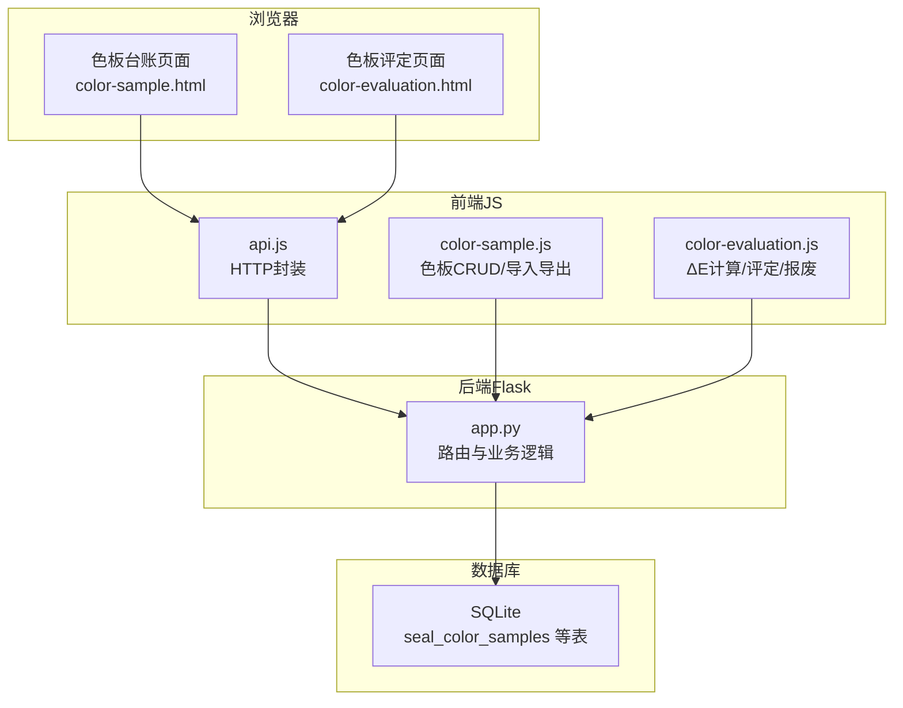
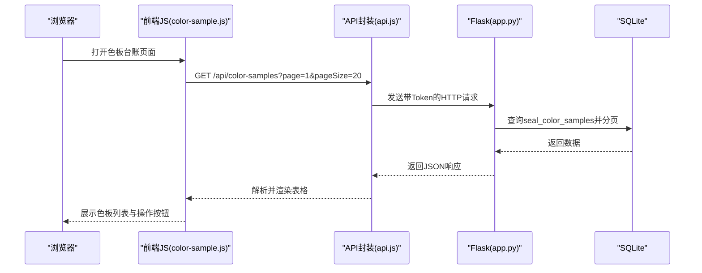
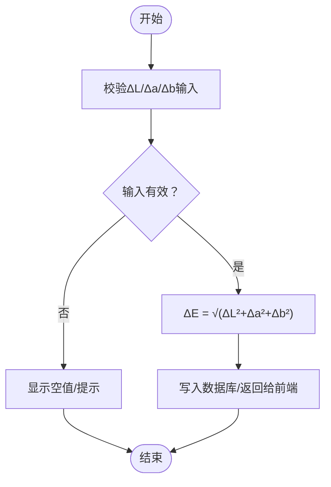
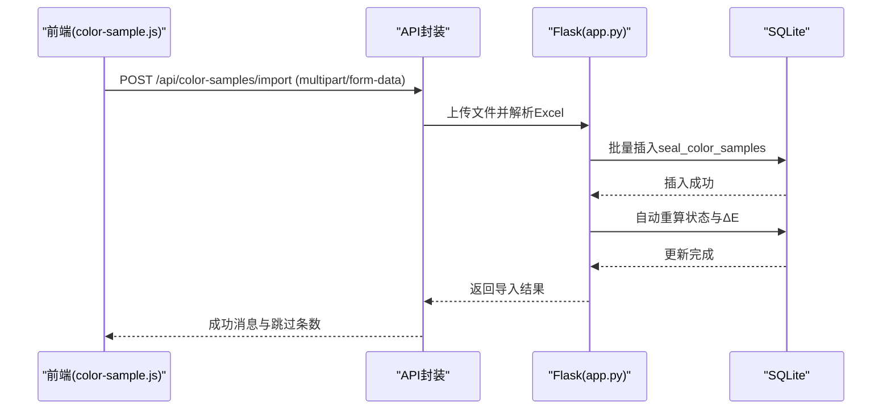
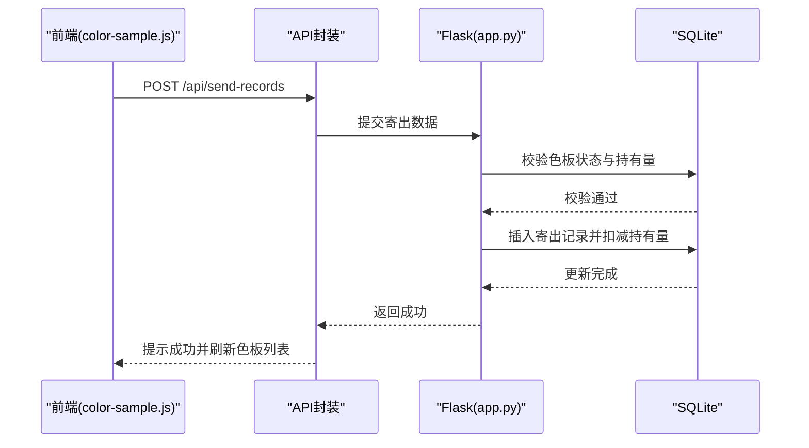
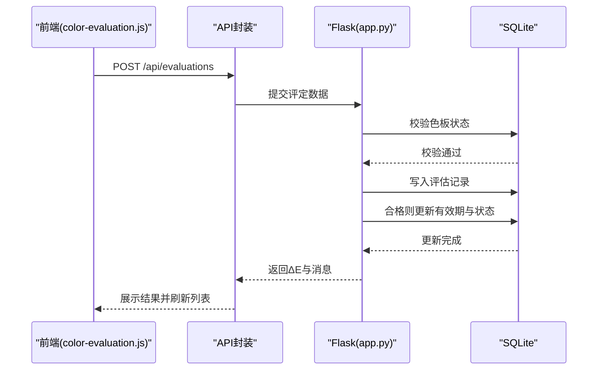
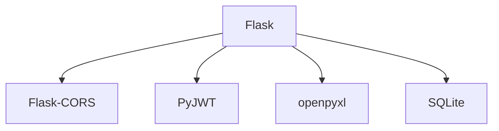

# 色板管理API

<cite>
**本文档引用的文件**
- [app.py](file://app.py)
- [requirements.txt](file://requirements.txt)
- [color-sample.js](file://static/js/color-sample.js)
- [color-evaluation.js](file://static/js/color-evaluation.js)
- [api.js](file://static/js/api.js)
- [color-sample.html](file://templates/color-sample.html)
- [color-evaluation.html](file://templates/color-evaluation.html)
</cite>

## 目录
1. [简介](#简介)
2. [项目结构](#项目结构)
3. [核心组件](#核心组件)
4. [架构总览](#架构总览)
5. [详细组件分析](#详细组件分析)
6. [依赖分析](#依赖分析)
7. [性能考虑](#性能考虑)
8. [故障排查指南](#故障排查指南)
9. [结论](#结论)
10. [附录](#附录)

## 简介
本项目为“封样件及色板接收登记管理系统”的后端API，采用Flask + SQLite + JWT + openpyxl技术栈，提供色板台账的完整CRUD能力，支持Excel导入导出、有效期管理、色差评估（ΔE）、库存控制、报废管理等核心业务功能。本文档面向开发者与测试人员，系统性梳理色板管理API的接口规范、数据模型、流程与最佳实践。

## 项目结构
- 后端：Python Flask应用，集中于单文件app.py，负责路由、认证、业务逻辑与数据库交互。
- 前端：静态资源位于static/js与templates目录，提供色板台账、评定、寄出、报废等页面与交互逻辑。
- 依赖：requirements.txt声明Flask、CORS、JWT、openpyxl等依赖。

图表来源
- [app.py:1-2197](file://app.py#L1-L2197)
- [color-sample.js:1-267](file://static/js/color-sample.js#L1-L267)
- [color-evaluation.js:1-289](file://static/js/color-evaluation.js#L1-L289)
- [api.js:1-88](file://static/js/api.js#L1-L88)

章节来源
- [app.py:1-2197](file://app.py#L1-L2197)
- [requirements.txt:1-5](file://requirements.txt#L1-L5)

## 核心组件
- 色板台账表（seal_color_samples）：承载色板的完整信息与色差参数，支持有效期与状态管理。
- 色差计算工具：基于CIE76公式计算ΔE，支持前端实时预览与后端自动补算。
- Excel导入导出：标准化模板，支持批量导入/导出色板数据。
- 有效期管理：基于有效期与提醒天数自动推导状态（正常/待评定/已过期/已报废）。
- 库存控制：寄出台账与色板持有量联动，保证库存一致性。
- 报废流程：不合格色板进入报废流程，支持软删除与恢复。

章节来源
- [app.py:152-187](file://app.py#L152-L187)
- [app.py:343-348](file://app.py#L343-L348)
- [app.py:350-370](file://app.py#L350-L370)
- [app.py:953-1040](file://app.py#L953-L1040)
- [app.py:1045-1155](file://app.py#L1045-L1155)
- [app.py:1291-1327](file://app.py#L1291-L1327)

## 架构总览
后端通过Flask路由暴露REST接口，前端通过api.js封装的HTTP方法调用后端，使用JWT进行鉴权。色板管理涉及的核心流程包括：
- 列表查询与筛选
- 详情获取
- 创建/更新（含有效期与状态推导）
- 删除（受寄出记录约束）
- Excel导入/导出
- 色差评估（ΔE计算与有效期续期）
- 库存扣减与恢复
- 报废与处置记录

图表来源
- [color-sample.js:8-31](file://static/js/color-sample.js#L8-L31)
- [api.js:44-47](file://static/js/api.js#L44-L47)
- [app.py:799-841](file://app.py#L799-L841)

## 详细组件分析

### 色板台账数据模型
色板台账表（seal_color_samples）包含以下字段（共29个字段）：
- 基础信息：序号、客户、适用车型、颜色名称、样板供应商、颜色色值转化码、纹理代码、光泽度、供应商代码、制作信息、接收数量、当前持有数量、接收日期、使用的光源角度
- 颜色基准与色差：L值、a值、b值、c值、h值、ΔL值、Δa值、Δb值、Δc值、Δh值、ΔE值
- 状态与有效期：有效期、状态、提醒天数、备注
- 时间戳：created_at、updated_at

字段定义与类型参考
- 数值类：接收数量、当前持有数量、L值、a值、b值、c值、h值、ΔL值、Δa值、Δb值、Δc值、Δh值、ΔE值（REAL）
- 文本类：序号、客户、适用车型、颜色名称、样板供应商、颜色色值转化码、纹理代码、光泽度、供应商代码、制作信息、使用的光源角度、备注（TEXT）
- 日期类：接收日期、有效期（DATE）
- 状态枚举：normal/pending_eval/expired/scrapped（TEXT）

状态与有效期关系
- 状态由有效期与提醒天数共同决定：
  - 正常：距离到期天数大于提醒天数
  - 待评定：距离到期天数在(0,提醒天数]之间
  - 已过期：距离到期天数≤0
  - 已报废：由报废流程标记为scrapped

章节来源
- [app.py:152-187](file://app.py#L152-L187)
- [app.py:350-370](file://app.py#L350-L370)

### 色差计算与存储机制
- ΔE计算：采用CIE76公式，即ΔE = √[(ΔL)² + (Δa)² + (Δb)²]。
- 存储策略：
  - 前端可手动输入ΔL、Δa、Δb，系统自动计算ΔE并显示。
  - 后端导入时若ΔE为空但ΔL、Δa、Δb存在，则自动补算并写入数据库。
  - 评定接口在合格时自动计算ΔE并写入评定记录。

图表来源
- [app.py:343-348](file://app.py#L343-L348)
- [color-sample.js:173-177](file://static/js/color-sample.js#L173-L177)
- [app.py:1024-1031](file://app.py#L1024-L1031)

章节来源
- [app.py:343-348](file://app.py#L343-L348)
- [color-sample.js:173-177](file://static/js/color-sample.js#L173-L177)
- [app.py:1024-1031](file://app.py#L1024-L1031)

### Excel导入导出
- 导出模板字段顺序：序号、客户、适用车型、颜色名称、样板供应商、颜色色值转化码、纹理代码、光泽度、供应商代码、制作信息、接收数量、当前持有数量、接收日期、使用的光源角度、L值、a值、b值、c值、h值、ΔL值、Δa值、Δb值、Δc值、Δh值、ΔE值、有效期、提醒天数、状态、备注。
- 导入规则：
  - 支持跳过ID列（从导出文件重新导入时）。
  - 状态字段支持中文映射为内部编码（正常→normal、待评定→pending_eval、已过期→expired、已报废→scrapped）。
  - 导入完成后自动重算：状态按有效期+提醒天数推导；若ΔE为空且ΔL/Δa/Δb存在则补算ΔE。

图表来源
- [color-sample.js:259-262](file://static/js/color-sample.js#L259-L262)
- [app.py:953-1040](file://app.py#L953-L1040)

章节来源
- [app.py:917-951](file://app.py#L917-L951)
- [app.py:953-1040](file://app.py#L953-L1040)
- [color-sample.js:258-262](file://static/js/color-sample.js#L258-L262)

### 色板状态管理
- 状态枚举：normal（正常）、pending_eval（待评定）、expired（已过期）、scrapped（已报废）。
- 状态转换条件：
  - 正常 → 待评定：距离有效期到期天数≤提醒天数且>0。
  - 正常 → 已过期：距离有效期到期天数≤0。
  - 正常/待评定/已过期 → 已报废：执行报废流程。
  - 已报废 → 正常：管理员恢复处置记录后恢复状态。
- 有效期计算：基于有效期与提醒天数推导；导入时亦会自动重算。

章节来源
- [app.py:350-370](file://app.py#L350-L370)
- [app.py:1010-1034](file://app.py#L1010-L1034)
- [app.py:1323-1325](file://app.py#L1323-L1325)

### 有效期管理机制
- 有效期规则：有效期类型、有效期时长、有效期单位、有效期截止日期、提醒天数。
- 自动状态更新：列表查询与导入后均会根据有效期与提醒天数动态计算状态。
- 系统阈值：ΔE优秀/合格/关注阈值可通过系统设置调整，前端实时展示色差等级。

章节来源
- [app.py:1175-1207](file://app.py#L1175-L1207)
- [app.py:295-307](file://app.py#L295-L307)
- [color-evaluation.js:8-18](file://static/js/color-evaluation.js#L8-L18)

### 库存控制与寄出管理
- 寄出流程：创建寄出记录时校验色板状态与当前持有数量，成功后扣减色板当前持有数量。
- 删除寄出记录：恢复色板当前持有数量。
- 库存限制：寄出数量不得大于当前持有数量。

图表来源
- [color-sample.js:235-245](file://static/js/color-sample.js#L235-L245)
- [app.py:1110-1140](file://app.py#L1110-L1140)

章节来源
- [app.py:1045-1155](file://app.py#L1045-L1155)
- [color-sample.js:208-245](file://static/js/color-sample.js#L208-L245)

### 报废管理
- 报废流程：提交报废申请，写入报废记录并标记色板状态为已报废。
- 管理员操作：支持软删除、恢复与永久删除，恢复时回滚台账状态，永久删除时清理处置记录与关联寄出记录。

章节来源
- [app.py:1291-1327](file://app.py#L1291-L1327)
- [app.py:1943-2037](file://app.py#L1943-L2037)

### 色板CRUD接口总览
- 列表查询：GET /api/color-samples（支持分页、动态筛选、搜索）
- 详情获取：GET /api/color-samples/{id}
- 创建：POST /api/color-samples（自动生成序号，状态按有效期与提醒天数推导）
- 更新：PUT /api/color-samples/{id}（有效期/提醒天数变化时自动重算状态）
- 删除：DELETE /api/color-samples/{id}（受寄出记录约束，存在寄出记录时拒绝删除）

章节来源
- [app.py:799-841](file://app.py#L799-L841)
- [app.py:843-901](file://app.py#L843-L901)
- [app.py:903-915](file://app.py#L903-L915)

### 色差评估与有效期续期
- 评估提交：POST /api/evaluations（合格时自动计算ΔE并更新有效期）
- 评估记录：包含评定结果、当前L/a/b、计算ΔE值、新有效期截止日、评定说明等。
- 评定页面：前端实时计算ΔE，展示阈值等级，支持合格续期与不合格报废。

图表来源
- [color-evaluation.js:237-267](file://static/js/color-evaluation.js#L237-L267)
- [app.py:1226-1286](file://app.py#L1226-L1286)

章节来源
- [app.py:1212-1286](file://app.py#L1212-L1286)
- [color-evaluation.js:237-267](file://static/js/color-evaluation.js#L237-L267)

## 依赖分析
- Flask：Web框架，提供路由、中间件与模板渲染。
- Flask-CORS：跨域支持。
- PyJWT：Token生成与验证。
- openpyxl：Excel导入导出。
- SQLite：轻量级数据库，存储业务数据。

图表来源
- [requirements.txt:1-5](file://requirements.txt#L1-L5)

章节来源
- [requirements.txt:1-5](file://requirements.txt#L1-L5)

## 性能考虑
- 分页与筛选：列表查询支持分页与动态筛选，建议前端合理设置pageSize，避免一次性加载过多数据。
- 导入批处理：导入时批量插入并一次性重算状态与ΔE，减少多次往返。
- 状态计算：状态推导基于有效期与提醒天数，建议在导入后统一重算，避免逐条计算带来的性能损耗。
- 前端缓存：评定页面缓存全量色板数据，按状态筛选，减少重复请求。

## 故障排查指南
- Token失效/过期：401时前端会自动跳转登录，检查Token是否正确携带与未过期。
- 账户被停用：返回特定错误码，前端提示账户被停用。
- 导入失败：检查Excel模板字段顺序与类型，确保状态字段为中文映射值。
- 删除失败：若存在寄出记录，后端会拒绝删除，先删除相关寄出记录再尝试删除。
- ΔE为空：导入时若ΔE为空但ΔL/Δa/Δb存在，后端会自动补算；前端也可手动输入ΔL/Δa/Δb实时预览ΔE。

章节来源
- [api.js:20-33](file://static/js/api.js#L20-L33)
- [app.py:909-912](file://app.py#L909-L912)
- [app.py:1010-1034](file://app.py#L1010-L1034)
- [color-sample.js:173-177](file://static/js/color-sample.js#L173-L177)

## 结论
本系统围绕色板台账提供了完整的生命周期管理：从创建、导入、状态推导、库存控制到评估与报废，形成闭环。ΔE计算与有效期管理为核心质量控制手段，Excel导入导出简化了批量数据处理。建议在生产环境中结合前端分页与筛选、后端批量重算与事务控制，确保数据一致性与性能稳定。

## 附录

### API定义与示例

- 列表查询
  - 方法：GET
  - 路径：/api/color-samples
  - 查询参数：
    - page：页码，默认1
    - pageSize：每页条数，<=0表示全量
    - f_field_i/f_op_i/f_val_i：动态筛选条件（支持多个）
    - search/customer/model/colorName/supplier：兼容旧参数
  - 响应：包含items、total、page、page_size、total_pages

- 详情获取
  - 方法：GET
  - 路径：/api/color-samples/{id}
  - 响应：色板完整数据（状态按有效期与提醒天数动态计算）

- 创建
  - 方法：POST
  - 路径：/api/color-samples
  - 请求体：必填字段包括客户、适用车型、颜色名称、接收数量、有效期；其余字段可选
  - 响应：返回新增记录ID

- 更新
  - 方法：PUT
  - 路径：/api/color-samples/{id}
  - 请求体：可更新全部字段；有效期/提醒天数变化时自动重算状态
  - 响应：更新成功

- 删除
  - 方法：DELETE
  - 路径：/api/color-samples/{id}
  - 响应：删除成功；若存在寄出记录则拒绝删除

- 导出
  - 方法：GET
  - 路径：/api/color-samples/export
  - 响应：Excel文件（application/vnd.openxmlformats-officedocument.spreadsheetml.sheet）

- 导入
  - 方法：POST
  - 路径：/api/color-samples/import
  - 请求体：multipart/form-data，文件名为file
  - 响应：导入结果（成功条数、跳过条数与首条错误）

- 评估提交
  - 方法：POST
  - 路径：/api/evaluations
  - 请求体：item_type=color、item_id、result（pass/fail）、当前L/a/b、新有效期截止日、评定说明
  - 响应：返回ΔE值与消息

- 寄出管理
  - 创建寄出：POST /api/send-records（sample_id、对方单位、寄出数量、寄出日期必填）
  - 删除寄出：DELETE /api/send-records/{id}（恢复库存）
  - 导出寄出：GET /api/send-records/export

- 报废管理
  - 提交报废：POST /api/scrap（item_type=color、item_id、报废原因、报废类型）
  - 管理员操作：软删除/恢复/永久删除处置记录（/api/disposal-records/{record_type}/{id}/delete、/restore、/permanent-delete）

章节来源
- [app.py:799-915](file://app.py#L799-L915)
- [app.py:917-1040](file://app.py#L917-L1040)
- [app.py:1212-1286](file://app.py#L1212-L1286)
- [app.py:1045-1155](file://app.py#L1045-L1155)
- [app.py:1291-1327](file://app.py#L1291-L1327)
- [app.py:1943-2037](file://app.py#L1943-L2037)