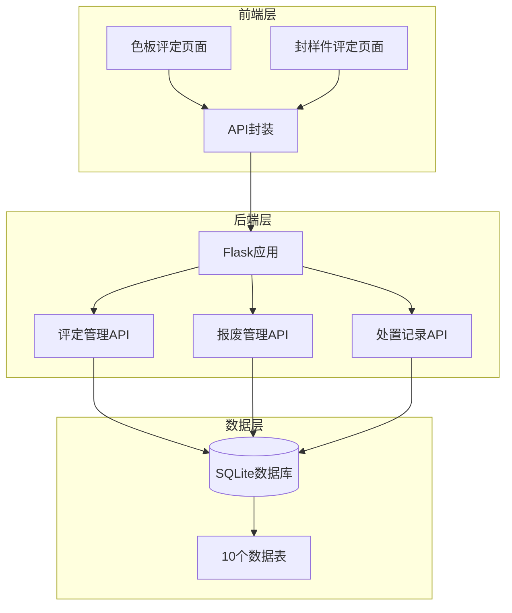
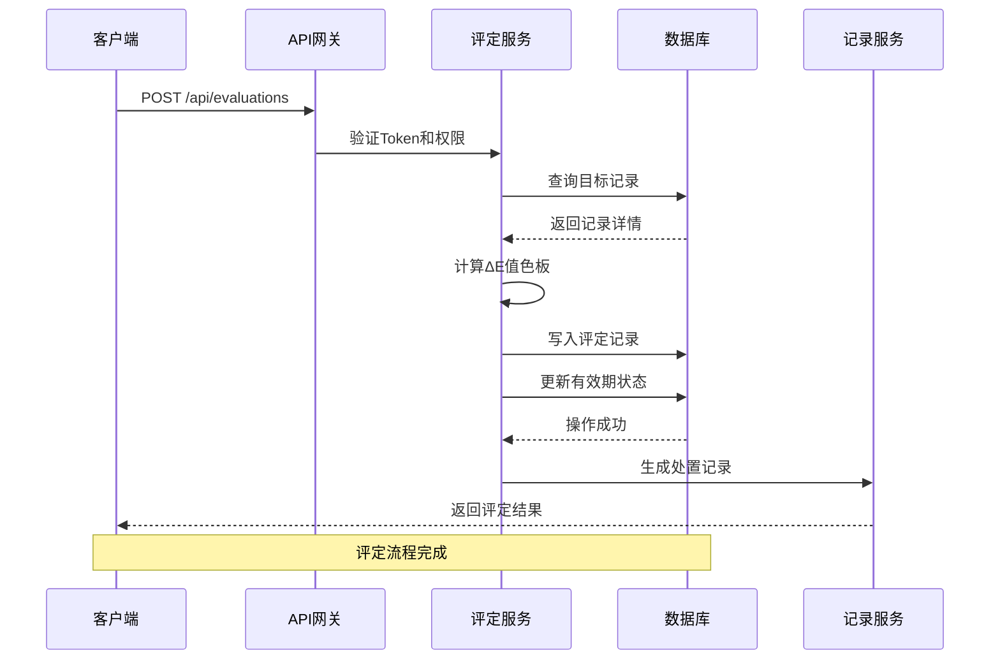
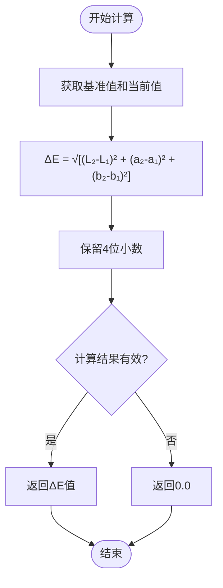
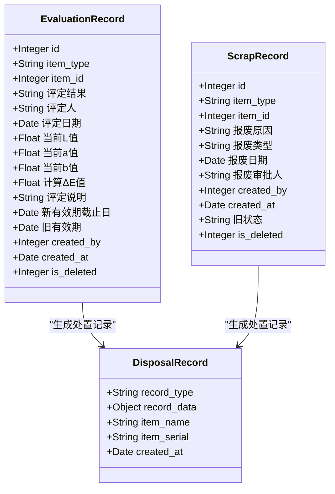
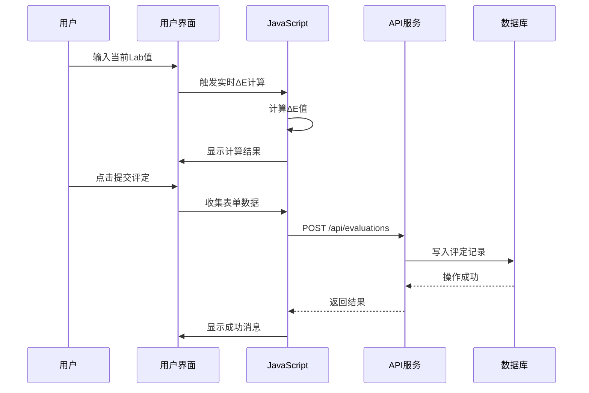
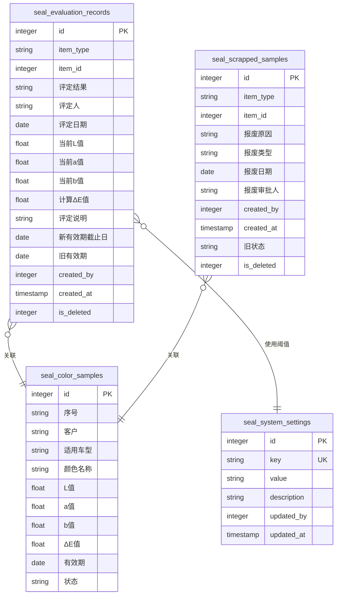

# 评定管理API

<cite>
**本文档引用的文件**
- [app.py](file://app.py)
- [requirements.txt](file://requirements.txt)
- [color-evaluation.js](file://static/js/color-evaluation.js)
- [seal-evaluation.js](file://static/js/seal-evaluation.js)
- [api.js](file://static/js/api.js)
- [color-evaluation.html](file://templates/color-evaluation.html)
</cite>

## 目录
1. [简介](#简介)
2. [项目结构](#项目结构)
3. [核心组件](#核心组件)
4. [架构概览](#架构概览)
5. [详细组件分析](#详细组件分析)
6. [依赖分析](#依赖分析)
7. [性能考虑](#性能考虑)
8. [故障排除指南](#故障排除指南)
9. [结论](#结论)
10. [附录](#附录)

## 简介
本文件为评定管理模块的详细API文档，涵盖色差评估和有效期延长相关接口。文档详细记录了评定记录的创建、查询、更新和删除功能，重点说明了评定流程的完整实现，包括评定结果录入、当前颜色值采集、ΔE值计算和有效期重新计算。同时详细描述了评定记录的数据结构、评定与色板状态的关联关系、评定历史管理功能、评定阈值配置以及完整的请求示例和响应示例。

## 项目结构
基于Flask框架的后端服务，采用SQLite数据库存储，前端使用JavaScript实现交互界面。



**图表来源**
- [app.py:1-50](file://app.py#L1-L50)
- [app.py:1210-1287](file://app.py#L1210-L1287)
- [app.py:1289-1327](file://app.py#L1289-L1327)
- [app.py:1628-2037](file://app.py#L1628-L2037)

**章节来源**
- [app.py:1-50](file://app.py#L1-L50)
- [requirements.txt:1-5](file://requirements.txt#L1-L5)

## 核心组件
评定管理模块包含以下核心组件：

### 数据模型
- **seal_evaluation_records**: 评定记录表，存储所有评定操作的历史数据
- **seal_system_settings**: 系统设置表，包含ΔE阈值配置
- **seal_color_samples**: 色板台账表，包含色差计算所需的基准Lab值
- **seal_samples**: 封样件台账表，包含有效期管理

### 核心API接口
- 评定记录查询接口：`/api/evaluations`
- 评定提交接口：`/api/evaluations`
- 报废操作接口：`/api/scrap`
- 处置记录管理接口：`/api/disposal-records`

**章节来源**
- [app.py:237-255](file://app.py#L237-L255)
- [app.py:273-307](file://app.py#L273-L307)
- [app.py:152-186](file://app.py#L152-L186)
- [app.py:129-143](file://app.py#L129-L143)

## 架构概览
评定管理模块采用分层架构设计，前后端分离，通过RESTful API进行通信。



**图表来源**
- [app.py:1226-1286](file://app.py#L1226-L1286)
- [app.py:343-348](file://app.py#L343-L348)

## 详细组件分析

### 评定记录数据结构
评定记录包含以下字段：

| 字段名 | 类型 | 描述 | 必填 |
|--------|------|------|------|
| item_type | String | 对象类型：'seal'或'color' | 是 |
| item_id | Integer | 对象ID | 是 |
| 评定结果 | String | 'pass'或'fail' | 是 |
| 评定人 | String | 评定人姓名 | 是 |
| 评定日期 | Date | 评定日期 | 是 |
| 当前L值 | Float | 当前测量L值 | 色板合格时必填 |
| 当前a值 | Float | 当前测量a值 | 色板合格时必填 |
| 当前b值 | Float | 当前测量b值 | 色板合格时必填 |
| 计算ΔE值 | Float | 自动计算的色差值 | 色板合格时必填 |
| 评定说明 | String | 评定说明 | 否 |
| 新有效期截止日 | Date | 新的有效期截止日 | 合格时必填 |
| 旧有效期 | Date | 旧的有效期（用于回滚） | 是 |
| created_by | Integer | 创建者ID | 是 |

**章节来源**
- [app.py:237-255](file://app.py#L237-L255)
- [app.py:1265-1271](file://app.py#L1265-L1271)

### ΔE色差计算算法
采用CIE76标准公式进行色差计算：



**图表来源**
- [app.py:343-348](file://app.py#L343-L348)

**章节来源**
- [app.py:343-348](file://app.py#L343-L348)

### 评定流程实现
评定流程分为合格和不合格两种情况：

#### 合格续期流程
1. **验证输入参数**：检查item_type、item_id、result等必需参数
2. **查询目标记录**：根据item_type确定查询表，获取记录详情
3. **检查状态**：确保记录状态不是'expired'
4. **计算ΔE值**（仅色板）：使用CIE76公式计算色差
5. **保存评定记录**：写入seal_evaluation_records表
6. **更新有效期**：将有效期更新为新有效期截止日
7. **状态重置**：将状态更新为'normal'

#### 不合格报废流程
1. **验证报废信息**：检查报废原因和报废类型
2. **保存报废记录**：写入seal_scrapped_samples表
3. **更新状态**：将状态更新为'scrapped'
4. **生成处置记录**：在处置记录中体现报废操作

**章节来源**
- [app.py:1226-1286](file://app.py#L1226-L1286)
- [app.py:1289-1327](file://app.py#L1289-L1327)

### 评定阈值配置
系统支持三级ΔE阈值配置：

| 阈值级别 | 配置键 | 默认值 | 颜色标识 | 描述 |
|----------|--------|--------|----------|------|
| 优秀 | delta_e_excellent | 1.0 | 绿色 | 低于此值显示绿色优秀 |
| 合格 | delta_e_good | 2.0 | 黄色 | 介于优秀和此值间显示黄色合格 |
| 需关注 | delta_e_warning | 999.0 | 红色 | 超过此值显示红色需关注 |

**章节来源**
- [app.py:295-307](file://app.py#L295-L307)
- [color-evaluation.js:6-18](file://color-evaluation.js#L6-L18)

### 评定历史管理
系统提供完整的处置记录管理功能：



**图表来源**
- [app.py:237-255](file://app.py#L237-L255)
- [app.py:257-271](file://app.py#L257-L271)
- [app.py:1628-1806](file://app.py#L1628-L1806)

**章节来源**
- [app.py:1628-1806](file://app.py#L1628-L1806)
- [app.py:1895-1941](file://app.py#L1895-L1941)

### API接口定义

#### 评定记录查询接口
**GET** `/api/evaluations`

**查询参数:**
- type (可选): 对象类型('seal'或'color')
- itemId (可选): 对象ID

**响应:**
```json
{
  "success": true,
  "data": [
    {
      "id": 1,
      "item_type": "color",
      "item_id": 101,
      "评定结果": "pass",
      "评定人": "张三",
      "评定日期": "2024-01-15",
      "当前L值": 52.34,
      "当前a值": 12.67,
      "当前b值": 8.91,
      "计算ΔE值": 1.2345,
      "评定说明": "颜色稳定，符合要求",
      "新有效期截止日": "2025-01-15",
      "旧有效期": "2024-01-15",
      "created_by": 1,
      "created_at": "2024-01-15 14:30:00"
    }
  ]
}
```

**章节来源**
- [app.py:1212-1224](file://app.py#L1212-L1224)

#### 评定提交接口
**POST** `/api/evaluations`

**请求体:**
```json
{
  "item_type": "color",
  "item_id": 101,
  "result": "pass",
  "当前L值": 52.34,
  "当前a值": 12.67,
  "当前b值": 8.91,
  "新有效期截止日": "2025-01-15",
  "评定说明": "颜色稳定，符合要求"
}
```

**响应:**
```json
{
  "success": true,
  "message": "评定提交成功(合格续期)",
  "data": {
    "deltaE": 1.2345
  }
}
```

**章节来源**
- [app.py:1226-1286](file://app.py#L1226-L1286)

#### 报废操作接口
**POST** `/api/scrap`

**请求体:**
```json
{
  "item_type": "color",
  "item_id": 101,
  "报废原因": "颜色严重变色",
  "报废类型": "变色超标(ΔE超标)"
}
```

**响应:**
```json
{
  "success": true,
  "message": "报废操作成功，该记录已锁定"
}
```

**章节来源**
- [app.py:1289-1327](file://app.py#L1289-L1327)

#### 处置记录管理接口
**GET** `/api/disposal-records`

**查询参数:**
- recordType (可选): 'evaluation'/'scrap'/'all'
- itemType (可选): 'seal'/'color'/'all'
- includeDeleted (可选): '1'包含已删除

**响应:**
```json
{
  "success": true,
  "data": {
    "items": [
      {
        "id": 1,
        "record_type": "evaluation",
        "item_type": "color",
        "item_id": 101,
        "评定结果": "pass",
        "评定人": "张三",
        "评定日期": "2024-01-15",
        "计算ΔE值": 1.2345,
        "新有效期截止日": "2025-01-15",
        "item_name": "红色涂料",
        "item_serial": "GKSB-20240115143000"
      }
    ],
    "total": 1,
    "page": 1,
    "page_size": 20,
    "total_pages": 1
  }
}
```

**章节来源**
- [app.py:1630-1806](file://app.py#L1630-L1806)

### 前端集成示例

#### 色板评定流程
前端通过JavaScript实现完整的ΔE计算和评定提交：



**图表来源**
- [color-evaluation.js:205-235](file://color-evaluation.js#L205-L235)
- [color-evaluation.js:237-267](file://color-evaluation.js#L237-L267)

**章节来源**
- [color-evaluation.js:205-235](file://color-evaluation.js#L205-L235)
- [color-evaluation.js:237-267](file://color-evaluation.js#L237-L267)

## 依赖分析

### 技术栈依赖
- **Flask**: Web框架，版本>=3.0.0
- **Flask-CORS**: 跨域支持，版本>=4.0.0  
- **PyJWT**: JWT令牌处理，版本>=2.8.0
- **openpyxl**: Excel文件处理，版本>=3.1.0

### 数据库表关系


**图表来源**
- [app.py:237-255](file://app.py#L237-L255)
- [app.py:257-271](file://app.py#L257-L271)
- [app.py:273-284](file://app.py#L273-L284)
- [app.py:152-186](file://app.py#L152-L186)

**章节来源**
- [requirements.txt:1-5](file://requirements.txt#L1-L5)
- [app.py:88-335](file://app.py#L88-L335)

## 性能考虑
1. **数据库优化**: 使用索引优化常用查询字段，如item_type、item_id、created_at
2. **缓存策略**: 前端缓存ΔE阈值配置，减少重复请求
3. **分页处理**: 大数据量查询使用分页机制，避免一次性加载过多数据
4. **并发控制**: 使用事务确保评定操作的原子性
5. **内存管理**: 及时清理不再使用的变量和DOM元素

## 故障排除指南

### 常见问题及解决方案

#### Token相关问题
- **问题**: 401未授权错误
- **原因**: Token过期或无效
- **解决**: 重新登录获取新Token

#### 数据验证错误
- **问题**: 参数缺失或格式错误
- **原因**: 必需字段未提供或类型不正确
- **解决**: 检查请求体格式，确保所有必需字段都已提供

#### 状态冲突错误
- **问题**: 记录状态不允许操作
- **原因**: 记录已报废或已过期
- **解决**: 检查记录状态，确保处于可操作状态

**章节来源**
- [app.py:49-76](file://app.py#L49-L76)
- [app.py:1240-1246](file://app.py#L1240-L1246)

## 结论
评定管理模块提供了完整的色差评估和有效期管理功能，具有以下特点：

1. **完整的生命周期管理**: 从评定到报废的全流程覆盖
2. **精确的色差计算**: 基于CIE76标准的ΔE值计算
3. **灵活的阈值配置**: 支持自定义ΔE阈值级别
4. **完善的审计功能**: 详细的处置记录和回滚机制
5. **友好的用户体验**: 实时ΔE计算和直观的状态显示

该模块为企业级的颜色管理和有效期控制提供了可靠的解决方案。

## 附录

### API使用示例

#### 获取评定记录
```bash
curl -X GET "http://localhost:5000/api/evaluations?type=color&itemId=101" \
  -H "Authorization: Bearer YOUR_TOKEN"
```

#### 提交色板评定
```bash
curl -X POST "http://localhost:5000/api/evaluations" \
  -H "Authorization: Bearer YOUR_TOKEN" \
  -H "Content-Type: application/json" \
  -d '{
    "item_type": "color",
    "item_id": 101,
    "result": "pass",
    "当前L值": 52.34,
    "当前a值": 12.67,
    "当前b值": 8.91,
    "新有效期截止日": "2025-01-15",
    "评定说明": "颜色稳定"
  }'
```

#### 获取处置记录
```bash
curl -X GET "http://localhost:5000/api/disposal-records?recordType=evaluation&page=1&page_size=20" \
  -H "Authorization: Bearer YOUR_TOKEN"
```

### 前端集成要点
1. **Token管理**: 在localStorage中存储和传递JWT Token
2. **错误处理**: 统一处理401错误，自动跳转登录页面
3. **实时计算**: 使用前端JavaScript进行ΔE值的实时计算
4. **状态同步**: 评定成功后及时更新页面状态

**章节来源**
- [api.js:44-65](file://api.js#L44-L65)
- [color-evaluation.js:237-267](file://color-evaluation.js#L237-L267)