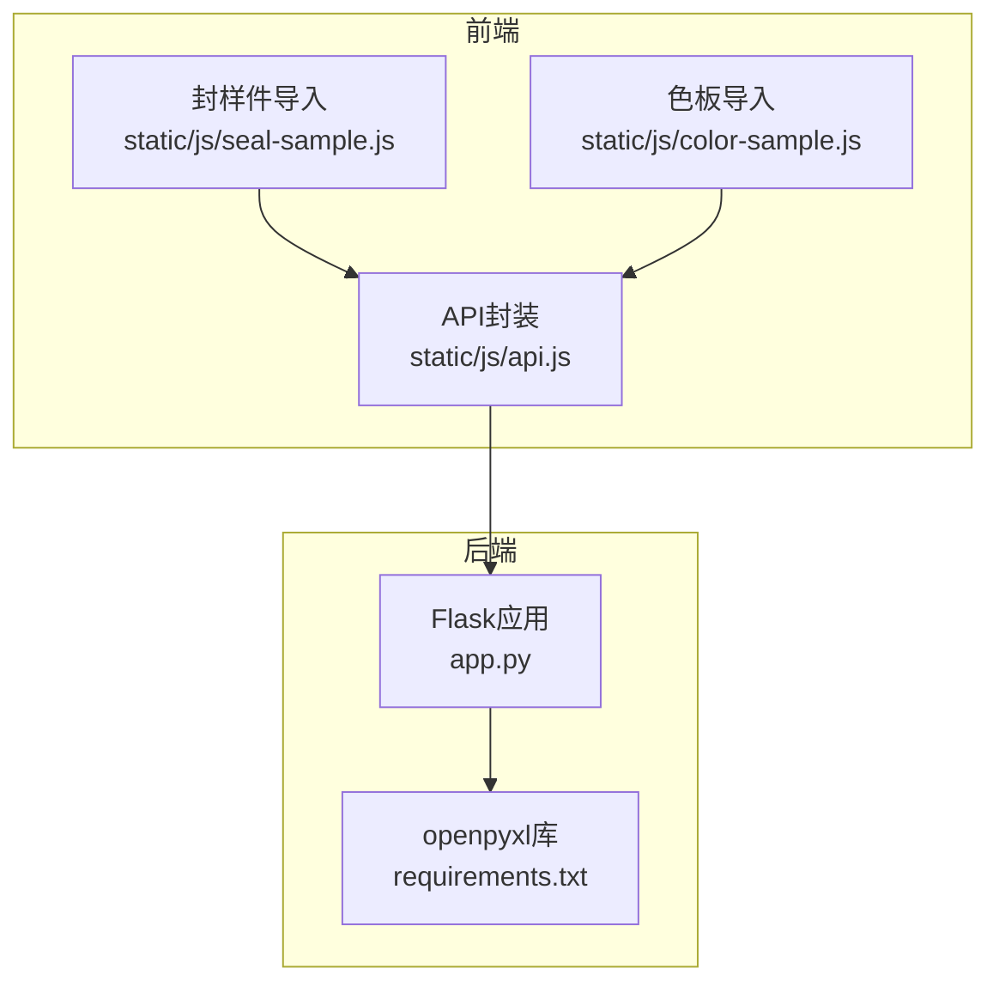
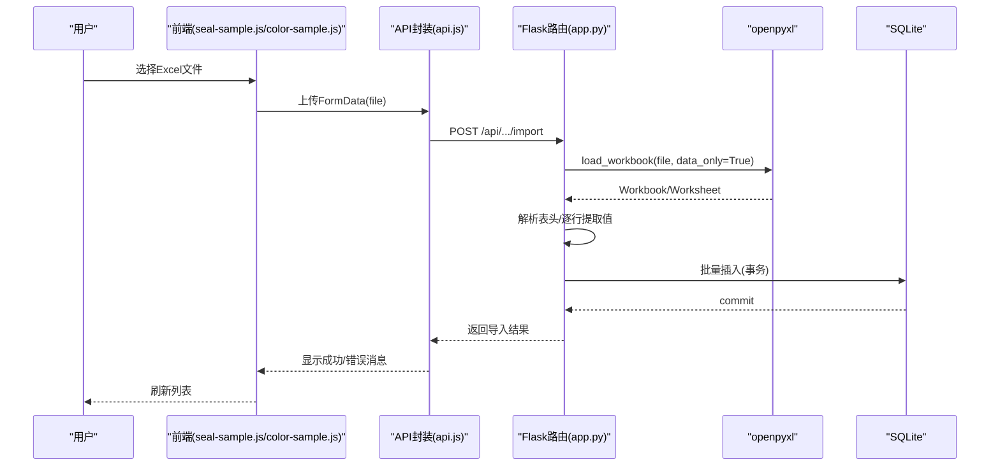
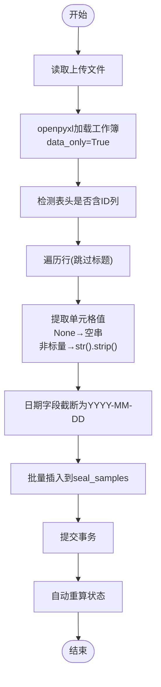
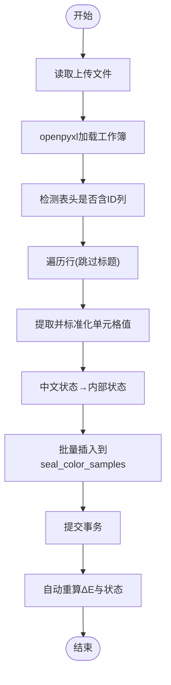
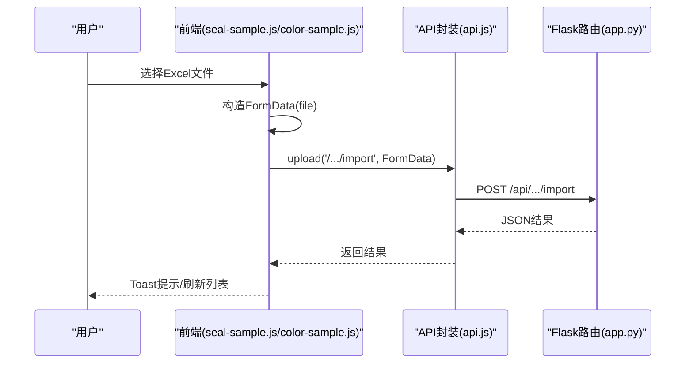
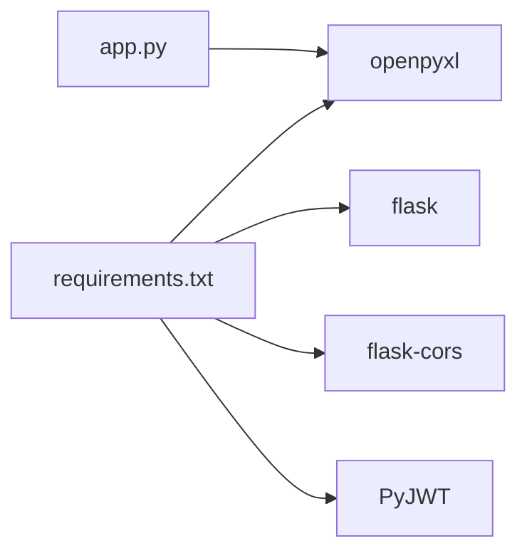

# Excel导入功能

<cite>
**本文引用的文件**
- [app.py](file://app.py)
- [requirements.txt](file://requirements.txt)
- [api.js](file://static/js/api.js)
- [seal-sample.js](file://static/js/seal-sample.js)
- [color-sample.js](file://static/js/color-sample.js)
</cite>

## 目录
1. [简介](#简介)
2. [项目结构](#项目结构)
3. [核心组件](#核心组件)
4. [架构总览](#架构总览)
5. [详细组件分析](#详细组件分析)
6. [依赖分析](#依赖分析)
7. [性能考虑](#性能考虑)
8. [故障排查指南](#故障排查指南)
9. [结论](#结论)
10. [附录](#附录)

## 简介
本文件面向“封样件及色板接收登记管理系统”的Excel导入功能，基于后端Flask + openpyxl实现，覆盖以下主题：
- 文件上传处理与工作簿加载
- 工作表解析与数据提取
- 数据类型转换、空值处理与异常数据过滤
- 导入模板设计规范与字段映射
- 数据验证规则（必填、格式、业务规则、完整性）
- 批量插入与事务处理策略（错误处理、部分成功）
- 性能优化建议（大文件、内存、并发）
- 扩展与自定义验证规则实现思路

## 项目结构
后端采用单体Flask应用，核心逻辑集中在app.py；前端通过静态JS文件与后端交互，导入功能通过API触发。

图表来源
- [app.py:1-25](file://app.py#L1-L25)
- [requirements.txt:1-5](file://requirements.txt#L1-L5)
- [api.js:1-88](file://static/js/api.js#L1-L88)
- [seal-sample.js:164-175](file://static/js/seal-sample.js#L164-L175)
- [color-sample.js:258-263](file://static/js/color-sample.js#L258-L263)

章节来源
- [app.py:1-25](file://app.py#L1-L25)
- [requirements.txt:1-5](file://requirements.txt#L1-L5)
- [api.js:1-88](file://static/js/api.js#L1-L88)
- [seal-sample.js:164-175](file://static/js/seal-sample.js#L164-L175)
- [color-sample.js:258-263](file://static/js/color-sample.js#L258-L263)

## 核心组件
- 后端导入接口
  - 封样件导入：/api/seal-samples/import
  - 色板导入：/api/color-samples/import
- 前端导入触发
  - 封样件页面：监听导入按钮，构造FormData并调用API.upload
  - 色板页面：同上
- openpyxl集成
  - 加载Excel工作簿，读取活动表，逐行解析
  - 日期字段截断为YYYY-MM-DD，提醒天数默认30，状态默认normal
  - 色板导入支持中文状态映射与ΔE补算

章节来源
- [app.py:720-795](file://app.py#L720-L795)
- [app.py:953-1041](file://app.py#L953-L1041)
- [api.js:67-83](file://static/js/api.js#L67-L83)
- [seal-sample.js:168-174](file://static/js/seal-sample.js#L168-L174)
- [color-sample.js:259-262](file://static/js/color-sample.js#L259-L262)

## 架构总览
导入流程从浏览器发起，经前端API封装，到达后端Flask路由，使用openpyxl解析Excel，再写入SQLite数据库。

图表来源
- [seal-sample.js:168-174](file://static/js/seal-sample.js#L168-L174)
- [color-sample.js:259-262](file://static/js/color-sample.js#L259-L262)
- [api.js:67-83](file://static/js/api.js#L67-L83)
- [app.py:720-795](file://app.py#L720-L795)
- [app.py:953-1041](file://app.py#L953-L1041)

## 详细组件分析

### 后端导入接口（封样件）
- 请求方式：POST /api/seal-samples/import
- 关键步骤
  - 读取上传文件
  - 使用openpyxl加载工作簿，data_only=True避免公式
  - 读取第一行检测是否包含ID列（兼容导出文件重新导入）
  - 逐行提取单元格值，None转空字符串，非标量尝试str().strip()
  - 日期字段截断为YYYY-MM-DD
  - 插入字段：序号、项目、封样件名称、签署人、签署人日期、有效期、提醒天数、备注、状态(normal)
  - 提交事务
  - 自动重算：根据有效期+提醒天数更新真实状态
  - 错误收集：捕获每行异常，返回部分成功提示

图表来源
- [app.py:720-795](file://app.py#L720-L795)

章节来源
- [app.py:720-795](file://app.py#L720-L795)

### 后端导入接口（色板）
- 请求方式：POST /api/color-samples/import
- 关键步骤
  - 读取上传文件
  - 加载工作簿，读取活动表
  - 检测表头是否含ID列
  - 逐行提取并标准化单元格值
  - 状态字段中文映射为数据库内部值
  - 插入全部字段（除系统自动生成列）
  - 提交事务
  - 自动重算：若ΔE为空则根据ΔL/Δa/Δb补算，同时按有效期+提醒天数重算状态

图表来源
- [app.py:953-1041](file://app.py#L953-L1041)

章节来源
- [app.py:953-1041](file://app.py#L953-L1041)

### 前端导入触发与上传
- 封样件页面：监听导入按钮change事件，构造FormData并调用API.upload
- 色板页面：同上
- API.upload使用multipart/form-data，自动附加JWT Token

图表来源
- [seal-sample.js:168-174](file://static/js/seal-sample.js#L168-L174)
- [color-sample.js:259-262](file://static/js/color-sample.js#L259-L262)
- [api.js:67-83](file://static/js/api.js#L67-L83)

章节来源
- [seal-sample.js:168-174](file://static/js/seal-sample.js#L168-L174)
- [color-sample.js:259-262](file://static/js/color-sample.js#L259-L262)
- [api.js:67-83](file://static/js/api.js#L67-L83)

### 数据解析机制与类型转换
- 单元格值提取
  - None → 空字符串
  - int/float/str/bool → str().strip()
  - 其他类型尝试str().strip()，失败则空字符串
- 日期字段
  - 截断为YYYY-MM-DD（长度≥10）
- 数值字段
  - 提醒天数：非数字→30
- 状态字段
  - 封样件：默认normal
  - 色板：中文映射为数据库内部值，空则默认normal

章节来源
- [app.py:734-771](file://app.py#L734-L771)
- [app.py:967-1008](file://app.py#L967-L1008)

### 导入模板设计规范
- 封样件模板字段（与导出一致）
  - 序号、项目、封样件名称、签署人、签署人日期、有效期、提醒天数、备注
  - 状态默认normal，创建时间由数据库生成
- 色板模板字段（与导出一致）
  - 全部字段（除ID、创建/更新时间等系统列）
  - 状态字段支持中文输入（自动映射）

章节来源
- [app.py:756-758](file://app.py#L756-L758)
- [app.py:989-993](file://app.py#L989-L993)

### 数据验证规则
- 必填字段检查
  - 封样件：项目、封样件名称、签署人、签署人日期、有效期
  - 色板：客户、适用车型、颜色名称、接收数量、有效期
- 格式验证
  - 日期字段：YYYY-MM-DD
  - 数值字段：接收数量、当前持有数量、提醒天数
- 业务规则验证
  - 色板导入：若ΔE为空且ΔL/Δa/Δb存在，则自动补算ΔE
  - 状态：根据有效期+提醒天数自动计算真实状态
- 数据完整性校验
  - 跳过空行与全空行
  - ID列兼容：若表头含ID则跳过第一列

章节来源
- [app.py:629-632](file://app.py#L629-L632)
- [app.py:847-850](file://app.py#L847-L850)
- [app.py:1011-1034](file://app.py#L1011-L1034)

### 批量插入与事务处理
- 批量插入
  - 逐行拼接值列表，一次性INSERT
- 事务处理
  - 每次导入独立事务，commit后自动重算
- 错误处理
  - 捕获每行异常，记录行号与前几列摘要
  - 成功计数与错误计数汇总，返回部分成功提示
- 部分成功处理
  - 成功导入条数 + 跳过条数 + 首条错误摘要

章节来源
- [app.py:754-792](file://app.py#L754-L792)
- [app.py:987-1038](file://app.py#L987-L1038)

## 依赖分析
- openpyxl版本要求：>=3.1.0
- Flask运行时依赖：flask, flask-cors, PyJWT
- 导入库：openpyxl用于Excel解析

图表来源
- [requirements.txt:1-5](file://requirements.txt#L1-L5)
- [app.py:18-19](file://app.py#L18-L19)

章节来源
- [requirements.txt:1-5](file://requirements.txt#L1-L5)
- [app.py:18-19](file://app.py#L18-L19)

## 性能考虑
- 大文件处理
  - openpyxl加载时使用data_only=True，避免公式计算开销
  - 逐行迭代ws.iter_rows(min_row=2)，避免一次性读取整表
- 内存管理
  - 逐行提取值并立即插入，不缓存整表
  - 异常捕获在行级别，避免异常传播导致内存占用上升
- 并发控制
  - 导入接口无显式锁，建议前端限制同时只能有一个导入任务
  - 可在后端增加队列或令牌桶限流（扩展建议）
- 批量插入优化
  - 使用一次性INSERT占位符，减少往返次数
  - 事务一次性提交，降低磁盘写入成本

章节来源
- [app.py:727-751](file://app.py#L727-L751)
- [app.py:960-984](file://app.py#L960-L984)

## 故障排查指南
- 常见问题
  - 未选择文件：返回“请选择要导入的文件”或“请选择文件”
  - Token无效/过期：401，前端自动跳转登录
  - Excel格式不符：逐行解析失败，返回部分成功与首条错误
  - 日期格式错误：截断为YYYY-MM-DD，非法日期将导致插入失败
  - 数值格式错误：提醒天数非数字→默认30
- 建议排查步骤
  - 确认模板字段与顺序与导出一致
  - 检查日期字段是否为标准日期格式
  - 检查必填字段是否为空
  - 查看返回消息中的“跳过条数”和“首条错误”

章节来源
- [app.py:723-726](file://app.py#L723-L726)
- [app.py:956-958](file://app.py#L956-L958)
- [api.js:20-33](file://static/js/api.js#L20-L33)

## 结论
本导入功能以openpyxl为核心，结合Flask路由与SQLite，实现了稳定、可扩展的Excel导入能力。通过逐行解析、类型转换与异常捕获，确保在复杂场景下的鲁棒性；通过自动重算与部分成功提示，提升用户体验。建议在生产环境中配合前端并发限制与后端限流策略，进一步提升稳定性与性能。

## 附录

### 导入模板字段对照（示例）
- 封样件
  - 序号、项目、封样件名称、签署人、签署人日期、有效期、提醒天数、备注
- 色板
  - 客户、适用车型、颜色名称、样板供应商、颜色色值转化码、纹理代码、光泽度、供应商代码、制作信息、接收数量、当前持有数量、接收日期、使用的光源角度、L值、a值、b值、c值、h值、ΔL值、Δa值、Δb值、Δc值、Δh值、ΔE值、有效期、提醒天数、状态、备注

章节来源
- [app.py:756-758](file://app.py#L756-L758)
- [app.py:989-993](file://app.py#L989-L993)