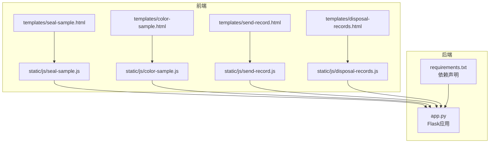
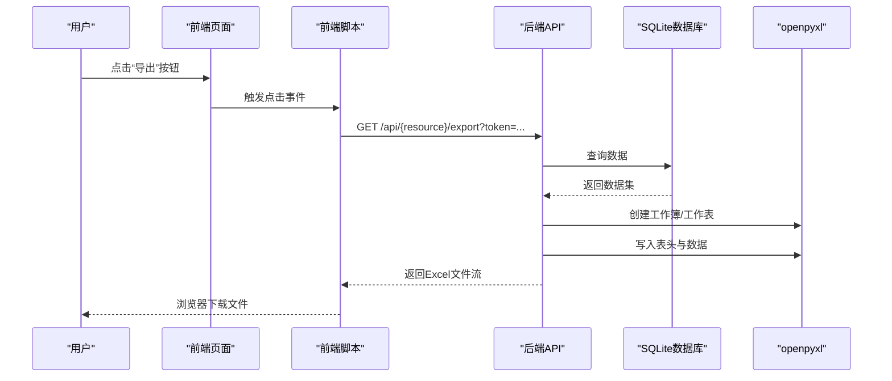
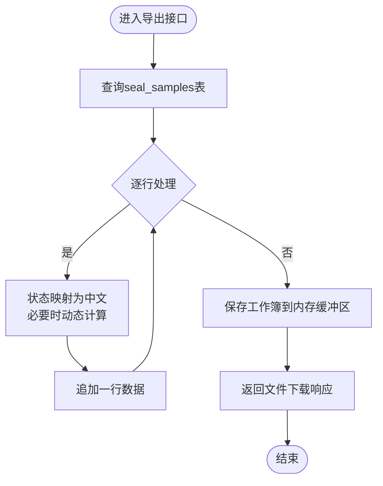
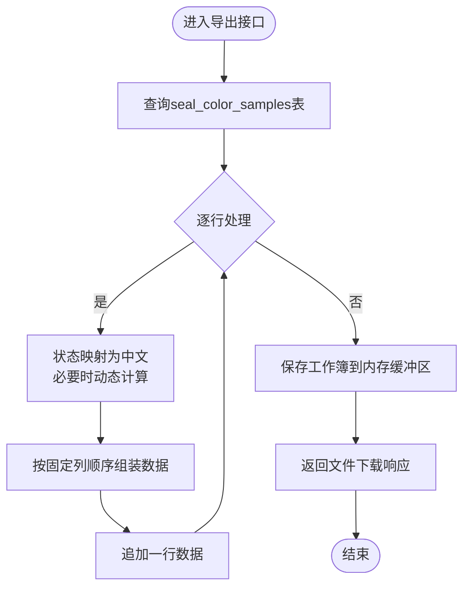
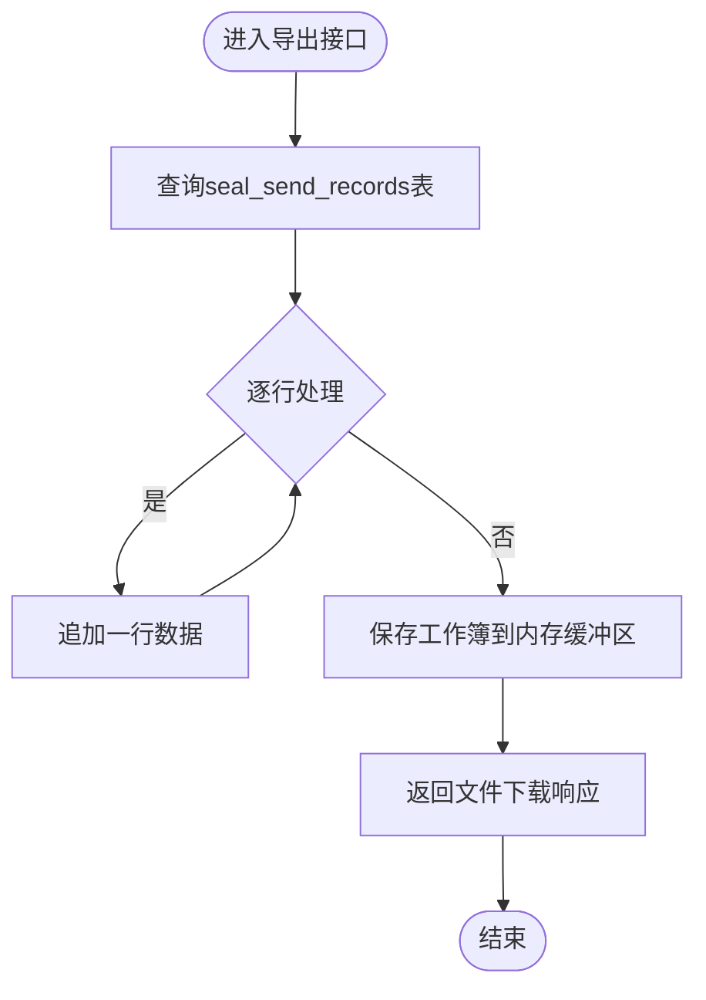
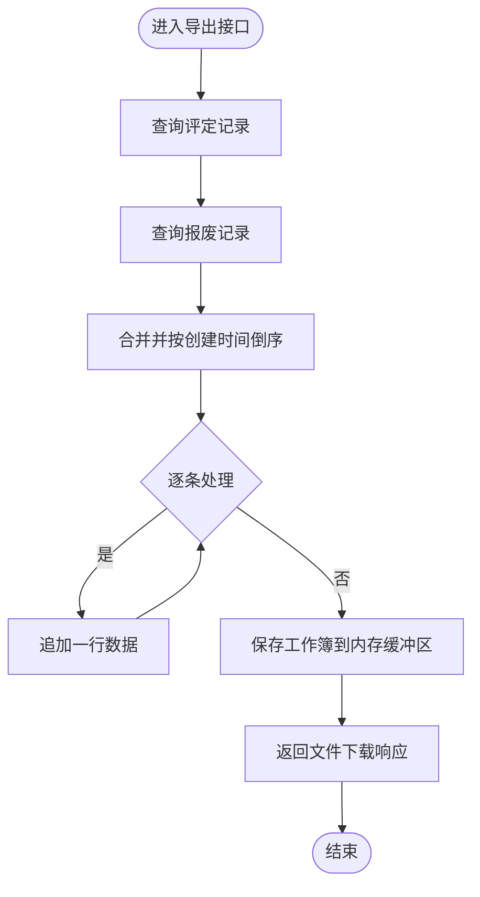
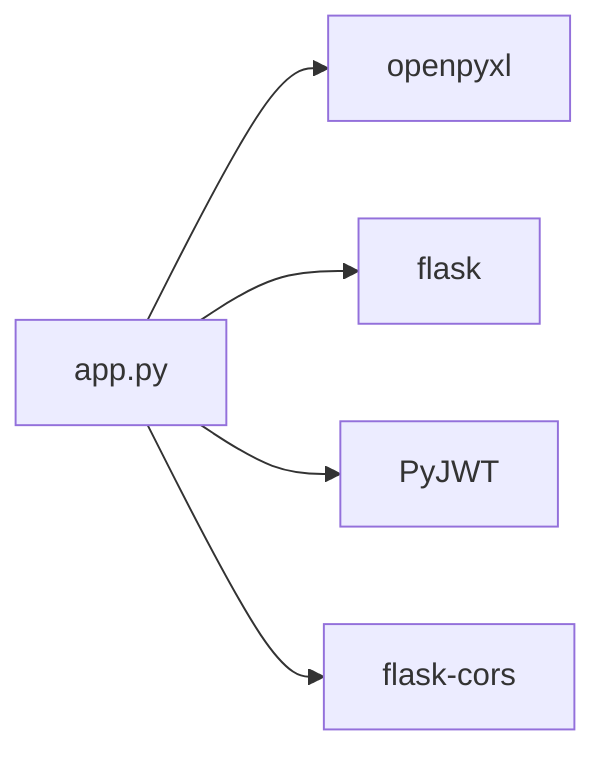

# Excel导出功能

<cite>
**本文引用的文件**
- [app.py](file://app.py)
- [requirements.txt](file://requirements.txt)
- [templates/seal-sample.html](file://templates/seal-sample.html)
- [templates/color-sample.html](file://templates/color-sample.html)
- [templates/send-record.html](file://templates/send-record.html)
- [templates/disposal-records.html](file://templates/disposal-records.html)
- [static/js/seal-sample.js](file://static/js/seal-sample.js)
- [static/js/color-sample.js](file://static/js/color-sample.js)
- [static/js/send-record.js](file://static/js/send-record.js)
- [static/js/disposal-records.js](file://static/js/disposal-records.js)
</cite>

## 目录
1. [简介](#简介)
2. [项目结构](#项目结构)
3. [核心组件](#核心组件)
4. [架构总览](#架构总览)
5. [详细组件分析](#详细组件分析)
6. [依赖分析](#依赖分析)
7. [性能考虑](#性能考虑)
8. [故障排查指南](#故障排查指南)
9. [结论](#结论)
10. [附录](#附录)

## 简介
本文件面向“封样件及色板接收登记管理系统”的Excel导出功能，基于Flask后端与openpyxl库实现。文档覆盖以下主题：
- openpyxl在导出流程中的使用方法：工作簿创建、工作表配置、样式设置与数据写入
- 数据格式化策略：日期格式处理、数值格式化、状态字段映射、中文显示处理
- 模板设计规范：表头样式、数据区域格式、边框设置与颜色配置
- 完整导出接口实现：RESTful API设计、响应格式处理与文件下载机制
- 性能优化策略：大数据量分批处理、内存使用优化与并发导出控制
- 错误处理机制与异常情况处理
- 定制化指导：自定义模板、动态列配置与格式调整方法

## 项目结构
后端采用Flask框架，导出逻辑集中在后端API中；前端通过按钮触发后端导出接口，并以浏览器下载的方式获取Excel文件。

图表来源
- [app.py](file://app.py)
- [requirements.txt](file://requirements.txt)
- [templates/seal-sample.html](file://templates/seal-sample.html)
- [templates/color-sample.html](file://templates/color-sample.html)
- [templates/send-record.html](file://templates/send-record.html)
- [templates/disposal-records.html](file://templates/disposal-records.html)
- [static/js/seal-sample.js](file://static/js/seal-sample.js)
- [static/js/color-sample.js](file://static/js/color-sample.js)
- [static/js/send-record.js](file://static/js/send-record.js)
- [static/js/disposal-records.js](file://static/js/disposal-records.js)

章节来源
- [app.py](file://app.py)
- [requirements.txt](file://requirements.txt)

## 核心组件
- Flask后端导出API
  - 封样件导出：/api/seal-samples/export
  - 色板导出：/api/color-samples/export
  - 寄件记录导出：/api/send-records/export
  - 处置记录导出：/api/disposal-records/export
- openpyxl导出实现
  - 工作簿创建与激活
  - 表头写入与数据遍历
  - 文件流式输出与下载
- 前端触发与下载
  - 页面按钮绑定点击事件
  - 通过window.open或send_file触发下载

章节来源
- [app.py](file://app.py)
- [static/js/seal-sample.js](file://static/js/seal-sample.js)
- [static/js/color-sample.js](file://static/js/color-sample.js)
- [static/js/send-record.js](file://static/js/send-record.js)
- [static/js/disposal-records.js](file://static/js/disposal-records.js)

## 架构总览
后端导出流程采用“查询数据 -> 构造工作簿 -> 写入表头与数据 -> 流式返回文件”的模式。前端通过按钮触发GET请求，后端返回二进制Excel文件，浏览器自动下载。

图表来源
- [app.py](file://app.py)
- [static/js/seal-sample.js](file://static/js/seal-sample.js)
- [static/js/color-sample.js](file://static/js/color-sample.js)
- [static/js/send-record.js](file://static/js/send-record.js)
- [static/js/disposal-records.js](file://static/js/disposal-records.js)

## 详细组件分析

### 封样件导出（/api/seal-samples/export）
- 数据源：查询seal_samples表，按ID倒序
- 状态映射：将内部状态(normal/pending_eval/expired/scrapped)映射为中文
- 动态状态计算：当状态为normal时，依据有效期与提醒天数动态计算真实状态
- 表头与数据：固定表头包含ID、序号、项目、封样件名称、签署人、签署人日期、有效期、提醒天数、状态、备注、创建时间
- 输出：将工作簿保存到BytesIO缓冲区，seek(0)后通过send_file返回

图表来源
- [app.py](file://app.py)

章节来源
- [app.py](file://app.py)

### 色板导出（/api/color-samples/export）
- 数据源：查询seal_color_samples表，按ID倒序
- 状态映射：同上，支持中文映射与动态计算
- 表头与数据：固定表头包含序号、客户、适用车型、颜色名称、样板供应商、颜色色值转化码、纹理代码、光泽度、供应商代码、制作信息、接收数量、当前持有数量、接收日期、使用的光源角度、L/a/b/c/h/ΔL/Δa/Δb/Δc/Δh/ΔE、有效期、提醒天数、状态、备注
- 输出：同上，返回Excel文件

图表来源
- [app.py](file://app.py)

章节来源
- [app.py](file://app.py)

### 寄件记录导出（/api/send-records/export）
- 数据源：查询seal_send_records表，按ID倒序
- 表头与数据：固定表头包含ID、色板ID、客户、颜色名称、对方单位、寄出数量、寄出日期、经手人、备注、创建时间
- 输出：同上，返回Excel文件

图表来源
- [app.py](file://app.py)

章节来源
- [app.py](file://app.py)

### 处置记录导出（/api/disposal-records/export）
- 数据源：联合查询seal_evaluation_records与seal_scrapped_samples，按创建时间倒序合并
- 表头与数据：固定表头包含记录类型、对象类型、编号、名称、结果/原因、报废类型、评定人/审批人、评定日期/报废日期、ΔE值、新有效期截止日、评定说明/备注、创建时间
- 输出：同上，返回Excel文件

图表来源
- [app.py](file://app.py)

章节来源
- [app.py](file://app.py)

### 前端触发与下载机制
- 页面按钮绑定点击事件，构造带token的URL并打开窗口触发下载
- 导出按钮位于各业务页面的工具栏中，分别对应不同资源的导出接口

章节来源
- [templates/seal-sample.html](file://templates/seal-sample.html)
- [templates/color-sample.html](file://templates/color-sample.html)
- [templates/send-record.html](file://templates/send-record.html)
- [templates/disposal-records.html](file://templates/disposal-records.html)
- [static/js/seal-sample.js](file://static/js/seal-sample.js)
- [static/js/color-sample.js](file://static/js/color-sample.js)
- [static/js/send-record.js](file://static/js/send-record.js)
- [static/js/disposal-records.js](file://static/js/disposal-records.js)

## 依赖分析
- openpyxl版本要求：>=3.1.0
- Flask相关依赖：flask>=3.0.0、flask-cors>=4.0.0、PyJWT>=2.8.0
- 导出功能直接依赖openpyxl进行工作簿创建与保存，依赖Flask的send_file进行文件下载

图表来源
- [app.py](file://app.py)
- [requirements.txt](file://requirements.txt)

章节来源
- [requirements.txt](file://requirements.txt)

## 性能考虑
- 内存使用优化
  - 使用BytesIO作为内存缓冲区，避免临时磁盘文件
  - 逐行写入，避免一次性加载全部数据到内存
- 大数据量分批处理
  - 当前实现为一次性查询并导出，建议在数据量较大时引入分页或流式游标
- 并发导出控制
  - 可在应用层增加导出队列或令牌桶限制，防止高并发导致内存峰值过高
- I/O与序列化
  - openpyxl写入为内存操作，性能主要受数据量与CPU影响；可考虑压缩级别或异步任务队列

[本节为通用性能建议，不直接分析具体文件]

## 故障排查指南
- 导出接口返回401未授权
  - 检查前端是否携带token参数或Authorization头
  - 确认token有效且未过期
- 导出接口返回500服务器错误
  - 检查数据库连接与查询语句
  - 检查openpyxl写入过程中的异常
- 下载文件为空或损坏
  - 确认工作簿保存到BytesIO后seek(0)
  - 确认send_file的mimetype与文件扩展名一致
- 中文显示乱码
  - openpyxl写入字符串时确保编码正确
  - 浏览器下载时检查Content-Type与字符集

章节来源
- [app.py](file://app.py)

## 结论
本系统基于Flask与openpyxl实现了稳定可靠的Excel导出功能，覆盖封样件、色板、寄出记录与处置记录四大业务场景。通过明确的数据格式化策略与统一的下载机制，满足了日常办公与审计需求。后续可在大数据量场景下引入分页与异步导出，进一步提升性能与稳定性。

[本节为总结性内容，不直接分析具体文件]

## 附录

### 数据格式化策略
- 日期格式处理
  - 导入时对日期字段进行YYYY-MM-DD截取，保证一致性
  - 导出时保持数据库日期格式，交由Excel解析
- 数值格式化
  - 数值字段按原始值写入，由Excel默认格式展示
  - 色差ΔE值在导入时可自动计算，导出时保留
- 状态字段映射
  - 内部状态与中文状态双向映射，导出时统一为中文
  - normal状态在导出前动态计算真实状态
- 中文显示处理
  - 表头与数据均为中文，确保跨平台兼容

章节来源
- [app.py](file://app.py)

### 模板设计规范
- 表头样式
  - 固定表头，包含业务关键字段，便于导入/导出一致性
- 数据区域格式
  - 按固定列顺序写入，避免多余系统字段
- 边框与颜色
  - 当前实现未设置显式边框与颜色，如需可扩展openpyxl样式对象
- 文件命名
  - 导出文件名包含业务含义，便于识别

章节来源
- [app.py](file://app.py)

### 定制化指导
- 自定义模板
  - 在现有表头基础上增加或删除列，需同步修改导出与导入逻辑
- 动态列配置
  - 建议在前端维护列配置，后端按配置顺序取字段
- 格式调整
  - 可通过openpyxl的Font、Alignment、PatternFill、Border等对象设置样式
  - 注意样式设置会增加内存与CPU开销，建议仅在必要时启用

章节来源
- [app.py](file://app.py)