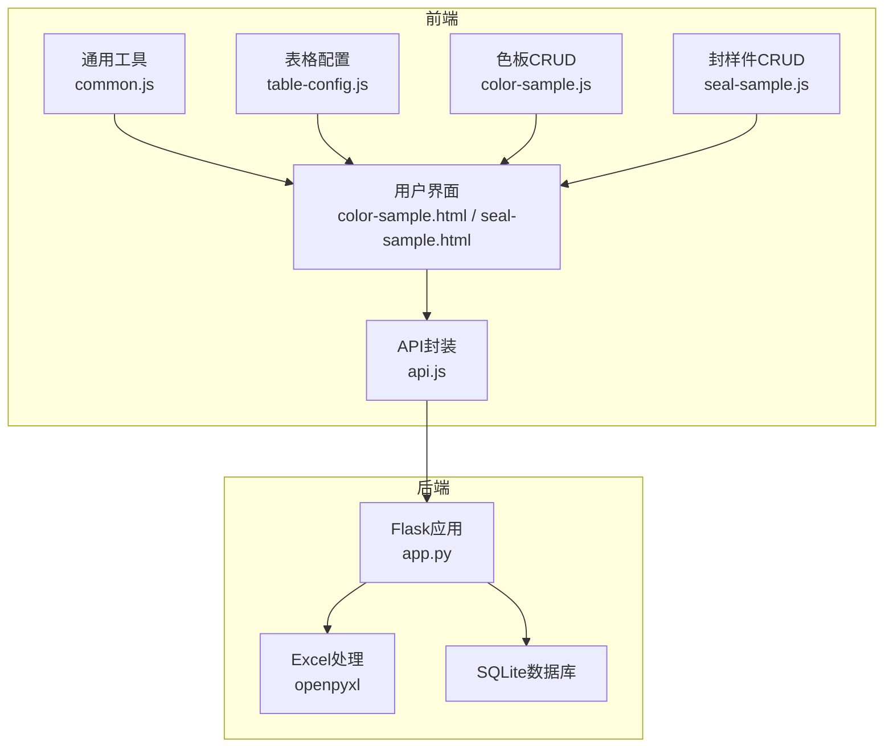
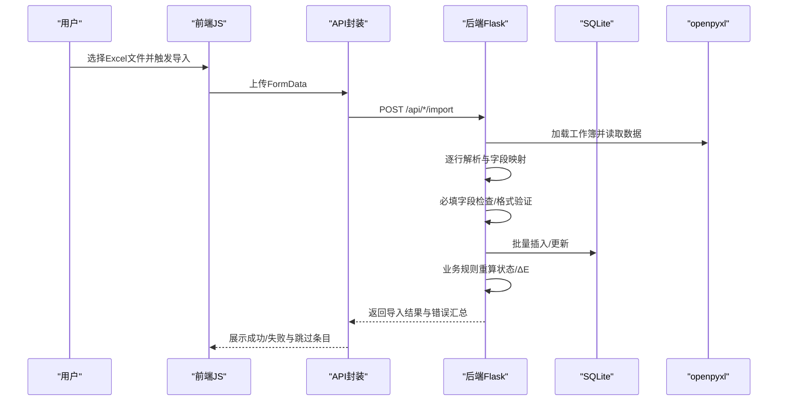
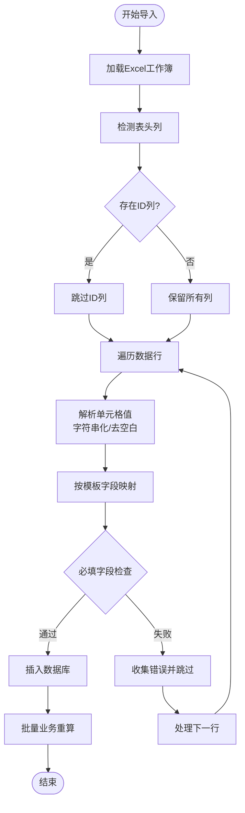
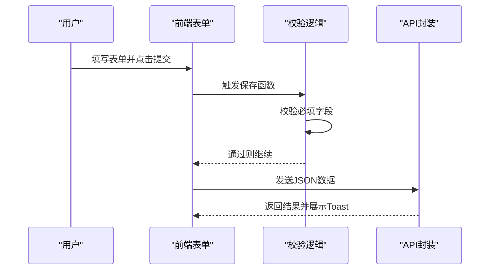
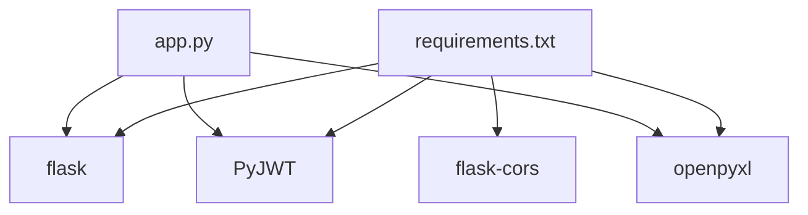

# Excel数据验证机制

<cite>
**本文档引用的文件**
- [app.py](file://app.py)
- [requirements.txt](file://requirements.txt)
- [common.js](file://static/js/common.js)
- [api.js](file://static/js/api.js)
- [table-config.js](file://static/js/table-config.js)
- [color-sample.js](file://static/js/color-sample.js)
- [seal-sample.js](file://static/js/seal-sample.js)
- [color-sample.html](file://templates/color-sample.html)
- [seal-sample.html](file://templates/seal-sample.html)
</cite>

## 目录
1. [简介](#简介)
2. [项目结构](#项目结构)
3. [核心组件](#核心组件)
4. [架构总览](#架构总览)
5. [详细组件分析](#详细组件分析)
6. [依赖分析](#依赖分析)
7. [性能考虑](#性能考虑)
8. [故障排除指南](#故障排除指南)
9. [结论](#结论)
10. [附录](#附录)

## 简介
本文件针对封样件及色板接收登记管理系统中的Excel数据验证机制进行深入解析，涵盖前端验证、后端验证与业务规则验证的协同工作方式，详细说明必填字段检查、格式验证、业务规则验证、错误处理与异常数据处理策略，以及批量验证的性能优化方法与扩展定制指导。系统采用Flask后端配合SQLite数据库，前端使用原生JavaScript实现数据导入导出与实时校验。

## 项目结构
系统采用前后端分离架构，后端负责数据模型、业务逻辑与Excel导入导出；前端负责用户交互、表单验证与数据展示。

**图表来源**
- [app.py:1-25](file://app.py#L1-L25)
- [requirements.txt:1-5](file://requirements.txt#L1-L5)
- [api.js:1-88](file://static/js/api.js#L1-L88)
- [common.js:1-135](file://static/js/common.js#L1-L135)
- [table-config.js:1-552](file://static/js/table-config.js#L1-L552)
- [color-sample.js:1-267](file://static/js/color-sample.js#L1-L267)
- [seal-sample.js:1-181](file://static/js/seal-sample.js#L1-L181)
- [color-sample.html:1-42](file://templates/color-sample.html#L1-L42)
- [seal-sample.html:1-45](file://templates/seal-sample.html#L1-L45)

**章节来源**
- [app.py:1-25](file://app.py#L1-L25)
- [requirements.txt:1-5](file://requirements.txt#L1-L5)

## 核心组件
- Excel导入导出：基于openpyxl实现，支持模板字段映射、状态计算与批量写入。
- 前端表单验证：HTML5原生必填校验与JavaScript二次校验，确保字段完整性与格式正确性。
- 后端数据校验：必填字段检查、日期格式处理、数值范围与默认值设置。
- 业务规则验证：有效期状态计算、库存控制、状态转换与关联数据一致性检查。
- 错误处理与异常数据跳过：逐行解析与错误收集，保证整体导入成功与提示信息反馈。
- 性能优化：批量写入、状态重算与增量处理，降低数据库压力。

**章节来源**
- [app.py:720-1040](file://app.py#L720-L1040)
- [color-sample.js:190-245](file://static/js/color-sample.js#L190-L245)
- [seal-sample.js:124-139](file://static/js/seal-sample.js#L124-L139)

## 架构总览
Excel数据验证的多层次架构如下：

**图表来源**
- [api.js:67-83](file://static/js/api.js#L67-L83)
- [app.py:720-1040](file://app.py#L720-L1040)
- [color-sample.js:259-262](file://static/js/color-sample.js#L259-L262)
- [seal-sample.js:168-174](file://static/js/seal-sample.js#L168-L174)

## 详细组件分析

### Excel导入流程与验证机制
- 文件读取：使用openpyxl加载工作簿，data_only=True确保读取单元格值而非公式。
- 表头检测：识别是否存在ID列，若存在则跳过ID列以适配导出模板。
- 行解析：遍历数据行，统一将单元格值转换为字符串并去除空白，空值统一为''。
- 字段映射：按导出模板字段顺序提取值，确保字段对齐。
- 必填检查：在后端对关键字段进行存在性与非空检查，缺失则记录错误并跳过该行。
- 格式处理：日期字段截断为YYYY-MM-DD格式，提醒天数转换为整数，默认30。
- 业务重算：导入完成后对新增记录进行状态重算与ΔE补算。

**图表来源**
- [app.py:720-1040](file://app.py#L720-L1040)

**章节来源**
- [app.py:720-1040](file://app.py#L720-L1040)

### 前端验证与用户体验
- HTML5必填属性：表单字段设置required，浏览器原生阻止空提交。
- JavaScript二次校验：在提交前再次检查必填字段，确保数据完整性。
- 实时计算：色板ΔE值根据ΔL、Δa、Δb自动计算，输入变化即时更新。
- 数量与日期联动：新增时签署人日期变化自动推导有效期（+1年）。
- 导入交互：选择文件后触发上传，成功/失败消息提示，错误条目首条展示。

**图表来源**
- [color-sample.js:190-199](file://static/js/color-sample.js#L190-L199)
- [seal-sample.js:124-139](file://static/js/seal-sample.js#L124-L139)
- [common.js:25-33](file://static/js/common.js#L25-L33)

**章节来源**
- [color-sample.js:108-185](file://static/js/color-sample.js#L108-L185)
- [seal-sample.js:65-107](file://static/js/seal-sample.js#L65-L107)
- [common.js:25-33](file://static/js/common.js#L25-L33)

### 后端验证与数据规范化
- 必填字段检查：在创建接口中对关键字段进行存在性与非空校验，缺失则返回400。
- 默认值设置：未提供提醒天数时默认30；状态默认normal；序号自动生成。
- 格式验证：日期字段标准化为YYYY-MM-DD；数值字段转换为整数或浮点数。
- SQL注入防护：动态筛选参数中对字段名进行白名单过滤与安全映射。
- 批量写入：使用事务一次性提交，提升性能并保证一致性。

**章节来源**
- [app.py:625-646](file://app.py#L625-L646)
- [app.py:843-868](file://app.py#L843-L868)
- [app.py:403-449](file://app.py#L403-L449)

### 业务规则验证
- 有效期状态计算：根据有效期与提醒天数动态计算状态（正常/待评定/已过期）。
- 库存控制：寄出数量必须不超过当前持有数量，超量则拒绝。
- 状态转换：仅正常状态可进行评定或删除；报废状态下禁止操作。
- ΔE补算：当ΔL、Δa、Δb存在而ΔE为空时，自动计算ΔE值。
- 关联一致性：删除色板前检查是否存在寄出记录，存在则拒绝删除。

**章节来源**
- [app.py:350-371](file://app.py#L350-L371)
- [app.py:1120-1140](file://app.py#L1120-L1140)
- [app.py:1010-1035](file://app.py#L1010-L1035)
- [app.py:909-915](file://app.py#L909-L915)

### 错误处理与异常数据处理
- 行级错误收集：逐行解析过程中捕获异常，记录行号与首几个字段值，其余跳过。
- 成功/失败统计：返回导入成功的条数与跳过的条数，首条错误作为提示。
- 401自动处理：API封装对401状态进行拦截，清理本地token并跳转登录页。
- 前端提示：使用Toast组件展示成功/失败/警告信息，增强用户体验。

**章节来源**
- [app.py:773-794](file://app.py#L773-L794)
- [app.py:1006-1040](file://app.py#L1006-L1040)
- [api.js:20-33](file://static/js/api.js#L20-L33)

### 批量数据验证的性能优化
- 并行验证：前端对ΔE等计算采用事件驱动，避免阻塞主线程。
- 批量写入：后端使用事务一次性插入，减少数据库往返。
- 增量重算：仅对新增记录进行状态与ΔE重算，避免全表扫描。
- 缓存机制：表格配置与筛选条件缓存于localStorage，减少后端请求。

**章节来源**
- [color-sample.js:174-177](file://static/js/color-sample.js#L174-L177)
- [table-config.js:165-226](file://static/js/table-config.js#L165-L226)

### 验证规则的扩展与定制
- 自定义验证函数：可在前端增加额外校验逻辑（如正则匹配、唯一性检查）。
- 动态验证规则：通过表格配置模块的字段定义与渲染器扩展，支持不同页面的差异化校验。
- 后端规则扩展：在导入接口中增加新的字段映射与业务规则，保持向后兼容。

**章节来源**
- [table-config.js:15-154](file://static/js/table-config.js#L15-L154)
- [color-sample.js:174-177](file://static/js/color-sample.js#L174-L177)

## 依赖分析
系统外部依赖主要为Python生态中的Web与Excel处理库。

**图表来源**
- [requirements.txt:1-5](file://requirements.txt#L1-L5)
- [app.py:14-18](file://app.py#L14-L18)

**章节来源**
- [requirements.txt:1-5](file://requirements.txt#L1-L5)
- [app.py:14-18](file://app.py#L14-L18)

## 性能考虑
- 导入性能：使用openpyxl的data_only模式与逐行遍历，避免大文件内存溢出。
- 数据库性能：批量插入与事务提交减少I/O开销；状态重算仅针对新增记录。
- 前端性能：事件驱动的ΔE计算与debounce机制，降低频繁输入带来的计算压力。
- 缓存策略：表格配置与筛选条件本地缓存，减少重复请求与后端负载。

[本节为通用性能讨论，无需特定文件引用]

## 故障排除指南
- 导入失败：检查Excel模板字段是否与系统要求一致，确保日期格式为YYYY-MM-DD。
- 必填字段错误：确认必填字段均已填写且非空，特别是接收数量、有效期、提醒天数等。
- 库存超限：寄出数量不得超过当前持有数量，调整后重试。
- Token失效：遇到401状态自动跳转登录，重新登录后重试操作。
- 前端无响应：检查浏览器控制台是否有JavaScript错误，确认API接口可达。

**章节来源**
- [app.py:773-794](file://app.py#L773-L794)
- [api.js:20-33](file://static/js/api.js#L20-L33)

## 结论
本系统通过前端HTML5校验、JavaScript二次校验与后端严格的数据验证与业务规则控制，形成了完整的Excel数据验证体系。结合openpyxl的高效处理与SQLite的轻量特性，实现了高可用、高性能的数据导入导出体验。通过增量重算与缓存机制进一步优化性能，满足实际生产环境的需求。

[本节为总结性内容，无需特定文件引用]

## 附录
- Excel模板字段与默认值：导入时按模板字段顺序映射，未提供提醒天数默认30，状态默认normal。
- 有效期状态：正常/待评定/已过期/已报废，由有效期与提醒天数动态计算。
- ΔE计算：基于ΔL、Δa、Δb自动计算，支持实时预览与校验。

**章节来源**
- [app.py:720-1040](file://app.py#L720-L1040)
- [common.js:25-40](file://static/js/common.js#L25-L40)