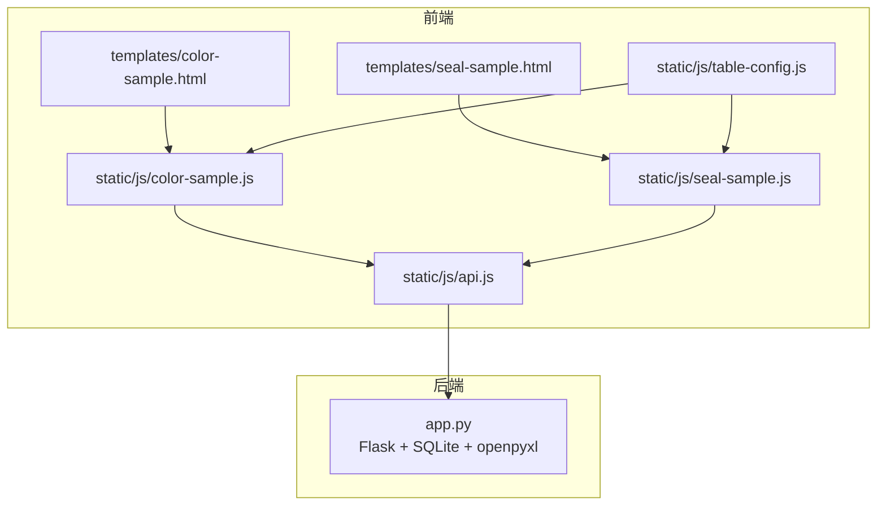
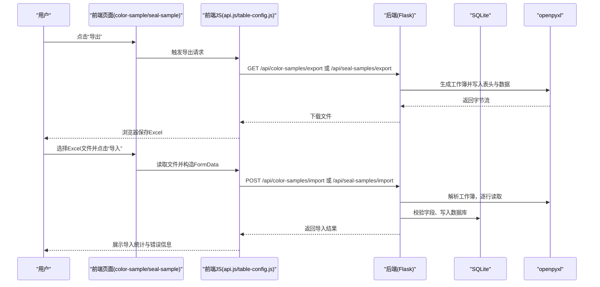

# Excel模板设计规范

<cite>
**本文引用的文件**
- [app.py](file://app.py)
- [requirements.txt](file://requirements.txt)
- [color-sample.js](file://static/js/color-sample.js)
- [seal-sample.js](file://static/js/seal-sample.js)
- [table-config.js](file://static/js/table-config.js)
- [api.js](file://static/js/api.js)
- [color-sample.html](file://templates/color-sample.html)
- [seal-sample.html](file://templates/seal-sample.html)
</cite>

## 目录
1. [简介](#简介)
2. [项目结构](#项目结构)
3. [核心组件](#核心组件)
4. [架构总览](#架构总览)
5. [详细组件分析](#详细组件分析)
6. [依赖分析](#依赖分析)
7. [性能考虑](#性能考虑)
8. [故障排查指南](#故障排查指南)
9. [结论](#结论)
10. [附录](#附录)

## 简介
本规范面向“封样件及色板接收登记管理系统”的Excel模板设计与使用，覆盖以下方面：
- 模板设计原则与表头命名规范
- 字段定义说明与数据类型要求
- 字段对照表（中文字段名与数据库字段映射）
- 版本管理策略（更新机制、兼容性处理、迁移指导）
- 使用说明（数据录入规范、格式要求、注意事项）
- 自定义指导（字段增减、样式调整、业务规则定制）
- 质量控制方法（数据验证、格式检查、一致性保证）
- 导入/导出流程的作用与重要性

## 项目结构
系统采用前后端分离架构：
- 后端：Flask + SQLite + openpyxl（负责数据模型、导入导出、业务逻辑）
- 前端：纯静态HTML+JS（负责页面渲染、表格配置、导入导出触发）

图表来源
- [color-sample.html:1-42](file://templates/color-sample.html#L1-L42)
- [seal-sample.html:1-45](file://templates/seal-sample.html#L1-L45)
- [color-sample.js:248-267](file://static/js/color-sample.js#L248-L267)
- [seal-sample.js:149-181](file://static/js/seal-sample.js#L149-L181)
- [table-config.js:1-552](file://static/js/table-config.js#L1-L552)
- [api.js:1-88](file://static/js/api.js#L1-L88)
- [app.py:692-795](file://app.py#L692-L795)
- [app.py:917-1041](file://app.py#L917-L1041)

章节来源
- [app.py:1-40](file://app.py#L1-L40)
- [requirements.txt:1-5](file://requirements.txt#L1-L5)

## 核心组件
- 数据模型与字段
  - 封样件台账：包含序号、项目、封样件名称、签署人、签署人日期、有效期、提醒天数、状态、备注等字段
  - 色板台账：包含序号、客户、适用车型、颜色名称、样板供应商、颜色色值转化码、纹理代码、光泽度、供应商代码、制作信息、接收数量、当前持有数量、接收日期、使用的光源角度、L/a/b/c/h/ΔL/Δa/Δb/Δc/Δh/ΔE、有效期、提醒天数、状态、备注等字段
- 导入导出
  - 后端提供导出接口，生成Excel工作簿；导入接口解析Excel并写入数据库
- 前端交互
  - 页面模板提供导入/导出按钮；JS负责触发上传与下载；表格配置模块支持列设置与筛选

章节来源
- [app.py:129-187](file://app.py#L129-L187)
- [app.py:692-795](file://app.py#L692-L795)
- [app.py:917-1041](file://app.py#L917-L1041)
- [color-sample.js:248-267](file://static/js/color-sample.js#L248-L267)
- [seal-sample.js:149-181](file://static/js/seal-sample.js#L149-L181)

## 架构总览
导入/导出流程的关键节点如下：

图表来源
- [color-sample.js:258-262](file://static/js/color-sample.js#L258-L262)
- [seal-sample.js:164-174](file://static/js/seal-sample.js#L164-L174)
- [app.py:692-795](file://app.py#L692-L795)
- [app.py:917-1041](file://app.py#L917-L1041)

## 详细组件分析

### 封样件Excel模板设计规范
- 表头命名规范
  - 必须与后端导出表头严格一致，顺序也必须一致
  - 导出表头顺序：ID, 序号, 项目, 封样件名称, 签署人, 签署人日期, 有效期, 提醒天数, 状态, 备注, 创建时间
- 字段定义与数据类型
  - ID：整数（可选，若导入文件包含ID列，后端会跳过第一列）
  - 序号：文本（自动生成，导入时可留空或与实际一致）
  - 项目：文本
  - 封样件名称：文本
  - 签署人：文本
  - 签署人日期：日期（YYYY-MM-DD）
  - 有效期：日期（YYYY-MM-DD）
  - 提醒天数：整数（默认30）
  - 状态：文本（支持“正常/待评定/已过期/已报废”，导入时可为空，默认normal）
  - 备注：文本
  - 创建时间：日期时间（由后端生成，导入时可忽略）
- 字段对照表（中文字段名 ↔ 数据库字段）
  - ID → id
  - 序号 → 序号
  - 项目 → 项目
  - 封样件名称 → 封样件名称
  - 签署人 → 签署人
  - 签署人日期 → 签署人日期
  - 有效期 → 有效期
  - 提醒天数 → 提醒天数
  - 状态 → 状态
  - 备注 → 备注
  - 创建时间 → created_at
- 导入规则
  - 后端会自动去除多余列（若存在ID列则跳过）
  - 日期字段自动截取YYYY-MM-DD
  - 提醒天数非整数时默认30
  - 状态为空时默认normal
  - 导入完成后会根据有效期+提醒天数重算状态
- 导出规则
  - 状态统一转换为中文显示（正常/待评定/已过期/已报废）
  - 有效期为空时状态按动态计算

章节来源
- [app.py:692-718](file://app.py#L692-L718)
- [app.py:720-795](file://app.py#L720-L795)

### 色板Excel模板设计规范
- 表头命名规范
  - 必须与后端导出表头严格一致，顺序也必须一致
  - 导出表头顺序：ID, 序号, 客户, 适用车型, 颜色名称, 样板供应商, 颜色色值转化码, 纹理代码, 光泽度, 供应商代码, 制作信息, 接收数量, 当前持有数量, 接收日期, 使用的光源角度, L值, a值, b值, c值, h值, ΔL值, Δa值, Δb值, Δc值, Δh值, ΔE值, 有效期, 提醒天数, 状态, 备注
- 字段定义与数据类型
  - ID：整数（可选）
  - 序号：文本（自动生成）
  - 客户：文本
  - 适用车型：文本
  - 颜色名称：文本
  - 样板供应商：文本
  - 颜色色值转化码：文本
  - 纹理代码：文本
  - 光泽度：文本
  - 供应商代码：文本
  - 制作信息：文本
  - 接收数量：整数
  - 当前持有数量：整数（默认0）
  - 接收日期：日期（YYYY-MM-DD）
  - 使用的光源角度：文本
  - L/a/b/c/h/ΔL/Δa/Δb/Δc/Δh/ΔE：数值（可为空）
  - 有效期：日期（YYYY-MM-DD）
  - 提醒天数：整数（默认30）
  - 状态：文本（支持“正常/待评定/已过期/已报废”）
  - 备注：文本
- 字段对照表（中文字段名 ↔ 数据库字段）
  - ID → id
  - 序号 → 序号
  - 客户 → 客户
  - 适用车型 → 适用车型
  - 颜色名称 → 颜色名称
  - 样板供应商 → 样板供应商
  - 颜色色值转化码 → 颜色色值转化码
  - 纹理代码 → 纹理代码
  - 光泽度 → 光泽度
  - 供应商代码 → 供应商代码
  - 制作信息 → 制作信息
  - 接收数量 → 接收数量
  - 当前持有数量 → 当前持有数量
  - 接收日期 → 接收日期
  - 使用的光源角度 → 使用的光源角度
  - L值 → L值
  - a值 → a值
  - b值 → b值
  - c值 → c值
  - h值 → h值
  - ΔL值 → ΔL值
  - Δa值 → Δa值
  - Δb值 → Δb值
  - Δc值 → Δc值
  - Δh值 → Δh值
  - ΔE值 → ΔE值
  - 有效期 → 有效期
  - 提醒天数 → 提醒天数
  - 状态 → 状态
  - 备注 → 备注
- 导入规则
  - 后端会自动去除多余列（若存在ID列则跳过）
  - 状态为空时默认normal
  - 导入完成后会根据有效期+提醒天数重算状态，并在ΔE值为空时自动补算ΔE
- 导出规则
  - 状态统一转换为中文显示
  - 仅导出与表头对应的字段，避免导出created_at/updated_at等系统列

章节来源
- [app.py:917-951](file://app.py#L917-L951)
- [app.py:953-1041](file://app.py#L953-L1041)

### 模板版本管理策略
- 更新机制
  - 后端导出接口与导入接口严格约定表头顺序与字段集合
  - 若数据库表结构新增字段，后端会进行兼容性处理（例如向表中添加缺失列）
- 兼容性处理
  - 导入时自动跳过ID列（若存在）
  - 导入时对日期字段进行YYYY-MM-DD截取
  - 导入时对数值字段进行类型转换与默认值处理
  - 导入完成后自动重算状态与ΔE值
- 迁移指导
  - 新增字段：导入时对应位置留空即可，后端会按默认值或空值处理
  - 字段顺序：严格按导出表头顺序，顺序不一致会导致字段错位
  - 字段类型：务必遵循上述数据类型要求，避免导入失败

章节来源
- [app.py:189-201](file://app.py#L189-L201)
- [app.py:720-795](file://app.py#L720-L795)
- [app.py:953-1041](file://app.py#L953-L1041)

### 使用说明
- 数据录入规范
  - 日期字段统一使用YYYY-MM-DD格式
  - 数值字段（数量、提醒天数、ΔL/Δa/Δb等）请使用数值格式
  - 文本字段（客户、颜色名称、供应商等）请使用文本格式
- 格式要求
  - 表头必须与导出模板完全一致，顺序必须一致
  - 不要手动修改表头名称或顺序
- 注意事项
  - 导入文件大小建议控制在合理范围内，避免超时
  - 导入过程中若出现错误，后端会返回首条错误行提示，便于定位问题
  - 导入完成后，系统会自动重算状态与ΔE值，无需手工修改

章节来源
- [color-sample.js:258-262](file://static/js/color-sample.js#L258-L262)
- [seal-sample.js:164-174](file://static/js/seal-sample.js#L164-L174)
- [app.py:720-795](file://app.py#L720-L795)
- [app.py:953-1041](file://app.py#L953-L1041)

### 自定义指导
- 字段增减
  - 新增字段：在导入模板中对应位置留空，后端会按默认值或空值处理
  - 删除字段：不要删除表头，保持表头顺序与数量不变
- 样式调整
  - 模板样式由后端导出时统一设置，前端不建议自行修改样式
- 业务规则定制
  - 状态计算规则：有效期≤提醒天数时为“待评定”，已过期为“已过期”，否则为“正常”
  - ΔE值：若ΔL/Δa/Δb均存在，系统会自动计算ΔE=√(ΔL²+Δa²+Δb²)，否则保持空值

章节来源
- [app.py:350-371](file://app.py#L350-L371)
- [app.py:1010-1034](file://app.py#L1010-L1034)

### 质量控制方法
- 数据验证规则
  - 必填校验：导入时会对必填字段进行校验，缺失将导致该行导入失败
  - 类型校验：日期字段自动截取YYYY-MM-DD，数值字段进行类型转换
  - 状态映射：中文状态映射为数据库内部状态码
- 格式检查
  - 表头顺序与字段数量必须与导出模板一致
  - 日期格式必须为YYYY-MM-DD
- 一致性保证
  - 导入完成后自动重算状态与ΔE值，确保数据一致性
  - 导出时统一状态中文显示，避免前后端显示不一致

章节来源
- [app.py:629-632](file://app.py#L629-L632)
- [app.py:847-850](file://app.py#L847-L850)
- [app.py:994-1002](file://app.py#L994-L1002)

### 导入/导出流程的重要性
- 导入流程
  - 通过Excel批量导入，提升数据录入效率
  - 后端自动处理字段映射、类型转换与默认值，降低人工错误
- 导出流程
  - 统一的数据格式与表头，便于跨部门共享与审计
  - 导出时自动重算状态与ΔE值，确保报表准确性

章节来源
- [app.py:692-795](file://app.py#L692-L795)
- [app.py:917-1041](file://app.py#L917-L1041)

## 依赖分析
- 技术栈
  - 后端：Flask、openpyxl、SQLite
  - 前端：静态HTML+JS（无框架）
- 关键依赖
  - openpyxl：用于Excel读写
  - Flask：提供REST API与静态资源服务

章节来源
- [requirements.txt:1-5](file://requirements.txt#L1-L5)
- [app.py:18-20](file://app.py#L18-L20)

## 性能考虑
- 导入性能
  - 大量数据导入时建议分批处理，避免一次性导入过多行导致内存压力
  - 后端逐行解析Excel，建议控制单次导入行数
- 导出性能
  - 导出时仅导出必要字段，避免导出大量系统列
  - 建议在低峰时段导出大批量数据

## 故障排查指南
- 常见问题
  - 表头不一致：请使用系统导出的模板作为参考，确保表头与顺序完全一致
  - 日期格式错误：请使用YYYY-MM-DD格式
  - 数值格式错误：请使用数值格式，避免文本格式导致转换失败
  - 导入失败：查看返回的首条错误行，定位具体字段与行号
- 建议
  - 导入前先导出一份模板，核对表头与字段
  - 导入后检查状态与ΔE值是否按预期重算

章节来源
- [app.py:773-792](file://app.py#L773-L792)
- [app.py:1006-1008](file://app.py#L1006-L1008)

## 结论
本规范明确了Excel模板的设计原则、字段定义、导入导出流程与质量控制方法。遵循本规范可显著提升数据录入效率与准确性，保障系统运行稳定性与一致性。

## 附录
- 表头与字段对照表（汇总）
  - 封样件：ID, 序号, 项目, 封样件名称, 签署人, 签署人日期, 有效期, 提醒天数, 状态, 备注, 创建时间
  - 色板：ID, 序号, 客户, 适用车型, 颜色名称, 样板供应商, 颜色色值转化码, 纹理代码, 光泽度, 供应商代码, 制作信息, 接收数量, 当前持有数量, 接收日期, 使用的光源角度, L值, a值, b值, c值, h值, ΔL值, Δa值, Δb值, Δc值, Δh值, ΔE值, 有效期, 提醒天数, 状态, 备注