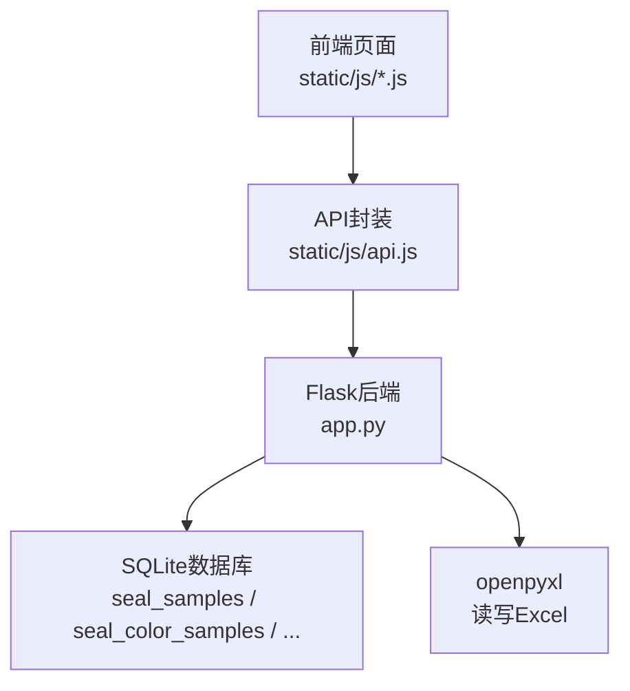
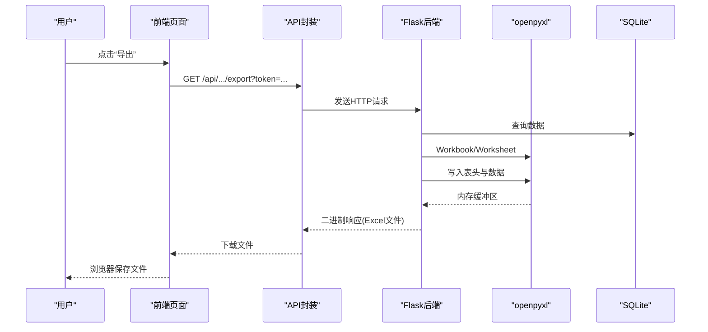
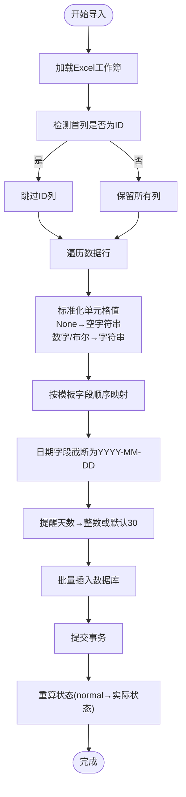
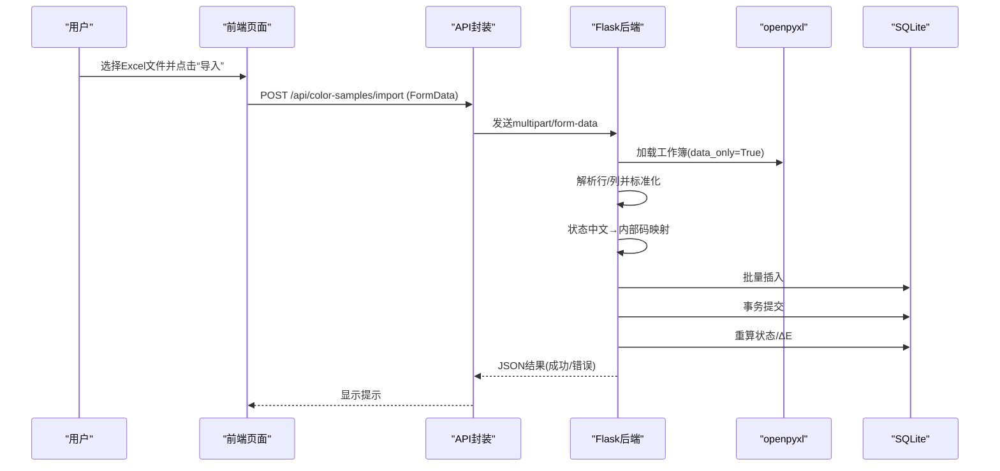
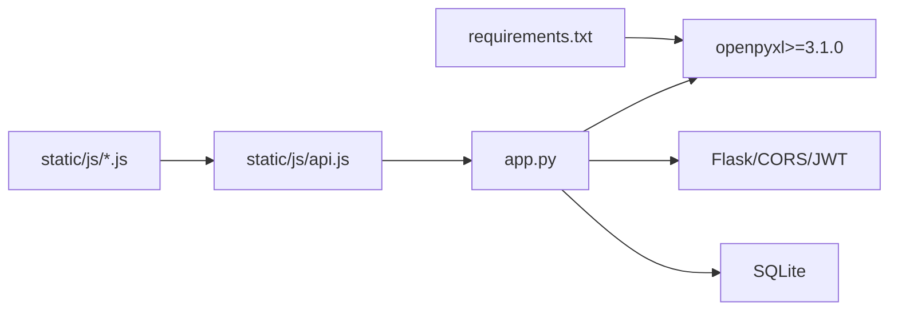

# Excel集成功能

<cite>
**本文引用的文件**
- [app.py](file://app.py)
- [requirements.txt](file://requirements.txt)
- [api.js](file://static/js/api.js)
- [seal-sample.js](file://static/js/seal-sample.js)
- [color-sample.js](file://static/js/color-sample.js)
</cite>

## 目录
1. [简介](#简介)
2. [项目结构](#项目结构)
3. [核心组件](#核心组件)
4. [架构总览](#架构总览)
5. [详细组件分析](#详细组件分析)
6. [依赖关系分析](#依赖关系分析)
7. [性能考量](#性能考量)
8. [故障排查指南](#故障排查指南)
9. [结论](#结论)
10. [附录](#附录)

## 简介
本文件面向“封样件及色板接收登记管理系统”，系统采用Flask + openpyxl实现Excel导入导出能力，覆盖封样件台账、色板台账、寄出台账与处置记录四大类数据。本文档聚焦Excel集成的实现机制、数据映射规则、模板设计规范、数据验证与错误处理策略，并给出性能优化与扩展定制建议。

## 项目结构
- 后端：Python Flask应用，负责业务逻辑、数据库交互与Excel读写。
- 前端：静态JS模块，负责调用后端API进行Excel导入导出。
- 依赖：openpyxl用于读写Excel；Flask+CORS+JWT用于Web服务与鉴权。

图表来源
- [app.py:1-25](file://app.py#L1-L25)
- [api.js:1-88](file://static/js/api.js#L1-L88)
- [requirements.txt:1-5](file://requirements.txt#L1-L5)

章节来源
- [app.py:1-25](file://app.py#L1-L25)
- [requirements.txt:1-5](file://requirements.txt#L1-L5)

## 核心组件
- 导出组件
  - 封样件导出：/api/seal-samples/export
  - 色板导出：/api/color-samples/export
  - 寄出台账导出：/api/send-records/export
  - 处置记录导出：/api/disposal-records/export
- 导入组件
  - 封样件导入：/api/seal-samples/import
  - 色板导入：/api/color-samples/import
- 前端调用
  - 导出：window.open(url)下载
  - 导入：FormData + API.upload 触发POST导入

章节来源
- [app.py:692-795](file://app.py#L692-L795)
- [app.py:917-1041](file://app.py#L917-L1041)
- [app.py:1157-1171](file://app.py#L1157-L1171)
- [app.py:1808-1891](file://app.py#L1808-L1891)
- [api.js:67-83](file://static/js/api.js#L67-L83)
- [seal-sample.js:164-174](file://static/js/seal-sample.js#L164-L174)
- [color-sample.js:258-262](file://static/js/color-sample.js#L258-L262)

## 架构总览
后端通过openpyxl创建/加载工作簿，按模板写入表头与数据，再将内存缓冲区作为附件返回给前端。前端通过API封装发送请求并触发浏览器下载或上传文件。

图表来源
- [app.py:692-795](file://app.py#L692-L795)
- [app.py:917-1041](file://app.py#L917-L1041)
- [api.js:44-65](file://static/js/api.js#L44-L65)

## 详细组件分析

### 封样件Excel导入/导出
- 导出
  - 表头：ID, 序号, 项目, 封样件名称, 签署人, 签署人日期, 有效期, 提醒天数, 状态, 备注, 创建时间
  - 状态映射：后端将英文状态映射为中文；若为normal则动态计算真实状态
  - 文件名：封样件台账.xlsx
- 导入
  - 支持从导出文件重新导入（检测首列为ID则跳过）
  - 字段映射：与导出模板一致（序号,项目,封样件名称,签署人,签署人日期,有效期,提醒天数,备注）
  - 日期字段截断为YYYY-MM-DD
  - 提醒天数非整数时默认30
  - 成功后批量重算状态（基于有效期+提醒天数）

图表来源
- [app.py:720-795](file://app.py#L720-L795)

章节来源
- [app.py:692-795](file://app.py#L692-L795)
- [seal-sample.js:164-174](file://static/js/seal-sample.js#L164-L174)

### 色板Excel导入/导出
- 导出
  - 表头：ID, 序号, 客户, 适用车型, 颜色名称, 样板供应商, 颜色色值转化码, 纹理代码, 光泽度, 供应商代码, 制作信息, 接收数量, 当前持有数量, 接收日期, 使用的光源角度, L值, a值, b值, c值, h值, ΔL值, Δa值, Δb值, Δc值, Δh值, ΔE值, 有效期, 提醒天数, 状态, 备注
  - 状态映射：同封样件
  - 文件名：色板台账.xlsx
- 导入
  - 支持从导出文件重新导入（检测首列为ID则跳过）
  - 字段映射：与导出模板一致（除系统自动生成列）
  - 状态中文→内部码映射：正常→normal，待评定→pending_eval，已过期→expired，已报废→scrapped
  - 成功后批量重算：
    - 若ΔE值为空且ΔL/a/b任一存在，则自动计算ΔE=√(ΔL²+Δa²+Δb²)，并更新状态（基于有效期+提醒天数）

图表来源
- [app.py:953-1041](file://app.py#L953-L1041)
- [api.js:67-83](file://static/js/api.js#L67-L83)

章节来源
- [app.py:917-1041](file://app.py#L917-L1041)
- [color-sample.js:258-262](file://static/js/color-sample.js#L258-L262)

### 寄出台账与处置记录导出
- 寄出台账导出：ID, 色板ID, 客户, 颜色名称, 对方单位, 寄出数量, 寄出日期, 经手人, 备注, 创建时间
- 处置记录导出：记录类型, 对象类型, 编号, 名称, 评定结果/报废原因, 报废类型, 评定人/审批人, 评定日期/报废日期, ΔE值, 新有效期截止日, 评定说明/备注, 创建时间

章节来源
- [app.py:1157-1171](file://app.py#L1157-L1171)
- [app.py:1808-1891](file://app.py#L1808-L1891)

### 数据模型与字段映射
- 封样件表(seal_samples)
  - 关键字段：序号, 项目, 封样件名称, 签署人, 签署人日期, 有效期, 提醒天数, 状态, 备注
- 色板表(seal_color_samples)
  - 关键字段：序号, 客户, 适用车型, 颜色名称, 接收数量, 当前持有数量, 接收日期, 有效期, 提醒天数, 状态, 备注
  - 色差相关：L值, a值, b值, ΔL值, Δa值, Δb值, Δc值, Δh值, ΔE值
- 导入/导出模板字段与数据库字段一一对应，确保一致性

章节来源
- [app.py:129-187](file://app.py#L129-L187)
- [app.py:692-795](file://app.py#L692-L795)
- [app.py:917-1041](file://app.py#L917-L1041)

## 依赖关系分析
- openpyxl版本要求：>=3.1.0
- 导入/导出均使用openpyxl.Workbook/Worksheet进行读写
- 前端通过API封装调用后端接口，支持携带JWT Token

图表来源
- [requirements.txt:1-5](file://requirements.txt#L1-L5)
- [app.py:18-25](file://app.py#L18-L25)
- [api.js:1-88](file://static/js/api.js#L1-L88)

章节来源
- [requirements.txt:1-5](file://requirements.txt#L1-L5)
- [app.py:18-25](file://app.py#L18-L25)

## 性能考量
- 大数据量导入
  - 使用批量插入与事务一次性提交，减少往返开销
  - 逐行解析并标准化，避免复杂正则与类型转换
  - 导入完成后一次性重算状态，避免逐条UPDATE
- 大数据量导出
  - 仅导出必要字段，避免冗余列
  - 使用内存缓冲区BytesIO减少磁盘I/O
- 建议
  - 分批导入：每批1000~5000条，结合进度反馈
  - 导出分页：后端支持分页导出（当前导出接口未限制，建议在前端控制导出范围）
  - 并发控制：限制同时发起的导入/导出任务数量

[本节为通用性能建议，无需特定文件来源]

## 故障排查指南
- 常见错误
  - 未提供Token或Token无效：401，前端自动跳转登录
  - 文件为空或格式不符：后端抛出异常并返回失败信息
  - 导入行存在异常：记录首条错误行并提示跳过数量
- 定位步骤
  - 检查前端是否正确携带Authorization头
  - 检查Excel表头与模板字段是否一致
  - 检查日期格式是否为YYYY-MM-DD
  - 检查提醒天数是否为整数
- 错误处理策略
  - 导入：捕获异常并收集错误行，剩余有效行仍可入库
  - 导出：异常时返回友好提示，避免中断流程

章节来源
- [api.js:20-33](file://static/js/api.js#L20-L33)
- [app.py:720-795](file://app.py#L720-L795)
- [app.py:953-1041](file://app.py#L953-L1041)

## 结论
系统通过openpyxl实现了稳定可靠的Excel导入导出能力，覆盖封样件与色板两大核心业务场景，并提供寄出与处置记录的导出支持。模板设计简洁明确，字段映射清晰，错误处理完善，适合中小规模数据的日常使用。对于更大规模的数据处理，建议采用分批导入与导出、后台任务队列与异步处理等方案。

[本节为总结性内容，无需特定文件来源]

## 附录

### Excel模板设计规范
- 封样件模板
  - 表头：ID（可选，用于从导出文件重新导入时跳过）、序号、项目、封样件名称、签署人、签署人日期、有效期、提醒天数、状态、备注、创建时间
  - 数据类型要求
    - 日期：YYYY-MM-DD
    - 数值：整数（提醒天数）
    - 文本：字符串
  - 状态取值：中文（正常/待评定/已过期/已报废），导入时映射为内部码
- 色板模板
  - 表头：ID（可选）、序号、客户、适用车型、颜色名称、样板供应商、颜色色值转化码、纹理代码、光泽度、供应商代码、制作信息、接收数量、当前持有数量、接收日期、使用的光源角度、L值、a值、b值、c值、h值、ΔL值、Δa值、Δb值、Δc值、Δh值、ΔE值、有效期、提醒天数、状态、备注
  - 数据类型要求
    - 日期：YYYY-MM-DD
    - 数值：浮点数（L/a/b/ΔL/Δa/Δb/Δc/Δh/ΔE）
    - 数量：整数（接收数量/当前持有数量）
    - 状态：中文（正常/待评定/已过期/已报废），导入时映射为内部码

章节来源
- [app.py:692-795](file://app.py#L692-L795)
- [app.py:917-1041](file://app.py#L917-L1041)

### 数据验证规则
- 必填字段检查
  - 封样件：项目、封样件名称、签署人、签署人日期、有效期
  - 色板：客户、适用车型、颜色名称、接收数量、有效期
- 格式验证
  - 日期字段：必须为YYYY-MM-DD
  - 提醒天数：必须为整数，非整数时默认30
  - 状态：中文映射为内部码，空则默认normal
- 业务规则验证
  - 色板导入：若ΔE为空且ΔL/a/b任一存在，则自动计算ΔE
  - 导入完成后：根据有效期+提醒天数重算状态

章节来源
- [app.py:629-632](file://app.py#L629-L632)
- [app.py:847-850](file://app.py#L847-L850)
- [app.py:763-771](file://app.py#L763-L771)
- [app.py:999-1002](file://app.py#L999-L1002)
- [app.py:1024-1032](file://app.py#L1024-L1032)

### 错误处理与异常策略
- 导入异常
  - 捕获并记录异常行，剩余有效行仍可入库
  - 返回消息包含成功条数与跳过条数及首条错误摘要
- 导出异常
  - 捕获异常并返回友好提示
- 前端异常
  - 401自动跳转登录
  - 网络异常提示

章节来源
- [app.py:793-794](file://app.py#L793-L794)
- [app.py:1039-1040](file://app.py#L1039-L1040)
- [api.js:20-33](file://static/js/api.js#L20-L33)

### 扩展与定制化建议
- 模板扩展
  - 可增加更多字段（如创建/更新时间、备注等），但需同步后端导入/导出逻辑
- 导入增强
  - 支持增量导入（去重/更新策略）
  - 支持并发导入与进度反馈
- 导出增强
  - 支持筛选导出（按条件导出）
  - 支持分页导出（大表拆分）
- 样式与格式
  - 可在导出时增加标题行样式、冻结首行、列宽自适应等（基于openpyxl样式API）
- 安全加固
  - 限制文件大小与类型
  - 导入前进行二次校验（如唯一性、业务规则）

[本节为通用扩展建议，无需特定文件来源]