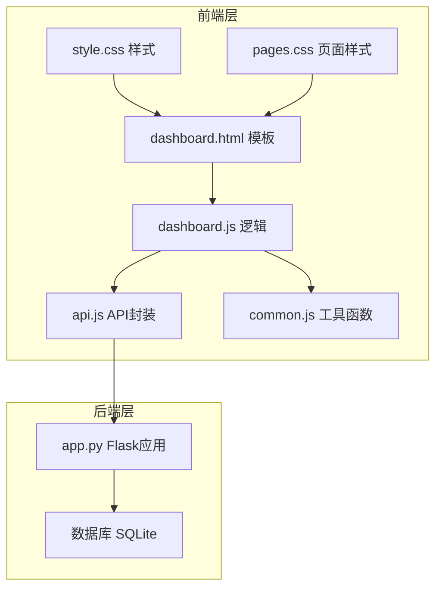
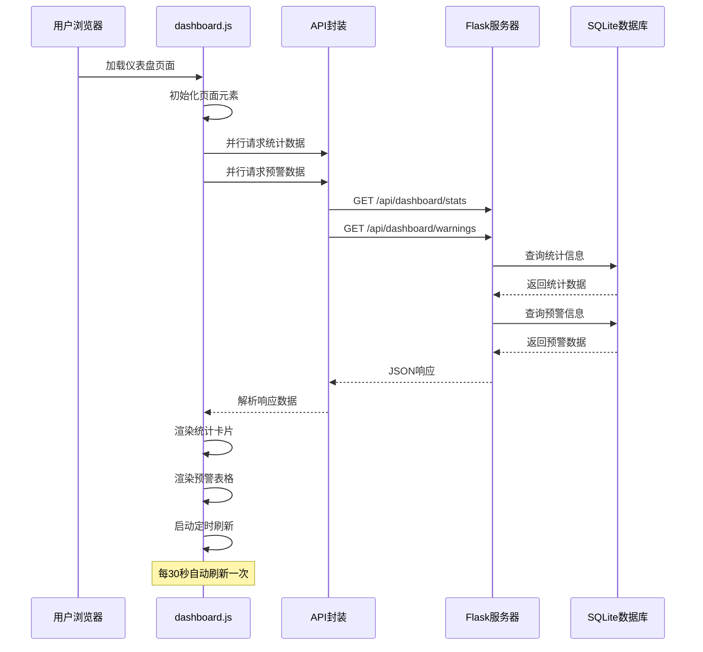
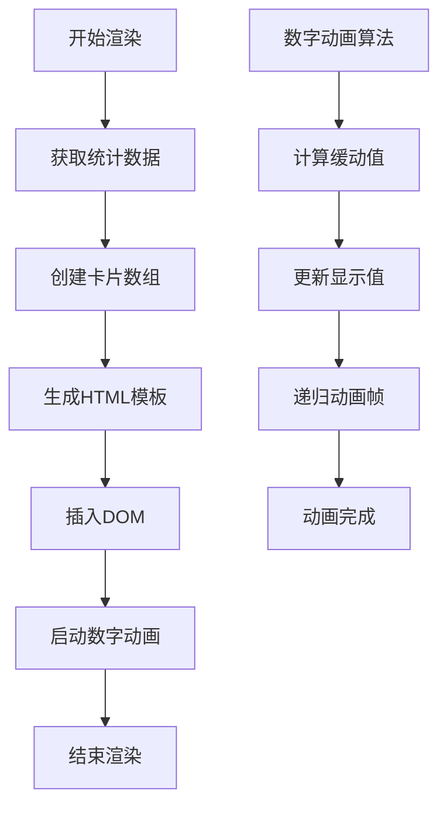
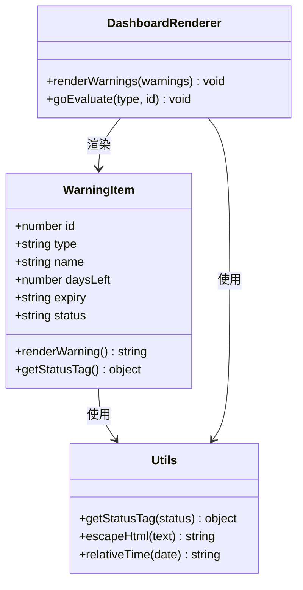
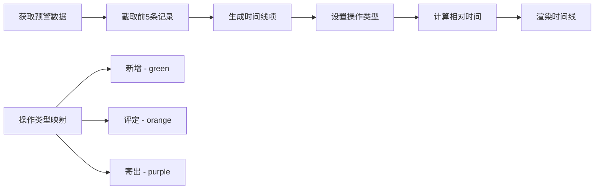
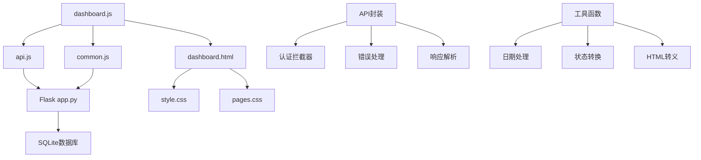

# 仪表盘模块

<cite>
**本文档引用的文件**
- [dashboard.js](file://static/js/dashboard.js)
- [dashboard.html](file://templates/dashboard.html)
- [app.py](file://app.py)
- [api.js](file://static/js/api.js)
- [common.js](file://static/js/common.js)
- [style.css](file://static/css/style.css)
- [pages.css](file://static/css/pages.css)
</cite>

## 目录
1. [简介](#简介)
2. [项目结构](#项目结构)
3. [核心组件](#核心组件)
4. [架构概览](#架构概览)
5. [详细组件分析](#详细组件分析)
6. [依赖关系分析](#依赖关系分析)
7. [性能考虑](#性能考虑)
8. [故障排除指南](#故障排除指南)
9. [结论](#结论)

## 简介

仪表盘模块是封样件及色板接收登记管理系统的核心展示模块，负责提供关键业务指标的实时统计和状态监控。该模块通过直观的可视化界面展示封样件和色板的总体情况，包括总数统计、待评定数量、报废数量等关键指标，并提供有效期预警和最近操作记录等功能。

## 项目结构

仪表盘模块采用前后端分离的架构设计，主要由以下组件构成：

**图表来源**
- [dashboard.js:1-117](file://static/js/dashboard.js#L1-L117)
- [dashboard.html:1-34](file://templates/dashboard.html#L1-L34)
- [app.py:2083-2154](file://app.py#L2083-L2154)

**章节来源**
- [dashboard.js:1-117](file://static/js/dashboard.js#L1-L117)
- [dashboard.html:1-34](file://templates/dashboard.html#L1-L34)
- [app.py:2083-2154](file://app.py#L2083-L2154)

## 核心组件

仪表盘模块包含以下核心组件：

### 1. 统计卡片组件
- **封样件总数**：显示系统中封样件的总数量
- **色板总数**：显示系统中色板的总数量  
- **待评定数**：显示有效期在30天内的待评定项目数量
- **已报废数**：显示已报废的项目总数

### 2. 预警表格组件
- **近期到期预警**：显示有效期即将到期的项目列表
- **状态标识**：根据剩余天数显示不同的状态标签
- **操作按钮**：提供快速跳转到评定页面的功能

### 3. 时间线组件
- **最近操作记录**：展示系统中的最新操作历史
- **操作类型标识**：通过不同颜色区分新增、评定、寄出等操作
- **相对时间显示**：使用人性化的时间格式显示

**章节来源**
- [dashboard.js:15-103](file://static/js/dashboard.js#L15-L103)
- [pages.css:188-250](file://static/css/pages.css#L188-L250)

## 架构概览

仪表盘模块采用异步数据加载和实时更新的架构模式：

**图表来源**
- [dashboard.js:5-13](file://static/js/dashboard.js#L5-L13)
- [app.py:2084-2154](file://app.py#L2084-L2154)

## 详细组件分析

### 统计卡片渲染组件

统计卡片组件负责展示关键业务指标，采用动画效果提升用户体验：

**图表来源**
- [dashboard.js:15-64](file://static/js/dashboard.js#L15-L64)

#### 统计卡片数据结构
每个统计卡片包含以下属性：
- `label`: 显示的标签文本
- `value`: 实际数值
- `color`: 卡片主题颜色
- `icon`: 图标类型
- `pulse`: 是否启用脉冲动画（用于待评定数）

#### 动画实现机制
数字动画采用三次贝塞尔曲线缓动函数，提供流畅的视觉体验：
- 动画时长：800毫秒
- 缓动函数：1 - (1 - progress)³
- 帧率：requestAnimationFrame

**章节来源**
- [dashboard.js:15-64](file://static/js/dashboard.js#L15-L64)
- [pages.css:188-224](file://static/css/pages.css#L188-L224)

### 预警表格组件

预警表格组件提供有效期管理的关键信息：

**图表来源**
- [dashboard.js:66-103](file://static/js/dashboard.js#L66-L103)
- [common.js:42-61](file://static/js/common.js#L42-L61)

#### 预警数据格式
API返回的预警数据包含以下字段：
- `id`: 项目唯一标识
- `type`: 项目类型（'seal' 或 'color'）
- `name`: 项目名称
- `daysLeft`: 剩余天数（负数表示已过期）
- `expiry`: 有效期截止日期
- `status`: 状态标识

#### 状态分类逻辑
根据剩余天数自动分类：
- `expired`: 已过期（daysLeft < 0）
- `pending_eval`: 待评定（0 ≤ daysLeft ≤ 30）
- `normal`: 正常（daysLeft > 30）

**章节来源**
- [dashboard.js:66-103](file://static/js/dashboard.js#L66-L103)
- [app.py:2116-2154](file://app.py#L2116-L2154)

### 时间线组件

时间线组件展示系统的最近操作历史：

**图表来源**
- [dashboard.js:93-102](file://static/js/dashboard.js#L93-L102)

#### 时间线样式设计
- **时间轴**：灰色垂直线作为时间轴
- **节点样式**：根据操作类型使用不同颜色
- **时间显示**：人性化的时间格式（如"刚刚"、"2分钟前"等）
- **操作类型**：通过CSS类名控制视觉样式

**章节来源**
- [dashboard.js:93-102](file://static/js/dashboard.js#L93-L102)
- [pages.css:229-249](file://static/css/pages.css#L229-L249)

## 依赖关系分析

仪表盘模块的依赖关系如下：

**图表来源**
- [dashboard.js:1-117](file://static/js/dashboard.js#L1-L117)
- [api.js:4-84](file://static/js/api.js#L4-L84)
- [common.js:5-135](file://static/js/common.js#L5-L135)

### 前端依赖关系

- **dashboard.js** 依赖于 **api.js** 和 **common.js**
- **api.js** 提供统一的HTTP请求封装
- **common.js** 提供通用的工具函数
- **样式文件** 通过CSS Grid和Flexbox实现响应式布局

### 后端依赖关系

- **Flask路由** 提供RESTful API接口
- **数据库查询** 使用SQLAlchemy风格的查询语法
- **认证中间件** 确保API访问的安全性

**章节来源**
- [dashboard.js:1-117](file://static/js/dashboard.js#L1-L117)
- [api.js:4-84](file://static/js/api.js#L4-L84)
- [common.js:5-135](file://static/js/common.js#L5-L135)

## 性能考虑

### 数据加载优化
- **并行请求**：统计信息和预警信息采用Promise.all并行加载
- **数据缓存**：前端本地缓存避免重复请求
- **懒加载**：非关键资源延迟加载

### 渲染性能优化
- **虚拟滚动**：对于大量数据采用虚拟滚动技术
- **防抖处理**：高频操作使用防抖减少重绘
- **CSS动画**：优先使用CSS动画而非JavaScript动画

### 网络性能优化
- **HTTP缓存**：合理设置缓存策略
- **压缩传输**：启用Gzip压缩
- **连接复用**：使用Keep-Alive保持连接

## 故障排除指南

### 常见问题及解决方案

#### 1. 数据加载失败
**症状**：统计卡片显示"加载中"或空白
**可能原因**：
- API接口不可用
- 网络连接异常
- 认证令牌过期

**解决方法**：
- 检查网络连接状态
- 验证API接口可用性
- 重新登录获取新的认证令牌

#### 2. 预警数据显示异常
**症状**：预警表格显示错误的状态或日期
**可能原因**：
- 数据库查询错误
- 日期格式处理问题
- 状态计算逻辑错误

**解决方法**：
- 检查数据库连接
- 验证日期字段格式
- 确认状态计算逻辑

#### 3. 样式显示问题
**症状**：页面布局错乱或样式异常
**可能原因**：
- CSS文件加载失败
- 响应式断点问题
- 浏览器兼容性问题

**解决方法**：
- 检查CSS文件路径
- 验证媒体查询断点
- 测试不同浏览器兼容性

**章节来源**
- [api.js:20-41](file://static/js/api.js#L20-L41)
- [dashboard.js:114-117](file://static/js/dashboard.js#L114-L117)

## 结论

仪表盘模块通过精心设计的架构和组件实现了高效的数据可视化展示。模块具有以下特点：

### 技术优势
- **响应式设计**：支持多种屏幕尺寸的自适应布局
- **实时更新**：自动刷新机制确保数据的时效性
- **用户体验**：动画效果和交互设计提升用户满意度
- **可维护性**：清晰的代码结构和模块化设计便于维护

### 功能特性
- **全面统计**：涵盖封样件和色板的各类关键指标
- **智能预警**：自动识别即将到期的有效期项目
- **操作追踪**：完整记录系统的最近操作历史
- **安全可靠**：完善的认证和授权机制

### 扩展潜力
模块设计具有良好的扩展性，可以轻松添加新的统计维度、预警规则和可视化组件。同时，模块化的架构为未来的功能增强提供了便利。