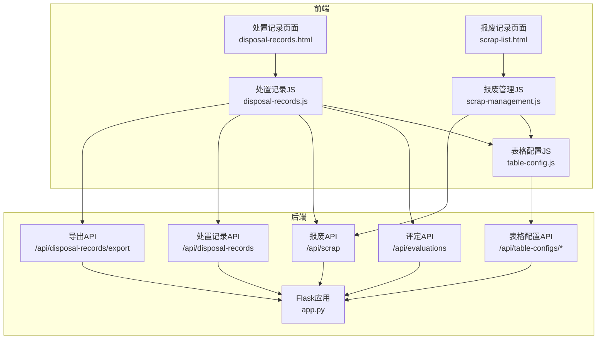
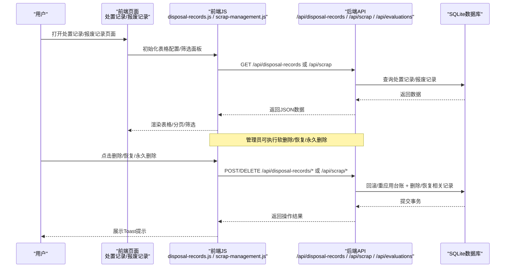
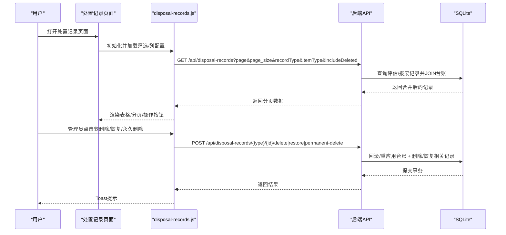
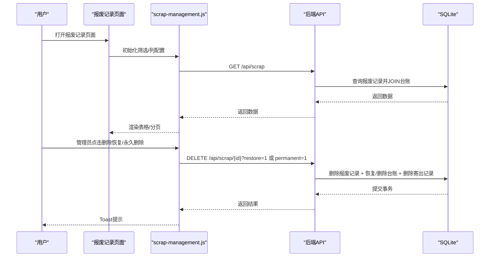
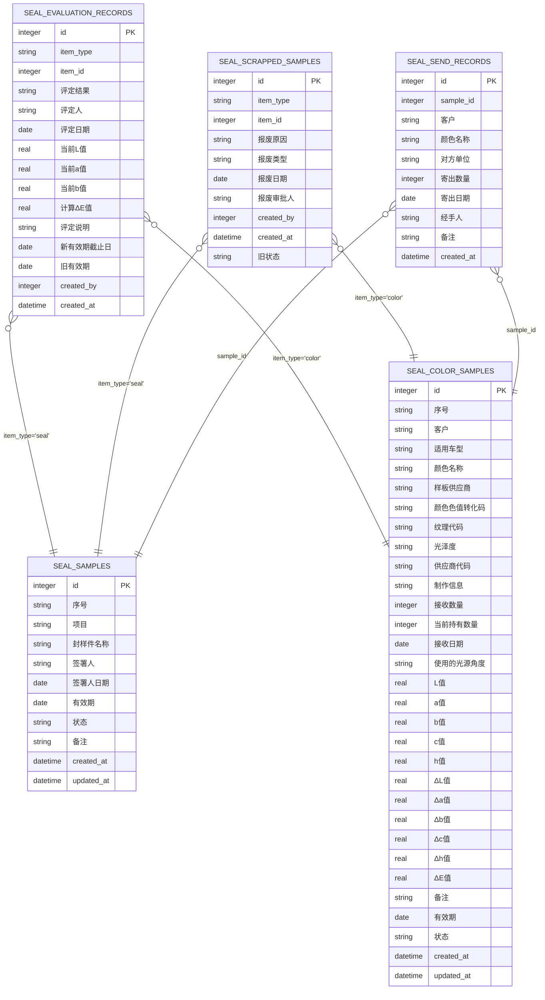
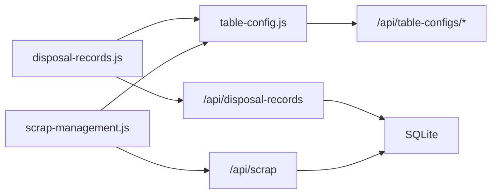

# 其他功能模块

<cite>
**本文引用的文件**
- [app.py](file://app.py)
- [disposal-records.js](file://static/js/disposal-records.js)
- [scrap-management.js](file://static/js/scrap-management.js)
- [table-config.js](file://static/js/table-config.js)
- [disposal-records.html](file://templates/disposal-records.html)
- [scrap-list.html](file://templates/scrap-list.html)
</cite>

## 目录
1. [简介](#简介)
2. [项目结构](#项目结构)
3. [核心组件](#核心组件)
4. [架构总览](#架构总览)
5. [详细组件分析](#详细组件分析)
6. [依赖关系分析](#依赖关系分析)
7. [性能考量](#性能考量)
8. [故障排查指南](#故障排查指南)
9. [结论](#结论)
10. [附录](#附录)

## 简介
本章节面向“其他功能模块”，重点覆盖以下内容：
- 处置记录管理：统一展示与管理“评定记录”和“报废记录”，支持软删除、回收站、恢复与永久删除，并与台账状态保持一致性。
- 报废列表管理：支持报废申请、审批、处理流程，以及与寄出记录的联动清理。
- 模块间数据关联与业务逻辑：处置记录与封样件/色板台账、寄出记录之间的联动更新与回滚。
- Excel导入导出：在处置记录与封样件/色板台账中提供导入导出能力。
- 搜索过滤与统计分析：基于动态筛选条件的查询、列配置与仪表盘预警。
- 权限控制与数据安全：基于JWT的认证、管理员专用的回收站与删除操作。
- 主业务模块数据同步与一致性：通过“旧有效期/旧状态”字段与回滚/重应用逻辑保障一致性。
- 扩展性与定制化：统一表格配置与筛选面板，支持列设置、筛选条件持久化与跨页面复用。

## 项目结构
后端采用Flask + SQLite，前端采用纯JavaScript + openpyxl进行Excel导入导出。处置记录与报废管理通过统一的API接口与前端页面协同工作。

图表来源
- [disposal-records.html](file://templates/disposal-records.html)
- [scrap-list.html](file://templates/scrap-list.html)
- [disposal-records.js](file://static/js/disposal-records.js)
- [scrap-management.js](file://static/js/scrap-management.js)
- [table-config.js](file://static/js/table-config.js)
- [app.py](file://app.py)

章节来源
- [disposal-records.html](file://templates/disposal-records.html)
- [scrap-list.html](file://templates/scrap-list.html)
- [disposal-records.js](file://static/js/disposal-records.js)
- [scrap-management.js](file://static/js/scrap-management.js)
- [table-config.js](file://static/js/table-config.js)
- [app.py](file://app.py)

## 核心组件
- 处置记录统一视图：合并“评定记录”和“报废记录”，支持动态筛选、排序与分页；管理员可进行软删除、恢复与永久删除。
- 报废记录管理：支持报废申请、审批、处理；支持删除恢复与永久删除（含原记录与寄出记录级联删除）。
- 表格配置与筛选：统一的列设置、筛选面板、筛选条件持久化，跨页面复用。
- Excel导入导出：处置记录导出；封样件/色板台账支持导入导出。
- 权限控制：基于JWT认证与管理员权限，限制回收站与删除操作。
- 数据一致性：通过“旧有效期/旧状态”字段与回滚/重应用逻辑，保证处置记录删除/恢复后的台账一致性。

章节来源
- [app.py](file://app.py)
- [disposal-records.js](file://static/js/disposal-records.js)
- [scrap-management.js](file://static/js/scrap-management.js)
- [table-config.js](file://static/js/table-config.js)

## 架构总览
处置记录与报废管理围绕“评估/报废”两条主线展开，二者均以“item_type/item_id”关联到封样件或色板台账，并在数据库层面维护“旧有效期/旧状态”以便回滚。前端通过统一的表格配置模块提供筛选与列设置，后端提供REST API与Excel导出能力。

图表来源
- [disposal-records.js](file://static/js/disposal-records.js)
- [scrap-management.js](file://static/js/scrap-management.js)
- [app.py](file://app.py)

## 详细组件分析

### 处置记录管理（统一视图）
- 功能要点
  - 合并“评定记录”和“报废记录”，按创建时间倒序展示。
  - 支持动态筛选：记录类型、对象类型、名称/编号、评定结果/报废原因、日期范围等。
  - 分页与列配置：支持每页大小、列显示控制、筛选条件持久化。
  - 管理员操作：软删除（标记is_deleted）、恢复（回滚台账并取消删除）、永久删除（删除记录并清理寄出记录）。
  - 导出：导出处置记录为Excel，包含记录类型、对象类型、编号、名称、结果/原因、审批人/评定人、日期、ΔE值、新有效期截止日、说明/备注、创建时间等。
- 关键实现
  - 后端合并查询：分别查询seal_evaluation_records与seal_scrapped_samples，JOIN封样件/色板台账以补全名称/编号/有效期等字段，最终按created_at倒序。
  - 回滚与重应用：软删除时回滚台账（恢复旧有效期或旧状态）；恢复时重新应用（设置新有效期或标记报废）。
  - Excel导出：统一导出字段，区分“评定记录”和“报废记录”的差异字段。
- 前端交互
  - 使用TableConfig构建筛选面板与列设置，支持动态筛选参数拼接与分页回调。
  - 管理员入口：回收站模式下显示回收站按钮与导出按钮，隐藏常规筛选与列设置。
  - 详情抽屉：支持查看评定记录的Lab色差数据与说明，报废记录的类型、原因、审批人等。

图表来源
- [disposal-records.js](file://static/js/disposal-records.js)
- [app.py](file://app.py)

章节来源
- [disposal-records.js](file://static/js/disposal-records.js)
- [app.py](file://app.py)

### 报废列表管理
- 功能要点
  - 报废申请：提交报废原因、类型、审批人、备注等，写入seal_scrapped_samples并更新台账状态为“已报废”。
  - 报废审批：由管理员执行删除恢复或永久删除。
  - 永久删除：删除报废记录，并级联删除原台账记录与寄出记录。
  - 列配置与筛选：与处置记录统一的表格配置体系。
- 关键实现
  - 报废写入：保存“旧状态”字段，便于删除时回滚。
  - 删除恢复：恢复台账状态为“正常”。
  - 永久删除：删除报废记录、原台账记录、寄出记录。
- 前端交互
  - 报废详情抽屉：展示类型、名称/编号、报废原因、类型、日期、审批人、备注、创建时间。
  - 管理员入口：删除恢复与永久删除按钮，确认对话框。

图表来源
- [scrap-management.js](file://static/js/scrap-management.js)
- [app.py](file://app.py)

章节来源
- [scrap-management.js](file://static/js/scrap-management.js)
- [app.py](file://app.py)

### 模块间数据关联与业务逻辑
- 关联关系
  - 处置记录（评估/报废）通过item_type/item_id关联到封样件或色板台账。
  - 报废记录与寄出记录存在级联关系：永久删除报废记录时，同时删除对应的寄出记录。
- 业务逻辑
  - 评估合格：更新台账有效期并标记为“正常”。
  - 评估不合格：不改变台账有效期，后续可通过报废流程处理。
  - 报废：更新台账状态为“已报废”，并记录“旧状态”以便删除时回滚。
  - 软删除/恢复/永久删除：通过“旧有效期/旧状态”字段与回滚/重应用逻辑，保证台账一致性。

图表来源
- [app.py](file://app.py)

章节来源
- [app.py](file://app.py)

### Excel导入导出功能
- 处置记录导出
  - 后端统一导出“评定记录”和“报废记录”，包含记录类型、对象类型、编号、名称、结果/原因、审批人/评定人、日期、ΔE值、新有效期截止日、说明/备注、创建时间等字段。
- 封样件/色板台账导入导出
  - 封样件/色板台账支持导入导出，导入时自动重算有效期状态，导出时将状态映射为中文。
- 报废记录导出
  - 报废记录页面支持导出为Excel，包含编号、类型、名称/编号、报废原因、报废类型、报废日期、审批人、备注等。

章节来源
- [app.py](file://app.py)
- [disposal-records.js](file://static/js/disposal-records.js)
- [scrap-management.js](file://static/js/scrap-management.js)

### 搜索过滤与统计分析
- 动态筛选
  - 支持文本、日期、数值、选择等多类型筛选，筛选条件通过f_field_i/f_op_i/f_val_i传递，后端进行安全校验与SQL拼接。
  - 处置记录页面支持record_type/item_type等维度筛选，报废记录页面支持item_type、名称/编号、报废原因/类型、日期范围等。
- 列配置与持久化
  - 通过TableConfig模块保存用户筛选与列配置，支持跨页面复用。
- 统计分析
  - 仪表盘统计：封样件总数、色板总数、待评定数、报废总数。
  - 预警：有效期≤30天（含已过期）的封样件/色板列表，按剩余天数排序。

章节来源
- [table-config.js](file://static/js/table-config.js)
- [app.py](file://app.py)

### 权限控制与数据安全
- 认证与授权
  - 基于JWT的token_required装饰器，支持Header与Query两种方式传递token。
  - admin_required装饰器限制管理员操作（回收站、软删除/恢复/永久删除）。
- 账户安全
  - 用户状态检查：禁用/删除账户拒绝访问。
  - 在线状态：登录/心跳接口更新last_active，用于在线状态展示。
- 数据安全
  - 软删除：通过is_deleted字段实现回收站，避免物理删除造成数据丢失。
  - 回滚/重应用：删除/恢复处置记录时，自动回滚或重应用台账状态，防止数据不一致。

章节来源
- [app.py](file://app.py)

### 与主业务模块的数据同步与一致性
- 同步点
  - 评估合格：更新台账有效期并标记为“正常”。
  - 报废：更新台账状态为“已报废”，并记录“旧状态”。
  - 处置记录删除：软删除时回滚台账，恢复时重应用，永久删除时清理寄出记录。
- 一致性保障
  - “旧有效期/旧状态”字段：用于删除时回滚与恢复时重应用。
  - 事务提交：删除/恢复/永久删除操作在单事务中完成，确保原子性。

章节来源
- [app.py](file://app.py)

### 扩展性与定制化
- 统一表格配置
  - PAGE_DEFS定义各页面字段、默认列、筛选器与渲染器，支持扩展新页面。
  - 列设置弹窗：支持勾选显示列，至少保留默认列。
  - 筛选面板：支持多条件组合，参数持久化到后端与本地缓存。
- 前端模块化
  - disposal-records.js与scrap-management.js复用TableConfig，具备相同的筛选与列配置体验。
- 后端可扩展
  - 新增处置类型：只需在后端新增记录类型与字段映射，前端通过TableConfig扩展即可。
  - 导出扩展：在导出逻辑中增加新字段映射，保持前后端一致。

章节来源
- [table-config.js](file://static/js/table-config.js)
- [disposal-records.js](file://static/js/disposal-records.js)
- [scrap-management.js](file://static/js/scrap-management.js)

## 依赖关系分析
- 前端依赖
  - disposal-records.js依赖table-config.js与API模块，负责处置记录的筛选、分页与操作。
  - scrap-management.js依赖table-config.js与API模块，负责报废记录的筛选、分页与操作。
- 后端依赖
  - 处置记录API依赖seal_evaluation_records与seal_scrapped_samples表，以及seal_samples与seal_color_samples台账表。
  - 报废API依赖seal_scrapped_samples与seal_send_records表，实现级联删除。
  - 表格配置API依赖seal_user_table_configs表，持久化用户筛选与列配置。

图表来源
- [disposal-records.js](file://static/js/disposal-records.js)
- [scrap-management.js](file://static/js/scrap-management.js)
- [table-config.js](file://static/js/table-config.js)
- [app.py](file://app.py)

章节来源
- [app.py](file://app.py)
- [disposal-records.js](file://static/js/disposal-records.js)
- [scrap-management.js](file://static/js/scrap-management.js)
- [table-config.js](file://static/js/table-config.js)

## 性能考量
- 查询优化
  - 处置记录合并查询使用LEFT JOIN，避免N+1查询；按created_at倒序，减少客户端排序成本。
  - 报废记录查询支持item_type与名称/编号的模糊匹配，结合索引可进一步优化。
- 分页与筛选
  - 客户端分页在报废记录中使用，处置记录使用服务端分页，降低前端压力。
- 导出性能
  - Excel导出使用openpyxl批量写入，建议控制导出数据量，避免超大文件导致内存压力。
- 并发与事务
  - 删除/恢复/永久删除操作在单事务中执行，避免并发冲突；建议在高并发场景下增加锁或队列机制。

## 故障排查指南
- 认证失败
  - 检查Token是否过期或无效；确认Header或Query参数传递正确。
- 权限不足
  - 管理员操作需满足admin_required；普通用户无法执行软删除/恢复/永久删除。
- 数据不一致
  - 若处置记录删除后台账未回滚，检查“旧有效期/旧状态”字段是否存在；确认事务提交成功。
- 导入失败
  - 检查Excel文件格式与表头；确认日期字段格式为YYYY-MM-DD；查看后端错误日志定位具体行。
- 筛选异常
  - 检查动态筛选参数f_field_i/f_op_i/f_val_i是否正确传递；确认字段映射与SQL拼接逻辑。

章节来源
- [app.py](file://app.py)
- [disposal-records.js](file://static/js/disposal-records.js)
- [scrap-management.js](file://static/js/scrap-management.js)

## 结论
处置记录管理与报废列表管理通过统一的表格配置与筛选体系，实现了高效的处置流程记录、状态跟踪与责任认定。后端以“旧有效期/旧状态”为核心，配合软删除与回滚/重应用逻辑，确保与主业务模块（封样件/色板台账）的数据一致性。Excel导入导出、搜索过滤与统计分析进一步提升了系统的可用性与可维护性。权限控制与数据安全机制保障了管理员操作的安全性与数据的可追溯性。整体架构具备良好的扩展性与定制化能力，便于后续业务演进。

## 附录
- 常用API概览
  - 处置记录：GET /api/disposal-records、POST /api/disposal-records/{type}/{id}/delete、POST /api/disposal-records/{type}/{id}/restore、POST /api/disposal-records/{type}/{id}/permanent-delete、GET /api/disposal-records/export
  - 评定记录：GET /api/evaluations、POST /api/evaluations
  - 报废记录：GET /api/scrap、POST /api/scrap、DELETE /api/scrap/{id}
  - 表格配置：GET /api/table-configs/{page_key}、PUT /api/table-configs/{page_key}

章节来源
- [app.py](file://app.py)