# 前端功能模块

<cite>
**本文引用的文件**
- [dashboard.js](file://static/js/dashboard.js)
- [seal-sample.js](file://static/js/seal-sample.js)
- [color-sample.js](file://static/js/color-sample.js)
- [send-record.js](file://static/js/send-record.js)
- [admin-management.js](file://static/js/admin-management.js)
- [system-settings.js](file://static/js/system-settings.js)
- [seal-evaluation.js](file://static/js/seal-evaluation.js)
- [color-evaluation.js](file://static/js/color-evaluation.js)
- [disposal-records.js](file://static/js/disposal-records.js)
- [scrap-management.js](file://static/js/scrap-management.js)
- [password-change.js](file://static/js/password-change.js)
- [api.js](file://static/js/api.js)
- [common.js](file://static/js/common.js)
- [ui.js](file://static/js/ui.js)
- [table-config.js](file://static/js/table-config.js)
</cite>

## 目录
1. [简介](#简介)
2. [项目结构](#项目结构)
3. [核心组件](#核心组件)
4. [架构总览](#架构总览)
5. [详细组件分析](#详细组件分析)
6. [依赖关系分析](#依赖关系分析)
7. [性能考量](#性能考量)
8. [故障排查指南](#故障排查指南)
9. [结论](#结论)
10. [附录](#附录)

## 简介
本文件面向“封样件及色板接收登记管理系统”的前端模块，系统性梳理并说明13个JavaScript模块的职责、功能、交互流程、数据传递与模块间协作方式。文档覆盖仪表盘、封样件管理、色板管理、寄出管理、系统管理、处置记录、报废管理、密码修改等模块；解释动态页面加载与路由管理、UI组件与工具库、以及与后端API的集成与数据同步机制。文档同时提供扩展与定制化建议，帮助开发者快速理解与维护系统。

## 项目结构
前端采用按功能模块划分的组织方式，每个页面对应一个独立的JS模块，配合通用工具库与UI组件库，形成清晰的职责边界与可复用能力：
- 模块化页面：dashboard.js、seal-sample.js、color-sample.js、send-record.js、admin-management.js、system-settings.js、seal-evaluation.js、color-evaluation.js、disposal-records.js、scrap-management.js、password-change.js
- 通用工具：api.js（HTTP封装）、common.js（工具函数）、ui.js（UI组件）、table-config.js（表格配置与筛选）

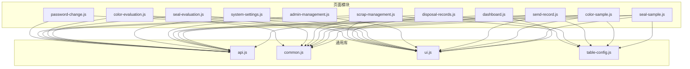

图表来源
- [dashboard.js:1-117](file://static/js/dashboard.js#L1-L117)
- [seal-sample.js:1-181](file://static/js/seal-sample.js#L1-L181)
- [color-sample.js:1-267](file://static/js/color-sample.js#L1-L267)
- [send-record.js:1-156](file://static/js/send-record.js#L1-L156)
- [admin-management.js:1-153](file://static/js/admin-management.js#L1-L153)
- [system-settings.js:1-65](file://static/js/system-settings.js#L1-L65)
- [seal-evaluation.js:1-214](file://static/js/seal-evaluation.js#L1-L214)
- [color-evaluation.js:1-289](file://static/js/color-evaluation.js#L1-L289)
- [disposal-records.js:1-344](file://static/js/disposal-records.js#L1-L344)
- [scrap-management.js:1-118](file://static/js/scrap-management.js#L1-L118)
- [password-change.js:1-113](file://static/js/password-change.js#L1-L113)
- [api.js:1-88](file://static/js/api.js#L1-L88)
- [common.js:1-135](file://static/js/common.js#L1-L135)
- [ui.js:1-224](file://static/js/ui.js#L1-L224)
- [table-config.js:1-552](file://static/js/table-config.js#L1-L552)

章节来源
- [dashboard.js:1-117](file://static/js/dashboard.js#L1-L117)
- [api.js:1-88](file://static/js/api.js#L1-L88)
- [common.js:1-135](file://static/js/common.js#L1-L135)
- [ui.js:1-224](file://static/js/ui.js#L1-L224)
- [table-config.js:1-552](file://static/js/table-config.js#L1-L552)

## 核心组件
- API封装（api.js）
  - 统一封装GET/POST/PUT/DELETE与文件上传，内置JWT令牌注入与401自动跳转登录逻辑，提供全局错误提示。
- 通用工具（common.js）
  - 提供日期格式化、ΔE计算与等级判定、状态标签映射、相对时间、分页生成、防抖、HTML转义、剪贴板复制等工具。
- UI组件（ui.js）
  - 提供Toast、Modal、Confirm、TabSwitch、Loading、Drawer等基础组件，统一交互体验。
- 表格配置（table-config.js）
  - 统一管理各页面的字段定义、筛选面板、列设置、动态表头与单元格渲染，支持本地缓存与后端配置同步。

章节来源
- [api.js:1-88](file://static/js/api.js#L1-L88)
- [common.js:1-135](file://static/js/common.js#L1-L135)
- [ui.js:1-224](file://static/js/ui.js#L1-L224)
- [table-config.js:1-552](file://static/js/table-config.js#L1-L552)

## 架构总览
前端采用“页面模块 + 通用库”分层架构：
- 页面模块负责具体业务（CRUD、评估、报表等），通过API封装访问后端服务。
- 通用库提供跨模块共享的能力（UI、工具、表格配置），降低重复开发。
- 动态页面加载与路由管理通过页面内函数与全局变量协同实现，无需额外路由框架。

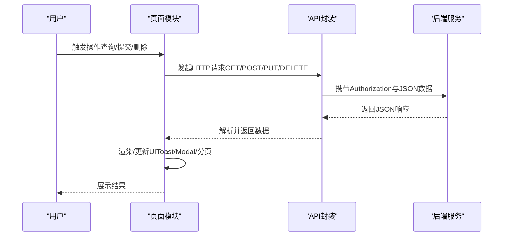

图表来源
- [api.js:7-42](file://static/js/api.js#L7-L42)
- [common.js:70-88](file://static/js/common.js#L70-L88)
- [ui.js:19-61](file://static/js/ui.js#L19-L61)

## 详细组件分析

### 仪表盘模块（dashboard.js）
- 职责范围
  - 加载统计卡片与预警列表，支持跳转到相应评估页。
- 核心功能
  - 并行请求统计数据与预警，渲染统计卡片与动画数字，渲染预警表格与时间线。
- 用户交互
  - 点击“去评定”跳转评估页；空状态提示。
- 数据流
  - API.get -> 渲染 -> DOM更新。
- 性能与可用性
  - 使用requestAnimationFrame实现数字动画；Promise.all并发请求提升首屏速度。

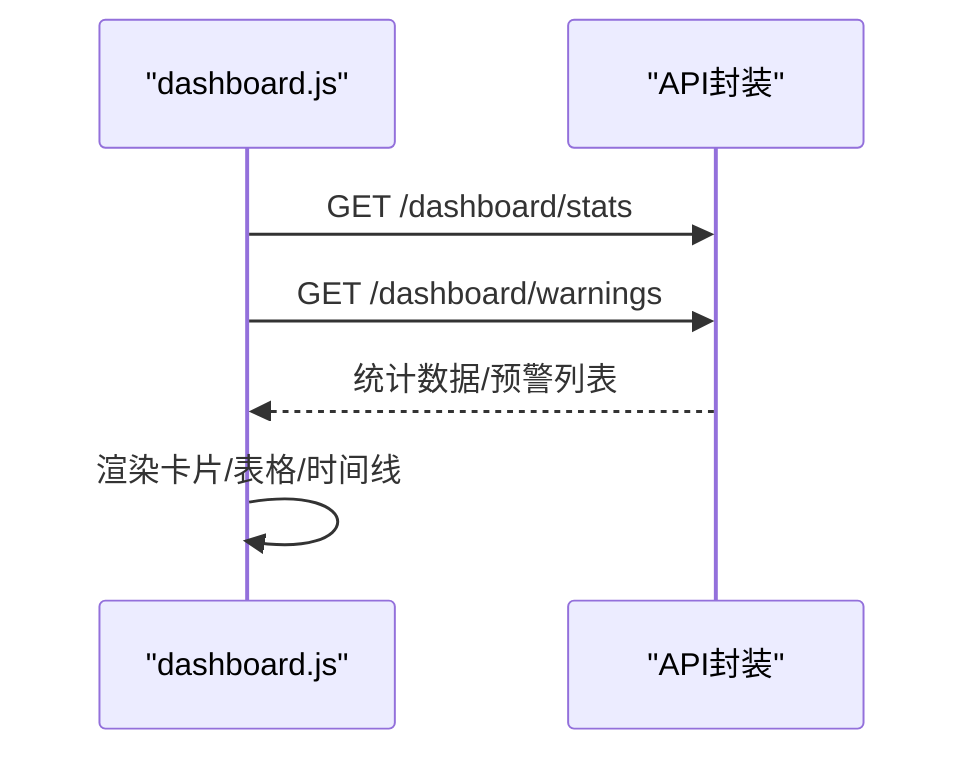

图表来源
- [dashboard.js:5-13](file://static/js/dashboard.js#L5-L13)
- [dashboard.js:15-41](file://static/js/dashboard.js#L15-L41)
- [dashboard.js:66-103](file://static/js/dashboard.js#L66-L103)

章节来源
- [dashboard.js:1-117](file://static/js/dashboard.js#L1-L117)

### 封样件管理模块（seal-sample.js）
- 职责范围
  - 封样件台账的CRUD、动态筛选、列配置、分页、导入导出。
- 核心功能
  - 动态表头与单元格渲染、操作列按钮、表单校验与保存、删除确认、评估跳转。
- 用户交互
  - 新增/编辑/查看/删除/评估；筛选条件收集与查询参数转换；列设置弹窗。
- 数据流
  - TableConfig.buildFilterToolbar -> doSearch -> API.get -> renderSealTable -> 分页。
- 扩展点
  - 新增字段只需在TableConfig定义；自定义渲染器在renderers中扩展。

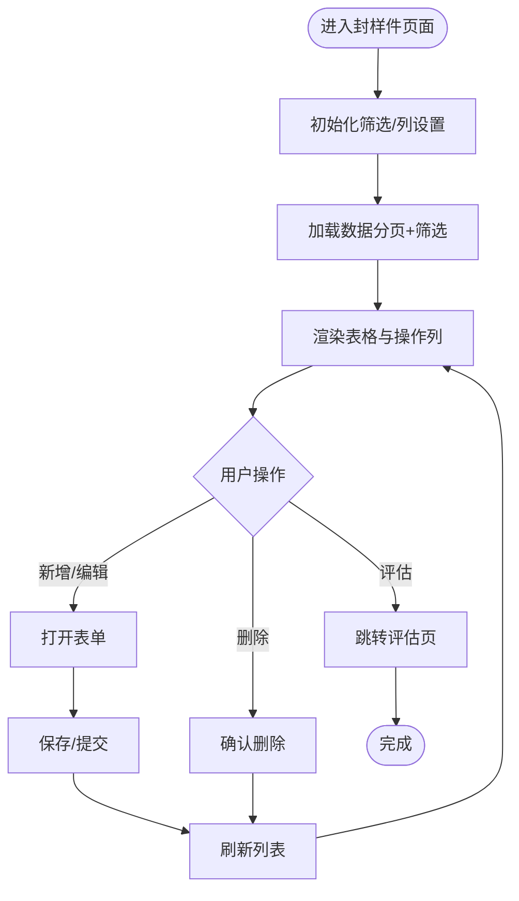

图表来源
- [seal-sample.js:8-61](file://static/js/seal-sample.js#L8-L61)
- [seal-sample.js:148-180](file://static/js/seal-sample.js#L148-L180)
- [table-config.js:244-280](file://static/js/table-config.js#L244-L280)

章节来源
- [seal-sample.js:1-181](file://static/js/seal-sample.js#L1-L181)
- [table-config.js:1-552](file://static/js/table-config.js#L1-L552)

### 色板管理模块（color-sample.js）
- 职责范围
  - 色板台账的CRUD、动态筛选、列配置、展开行查看基准Lab与色差、寄出流程。
- 核心功能
  - 展开行显示Lab基准与ΔE参数；ΔE输入联动计算；寄出数量校验与库存联动。
- 用户交互
  - 新增/编辑/删除/寄出/评估；展开/收起行；输入联动与提示。
- 数据流
  - 表单输入 -> 计算ΔE -> 保存/提交 -> 刷新色板列表与寄出记录。

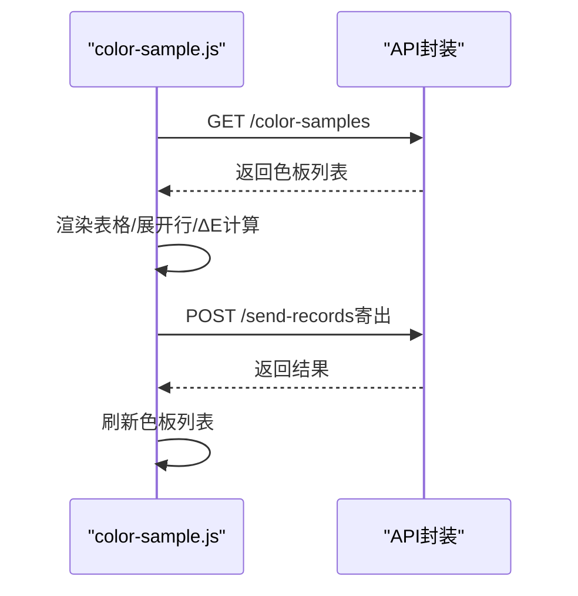

图表来源
- [color-sample.js:8-99](file://static/js/color-sample.js#L8-L99)
- [color-sample.js:207-245](file://static/js/color-sample.js#L207-L245)

章节来源
- [color-sample.js:1-267](file://static/js/color-sample.js#L1-L267)

### 寄出管理模块（send-record.js）
- 职责范围
  - 寄出记录的管理（新增、删除/恢复、导出），与色板库存联动。
- 核心功能
  - 下拉选择色板、自动带出持有数量、输入校验、删除恢复。
- 用户交互
  - 新增寄出记录、删除（恢复）寄出记录、导出。
- 数据流
  - 选择色板 -> 校验数量 -> 提交 -> 刷新寄出列表与色板库存。

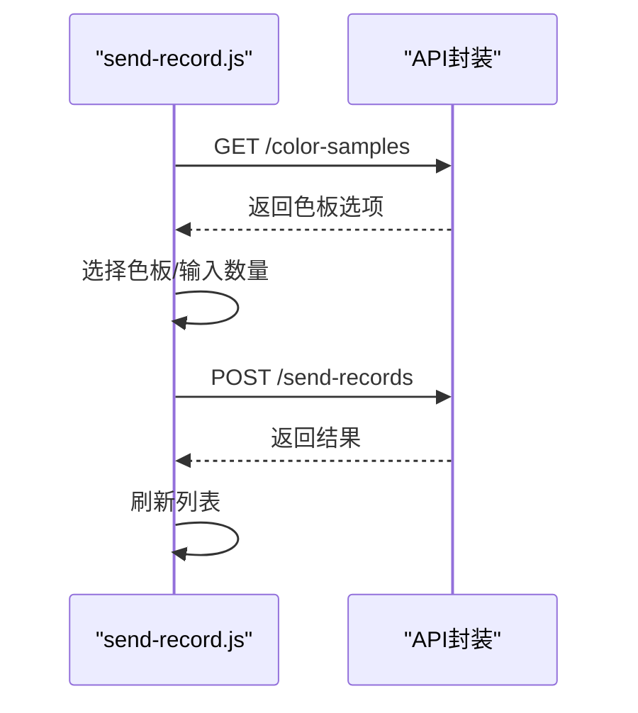

图表来源
- [send-record.js:84-130](file://static/js/send-record.js#L84-L130)

章节来源
- [send-record.js:1-156](file://static/js/send-record.js#L1-L156)

### 系统管理模块（admin-management.js）
- 职责范围
  - 用户管理（启用/禁用、删除）、邀请码管理（生成/启用/停用/删除）、Tab切换。
- 核心功能
  - 用户列表渲染、邀请码列表渲染、生成新邀请码、复制邀请码。
- 用户交互
  - 切换Tab、搜索用户、开关用户状态、删除用户、生成/删除邀请码。
- 数据流
  - API.get -> 渲染 -> 操作 -> API.put/delete -> 刷新。

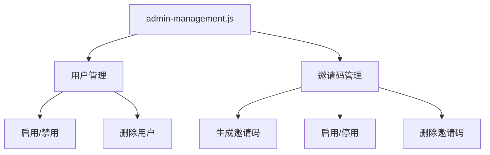

图表来源
- [admin-management.js:6-42](file://static/js/admin-management.js#L6-L42)
- [admin-management.js:66-108](file://static/js/admin-management.js#L66-L108)

章节来源
- [admin-management.js:1-153](file://static/js/admin-management.js#L1-L153)

### 系统设置模块（system-settings.js）
- 职责范围
  - ΔE阈值配置（优秀/合格/关注），实时预览阈值效果。
- 核心功能
  - 加载设置、输入联动预览、保存设置、重置阈值。
- 用户交互
  - 输入阈值 -> 实时预览 -> 保存 -> 生效。
- 数据流
  - API.get -> 填充表单 -> updateSettingsPreview -> API.put。

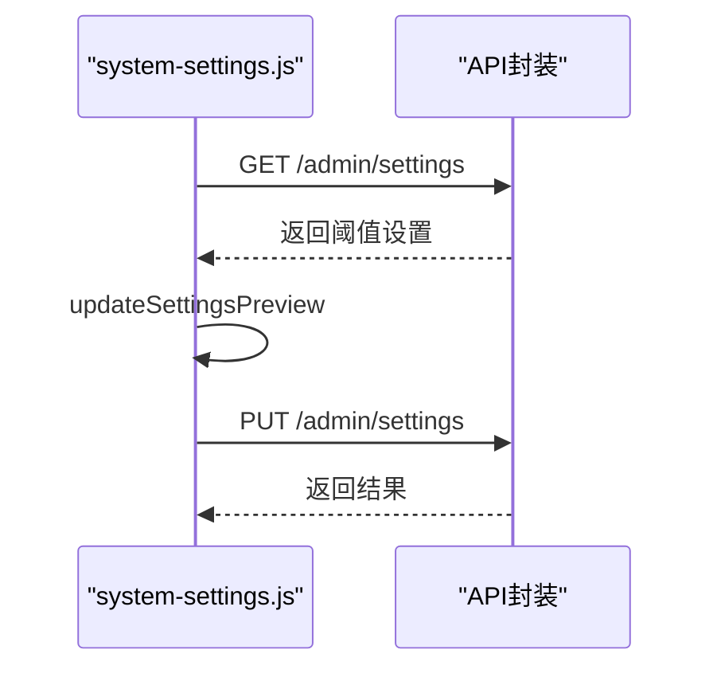

图表来源
- [system-settings.js:6-21](file://static/js/system-settings.js#L6-L21)
- [system-settings.js:23-47](file://static/js/system-settings.js#L23-L47)
- [system-settings.js:52-61](file://static/js/system-settings.js#L52-L61)

章节来源
- [system-settings.js:1-65](file://static/js/system-settings.js#L1-L65)

### 封样件评估模块（seal-evaluation.js）
- 职责范围
  - 封样件待评估/已过期/已报废记录的集中评估，支持合格续期与不合格报废。
- 核心功能
  - 按状态筛选、评估对话框、提交评估、联动刷新封样件列表。
- 用户交互
  - 选择评估结果（合格/不合格）-> 填写必要信息 -> 提交 -> 刷新。
- 数据流
  - 加载全量封样件 -> 按tab筛选 -> 渲染 -> 评估 -> API.post -> 刷新。

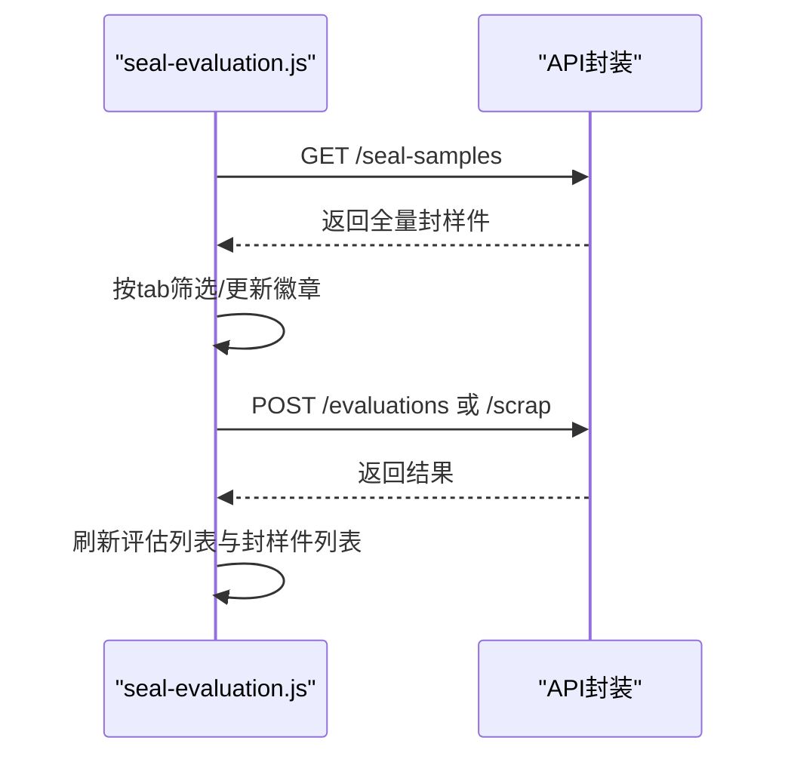

图表来源
- [seal-evaluation.js:6-32](file://static/js/seal-evaluation.js#L6-L32)
- [seal-evaluation.js:95-152](file://static/js/seal-evaluation.js#L95-L152)
- [seal-evaluation.js:174-199](file://static/js/seal-evaluation.js#L174-L199)

章节来源
- [seal-evaluation.js:1-214](file://static/js/seal-evaluation.js#L1-L214)

### 色板评估模块（color-evaluation.js）
- 职责范围
  - 色板ΔE实时计算与等级判定、评估与报废流程。
- 核心功能
  - LAB输入联动计算ΔE、阈值配置读取、评估/报废提交、刷新色板与列表。
- 用户交互
  - 输入当前L/a/b -> 实时ΔE与等级 -> 选择评估结果 -> 提交。
- 数据流
  - 加载阈值 -> 打开评估对话框 -> 输入当前LAB -> 计算ΔE -> 提交 -> 刷新。

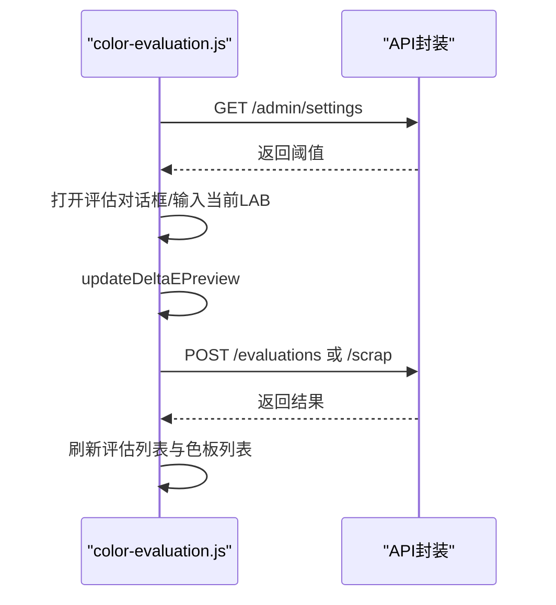

图表来源
- [color-evaluation.js:8-18](file://static/js/color-evaluation.js#L8-L18)
- [color-evaluation.js:90-188](file://static/js/color-evaluation.js#L90-L188)
- [color-evaluation.js:205-235](file://static/js/color-evaluation.js#L205-L235)
- [color-evaluation.js:237-267](file://static/js/color-evaluation.js#L237-L267)

章节来源
- [color-evaluation.js:1-289](file://static/js/color-evaluation.js#L1-L289)

### 处置记录模块（disposal-records.js）
- 职责范围
  - 统一查看处置记录（评估/报废），支持软删除、恢复、永久删除、导出。
- 核心功能
  - 统一渲染、详情抽屉、管理员操作、回收站模式。
- 用户交互
  - 查看详情、删除/恢复/永久删除、导出、切换回收站。
- 数据流
  - 加载处置记录 -> 渲染 -> 管理员操作 -> 刷新。

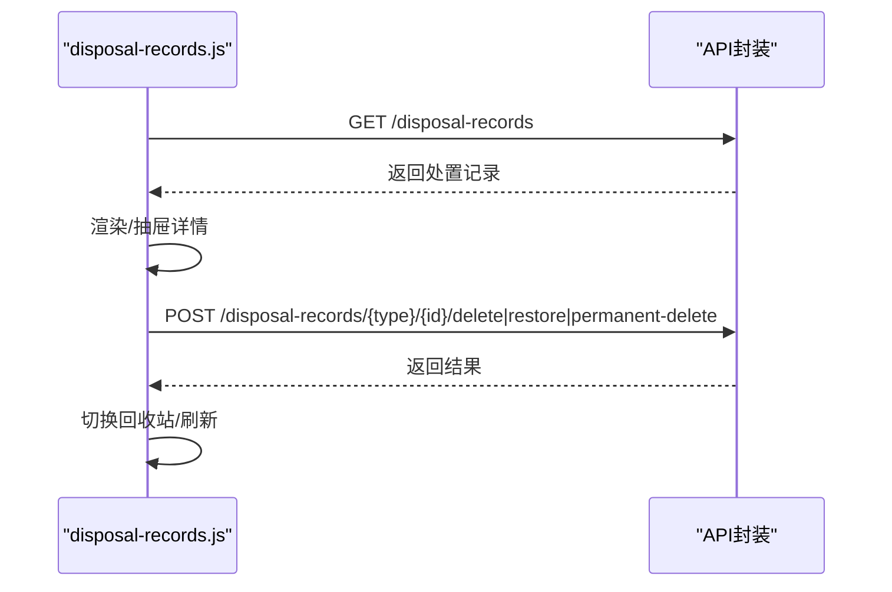

图表来源
- [disposal-records.js:9-26](file://static/js/disposal-records.js#L9-L26)
- [disposal-records.js:134-215](file://static/js/disposal-records.js#L134-L215)
- [disposal-records.js:224-266](file://static/js/disposal-records.js#L224-L266)

章节来源
- [disposal-records.js:1-344](file://static/js/disposal-records.js#L1-L344)

### 报废管理模块（scrap-management.js）
- 职责范围
  - 报废记录查看与管理（查看详情、删除恢复、永久删除）。
- 核心功能
  - 客户端分页、筛选、列配置、详情抽屉。
- 用户交互
  - 查看详情、删除恢复、永久删除。
- 数据流
  - 加载报废记录 -> 渲染 -> 管理员操作 -> 刷新。

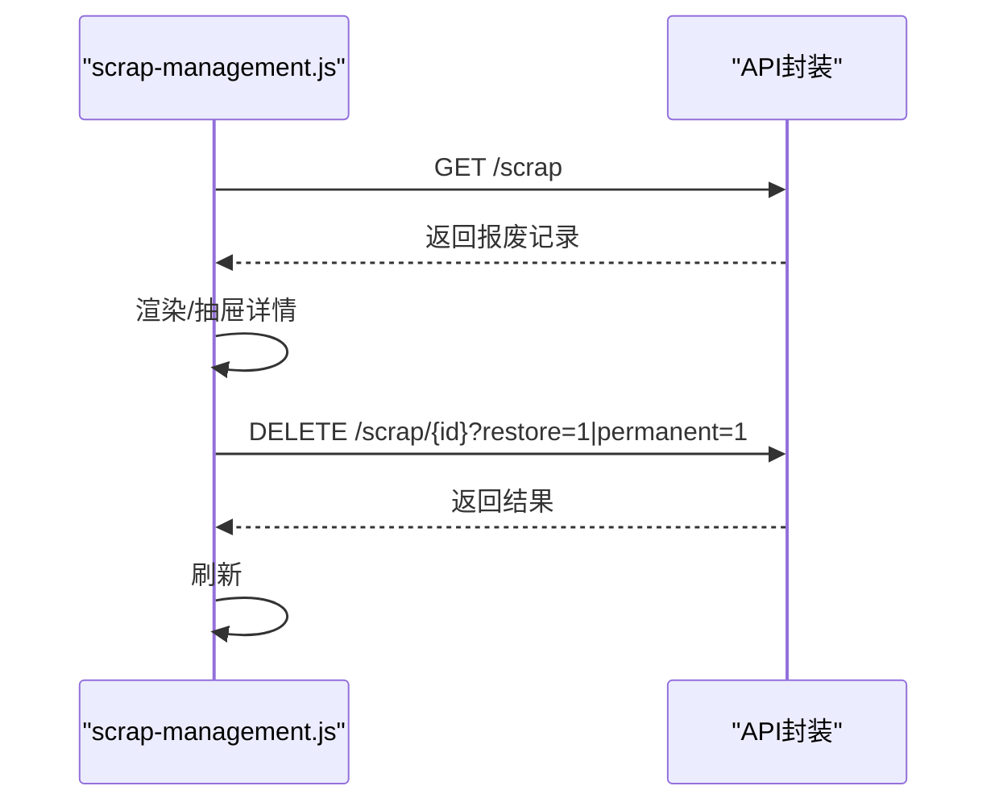

图表来源
- [scrap-management.js:9-33](file://static/js/scrap-management.js#L9-L33)
- [scrap-management.js:66-85](file://static/js/scrap-management.js#L66-L85)
- [scrap-management.js:87-101](file://static/js/scrap-management.js#L87-L101)

章节来源
- [scrap-management.js:1-118](file://static/js/scrap-management.js#L1-L118)

### 密码修改模块（password-change.js）
- 职责范围
  - 支持强制改密与自主改密，密码强度检测，提交后自动登出。
- 核心功能
  - 表单校验、强度检测、提交修改、错误提示、自动跳转登录。
- 用户交互
  - 输入旧/新/确认密码 -> 校验 -> 提交 -> 成功提示 -> 登出。
- 数据流
  - 表单提交 -> API.put -> 成功提示 -> 清除本地存储 -> 跳转登录。

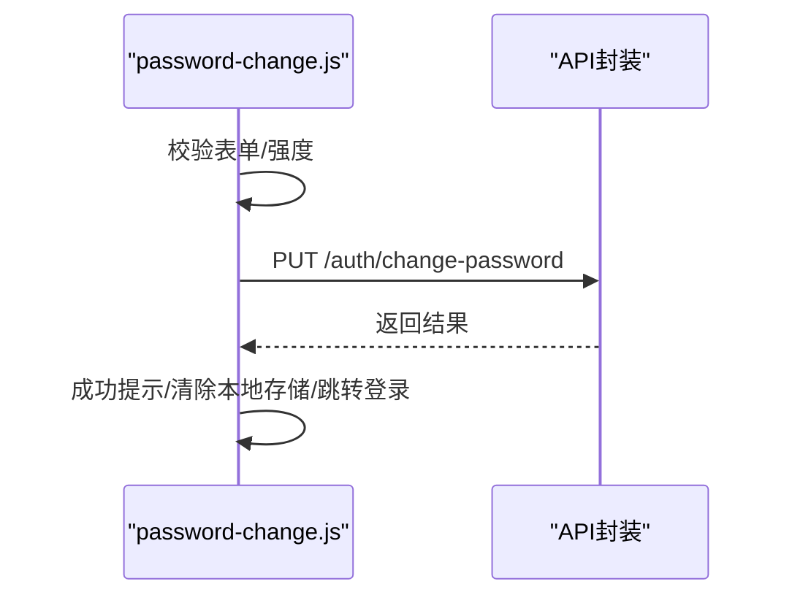

图表来源
- [password-change.js:65-94](file://static/js/password-change.js#L65-L94)

章节来源
- [password-change.js:1-113](file://static/js/password-change.js#L1-L113)

### 动态页面加载与路由管理
- 页面切换机制
  - 通过全局变量_window._currentPageHandler承载当前页面的加载函数，分页跳转时调用_window.goPage，实现“伪SPA”页面切换。
- 初始化策略
  - 多数模块在DOMReady时执行初始化，构建筛选面板、列设置按钮、绑定事件与首次加载。
- 与后端API集成
  - 所有模块通过API封装统一访问后端，自动注入Authorization头，401时自动跳转登录。

章节来源
- [common.js:134-135](file://static/js/common.js#L134-L135)
- [api.js:7-42](file://static/js/api.js#L7-L42)
- [seal-sample.js:148-180](file://static/js/seal-sample.js#L148-L180)
- [color-sample.js:247-267](file://static/js/color-sample.js#L247-L267)
- [send-record.js:140-156](file://static/js/send-record.js#L140-L156)
- [disposal-records.js:320-344](file://static/js/disposal-records.js#L320-L344)
- [scrap-management.js:103-118](file://static/js/scrap-management.js#L103-L118)

### 用户界面设计原则与响应式布局
- 设计原则
  - 一致性：统一的Toast、Modal、TabSwitch、分页样式；标签与状态颜色语义明确。
  - 可用性：空状态提示、输入校验、实时预览（ΔE）、操作二次确认。
  - 可访问性：键盘可操作（ESC关闭）、焦点管理、语义化标签。
- 响应式布局
  - 采用CSS Grid与Flex布局，表格列在窄屏下可折叠；Modal宽度支持wide/xwide/narrow；抽屉Drawer右侧滑出。

章节来源
- [ui.js:19-61](file://static/js/ui.js#L19-L61)
- [ui.js:63-112](file://static/js/ui.js#L63-L112)
- [ui.js:143-164](file://static/js/ui.js#L143-L164)
- [ui.js:193-220](file://static/js/ui.js#L193-L220)

### 模块初始化、事件处理与异步操作
- 初始化
  - 多数模块在DOMContentLoaded时执行初始化函数，构建筛选工具栏、列设置按钮、绑定事件与首次加载。
- 事件处理
  - 使用事件委托与防抖（debounce）优化高频输入；模态框/抽屉通过类名控制显示/隐藏。
- 异步操作
  - Promise.all并发请求提升性能；API封装统一处理401与错误提示；分页通过_window.goPage触发当前页面处理器。

章节来源
- [dashboard.js:114-117](file://static/js/dashboard.js#L114-L117)
- [common.js:90-92](file://static/js/common.js#L90-L92)
- [api.js:14-42](file://static/js/api.js#L14-L42)

### 模块扩展与定制化指导
- 新增页面字段
  - 在table-config.js的PAGE_DEFS中为对应页面新增字段定义，设置type、filterable、options等；如需自定义渲染，在renderers中扩展。
- 新增页面
  - 参考现有页面模块结构：初始化函数、加载数据、渲染表格、绑定事件、导出/导入绑定；在common.js中为分页提供_window.goPage。
- UI组件复用
  - 优先使用UI.Toast/UI.Modal/UI.Confirm/UI.TabSwitch/UI.Drawer，避免重复造轮子。
- 数据同步
  - 通过TableConfig.loadConfig/loadConfig异步加载后端配置，本地缓存localStorage，保证离线可用与快速展示。

章节来源
- [table-config.js:15-154](file://static/js/table-config.js#L15-L154)
- [table-config.js:164-227](file://static/js/table-config.js#L164-L227)
- [common.js:134-135](file://static/js/common.js#L134-L135)

## 依赖关系分析

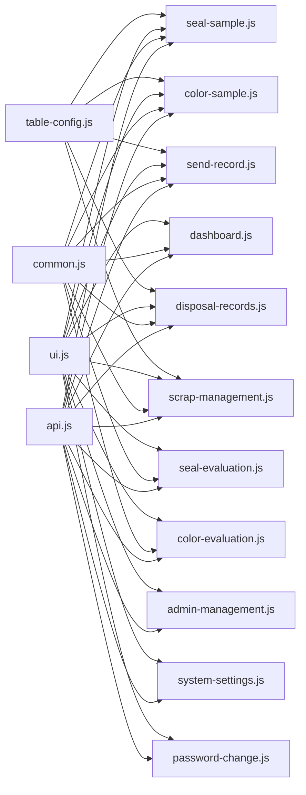

图表来源
- [api.js:1-88](file://static/js/api.js#L1-L88)
- [common.js:1-135](file://static/js/common.js#L1-L135)
- [ui.js:1-224](file://static/js/ui.js#L1-L224)
- [table-config.js:1-552](file://static/js/table-config.js#L1-L552)

章节来源
- [api.js:1-88](file://static/js/api.js#L1-L88)
- [common.js:1-135](file://static/js/common.js#L1-L135)
- [ui.js:1-224](file://static/js/ui.js#L1-L224)
- [table-config.js:1-552](file://static/js/table-config.js#L1-L552)

## 性能考量
- 并发请求：仪表盘使用Promise.all并发获取统计数据与预警，缩短首屏等待。
- 本地缓存：TableConfig优先读取localStorage缓存，再异步拉取后端配置，提升交互流畅度。
- 分页与虚拟滚动：列表采用服务端分页，避免一次性渲染大量DOM；部分页面（报废管理）客户端分页，注意数据规模。
- 事件节流：高频输入使用debounce（如筛选）降低重绘压力。
- 资源加载：静态资源按需引入，避免重复加载。

## 故障排查指南
- 401未授权
  - API封装检测到401自动清除本地token并跳转登录；检查Authorization头是否正确注入。
- 网络请求失败
  - 统一错误提示“网络请求失败，请检查连接”，检查网络与后端连通性。
- 表单校验失败
  - 必填项缺失或输入不符合要求（如密码长度、寄出数量超限），查看Toast提示。
- 列设置冲突
  - 列设置弹窗限制至少保留一列，确保默认列不被取消。
- 评估/报废二次确认
  - 评估/报废涉及不可逆操作，确认对话框二次确认，避免误操作。

章节来源
- [api.js:20-33](file://static/js/api.js#L20-L33)
- [common.js:90-92](file://static/js/common.js#L90-L92)
- [color-sample.js:231-233](file://static/js/color-sample.js#L231-L233)
- [table-config.js:437-446](file://static/js/table-config.js#L437-L446)
- [color-evaluation.js:192-198](file://static/js/color-evaluation.js#L192-L198)
- [seal-evaluation.js:192-198](file://static/js/seal-evaluation.js#L192-L198)

## 结论
本系统前端以模块化为核心，通过统一的API封装、UI组件与表格配置库，实现了高内聚、低耦合的功能模块。模块间通过约定的事件与数据传递机制协同工作，既满足了业务需求，又具备良好的扩展性与可维护性。建议在后续迭代中持续完善表格配置的后端持久化与权限控制，增强审计与追踪能力。

## 附录
- 前端与后端API集成要点
  - 统一通过API封装访问，自动注入Authorization头；401自动跳转登录；上传使用FormData；分页参数与筛选参数遵循各模块约定。
- 数据模型与字段映射
  - 封样件、色板、寄出记录、报废记录、处置记录等均有对应的字段定义与渲染器，详见table-config.js中的PAGE_DEFS。
- 响应式与无障碍
  - 采用现代CSS布局与语义化HTML，结合UI组件的键盘与焦点管理，提升可用性。