# 寄出管理模块

<cite>
**本文档引用的文件**
- [app.py](file://app.py)
- [send-record.js](file://static/js/send-record.js)
- [send-record.html](file://templates/send-record.html)
- [color-sample.js](file://static/js/color-sample.js)
- [disposal-records.js](file://static/js/disposal-records.js)
</cite>

## 目录
1. [简介](#简介)
2. [项目结构](#项目结构)
3. [核心组件](#核心组件)
4. [架构概览](#架构概览)
5. [详细组件分析](#详细组件分析)
6. [依赖关系分析](#依赖关系分析)
7. [性能考虑](#性能考虑)
8. [故障排除指南](#故障排除指南)
9. [结论](#结论)

## 简介

寄出管理模块是封样件及色板接收登记管理系统的核心功能模块之一，负责管理色板的寄出流程。该模块实现了完整的寄出生命周期管理，包括寄出申请、库存联动扣减、寄出记录管理、审批流程、出库操作等功能。

系统采用Flask作为后端框架，SQLite作为数据库存储，支持JWT认证和权限控制。前端通过JavaScript实现动态表格、筛选、分页和交互功能。

## 项目结构

寄出管理模块在项目中的组织结构如下：

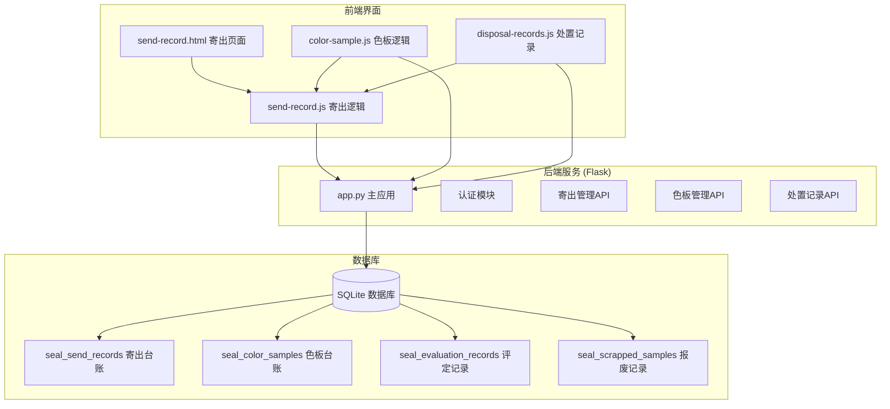

**图表来源**
- [app.py: 1084-1170:1084-1170](file://app.py#L1084-L1170)
- [send-record.js: 1-156:1-156](file://static/js/send-record.js#L1-L156)
- [send-record.html: 1-31:1-31](file://templates/send-record.html#L1-L31)

**章节来源**
- [app.py: 1084-1170:1084-1170](file://app.py#L1084-L1170)
- [send-record.js: 1-156:1-156](file://static/js/send-record.js#L1-L156)
- [send-record.html: 1-31:1-31](file://templates/send-record.html#L1-L31)

## 核心组件

寄出管理模块包含以下核心组件：

### 1. 寄出记录管理
- **创建寄出记录**：验证色板状态和库存数量，扣减库存并创建寄出记录
- **删除寄出记录**：恢复库存并删除寄出记录
- **查询寄出记录**：支持动态筛选、分页和排序
- **导出寄出记录**：支持Excel格式导出

### 2. 库存联动机制
- **实时库存检查**：寄出前验证色板当前持有数量
- **自动库存扣减**：成功寄出后自动扣减色板持有数量
- **库存恢复机制**：删除寄出记录时自动恢复库存

### 3. 权限控制系统
- **用户认证**：基于JWT的用户身份验证
- **管理员权限**：特定操作需要管理员权限
- **账户状态检查**：防止禁用账户进行操作

### 4. 数据验证机制
- **必填字段验证**：确保寄出申请的完整性
- **业务规则验证**：检查色板状态和库存限制
- **数据一致性保证**：通过事务确保数据完整性

**章节来源**
- [app.py: 1110-1155:1110-1155](file://app.py#L1110-L1155)
- [app.py: 1157-1170:1157-1170](file://app.py#L1157-L1170)
- [send-record.js: 118-130:118-130](file://static/js/send-record.js#L118-L130)

## 架构概览

寄出管理模块采用分层架构设计，实现了清晰的关注点分离：

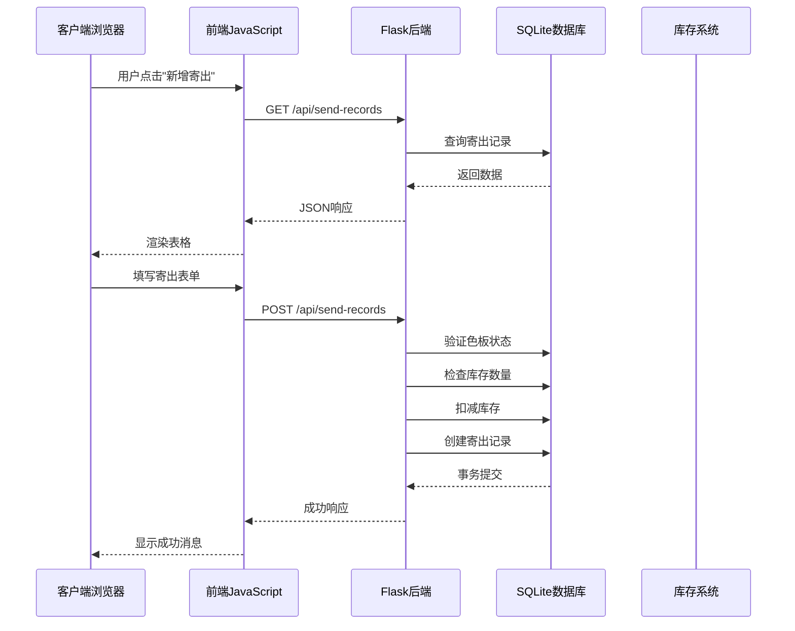

**图表来源**
- [send-record.js: 8-27:8-27](file://static/js/send-record.js#L8-L27)
- [app.py: 1110-1140:1110-1140](file://app.py#L1110-L1140)

### 数据流架构

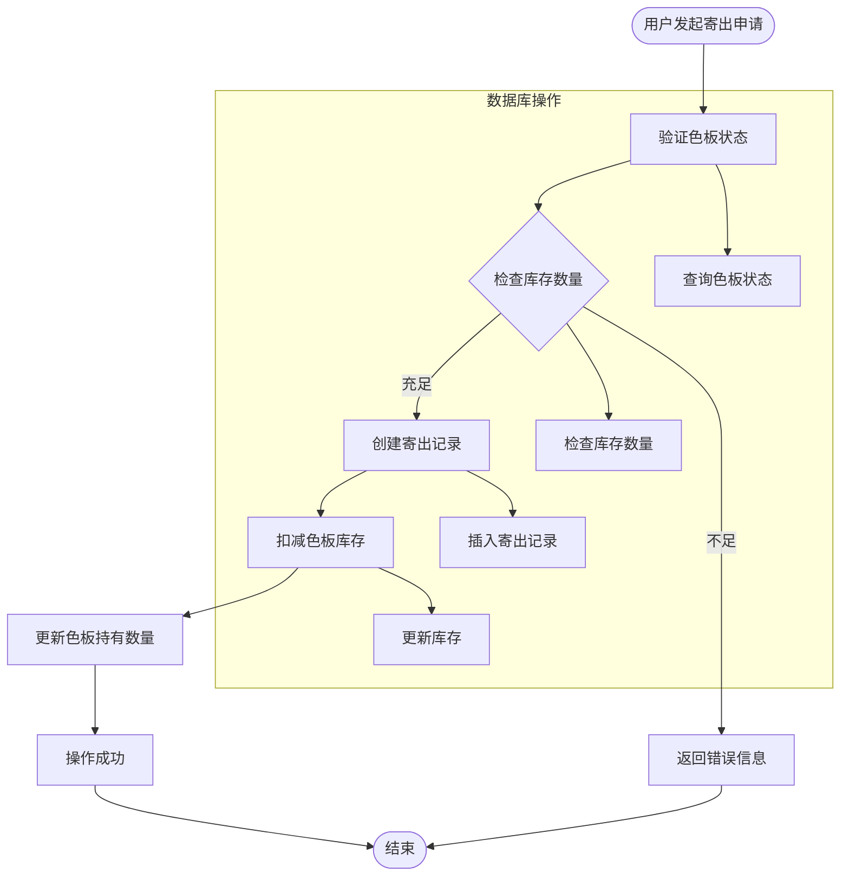

**图表来源**
- [app.py: 1112-1139:1112-1139](file://app.py#L1112-L1139)

## 详细组件分析

### 寄出记录API组件

#### 核心功能实现

寄出记录API提供了完整的CRUD操作和业务逻辑：

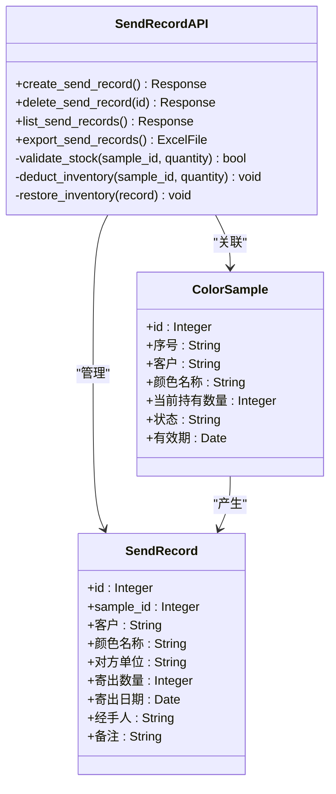

**图表来源**
- [app.py: 1110-1155:1110-1155](file://app.py#L1110-L1155)
- [app.py: 202-217:202-217](file://app.py#L202-L217)
- [app.py: 152-187:152-187](file://app.py#L152-L187)

#### 寄出申请流程

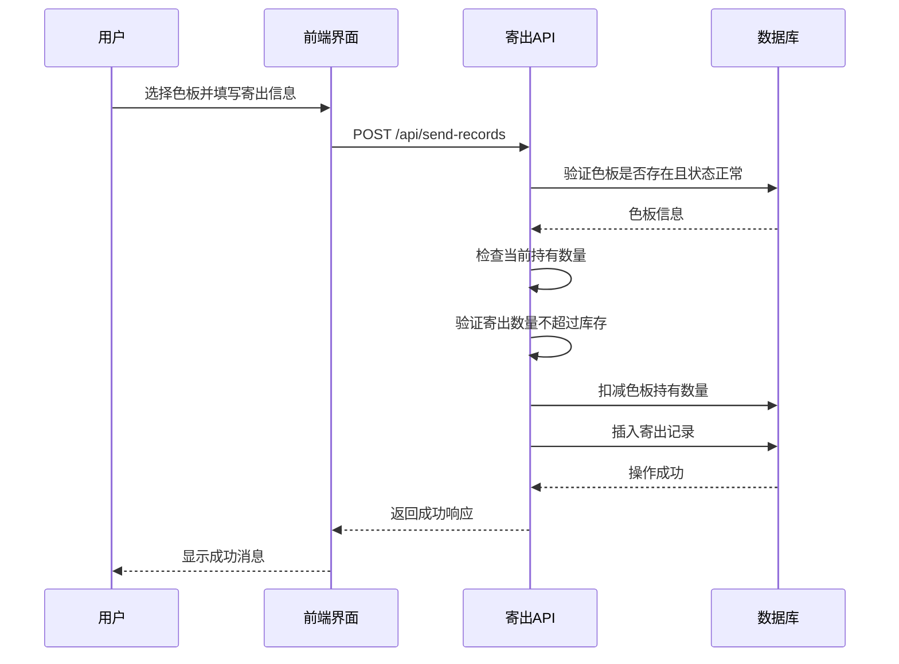

**图表来源**
- [send-record.js: 118-130:118-130](file://static/js/send-record.js#L118-L130)
- [app.py: 1112-1140:1112-1140](file://app.py#L1112-L1140)

**章节来源**
- [app.py: 1110-1155:1110-1155](file://app.py#L1110-L1155)
- [send-record.js: 118-130:118-130](file://static/js/send-record.js#L118-L130)

### 库存联动机制

#### 实时库存同步

库存联动机制确保了寄出操作的准确性和一致性：

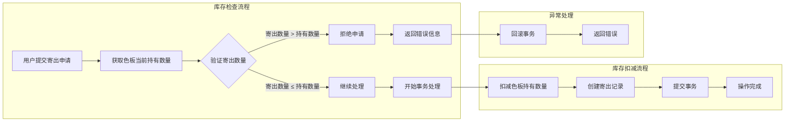

**图表来源**
- [app.py: 1119-1139:1119-1139](file://app.py#L1119-L1139)

#### 库存恢复机制

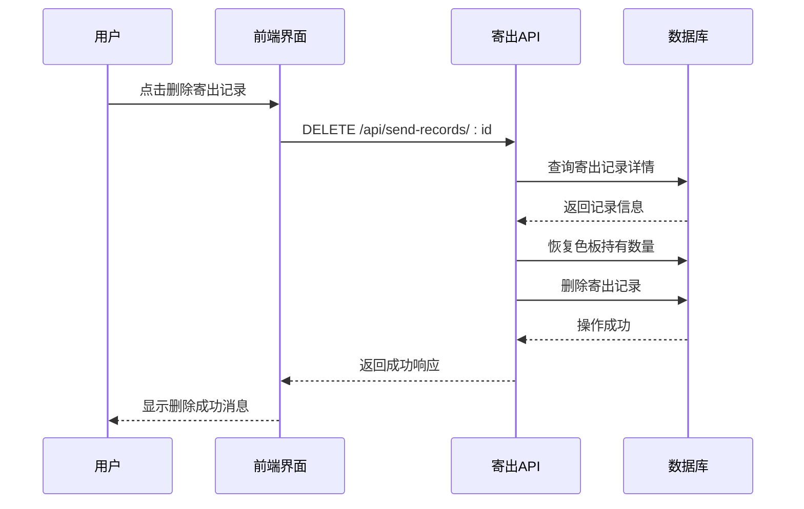

**图表来源**
- [app.py: 1142-1155:1142-1155](file://app.py#L1142-L1155)

**章节来源**
- [app.py: 1119-1155:1119-1155](file://app.py#L1119-L1155)

### 权限控制和安全机制

#### 认证和授权

系统实现了多层次的安全控制：

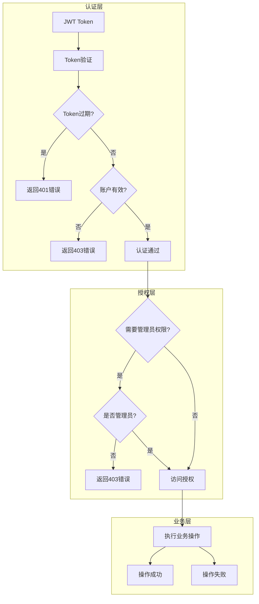

**图表来源**
- [app.py: 49-84:49-84](file://app.py#L49-L84)

#### 数据验证和约束

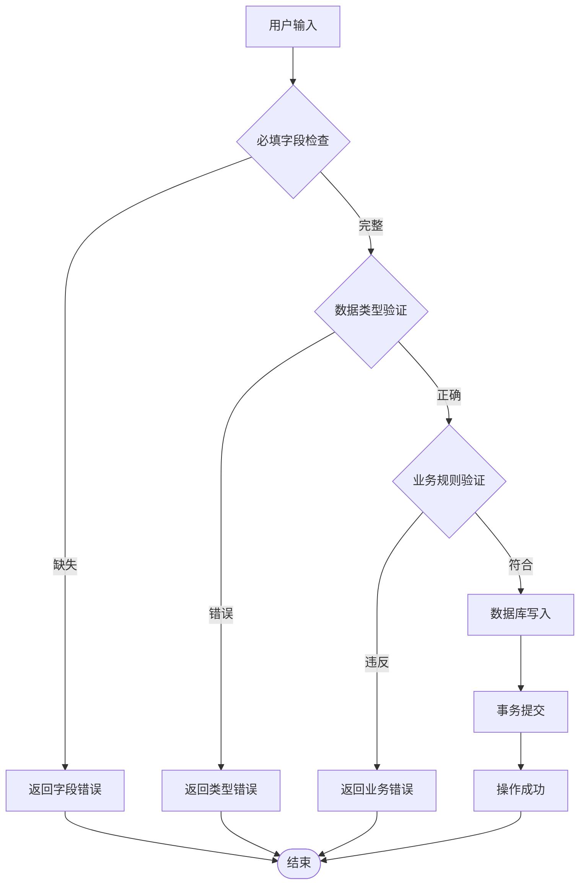

**图表来源**
- [app.py: 1113-1129:1113-1129](file://app.py#L1113-L1129)

**章节来源**
- [app.py: 49-84:49-84](file://app.py#L49-L84)
- [app.py: 1113-1129:1113-1129](file://app.py#L1113-L1129)

### 前端交互组件

#### 寄出记录管理界面

前端组件提供了完整的用户交互体验：

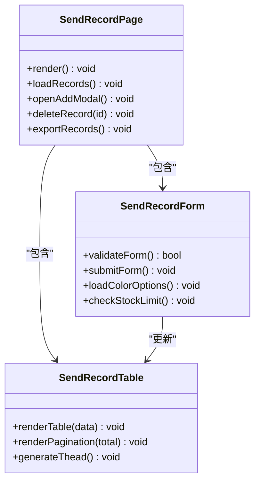

**图表来源**
- [send-record.js: 29-52:29-52](file://static/js/send-record.js#L29-L52)
- [send-record.js: 55-82:55-82](file://static/js/send-record.js#L55-L82)

#### 动态筛选和分页

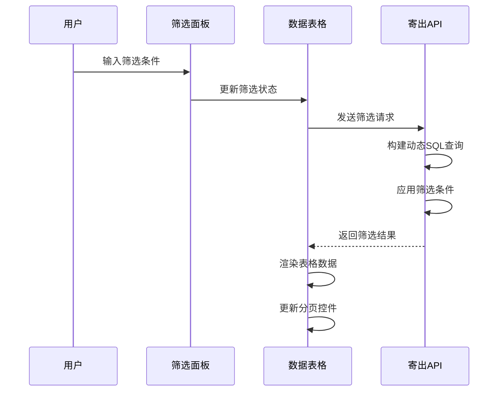

**图表来源**
- [send-record.js: 8-27:8-27](file://static/js/send-record.js#L8-L27)

**章节来源**
- [send-record.js: 29-52:29-52](file://static/js/send-record.js#L29-L52)
- [send-record.js: 55-82:55-82](file://static/js/send-record.js#L55-L82)

## 依赖关系分析

寄出管理模块与其他系统组件的依赖关系如下：

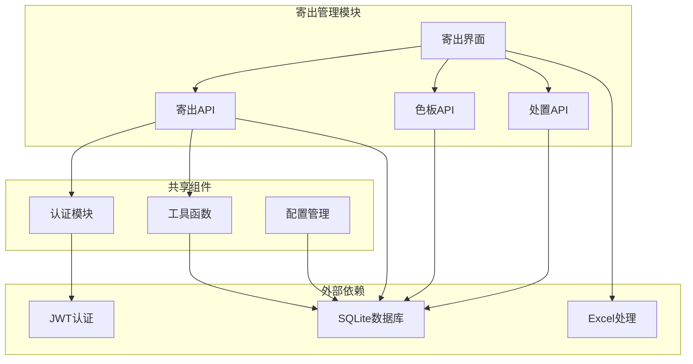

**图表来源**
- [app.py: 1-25:1-25](file://app.py#L1-L25)
- [send-record.js: 1-4:1-4](file://static/js/send-record.js#L1-L4)

### 数据模型依赖

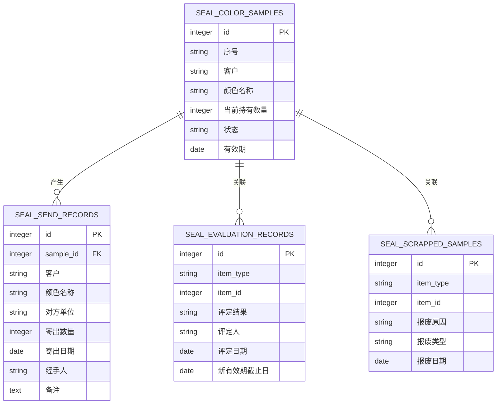

**图表来源**
- [app.py: 152-187:152-187](file://app.py#L152-L187)
- [app.py: 202-217:202-217](file://app.py#L202-L217)
- [app.py: 237-254:237-254](file://app.py#L237-L254)
- [app.py: 257-271:257-271](file://app.py#L257-L271)

**章节来源**
- [app.py: 152-187:152-187](file://app.py#L152-L187)
- [app.py: 202-217:202-217](file://app.py#L202-L217)

## 性能考虑

### 数据库优化策略

1. **索引优化**：对常用查询字段建立适当的索引
2. **查询优化**：使用参数化查询防止SQL注入
3. **连接池管理**：合理管理数据库连接资源
4. **批量操作**：支持批量导入导出功能

### 前端性能优化

1. **虚拟滚动**：大数据量时使用虚拟滚动提升渲染性能
2. **懒加载**：按需加载数据和组件
3. **缓存策略**：合理使用浏览器缓存
4. **异步处理**：避免阻塞主线程的操作

### 缓存机制

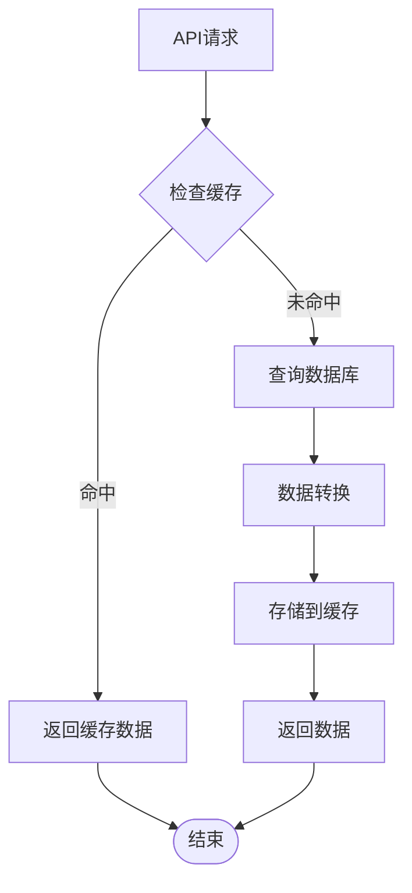

## 故障排除指南

### 常见问题和解决方案

#### 寄出申请失败

**问题现象**：用户提交寄出申请时收到错误提示

**可能原因**：
1. 色板状态异常（已过期或已报废）
2. 寄出数量超过库存限制
3. 必填字段缺失
4. 网络连接问题

**解决步骤**：
1. 检查色板状态是否正常
2. 验证库存数量是否充足
3. 确认所有必填字段都已填写
4. 检查网络连接状态

#### 库存不一致

**问题现象**：寄出后库存显示异常

**可能原因**：
1. 事务处理失败
2. 并发操作冲突
3. 数据库连接异常

**解决步骤**：
1. 检查数据库事务状态
2. 验证并发控制机制
3. 重启数据库服务

#### 权限访问错误

**问题现象**：用户无法执行某些操作

**可能原因**：
1. 用户权限不足
2. Token过期
3. 账户被禁用

**解决步骤**：
1. 检查用户角色权限
2. 重新登录获取新Token
3. 联系管理员检查账户状态

**章节来源**
- [app.py: 1113-1129:1113-1129](file://app.py#L1113-L1129)
- [app.py: 1142-1155:1142-1155](file://app.py#L1142-L1155)

## 结论

寄出管理模块通过精心设计的架构和完善的业务逻辑，实现了色板寄出流程的完整管理。模块具有以下特点：

1. **完整的业务流程**：从寄出申请到库存扣减的全流程管理
2. **强健的数据一致性**：通过事务和验证机制确保数据准确性
3. **灵活的权限控制**：支持多层级的用户权限管理
4. **良好的用户体验**：提供直观的界面和流畅的交互体验
5. **可扩展的设计**：模块化架构便于功能扩展和维护

该模块为色板管理提供了可靠的技术支撑，能够满足实际业务需求并具备良好的可维护性。