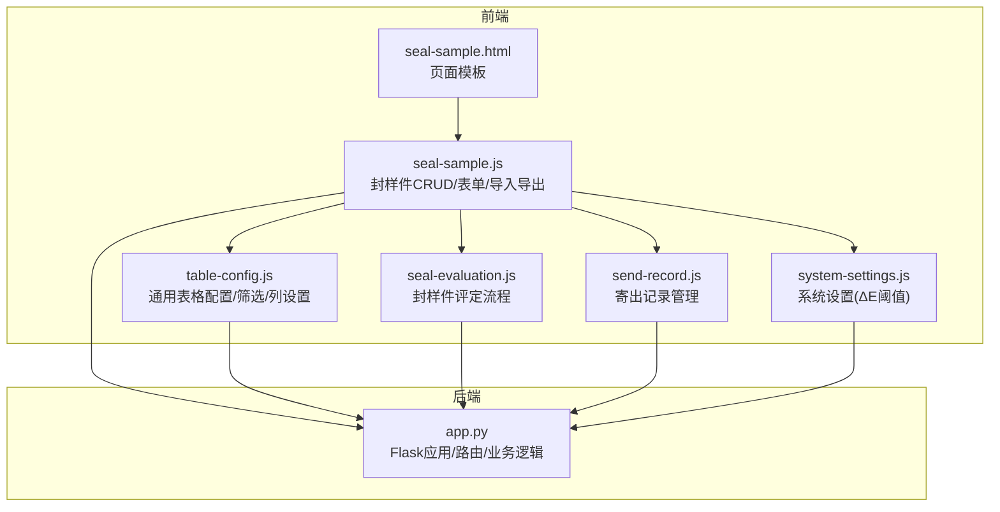
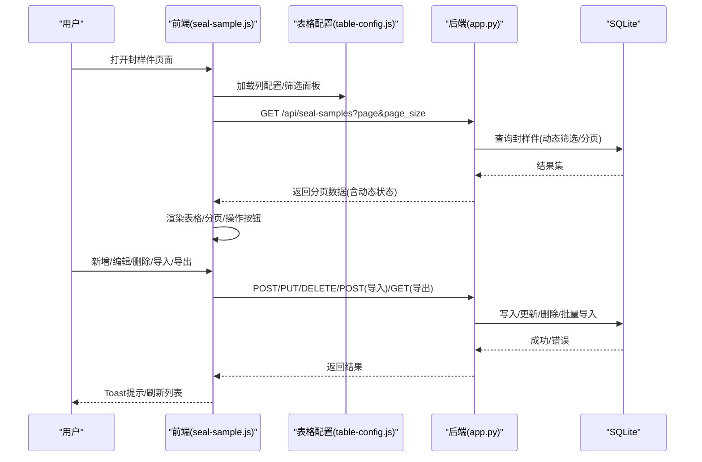
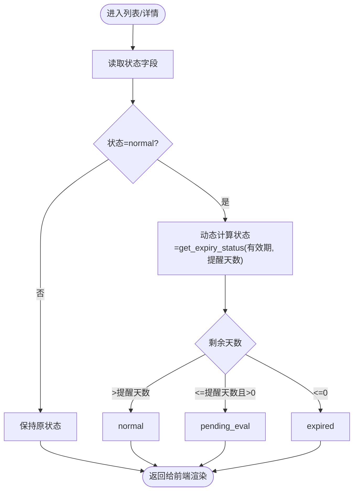
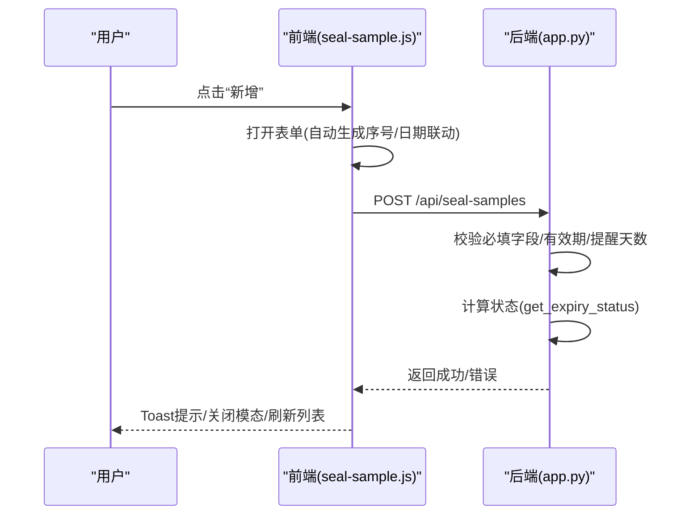
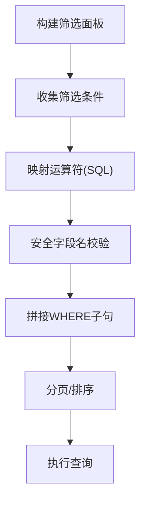
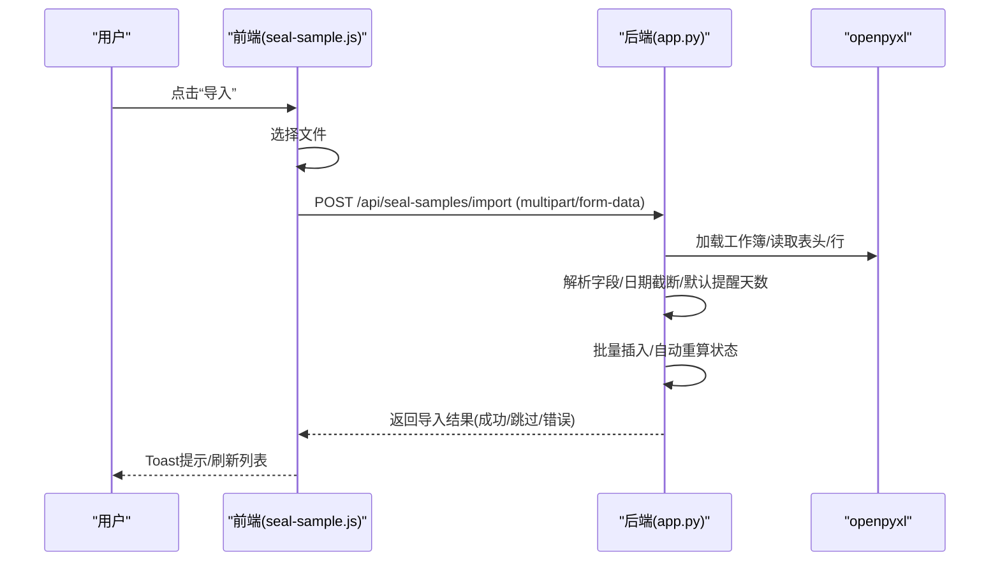
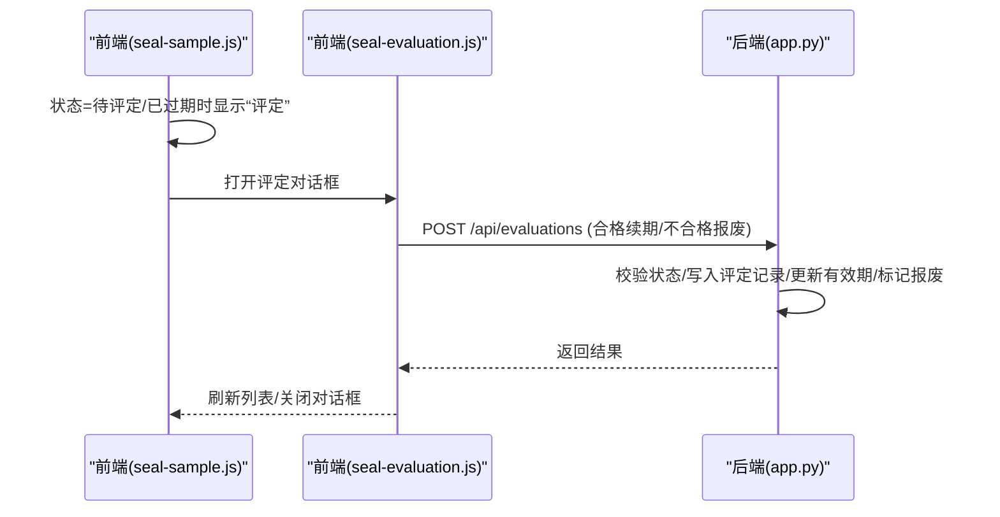
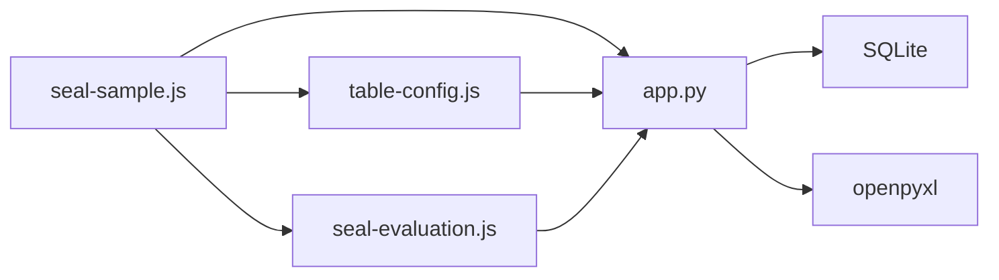

# 封样件管理模块

<cite>
**本文档引用的文件**
- [app.py](file://app.py)
- [seal-sample.html](file://templates/seal-sample.html)
- [seal-sample.js](file://static/js/seal-sample.js)
- [table-config.js](file://static/js/table-config.js)
- [seal-evaluation.js](file://static/js/seal-evaluation.js)
- [send-record.js](file://static/js/send-record.js)
- [system-settings.js](file://static/js/system-settings.js)
- [requirements.txt](file://requirements.txt)
</cite>

## 目录
1. [简介](#简介)
2. [项目结构](#项目结构)
3. [核心组件](#核心组件)
4. [架构总览](#架构总览)
5. [详细组件分析](#详细组件分析)
6. [依赖关系分析](#依赖关系分析)
7. [性能考虑](#性能考虑)
8. [故障排查指南](#故障排查指南)
9. [结论](#结论)
10. [附录](#附录)

## 简介
本模块负责封样件台账的全生命周期管理，包括数据录入、编辑、删除、查询、状态流转、有效期跟踪与提醒、Excel导入导出、高级搜索过滤、表单验证与数据完整性保障，以及与寄出管理、评定管理模块的数据关联。系统采用前后端分离架构，后端基于Flask + SQLite，前端采用纯JavaScript模块化组件，支持动态筛选、列配置、分页与交互式操作。

## 项目结构
- 后端入口与路由：app.py
- 前端页面与脚本：
  - 封样件管理页面：templates/seal-sample.html
  - 封样件管理逻辑：static/js/seal-sample.js
  - 通用表格配置：static/js/table-config.js
  - 评定流程：static/js/seal-evaluation.js
  - 寄出记录：static/js/send-record.js
  - 系统设置：static/js/system-settings.js
- 依赖：requirements.txt

图表来源
- [seal-sample.html:1-45](file://templates/seal-sample.html#L1-L45)
- [seal-sample.js:1-181](file://static/js/seal-sample.js#L1-L181)
- [table-config.js:1-552](file://static/js/table-config.js#L1-L552)
- [seal-evaluation.js:1-214](file://static/js/seal-evaluation.js#L1-L214)
- [send-record.js:1-155](file://static/js/send-record.js#L1-L155)
- [system-settings.js:1-64](file://static/js/system-settings.js#L1-L64)
- [app.py:1-2197](file://app.py#L1-L2197)

章节来源
- [app.py:1-2197](file://app.py#L1-L2197)
- [seal-sample.html:1-45](file://templates/seal-sample.html#L1-L45)
- [seal-sample.js:1-181](file://static/js/seal-sample.js#L1-L181)
- [table-config.js:1-552](file://static/js/table-config.js#L1-L552)
- [seal-evaluation.js:1-214](file://static/js/seal-evaluation.js#L1-L214)
- [send-record.js:1-155](file://static/js/send-record.js#L1-L155)
- [system-settings.js:1-64](file://static/js/system-settings.js#L1-L64)

## 核心组件
- 封样件台账表：存储封样件基本信息、有效期、提醒天数、状态与时间戳。
- 封样件CRUD接口：新增、查询、更新、删除、分页、动态筛选、导入导出。
- 状态管理：正常、待评定、已过期、已报废；有效期到期前N天自动转为“待评定”。
- 有效期跟踪与提醒：按“到期前N天”阈值动态计算状态。
- Excel导入导出：支持模板格式与错误跳过提示。
- 高级搜索与列配置：多字段、多运算符动态筛选，列可见性控制。
- 表单验证与数据完整性：必填校验、日期格式、序号唯一性、状态约束。
- 与寄出管理、评定管理的数据关联：通过状态流转触发评定流程，寄出记录影响库存与状态。

章节来源
- [app.py:129-144](file://app.py#L129-L144)
- [app.py:591-795](file://app.py#L591-L795)
- [table-config.js:15-54](file://static/js/table-config.js#L15-L54)
- [seal-sample.js:65-146](file://static/js/seal-sample.js#L65-L146)

## 架构总览
后端以Flask路由为核心，封装认证、数据库连接、分页、动态筛选、状态计算与Excel导入导出。前端通过seal-sample.js与后端API交互，配合table-config.js实现动态筛选与列配置，seal-evaluation.js驱动封样件状态流转与评定流程。

图表来源
- [seal-sample.js:8-24](file://static/js/seal-sample.js#L8-L24)
- [table-config.js:165-226](file://static/js/table-config.js#L165-L226)
- [app.py:591-795](file://app.py#L591-L795)

## 详细组件分析

### 封样件台账表与状态管理
- 数据模型字段：序号、项目、封样件名称、签署人、签署人日期、有效期、提醒天数、状态、备注、创建/更新时间。
- 状态枚举：normal、pending_eval、expired、scrapped。
- 状态计算逻辑：根据有效期与提醒天数动态计算，到期前N天转为“待评定”，过期转为“已过期”。

图表来源
- [app.py:350-371](file://app.py#L350-L371)
- [app.py:591-623](file://app.py#L591-L623)

章节来源
- [app.py:129-144](file://app.py#L129-L144)
- [app.py:350-371](file://app.py#L350-L371)
- [app.py:591-623](file://app.py#L591-L623)

### CRUD功能与表单验证
- 新增：自动生成序号(GKYJ-时间戳)，必填字段校验，有效期与提醒天数参与状态计算。
- 查询：支持分页、动态筛选、兼容旧参数(search/project)。
- 更新：禁止更新已报废状态；有效期/提醒天数变更时重新计算状态。
- 删除：存在性检查，删除后刷新列表。
- 表单验证：前端必填校验；后端必填字段校验；序号唯一性约束；状态约束(更新时排除已报废)。

图表来源
- [seal-sample.js:65-107](file://static/js/seal-sample.js#L65-L107)
- [seal-sample.js:124-139](file://static/js/seal-sample.js#L124-L139)
- [app.py:625-645](file://app.py#L625-L645)

章节来源
- [seal-sample.js:65-146](file://static/js/seal-sample.js#L65-L146)
- [app.py:625-690](file://app.py#L625-L690)

### 搜索过滤与高级查询
- 动态筛选：支持多条件(f_field_i/f_op_i/f_val_i)，运算符包含包含/不包含/等于/不等于/大于/小于/早于/晚于/为空。
- 字段白名单：仅允许中英文、数字、下划线、Δ、连字符的安全字段名，防止SQL注入。
- 列配置：默认列与可选列，支持本地缓存与后端持久化。

图表来源
- [table-config.js:245-401](file://static/js/table-config.js#L245-L401)
- [table-config.js:403-466](file://static/js/table-config.js#L403-L466)
- [app.py:403-449](file://app.py#L403-L449)

章节来源
- [table-config.js:15-54](file://static/js/table-config.js#L15-L54)
- [table-config.js:245-401](file://static/js/table-config.js#L245-L401)
- [app.py:403-449](file://app.py#L403-L449)

### Excel导入导出
- 导出：按固定字段顺序输出，状态映射为中文，动态计算状态。
- 导入：支持.xlsx/.xls；自动识别是否包含ID列；逐行解析，日期截断YYYY-MM-DD；批量插入并自动重算状态；错误行跳过并汇总首条错误。

图表来源
- [seal-sample.js:164-174](file://static/js/seal-sample.js#L164-L174)
- [app.py:720-795](file://app.py#L720-L795)

章节来源
- [seal-sample.js:164-174](file://static/js/seal-sample.js#L164-L174)
- [app.py:720-795](file://app.py#L720-L795)

### 有效期跟踪与提醒
- 动态状态：到期前N天转为“待评定”，过期转为“已过期”。
- 评定流程：封样件状态为“待评定/已过期”时，页面提供“评定”入口，进入seal-evaluation.js流程，支持“合格续期”或“不合格报废”。

图表来源
- [seal-sample.js:48-58](file://static/js/seal-sample.js#L48-L58)
- [seal-evaluation.js:95-199](file://static/js/seal-evaluation.js#L95-L199)
- [app.py:1226-1250](file://app.py#L1226-L1250)

章节来源
- [app.py:350-371](file://app.py#L350-L371)
- [seal-evaluation.js:6-32](file://static/js/seal-evaluation.js#L6-L32)
- [app.py:1226-1250](file://app.py#L1226-L1250)

### 与寄出管理、评定管理的数据关联
- 寄出记录：封样件状态为“待评定/已过期”时可发起评定；寄出记录影响库存变化，但封样件状态由有效期与提醒天数决定。
- 评定管理：提交评定后更新封样件有效期或标记报废，同时产生处置记录，支持回收站与永久删除。

章节来源
- [send-record.js:1-155](file://static/js/send-record.js#L1-L155)
- [app.py:1084-1116](file://app.py#L1084-L1116)
- [app.py:1226-1250](file://app.py#L1226-L1250)

## 依赖关系分析
- 前端依赖：seal-sample.js依赖table-config.js与seal-evaluation.js；页面模板引入对应脚本。
- 后端依赖：app.py依赖openpyxl进行Excel处理；使用JWT进行认证；SQLite作为数据存储。
- 关键耦合点：状态计算与有效期逻辑集中在后端；前端负责UI与交互；表格配置与筛选逻辑集中于table-config.js。

图表来源
- [seal-sample.js:1-181](file://static/js/seal-sample.js#L1-L181)
- [table-config.js:1-552](file://static/js/table-config.js#L1-L552)
- [seal-evaluation.js:1-214](file://static/js/seal-evaluation.js#L1-L214)
- [app.py:1-2197](file://app.py#L1-L2197)
- [requirements.txt:1-5](file://requirements.txt#L1-L5)

章节来源
- [requirements.txt:1-5](file://requirements.txt#L1-L5)
- [app.py:1-2197](file://app.py#L1-L2197)

## 性能考虑
- 分页：后端支持page/pageSize，不传page_size返回全量；建议前端默认合理页大小，避免一次性加载过多数据。
- 动态筛选：仅允许白名单字段与安全运算符，避免复杂SQL注入风险；建议索引常用查询字段（如有效期、状态）。
- 导入导出：批量写入与自动重算在后端完成，建议控制单次导入行数，避免长时间占用数据库。
- 前端渲染：动态列与筛选面板按需加载，减少DOM压力。

## 故障排查指南
- 认证失败：检查Token是否过期或无效；确认请求头或查询参数携带token。
- 导入失败：确认文件格式为.xlsx/.xls；检查表头与字段顺序；查看返回的错误行提示。
- 状态异常：确认有效期与提醒天数设置；检查系统时间与时区。
- 列配置丢失：确认localStorage与后端配置同步；必要时重置筛选与列设置。

章节来源
- [app.py:49-84](file://app.py#L49-L84)
- [app.py:720-795](file://app.py#L720-L795)
- [table-config.js:165-226](file://static/js/table-config.js#L165-L226)

## 结论
封样件管理模块通过清晰的前后端职责划分，实现了完整的台账管理闭环：从数据录入、状态流转、有效期提醒，到Excel导入导出与高级搜索，再到与寄出与评定模块的协同。系统具备良好的扩展性与可维护性，适合在中小规模场景下稳定运行。

## 附录

### API定义概览
- 列表查询：GET /api/seal-samples（支持分页、动态筛选、兼容旧参数）
- 新增：POST /api/seal-samples（必填字段校验、自动生成序号、状态计算）
- 查看：GET /api/seal-samples/:id（动态计算状态）
- 更新：PUT /api/seal-samples/:id（状态约束、有效期/提醒天数变更重算）
- 删除：DELETE /api/seal-samples/:id（存在性检查）
- 导出：GET /api/seal-samples/export（状态映射中文）
- 导入：POST /api/seal-samples/import（xlsx/xls，逐行解析与错误跳过）

章节来源
- [app.py:591-795](file://app.py#L591-L795)