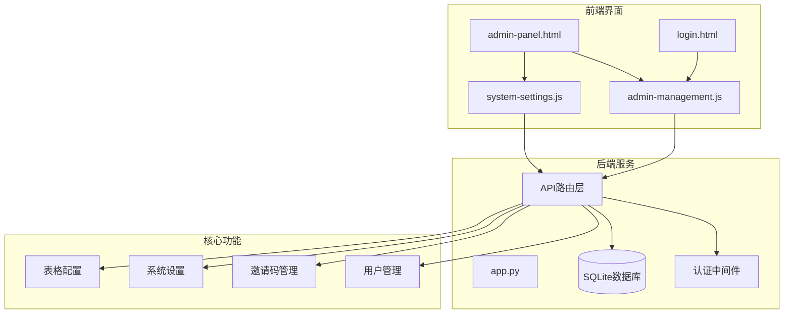
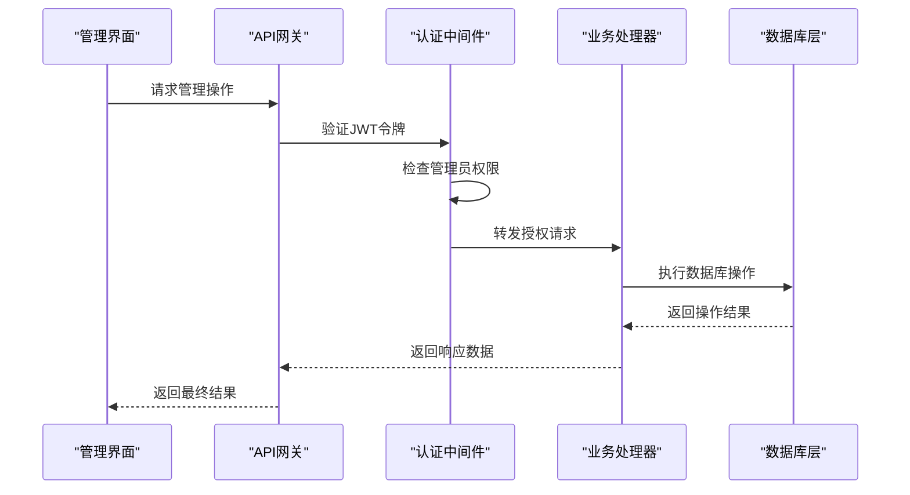
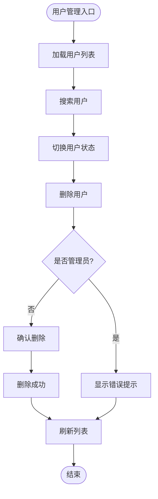
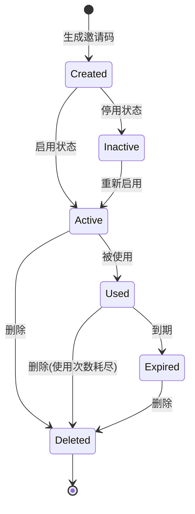
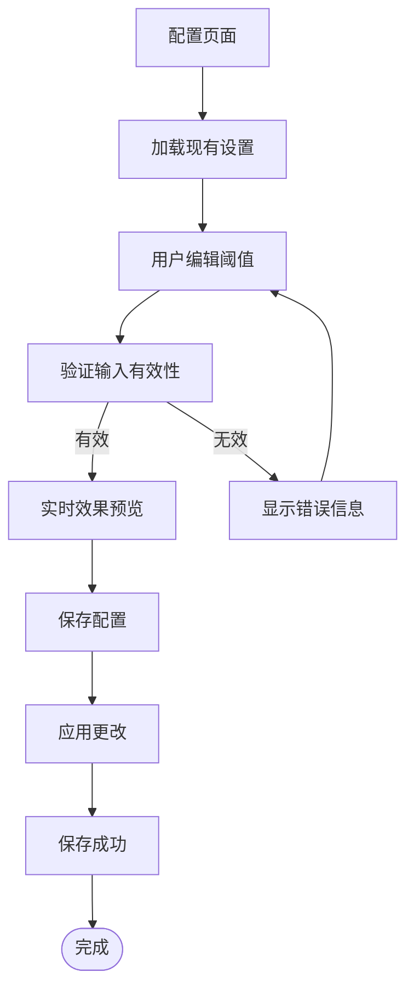
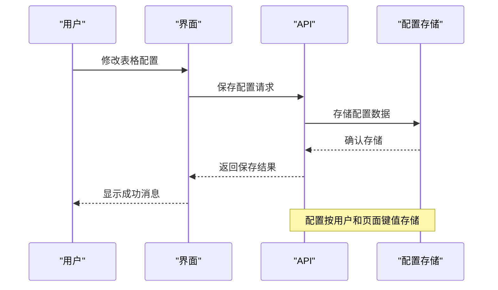
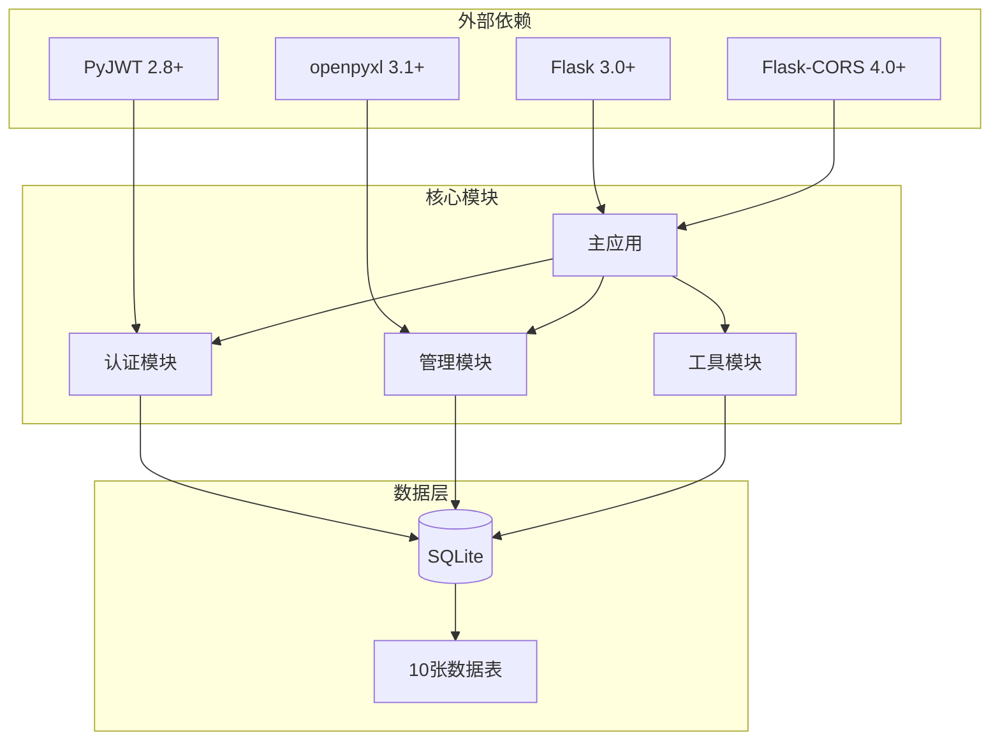

# 系统管理模块

<cite>
**本文档引用的文件**
- [app.py](file://app.py)
- [admin-management.js](file://static/js/admin-management.js)
- [system-settings.js](file://static/js/system-settings.js)
- [admin-panel.html](file://templates/admin-panel.html)
- [login.html](file://templates/login.html)
- [requirements.txt](file://requirements.txt)
</cite>

## 目录
1. [简介](#简介)
2. [项目结构](#项目结构)
3. [核心组件](#核心组件)
4. [架构概览](#架构概览)
5. [详细组件分析](#详细组件分析)
6. [依赖关系分析](#依赖关系分析)
7. [性能考虑](#性能考虑)
8. [故障排除指南](#故障排除指南)
9. [结论](#结论)
10. [附录](#附录)

## 简介

系统管理模块是封样件及色板接收登记管理系统的核心管理功能模块，主要负责用户权限管理、系统配置管理、邀请码管理等功能。该模块采用Flask框架构建，使用SQLite作为数据存储，实现了完整的管理员权限控制和系统配置功能。

## 项目结构

系统管理模块采用前后端分离的架构设计，主要包含以下组成部分：

**图表来源**
- [admin-panel.html:1-107](file://templates/admin-panel.html#L1-L107)
- [app.py:1-50](file://app.py#L1-L50)

**章节来源**
- [admin-panel.html:1-107](file://templates/admin-panel.html#L1-L107)
- [requirements.txt:1-5](file://requirements.txt#L1-L5)

## 核心组件

系统管理模块包含四个核心功能组件：

### 1. 用户权限管理
- 用户创建和删除功能
- 角色分配和权限控制
- 账户状态管理（启用/禁用）
- 在线状态检测

### 2. 邀请码管理
- 邀请码生成和配置
- 使用次数限制
- 过期时间管理
- 启用/停用控制

### 3. 系统配置管理
- ΔE阈值配置（色差评估）
- 系统参数设置
- 实时效果预览
- 配置验证和保存

### 4. 表格配置管理
- 用户个性化表格设置
- 筛选条件持久化
- 列显示配置
- 页面特定配置

**章节来源**
- [app.py:88-335](file://app.py#L88-L335)
- [admin-management.js:1-153](file://static/js/admin-management.js#L1-L153)
- [system-settings.js:1-65](file://static/js/system-settings.js#L1-L65)

## 架构概览

系统采用三层架构设计，确保了良好的可维护性和扩展性：

**图表来源**
- [app.py:49-84](file://app.py#L49-L84)
- [app.py:1454-1495](file://app.py#L1454-L1495)

系统架构特点：
- **认证授权**：基于JWT的令牌认证，支持管理员专用功能
- **数据持久化**：SQLite数据库，支持完整的CRUD操作
- **前端交互**：现代化的Web界面，支持实时预览和配置
- **安全控制**：严格的权限检查和数据验证

## 详细组件分析

### 用户权限管理组件

用户权限管理是系统管理模块的核心功能，提供了完整的用户生命周期管理能力。

#### 用户管理功能流程

**图表来源**
- [admin-management.js:7-64](file://static/js/admin-management.js#L7-L64)
- [app.py:1454-1495](file://app.py#L1454-L1495)

#### 权限控制机制

系统实现了多层次的权限控制：

1. **基础认证**：所有管理操作都需要有效的JWT令牌
2. **管理员权限**：特定操作需要管理员身份
3. **账户保护**：禁止操作自己的账户
4. **状态检查**：禁用账户无法进行任何操作

**章节来源**
- [app.py:78-84](file://app.py#L78-L84)
- [app.py:1454-1495](file://app.py#L1454-L1495)

### 邀请码管理组件

邀请码管理功能提供了灵活的用户注册控制机制。

#### 邀请码生命周期

**图表来源**
- [admin-management.js:67-108](file://static/js/admin-management.js#L67-L108)
- [app.py:1507-1548](file://app.py#L1507-L1548)

#### 邀请码特性

- **唯一性**：每个邀请码都是唯一的16位字符串
- **可配置性**：支持设置最大使用次数和过期时间
- **状态管理**：支持启用/停用状态控制
- **使用跟踪**：自动记录使用次数和使用状态

**章节来源**
- [app.py:372-376](file://app.py#L372-L376)
- [app.py:1507-1548](file://app.py#L1507-L1548)

### 系统配置管理组件

系统配置管理功能专注于ΔE阈值配置，这是色板评定的核心参数。

#### ΔE阈值配置流程

**图表来源**
- [system-settings.js:6-61](file://static/js/system-settings.js#L6-L61)
- [app.py:1552-1577](file://app.py#L1552-L1577)

#### 配置验证规则

系统实现了严格的配置验证机制：

1. **数值范围验证**：确保阈值在合理范围内
2. **逻辑关系验证**：优秀阈值 < 合格阈值 < 关注阈值
3. **格式验证**：确保输入为有效数字
4. **实时预览**：提供即时的效果反馈

**章节来源**
- [system-settings.js:52-59](file://static/js/system-settings.js#L52-L59)
- [app.py:1563-1577](file://app.py#L1563-L1577)

### 表格配置管理组件

表格配置管理提供了用户个性化的界面体验。

#### 配置持久化流程

**图表来源**
- [app.py:1582-1625](file://app.py#L1582-L1625)

**章节来源**
- [app.py:1582-1625](file://app.py#L1582-L1625)

## 依赖关系分析

系统管理模块的依赖关系体现了清晰的分层架构：

**图表来源**
- [requirements.txt:1-5](file://requirements.txt#L1-L5)
- [app.py:1-25](file://app.py#L1-L25)

**章节来源**
- [requirements.txt:1-5](file://requirements.txt#L1-L5)

## 性能考虑

系统管理模块在设计时充分考虑了性能优化：

### 数据库优化
- **索引策略**：关键查询字段建立适当索引
- **连接池管理**：合理管理数据库连接生命周期
- **批量操作**：支持批量数据导入导出

### 缓存策略
- **配置缓存**：系统设置采用内存缓存
- **用户状态缓存**：在线状态定期更新
- **静态资源缓存**：前端资源版本化缓存

### 性能监控
- **响应时间监控**：关键API响应时间统计
- **并发控制**：合理的并发访问限制
- **资源使用监控**：内存和CPU使用情况监控

## 故障排除指南

### 常见问题及解决方案

#### 认证相关问题
- **Token过期**：重新登录获取新的JWT令牌
- **权限不足**：确认用户是否具有管理员权限
- **账户禁用**：联系管理员恢复账户状态

#### 数据操作问题
- **数据导入失败**：检查Excel文件格式和数据完整性
- **配置保存失败**：验证输入数据的有效性
- **邀请码冲突**：检查邀请码唯一性约束

#### 系统稳定性问题
- **数据库连接异常**：检查数据库文件权限和磁盘空间
- **API响应超时**：优化查询语句和索引配置
- **前端界面异常**：清理浏览器缓存和Cookie

**章节来源**
- [app.py:572-588](file://app.py#L572-L588)
- [app.py:1563-1577](file://app.py#L1563-L1577)

## 结论

系统管理模块是一个功能完整、架构清晰的管理平台，具备以下优势：

1. **功能全面**：涵盖了用户管理、权限控制、系统配置等核心管理功能
2. **安全可靠**：实现了多层次的安全控制和权限验证
3. **用户体验良好**：提供了直观的Web界面和实时反馈
4. **易于扩展**：模块化设计便于功能扩展和定制

该模块为整个封样件及色板接收登记管理系统提供了坚实的管理基础，能够满足企业级应用的管理需求。

## 附录

### API接口规范

系统管理模块提供以下主要API接口：

- **用户管理**：`/api/admin/users` - 用户列表、状态管理、删除操作
- **邀请码管理**：`/api/admin/invitations` - 邀请码创建、启用/停用、删除
- **系统设置**：`/api/admin/settings` - 获取和更新系统配置
- **表格配置**：`/api/table-configs/<page_key>` - 用户个性化配置

### 安全最佳实践

- **密码策略**：最小6位字符，建议使用复杂密码组合
- **令牌管理**：24小时有效期，自动续期机制
- **权限控制**：最小权限原则，严格的角色分离
- **审计日志**：关键操作的完整记录和追踪