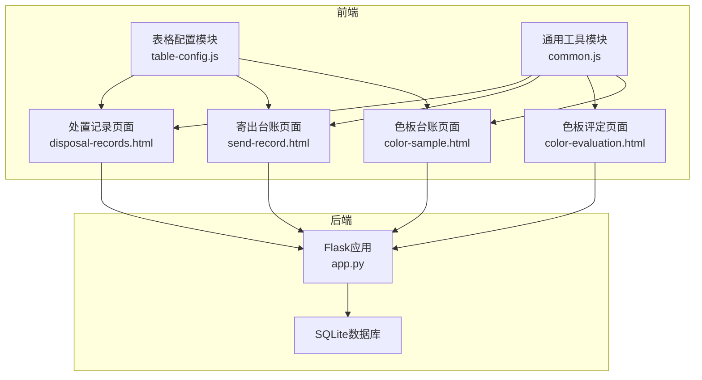
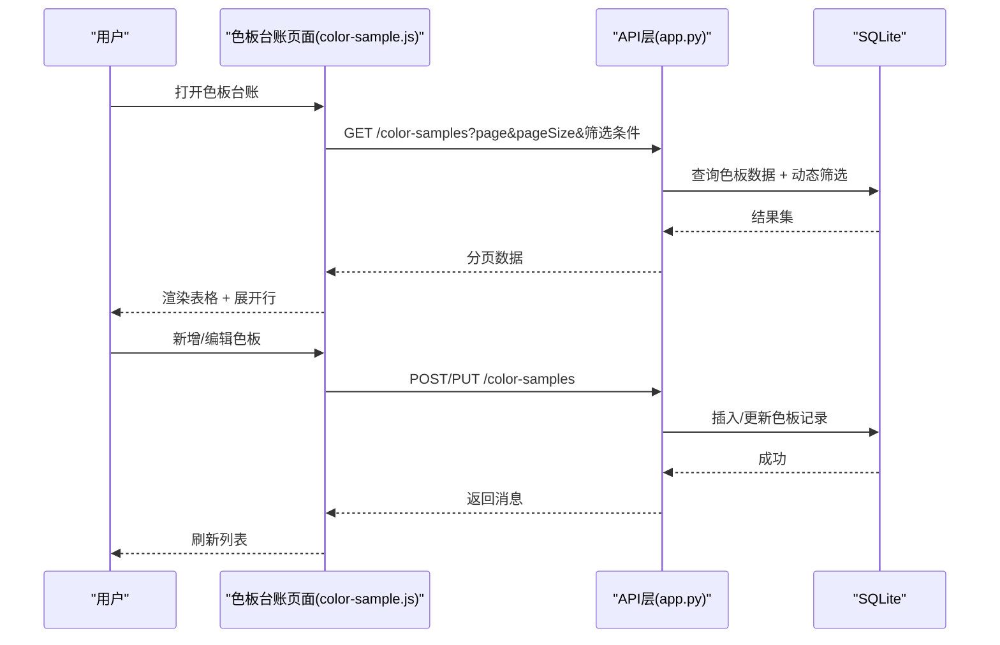
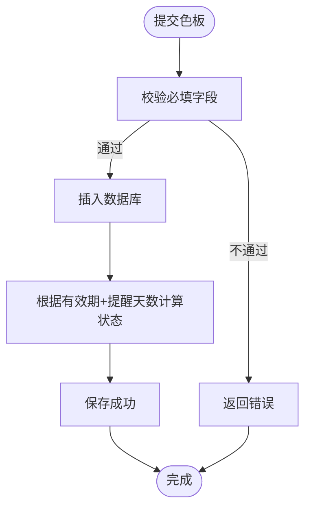
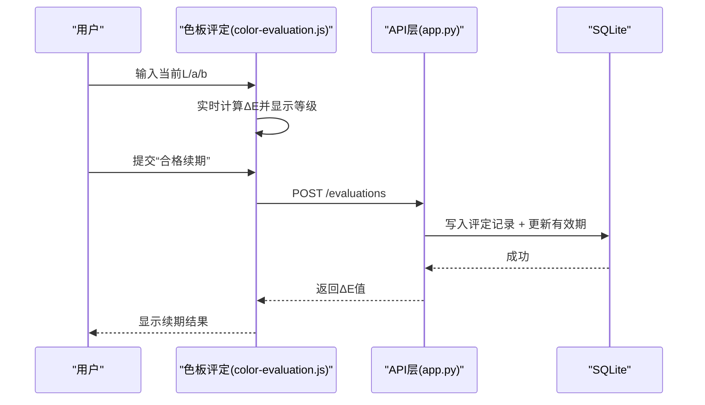
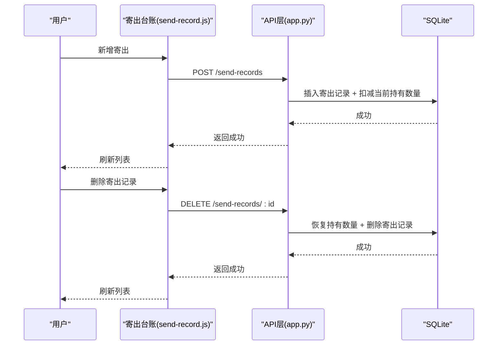
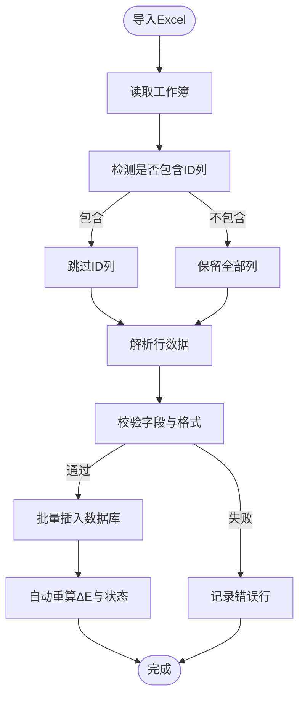
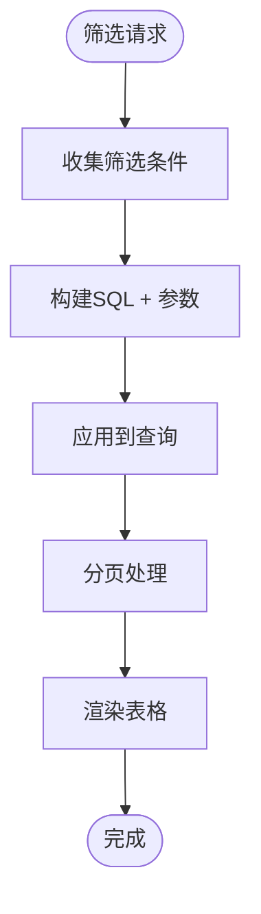
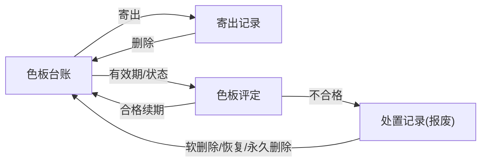
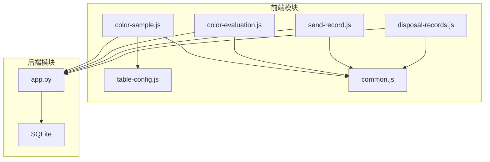

# 色板管理模块

<cite>
**本文档引用的文件**
- [app.py](file://app.py)
- [templates/color-sample.html](file://templates/color-sample.html)
- [static/js/color-sample.js](file://static/js/color-sample.js)
- [templates/color-evaluation.html](file://templates/color-evaluation.html)
- [static/js/color-evaluation.js](file://static/js/color-evaluation.js)
- [templates/send-record.html](file://templates/send-record.html)
- [static/js/send-record.js](file://static/js/send-record.js)
- [templates/disposal-records.html](file://templates/disposal-records.html)
- [static/js/disposal-records.js](file://static/js/disposal-records.js)
- [static/js/table-config.js](file://static/js/table-config.js)
- [static/js/common.js](file://static/js/common.js)
</cite>

## 目录
1. [简介](#简介)
2. [项目结构](#项目结构)
3. [核心组件](#核心组件)
4. [架构总览](#架构总览)
5. [详细组件分析](#详细组件分析)
6. [依赖关系分析](#依赖关系分析)
7. [性能考虑](#性能考虑)
8. [故障排查指南](#故障排查指南)
9. [结论](#结论)
10. [附录](#附录)

## 简介
本模块围绕色板（颜色样板）的全生命周期管理，提供接收登记、数量控制、有效期管理、色差评估（ΔE计算）、库存联动、Excel导入导出、搜索筛选、与寄出管理/评定管理的数据交互以及处置记录追踪等功能。系统采用Flask后端+SQLite数据库+前端JavaScript模块化架构，支持动态筛选、列配置、实时库存更新与历史记录追溯。

## 项目结构
- 后端：Flask应用，提供REST API，负责数据模型、业务逻辑、Excel导入导出、有效期与处置记录管理。
- 前端：HTML模板 + JavaScript模块（色板台账、色板评定、寄出记录、处置记录、表格配置、通用工具）。
- 数据库：SQLite，包含色板台账、寄出记录、评定记录、报废记录、系统设置、用户表格配置等表。

图表来源
- [app.py:1-2197](file://app.py#L1-L2197)
- [templates/color-sample.html:1-42](file://templates/color-sample.html#L1-L42)
- [templates/color-evaluation.html:1-28](file://templates/color-evaluation.html#L1-L28)
- [templates/send-record.html:1-31](file://templates/send-record.html#L1-L31)
- [templates/disposal-records.html:1-38](file://templates/disposal-records.html#L1-L38)
- [static/js/table-config.js:1-552](file://static/js/table-config.js#L1-L552)
- [static/js/common.js:1-135](file://static/js/common.js#L1-L135)

章节来源
- [app.py:1-2197](file://app.py#L1-L2197)

## 核心组件
- 色板台账（接收登记、数量控制、有效期管理）
- 色差评估（ΔE实时计算、阈值配置、状态联动）
- 寄出管理（库存联动、数量校验）
- Excel导入导出（模板字段、批量处理）
- 搜索筛选（动态过滤、列配置）
- 处置记录（评定/报废统一视图、软删除/恢复/永久删除）

章节来源
- [app.py:797-1041](file://app.py#L797-L1041)
- [app.py:1043-1156](file://app.py#L1043-L1156)
- [app.py:1210-1327](file://app.py#L1210-L1327)
- [app.py:1628-2080](file://app.py#L1628-L2080)

## 架构总览
系统采用前后端分离的SPA模式：
- 前端通过AJAX调用后端API，实现数据的增删改查、Excel导入导出、动态筛选与列配置。
- 后端基于Flask路由提供REST接口，使用SQLite存储数据，内置CORS支持与JWT鉴权。
- 通用工具模块提供日期格式化、ΔE计算、分页、状态标签等通用能力。

图表来源
- [static/js/color-sample.js:8-31](file://static/js/color-sample.js#L8-L31)
- [app.py:800-841](file://app.py#L800-L841)
- [app.py:843-901](file://app.py#L843-L901)

## 详细组件分析

### 色板接收登记与数量控制
- 接收登记：支持必填字段校验（客户、适用车型、颜色名称、接收数量、有效期），自动生成序号与状态（正常/待评定/已过期/已报废）。
- 数量控制：接收数量与当前持有数量默认一致；编辑时不允许减少接收数量；删除前检查是否存在寄出记录。
- 有效期与提醒：支持设置有效期与提醒天数，自动计算状态；导出/导入时状态字段自动转换。

图表来源
- [app.py:843-868](file://app.py#L843-L868)
- [app.py:882-901](file://app.py#L882-L901)
- [app.py:903-915](file://app.py#L903-L915)

章节来源
- [app.py:797-915](file://app.py#L797-L915)
- [static/js/color-sample.js:108-185](file://static/js/color-sample.js#L108-L185)

### 色差评估流程与ΔE值计算
- ΔE计算：前端实时计算ΔE值，后端在合格评定时自动计算并写入评定记录。
- 阈值配置：管理员可设置ΔE阈值（优秀/合格/关注），前端按阈值高亮显示。
- 评定流程：选择“合格续期”时输入当前L/a/b，系统计算ΔE并提示新有效期；选择“不合格”进入报废流程。

图表来源
- [static/js/color-evaluation.js:205-235](file://static/js/color-evaluation.js#L205-L235)
- [app.py:1226-1286](file://app.py#L1226-L1286)

章节来源
- [static/js/color-evaluation.js:1-289](file://static/js/color-evaluation.js#L1-L289)
- [app.py:1210-1286](file://app.py#L1210-L1286)

### 库存控制与实时库存更新
- 寄出流程：选择色板后自动显示当前持有数量，输入寄出数量并校验不超过持有量；提交后系统自动扣减当前持有数量。
- 删除寄出记录：恢复库存（持有数量加回）。
- 色板台账：当前持有数量列高亮低库存（≤5）。

图表来源
- [static/js/send-record.js:118-130](file://static/js/send-record.js#L118-L130)
- [app.py:1110-1155](file://app.py#L1110-L1155)

章节来源
- [static/js/send-record.js:1-156](file://static/js/send-record.js#L1-L156)
- [app.py:1043-1156](file://app.py#L1043-L1156)

### Excel导入导出功能
- 导出：支持导出色板台账、寄出记录、处置记录为Excel，包含中文状态映射与字段顺序。
- 导入：支持从导出模板重新导入，自动识别ID列（若存在则跳过），状态字段中文转内部编码，自动重算ΔE值与状态。

图表来源
- [app.py:953-1040](file://app.py#L953-L1040)
- [app.py:1157-1170](file://app.py#L1157-L1170)
- [app.py:1808-1890](file://app.py#L1808-L1890)

章节来源
- [app.py:917-1040](file://app.py#L917-L1040)
- [app.py:1157-1170](file://app.py#L1157-L1170)
- [app.py:1808-1890](file://app.py#L1808-L1890)

### 颜色管理与搜索筛选
- 颜色管理：支持颜色分类（客户、适用车型、颜色名称、样板供应商）、规格管理（纹理代码、光泽度、供应商代码、制作信息）。
- 搜索筛选：支持多字段动态筛选（包含/等于/不包含/大于/小于等），并支持列配置（默认列、可选列）。
- 状态与有效期：状态根据有效期与提醒天数动态计算，支持“正常/待评定/已过期/已报废”。

图表来源
- [static/js/table-config.js:354-388](file://static/js/table-config.js#L354-L388)
- [app.py:403-449](file://app.py#L403-L449)
- [app.py:800-841](file://app.py#L800-L841)

章节来源
- [static/js/table-config.js:1-552](file://static/js/table-config.js#L1-L552)
- [app.py:800-841](file://app.py#L800-L841)

### 与寄出管理、评定管理的数据交互
- 与寄出管理：色板台账支持直接寄出，寄出后实时扣减当前持有数量；删除寄出记录时恢复库存。
- 与评定管理：色板有效期与状态联动，待评定/已过期/已报废状态在评定页面集中展示；合格续期更新有效期，不合格进入报废流程。
- 处置记录：统一视图展示评定记录与报废记录，支持软删除、恢复、永久删除，并回滚台账影响。

图表来源
- [static/js/color-sample.js:207-245](file://static/js/color-sample.js#L207-L245)
- [static/js/send-record.js:118-130](file://static/js/send-record.js#L118-L130)
- [app.py:1210-1327](file://app.py#L1210-L1327)
- [app.py:1628-2080](file://app.py#L1628-L2080)

章节来源
- [static/js/color-sample.js:1-267](file://static/js/color-sample.js#L1-L267)
- [static/js/send-record.js:1-156](file://static/js/send-record.js#L1-L156)
- [app.py:1210-1327](file://app.py#L1210-L1327)
- [app.py:1628-2080](file://app.py#L1628-L2080)

### 颜色数据可视化与历史记录追踪
- 可视化展示：ΔE值按阈值高亮显示（优秀/合格/需关注），当前持有数量低库存高亮，状态标签化展示。
- 历史记录：处置记录统一视图，支持查看详情、导出、软删除/恢复/永久删除，后台自动回滚台账影响。

章节来源
- [static/js/color-sample.js:33-99](file://static/js/color-sample.js#L33-L99)
- [static/js/disposal-records.js:1-344](file://static/js/disposal-records.js#L1-L344)
- [app.py:1628-2080](file://app.py#L1628-L2080)

## 依赖关系分析

图表来源
- [static/js/color-sample.js:1-267](file://static/js/color-sample.js#L1-L267)
- [static/js/color-evaluation.js:1-289](file://static/js/color-evaluation.js#L1-L289)
- [static/js/send-record.js:1-156](file://static/js/send-record.js#L1-L156)
- [static/js/disposal-records.js:1-344](file://static/js/disposal-records.js#L1-L344)
- [static/js/table-config.js:1-552](file://static/js/table-config.js#L1-L552)
- [static/js/common.js:1-135](file://static/js/common.js#L1-L135)
- [app.py:1-2197](file://app.py#L1-L2197)

章节来源
- [static/js/table-config.js:1-552](file://static/js/table-config.js#L1-L552)
- [static/js/common.js:1-135](file://static/js/common.js#L1-L135)
- [app.py:1-2197](file://app.py#L1-L2197)

## 性能考虑
- 分页与筛选：后端统一使用分页与动态筛选，避免一次性加载全量数据；前端使用本地缓存与异步加载提升响应速度。
- ΔE计算：前端实时计算，后端仅在合格评定时计算并持久化，降低重复计算成本。
- 导入导出：使用openpyxl批量处理，导入时批量插入并延迟重算，减少数据库往返。
- 状态计算：有效期状态在查询时动态计算，避免冗余字段存储。

## 故障排查指南
- 登录与鉴权：检查Token是否过期或无效，确认用户状态是否被停用。
- 数据导入失败：检查Excel模板字段是否匹配，状态字段是否为中文；查看错误行提示。
- 寄出数量超限：确认当前持有数量是否正确，删除寄出记录后库存是否恢复。
- 评定失败：确认ΔE阈值设置是否合理，有效期是否正确更新。
- 处置记录删除：管理员权限不足或记录已被删除，需先恢复再删除或永久删除。

章节来源
- [app.py:49-76](file://app.py#L49-L76)
- [app.py:953-1040](file://app.py#L953-L1040)
- [app.py:1110-1155](file://app.py#L1110-L1155)
- [app.py:1226-1286](file://app.py#L1226-L1286)
- [app.py:1943-2037](file://app.py#L1943-L2037)

## 结论
色板管理模块通过完善的接收登记、数量控制、有效期管理、ΔE评估与库存联动，实现了从入库到寄出再到处置的全生命周期管理。结合动态筛选、列配置与Excel导入导出，满足企业对颜色样品的规范化管理需求。系统具备良好的扩展性与维护性，适合在实际生产环境中部署与使用。

## 附录

### Excel数据模板字段说明
- 色板台账导出/导入字段：序号、客户、适用车型、颜色名称、样板供应商、颜色色值转化码、纹理代码、光泽度、供应商代码、制作信息、接收数量、当前持有数量、接收日期、使用的光源角度、L值、a值、b值、c值、h值、ΔL值、Δa值、Δb值、Δc值、Δh值、ΔE值、有效期、提醒天数、状态、备注。
- 寄出台账导出字段：ID、色板ID、客户、颜色名称、对方单位、寄出数量、寄出日期、经手人、备注、创建时间。
- 处置记录导出字段：记录类型、对象类型、编号、名称、评定结果/报废原因、报废类型、评定人/审批人、评定日期/报废日期、ΔE值、新有效期截止日、评定说明/备注、创建时间。

章节来源
- [app.py:917-951](file://app.py#L917-L951)
- [app.py:1157-1170](file://app.py#L1157-L1170)
- [app.py:1808-1890](file://app.py#L1808-L1890)