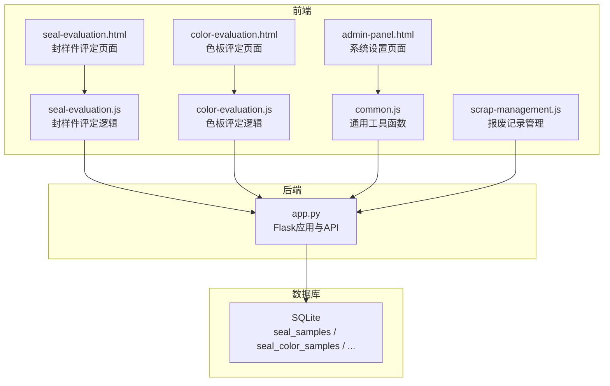
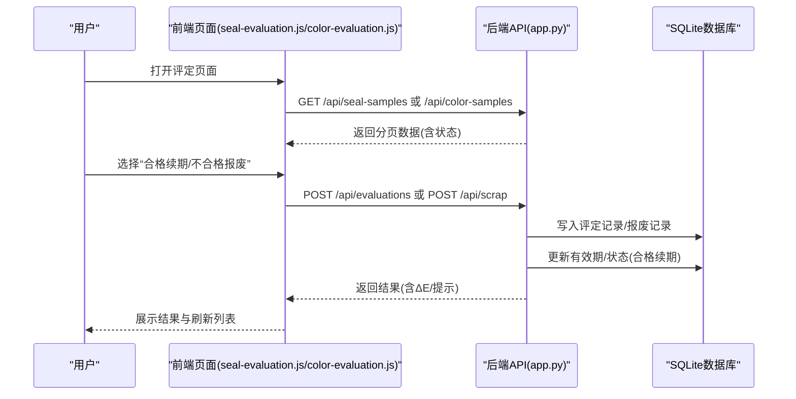
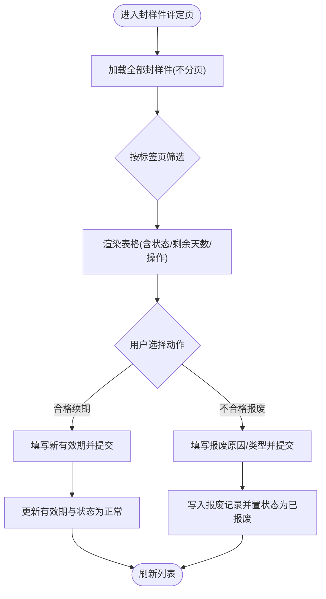
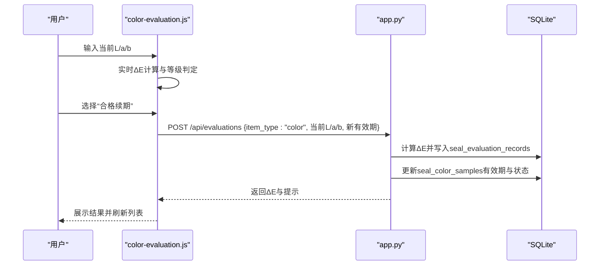
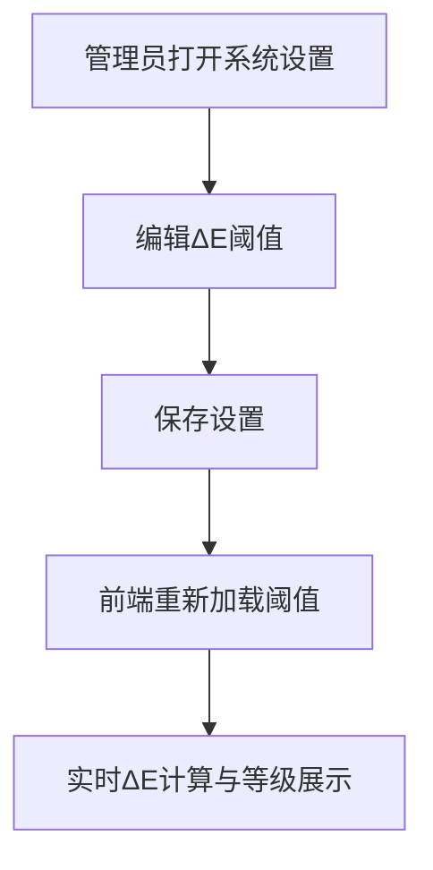
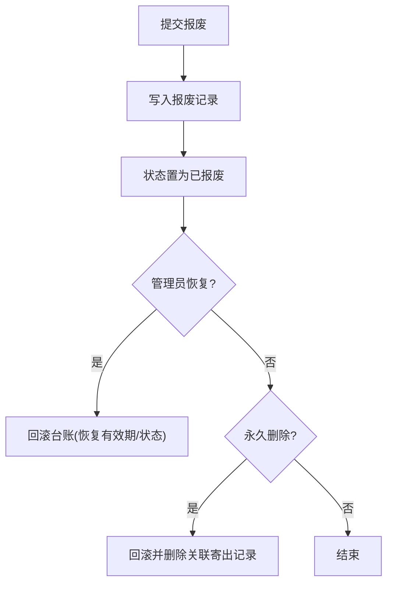
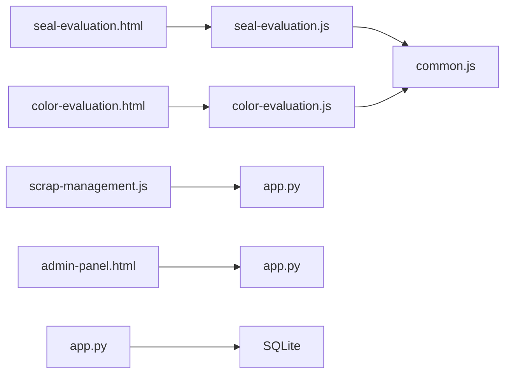

# 评定管理模块

<cite>
**本文引用的文件**
- [app.py](file://app.py)
- [seal-evaluation.js](file://static/js/seal-evaluation.js)
- [color-evaluation.js](file://static/js/color-evaluation.js)
- [common.js](file://static/js/common.js)
- [seal-evaluation.html](file://templates/seal-evaluation.html)
- [color-evaluation.html](file://templates/color-evaluation.html)
- [admin-panel.html](file://templates/admin-panel.html)
- [scrap-management.js](file://static/js/scrap-management.js)
</cite>

## 目录
1. [简介](#简介)
2. [项目结构](#项目结构)
3. [核心组件](#核心组件)
4. [架构总览](#架构总览)
5. [详细组件分析](#详细组件分析)
6. [依赖关系分析](#依赖关系分析)
7. [性能考虑](#性能考虑)
8. [故障排查指南](#故障排查指南)
9. [结论](#结论)
10. [附录](#附录)

## 简介
本模块负责“封样件”和“色板”的有效期管理与内部评定流程，涵盖定期评估、有效期延长、报废处理、色差评估与等级判定、系统阈值配置、评定记录的创建与归档、报表与导出、与库存管理联动、历史查询与统计分析、异常处理与复评机制，以及前端ΔE色差计算与展示逻辑。系统采用Flask后端+SQLite数据库+前端JavaScript的轻量架构，支持管理员配置ΔE阈值、用户进行封样件与色板的评定操作，并通过报表接口实现统计分析。

## 项目结构
- 后端：Python Flask应用，集中于单文件app.py，包含认证、数据模型、API路由、报表统计等。
- 前端：静态资源位于static/js与templates目录，分别提供业务交互逻辑与页面模板。
- 数据库：SQLite，初始化时创建10张核心表，包含封样件、色板、寄出、有效期、评定记录、报废记录、系统设置、用户配置等。

图表来源
- [app.py](file://app.py)
- [seal-evaluation.html](file://templates/seal-evaluation.html)
- [color-evaluation.html](file://templates/color-evaluation.html)
- [admin-panel.html](file://templates/admin-panel.html)
- [seal-evaluation.js](file://static/js/seal-evaluation.js)
- [color-evaluation.js](file://static/js/color-evaluation.js)
- [common.js](file://static/js/common.js)
- [scrap-management.js](file://static/js/scrap-management.js)

章节来源
- [app.py](file://app.py)
- [seal-evaluation.html](file://templates/seal-evaluation.html)
- [color-evaluation.html](file://templates/color-evaluation.html)
- [admin-panel.html](file://templates/admin-panel.html)
- [seal-evaluation.js](file://static/js/seal-evaluation.js)
- [color-evaluation.js](file://static/js/color-evaluation.js)
- [common.js](file://static/js/common.js)
- [scrap-management.js](file://static/js/scrap-management.js)

## 核心组件
- 有效期状态计算：基于有效期截止日期与提醒天数，动态判断“正常/待评定/已过期/已报废”，并在列表与详情中统一呈现。
- 评定流程：封样件与色板两类对象，支持“合格续期”和“不合格报废”。色板评定时自动计算ΔE并按阈值分级。
- ΔE阈值配置：管理员可在系统设置中调整优秀/合格/需关注阈值，前端即时生效。
- 报废管理：支持报废记录的查看、删除恢复、永久删除，以及与寄出记录的联动清理。
- 报表与导出：支持封样件与色板台账的Excel导出；仪表盘提供统计与预警。
- 库存联动：色板寄出时自动扣减库存，报废或删除恢复时自动回滚库存。

章节来源
- [app.py](file://app.py)
- [color-evaluation.js](file://static/js/color-evaluation.js)
- [common.js](file://static/js/common.js)
- [scrap-management.js](file://static/js/scrap-management.js)

## 架构总览
后端以Flask路由为核心，围绕“封样件/色板”两大实体提供CRUD与业务逻辑；前端通过AJAX调用后端API，实现动态渲染与交互。ΔE计算在前后端均有体现，前端提供实时预览，后端在色板合格评定时进行精确计算并落库。

图表来源
- [app.py](file://app.py)
- [seal-evaluation.js](file://static/js/seal-evaluation.js)
- [color-evaluation.js](file://static/js/color-evaluation.js)

## 详细组件分析

### 1. 封样件有效期与内部评定
- 页面与交互：封样件评定页面提供“全部/待评定/已过期/已报废”四类标签页，前端按状态筛选并展示操作按钮。
- 评定流程：
  - 合格续期：填写新有效期截止日，提交后更新封样件有效期与状态为“正常”。
  - 不合格报废：填写报废原因与类型，二次确认后写入报废记录并将状态置为“已报废”。

图表来源
- [seal-evaluation.js](file://static/js/seal-evaluation.js)
- [app.py](file://app.py)

章节来源
- [seal-evaluation.html](file://templates/seal-evaluation.html)
- [seal-evaluation.js](file://static/js/seal-evaluation.js)
- [app.py](file://app.py)

### 2. 色板有效期与评定（含ΔE）
- 页面与交互：色板评定页面同样提供四类标签页，展示有效期、剩余天数、最新ΔE值与操作按钮。
- ΔE计算与阈值：
  - 前端：实时计算ΔE并按阈值分级展示（优秀/合格/需关注），阈值可由管理员配置。
  - 后端：在色板“合格续期”时精确计算ΔE并写入评定记录。
- 评定流程：
  - 合格续期：输入当前L/a/b值，系统自动计算ΔE，填写新有效期后更新有效期与状态。
  - 不合格报废：填写报废原因与类型，二次确认后报废并锁定。

图表来源
- [color-evaluation.js](file://static/js/color-evaluation.js)
- [common.js](file://static/js/common.js)
- [app.py](file://app.py)

章节来源
- [color-evaluation.html](file://templates/color-evaluation.html)
- [color-evaluation.js](file://static/js/color-evaluation.js)
- [common.js](file://static/js/common.js)
- [app.py](file://app.py)

### 3. ΔE阈值配置与前端展示
- 配置入口：管理员在系统设置页面调整“优秀/合格/需关注”阈值，保存后立即生效。
- 前端展示：前端加载阈值后，实时计算ΔE并以颜色与标签展示等级；同时提供效果预览与参考说明。

图表来源
- [admin-panel.html](file://templates/admin-panel.html)
- [color-evaluation.js](file://static/js/color-evaluation.js)
- [common.js](file://static/js/common.js)
- [app.py](file://app.py)

章节来源
- [admin-panel.html](file://templates/admin-panel.html)
- [color-evaluation.js](file://static/js/color-evaluation.js)
- [common.js](file://static/js/common.js)
- [app.py](file://app.py)

### 4. 有效期管理与状态联动
- 状态计算：根据有效期截止日期与提醒天数，动态判断“正常/待评定/已过期/已报废”，并在列表与详情中统一呈现。
- 有效期规则：支持为不同对象类型配置有效期类型、时长、单位、截止日期与提醒天数。

章节来源
- [app.py](file://app.py)

### 5. 报废管理与复评机制
- 报废记录：写入seal_scrapped_samples，包含报废原因、类型、日期、审批人等。
- 删除恢复：管理员可将已删除的报废记录恢复，系统回滚台账（恢复有效期/状态）。
- 永久删除：管理员可永久删除报废记录及其关联的寄出记录，系统回滚台账并彻底删除。

图表来源
- [app.py](file://app.py)
- [scrap-management.js](file://static/js/scrap-management.js)

章节来源
- [app.py](file://app.py)
- [scrap-management.js](file://static/js/scrap-management.js)

### 6. 与库存管理的联动
- 寄出扣减：新增寄出记录时，若色板状态正常且库存充足，则扣减当前持有数量。
- 删除恢复：删除寄出记录时，系统自动恢复库存。
- 报废联动：永久删除报废记录时，系统同时删除关联的寄出记录并回滚库存。

章节来源
- [app.py](file://app.py)

### 7. 评定记录与报表导出
- 评定记录：写入seal_evaluation_records，包含评定结果、评定人、日期、当前L/a/b、计算ΔE值、新有效期截止日等。
- 报表导出：支持封样件与色板台账的Excel导出，状态统一转换为中文。
- 仪表盘统计：提供总数、待评定数、已报废数等统计；提供即将到期/已过期的预警列表。

章节来源
- [app.py](file://app.py)

### 8. 评定历史查询与统计分析
- 历史查询：支持按类型与ID查询评定记录，便于追溯。
- 统计分析：仪表盘提供概览与预警，结合前端分页与筛选能力，形成完整的查询与分析体系。

章节来源
- [app.py](file://app.py)

## 依赖关系分析

图表来源
- [seal-evaluation.js](file://static/js/seal-evaluation.js)
- [color-evaluation.js](file://static/js/color-evaluation.js)
- [common.js](file://static/js/common.js)
- [scrap-management.js](file://static/js/scrap-management.js)
- [admin-panel.html](file://templates/admin-panel.html)
- [seal-evaluation.html](file://templates/seal-evaluation.html)
- [color-evaluation.html](file://templates/color-evaluation.html)
- [app.py](file://app.py)

章节来源
- [app.py](file://app.py)
- [seal-evaluation.js](file://static/js/seal-evaluation.js)
- [color-evaluation.js](file://static/js/color-evaluation.js)
- [common.js](file://static/js/common.js)
- [scrap-management.js](file://static/js/scrap-management.js)
- [admin-panel.html](file://templates/admin-panel.html)
- [seal-evaluation.html](file://templates/seal-evaluation.html)
- [color-evaluation.html](file://templates/color-evaluation.html)

## 性能考虑
- 分页策略：列表接口支持分页，但评定页面为“全量加载”以便准确筛选与展示，建议在数据量较大时优化前端缓存与虚拟滚动。
- ΔE计算：前端实时计算提升交互体验，后端在合格续期时进行精确计算并落库，避免重复计算。
- 导出性能：Excel导出使用openpyxl，建议控制单次导出的数据量，或提供分批导出选项。
- 状态计算：有效期状态在列表与详情处均进行动态计算，避免冗余存储，减少维护成本。

## 故障排查指南
- 评定失败：检查参数完整性（类型、ID、结果）、对象状态（是否已报废）、色板当前L/a/b值是否有效。
- 报废异常：确认报废原因与类型填写完整，二次确认弹窗是否被拦截。
- ΔE显示异常：检查管理员阈值配置是否合理，前端是否正确加载阈值。
- 库存不一致：检查寄出记录是否存在、删除是否正确回滚库存。
- 导出失败：确认文件格式与大小限制，检查服务器磁盘空间与权限。

章节来源
- [app.py](file://app.py)
- [color-evaluation.js](file://static/js/color-evaluation.js)
- [scrap-management.js](file://static/js/scrap-management.js)

## 结论
本模块通过清晰的业务流程与前后端协作，实现了封样件与色板的全生命周期管理，重点覆盖了有效期管理、内部评定、ΔE阈值配置、报废处理、报表导出与库存联动。系统具备良好的扩展性与可维护性，适合在实际生产环境中部署与使用。

## 附录

### A. ΔE色差计算与展示逻辑
- 计算公式：基于CIE76标准，ΔE = √[(L-L₀)² + (a-a₀)² + (b-b₀)²]。
- 前端展示：实时计算并按阈值分级显示颜色与标签，支持效果预览。
- 后端落库：在色板“合格续期”时精确计算并写入评定记录。

章节来源
- [app.py](file://app.py)
- [color-evaluation.js](file://static/js/color-evaluation.js)
- [common.js](file://static/js/common.js)

### B. 评定记录与归档
- 记录表：seal_evaluation_records，包含评定结果、评定人、日期、当前L/a/b、计算ΔE值、新有效期截止日等。
- 归档策略：支持删除恢复与永久删除，管理员可对回收站内的记录进行恢复或彻底删除。

章节来源
- [app.py](file://app.py)

### C. 与库存管理的联动机制
- 寄出扣减：新增寄出记录时，若色板状态正常且库存充足，则扣减当前持有数量。
- 删除恢复：删除寄出记录时，系统自动恢复库存。
- 永久删除：永久删除报废记录时，系统同时删除关联的寄出记录并回滚库存。

章节来源
- [app.py](file://app.py)