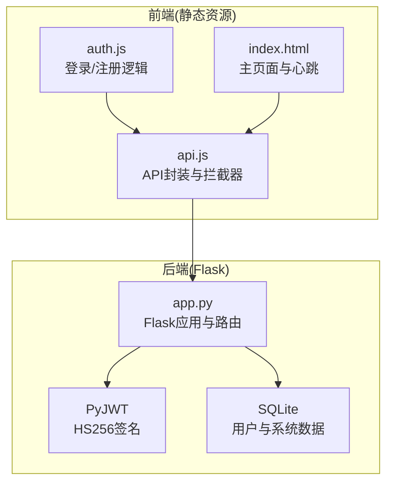
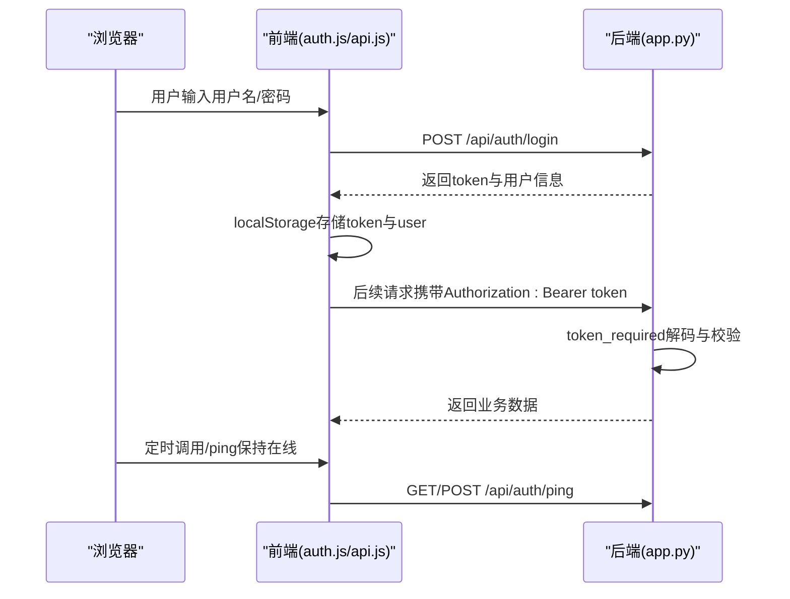
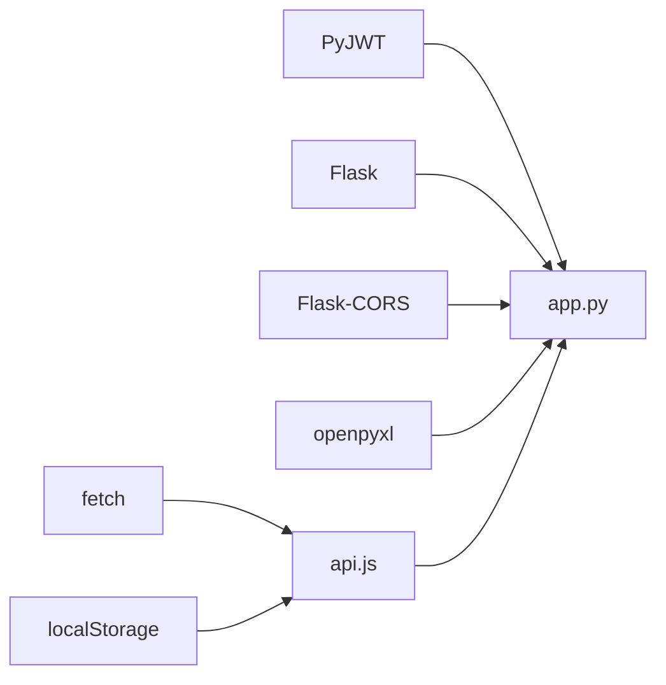

# JWT认证机制

<cite>
**本文档引用的文件**
- [app.py](file://app.py)
- [auth.js](file://static/js/auth.js)
- [api.js](file://static/js/api.js)
- [index.html](file://templates/index.html)
- [requirements.txt](file://requirements.txt)
</cite>

## 目录
1. [简介](#简介)
2. [项目结构](#项目结构)
3. [核心组件](#核心组件)
4. [架构总览](#架构总览)
5. [详细组件分析](#详细组件分析)
6. [依赖关系分析](#依赖关系分析)
7. [性能考虑](#性能考虑)
8. [故障排除指南](#故障排除指南)
9. [结论](#结论)

## 简介
本文件面向“封样件及色板接收登记管理系统”，系统采用Flask + PyJWT实现JWT认证机制。本文档详细阐述：
- JWT令牌生成流程与payload结构设计
- 令牌验证流程（HS256签名验证、过期时间检查、异常处理）
- 认证装饰器token_required的实现（支持Header与Query两种方式）
- 令牌生命周期管理（过期时间配置与在线状态跟踪）
- 客户端集成示例（登录后token存储与请求头设置）
- 心跳接口ping的实现与在线状态跟踪
- 常见认证错误的诊断与解决方案

## 项目结构
后端基于Flask框架，使用PyJWT进行令牌生成与验证；前端通过静态资源目录下的JavaScript模块完成登录、API请求拦截与心跳维护。

图表来源
- [app.py:1-25](file://app.py#L1-L25)
- [auth.js:1-120](file://static/js/auth.js#L1-L120)
- [api.js:1-88](file://static/js/api.js#L1-L88)
- [index.html:110-211](file://templates/index.html#L110-L211)

章节来源
- [app.py:1-25](file://app.py#L1-L25)
- [requirements.txt:1-5](file://requirements.txt#L1-L5)

## 核心组件
- 认证装饰器token_required：统一校验JWT，支持Header与Query两种传递方式，检查用户有效性与在线状态
- 登录接口/login：校验凭据后生成JWT payload并返回token
- 心跳接口/ping：更新用户last_active时间，维持在线状态
- 退出登录/logout：清除用户在线状态
- 前端API封装API：自动在请求头附加Authorization Bearer Token，并处理401跳转

章节来源
- [app.py:49-76](file://app.py#L49-L76)
- [app.py:454-494](file://app.py#L454-L494)
- [app.py:572-589](file://app.py#L572-L589)
- [api.js:7-42](file://static/js/api.js#L7-L42)

## 架构总览
系统采用前后端分离的静态资源模式，后端提供REST API，前端通过fetch进行HTTP请求并携带JWT。

图表来源
- [auth.js:56-67](file://static/js/auth.js#L56-L67)
- [api.js:9-12](file://static/js/api.js#L9-L12)
- [app.py:49-76](file://app.py#L49-L76)
- [app.py:572-579](file://app.py#L572-L579)

## 详细组件分析

### JWT令牌生成与payload结构
- 生成时机：登录成功后，服务端构造payload并使用HS256算法签名生成token
- payload字段：
  - user_id：整数，用户唯一标识
  - username：字符串，用户名
  - is_admin：整数，是否管理员（0/1）
  - must_change_password：整数，是否强制修改密码（0/1）
- 过期时间：系统配置了JWT_EXPIRATION_HOURS=24，但当前实现未在生成时显式设置exp，因此默认使用PyJWT默认行为（通常无exp）。建议在生成时显式设置exp以确保24小时过期。

章节来源
- [app.py:470-476](file://app.py#L470-L476)
- [app.py:24](file://app.py#L24)

### 令牌验证流程
- 解码算法：HS256
- 校验步骤：
  1. 从Header Authorization或Query token提取token
  2. jwt.decode解码并校验签名
  3. 从数据库查询user_id对应的用户
  4. 检查用户是否有效（is_active）
  5. 设置g.current_user并更新last_active
  6. 异常处理：ExpiredSignatureError返回401“Token已过期”；其他异常返回401“Token无效”
- 异常响应格式：success=false，message为错误信息，必要时附带code（如ACCOUNT_DISABLED）

章节来源
- [app.py:49-76](file://app.py#L49-L76)

### 认证装饰器token_required实现原理
- Header方式：Authorization: Bearer <token>
- Query方式：GET /api/xxx?token=<token>
- 校验逻辑：优先Header，其次Query；均为空则401
- 成功后：
  - 将用户信息存入g.current_user
  - 更新用户last_active为当前时间（UTC+8）
- 管理员权限：配合admin_required装饰器使用

章节来源
- [app.py:49-76](file://app.py#L49-L76)

### 令牌生命周期管理
- 过期时间配置：JWT_EXPIRATION_HOURS=24（小时）
- 实际行为：当前生成未显式设置exp，建议在生成时加入exp=iat+24*3600
- 在线状态跟踪：
  - 登录成功即更新last_active
  - 每次token_required都会更新last_active
  - 心跳接口/ping也会更新last_active
  - 前端定时每2分钟调用一次/ping
  - 后端判定在线：若last_active在5分钟内则标记为在线

章节来源
- [app.py:24](file://app.py#L24)
- [app.py:478](file://app.py#L478)
- [app.py:68-70](file://app.py#L68-L70)
- [app.py:576-578](file://app.py#L576-L578)
- [index.html:204-210](file://templates/index.html#L204-L210)

### 客户端集成示例
- 登录后存储：
  - localStorage.setItem('token', result.data.token)
  - localStorage.setItem('user', JSON.stringify(result.data.user))
- 请求头设置：
  - API封装自动在请求头添加Authorization: Bearer token
- 401自动处理：
  - 检测401时清除localStorage中的token与user，并跳转至登录页
  - 若检测到账户被停用（code=ACCOUNT_DISABLED），提示“账户已被管理员停用”

章节来源
- [auth.js:60-63](file://static/js/auth.js#L60-L63)
- [api.js:9-12](file://static/js/api.js#L9-L12)
- [api.js:21-33](file://static/js/api.js#L21-L33)

### 心跳接口ping实现与在线状态跟踪
- 接口：/api/auth/ping（GET/POST）
- 行为：更新当前用户的last_active为当前时间
- 前端定时任务：每2分钟调用一次，保持在线状态
- 后端在线判定：若last_active在5分钟内，则认为在线

章节来源
- [app.py:572-579](file://app.py#L572-L579)
- [index.html:204-210](file://templates/index.html#L204-L210)
- [app.py:1442-1451](file://app.py#L1442-L1451)

## 依赖关系分析
- 后端依赖：
  - PyJWT：HS256签名与解码
  - Flask：路由与请求上下文
  - Flask-CORS：跨域支持
  - openpyxl：Excel导入导出（与认证无关）
- 前端依赖：
  - fetch：HTTP请求
  - localStorage：token与用户信息持久化

图表来源
- [requirements.txt:1-5](file://requirements.txt#L1-L5)
- [api.js:1-88](file://static/js/api.js#L1-L88)

章节来源
- [requirements.txt:1-5](file://requirements.txt#L1-L5)

## 性能考虑
- token_required每次请求都会访问数据库更新last_active，建议：
  - 仅在必要时更新（例如间隔N秒）
  - 或者将在线状态改为服务端缓存（Redis等），减少数据库压力
- 前端心跳频率可调整，避免过于频繁导致不必要的请求
- 对高频接口可考虑缓存策略（与认证无关）

## 故障排除指南
- 未提供Token（401）
  - 现象：返回“未提供认证Token”
  - 处理：确保请求头Authorization或Query参数token存在
- Token无效（401）
  - 现象：返回“Token无效: …”
  - 处理：检查服务端SECRET_KEY是否一致，确认未篡改token
- Token已过期（401）
  - 现象：返回“Token已过期”
  - 处理：重新登录获取新token
- 账户被停用（401，code=ACCOUNT_DISABLED）
  - 现象：返回“账户已被停用，请联系管理员”
  - 处理：联系管理员恢复账户或使用其他账户登录
- 401自动跳转
  - 现象：前端检测到401自动清除token并跳转登录页
  - 处理：无需手动处理，系统自动清理并引导登录

章节来源
- [app.py:56-76](file://app.py#L56-L76)
- [api.js:21-33](file://static/js/api.js#L21-L33)

## 结论
本系统实现了基于PyJWT的认证机制，具备以下特点：
- 支持Header与Query两种token传递方式
- 通过装饰器统一校验，简化业务接口开发
- 通过心跳与last_active实现在线状态跟踪
- 前端提供完善的401处理与token存储

建议优化点：
- 在生成token时显式设置exp，确保24小时过期
- 调整心跳频率与last_active更新策略，降低数据库压力
- 在生产环境使用更安全的密钥管理方案