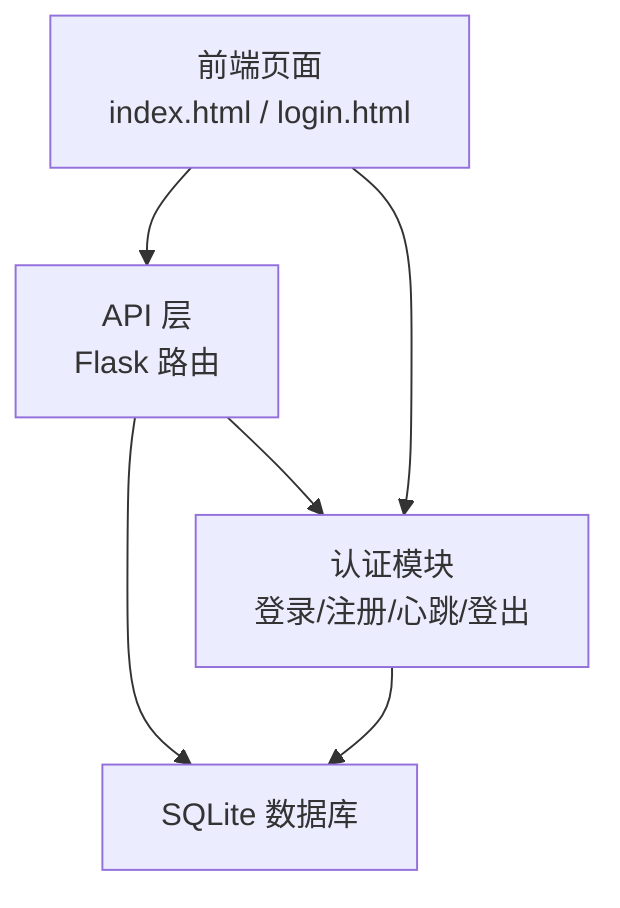
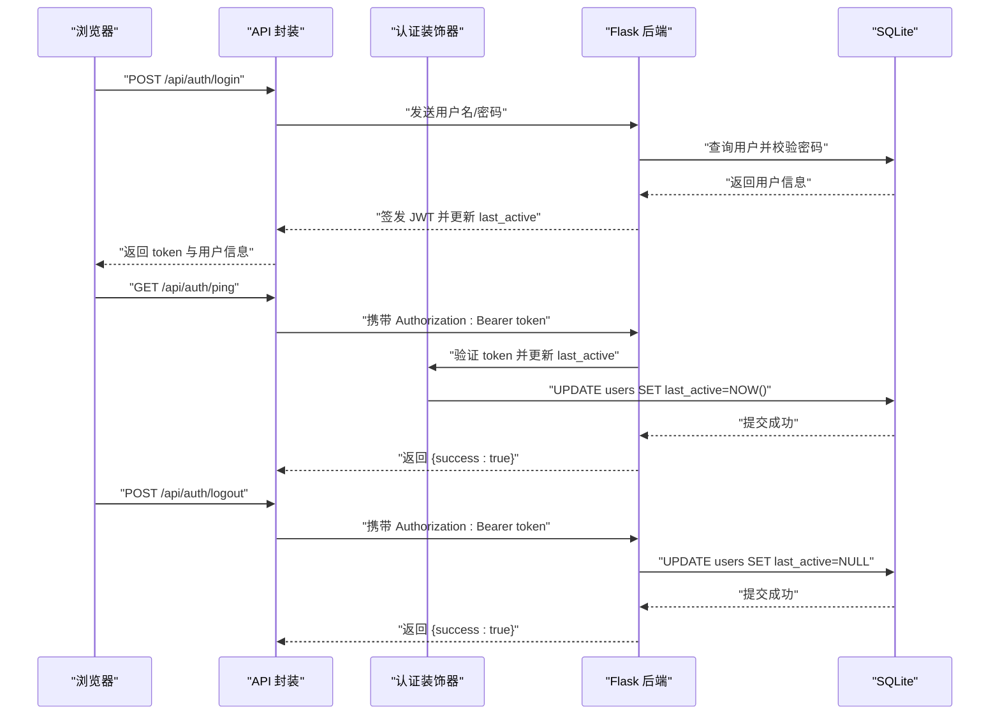
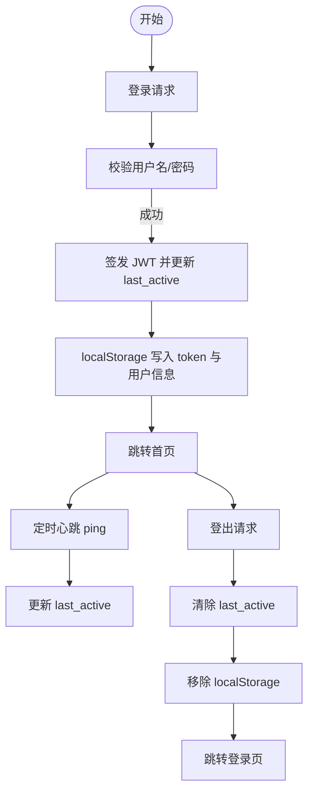
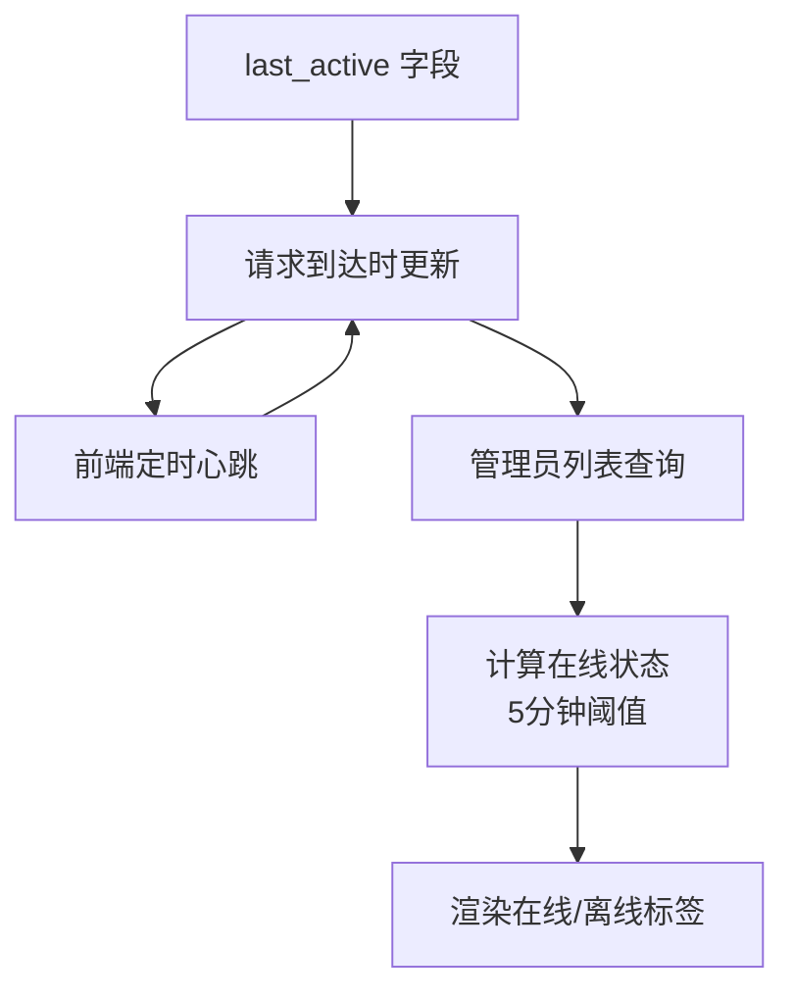
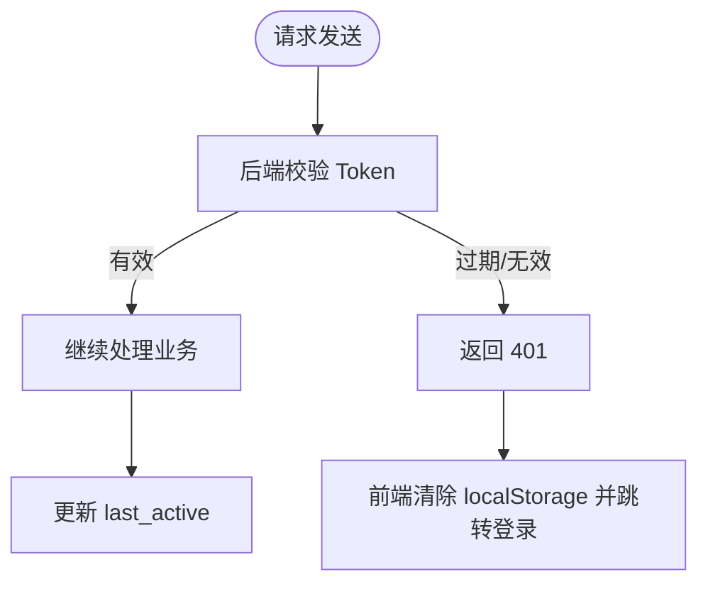
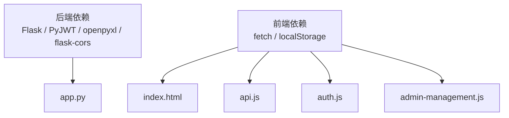

# 会话管理与在线状态

<cite>
**本文档引用的文件**
- [app.py](file://app.py)
- [auth.js](file://static/js/auth.js)
- [api.js](file://static/js/api.js)
- [index.html](file://templates/index.html)
- [login.html](file://templates/login.html)
- [admin-management.js](file://static/js/admin-management.js)
- [requirements.txt](file://requirements.txt)
</cite>

## 目录
1. [简介](#简介)
2. [项目结构](#项目结构)
3. [核心组件](#核心组件)
4. [架构总览](#架构总览)
5. [详细组件分析](#详细组件分析)
6. [依赖关系分析](#依赖关系分析)
7. [性能考量](#性能考量)
8. [故障排除指南](#故障排除指南)
9. [结论](#结论)
10. [附录](#附录)

## 简介
本文件面向“封样件及色板接收登记管理系统”，系统采用前后端分离架构：前端使用纯静态 HTML/CSS/JS，后端基于 Flask + SQLite + JWT 实现。本文聚焦会话管理与在线状态，涵盖以下主题：
- 会话生命周期：登录建立、登出清理
- 在线状态跟踪：last_active 字段与心跳 ping 的实现
- 会话超时与自动登出：基于 Token 过期与在线判定
- 跨页面会话保持与状态同步：localStorage + 心跳 + 后端在线判定
- 会话安全配置：Token 生成、存储与传输
- 性能优化与并发处理：请求拦截、去抖与批量更新
- 故障排除与监控建议：常见问题定位与运维建议

## 项目结构
系统采用典型的前后端分离模式：
- 后端：Flask 应用，提供 RESTful API；使用 SQLite 存储用户与业务数据；JWT 作为认证令牌
- 前端：HTML 模板 + JS 模块化脚本；通过 fetch 发起 API 请求；使用 localStorage 存储 Token 与用户信息

图表来源
- [app.py:454-589](file://app.py#L454-L589)
- [index.html:115-141](file://templates/index.html#L115-L141)
- [login.html:1-144](file://templates/login.html#L1-L144)

章节来源
- [app.py:1-80](file://app.py#L1-L80)
- [index.html:1-239](file://templates/index.html#L1-L239)
- [login.html:1-144](file://templates/login.html#L1-L144)

## 核心组件
- 认证装饰器与 Token 管理：token_required 装饰器负责校验 Token 并在每次请求时更新 last_active
- 心跳接口 ping：客户端定时调用以刷新 last_active，维持在线状态
- 登录/登出：登录成功写入 Token 与用户信息；登出清空在线状态
- 在线状态判定：后端根据 last_active 与当前时间差判断是否在线
- 前端会话保持：localStorage 存储 Token 与用户信息，页面切换与刷新均依赖其进行会话恢复

章节来源
- [app.py:49-76](file://app.py#L49-L76)
- [app.py:572-589](file://app.py#L572-L589)
- [api.js:1-88](file://static/js/api.js#L1-L88)
- [index.html:203-210](file://templates/index.html#L203-L210)
- [auth.js:56-67](file://static/js/auth.js#L56-L67)

## 架构总览
系统会话与在线状态的关键交互流程如下：

图表来源
- [app.py:454-493](file://app.py#L454-L493)
- [app.py:572-589](file://app.py#L572-L589)
- [api.js:7-42](file://static/js/api.js#L7-L42)

章节来源
- [app.py:454-589](file://app.py#L454-L589)
- [api.js:1-88](file://static/js/api.js#L1-L88)

## 详细组件分析

### 会话生命周期管理
- 登录时的会话建立
  - 前端提交用户名/密码至 /api/auth/login
  - 后端校验用户与密码，签发 JWT，并立即更新用户 last_active
  - 前端将 token 与用户信息存入 localStorage，随后跳转首页
- 登出时的会话清理
  - 前端调用 /api/auth/logout，后端将该用户的 last_active 设为 NULL
  - 前端移除 localStorage 中的 token 与用户信息，跳转登录页

图表来源
- [app.py:454-493](file://app.py#L454-L493)
- [app.py:581-589](file://app.py#L581-L589)
- [auth.js:56-67](file://static/js/auth.js#L56-L67)
- [index.html:187-194](file://templates/index.html#L187-L194)

章节来源
- [auth.js:42-68](file://static/js/auth.js#L42-L68)
- [index.html:187-194](file://templates/index.html#L187-L194)
- [app.py:454-589](file://app.py#L454-L589)

### 在线状态跟踪机制
- last_active 字段实现
  - 用户表 users 新增 last_active 字段，用于记录用户最后活跃时间
  - 后端在 token_required 装饰器中每次请求都会更新该字段
- 心跳接口 ping 的定时调用
  - 前端每 2 分钟向 /api/auth/ping 发送请求，携带 Authorization: Bearer token
  - 后端收到请求后更新 last_active，确保在线状态持续刷新
- 在线状态判定策略
  - 后端在查询用户列表时，将 UTC 时间转换为本地时间（UTC+8），若与当前时间差小于 5 分钟，则标记为在线
  - 管理后台页面展示用户在线状态标签，前端根据 is_online 字段渲染在线/离线样式

图表来源
- [app.py:67-70](file://app.py#L67-L70)
- [app.py:572-579](file://app.py#L572-L579)
- [app.py:1440-1451](file://app.py#L1440-L1451)
- [index.html:203-210](file://templates/index.html#L203-L210)
- [admin-management.js:22-25](file://static/js/admin-management.js#L22-L25)

章节来源
- [app.py:109-111](file://app.py#L109-L111)
- [app.py:67-70](file://app.py#L67-L70)
- [app.py:572-579](file://app.py#L572-L579)
- [app.py:1440-1451](file://app.py#L1440-L1451)
- [index.html:203-210](file://templates/index.html#L203-L210)
- [admin-management.js:22-25](file://static/js/admin-management.js#L22-L25)

### 会话超时与自动登出
- Token 过期与自动登出
  - 后端使用 HS256 签发 JWT，默认有效期 24 小时
  - 前端 API 封装在收到 401 时自动清除 localStorage 中的 token 与用户信息，并跳转登录页
  - 若账户被停用，后端返回特定 code，前端提示并自动跳转
- 在线状态与会话超时的关系
  - 即使 Token 未过期，若长时间未心跳，后端仍可将其视为离线
  - 管理员可直接停用用户，后端会立即将其 last_active 清空

图表来源
- [app.py:58-76](file://app.py#L58-L76)
- [app.py:25-25](file://app.py#L25-L25)
- [api.js:21-33](file://static/js/api.js#L21-L33)

章节来源
- [app.py:58-76](file://app.py#L58-L76)
- [app.py:25-25](file://app.py#L25-L25)
- [api.js:21-33](file://static/js/api.js#L21-L33)

### 跨页面会话保持与状态同步
- 会话保持
  - 前端使用 localStorage 存储 token 与用户信息，页面刷新与跨页面跳转均依赖此存储恢复会话
  - 首页加载时检查 localStorage，若缺失则跳转登录
- 状态同步
  - 管理后台用户列表实时展示在线状态，依赖后端对 last_active 的更新
  - 前端定时心跳确保后端记录的在线状态与实际活跃度一致

章节来源
- [index.html:115-141](file://templates/index.html#L115-L141)
- [index.html:203-210](file://templates/index.html#L203-L210)
- [admin-management.js:16-42](file://static/js/admin-management.js#L16-L42)

### 会话安全配置建议
- 会话 ID 与 Token 生成
  - 使用强随机源生成 JWT 密钥（当前项目使用固定密钥，建议部署时改为环境变量）
- 会话存储
  - 前端使用 localStorage 存储 token，建议配合 HttpOnly Cookie（后端未实现）以降低 XSS 风险
- 安全传输
  - 建议启用 HTTPS，避免 token 在传输过程中被窃取
- 权限控制
  - 使用 admin_required 装饰器限制敏感操作；禁止管理员停用自身账户

章节来源
- [app.py:23-25](file://app.py#L23-L25)
- [api.js:9-12](file://static/js/api.js#L9-L12)
- [app.py:78-84](file://app.py#L78-L84)

### 性能优化与并发处理
- 请求拦截与统一处理
  - API 封装统一注入 Authorization 头，减少重复代码
  - 401 自动跳转登录，避免分散处理
- 去抖与节流
  - 前端使用去抖工具函数（如分页、搜索等场景）减少频繁请求
- 批量更新与并发
  - 心跳每 2 分钟一次，频率适中；可根据业务压力调整
  - 后端对 last_active 的更新为单行写入，开销极小

章节来源
- [api.js:7-42](file://static/js/api.js#L7-L42)
- [common.js:90-92](file://static/js/common.js#L90-L92)

## 依赖关系分析
- 后端依赖
  - Flask：Web 框架
  - PyJWT：JWT 签发与校验
  - openpyxl：Excel 导入导出
  - flask-cors：跨域支持
- 前端依赖
  - fetch：HTTP 请求
  - localStorage：会话持久化

图表来源
- [requirements.txt:1-5](file://requirements.txt#L1-L5)
- [app.py:1-20](file://app.py#L1-L20)
- [api.js:1-88](file://static/js/api.js#L1-L88)
- [index.html:110-114](file://templates/index.html#L110-L114)
- [auth.js:1-204](file://static/js/auth.js#L1-L204)
- [admin-management.js:1-153](file://static/js/admin-management.js#L1-L153)

章节来源
- [requirements.txt:1-5](file://requirements.txt#L1-L5)

## 性能考量
- 心跳频率：每 2 分钟一次，适合大多数场景；若用户量大可考虑动态调整
- 数据库写入：last_active 更新为简单 UPDATE，性能开销低
- 前端渲染：管理后台在线状态仅影响少量 DOM，影响有限
- 建议
  - 对高频页面增加缓存策略（如本地缓存用户列表）
  - 对大量并发请求可考虑引入轻量级队列或限流

## 故障排除指南
- 登录后无法访问受保护接口
  - 检查 Authorization 头是否正确注入（API 封装已处理）
  - 确认 token 是否仍在有效期内
- 401 自动跳转但提示“账户被停用”
  - 前端检测到特定 code，会弹出提示并跳转登录
- 在线状态不准确
  - 检查前端心跳是否正常运行（每 2 分钟）
  - 确认服务器时间与时区设置（后端将 UTC 转换为本地时间再比较）
- 登出后仍可访问页面
  - 确认前端已调用 /api/auth/logout 并清除 localStorage
  - 后端已将 last_active 清空

章节来源
- [api.js:21-33](file://static/js/api.js#L21-L33)
- [index.html:203-210](file://templates/index.html#L203-L210)
- [app.py:581-589](file://app.py#L581-L589)

## 结论
本系统通过 JWT + localStorage 实现了简洁可靠的会话管理，并结合 last_active 字段与定时心跳实现了在线状态跟踪。整体设计满足中小型团队的日常使用需求。建议在生产环境中进一步强化安全（HTTPS、HttpOnly Cookie）、完善监控与告警，并根据业务规模优化心跳频率与缓存策略。

## 附录
- 关键配置
  - JWT 过期时间：24 小时
  - 在线判定阈值：5 分钟
  - 心跳间隔：2 分钟
- 建议的后续增强
  - 引入刷新 Token 机制
  - 增加会话并发控制（如单点登录）
  - 添加会话审计日志