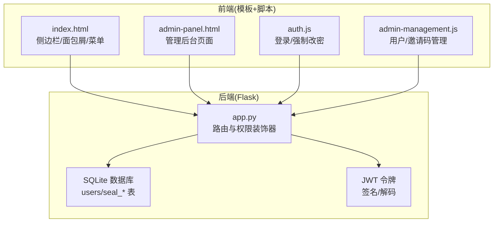
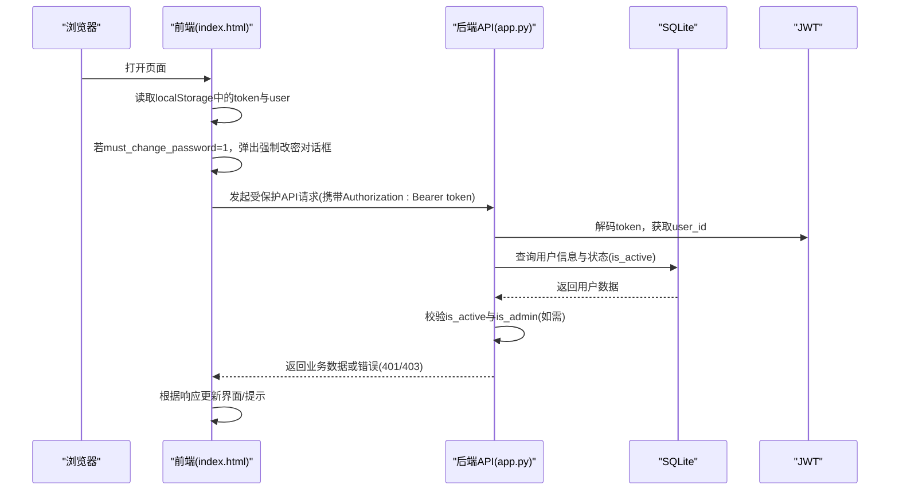
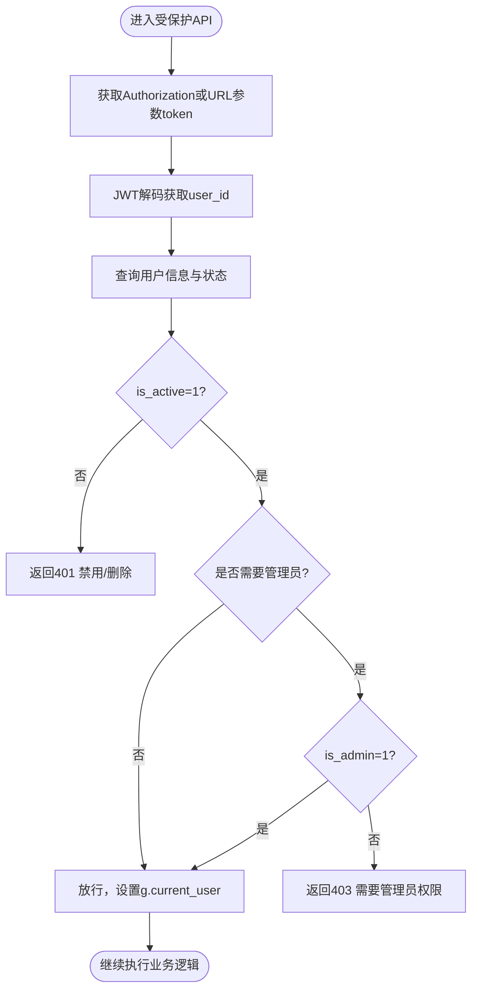
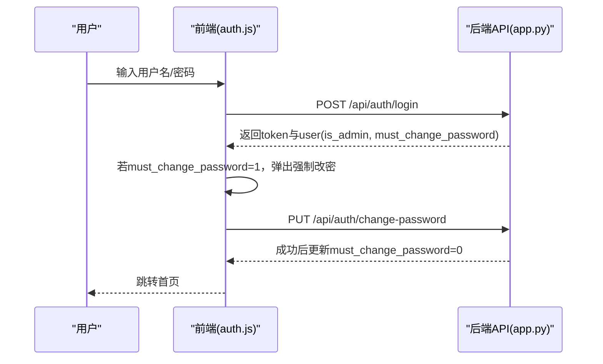
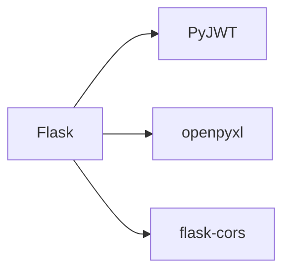

# 基于角色的权限控制

<cite>
**本文引用的文件**
- [app.py](file://app.py)
- [auth.js](file://static/js/auth.js)
- [admin-management.js](file://static/js/admin-management.js)
- [index.html](file://templates/index.html)
- [admin-panel.html](file://templates/admin-panel.html)
- [requirements.txt](file://requirements.txt)
</cite>

## 目录
1. [简介](#简介)
2. [项目结构](#项目结构)
3. [核心组件](#核心组件)
4. [架构总览](#架构总览)
5. [详细组件分析](#详细组件分析)
6. [依赖分析](#依赖分析)
7. [性能考虑](#性能考虑)
8. [故障排查指南](#故障排查指南)
9. [结论](#结论)
10. [附录](#附录)

## 简介
本文件面向“封样件及色板接收登记管理系统”，系统采用基于角色的权限控制（RBAC）模型，围绕用户身份认证、令牌校验、管理员专属功能以及用户状态管理构建。重点阐述：
- 管理员权限与普通用户的区别，以及is_admin字段的作用与权限标识
- 权限装饰器admin_required的实现原理与使用方式
- 用户角色分类与权限矩阵（可访问模块与操作权限）
- 用户状态管理（is_active字段控制账户启用状态、must_change_password强制改密机制）
- 权限控制最佳实践（敏感操作的权限验证、权限继承规则）
- 权限变更流程与审计要求
- 权限相关的错误处理与用户体验优化建议

## 项目结构
系统采用Flask后端 + 前端模板/静态资源的前后端分离式结构，权限控制贯穿后端API与前端页面展示两部分。

图表来源
- [app.py](file://app.py)
- [index.html](file://templates/index.html)
- [admin-panel.html](file://templates/admin-panel.html)
- [auth.js](file://static/js/auth.js)
- [admin-management.js](file://static/js/admin-management.js)

章节来源
- [app.py](file://app.py)
- [index.html](file://templates/index.html)
- [admin-panel.html](file://templates/admin-panel.html)
- [auth.js](file://static/js/auth.js)
- [admin-management.js](file://static/js/admin-management.js)

## 核心组件
- 认证与权限装饰器
  - token_required：统一校验JWT令牌、检查账户启用状态、维护在线状态
  - admin_required：基于g.current_user.is_admin进行管理员权限校验
- 用户状态与强制改密
  - is_active：控制账户启用/禁用
  - must_change_password：首次登录或强制改密场景
- 管理员专属功能
  - 用户管理（启用/禁用、删除）
  - 邀请码管理（生成、启停、删除）
  - 系统设置（ΔE阈值）
- 前端菜单与可见性
  - 管理员菜单仅在用户具备is_admin时显示

章节来源
- [app.py](file://app.py)
- [index.html](file://templates/index.html)
- [auth.js](file://static/js/auth.js)
- [admin-management.js](file://static/js/admin-management.js)

## 架构总览
系统权限控制的关键交互如下：

图表来源
- [app.py](file://app.py)
- [index.html](file://templates/index.html)
- [auth.js](file://static/js/auth.js)

## 详细组件分析

### 权限装饰器与用户状态
- token_required
  - 作用：统一鉴权入口，支持Header与Query两种方式传递token；校验令牌有效性与过期；检查is_active；更新last_active在线状态
  - 关键点：若账户被禁用/删除，直接返回401并携带特定错误码
- admin_required
  - 作用：在token_required基础上，进一步校验g.current_user.is_admin
  - 场景：管理员功能（用户管理、邀请码管理、系统设置、处置记录软/硬删除等）

图表来源
- [app.py](file://app.py)

章节来源
- [app.py](file://app.py)

### 用户角色与权限矩阵
- 角色分类
  - 普通用户：具备基本业务操作权限（封样件/色板台账、寄出、评定、处置记录查看等）
  - 管理员：在普通用户权限基础上，额外拥有管理员功能（用户管理、邀请码管理、系统设置、处置记录软/硬删除等）
- 权限矩阵（基于装饰器与路由标注）
  - 业务类API：均使用token_required，确保登录有效
  - 管理员类API：使用@token_required + @admin_required，如：
    - /api/admin/users/*
    - /api/admin/invitations/*
    - /api/admin/settings/*
    - /api/disposal-records/*/delete 等
  - 前端菜单可见性：仅管理员可见“管理后台”菜单项

章节来源
- [app.py](file://app.py)
- [index.html](file://templates/index.html)

### 用户状态管理与强制改密
- is_active
  - 控制账户启用/禁用；被禁用用户无法通过token_required校验
  - 管理员可启用/禁用普通用户；禁用时清空last_active
- must_change_password
  - 登录成功后，若must_change_password=1，前端弹出强制改密对话框
  - 改密成功后，must_change_password置0，方可正常使用

图表来源
- [auth.js](file://static/js/auth.js)
- [app.py](file://app.py)

章节来源
- [auth.js](file://static/js/auth.js)
- [app.py](file://app.py)

### 管理员功能与权限继承
- 用户管理
  - 启用/禁用：仅管理员可操作；禁止禁用管理员账户；禁用时清空在线状态
  - 删除：仅管理员可删除普通用户；删除时同步清理其邀请码
- 邀请码管理
  - 生成：管理员生成邀请码并可设置最大使用次数与过期时间
  - 启停：管理员启停邀请码
  - 删除：仅未使用过的邀请码可删除
- 系统设置
  - 管理员可调整ΔE阈值，影响色差等级判定
- 处置记录管理
  - 软删除/恢复/永久删除：管理员操作，涉及台账回滚与关联清理

章节来源
- [app.py](file://app.py)
- [admin-management.js](file://static/js/admin-management.js)
- [admin-panel.html](file://templates/admin-panel.html)

### 前端菜单与可见性
- 管理员菜单仅在用户具备is_admin时显示
- 侧边栏角色标签随用户角色变化
- 强制改密流程在首页加载时触发

章节来源
- [index.html](file://templates/index.html)

## 依赖分析
- 后端依赖
  - Flask：Web框架
  - PyJWT：JWT签名/解码
  - openpyxl：Excel导入导出
  - flask-cors：跨域支持
- 前端依赖
  - 通过模板引入静态资源与脚本，无额外包管理

图表来源
- [requirements.txt](file://requirements.txt)

章节来源
- [requirements.txt](file://requirements.txt)

## 性能考虑
- 令牌校验与用户查询：每次受保护API均需解码JWT并查询用户状态，建议：
  - 在网关层或中间件缓存近期活跃用户的状态（短期缓存）
  - 对高频接口采用更细粒度的缓存策略（如仅缓存公开数据）
- 在线状态：last_active每2分钟ping一次，建议：
  - 前端心跳频率可按需调整，避免过度请求
  - 后端在线判定可考虑时区转换与UTC本地化差异
- 导入导出：Excel处理涉及大文件，建议：
  - 分批处理与流式写入，避免内存峰值过高

## 故障排查指南
- 401 未提供认证Token/Token无效/Token已过期
  - 检查前端是否正确携带Authorization: Bearer token或URL参数token
  - 确认服务端SECRET_KEY一致，客户端与服务端时间偏差
- 401 账户已被停用
  - 管理员是否误禁用账户；检查is_active字段
- 403 需要管理员权限
  - 当前用户是否为管理员（is_admin=1）；确认admin_required装饰器使用
- 强制改密未触发
  - 登录后must_change_password是否仍为1；确认前端逻辑与后端返回一致
- 管理员菜单不可见
  - 用户是否为管理员；前端是否正确渲染

章节来源
- [app.py](file://app.py)
- [auth.js](file://static/js/auth.js)
- [index.html](file://templates/index.html)

## 结论
本系统以token_required与admin_required为核心，结合is_admin/is_active/must_change_password等字段，实现了清晰的基于角色的权限控制。管理员与普通用户在功能与操作权限上明确分离，前端菜单与可见性与后端权限保持一致。建议在生产环境中进一步完善令牌缓存、审计日志与权限变更追踪，以提升安全性与可观测性。

## 附录

### 权限控制最佳实践
- 敏感操作必须使用admin_required装饰器
- 所有受保护API均使用token_required，确保登录与账户状态校验
- 权限继承：管理员继承普通用户权限，并叠加管理功能
- 审计要求：建议记录关键操作（用户启停、删除、邀请码启停、系统设置变更、处置记录软/硬删除）的时间、操作人、对象与影响范围
- 错误处理：对401/403进行统一拦截与友好提示，避免泄露内部细节
- 用户体验：强制改密流程前置，减少后续阻塞；在线状态与菜单可见性实时反映权限变化

### 权限变更流程与审计
- 用户启停/删除：管理员操作 → 后端校验 → 更新状态/删除数据 → 清理在线状态（如禁用） → 记录审计日志
- 邀请码启停/删除：管理员操作 → 校验使用情况 → 更新状态/删除 → 记录审计日志
- 系统设置变更：管理员操作 → 更新阈值 → 影响后续计算 → 记录审计日志
- 处置记录管理：管理员软删除/恢复/永久删除 → 回滚/重应用台账影响 → 清理关联数据 → 记录审计日志