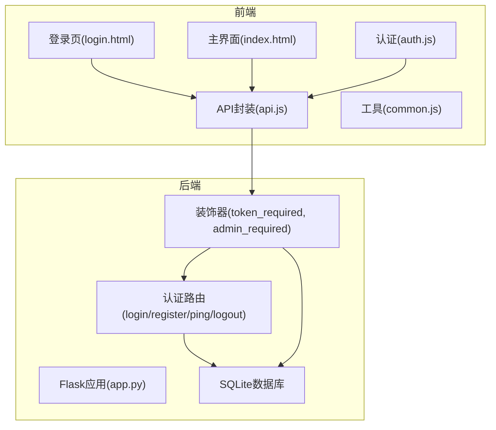
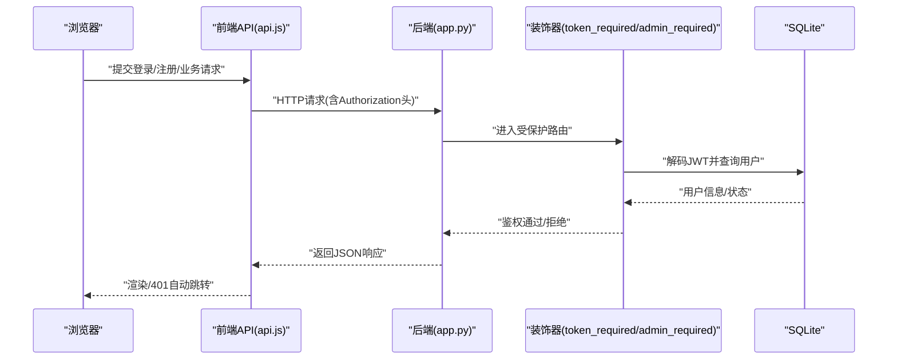
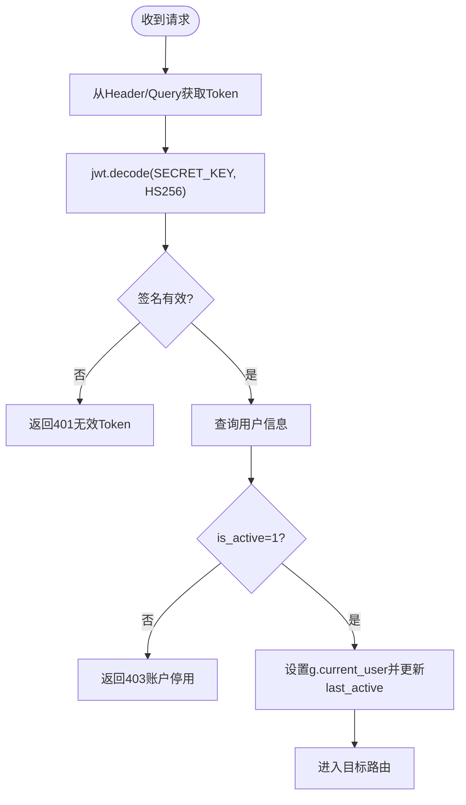
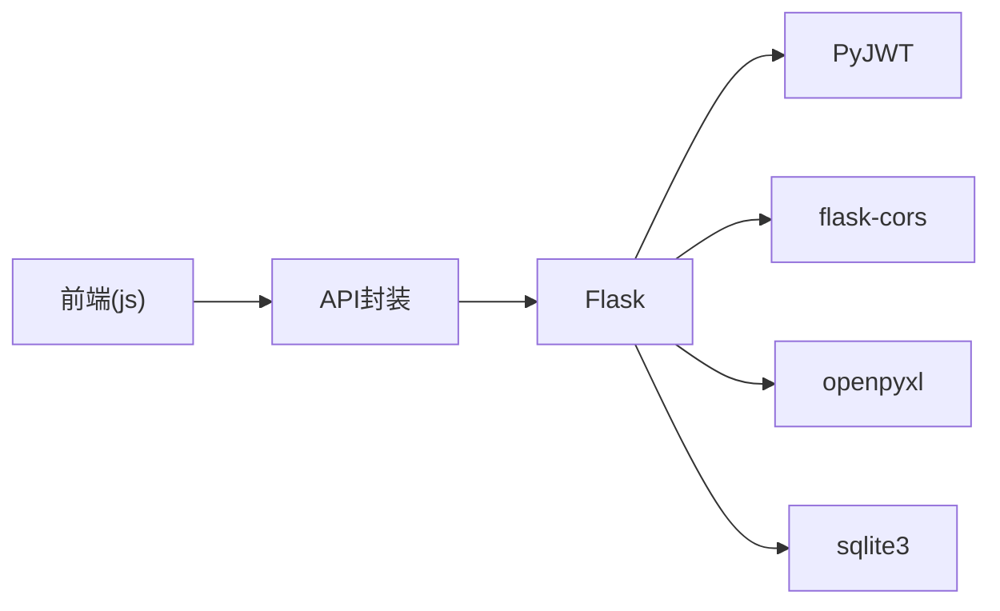

# 安全与权限

<cite>
**本文引用的文件**
- [app.py](file://app.py)
- [requirements.txt](file://requirements.txt)
- [auth.js](file://static/js/auth.js)
- [api.js](file://static/js/api.js)
- [common.js](file://static/js/common.js)
- [index.html](file://templates/index.html)
- [login.html](file://templates/login.html)
</cite>

## 目录
1. [简介](#简介)
2. [项目结构与安全相关模块](#项目结构与安全相关模块)
3. [核心组件与安全机制](#核心组件与安全机制)
4. [架构总览](#架构总览)
5. [详细组件分析](#详细组件分析)
6. [依赖关系分析](#依赖关系分析)
7. [性能与安全特性](#性能与安全特性)
8. [故障排查指南](#故障排查指南)
9. [结论](#结论)
10. [附录：最佳实践与加固建议](#附录最佳实践与加固建议)

## 简介
本文件面向“封样件及色板接收登记管理系统”，聚焦于系统中的安全与权限设计，包括：
- JWT认证机制：Token生成、验证、过期处理与刷新策略
- 基于角色的访问控制（RBAC）：管理员与普通用户的权限差异
- 认证与权限装饰器的实现与使用
- 密码加密存储与传输安全
- CSRF与XSS防护现状与建议
- 会话管理与在线状态跟踪
- 安全配置、审计与日志、CORS限制与安全事件响应流程

## 项目结构与安全相关模块
- 后端采用Flask框架，使用PyJWT进行Token处理，flask-cors开启跨域支持；SQLite作为本地存储。
- 前端通过静态资源提供登录页与主界面，使用本地存储保存Token与用户信息，并通过统一的API封装发送请求。
- 安全相关逻辑主要集中在后端装饰器、认证路由与前端API拦截器中。

图表来源
- [app.py](file://app.py)
- [api.js](file://static/js/api.js)
- [auth.js](file://static/js/auth.js)
- [index.html](file://templates/index.html)
- [login.html](file://templates/login.html)

章节来源
- [app.py](file://app.py)
- [requirements.txt](file://requirements.txt)
- [api.js](file://static/js/api.js)
- [auth.js](file://static/js/auth.js)
- [index.html](file://templates/index.html)
- [login.html](file://templates/login.html)

## 核心组件与安全机制
- JWT认证与装饰器
  - 后端定义了token_required与admin_required装饰器，分别用于校验Token有效性与管理员权限。
  - 登录成功后签发JWT，包含用户标识、用户名、是否管理员、是否必须改密等信息。
  - Token过期或无效时返回401，前端统一处理并清空本地Token与用户信息，跳转登录页。
- RBAC权限模型
  - 用户表包含is_admin字段，管理员拥有更高权限，如用户管理、邀请码管理、系统设置、处置记录软/硬删除等。
  - 普通用户仅能访问业务数据与基础操作。
- 密码存储与传输
  - 密码以SHA-256哈希存储；注册/登录/改密均在前端进行基本校验，后端严格比对哈希。
  - 建议升级为PBKDF2/Argon2等专用密码哈希算法，并启用HTTPS。
- 会话与在线状态
  - 登录与心跳接口会更新用户last_active字段；前端定时向后端发送ping保持在线。
  - 管理员界面展示用户在线状态（5分钟内活跃即在线）。
- 前端安全
  - API封装统一注入Authorization头；401时自动清理本地存储并跳转登录。
  - 工具函数提供HTML转义与剪贴板复制降级方案，有助于降低XSS风险。
- CORS与传输安全
  - 后端全局启用flask-cors，默认跨域策略较为宽松，建议在生产环境限制Origin与方法。
  - 建议强制HTTPS，防止Token在传输中泄露。

章节来源
- [app.py](file://app.py)
- [api.js](file://static/js/api.js)
- [auth.js](file://static/js/auth.js)
- [common.js](file://static/js/common.js)
- [index.html](file://templates/index.html)
- [login.html](file://templates/login.html)

## 架构总览
下图展示了前后端交互与安全控制的关键路径，包括认证、权限校验、会话维护与错误处理。

图表来源
- [app.py](file://app.py)
- [api.js](file://static/js/api.js)

## 详细组件分析

### JWT认证与装饰器
- Token生成
  - 登录成功后，后端构造payload（用户ID、用户名、是否管理员、是否必须改密），使用SECRET_KEY与HS256算法生成JWT。
- Token验证
  - token_required装饰器从Header或Query参数读取Token，使用SECRET_KEY解码并校验签名；若过期或无效返回401。
  - 验证通过后将当前用户信息写入g.current_user，并更新last_active。
- 权限装饰器
  - admin_required装饰器在token_required基础上进一步检查is_admin字段，非管理员直接返回403。
- 刷新策略
  - 当前未实现自动刷新机制；建议引入短期Access Token + 长期Refresh Token模式，或在前端定期轮询刷新接口。

图表来源
- [app.py](file://app.py)

章节来源
- [app.py](file://app.py)

### 认证路由与会话管理
- 登录/注册/改密/心跳/退出
  - 登录：校验用户名与密码哈希，签发JWT并更新在线状态。
  - 注册：校验邀请码有效性与密码一致性，创建用户并更新邀请码使用计数。
  - 改密：校验旧密码哈希，更新为新密码哈希并清除must_change_password。
  - 心跳：更新last_active，维持在线状态。
  - 退出：清除last_active，前端同时调用后端logout清理在线状态。
- 在线状态跟踪
  - 管理员用户列表中，基于last_active与当前时间差判断在线状态（5分钟内活跃）。

章节来源
- [app.py](file://app.py)
- [index.html](file://templates/index.html)

### RBAC权限体系
- 角色
  - is_admin=1为管理员；普通用户仅能访问业务数据。
- 管理员专属接口
  - 用户管理、邀请码管理、系统设置、处置记录软/硬删除、回收站查看等。
- 普通用户接口
  - 业务数据增删改查、导入导出、寄出管理、有效期管理、评定与报废等。

章节来源
- [app.py](file://app.py)

### 前端安全与API拦截
- API封装
  - 统一注入Authorization头；401时清理本地Token与用户信息并跳转登录。
  - 上传接口同样携带Token并在401时处理。
- 登录/注册
  - 前端进行基础校验（必填、密码长度、两次密码一致），后端再次严格校验。
- 在线状态与强制改密
  - 主界面加载时检查Token与用户信息；若must_change_password为真，弹窗强制改密。
  - 前端定时心跳保持在线状态。

章节来源
- [api.js](file://static/js/api.js)
- [auth.js](file://static/js/auth.js)
- [index.html](file://templates/index.html)
- [login.html](file://templates/login.html)

### XSS与CSRF防护现状与建议
- XSS
  - 工具函数提供escapeHtml，建议在渲染用户输入时使用。
  - 建议启用CSP，限制脚本来源与内联脚本。
- CSRF
  - 当前未见CSRF令牌机制；建议在生产环境引入CSRF中间件或同源策略配合。
- CORS
  - 后端启用flask-cors，默认策略较宽松；建议在生产环境限定Origin、Methods与Headers。

章节来源
- [common.js](file://static/js/common.js)
- [app.py](file://app.py)

## 依赖关系分析
- 后端依赖
  - Flask、PyJWT、flask-cors、openpyxl、sqlite3。
- 前端依赖
  - 通过静态资源引入，无包管理器；建议引入构建工具统一管理依赖与安全扫描。

图表来源
- [requirements.txt](file://requirements.txt)
- [app.py](file://app.py)
- [api.js](file://static/js/api.js)

章节来源
- [requirements.txt](file://requirements.txt)
- [app.py](file://app.py)
- [api.js](file://static/js/api.js)

## 性能与安全特性
- 性能
  - 装饰器在每次受保护请求中进行解码与用户查询，建议在高并发场景引入Redis缓存用户信息与Token黑名单。
- 安全
  - Token有效期为24小时；建议缩短有效期并结合刷新机制。
  - 密码存储为SHA-256，建议升级为PBKDF2/Argon2并加盐。
  - 建议启用HTTPS、CSP、CORS白名单、速率限制与审计日志。

[本节为通用建议，无需特定文件来源]

## 故障排查指南
- 401未提供Token或Token无效
  - 检查前端是否正确注入Authorization头；确认后端SECRET_KEY一致。
- 403账户被停用
  - 管理员需先启用账户并清除last_active。
- 403需要管理员权限
  - 确认当前用户is_admin=1；检查admin_required装饰器所在路由。
- 心跳失效导致频繁掉线
  - 检查前端定时任务是否正常执行；确认后端ping接口可用。
- CORS跨域问题
  - 生产环境需限制Origin与方法；开发环境可保留默认策略。

章节来源
- [app.py](file://app.py)
- [api.js](file://static/js/api.js)
- [index.html](file://templates/index.html)

## 结论
该系统在认证与权限方面具备清晰的JWT与RBAC实现，前端通过统一API封装实现了401自动跳转与在线状态维护。建议在生产环境中加强密码哈希算法、启用HTTPS、限制CORS、引入CSRF防护与审计日志，并考虑Token刷新与缓存优化，以进一步提升安全性与稳定性。

[本节为总结，无需特定文件来源]

## 附录：最佳实践与加固建议
- 密码与Token
  - 使用PBKDF2/Argon2替代SHA-256；Token有效期缩短并引入刷新机制。
- 传输与跨域
  - 强制HTTPS；CORS限制Origin/Methods/Headers；避免暴露敏感头。
- 前端安全
  - 启用CSP；对用户输入进行严格转义；避免内联脚本；CSRF令牌或同源策略。
- 审计与日志
  - 记录登录/登出、权限变更、敏感操作（删除/恢复/永久删除）、异常401/403。
- 会话与在线
  - 前端心跳周期合理化；后端定期清理长时间不活跃会话。
- 安全事件响应
  - 建立事件分级与处置流程：快速冻结账户、撤销Token、审计日志回溯、通知与修复、复盘改进。

[本节为通用建议，无需特定文件来源]