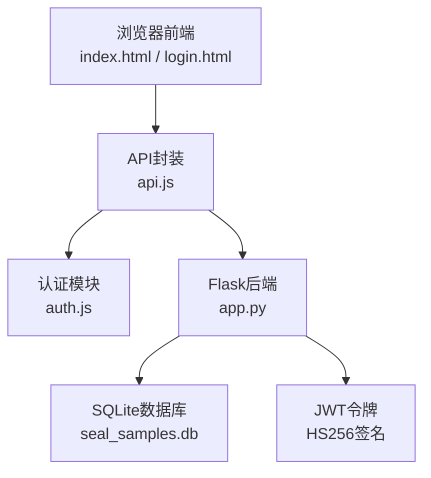
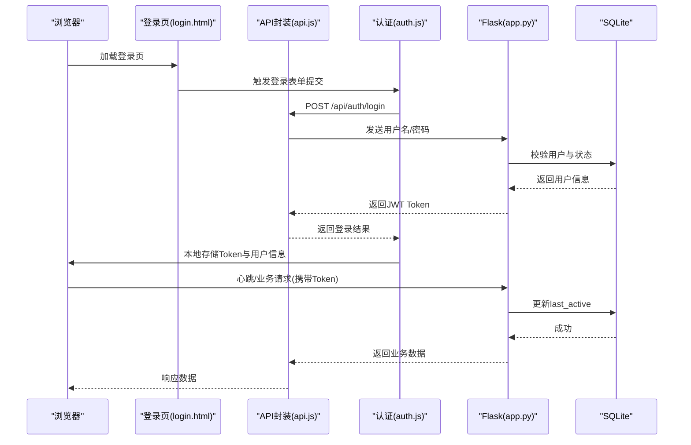
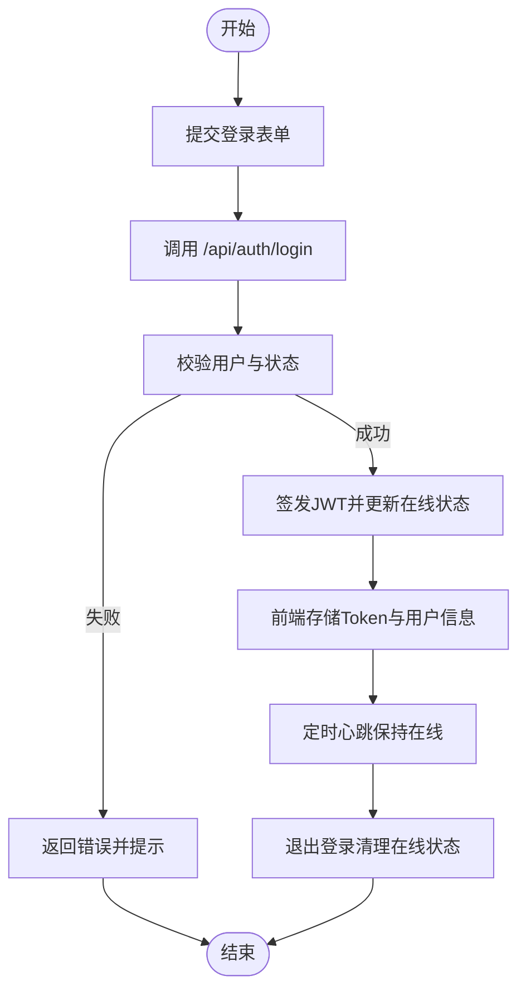
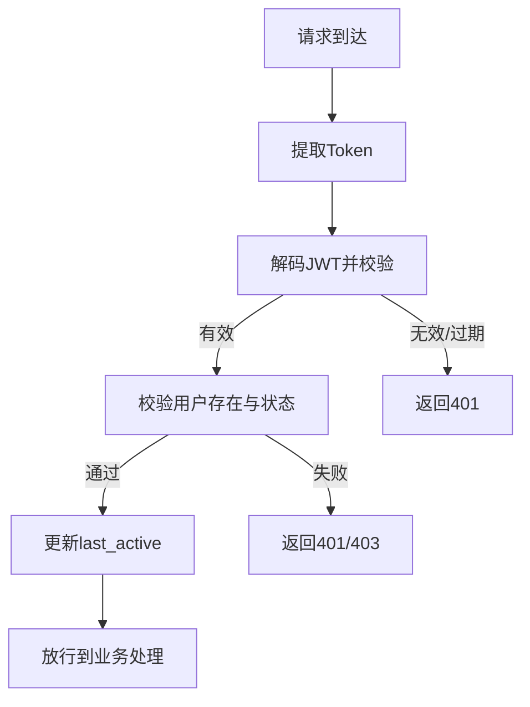
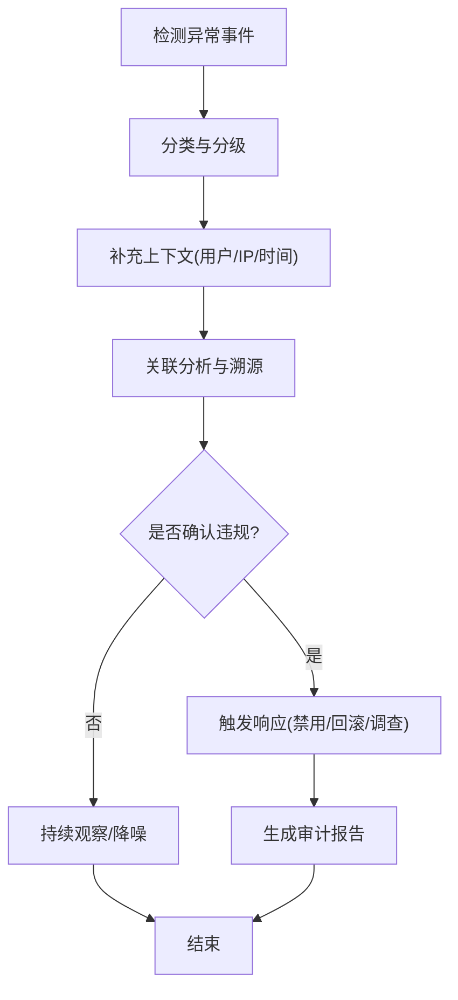
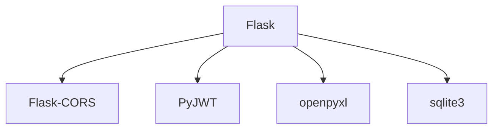

# 安全审计与日志

<cite>
**本文引用的文件**
- [app.py](file://app.py)
- [requirements.txt](file://requirements.txt)
- [auth.js](file://static/js/auth.js)
- [api.js](file://static/js/api.js)
- [common.js](file://static/js/common.js)
- [password-change.js](file://static/js/password-change.js)
- [ui.js](file://static/js/ui.js)
- [index.html](file://templates/index.html)
- [login.html](file://templates/login.html)
</cite>

## 目录
1. [简介](#简介)
2. [项目结构](#项目结构)
3. [核心组件](#核心组件)
4. [架构总览](#架构总览)
5. [详细组件分析](#详细组件分析)
6. [依赖分析](#依赖分析)
7. [性能考虑](#性能考虑)
8. [故障排查指南](#故障排查指南)
9. [结论](#结论)
10. [附录](#附录)

## 简介
本文件面向“封样件及色板接收登记管理系统”，围绕安全审计与日志主题，系统性梳理现有实现、识别潜在风险点，并提出可落地的审计日志设计方案、存储与保留策略、监控与告警建议、响应流程、访问控制与隐私保护措施，以及性能优化与合规性要求。由于当前仓库未包含独立的日志服务或审计表，本文在不改变现有架构的前提下，提供可扩展的审计方案与最佳实践。

## 项目结构
系统采用前后端分离模式：
- 后端：Flask 应用，负责业务逻辑、数据库访问、JWT 认证与鉴权、静态资源与模板渲染。
- 前端：HTML 模板 + JavaScript 模块，负责用户交互、API 请求封装、状态管理与 UI 组件。
- 数据存储：SQLite 文件数据库，随应用启动初始化。

图表来源
- [app.py:21-25](file://app.py#L21-L25)
- [api.js:4-88](file://static/js/api.js#L4-L88)
- [auth.js:1-204](file://static/js/auth.js#L1-L204)
- [index.html:110-114](file://templates/index.html#L110-L114)
- [login.html:138-141](file://templates/login.html#L138-L141)

章节来源
- [app.py:21-25](file://app.py#L21-L25)
- [requirements.txt:1-5](file://requirements.txt#L1-L5)
- [index.html:110-114](file://templates/index.html#L110-L114)
- [login.html:138-141](file://templates/login.html#L138-L141)

## 核心组件
- 认证与会话
  - 后端提供登录、注册、修改密码、心跳与退出登录接口；使用 JWT 令牌承载用户身份与权限；支持 Token 过期校验与账户禁用检测。
  - 前端通过 API 封装自动附加 Authorization 头，401 时自动清理本地状态并跳转登录。
- 权限控制
  - 装饰器 token_required 保证受保护接口的访问凭证；admin_required 限制管理员专属功能。
- 数据访问
  - 统一通过 get_db() 获取连接，使用 row_factory 返回字典；各业务模块（封样件、色板、寄出、有效期、评定、报废、处置记录、系统设置、用户配置）均基于 SQLite 表进行增删改查。
- 在线状态
  - 用户登录成功后更新 last_active；心跳接口与退出登录接口同步在线状态。

章节来源
- [app.py:49-84](file://app.py#L49-L84)
- [app.py:454-588](file://app.py#L454-L588)
- [api.js:4-88](file://static/js/api.js#L4-L88)
- [auth.js:1-204](file://static/js/auth.js#L1-L204)
- [index.html:203-210](file://templates/index.html#L203-L210)

## 架构总览
下图展示登录与关键业务流程中的安全相关节点，体现 Token 传递、鉴权装饰器、在线状态更新与错误处理。

图表来源
- [login.html:138-141](file://templates/login.html#L138-L141)
- [auth.js:42-68](file://static/js/auth.js#L42-L68)
- [api.js:44-66](file://static/js/api.js#L44-L66)
- [app.py:454-493](file://app.py#L454-L493)
- [app.py:572-588](file://app.py#L572-L588)

## 详细组件分析

### 认证与会话组件
- 登录流程
  - 前端收集用户名/密码，调用 API.post('/auth/login')。
  - 后端校验用户是否存在、账户是否启用、密码哈希是否匹配；成功后签发 JWT 并更新 last_active。
- Token 管理
  - 前端在每次请求中附加 Authorization: Bearer <token>。
  - 401 时自动清理本地 token 与用户信息，跳转登录页。
- 心跳与退出
  - 前端定时发送 /api/auth/ping 保持在线；退出登录时调用 /api/auth/logout 清除在线状态。

图表来源
- [auth.js:42-68](file://static/js/auth.js#L42-L68)
- [api.js:20-33](file://static/js/api.js#L20-L33)
- [app.py:454-493](file://app.py#L454-L493)
- [app.py:572-588](file://app.py#L572-L588)

章节来源
- [auth.js:1-204](file://static/js/auth.js#L1-L204)
- [api.js:4-88](file://static/js/api.js#L4-L88)
- [app.py:454-588](file://app.py#L454-L588)

### 权限控制组件
- token_required
  - 解析 Authorization 头或查询参数 token，解码 JWT 并校验有效性；检查用户是否存在与是否启用；更新 last_active。
- admin_required
  - 仅管理员可访问的接口使用该装饰器，防止越权操作。

图表来源
- [app.py:49-84](file://app.py#L49-L84)

章节来源
- [app.py:49-84](file://app.py#L49-L84)

### 关键业务与审计要点
- 封样件与色板台账
  - 增删改查接口均受 token_required 保护；涉及有效期与状态字段，建议记录变更日志。
- 寄出管理
  - 扣减库存与新增寄出记录需确保原子性，建议记录操作前后状态。
- 有效期管理与评定/报废
  - 有效期规则、评定结果、报废原因与审批人等关键字段变更，建议纳入审计。
- 处置记录（评定+报废）
  - 支持软删除、恢复与永久删除，需记录操作类型、影响范围与回滚动作。

章节来源
- [app.py:591-795](file://app.py#L591-L795)
- [app.py:797-1041](file://app.py#L797-L1041)
- [app.py:1043-1171](file://app.py#L1043-L1171)
- [app.py:1173-1208](file://app.py#L1173-L1208)
- [app.py:1210-1328](file://app.py#L1210-L1328)
- [app.py:1329-1422](file://app.py#L1329-L1422)
- [app.py:1628-2080](file://app.py#L1628-L2080)

### 日志格式与结构设计
为满足安全审计需求，建议在现有业务接口中扩展审计日志记录。以下为推荐的审计日志字段与示例格式（以文本形式描述，便于后续实现）：

- 时间戳：精确到秒或毫秒，统一使用本地时区（如 UTC+8）。
- 用户标识：当前用户ID、用户名、真实姓名。
- 操作类型：登录、注册、修改密码、心跳、退出、CRUD、权限变更、系统设置、报表导出等。
- 资源标识：操作对象类型（封样件、色板、寄出、有效期、评定、报废、处置记录、系统设置、用户配置）、对象ID、对象序列号/编号。
- IP地址：客户端真实IP（可通过后端中间件或反向代理获取）。
- 结果状态：成功、失败、异常；失败时记录错误码与简要原因。
- 请求详情：关键参数摘要（如用户名、数量、有效期、状态等，避免记录敏感明文）。
- 会话信息：Token 标识（可选，不记录完整Token）。

章节来源
- [app.py:49-84](file://app.py#L49-L84)
- [app.py:454-588](file://app.py#L454-L588)

### 日志存储策略与保留期限
- 存储位置
  - 建议独立的日志文件或数据库表（如 audit_log），避免与业务表混存。
- 分割与轮转
  - 按日/月分割文件；达到阈值自动压缩归档。
- 保留期限
  - 建议按法规与业务需求设定：如 90 天至 180 天短期审计、1-3 年长期归档。
- 访问控制
  - 仅管理员可读取；写入需具备审计权限；日志文件设置最小权限（仅服务进程可写）。

章节来源
- [app.py:88-335](file://app.py#L88-L335)

### 安全审计指标与监控告警
- 指标
  - 登录失败率、异常时间段登录、频繁修改密码、批量删除、管理员操作频次。
- 告警
  - 401/403 异常波动、同一IP短时间多次失败、管理员异地登录、删除/恢复操作集中。
- 建议
  - 集成轻量级日志采集（如 systemd-journald 或文件轮转），结合告警平台（如Prometheus+Alertmanager或日志平台自带告警）。

章节来源
- [api.js:20-33](file://static/js/api.js#L20-L33)
- [app.py:49-84](file://app.py#L49-L84)

### 日志分析与安全事件响应流程

[本图为概念流程，无需图表来源]

### 审计日志访问控制与隐私保护
- 最小权限原则：仅授权人员可访问审计日志。
- 数据脱敏：避免记录明文密码、完整Token；对敏感字段进行掩码或摘要。
- 审计链路：日志写入与查询均需记录操作者与目的，形成闭环审计。

章节来源
- [app.py:49-84](file://app.py#L49-L84)

### 性能优化与存储管理建议
- 写入优化
  - 异步写日志或批量刷盘；减少磁盘抖动。
- 索引与查询
  - 为时间、用户、操作类型建立索引；限定查询窗口与分页。
- 存储成本
  - 压缩归档、冷热分层；定期清理过期日志。

章节来源
- [app.py:88-335](file://app.py#L88-L335)

### 合规性要求与审计报告生成
- 合规参考
  - 网络安全等级保护、个人信息保护法、企业内控与审计规范。
- 报告维度
  - 时间范围、操作类型分布、用户行为画像、异常事件统计、整改建议。
- 自动化
  - 定期生成报告并归档；支持导出 Excel/PDF。

章节来源
- [app.py:1808-1890](file://app.py#L1808-L1890)

## 依赖分析
- 后端依赖
  - Flask、Flask-CORS、PyJWT、openpyxl、sqlite3（内置）。
- 前端依赖
  - fetch API、本地存储、DOM 操作；UI 组件与工具函数。

图表来源
- [requirements.txt:1-5](file://requirements.txt#L1-L5)

章节来源
- [requirements.txt:1-5](file://requirements.txt#L1-L5)

## 性能考虑
- 认证与鉴权
  - JWT 解码与校验开销低；建议缓存用户信息（短生命周期）。
- 数据库
  - 使用连接池与事务；对高频查询建立索引；避免 N+1 查询。
- 前端
  - 减少重复请求；合理使用防抖与节流；批量更新 UI。

章节来源
- [app.py:29-39](file://app.py#L29-L39)
- [common.js:90-92](file://static/js/common.js#L90-L92)

## 故障排查指南
- 401 未提供Token或Token无效
  - 检查前端是否正确存储与附加 Authorization 头；确认后端 SECRET_KEY 一致。
- Token过期
  - 前端应捕获401并引导重新登录；心跳可降低过期概率。
- 账户被停用
  - 后端返回特定错误码，前端提示并清理本地状态。
- 数据库初始化失败
  - 检查 DB_PATH 权限与磁盘空间；确认 SQLite 文件可读写。

章节来源
- [api.js:20-33](file://static/js/api.js#L20-L33)
- [app.py:57-76](file://app.py#L57-L76)
- [app.py:88-335](file://app.py#L88-L335)

## 结论
当前系统已具备完善的认证与权限控制基础，但尚未实现独立的审计日志体系。建议在不破坏现有架构的前提下，引入审计日志表与异步写入机制，明确日志格式与保留策略，建立监控与告警，完善访问控制与隐私保护，并制定审计报告与响应流程。如此可在保障系统安全与合规的同时，提升运营与风控能力。

## 附录
- 建议新增审计表结构（示意）
  - 字段：id、timestamp、user_id、username、real_name、operation、resource_type、resource_id、ip、result、details、session_id。
- 建议在以下接口增加审计记录
  - 登录、注册、修改密码、心跳、退出、CRUD、权限变更、系统设置、报表导出、处置记录软/硬删除与恢复。

[本节为概念性建议，无需章节来源]