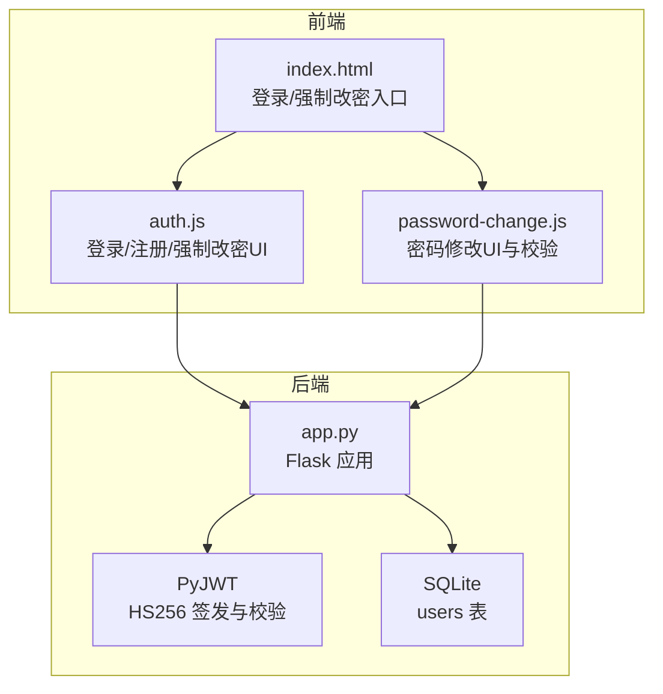
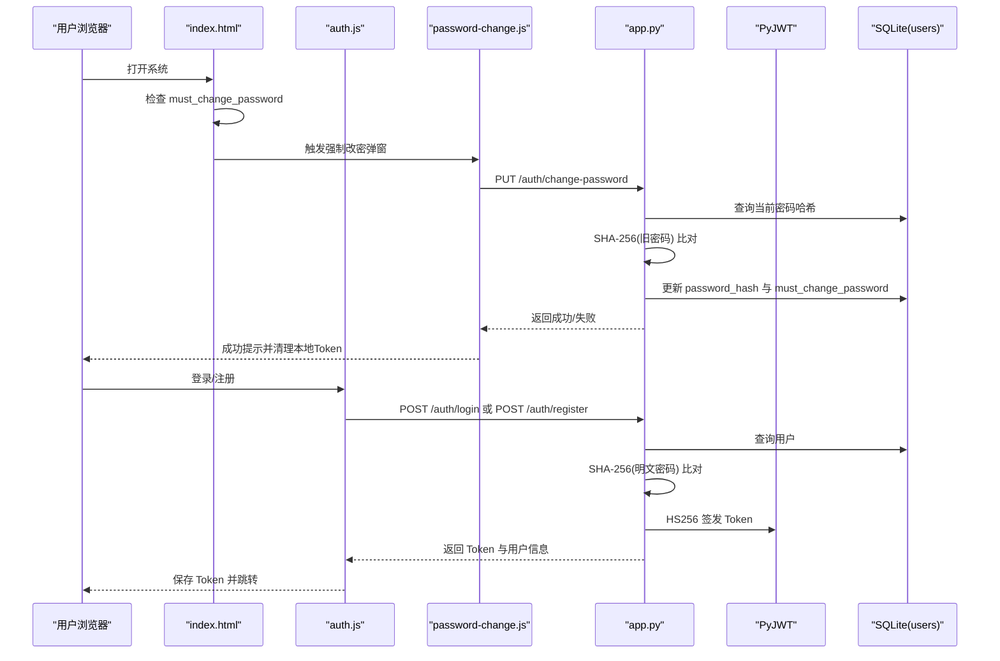
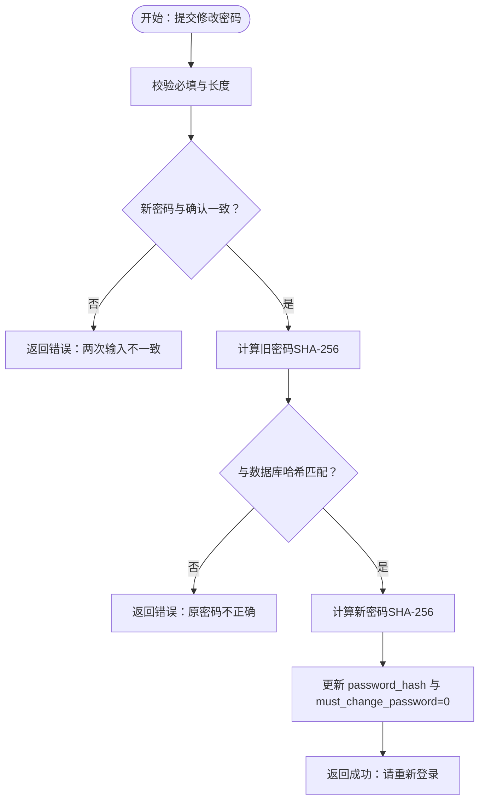
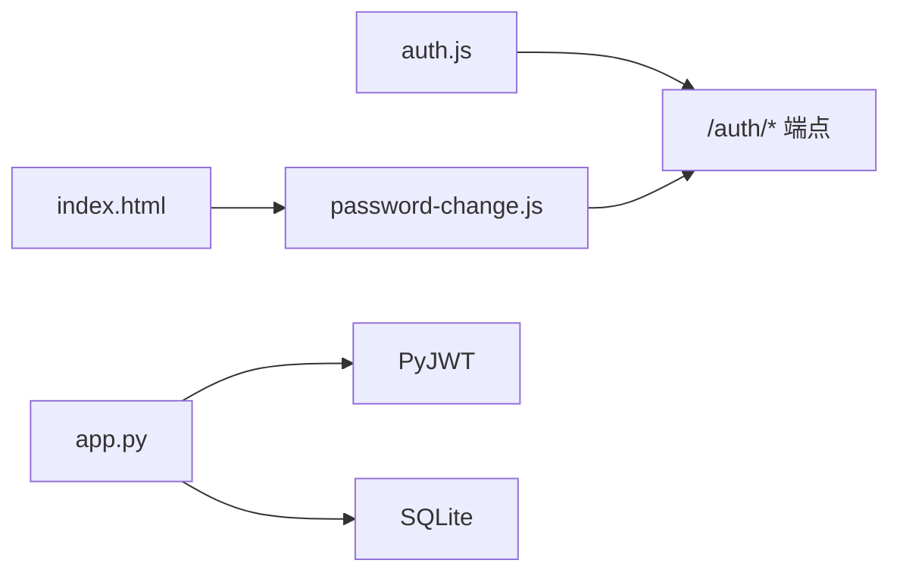

# 密码安全与加密

<cite>
**本文引用的文件**
- [app.py](file://app.py)
- [auth.js](file://static/js/auth.js)
- [password-change.js](file://static/js/password-change.js)
- [index.html](file://templates/index.html)
- [requirements.txt](file://requirements.txt)
</cite>

## 目录
1. [简介](#简介)
2. [项目结构](#项目结构)
3. [核心组件](#核心组件)
4. [架构总览](#架构总览)
5. [详细组件分析](#详细组件分析)
6. [依赖分析](#依赖分析)
7. [性能考量](#性能考量)
8. [故障排查指南](#故障排查指南)
9. [结论](#结论)
10. [附录](#附录)

## 简介
本文件面向“封样件及色板接收登记管理系统”，聚焦密码安全与加密机制，覆盖以下主题：
- 密码加密存储机制：SHA-256哈希与盐值处理现状与风险
- 密码强度要求与验证规则：最小长度、字符类型、重复性检查
- 密码修改流程的安全实现：原密码验证、新密码确认、一次性改密机制
- 密码重置与找回功能的安全考虑：当前实现与建议
- 密码安全配置建议：算法选择、密钥管理、安全存储最佳实践
- 安全事件处理与审计要求：日志与监控建议
- 常见密码安全问题的预防与应对

## 项目结构
系统采用前后端分离架构：
- 后端：Flask 应用，负责认证、授权、数据访问与业务逻辑
- 前端：静态 HTML/CSS/JS，负责用户交互与调用后端 API
- 存储：SQLite 数据库，存储用户信息与业务数据
- 认证：基于 JWT 的 Token 机制，支持 Header 与 Query 两种传递方式

图表来源
- [app.py:21-25](file://app.py#L21-L25)
- [auth.js:1-204](file://static/js/auth.js#L1-L204)
- [password-change.js:1-113](file://static/js/password-change.js#L1-L113)
- [index.html:114-141](file://templates/index.html#L114-L141)

章节来源
- [app.py:21-25](file://app.py#L21-L25)
- [auth.js:1-204](file://static/js/auth.js#L1-L204)
- [password-change.js:1-113](file://static/js/password-change.js#L1-L113)
- [index.html:114-141](file://templates/index.html#L114-L141)

## 核心组件
- 认证与授权
  - JWT HS256 签发与校验，支持 Header 与 Query 两种 Token 传递方式
  - 装饰器对受保护接口进行鉴权与在线状态维护
- 密码存储与校验
  - 用户密码以 SHA-256 哈希形式存储在 users.password_hash 字段
  - 登录、注册、改密均对明文密码进行 SHA-256 计算后比对/入库
- 强制改密机制
  - 首次登录或系统预置默认密码时，通过 must_change_password 标记触发强制改密
- 前端交互
  - 登录/注册表单校验与提示
  - 密码强度可视化提示
  - 密码修改对话框与二次确认

章节来源
- [app.py:49-76](file://app.py#L49-L76)
- [app.py:454-493](file://app.py#L454-L493)
- [app.py:495-542](file://app.py#L495-L542)
- [app.py:544-570](file://app.py#L544-L570)
- [auth.js:42-108](file://static/js/auth.js#L42-L108)
- [password-change.js:65-93](file://static/js/password-change.js#L65-L93)
- [index.html:133-136](file://templates/index.html#L133-L136)

## 架构总览
系统密码相关的关键交互如下：

图表来源
- [index.html:133-136](file://templates/index.html#L133-L136)
- [password-change.js:65-93](file://static/js/password-change.js#L65-L93)
- [auth.js:42-108](file://static/js/auth.js#L42-L108)
- [app.py:454-493](file://app.py#L454-L493)
- [app.py:495-542](file://app.py#L495-L542)
- [app.py:544-570](file://app.py#L544-L570)

## 详细组件分析

### 密码加密存储机制
- 存储字段
  - users.password_hash：存储 SHA-256 哈希值
- 计算与比对
  - 登录/注册/改密时，对明文密码执行 SHA-256 计算并与数据库中的哈希值比对
- 盐值处理现状
  - 当前实现未使用独立盐值，直接对明文密码进行哈希
- 安全影响
  - 缺少盐值导致相同密码产生相同哈希，易受彩虹表攻击
  - 建议引入随机盐值并采用 PBKDF2、bcrypt、scrypt 或 Argon2

章节来源
- [app.py:98](file://app.py#L98)
- [app.py:289](file://app.py#L289)
- [app.py:466](file://app.py#L466)
- [app.py:530](file://app.py#L530)
- [app.py:559](file://app.py#L559)

### 密码强度要求与验证规则
- 最小长度
  - 前端与后端均要求新密码长度不少于 6 位
- 字符类型
  - 前端提供密码强度可视化，包含长度≥6、≥10、大小写字母同时出现、包含数字、包含特殊字符等维度
- 重复性检查
  - 未实现连续字符、键盘序列、生日等重复性检查
- 建议增强
  - 引入更严格的强度策略（如复杂度矩阵、字典词过滤）
  - 增加重复性检测与历史密码限制

章节来源
- [auth.js:87-89](file://static/js/auth.js#L87-L89)
- [auth.js:163-164](file://static/js/auth.js#L163-L164)
- [password-change.js:72-73](file://static/js/password-change.js#L72-L73)
- [app.py:510](file://app.py#L510)
- [app.py:556](file://app.py#L556)

### 密码修改流程的安全实现
- 原密码验证
  - 服务端对旧密码进行 SHA-256 计算后与数据库中的哈希比对
- 新密码确认
  - 前端与后端均要求新密码与确认密码一致
- 一次性改密机制
  - 成功改密后，must_change_password 字段清零，避免重复强制改密
- 前端行为
  - 成功后清理本地 Token 并跳转登录页，确保重新签发 Token

图表来源
- [password-change.js:65-93](file://static/js/password-change.js#L65-L93)
- [app.py:544-570](file://app.py#L544-L570)

章节来源
- [password-change.js:65-93](file://static/js/password-change.js#L65-L93)
- [app.py:544-570](file://app.py#L544-L570)

### 密码重置与找回功能
- 当前实现
  - 未发现内置“忘记密码/重置”接口或流程
- 安全建议
  - 引入邮箱/手机号验证与一次性重置令牌
  - 令牌有效期短、不可逆、仅一次性使用
  - 重置后必须强制用户修改密码并清除旧 Token

章节来源
- [app.py:454-570](file://app.py#L454-L570)

### 密码安全配置建议
- 加密算法选择
  - 建议从 SHA-256 迁移到 PBKDF2、bcrypt、scrypt 或 Argon2
  - 引入随机盐值，确保相同明文产生不同哈希
- 密钥管理
  - SECRET_KEY 应存储在环境变量中，避免硬编码
  - 定期轮换 SECRET_KEY，并确保旧 Token 在轮换后失效
- 安全存储最佳实践
  - 仅存储哈希，不存储明文或可逆加密
  - 限制登录尝试次数与速率，启用账户锁定策略
  - 记录失败登录事件并触发告警

章节来源
- [app.py:23](file://app.py#L23)
- [requirements.txt:1-5](file://requirements.txt#L1-L5)

### 安全事件处理与审计要求
- 日志与监控
  - 记录登录/注册/改密/登出事件
  - 记录失败登录、异常 IP、频繁请求等
- 审计要点
  - 用户行为轨迹（登录时间、IP、UA）
  - 密码变更记录（时间、操作者、目标用户）
- 建议
  - 增加审计日志表与查询接口
  - 对高危操作增加二次确认与短信/邮件通知

章节来源
- [app.py:368](file://app.py#L368)

## 依赖分析
- 外部依赖
  - PyJWT：用于 HS256 签发与校验 Token
  - Flask-CORS：跨域支持
  - openpyxl：Excel 导入导出（与密码无关）
- 内部耦合
  - 前端 JS 与后端 API 端点强耦合（路径固定）
  - 前端 UI 与强制改密标记 must_change_password 强耦合

图表来源
- [auth.js:42-108](file://static/js/auth.js#L42-L108)
- [password-change.js:65-93](file://static/js/password-change.js#L65-L93)
- [index.html:133-136](file://templates/index.html#L133-L136)
- [app.py:454-570](file://app.py#L454-L570)
- [requirements.txt:1-5](file://requirements.txt#L1-L5)

章节来源
- [auth.js:42-108](file://static/js/auth.js#L42-L108)
- [password-change.js:65-93](file://static/js/password-change.js#L65-L93)
- [index.html:133-136](file://templates/index.html#L133-L136)
- [app.py:454-570](file://app.py#L454-L570)
- [requirements.txt:1-5](file://requirements.txt#L1-L5)

## 性能考量
- 哈希计算
  - SHA-256 单次计算开销极低，对整体性能影响可忽略
- 建议
  - 若迁移到 PBKDF2/bcrypt/scrypt/Argon2，适当提高迭代次数/内存成本以提升抗暴力破解能力
  - 对登录/改密接口增加限流与熔断，防止暴力破解

## 故障排查指南
- 登录失败
  - 检查用户名是否存在、账户是否激活
  - 确认密码长度与字符类型是否满足要求
- 改密失败
  - 确认旧密码正确、新密码与确认密码一致、长度符合要求
  - 检查 must_change_password 标记是否被正确清零
- Token 相关
  - 确认 Authorization 头或 Query 参数 token 正确传递
  - 检查 SECRET_KEY 是否一致且未被轮换

章节来源
- [app.py:460-468](file://app.py#L460-L468)
- [app.py:561-568](file://app.py#L561-L568)
- [app.py:59-75](file://app.py#L59-L75)

## 结论
- 现状总结
  - 系统采用 SHA-256 哈希存储密码，未使用盐值，存在安全风险
  - 前端与后端均实现了基础的长度与一致性校验
  - 强制改密机制完善，但缺少一次性重置令牌与审计日志
- 改进建议
  - 迁移至带盐 PBKDF2/bcrypt/scrypt/Argon2
  - 实现“忘记密码/重置”流程与审计日志
  - 加强前端强度提示与后端重复性检测
  - 强化密钥管理与 Token 轮换策略

## 附录
- 关键端点
  - POST /api/auth/login：登录
  - POST /api/auth/register：注册
  - PUT /api/auth/change-password：修改密码
  - GET/POST /api/auth/ping：心跳
  - POST /api/auth/logout：登出
- 前端交互
  - 登录/注册表单校验与提示
  - 密码强度可视化
  - 强制改密弹窗与提交

章节来源
- [app.py:454-588](file://app.py#L454-L588)
- [auth.js:42-108](file://static/js/auth.js#L42-L108)
- [password-change.js:65-93](file://static/js/password-change.js#L65-L93)
- [index.html:133-136](file://templates/index.html#L133-L136)