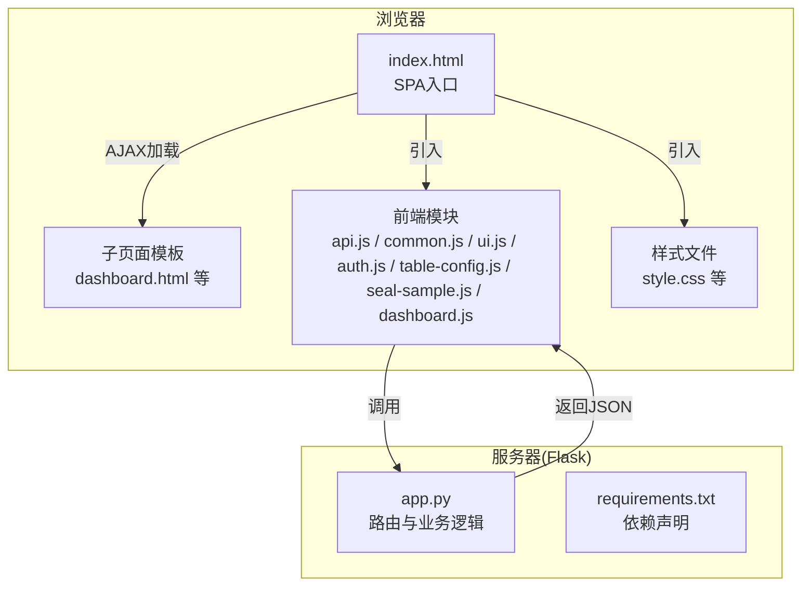
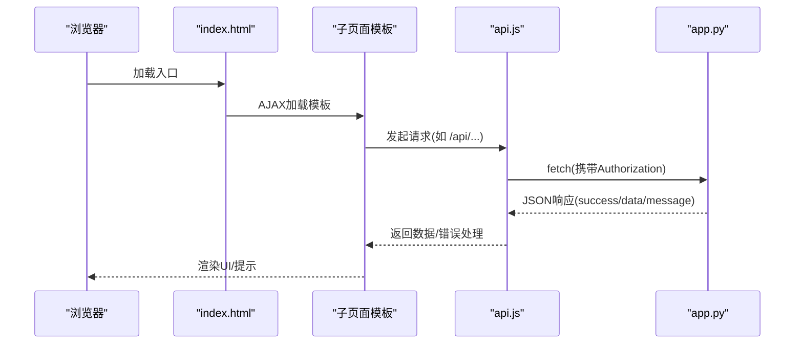
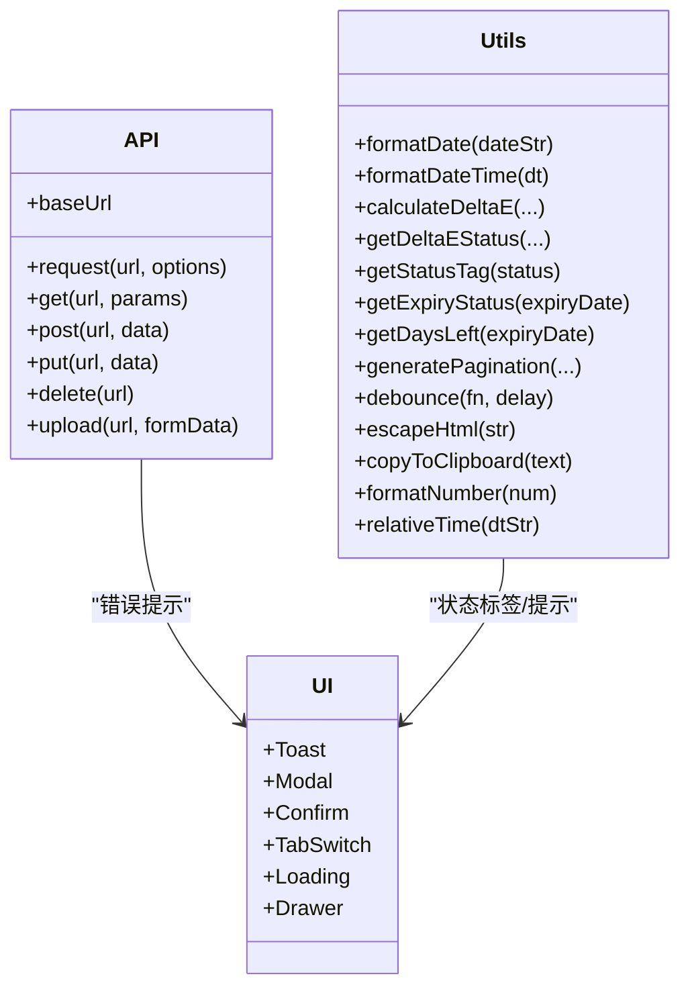
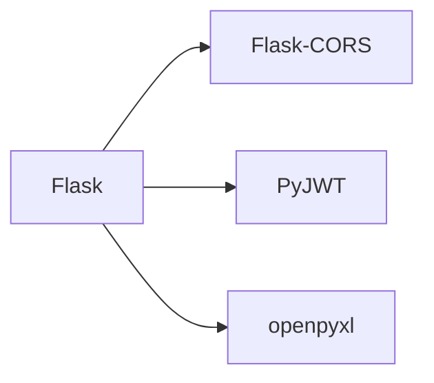

# 代码规范

<cite>
**本文引用的文件**
- [app.py](file://app.py)
- [requirements.txt](file://requirements.txt)
- [index.html](file://templates/index.html)
- [login.html](file://templates/login.html)
- [dashboard.html](file://templates/dashboard.html)
- [api.js](file://static/js/api.js)
- [common.js](file://static/js/common.js)
- [ui.js](file://static/js/ui.js)
- [auth.js](file://static/js/auth.js)
- [table-config.js](file://static/js/table-config.js)
- [seal-sample.js](file://static/js/seal-sample.js)
- [dashboard.js](file://static/js/dashboard.js)
- [style.css](file://static/css/style.css)
</cite>

## 目录
1. [简介](#简介)
2. [项目结构](#项目结构)
3. [核心组件](#核心组件)
4. [架构总览](#架构总览)
5. [详细组件分析](#详细组件分析)
6. [依赖分析](#依赖分析)
7. [性能考虑](#性能考虑)
8. [故障排查指南](#故障排查指南)
9. [结论](#结论)
10. [附录](#附录)

## 简介
本文件为“封样件及色板接收登记管理系统”的代码规范文档，覆盖后端Python Flask工程与前端JavaScript/HTML/CSS的编码规范、命名约定、模块化组织、API设计原则、样式与模板组织、注释与文档字符串标准、格式化工具配置、代码审查清单与质量门禁、以及IDE配置与格式化工具使用指南。旨在提升团队协作效率、保证代码一致性与可维护性。

## 项目结构
项目采用前后端分离的单页应用（SPA）架构：
- 后端：Flask应用，提供RESTful API与模板渲染；静态资源与模板位于同级目录。
- 前端：以index.html为主入口，通过AJAX动态加载各子页面模板；JS模块化组织，CSS全局样式与组件样式分离。

图表来源
- [index.html:114-185](file://templates/index.html#L114-L185)
- [app.py:2159-2177](file://app.py#L2159-L2177)

章节来源
- [index.html:114-185](file://templates/index.html#L114-L185)
- [app.py:2159-2177](file://app.py#L2159-L2177)

## 核心组件
- 后端Flask应用与路由
  - 认证与权限：token_required、admin_required装饰器；登录/注册/改密/心跳/登出。
  - 业务API：封样件、色板、寄出、有效期、评定、报废、处置记录、仪表盘统计与预警。
  - 管理员功能：用户管理、邀请码管理、系统设置、表格配置持久化。
  - 模板路由：SPA子页面模板服务。
- 前端模块
  - API封装：统一fetch请求、JWT拦截、401自动跳转。
  - 工具与UI：日期格式化、ΔE计算、状态标签、分页、Toast/Modal/Confirm/Drawer等。
  - 表格配置：筛选面板、列设置、动态表头与单元格渲染。
  - 页面脚本：仪表盘、封样件台账等页面逻辑。
- 样式与模板
  - style.css：CSS变量、布局、组件样式、响应式与打印样式。
  - 模板：index.html（SPA入口）、login.html、dashboard.html等。

章节来源
- [app.py:49-84](file://app.py#L49-L84)
- [app.py:454-589](file://app.py#L454-L589)
- [app.py:593-795](file://app.py#L593-L795)
- [app.py:800-1041](file://app.py#L800-L1041)
- [app.py:1212-1355](file://app.py#L1212-L1355)
- [app.py:1424-1578](file://app.py#L1424-L1578)
- [app.py:1582-1626](file://app.py#L1582-L1626)
- [app.py:1630-1891](file://app.py#L1630-L1891)
- [app.py:2084-2155](file://app.py#L2084-L2155)
- [index.html:114-185](file://templates/index.html#L114-L185)
- [login.html:1-144](file://templates/login.html#L1-L144)
- [dashboard.html:1-34](file://templates/dashboard.html#L1-L34)
- [api.js:1-88](file://static/js/api.js#L1-L88)
- [common.js:1-135](file://static/js/common.js#L1-L135)
- [ui.js:1-224](file://static/js/ui.js#L1-L224)
- [table-config.js:1-552](file://static/js/table-config.js#L1-L552)
- [seal-sample.js:1-181](file://static/js/seal-sample.js#L1-L181)
- [dashboard.js:1-117](file://static/js/dashboard.js#L1-L117)
- [style.css:1-486](file://static/css/style.css#L1-L486)

## 架构总览
后端通过装饰器统一鉴权与权限校验，前端通过API模块集中处理HTTP请求与错误处理，页面脚本负责业务交互与数据渲染，样式文件提供一致的视觉与交互体验。

图表来源
- [index.html:158-184](file://templates/index.html#L158-L184)
- [api.js:7-42](file://static/js/api.js#L7-L42)
- [app.py:454-589](file://app.py#L454-L589)

## 详细组件分析

### 后端：Flask路由与装饰器
- 认证装饰器
  - token_required：支持Header与Query两种方式传递token；解码后校验用户是否存在、是否启用；更新最后活跃时间。
  - admin_required：校验管理员权限。
- 数据库初始化
  - init_db：创建10张表、预置admin用户、预置ΔE阈值设置、兼容旧版本字段。
- 工具函数
  - get_expiry_status：基于有效期与提醒天数计算状态。
  - calculate_delta_e：CIE76 ΔE计算。
  - paginate/apply_dynamic_filters：分页与动态筛选。
- API设计原则
  - 统一返回结构：{"success": bool, "data": any, "message": string, "code": string}（部分场景）。
  - REST命名：名词复数形式，路径参数使用资源标识符，查询参数用于过滤与分页。
  - 权限控制：敏感接口使用装饰器保护，管理员接口使用admin_required。
  - 错误处理：明确的状态码与消息，异常捕获与日志记录。

章节来源
- [app.py:49-84](file://app.py#L49-L84)
- [app.py:88-336](file://app.py#L88-L336)
- [app.py:343-396](file://app.py#L343-L396)
- [app.py:454-589](file://app.py#L454-L589)
- [app.py:593-795](file://app.py#L593-L795)
- [app.py:800-1041](file://app.py#L800-L1041)
- [app.py:1212-1355](file://app.py#L1212-L1355)
- [app.py:1424-1578](file://app.py#L1424-L1578)
- [app.py:1582-1626](file://app.py#L1582-L1626)
- [app.py:1630-1891](file://app.py#L1630-L1891)
- [app.py:2084-2155](file://app.py#L2084-L2155)

### 前端：API封装与通用工具
- API封装（api.js）
  - 统一baseUrl与Content-Type。
  - 自动附加Authorization头（localStorage中的token）。
  - 401自动跳转登录并清理本地状态。
  - GET/POST/PUT/DELETE与文件上传封装。
- 通用工具（common.js）
  - 日期格式化、时间戳格式化、ΔE计算、状态标签映射、到期状态与剩余天数计算。
  - 分页HTML生成、防抖、HTML转义、剪贴板复制、数字格式化、相对时间。
- UI组件（ui.js）
  - Toast、Modal、Confirm、TabSwitch、Loading、Drawer。
- 表格配置（table-config.js）
  - 页面字段定义、默认列与可选列、筛选面板构建、列设置弹窗、动态表头与单元格渲染、回调注册。
- 页面脚本
  - 仪表盘（dashboard.js）：统计卡片、预警列表、动画数字。
  - 封样件台账（seal-sample.js）：动态筛选、列配置、导入导出、CRUD。
  - 登录注册（auth.js）：Tab切换、密码显示/隐藏、登录/注册/强制改密。
- 模板组织
  - index.html：SPA入口，动态加载子页面模板，导航高亮与面包屑更新，心跳与用户面板。
  - login.html：登录/注册表单与Tab切换。
  - dashboard.html：仪表盘页面骨架与脚本加载。

图表来源
- [api.js:1-88](file://static/js/api.js#L1-L88)
- [common.js:1-135](file://static/js/common.js#L1-L135)
- [ui.js:1-224](file://static/js/ui.js#L1-L224)

章节来源
- [api.js:1-88](file://static/js/api.js#L1-L88)
- [common.js:1-135](file://static/js/common.js#L1-L135)
- [ui.js:1-224](file://static/js/ui.js#L1-L224)
- [table-config.js:1-552](file://static/js/table-config.js#L1-L552)
- [seal-sample.js:1-181](file://static/js/seal-sample.js#L1-L181)
- [dashboard.js:1-117](file://static/js/dashboard.js#L1-L117)
- [index.html:114-185](file://templates/index.html#L114-L185)
- [login.html:1-144](file://templates/login.html#L1-L144)
- [dashboard.html:1-34](file://templates/dashboard.html#L1-L34)

### 前端：CSS样式编写规范
- CSS变量主题：统一颜色、阴影、圆角、过渡、侧边栏宽度等变量。
- Reset与基础排版：统一内外边距、字体、链接、图片。
- 组件化样式：Button、Form、Card、Tag、Pagination、Table、空状态、动画。
- 布局：固定侧边栏布局、顶栏、主内容区、面包屑。
- 打印样式：隐藏非必要元素。
- 响应式与滚动条美化。

章节来源
- [style.css:1-486](file://static/css/style.css#L1-L486)

### 前端：HTML模板组织标准
- index.html：SPA入口，包含侧边栏导航、顶栏、页面容器、动态加载子页面模板、用户面板与心跳。
- login.html：登录/注册双Tab、表单字段、密码显示/隐藏、提交处理。
- dashboard.html：仪表盘页面骨架，加载dashboard.js。

章节来源
- [index.html:1-239](file://templates/index.html#L1-L239)
- [login.html:1-144](file://templates/login.html#L1-L144)
- [dashboard.html:1-34](file://templates/dashboard.html#L1-L34)

## 依赖分析
- 后端依赖：Flask、Flask-CORS、PyJWT、openpyxl。
- 前端依赖：通过静态资源引入，无需包管理器。

图表来源
- [requirements.txt:1-5](file://requirements.txt#L1-L5)

章节来源
- [requirements.txt:1-5](file://requirements.txt#L1-L5)

## 性能考虑
- 前端
  - 防抖（debounce）用于搜索与筛选，减少请求频率。
  - 分页与客户端分页结合，避免一次性传输大量数据。
  - 动画与DOM操作最小化，使用requestAnimationFrame优化动画。
- 后端
  - 分页函数paginate，支持pageSize<=0时全量返回。
  - 动态筛选apply_dynamic_filters，使用参数化查询防止SQL注入。
  - 有效期状态计算与ΔE补算在导入时批量处理，避免重复计算。
- I/O与并发
  - API封装统一处理401与网络错误，避免阻塞主线程。
  - SPA按需加载脚本，减少初始包体。

章节来源
- [common.js:90-129](file://static/js/common.js#L90-L129)
- [table-config.js:379-401](file://static/js/table-config.js#L379-L401)
- [app.py:377-396](file://app.py#L377-L396)
- [app.py:403-449](file://app.py#L403-L449)
- [app.py:1010-1035](file://app.py#L1010-L1035)

## 故障排查指南
- 登录/鉴权问题
  - 检查Authorization头是否正确携带，确认token未过期。
  - 401时前端会自动清理localStorage并跳转登录。
- 数据导入失败
  - 检查Excel列顺序与字段映射，确认状态字段转换。
  - 查看后端错误消息与跳过行数提示。
- 表格筛选/列设置异常
  - 检查localStorage缓存与后端配置同步情况。
  - 确认筛选字段与操作符映射。
- 有效期与ΔE计算
  - 确认有效期格式与提醒天数设置。
  - 色板ΔE为空时自动补算。

章节来源
- [api.js:20-33](file://static/js/api.js#L20-L33)
- [app.py:720-795](file://app.py#L720-L795)
- [table-config.js:165-226](file://static/js/table-config.js#L165-L226)
- [app.py:1010-1035](file://app.py#L1010-L1035)

## 结论
本规范明确了后端Flask与前端JavaScript/HTML/CSS的编码风格、模块化组织、API设计原则与样式组织标准，配合统一的注释与文档字符串、格式化工具配置与代码审查清单，有助于提升系统的可维护性与扩展性。建议在团队内推广并严格执行。

## 附录

### Python后端代码风格规范（PEP8与项目实践）
- 命名约定
  - 函数与变量：小驼峰或下划线分隔（如token_required、get_db、apply_dynamic_filters）。
  - 类：大驼峰（如Flask应用实例app）。
  - 常量：全大写+下划线（如SECRET_KEY、JWT_EXPIRATION_HOURS）。
- 函数定义与组织
  - 装饰器置于函数上方，清晰标注作用域（如token_required、admin_required）。
  - 工具函数独立放置，便于复用与测试。
- 文档字符串
  - 模块顶部提供简要说明（如项目用途、技术栈）。
  - 关键函数/类提供docstring，说明用途、参数、返回值与异常。
- 代码组织
  - 按功能分组（认证、业务API、管理、模板路由），组内按功能排序。
  - 避免过长函数，拆分为更小的工具函数。
- 错误处理
  - 统一返回结构，明确错误码与消息。
  - 捕获异常并记录日志，避免泄露敏感信息。

章节来源
- [app.py:1-27](file://app.py#L1-L27)
- [app.py:49-84](file://app.py#L49-L84)
- [app.py:88-336](file://app.py#L88-L336)
- [app.py:343-396](file://app.py#L343-L396)

### JavaScript前端编码标准（ES6+）
- 语法规范
  - 使用const/let声明变量，避免var。
  - 箭头函数用于回调与简短逻辑。
  - 模板字符串用于拼接。
- 变量命名
  - 小驼峰：如currentPageHandler、tableConfig。
  - 常量：全大写+下划线：如PAGE_DEFS、TABLE_CONFIG。
- 函数组织
  - 工具函数（Utils）与UI组件（UI）独立模块化。
  - 页面脚本（如seal-sample.js、dashboard.js）职责单一。
- 模块化开发
  - 通过IIFE或模块化封装避免全局污染。
  - 通过window全局暴露必要的入口（如API、Utils、UI）。

章节来源
- [common.js:1-135](file://static/js/common.js#L1-L135)
- [ui.js:1-224](file://static/js/ui.js#L1-L224)
- [table-config.js:1-552](file://static/js/table-config.js#L1-L552)
- [seal-sample.js:1-181](file://static/js/seal-sample.js#L1-L181)
- [dashboard.js:1-117](file://static/js/dashboard.js#L1-L117)

### Flask路由设计原则与REST命名规范
- 资源命名
  - 使用名词复数：/api/seal-samples、/api/color-samples、/api/send-records、/api/disposal-records。
- 方法映射
  - GET：列表与详情；POST：创建；PUT：更新；DELETE：删除。
- 查询参数
  - page/pageSize：分页；f_field_i/f_op_i/f_val_i：动态筛选；includeDeleted：包含回收站。
- 权限控制
  - 管理员接口使用@admin_required装饰器。
- 返回结构
  - 统一{"success": bool, "data": any, "message": string}。

章节来源
- [app.py:593-795](file://app.py#L593-L795)
- [app.py:800-1041](file://app.py#L800-L1041)
- [app.py:1045-1156](file://app.py#L1045-L1156)
- [app.py:1630-1891](file://app.py#L1630-L1891)
- [app.py:1582-1626](file://app.py#L1582-L1626)

### CSS样式编写规范
- 变量与主题
  - 使用CSS变量统一颜色、阴影、圆角、过渡、侧边栏宽度。
- 组件化
  - Button、Form、Card、Tag、Pagination、Table、空状态、动画。
- 布局
  - 固定侧边栏布局、顶栏、主内容区、面包屑。
- 响应式与可访问性
  - 语义化标签、可读性与对比度。
- 打印样式
  - 隐藏非必要元素，保留关键信息。

章节来源
- [style.css:1-486](file://static/css/style.css#L1-L486)

### HTML模板组织标准
- 入口模板
  - index.html：SPA入口，动态加载子页面模板，导航高亮与面包屑更新。
- 登录模板
  - login.html：登录/注册双Tab、表单字段、密码显示/隐藏。
- 页面模板
  - dashboard.html：仪表盘页面骨架，加载对应脚本。

章节来源
- [index.html:1-239](file://templates/index.html#L1-L239)
- [login.html:1-144](file://templates/login.html#L1-L144)
- [dashboard.html:1-34](file://templates/dashboard.html#L1-L34)

### 注释与文档字符串标准
- Python
  - 模块顶部提供项目说明与技术栈。
  - 关键函数/类提供docstring，说明用途、参数、返回值与异常。
- JavaScript
  - 模块顶部注释说明用途与职责。
  - 复杂逻辑函数提供简要注释说明输入输出与边界条件。

章节来源
- [app.py:1-27](file://app.py#L1-L27)
- [common.js:1-135](file://static/js/common.js#L1-L135)
- [ui.js:1-224](file://static/js/ui.js#L1-L224)

### 代码格式化工具配置与IDE推荐
- Python
  - 格式化：black（或autopep8）。
  - Lint：flake8或pylint。
  - IDE：VS Code（Python扩展、Black Formatter、flake8插件）。
- JavaScript
  - 格式化：prettier。
  - Lint：eslint（推荐airbnb或standard规则）。
  - IDE：VS Code（ESLint、Prettier插件）。
- CSS
  - 格式化：prettier或stylelint。
  - Lint：stylelint。
- Git钩子
  - 使用husky + lint-staged在提交前自动格式化与Lint。

[本节为通用指导，不直接分析具体文件，故无章节来源]

### 代码审查检查清单
- 后端
  - 路由命名与REST一致性、权限装饰器使用、异常处理与日志记录、SQL注入防护、分页与筛选健壮性。
- 前端
  - API封装一致性、401处理、错误提示、防抖与性能优化、DOM操作最小化、样式变量统一。
- 通用
  - 文档字符串与注释完整性、命名一致性、模块职责单一、测试覆盖与回归验证。

[本节为通用指导，不直接分析具体文件，故无章节来源]