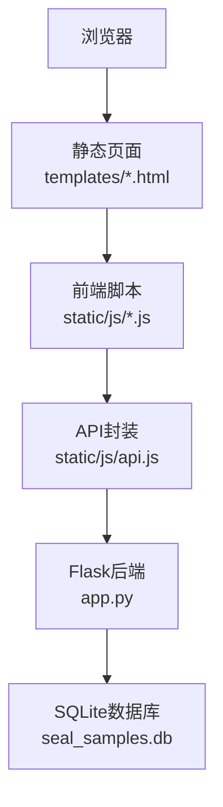
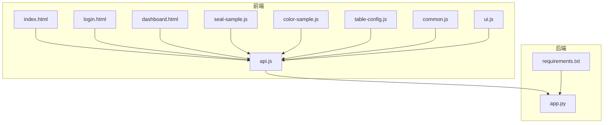
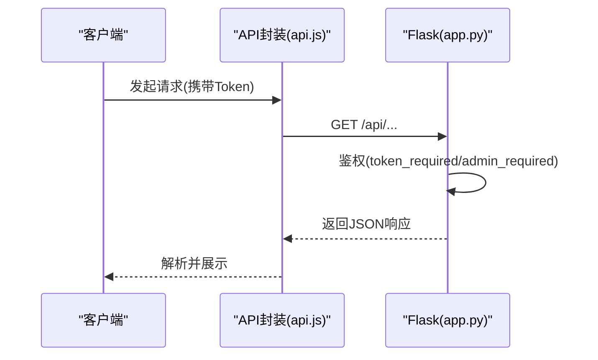
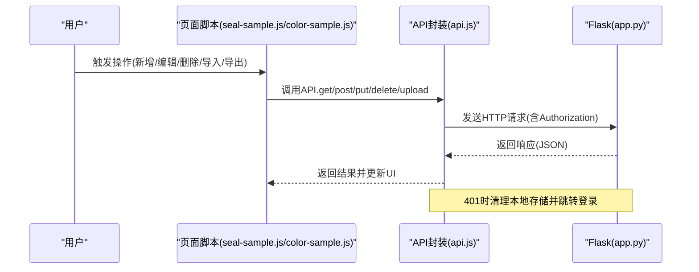
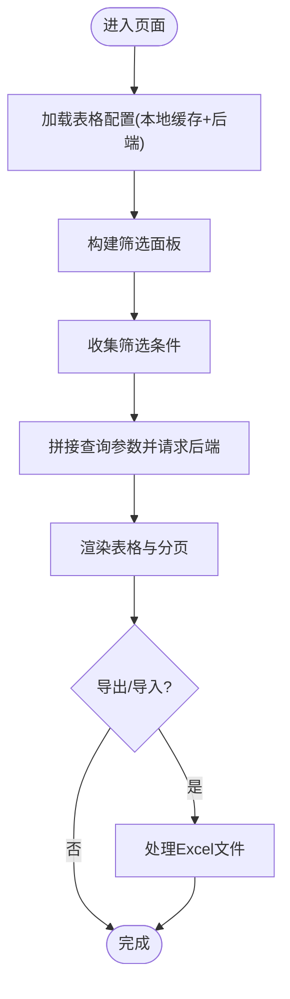
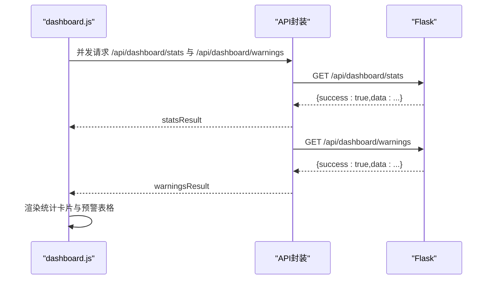
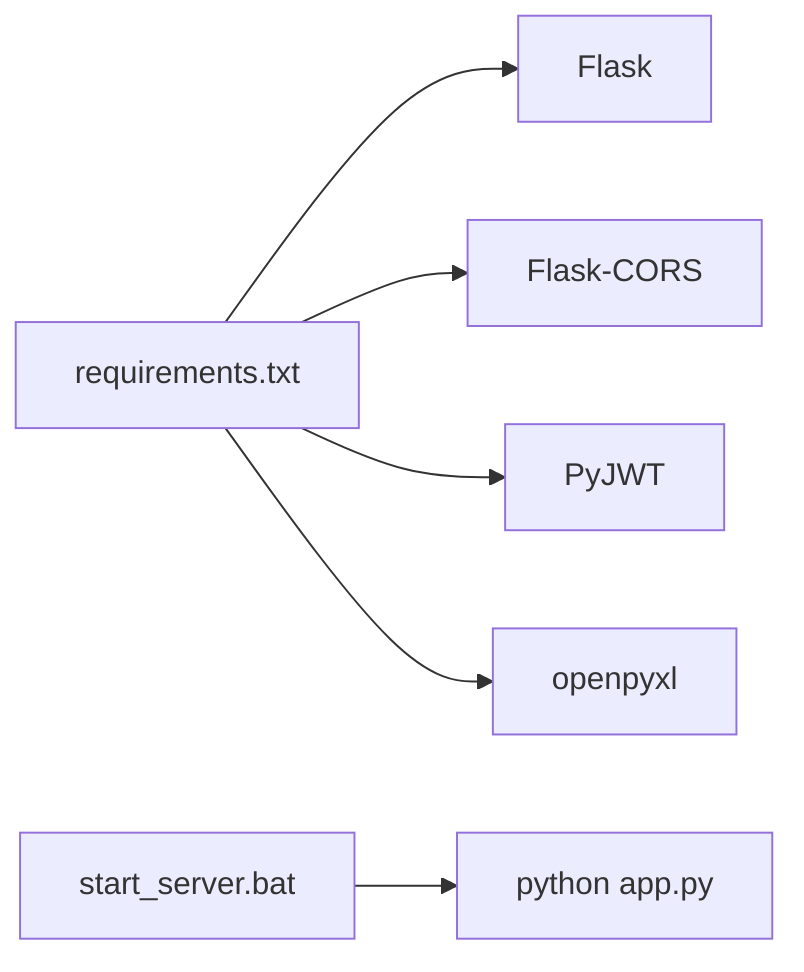

# 开发指南

<cite>
**本文引用的文件**
- [app.py](file://app.py)
- [requirements.txt](file://requirements.txt)
- [start_server.bat](file://start_server.bat)
- [index.html](file://templates/index.html)
- [login.html](file://templates/login.html)
- [dashboard.html](file://templates/dashboard.html)
- [api.js](file://static/js/api.js)
- [common.js](file://static/js/common.js)
- [ui.js](file://static/js/ui.js)
- [table-config.js](file://static/js/table-config.js)
- [dashboard.js](file://static/js/dashboard.js)
- [seal-sample.js](file://static/js/seal-sample.js)
- [color-sample.js](file://static/js/color-sample.js)
</cite>

## 目录
1. [简介](#简介)
2. [项目结构](#项目结构)
3. [核心组件](#核心组件)
4. [架构总览](#架构总览)
5. [详细组件分析](#详细组件分析)
6. [依赖分析](#依赖分析)
7. [性能考虑](#性能考虑)
8. [故障排查指南](#故障排查指南)
9. [结论](#结论)
10. [附录](#附录)

## 简介
本指南面向“封样件及色板接收登记管理系统”的开发者，覆盖代码规范与编程约定、开发流程与版本控制策略、测试与质量保证、调试与工具使用、重构与性能优化、功能扩展与模块化开发、开发环境搭建与工具配置、注释与文档规范、CI/CD 配置以及新功能开发模板与参考实现。系统采用前后端分离架构：后端基于 Flask（Python），前端为纯静态 HTML/CSS/JS，通过 JWT 实现鉴权，SQLite 作为本地存储。

## 项目结构
- 后端入口与路由：app.py
- 前端模板：templates/*.html
- 前端脚本：static/js/*.js
- 前端样式：static/css/*.css
- 依赖声明：requirements.txt
- 启动脚本：start_server.bat

图表来源
- [index.html](file://templates/index.html)
- [api.js](file://static/js/api.js)
- [app.py](file://app.py)

章节来源
- [index.html](file://templates/index.html)
- [login.html](file://templates/login.html)
- [dashboard.html](file://templates/dashboard.html)
- [api.js](file://static/js/api.js)
- [app.py](file://app.py)

## 核心组件
- 认证与鉴权：JWT Token 校验、管理员权限校验、心跳与在线状态维护
- 数据模型：用户、封样件、色板、寄出、有效期管理、评定记录、报废记录、系统设置、用户表格配置
- 前端框架：统一 API 封装、公共工具、UI 组件、表格配置与筛选、页面级业务逻辑
- 导入导出：Excel 导入导出（openpyxl）

章节来源
- [app.py](file://app.py)
- [api.js](file://static/js/api.js)
- [common.js](file://static/js/common.js)
- [ui.js](file://static/js/ui.js)
- [table-config.js](file://static/js/table-config.js)
- [seal-sample.js](file://static/js/seal-sample.js)
- [color-sample.js](file://static/js/color-sample.js)

## 架构总览
系统采用前后端分离设计：
- 前端负责页面渲染与交互，通过 API 模块统一访问后端接口
- 后端提供 REST 风格接口，使用装饰器进行鉴权与权限控制
- 数据持久化使用 SQLite，支持 Excel 导入导出

图表来源
- [index.html](file://templates/index.html)
- [login.html](file://templates/login.html)
- [dashboard.html](file://templates/dashboard.html)
- [api.js](file://static/js/api.js)
- [common.js](file://static/js/common.js)
- [ui.js](file://static/js/ui.js)
- [table-config.js](file://static/js/table-config.js)
- [seal-sample.js](file://static/js/seal-sample.js)
- [color-sample.js](file://static/js/color-sample.js)
- [app.py](file://app.py)
- [requirements.txt](file://requirements.txt)

## 详细组件分析

### 后端：Flask 应用与路由
- 应用初始化：CORS、密钥、数据库路径、JWT 过期时间
- 数据库初始化：10 张核心表（用户、封样件、色板、寄出、有效期管理、评定记录、报废记录、系统设置、用户表格配置），并预置 admin 用户与 ΔE 阈值设置
- 认证装饰器：token_required、admin_required；支持 Header 与 Query 两种 Token 传递方式
- 工具函数：时间转换、有效期状态判断、分页、动态筛选 SQL 拼接、邀请码生成等
- 主要接口：
  - 认证模块：登录、注册、改密、心跳、登出
  - 封样件：CRUD、导出、导入
  - 色板：CRUD、寄出、导出、导入
  - 仪表盘：统计、预警
  - 其他：有效期管理、评定记录、报废记录、系统设置、表格配置等

图表来源
- [api.js](file://static/js/api.js)
- [app.py](file://app.py)

章节来源
- [app.py](file://app.py)

### 前端：API 封装与鉴权拦截
- API 类：统一请求、自动附加 Authorization、401 自动跳转登录、上传支持
- 令牌管理：localStorage 存储 token 与用户信息，心跳保持在线状态
- 错误处理：网络异常提示、401 账户停用处理

图表来源
- [api.js](file://static/js/api.js)
- [app.py](file://app.py)
- [seal-sample.js](file://static/js/seal-sample.js)
- [color-sample.js](file://static/js/color-sample.js)

章节来源
- [api.js](file://static/js/api.js)
- [index.html](file://templates/index.html)

### 前端：表格配置与筛选
- 表格配置模块：统一字段定义、列设置、筛选面板、动态表头渲染、单元格渲染器
- 页面级脚本：封样件、色板等页面复用表格配置能力，支持导出/导入、分页、动态筛选

图表来源
- [table-config.js](file://static/js/table-config.js)
- [seal-sample.js](file://static/js/seal-sample.js)
- [color-sample.js](file://static/js/color-sample.js)

章节来源
- [table-config.js](file://static/js/table-config.js)
- [seal-sample.js](file://static/js/seal-sample.js)
- [color-sample.js](file://static/js/color-sample.js)

### 前端：仪表盘与通用工具
- 仪表盘：并发请求统计与预警，渲染统计卡片与时间线
- 通用工具：日期格式化、ΔE 计算与状态、有效期状态、分页、防抖、HTML 转义、剪贴板、相对时间等

图表来源
- [dashboard.js](file://static/js/dashboard.js)
- [api.js](file://static/js/api.js)
- [app.py](file://app.py)

章节来源
- [dashboard.js](file://static/js/dashboard.js)
- [common.js](file://static/js/common.js)

### 前端：UI 组件与交互
- UI 组件：Toast、Modal、Confirm、TabSwitch、Loading、Drawer
- 交互：登录/注册、密码修改、侧边栏导航、面包屑、时钟、心跳、用户操作菜单

章节来源
- [ui.js](file://static/js/ui.js)
- [index.html](file://templates/index.html)
- [login.html](file://templates/login.html)

## 依赖分析
- Python 依赖：Flask、Flask-CORS、PyJWT、openpyxl
- 启动脚本：自动安装依赖并启动服务

图表来源
- [requirements.txt](file://requirements.txt)
- [start_server.bat](file://start_server.bat)
- [app.py](file://app.py)

章节来源
- [requirements.txt](file://requirements.txt)
- [start_server.bat](file://start_server.bat)
- [app.py](file://app.py)

## 性能考虑
- 前端
  - 分页与虚拟滚动：表格分页避免一次性渲染大量数据
  - 防抖：搜索与筛选使用防抖降低请求频率
  - 并发请求：仪表盘统计与预警并行拉取
  - 本地缓存：表格配置与筛选条件缓存至 localStorage
- 后端
  - 分页查询：后端对查询结果进行分页
  - 动态筛选：安全拼接 SQL，限制字段白名单
  - 导入导出：批量写入与事务提交，失败回滚

[本节为通用指导，无需具体文件分析]

## 故障排查指南
- 登录失败/401
  - 检查 Token 是否存在与有效，确认后端 JWT 密钥与算法一致
  - 查看前端 API 封装对 401 的处理与跳转逻辑
- 账户被停用
  - 后端返回特定 code，前端提示并清理本地存储
- 导入失败
  - 检查 Excel 文件格式与列顺序，确认必填字段与日期格式
- 表格筛选无效
  - 确认筛选字段是否在白名单内，操作符与输入框匹配
- 有效期状态异常
  - 检查有效期计算逻辑与提醒天数配置

章节来源
- [api.js](file://static/js/api.js)
- [app.py](file://app.py)
- [table-config.js](file://static/js/table-config.js)

## 结论
本系统以清晰的前后端职责划分、统一的 API 封装与鉴权机制、可复用的表格配置与 UI 组件为基础，提供了完整的封样件与色板生命周期管理能力。遵循本文档的开发规范与最佳实践，可高效推进功能迭代与质量保障。

[本节为总结，无需具体文件分析]

## 附录

### 代码规范与编程约定
- Python（后端）
  - 命名：模块小写下划线，类名驼峰，函数与变量同模块
  - 注释：复杂逻辑与函数添加 docstring，异常处理明确
  - 安全：SQL 使用参数化，动态筛选字段白名单校验
  - 日志：关键异常记录日志
- JavaScript（前端）
  - 命名：模块小写连字符，函数与变量驼峰
  - 统一封装：API 请求集中处理，错误与 401 统一处理
  - 可维护性：UI 组件与表格配置模块化，页面脚本复用公共逻辑

[本节为通用规范，无需具体文件分析]

### 开发流程与版本控制策略
- 分支管理
  - main/master：稳定发布
  - develop：日常开发
  - feature/*：功能开发
  - hotfix/*：紧急修复
- 提交规范
  - 标准化提交信息（类型: 描述）
- 代码审查
  - PR 至 develop，至少一名 reviewer 通过
  - 关注安全性、可读性与性能

[本节为通用流程，无需具体文件分析]

### 测试策略与质量保证
- 单元测试
  - 后端：针对工具函数（有效期状态、ΔE 计算、分页、筛选）编写测试
  - 前端：针对工具函数（日期格式化、ΔE 状态、分页、防抖）编写测试
- 集成测试
  - 接口测试：登录、CRUD、导入导出、仪表盘接口
- 端到端测试
  - 页面级自动化：登录、新增、编辑、删除、筛选、导出导入、报表查看

[本节为通用策略，无需具体文件分析]

### 调试技巧与工具使用
- IDE 配置
  - Python：Flask 调试模式、断点、环境变量
  - JS：ESLint/Prettier、Source Map、断点调试
- 调试方法
  - 前端：Network 面板观察请求与响应，Console 查看错误
  - 后端：日志输出、Flask shell、SQLite 查询验证

[本节为通用技巧，无需具体文件分析]

### 重构与性能优化最佳实践
- 重构
  - 拆分大函数、消除重复代码、提升可测试性
  - 前端：抽取通用组件与工具函数，统一错误处理
- 性能
  - 前端：懒加载、分页、防抖、缓存
  - 后端：索引优化、批量写入、合理分页

[本节为通用实践，无需具体文件分析]

### 功能扩展与模块化开发
- 新增页面
  - 在 templates 新增页面模板，复制现有页面脚本结构
  - 在 table-config.js 中定义字段与渲染器
  - 在 api.js 中封装对应接口调用
- 新增接口
  - 在 app.py 中添加路由与视图函数，注意鉴权与权限
  - 前端页面脚本中调用 API 并渲染

[本节为通用方法，无需具体文件分析]

### 开发环境搭建与工具配置
- 安装依赖
  - 使用启动脚本一键安装并启动
- 本地运行
  - 访问 http://127.0.0.1:5000
- 前端开发
  - 直接修改 static/js 与 static/css，刷新页面生效

章节来源
- [start_server.bat](file://start_server.bat)
- [requirements.txt](file://requirements.txt)

### 代码注释与文档编写规范
- 函数/类注释：用途、参数、返回值、异常
- 复杂逻辑：逐行注释，必要时画流程图
- 文档：README、接口文档、变更日志

[本节为通用规范，无需具体文件分析]

### CI/CD 配置
- 构建
  - 安装依赖、运行测试、打包前端资源
- 部署
  - Docker 镜像或直接部署到服务器
- 发布
  - 自动化发布与回滚策略

[本节为通用配置，无需具体文件分析]

### 新功能开发模板与参考实现
- 模板步骤
  - 设计数据模型与表结构
  - 编写后端路由与视图函数
  - 前端页面与表格配置
  - API 封装与页面脚本
  - 单元/集成/端到端测试
- 参考实现
  - 封样件与色板页面脚本与表格配置模块

章节来源
- [seal-sample.js](file://static/js/seal-sample.js)
- [color-sample.js](file://static/js/color-sample.js)
- [table-config.js](file://static/js/table-config.js)
- [api.js](file://static/js/api.js)