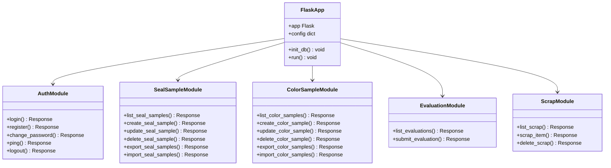
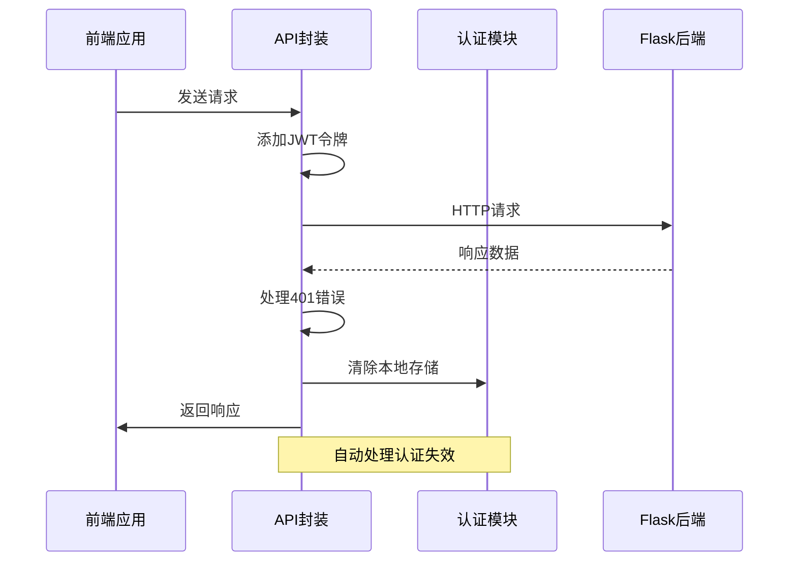
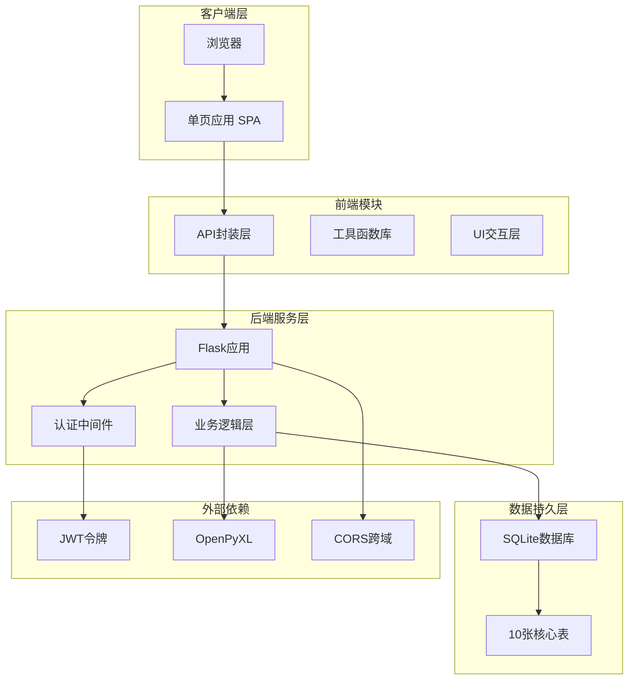
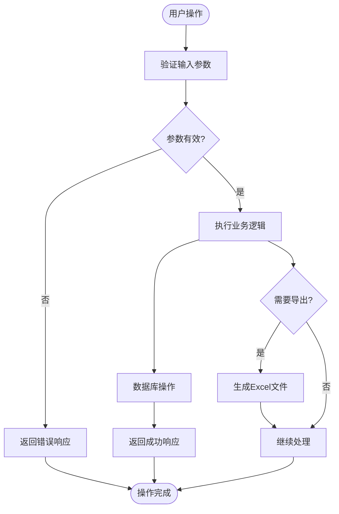
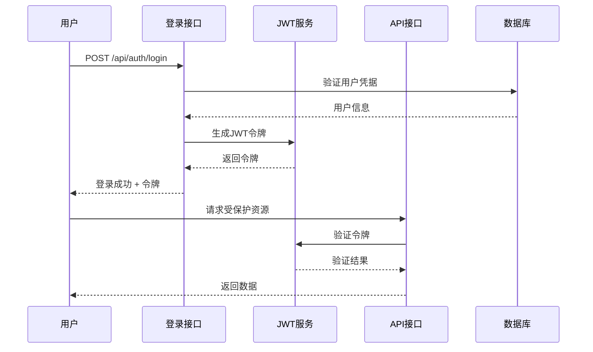
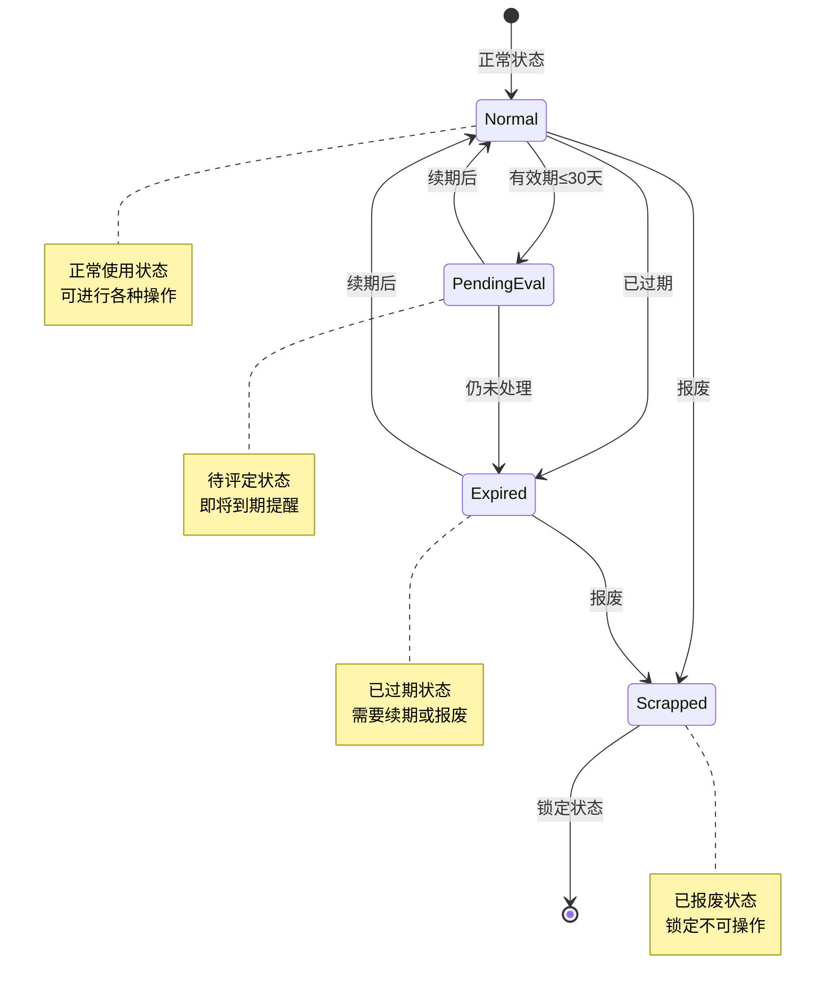
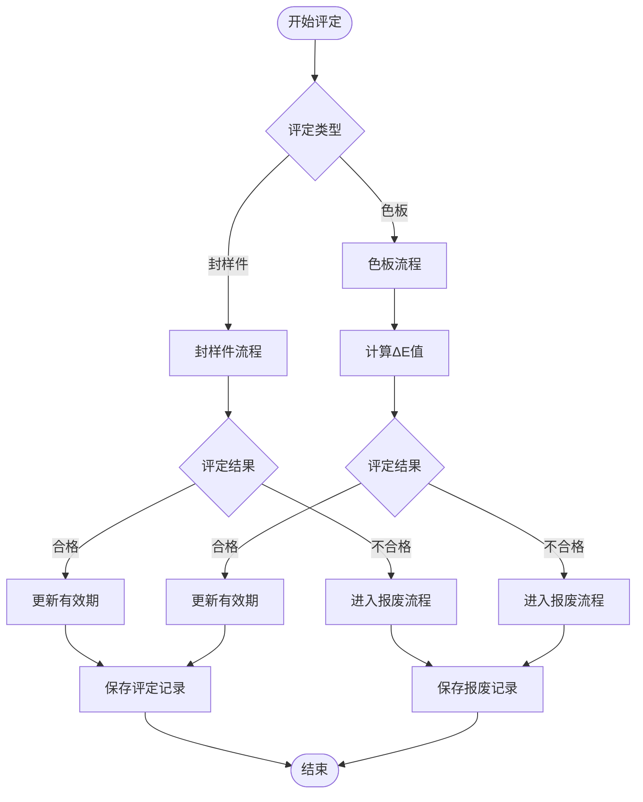
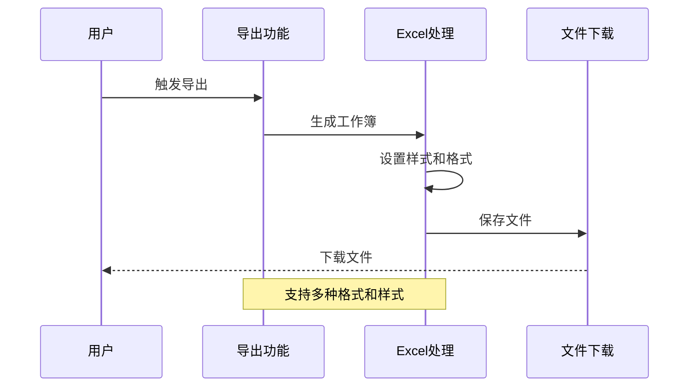
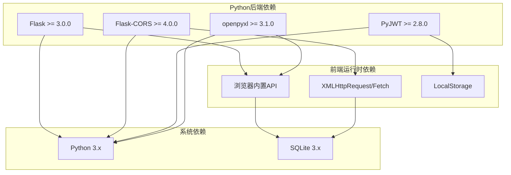

# 开发流程

<cite>
**本文档引用的文件**
- [app.py](file://app.py)
- [requirements.txt](file://requirements.txt)
- [start_server.bat](file://start_server.bat)
- [api.js](file://static/js/api.js)
- [common.js](file://static/js/common.js)
- [index.html](file://templates/index.html)
- [login.html](file://templates/login.html)
</cite>

## 目录
1. [项目概述](#项目概述)
2. [项目结构](#项目结构)
3. [核心组件](#核心组件)
4. [架构概览](#架构概览)
5. [详细组件分析](#详细组件分析)
6. [依赖关系分析](#依赖关系分析)
7. [性能考虑](#性能考虑)
8. [故障排除指南](#故障排除指南)
9. [结论](#结论)

## 项目概述

封样件及色板接收登记管理系统是一个基于Python Flask框架开发的企业级资产管理应用，专门用于管理封样件和色板的生命周期。该系统采用前后端分离架构，后端提供RESTful API接口，前端使用纯JavaScript实现单页应用(SPA)。

### 主要功能特性
- **双业务线管理**：支持封样件和色板两类资产的全生命周期管理
- **有效期管理**：智能有效期监控和预警机制
- **评定流程**：支持色差评估(CIE76 ΔE)和封样件质量评定
- **报表导出**：完整的Excel格式数据导出功能
- **权限控制**：基于JWT的用户认证和授权机制
- **数据安全**：软删除机制和审计追踪

## 项目结构

```mermaid
graph TB
subgraph "后端应用 (Python Flask)"
A[app.py - 主应用]
B[requirements.txt - 依赖管理]
C[init_db() - 数据库初始化]
end
subgraph "前端静态资源"
D[templates/ - HTML模板]
E[static/css/ - 样式文件]
F[static/js/ - JavaScript文件]
end
subgraph "前端JavaScript模块"
G[api.js - API封装]
H[common.js - 工具函数]
I[index.html - 主页面]
J[login.html - 登录页面]
end
subgraph "数据库"
K[SQLite - 数据存储]
L[10张核心表]
end
A --> K
G --> A
H --> G
I --> G
J --> G
D --> I
D --> J
```

**图表来源**
- [app.py:1-50](file://app.py#L1-L50)
- [requirements.txt:1-5](file://requirements.txt#L1-L5)
- [index.html:1-50](file://templates/index.html#L1-L50)

### 文件组织结构

项目采用清晰的分层组织结构：

**后端核心**
- `app.py`: Flask主应用，包含所有API端点和业务逻辑
- `requirements.txt`: Python依赖包管理
- `start_server.bat`: Windows服务器启动脚本

**前端资源**
- `templates/`: HTML模板文件，支持AJAX动态加载
- `static/css/`: 样式文件，包含组件样式和页面样式
- `static/js/`: JavaScript模块，实现前端功能

**核心表结构**
系统包含10个核心数据表，涵盖用户管理、资产管理、业务流程和系统配置等各个方面。

**Section sources**
- [app.py:88-335](file://app.py#L88-L335)
- [requirements.txt:1-5](file://requirements.txt#L1-L5)
- [start_server.bat:1-17](file://start_server.bat#L1-L17)

## 核心组件

### 后端核心组件

#### Flask应用架构
应用采用模块化设计，将不同功能域的API端点组织在独立的代码块中：



**图表来源**
- [app.py:454-589](file://app.py#L454-L589)
- [app.py:593-795](file://app.py#L593-L795)
- [app.py:799-1041](file://app.py#L799-L1041)
- [app.py:1212-1328](file://app.py#L1212-L1328)
- [app.py:1291-1422](file://app.py#L1291-L1422)

#### 数据库设计
系统采用SQLite作为数据存储，设计了10张核心表来支持完整的业务流程：

**用户管理表 (users)**
- 用户基本信息和权限控制
- 支持管理员和普通用户角色
- 在线状态跟踪功能

**资产管理表**
- **seal_samples**: 封样件台账
- **seal_color_samples**: 色板台账
- **seal_send_records**: 寄出台账
- **seal_expiry_management**: 有效期管理

**业务流程表**
- **seal_evaluation_records**: 评定记录
- **seal_scrapped_samples**: 报废记录

**系统配置表**
- **seal_system_settings**: 系统设置
- **seal_user_table_configs**: 用户表格配置

**Section sources**
- [app.py:88-335](file://app.py#L88-L335)
- [app.py:339-402](file://app.py#L339-L402)

### 前端核心组件

#### API封装层
前端采用统一的API封装，提供完整的HTTP请求处理能力：



**图表来源**
- [api.js:7-42](file://static/js/api.js#L7-L42)

#### 前端模块化架构
前端采用模块化设计，每个功能页面都是独立的JavaScript模块：

**核心模块**
- `api.js`: HTTP请求封装和JWT处理
- `common.js`: 通用工具函数和数据格式化
- `ui.js`: 用户界面交互逻辑
- `auth.js`: 用户认证功能

**页面模块**
- `dashboard.js`: 仪表盘功能
- `seal-sample.js`: 封样件管理
- `color-sample.js`: 色板管理
- `send-record.js`: 寄出管理
- `disposal-records.js`: 处置记录

**Section sources**
- [api.js:1-88](file://static/js/api.js#L1-L88)
- [common.js:1-135](file://static/js/common.js#L1-L135)
- [index.html:110-114](file://templates/index.html#L110-L114)

## 架构概览

### 整体架构设计



**图表来源**
- [app.py:21-26](file://app.py#L21-L26)
- [requirements.txt:1-5](file://requirements.txt#L1-L5)
- [api.js:4-88](file://static/js/api.js#L4-L88)

### 数据流架构

系统采用事件驱动的数据流模式，每个业务操作都遵循标准化的数据处理流程：



**图表来源**
- [app.py:454-589](file://app.py#L454-L589)
- [app.py:799-1041](file://app.py#L799-L1041)

**Section sources**
- [app.py:1-50](file://app.py#L1-L50)
- [requirements.txt:1-5](file://requirements.txt#L1-L5)

## 详细组件分析

### 认证与授权模块

#### JWT认证机制
系统采用JWT(JSON Web Token)实现无状态认证，支持多种令牌传递方式：



**图表来源**
- [app.py:454-494](file://app.py#L454-L494)
- [api.js:21-33](file://static/js/api.js#L21-L33)

#### 权限控制策略
系统实现了多层次的权限控制机制：

**基础权限**
- `token_required`: 所有受保护API的基础装饰器
- `admin_required`: 管理员专用功能的权限装饰器

**用户状态管理**
- 在线状态跟踪：每2分钟自动更新用户活跃状态
- 账户状态检查：实时验证用户是否被停用
- 强制密码修改：首次登录强制用户修改密码

**Section sources**
- [app.py:49-84](file://app.py#L49-L84)
- [app.py:454-589](file://app.py#L454-L589)
- [index.html:203-211](file://templates/index.html#L203-L211)

### 资产管理模块

#### 封样件管理
封样件管理是系统的核心功能之一，提供了完整的生命周期管理：



**图表来源**
- [app.py:350-371](file://app.py#L350-L371)
- [app.py:593-795](file://app.py#L593-L795)

#### 色板管理
色板管理功能更加复杂，支持详细的色彩数据和寄出流程：

**色彩数据处理**
- CIE76 ΔE色差计算算法
- 多维度色彩参数管理
- 自动ΔE值计算和状态更新

**寄出流程管理**
- 库存数量实时扣减
- 寄出记录完整追踪
- 库存恢复机制

**Section sources**
- [app.py:343-348](file://app.py#L343-L348)
- [app.py:799-1041](file://app.py#L799-L1041)
- [app.py:1043-1156](file://app.py#L1043-L1156)

### 业务流程模块

#### 评定流程
系统实现了标准化的业务评定流程，支持两种类型的评定：

**封样件评定**
- 基于有效期的续期管理
- 简化的评定流程
- 状态自动更新

**色板评定**
- CIE76 ΔE色差计算
- 详细的色彩参数对比
- 自动ΔE值计算



**图表来源**
- [app.py:1212-1287](file://app.py#L1212-L1287)
- [app.py:1289-1328](file://app.py#L1289-L1328)

#### 报废管理
系统提供了完善的报废管理机制，支持软删除和审计追踪：

**报废流程**
- 详细的原因和类型记录
- 旧状态保存用于恢复
- 关联数据的完整性处理

**软删除机制**
- 标记删除而非物理删除
- 支持恢复和永久删除
- 审计追踪完整保留

**Section sources**
- [app.py:1289-1422](file://app.py#L1289-L1422)
- [app.py:1895-2038](file://app.py#L1895-L2038)

### 数据导出与导入

#### Excel数据处理
系统提供了完整的Excel数据处理能力，支持双向数据交换：

**导出功能**
- 封样件台账导出
- 色板台账导出  
- 寄出台账导出
- 处置记录导出

**导入功能**
- 支持标准模板格式
- 数据验证和错误处理
- 批量数据处理



**图表来源**
- [app.py:692-795](file://app.py#L692-L795)
- [app.py:917-1041](file://app.py#L917-L1041)

**Section sources**
- [app.py:692-1041](file://app.py#L692-L1041)

## 依赖关系分析

### 技术栈依赖



**图表来源**
- [requirements.txt:1-5](file://requirements.txt#L1-L5)

### 模块间依赖关系

系统采用松耦合的设计，各模块间依赖关系清晰：

**核心依赖链**
- `app.py` -> 所有业务模块
- `api.js` -> `app.py` (通过RESTful API)
- `common.js` -> `api.js` (工具函数)
- `index.html` -> 所有页面模块

**数据访问层**
- 所有业务模块 -> `app.py` (数据库操作)
- `app.py` -> SQLite (数据存储)

**Section sources**
- [requirements.txt:1-5](file://requirements.txt#L1-L5)
- [app.py:29-40](file://app.py#L29-L40)

## 性能考虑

### 数据库优化
系统在数据库层面采用了多项优化策略：

**索引策略**
- 关键查询字段建立索引
- 复合查询条件优化
- 分页查询性能优化

**查询优化**
- 动态SQL构建防止SQL注入
- 分页处理避免全量查询
- 缓存常用查询结果

### 前端性能优化
前端应用采用了现代化的性能优化技术：

**资源加载优化**
- 按需加载JavaScript模块
- 模板文件异步加载
- 图片和静态资源缓存

**内存管理**
- 及时清理事件监听器
- 合理使用DOM操作
- 避免内存泄漏

### 网络性能
API层面对网络性能进行了专门优化：

**请求优化**
- 统一的错误处理机制
- 自动重试和降级策略
- 响应时间监控

**并发处理**
- 异步请求处理
- 并发限制和队列管理
- 超时和取消机制

## 故障排除指南

### 常见问题诊断

#### 认证相关问题
**问题症状**: 401未授权错误
**可能原因**:
- 令牌过期或无效
- 用户账户被停用
- 令牌传递方式错误

**解决方案**:
- 检查令牌有效期
- 验证用户账户状态
- 确认令牌传递格式

#### 数据库连接问题
**问题症状**: 数据库操作失败
**可能原因**:
- 数据库文件损坏
- 权限不足
- 连接池耗尽

**解决方案**:
- 检查数据库文件完整性
- 验证文件权限
- 重启数据库连接

#### 前端加载问题
**问题症状**: 页面无法加载或功能异常
**可能原因**:
- JavaScript文件加载失败
- API接口调用错误
- 浏览器兼容性问题

**解决方案**:
- 检查网络连接和文件路径
- 查看浏览器开发者工具
- 验证API响应格式

### 调试工具和技巧

**后端调试**
- 使用Flask的debug模式
- 查看服务器日志输出
- 使用数据库管理工具

**前端调试**
- 浏览器开发者工具
- 网络请求监控
- 控制台错误日志

**Section sources**
- [app.py:49-84](file://app.py#L49-L84)
- [api.js:35-42](file://static/js/api.js#L35-L42)

## 结论

封样件及色板接收登记管理系统是一个设计合理、功能完备的企业级应用。系统采用现代的技术栈和架构模式，具有以下优势：

**技术优势**
- 基于Python Flask的稳定后端架构
- 前后端分离的现代化前端设计
- 完善的JWT认证和权限控制
- 丰富的Excel数据处理能力

**业务价值**
- 支持双业务线的完整资产管理
- 智能的有效期管理和预警机制
- 标准化的业务流程和审计追踪
- 用户友好的界面和交互体验

**扩展性**
- 模块化设计便于功能扩展
- 清晰的API接口支持第三方集成
- 轻量级架构适合部署和维护

该系统为企业的封样件和色板管理提供了完整的数字化解决方案，能够有效提升管理效率和准确性。