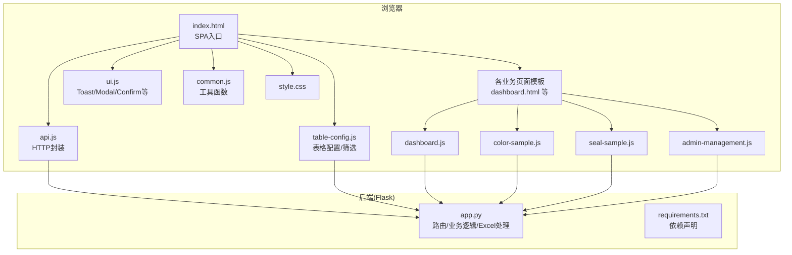
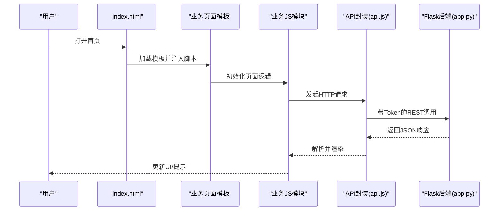
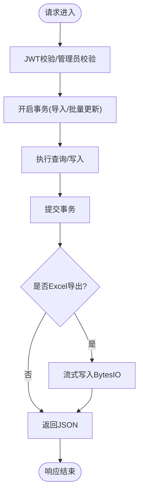
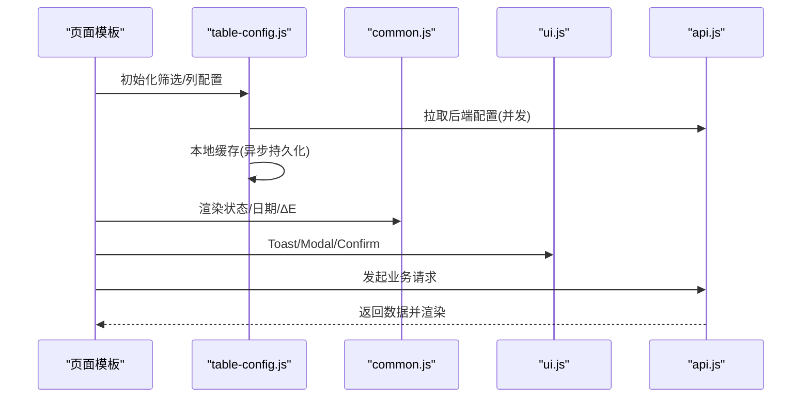
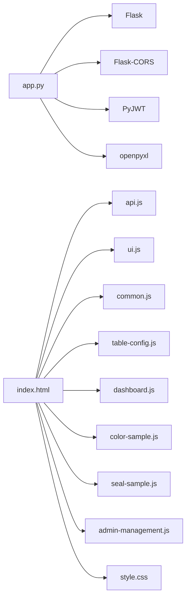

# 性能优化

<cite>
**本文引用的文件**
- [app.py](file://app.py)
- [requirements.txt](file://requirements.txt)
- [index.html](file://templates/index.html)
- [api.js](file://static/js/api.js)
- [common.js](file://static/js/common.js)
- [ui.js](file://static/js/ui.js)
- [table-config.js](file://static/js/table-config.js)
- [dashboard.js](file://static/js/dashboard.js)
- [color-sample.js](file://static/js/color-sample.js)
- [seal-sample.js](file://static/js/seal-sample.js)
- [admin-management.js](file://static/js/admin-management.js)
- [style.css](file://static/css/style.css)
</cite>

## 目录
1. [简介](#简介)
2. [项目结构](#项目结构)
3. [核心组件](#核心组件)
4. [架构总览](#架构总览)
5. [详细组件分析](#详细组件分析)
6. [依赖分析](#依赖分析)
7. [性能考量](#性能考量)
8. [故障排查指南](#故障排查指南)
9. [结论](#结论)
10. [附录](#附录)

## 简介
本文件面向“封样件及色板接收登记管理系统”的性能优化，覆盖后端（Flask + SQLite）、前端（SPA + 模块化 JS）、Excel 大数据量处理与内存管理、数据库索引与查询调优、静态资源与 CDN、性能监控与瓶颈分析、内存泄漏检测与修复、以及负载均衡与扩展性设计建议。目标是在现有技术栈基础上，系统性提升响应速度、吞吐能力与用户体验。

## 项目结构
- 后端采用 Flask + SQLite，提供 RESTful API；前端为 SPA，通过模板按需加载页面与脚本。
- 静态资源（CSS/JS）集中管理，页面通过模板动态注入脚本。
- Excel 导入导出基于 openpyxl，涉及大文件处理与内存占用。

图表来源
- [index.html:114-185](file://templates/index.html#L114-L185)
- [api.js:1-88](file://static/js/api.js#L1-L88)
- [ui.js:1-224](file://static/js/ui.js#L1-L224)
- [table-config.js:1-552](file://static/js/table-config.js#L1-L552)
- [dashboard.js:1-117](file://static/js/dashboard.js#L1-L117)
- [color-sample.js:1-267](file://static/js/color-sample.js#L1-L267)
- [seal-sample.js:1-181](file://static/js/seal-sample.js#L1-L181)
- [admin-management.js:1-153](file://static/js/admin-management.js#L1-L153)
- [style.css:1-200](file://static/css/style.css#L1-L200)
- [app.py:1-2197](file://app.py#L1-L2197)
- [requirements.txt:1-5](file://requirements.txt#L1-L5)

章节来源
- [index.html:114-185](file://templates/index.html#L114-L185)
- [app.py:1-2197](file://app.py#L1-L2197)

## 核心组件
- 后端服务
  - 认证与鉴权：JWT Token 校验、管理员校验、心跳刷新在线状态。
  - 数据访问：SQLite 连接池与上下文管理、事务提交、关闭连接。
  - 业务接口：封样件/色板/寄出/报废/处置记录/仪表盘等。
  - Excel 处理：openpyxl 导入导出，支持大数据量写入与内存控制。
- 前端服务
  - SPA 页面加载与脚本注入，按需加载业务脚本。
  - API 封装：统一请求、401 自动跳转、上传处理。
  - UI 组件：Toast、Modal、Confirm、Tab、Drawer、Loading。
  - 表格配置：筛选面板、列设置、动态表头、分页。
  - 通用工具：日期格式化、ΔE 计算、状态标签、分页动画、防抖、复制到剪贴板等。

章节来源
- [app.py:48-76](file://app.py#L48-L76)
- [app.py:29-39](file://app.py#L29-L39)
- [app.py:800-916](file://app.py#L800-L916)
- [app.py:953-1040](file://app.py#L953-L1040)
- [api.js:1-88](file://static/js/api.js#L1-L88)
- [ui.js:1-224](file://static/js/ui.js#L1-L224)
- [table-config.js:1-552](file://static/js/table-config.js#L1-L552)
- [common.js:1-135](file://static/js/common.js#L1-L135)

## 架构总览
系统采用前后端分离的单页应用（SPA）架构，后端提供 REST API，前端通过 fetch 与后端交互，并在页面模板中按需加载业务脚本。认证采用 JWT，支持心跳维持在线状态。

图表来源
- [index.html:158-181](file://templates/index.html#L158-L181)
- [api.js:7-42](file://static/js/api.js#L7-L42)
- [app.py:454-588](file://app.py#L454-L588)

## 详细组件分析

### 后端性能优化（Flask + SQLite）
- 连接与事务
  - 使用应用上下文 g.db 管理连接，确保请求结束时关闭，避免连接泄漏。
  - 批量写入（导入/更新）使用事务一次性提交，减少磁盘 IO。
- 查询优化
  - 分页：后端统一实现分页，避免一次性拉取全量数据。
  - 动态筛选：对传入字段进行白名单过滤与安全拼接，防止 SQL 注入。
  - 仪表盘与预警：对有效期计算采用服务端批量扫描，避免前端重复计算。
- Excel 大数据量处理
  - 导入：逐行读取，按需解析，异常捕获与错误累积，避免中断。
  - 导出：按模板列顺序写入，避免多余列；使用 BytesIO 流式输出。
- 并发与扩展
  - SQLite 适合中小规模并发；若并发上升，建议引入连接池、只读副本、读写分离或迁移至 PostgreSQL。
  - 使用进程级 Gunicorn + 多 worker，结合反向代理（Nginx）实现水平扩展。

图表来源
- [app.py:48-76](file://app.py#L48-L76)
- [app.py:29-39](file://app.py#L29-L39)
- [app.py:953-1040](file://app.py#L953-L1040)
- [app.py:1600-1625](file://app.py#L1600-L1625)

章节来源
- [app.py:29-39](file://app.py#L29-L39)
- [app.py:454-588](file://app.py#L454-L588)
- [app.py:800-916](file://app.py#L800-L916)
- [app.py:953-1040](file://app.py#L953-L1040)
- [app.py:1600-1625](file://app.py#L1600-L1625)

### 前端性能优化（SPA + 模块化 JS）
- 代码组织与懒加载
  - 模板按需加载业务脚本，避免一次性加载所有 JS。
  - 业务脚本独立模块化，按页面初始化，减少全局作用域污染。
- 请求与缓存
  - API 封装统一处理 401，自动清理本地状态并跳转登录。
  - 表格配置支持本地缓存 + 后端同步，降低重复请求。
- DOM 操作与渲染
  - 表格渲染采用模板字符串拼接，避免频繁 DOM 查询。
  - 分页组件使用 requestAnimationFrame 控制动画，保证流畅。
  - UI 组件（Toast/Modal）采用一次性容器复用，减少节点创建。
- 通用工具
  - 防抖（debounce）用于搜索输入，降低请求频率。
  - ΔE 计算与状态标签在前端计算，减少后端压力。

图表来源
- [table-config.js:165-221](file://static/js/table-config.js#L165-L221)
- [table-config.js:379-401](file://static/js/table-config.js#L379-L401)
- [common.js:25-40](file://static/js/common.js#L25-L40)
- [ui.js:19-61](file://static/js/ui.js#L19-L61)
- [api.js:7-42](file://static/js/api.js#L7-L42)

章节来源
- [index.html:158-181](file://templates/index.html#L158-L181)
- [table-config.js:165-221](file://static/js/table-config.js#L165-L221)
- [table-config.js:379-401](file://static/js/table-config.js#L379-L401)
- [common.js:25-40](file://static/js/common.js#L25-L40)
- [ui.js:19-61](file://static/js/ui.js#L19-L61)
- [api.js:7-42](file://static/js/api.js#L7-L42)

### Excel 大数据量处理与内存管理
- 导入
  - 逐行迭代，按需解析单元格值，异常捕获并累计错误，避免中断。
  - 对日期字段做截断与清洗，保证入库一致性。
- 导出
  - 按固定列顺序写入，避免多余列导致体积膨胀。
  - 使用 BytesIO 流式输出，减少内存峰值。
- 建议
  - 大文件建议分片处理或后台任务队列，避免阻塞请求线程。
  - 导入/导出增加进度反馈与超时控制。

章节来源
- [app.py:953-1040](file://app.py#L953-L1040)
- [app.py:720-795](file://app.py#L720-L795)

### 数据库索引优化与查询性能调优
- 现状
  - 使用 SQLite，表结构已包含常用字段与默认值；有效期相关字段用于状态计算。
- 建议
  - 为高频查询字段建立索引：如封样件/色板的“状态”、“有效期”、“创建时间/更新时间”等。
  - 对动态筛选字段（如客户、颜色名称、项目等）建立复合索引，减少全表扫描。
  - 将仪表盘/预警的扫描改为基于索引的范围查询，降低 CPU 开销。
  - 对 JOIN 查询（寄出记录）在关联字段上建立索引，提升连接效率。

章节来源
- [app.py:800-841](file://app.py#L800-L841)
- [app.py:1045-1108](file://app.py#L1045-L1108)
- [app.py:2084-2154](file://app.py#L2084-L2154)

### 静态资源优化与 CDN 配置
- 资源压缩与合并
  - CSS/JS 压缩与合并，启用 gzip/br 压缩。
- 缓存策略
  - 静态资源设置长缓存（版本化文件名），HTML 设置较短缓存或 no-cache。
- CDN
  - 将 CSS/JS/Favicon 置于 CDN，提升全球访问速度。
- 图标与字体
  - 使用矢量图标，避免图片资源；字体按需加载。

章节来源
- [style.css:1-200](file://static/css/style.css#L1-L200)
- [index.html:6-9](file://templates/index.html#L6-L9)

### 性能监控与瓶颈分析
- 后端指标
  - 请求耗时、错误率、并发连接数、数据库慢查询日志。
  - 使用 Prometheus + Grafana 监控；对关键接口（导入/导出/仪表盘）设置告警。
- 前端指标
  - FCP/LCP/CLS/TTI、首屏时间、交互延迟、错误上报。
  - 使用 Web Vitals + 自定义埋点，定位卡顿与异常。
- 分析方法
  - 使用火焰图/性能剖析工具定位热点函数与 DOM 操作。
  - 对高频筛选/分页/Excel 导入导出进行专项压测。

章节来源
- [index.html:203-210](file://templates/index.html#L203-L210)
- [api.js:14-42](file://static/js/api.js#L14-L42)

### 内存泄漏检测与修复
- 常见风险
  - 未清理的定时器/事件监听器、未释放的 DOM 引用、循环引用。
- 检测手段
  - 浏览器性能面板（Heap Snapshots/Allocation instrumentation）。
  - 代码审查：确保离开页面时移除事件监听、清理定时器、释放大对象。
- 修复建议
  - 页面切换时统一清理：移除事件、停止动画帧、清空定时器。
  - 对大数组/对象使用弱引用或分批处理，避免长时间驻留内存。

章节来源
- [ui.js:19-61](file://static/js/ui.js#L19-L61)
- [table-config.js:379-401](file://static/js/table-config.js#L379-L401)

### 负载均衡与扩展性设计
- 前端
  - 静态资源走 CDN；页面模板与脚本按需加载，降低首屏压力。
- 后端
  - 使用 Gunicorn + 多 worker；Nginx 反向代理 + 负载均衡。
  - 数据库：读写分离 + 只读副本；热点表分区或索引优化。
  - 任务卸载：导入/导出放入队列（如 Celery），异步处理并返回进度。
- 扩展策略
  - 垂直扩展：升级硬件；水平扩展：多实例 + CDN + 数据库集群。

章节来源
- [requirements.txt:1-5](file://requirements.txt#L1-L5)
- [index.html:158-181](file://templates/index.html#L158-L181)

## 依赖分析
- 后端依赖
  - Flask、Flask-CORS、PyJWT、openpyxl。
- 前端依赖
  - 通过模板引入，无独立包管理；建议引入打包工具（如 Vite/Webpack）统一管理与优化。

图表来源
- [requirements.txt:1-5](file://requirements.txt#L1-L5)
- [index.html:110-113](file://templates/index.html#L110-L113)
- [app.py:1-2197](file://app.py#L1-L2197)

章节来源
- [requirements.txt:1-5](file://requirements.txt#L1-L5)
- [index.html:110-113](file://templates/index.html#L110-L113)

## 性能考量
- 后端
  - 事务批处理、分页、动态筛选、Excel 流式处理。
  - 建议引入连接池、只读副本、索引优化与慢查询日志。
- 前端
  - 模块化懒加载、本地缓存、防抖、DOM 复用、动画节流。
  - 建议启用压缩、CDN、版本化缓存。
- 数据库
  - 针对高频字段建立索引；对 JOIN 与范围查询优化；定期维护统计信息。
- Excel
  - 分片/队列处理；进度反馈；超时与重试机制。

章节来源
- [app.py:800-916](file://app.py#L800-L916)
- [app.py:953-1040](file://app.py#L953-L1040)
- [table-config.js:165-221](file://static/js/table-config.js#L165-L221)
- [common.js:90-92](file://static/js/common.js#L90-L92)
- [style.css:1-200](file://static/css/style.css#L1-L200)

## 故障排查指南
- 认证问题
  - 401 自动跳转登录，检查 Token 是否携带与过期；心跳接口用于保持在线。
- 请求失败
  - 统一错误提示与网络异常处理；检查后端日志与跨域配置。
- Excel 导入失败
  - 捕获异常并返回首条错误；检查文件格式与列顺序。
- 页面卡顿
  - 检查是否存在未清理的定时器/事件；优化渲染路径与 DOM 数量。

章节来源
- [api.js:20-42](file://static/js/api.js#L20-L42)
- [index.html:203-210](file://templates/index.html#L203-L210)
- [app.py:953-1040](file://app.py#L953-L1040)

## 结论
通过连接与事务优化、分页与动态筛选、Excel 流式处理、前端模块化与懒加载、静态资源 CDN 与缓存策略、数据库索引与查询优化，以及完善的监控与扩展方案，可在现有 Flask + SQLite + openpyxl 技术栈上显著提升系统性能与稳定性。建议逐步引入连接池、只读副本、队列与 CDN，持续监控与压测，保障高并发下的稳定运行。

## 附录
- 建议的优化清单
  - 后端：事务批处理、索引优化、慢查询日志、Gunicorn 多进程。
  - 前端：打包与压缩、CDN、版本化缓存、防抖与节流。
  - 数据库：热点字段索引、复合索引、只读副本。
  - Excel：队列异步、分片处理、进度与超时。
  - 监控：指标采集、告警、性能剖析、Web Vitals。