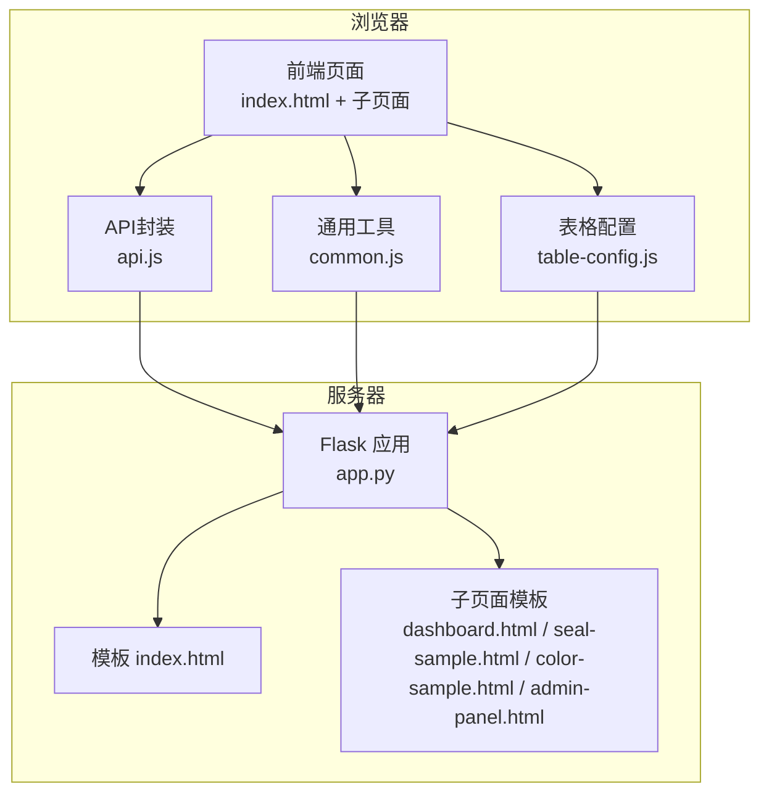
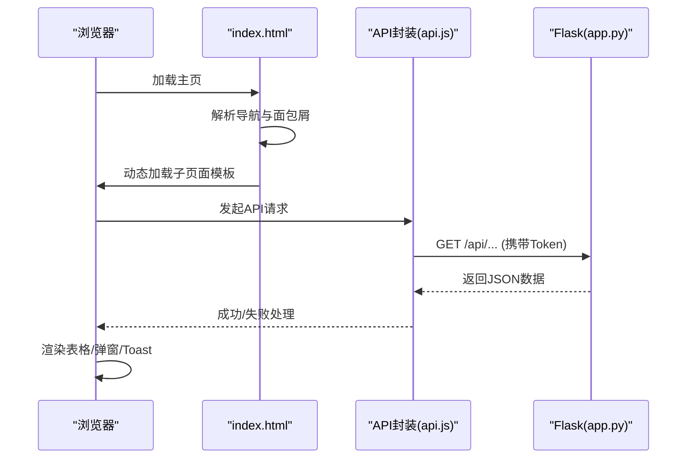
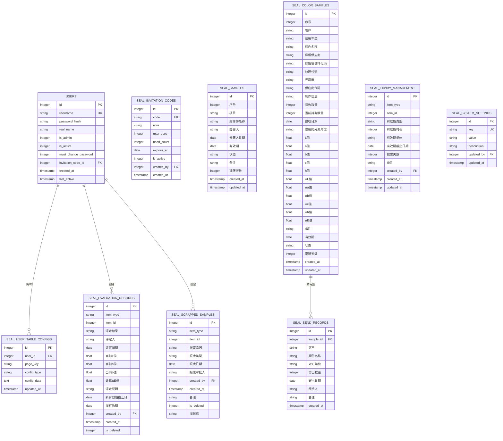
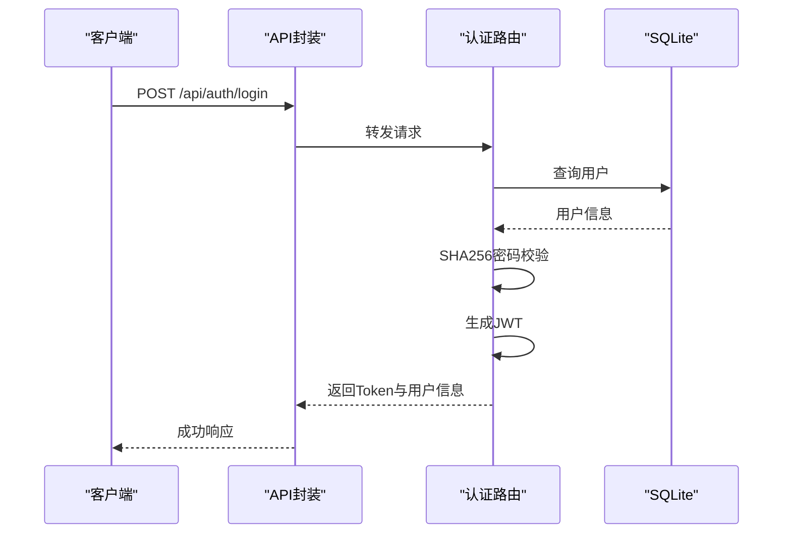
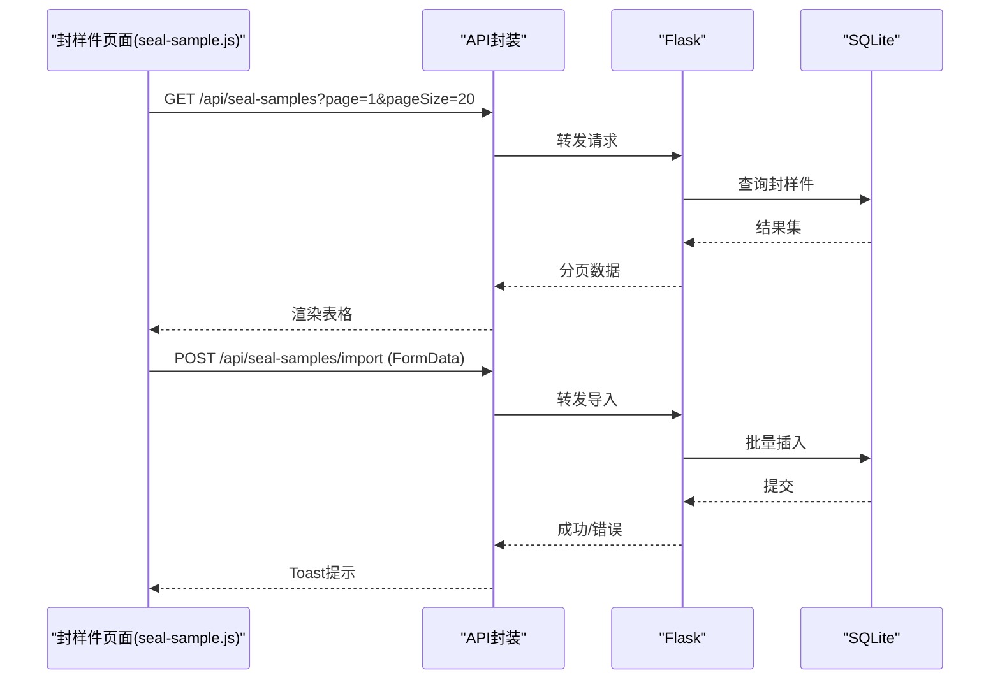
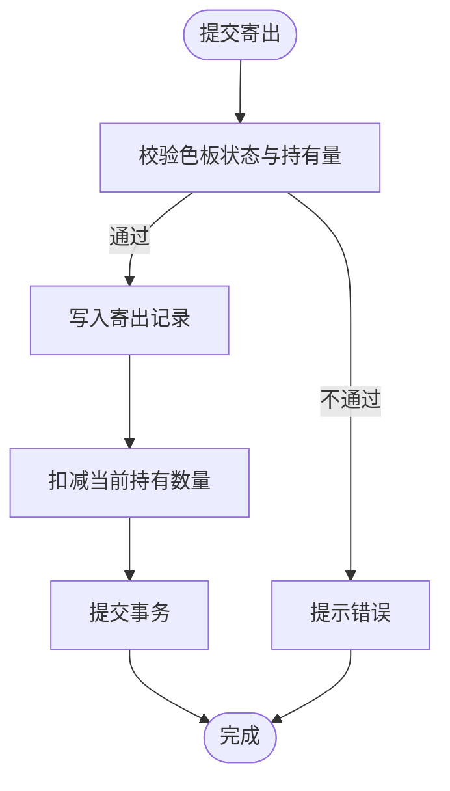
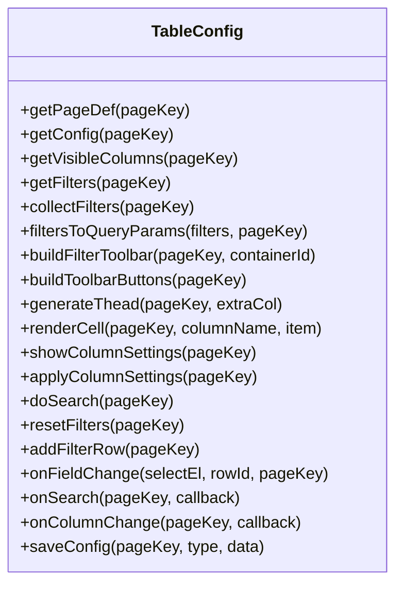
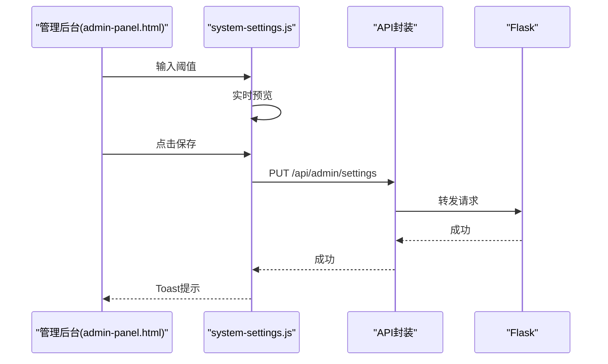
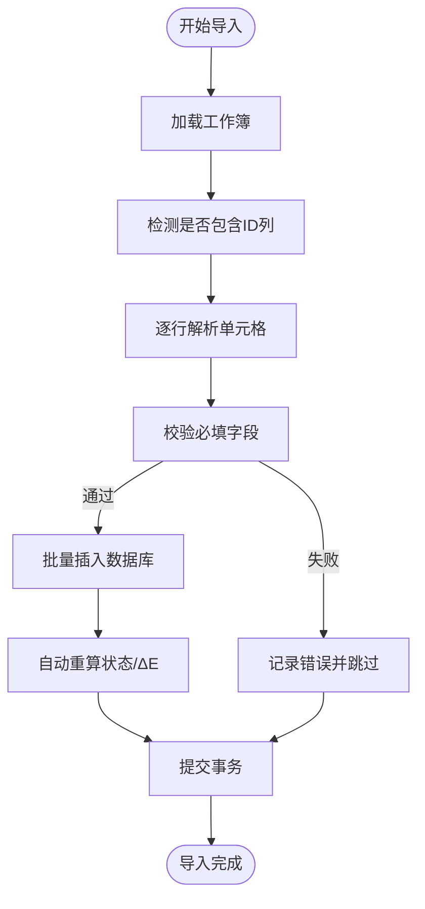
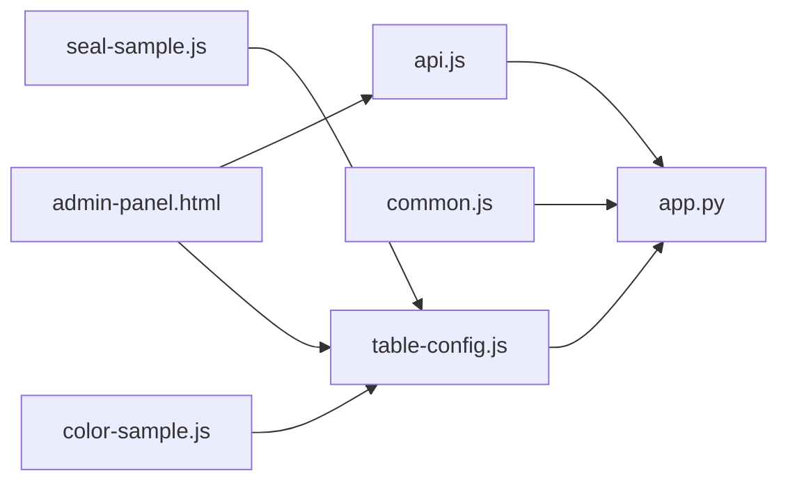

# 扩展开发

<cite>
**本文引用的文件**
- [app.py](file://app.py)
- [requirements.txt](file://requirements.txt)
- [templates/index.html](file://templates/index.html)
- [templates/admin-panel.html](file://templates/admin-panel.html)
- [templates/dashboard.html](file://templates/dashboard.html)
- [templates/seal-sample.html](file://templates/seal-sample.html)
- [templates/color-sample.html](file://templates/color-sample.html)
- [static/js/api.js](file://static/js/api.js)
- [static/js/common.js](file://static/js/common.js)
- [static/js/table-config.js](file://static/js/table-config.js)
- [static/js/system-settings.js](file://static/js/system-settings.js)
- [static/js/seal-sample.js](file://static/js/seal-sample.js)
- [static/js/color-sample.js](file://static/js/color-sample.js)
</cite>

## 目录
1. [简介](#简介)
2. [项目结构](#项目结构)
3. [核心组件](#核心组件)
4. [架构总览](#架构总览)
5. [详细组件分析](#详细组件分析)
6. [依赖分析](#依赖分析)
7. [性能考虑](#性能考虑)
8. [故障排查指南](#故障排查指南)
9. [结论](#结论)
10. [附录](#附录)

## 简介
本扩展开发文档面向“封样件及色板接收登记管理系统”的二次开发与功能扩展，覆盖以下主题：
- 新业务模块与API接口的添加方法（数据模型设计、路由定义）
- 前端页面与组件扩展（新页面开发、现有组件扩展）
- Excel导入/导出扩展与自定义模板开发
- 新功能开发模板与参考实现
- 第三方集成与API扩展方法
- 配置管理与系统设置扩展
- 权限控制与角色扩展机制
- 插件化开发与模块化架构设计指导

## 项目结构
系统采用前后端同构的单页应用（SPA）架构：
- 后端：Flask + SQLite，提供REST API与模板渲染
- 前端：纯静态HTML/CSS/JS，通过AJAX动态加载子页面模板
- 数据库：SQLite，内置初始化脚本与迁移兼容逻辑

图表来源
- [app.py:2159-2176](file://app.py#L2159-L2176)
- [templates/index.html:140-185](file://templates/index.html#L140-L185)

章节来源
- [app.py:2159-2176](file://app.py#L2159-L2176)
- [templates/index.html:140-185](file://templates/index.html#L140-L185)

## 核心组件
- 认证与权限
  - JWT Token校验与过期处理
  - 管理员权限装饰器
- 数据库与初始化
  - 10张核心表（用户、封样件、色板、寄出、有效期、评定、报废、系统设置、用户表格配置）
  - 初始化脚本与字段兼容性处理
- API层
  - 认证模块：登录、注册、改密、心跳、登出
  - 业务模块：封样件、色板、寄出、有效期、评定、报废、处置记录
  - 管理模块：用户管理、邀请码管理、系统设置
  - 表格配置：筛选与列设置持久化
- 前端模块
  - API封装与401自动跳转
  - 通用工具（日期、ΔE、状态标签、分页、剪贴板）
  - 表格配置（动态筛选、列设置、渲染器）
  - 页面脚本（封样件台账、色板台账）

章节来源
- [app.py:49-84](file://app.py#L49-L84)
- [app.py:88-335](file://app.py#L88-L335)
- [app.py:454-588](file://app.py#L454-L588)
- [app.py:591-795](file://app.py#L591-L795)
- [app.py:797-1041](file://app.py#L797-L1041)
- [app.py:1043-1171](file://app.py#L1043-L1171)
- [app.py:1173-1207](file://app.py#L1173-L1207)
- [app.py:1210-1287](file://app.py#L1210-L1287)
- [app.py:1289-1355](file://app.py#L1289-L1355)
- [app.py:1424-1577](file://app.py#L1424-L1577)
- [app.py:1580-1626](file://app.py#L1580-L1626)
- [app.py:1628-2080](file://app.py#L1628-L2080)
- [app.py:2082-2154](file://app.py#L2082-L2154)
- [static/js/api.js:1-88](file://static/js/api.js#L1-L88)
- [static/js/common.js:1-135](file://static/js/common.js#L1-L135)
- [static/js/table-config.js:1-552](file://static/js/table-config.js#L1-L552)
- [static/js/seal-sample.js:1-181](file://static/js/seal-sample.js#L1-L181)
- [static/js/color-sample.js:1-267](file://static/js/color-sample.js#L1-L267)

## 架构总览
系统采用“模板驱动 + API驱动”的SPA模式：
- 模板：index.html作为壳，通过AJAX加载子页面模板（dashboard、seal-sample、color-sample、admin-panel等）
- API：前端通过API封装统一访问后端REST接口，支持分页、筛选、导入导出、列配置等
- 数据：SQLite本地数据库，支持Excel导入导出与阈值配置

图表来源
- [templates/index.html:140-185](file://templates/index.html#L140-L185)
- [static/js/api.js:7-42](file://static/js/api.js#L7-L42)
- [app.py:591-795](file://app.py#L591-L795)

章节来源
- [templates/index.html:140-185](file://templates/index.html#L140-L185)
- [static/js/api.js:7-42](file://static/js/api.js#L7-L42)

## 详细组件分析

### 数据模型与表结构
系统包含10张核心表，涵盖用户、封样件、色板、寄出、有效期、评定、报废、系统设置、用户表格配置等。初始化脚本会自动创建并兼容旧版本字段。

图表来源
- [app.py:88-335](file://app.py#L88-L335)

章节来源
- [app.py:88-335](file://app.py#L88-L335)

### 认证与权限
- 装饰器
  - token_required：从Header或Query解析Token，校验有效性与账户状态
  - admin_required：管理员权限校验
- 登录/注册/改密/心跳/登出
  - 登录：SHA256密码哈希校验，签发JWT
  - 注册：邀请码校验与使用次数限制
  - 改密：原密码校验与强制改密标志
  - 心跳：定时刷新在线状态
  - 登出：清理在线状态

图表来源
- [app.py:454-494](file://app.py#L454-L494)
- [app.py:495-542](file://app.py#L495-L542)
- [app.py:544-570](file://app.py#L544-L570)
- [app.py:572-588](file://app.py#L572-L588)

章节来源
- [app.py:49-84](file://app.py#L49-L84)
- [app.py:454-588](file://app.py#L454-L588)

### 封样件模块（CRUD + 导入导出）
- 路由
  - GET /api/seal-samples：分页、动态筛选、兼容旧参数
  - POST /api/seal-samples：新增（自动生成序号）
  - GET/PUT/DELETE /api/seal-samples/<id>：详情、更新、删除
  - GET/POST /api/seal-samples/export/import：导出/导入
- 前端
  - 动态筛选与列配置
  - 导入/导出按钮绑定
  - 表单校验与保存

图表来源
- [app.py:591-795](file://app.py#L591-L795)
- [static/js/seal-sample.js:8-24](file://static/js/seal-sample.js#L8-L24)
- [static/js/seal-sample.js:164-174](file://static/js/seal-sample.js#L164-L174)

章节来源
- [app.py:591-795](file://app.py#L591-L795)
- [static/js/seal-sample.js:1-181](file://static/js/seal-sample.js#L1-L181)

### 色板模块（CRUD + 导入导出 + 寄出）
- 路由
  - GET/POST/GET/PUT/DELETE /api/color-samples：CRUD
  - GET/POST /api/color-samples/export/import：导出/导入
  - GET/POST /api/send-records：寄出管理
- 前端
  - 展开行显示基准Lab值与ΔE参数
  - 寄出对话框与库存扣减
  - ΔE自动计算与阈值判定

图表来源
- [app.py:1110-1155](file://app.py#L1110-L1155)
- [static/js/color-sample.js:207-245](file://static/js/color-sample.js#L207-L245)

章节来源
- [app.py:797-1041](file://app.py#L797-L1041)
- [app.py:1043-1171](file://app.py#L1043-L1171)
- [static/js/color-sample.js:1-267](file://static/js/color-sample.js#L1-L267)

### 表格配置与动态筛选
- 表格配置模块
  - 定义各页面字段、默认列、渲染器
  - 本地缓存 + 后端持久化（用户表格配置表）
  - 动态筛选构建与查询参数转换
- 前端页面
  - 封样件、色板、寄出、报废、处置记录页面共享配置能力

图表来源
- [static/js/table-config.js:14-154](file://static/js/table-config.js#L14-L154)
- [static/js/table-config.js:526-547](file://static/js/table-config.js#L526-L547)

章节来源
- [static/js/table-config.js:1-552](file://static/js/table-config.js#L1-L552)

### 系统设置与ΔE阈值
- 管理员可配置ΔE阈值（优秀/合格/需关注）
- 前端实时预览与保存
- 后端立即生效

图表来源
- [templates/admin-panel.html:51-102](file://templates/admin-panel.html#L51-L102)
- [static/js/system-settings.js:6-64](file://static/js/system-settings.js#L6-L64)
- [app.py:1552-1577](file://app.py#L1552-L1577)

章节来源
- [templates/admin-panel.html:51-102](file://templates/admin-panel.html#L51-L102)
- [static/js/system-settings.js:1-65](file://static/js/system-settings.js#L1-L65)
- [app.py:1552-1577](file://app.py#L1552-L1577)

### Excel导入/导出扩展指南
- 导入
  - 读取工作簿，跳过ID列（若存在），逐行解析
  - 校验必填字段，批量插入，异常行记录
  - 导入后自动重算状态与ΔE值
- 导出
  - 按固定表头导出，状态映射中文
  - 支持全量导出与分页导出

图表来源
- [app.py:720-795](file://app.py#L720-L795)
- [app.py:953-1041](file://app.py#L953-L1041)

章节来源
- [app.py:720-795](file://app.py#L720-L795)
- [app.py:953-1041](file://app.py#L953-L1041)

### 新功能开发模板与参考实现
- 新增业务模块步骤
  1) 设计数据模型与表结构（参考现有表）
  2) 在后端app.py中添加路由与CRUD逻辑
  3) 在前端页面模板中添加容器与按钮
  4) 新建/复用JS脚本处理表格、筛选、导入导出
  5) 在index.html中注册导航菜单
  6) 若涉及管理功能，添加管理员权限路由
- 参考实现
  - 封样件模块：[app.py:591-795](file://app.py#L591-L795)，[static/js/seal-sample.js:1-181](file://static/js/seal-sample.js#L1-L181)
  - 色板模块：[app.py:797-1041](file://app.py#L797-L1041)，[static/js/color-sample.js:1-267](file://static/js/color-sample.js#L1-L267)
  - 表格配置：[static/js/table-config.js:1-552](file://static/js/table-config.js#L1-L552)
  - 管理后台：[templates/admin-panel.html:1-107](file://templates/admin-panel.html#L1-L107)

章节来源
- [app.py:591-795](file://app.py#L591-L795)
- [app.py:797-1041](file://app.py#L797-L1041)
- [static/js/seal-sample.js:1-181](file://static/js/seal-sample.js#L1-L181)
- [static/js/color-sample.js:1-267](file://static/js/color-sample.js#L1-L267)
- [static/js/table-config.js:1-552](file://static/js/table-config.js#L1-L552)
- [templates/admin-panel.html:1-107](file://templates/admin-panel.html#L1-L107)

### 第三方集成与API扩展方法
- JWT鉴权：统一在API封装中附加Authorization头
- Excel处理：使用openpyxl进行导入导出
- 跨域：Flask-CORS启用
- 扩展建议
  - 新增第三方API：在后端新增路由，封装请求与响应
  - 新增Excel模板：遵循现有导入/导出字段映射规则
  - 新增报表：在后端新增聚合查询，在前端新增页面与图表

章节来源
- [static/js/api.js:1-88](file://static/js/api.js#L1-L88)
- [requirements.txt:1-5](file://requirements.txt#L1-L5)
- [app.py:18-19](file://app.py#L18-L19)

### 配置管理与系统设置扩展
- 用户表格配置
  - 用户维度的筛选与列设置持久化
  - 后端存储于seal_user_table_configs表
- 系统设置
  - 管理员可配置ΔE阈值
  - 后端存储于seal_system_settings表

章节来源
- [app.py:1580-1626](file://app.py#L1580-L1626)
- [app.py:1552-1577](file://app.py#L1552-L1577)

### 权限控制与角色扩展机制
- 角色
  - is_admin：管理员
  - is_active：账户启用/禁用
- 装饰器
  - token_required：全局鉴权
  - admin_required：管理员专属路由
- 管理员功能
  - 用户启/停用、删除
  - 邀请码生成/停用/删除
  - 系统设置修改

章节来源
- [app.py:49-84](file://app.py#L49-L84)
- [app.py:1424-1577](file://app.py#L1424-L1577)

### 插件化开发与模块化架构设计指导
- 模块化
  - 前端：按页面拆分JS模块（如seal-sample.js、color-sample.js、table-config.js）
  - 后端：按业务域拆分路由（认证、封样件、色板、寄出、评定、报废、管理）
- 插件化
  - 新页面：在templates目录新增HTML，在index.html注册导航
  - 新API：在app.py中新增路由，遵循统一鉴权与返回格式
  - 新Excel模板：遵循现有字段映射与导入/导出流程

章节来源
- [templates/index.html:140-185](file://templates/index.html#L140-L185)
- [app.py:2159-2176](file://app.py#L2159-L2176)

## 依赖分析
- 外部依赖
  - Flask：Web框架
  - Flask-CORS：跨域支持
  - PyJWT：JWT签名与验证
  - openpyxl：Excel导入导出
- 内部依赖
  - 前端模块相互协作：api.js -> table-config.js -> 页面脚本
  - 后端路由分层清晰：认证/业务/管理/配置

图表来源
- [static/js/api.js:1-88](file://static/js/api.js#L1-L88)
- [static/js/common.js:1-135](file://static/js/common.js#L1-L135)
- [static/js/table-config.js:1-552](file://static/js/table-config.js#L1-L552)
- [static/js/seal-sample.js:1-181](file://static/js/seal-sample.js#L1-L181)
- [static/js/color-sample.js:1-267](file://static/js/color-sample.js#L1-L267)
- [templates/admin-panel.html:1-107](file://templates/admin-panel.html#L1-L107)

章节来源
- [requirements.txt:1-5](file://requirements.txt#L1-L5)
- [static/js/api.js:1-88](file://static/js/api.js#L1-L88)
- [static/js/table-config.js:1-552](file://static/js/table-config.js#L1-L552)

## 性能考虑
- 分页与筛选
  - 后端分页：避免一次性加载全量数据
  - 动态筛选：安全过滤字段与操作符，防止SQL注入
- 导入优化
  - 批量插入与事务提交，减少I/O
  - 导入后自动重算：仅对新增记录执行
- 前端渲染
  - 表格配置本地缓存，减少后端请求
  - 展开行与复杂渲染器按需加载

## 故障排查指南
- 认证相关
  - 401错误：检查Token是否过期或无效；确认账户状态
  - 账户被停用：后端返回特定错误码，前端自动跳转登录
- 导入导出
  - 导入失败：检查Excel表头与字段映射；查看错误行提示
  - 导出空白：确认查询条件与分页参数
- 权限问题
  - 管理员功能不可用：确认is_admin标志
- 前端交互
  - 页面不加载：检查子页面模板路径与index.html的动态加载逻辑

章节来源
- [static/js/api.js:20-33](file://static/js/api.js#L20-L33)
- [app.py:720-795](file://app.py#L720-L795)
- [app.py:1424-1577](file://app.py#L1424-L1577)
- [templates/index.html:140-185](file://templates/index.html#L140-L185)

## 结论
本系统提供了完善的扩展点与模块化架构，开发者可按模板快速添加新业务模块与API接口，同时复用现有的表格配置、Excel导入导出、权限控制与系统设置能力。建议在扩展过程中遵循统一的数据模型设计、路由命名规范与前端模块组织方式，确保系统的一致性与可维护性。

## 附录
- 新增页面模板示例
  - 在templates目录新增HTML文件，参考现有页面结构
  - 在index.html中注册导航菜单与面包屑
- 新增API接口示例
  - 在app.py中添加路由，遵循统一鉴权与返回格式
  - 在前端页面脚本中调用API封装，处理成功/失败与分页
- Excel模板开发
  - 导入模板字段需与后端导入逻辑一致
  - 导出模板需包含状态映射与中文显示

章节来源
- [templates/index.html:140-185](file://templates/index.html#L140-L185)
- [app.py:591-795](file://app.py#L591-L795)
- [app.py:720-795](file://app.py#L720-L795)
- [app.py:953-1041](file://app.py#L953-L1041)