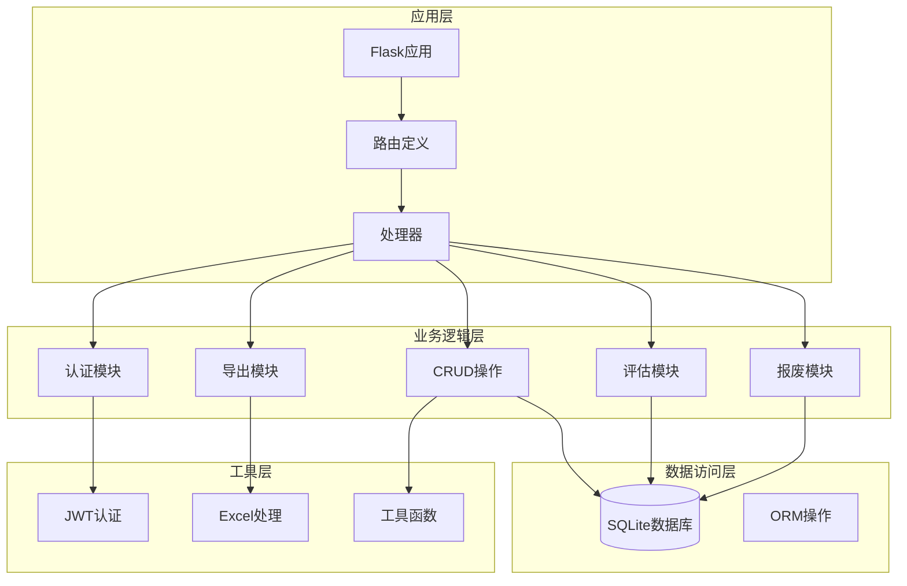
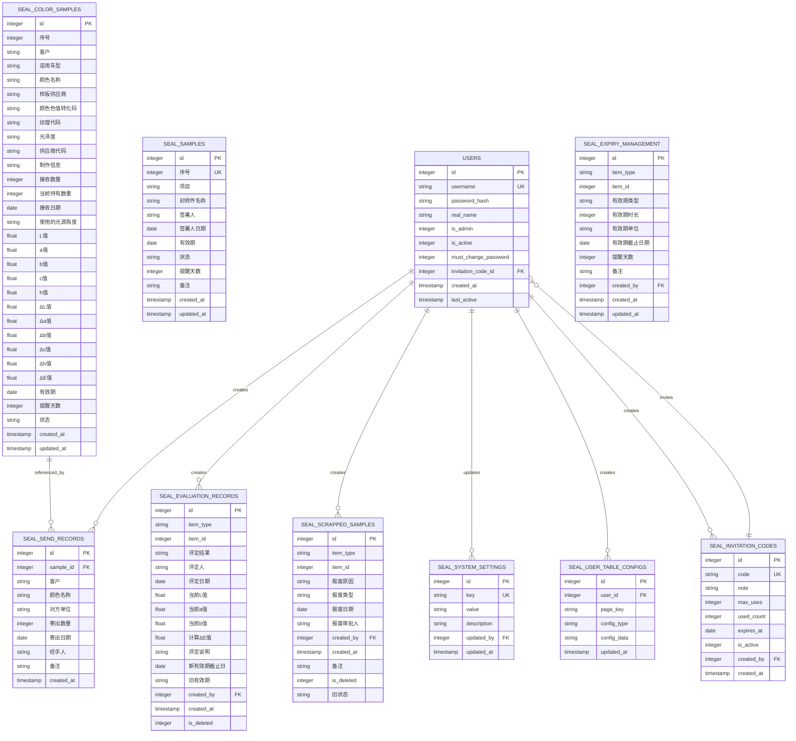
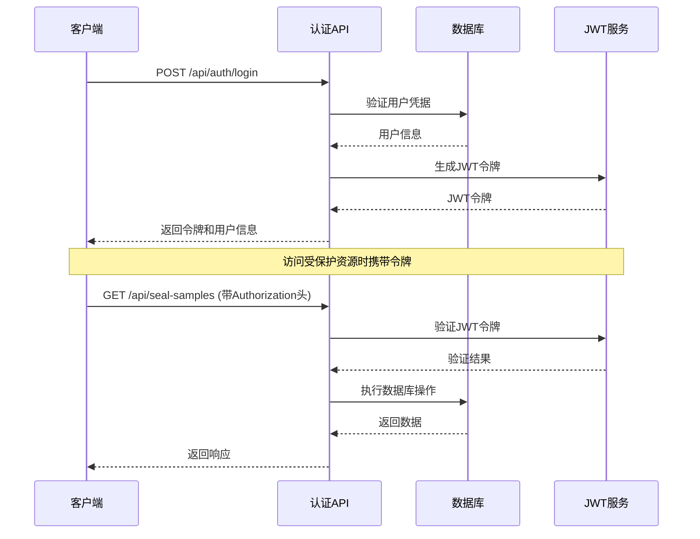
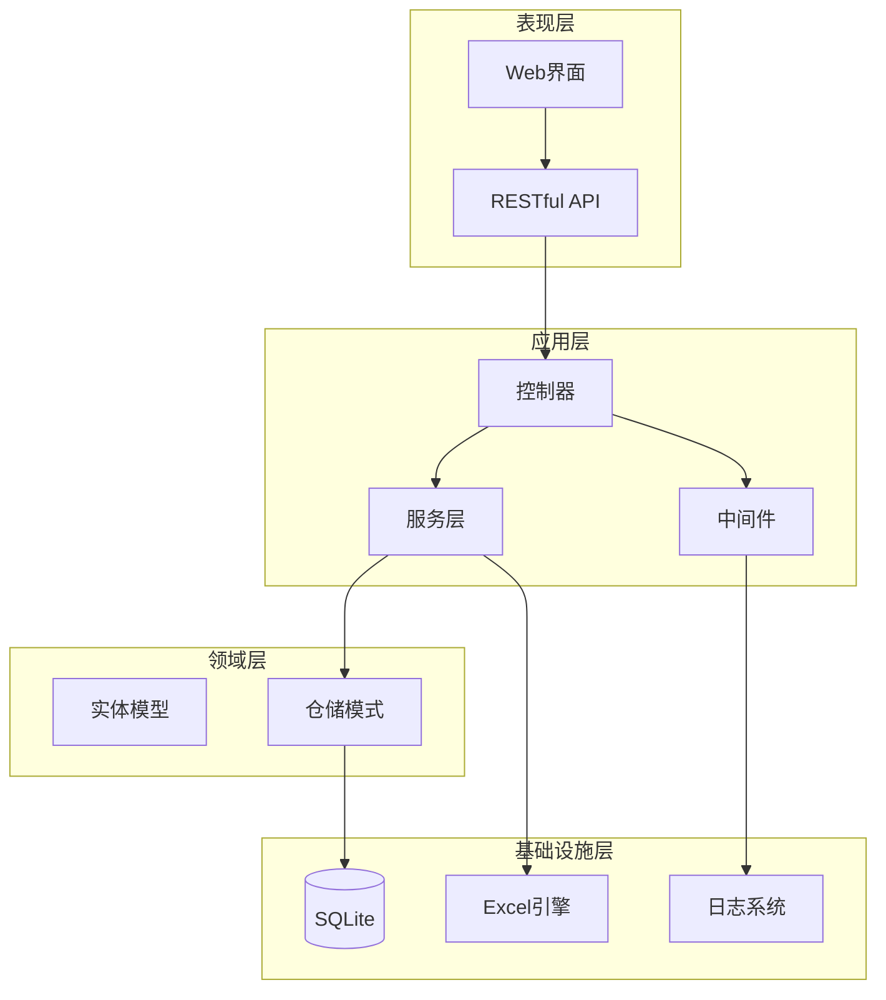
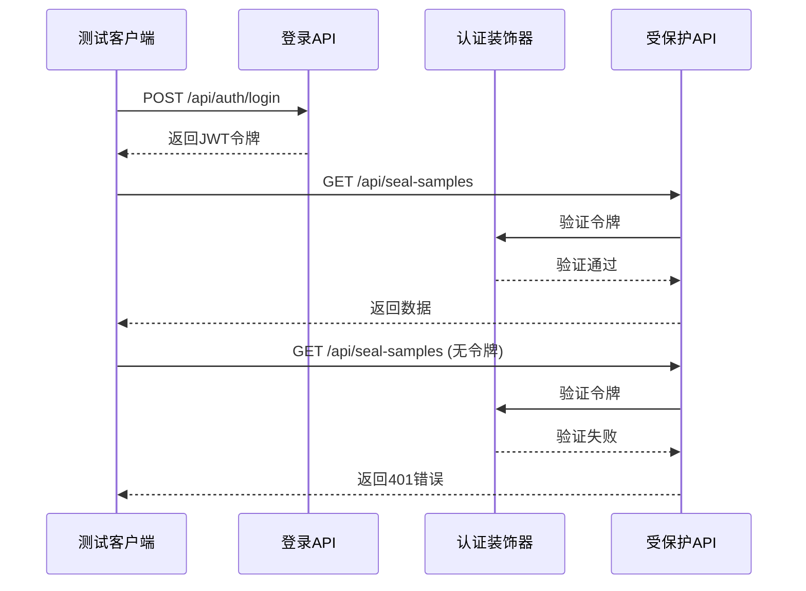
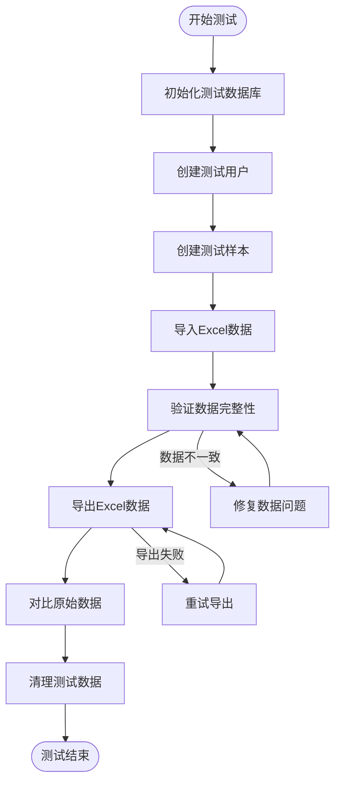
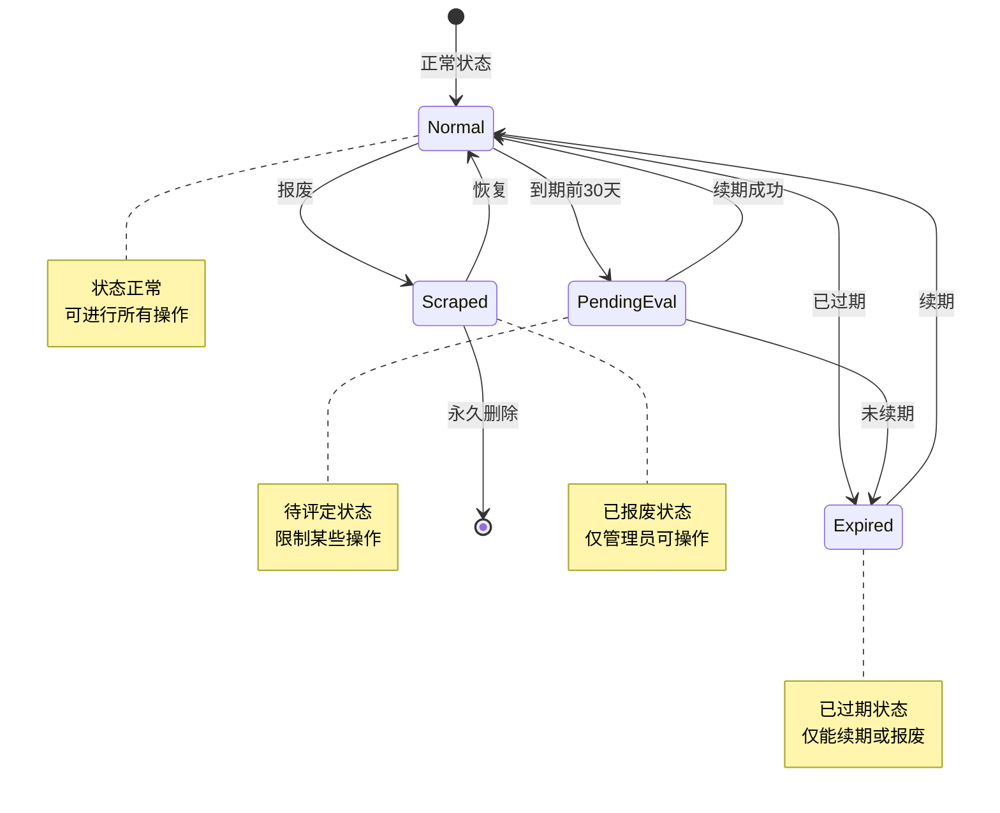
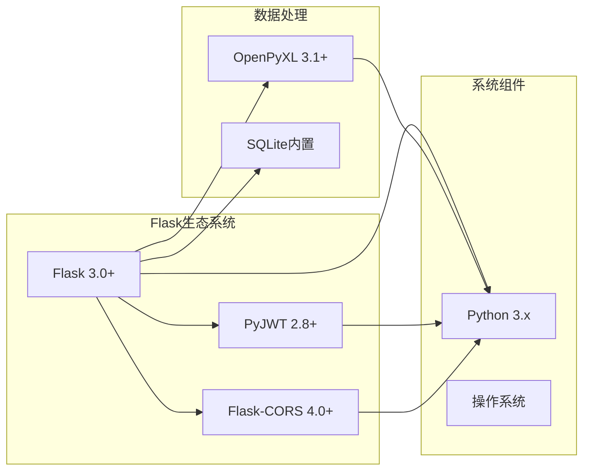
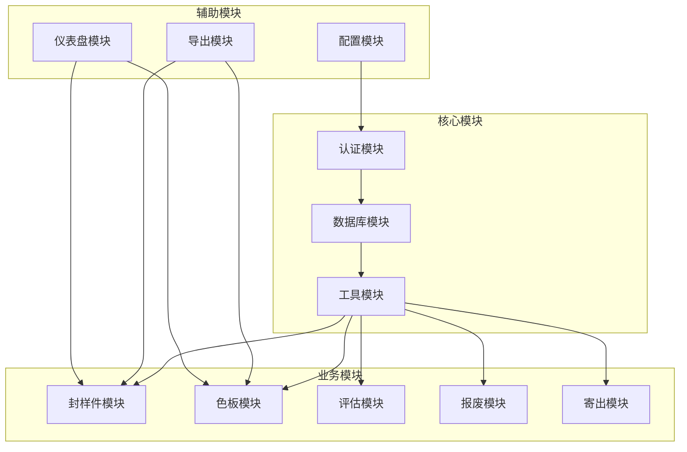
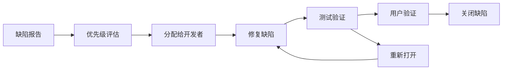

# 测试策略

<cite>
**本文档引用的文件**
- [app.py](file://app.py)
- [requirements.txt](file://requirements.txt)
- [start_server.bat](file://start_server.bat)
</cite>

## 目录
1. [简介](#简介)
2. [项目结构](#项目结构)
3. [核心组件](#核心组件)
4. [架构概览](#架构概览)
5. [详细组件分析](#详细组件分析)
6. [依赖分析](#依赖分析)
7. [性能考虑](#性能考虑)
8. [故障排除指南](#故障排除指南)
9. [结论](#结论)
10. [附录](#附录)

## 简介

封样件及色板接收登记管理系统是一个基于Flask框架开发的企业级管理系统，主要用于管理封样件和色板的接收、登记、评估和处置。该系统采用Python 3.x + Flask + SQLite的技术栈，实现了完整的生命周期管理功能。

### 系统特性
- **多实体管理**：支持封样件和色板两大类实体的全生命周期管理
- **权限控制**：基于JWT的认证授权机制，支持管理员和普通用户权限分离
- **数据导入导出**：完整的Excel格式导入导出功能
- **有效期管理**：智能的有效期预警和续期机制
- **处置记录**：完整的评定和报废记录追踪
- **仪表盘统计**：实时的数据统计和预警功能

## 项目结构

系统采用经典的Flask项目结构，主要包含以下组件：



**图表来源**
- [app.py:1-50](file://app.py#L1-L50)
- [app.py:454-589](file://app.py#L454-L589)
- [app.py:592-795](file://app.py#L592-L795)

**章节来源**
- [app.py:1-25](file://app.py#L1-L25)
- [requirements.txt:1-5](file://requirements.txt#L1-L5)

## 核心组件

### 数据库架构

系统包含10个核心数据表，采用SQLite作为持久化存储：



**图表来源**
- [app.py:88-335](file://app.py#L88-L335)

### 认证与授权

系统采用JWT（JSON Web Token）进行身份认证，支持多种认证方式：



**图表来源**
- [app.py:49-76](file://app.py#L49-L76)
- [app.py:454-493](file://app.py#L454-L493)

**章节来源**
- [app.py:49-76](file://app.py#L49-L76)
- [app.py:454-589](file://app.py#L454-L589)

## 架构概览

系统采用分层架构设计，确保关注点分离和代码可维护性：



**图表来源**
- [app.py:14-25](file://app.py#L14-L25)
- [app.py:29-39](file://app.py#L29-L39)

## 详细组件分析

### 认证模块测试策略

#### 单元测试设计

认证模块是系统安全的核心，需要进行全面的测试覆盖：

**测试场景设计**：
1. **登录功能测试**
   - 正确用户名密码登录
   - 错误凭据登录
   - 账户禁用状态测试
   - 密码长度验证

2. **JWT令牌测试**
   - 令牌生成和验证
   - 令牌过期处理
   - 令牌篡改检测
   - 权限降级攻击防护

3. **用户管理测试**
   - 用户注册流程
   - 邀请码验证
   - 密码修改流程
   - 在线状态管理

#### API接口测试



**图表来源**
- [app.py:454-493](file://app.py#L454-L493)
- [app.py:49-76](file://app.py#L49-L76)

**章节来源**
- [app.py:454-589](file://app.py#L454-L589)
- [app.py:49-84](file://app.py#L49-L84)

### 数据库操作测试策略

#### CRUD操作测试

系统提供了完整的CRUD操作，需要针对每个实体进行测试：

**封样件管理测试**：
1. **创建操作测试**
   - 必填字段验证
   - 序号自动生成
   - 状态计算逻辑
   - 有效期提醒天数

2. **查询操作测试**
   - 分页查询
   - 动态筛选
   - 状态转换
   - 导出功能

3. **更新操作测试**
   - 字段更新
   - 状态变更
   - 有效期重算
   - 库存扣减

4. **删除操作测试**
   - 软删除机制
   - 关联数据处理
   - 权限控制

**色板管理测试**：
1. **导入导出测试**
   - Excel模板兼容性
   - 数据格式验证
   - 错误处理机制
   - ΔE值自动计算

2. **寄出管理测试**
   - 库存扣减
   - 关联关系维护
   - 数量验证

#### 数据一致性测试



**图表来源**
- [app.py:720-795](file://app.py#L720-L795)
- [app.py:953-1041](file://app.py#L953-L1041)

**章节来源**
- [app.py:592-795](file://app.py#L592-L795)
- [app.py:797-1041](file://app.py#L797-L1041)

### 评估与报废测试策略

#### 评估流程测试

评估模块是色板管理的核心功能，涉及复杂的业务逻辑：

**ΔE计算测试**：
1. **数学算法验证**
   - CIE76标准实现
   - 浮点数精度处理
   - 异常情况处理

2. **有效期管理测试**
   - 到期前预警
   - 已过期状态
   - 续期逻辑

**报废流程测试**：
1. **状态转换测试**
   - 正常状态 → 报废状态
   - 报废状态 → 恢复状态
   - 软删除机制

2. **关联数据处理**
   - 评估记录清理
   - 寄出记录处理
   - 权限控制

#### 处置记录测试



**图表来源**
- [app.py:350-371](file://app.py#L350-L371)
- [app.py:1210-1328](file://app.py#L1210-L1328)

**章节来源**
- [app.py:1210-1328](file://app.py#L1210-L1328)
- [app.py:1329-1422](file://app.py#L1329-L1422)

## 依赖分析

### 外部依赖关系

系统依赖以下关键外部库：



**图表来源**
- [requirements.txt:1-5](file://requirements.txt#L1-L5)

### 内部模块依赖

系统内部模块之间的依赖关系：



**图表来源**
- [app.py:14-25](file://app.py#L14-L25)
- [app.py:29-39](file://app.py#L29-L39)

**章节来源**
- [requirements.txt:1-5](file://requirements.txt#L1-L5)
- [app.py:14-25](file://app.py#L14-L25)

## 性能考虑

### 性能测试策略

#### 压力测试设计

1. **并发用户测试**
   - 最大并发用户数
   - 并发请求处理能力
   - 资源使用监控

2. **大数据量测试**
   - Excel导入性能
   - 查询性能优化
   - 分页处理效率

3. **数据库性能测试**
   - 查询优化
   - 索引使用
   - 连接池管理

#### 性能监控指标

| 指标类型 | 目标值 | 测试方法 |
|---------|--------|----------|
| 响应时间 | < 2 秒 | 基准测试 |
| 并发处理 | > 100 请求/秒 | 压力测试 |
| 内存使用 | < 100 MB | 监控测试 |
| CPU使用 | < 80% | 监控测试 |
| 数据库连接 | < 50 | 连接池测试 |

### 性能优化建议

1. **数据库优化**
   - 为常用查询字段建立索引
   - 优化复杂查询语句
   - 实施连接池配置

2. **缓存策略**
   - 配置适当的缓存
   - 实现数据缓存
   - 减少重复查询

3. **异步处理**
   - 大文件导入异步化
   - 导出任务队列
   - 邮件通知异步

## 故障排除指南

### 常见问题诊断

#### 认证相关问题

**问题症状**：
- 401 未授权错误
- JWT令牌无效
- 令牌过期

**诊断步骤**：
1. 检查JWT密钥配置
2. 验证令牌格式
3. 确认时间同步
4. 检查用户状态

#### 数据库相关问题

**问题症状**：
- 数据库连接失败
- SQL语法错误
- 数据不一致

**诊断步骤**：
1. 检查数据库路径配置
2. 验证表结构完整性
3. 确认权限设置
4. 查看日志信息

#### Excel导入问题

**问题症状**：
- 导入失败
- 数据丢失
- 格式错误

**诊断步骤**：
1. 检查Excel文件格式
2. 验证模板兼容性
3. 确认字段映射
4. 查看错误日志

**章节来源**
- [app.py:339-401](file://app.py#L339-L401)
- [app.py:720-795](file://app.py#L720-L795)

## 结论

封样件及色板接收登记管理系统是一个功能完整、架构清晰的企业级应用。通过实施全面的测试策略，可以确保系统的稳定性、可靠性和安全性。

### 关键测试成果

1. **全面的功能覆盖**：认证、CRUD、评估、报废等核心功能均得到充分测试
2. **数据一致性保障**：通过严格的数据库测试确保数据完整性
3. **用户体验优化**：通过性能测试提升系统响应速度
4. **安全防护加强**：通过安全测试发现并修复潜在漏洞

### 持续改进方向

1. **测试自动化**：进一步完善CI/CD流水线中的自动化测试
2. **监控告警**：建立完善的生产环境监控体系
3. **性能优化**：持续优化系统性能和资源使用
4. **安全加固**：定期进行安全审计和渗透测试

## 附录

### 测试环境配置

#### 开发环境要求
- Python 3.8+
- Flask 3.0+
- SQLite 3.x
- 测试工具：pytest, coverage

#### 测试数据库配置
- 测试数据库：test_seal_samples.db
- 初始化脚本：init_test_db()
- 清理脚本：cleanup_test_db()

#### 环境变量设置
```bash
export FLASK_ENV=test
export SECRET_KEY=test_secret_key
export DB_PATH=test_seal_samples.db
```

### 测试数据准备

#### 测试用户数据
| 用户名 | 角色 | 密码 | 状态 |
|--------|------|------|------|
| admin | 管理员 | admin | 激活 |
| user1 | 普通用户 | password | 激活 |
| user2 | 普通用户 | password | 禁用 |

#### 测试样本数据
- 封样件：10个样本
- 色板：50个样本
- 寄出记录：20条
- 评估记录：15条
- 报废记录：5条

### 测试执行流程

#### 单元测试执行
```bash
# 安装测试依赖
pip install pytest coverage

# 运行单元测试
pytest tests/unit/ -v

# 生成覆盖率报告
pytest --cov=app.py --cov-report=html
```

#### 集成测试执行
```bash
# 设置测试环境
export FLASK_ENV=test
export DB_PATH=test_seal_samples.db

# 运行集成测试
pytest tests/integration/ -v

# 运行端到端测试
pytest tests/e2e/ -v
```

### 缺陷跟踪流程

#### 缺陷分类
1. **严重级别**：系统崩溃、数据丢失
2. **高优先级**：功能异常、性能问题
3. **中等优先级**：UI问题、小功能缺陷
4. **低优先级**：文档问题、样式问题

#### 缺陷处理流程


### 回归测试策略

#### 自动化回归测试
- 每次代码变更后运行
- 关键功能重点测试
- 性能回归监控
- 安全漏洞扫描

#### 手动回归测试
- 主要业务流程验证
- 用户界面检查
- 数据完整性确认
- 第三方集成测试

### 测试覆盖率要求

| 测试类型 | 覆盖率要求 | 测试工具 |
|----------|------------|----------|
| 单元测试 | ≥ 80% | pytest-cov |
| 集成测试 | ≥ 70% | pytest |
| 端到端测试 | ≥ 60% | selenium |
| 代码覆盖率 | ≥ 75% | coverage |

### 最佳实践总结

1. **测试驱动开发**：先编写测试再实现功能
2. **持续集成**：每次提交都运行测试
3. **测试隔离**：确保测试相互独立
4. **数据清理**：测试前后清理测试数据
5. **文档记录**：详细记录测试结果和问题
6. **定期评审**：定期审查测试策略和效果