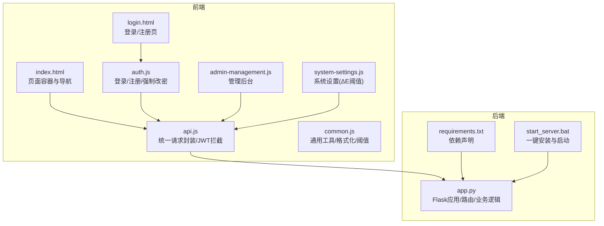
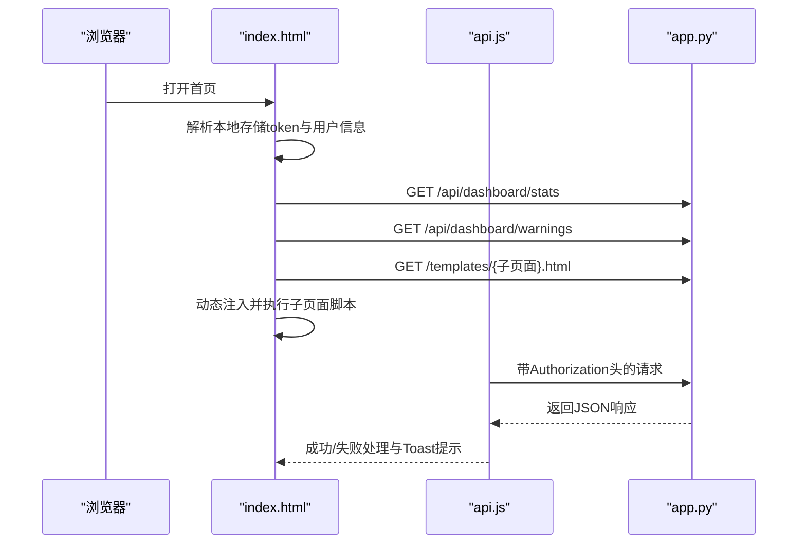
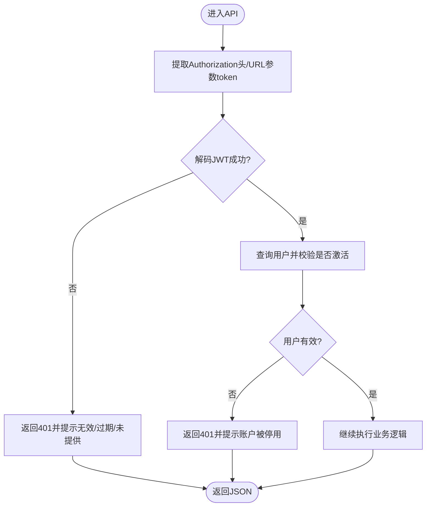
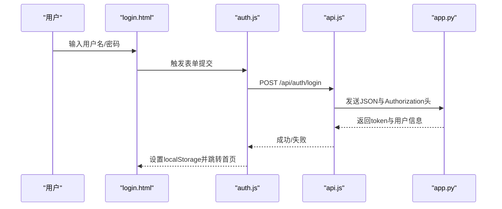
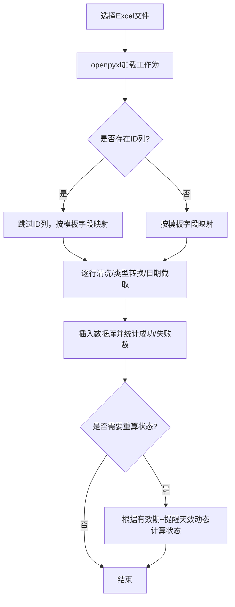
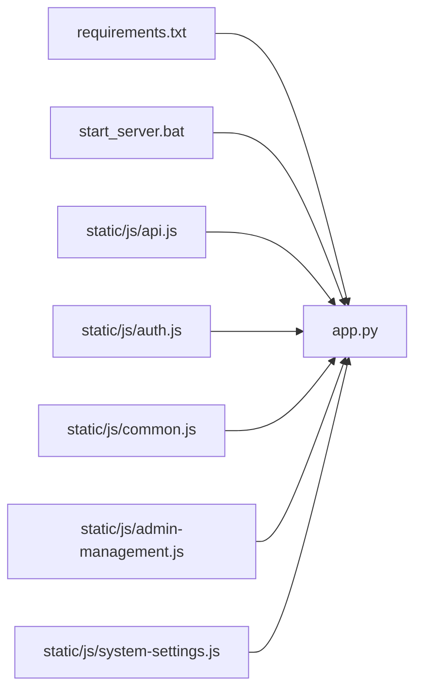

# 调试技巧

<cite>
**本文引用的文件**
- [app.py](file://app.py)
- [requirements.txt](file://requirements.txt)
- [start_server.bat](file://start_server.bat)
- [static/js/api.js](file://static/js/api.js)
- [static/js/auth.js](file://static/js/auth.js)
- [static/js/common.js](file://static/js/common.js)
- [templates/index.html](file://templates/index.html)
- [templates/login.html](file://templates/login.html)
- [static/js/admin-management.js](file://static/js/admin-management.js)
- [static/js/system-settings.js](file://static/js/system-settings.js)
</cite>

## 目录
1. [简介](#简介)
2. [项目结构](#项目结构)
3. [核心组件](#核心组件)
4. [架构总览](#架构总览)
5. [详细组件调试指南](#详细组件调试指南)
6. [依赖关系分析](#依赖关系分析)
7. [性能与内存调试](#性能与内存调试)
8. [故障排查与常见问题](#故障排查与常见问题)
9. [结论](#结论)
10. [附录](#附录)

## 简介
本文件面向“封样件及色板接收登记管理系统”的开发与运维人员，提供系统化的调试方法论与实操步骤，覆盖后端Flask应用调试、数据库查询与异常追踪、前端JavaScript调试、JWT令牌与认证问题排查、Excel导入导出与数据校验、日志分析与错误定位、性能与内存问题诊断、以及远程与生产环境问题排查流程。

## 项目结构
系统采用前后端分离思路：后端为Flask应用，提供REST API；前端以静态HTML+JS为主，通过统一的API封装层与后端交互；模板通过AJAX动态加载子页面，实现SPA式体验。

**图表来源**
- [app.py](file://app.py)
- [requirements.txt](file://requirements.txt)
- [start_server.bat](file://start_server.bat)
- [static/js/api.js](file://static/js/api.js)
- [static/js/auth.js](file://static/js/auth.js)
- [static/js/common.js](file://static/js/common.js)
- [templates/index.html](file://templates/index.html)
- [templates/login.html](file://templates/login.html)
- [static/js/admin-management.js](file://static/js/admin-management.js)
- [static/js/system-settings.js](file://static/js/system-settings.js)

**章节来源**
- [app.py](file://app.py)
- [requirements.txt](file://requirements.txt)
- [start_server.bat](file://start_server.bat)
- [static/js/api.js](file://static/js/api.js)
- [static/js/auth.js](file://static/js/auth.js)
- [static/js/common.js](file://static/js/common.js)
- [templates/index.html](file://templates/index.html)
- [templates/login.html](file://templates/login.html)
- [static/js/admin-management.js](file://static/js/admin-management.js)
- [static/js/system-settings.js](file://static/js/system-settings.js)

## 核心组件
- Flask后端服务：负责认证、业务API、Excel导入导出、数据库初始化与兼容性迁移。
- 前端API封装：统一处理Authorization头、401自动跳转、错误提示与上传。
- 登录注册模块：表单校验、密码强度、强制改密弹窗。
- 通用工具模块：日期格式化、ΔE计算与状态判定、分页与防抖等。
- 管理后台：用户管理、邀请码管理、系统设置（ΔE阈值）。
- 页面容器：index.html负责子页面加载、心跳保活、导航与面包屑。

**章节来源**
- [app.py](file://app.py)
- [static/js/api.js](file://static/js/api.js)
- [static/js/auth.js](file://static/js/auth.js)
- [static/js/common.js](file://static/js/common.js)
- [templates/index.html](file://templates/index.html)
- [templates/login.html](file://templates/login.html)
- [static/js/admin-management.js](file://static/js/admin-management.js)
- [static/js/system-settings.js](file://static/js/system-settings.js)

## 架构总览
后端通过装饰器实现认证与权限控制，前端通过API封装统一携带Token并处理401。页面通过AJAX加载子模板并按序执行脚本，实现模块化初始化。

**图表来源**
- [templates/index.html](file://templates/index.html)
- [static/js/api.js](file://static/js/api.js)
- [app.py](file://app.py)

**章节来源**
- [templates/index.html](file://templates/index.html)
- [static/js/api.js](file://static/js/api.js)
- [app.py](file://app.py)

## 详细组件调试指南

### Flask后端调试
- 开启调试模式
  - 在启动脚本中设置debug=True，便于热重载与堆栈打印。
  - 启动命令示例参见：[start_server.bat](file://start_server.bat)
- 认证与权限
  - 令牌解析失败、过期、用户不存在、账户禁用等分支均有明确返回，便于定位。
  - 参考路径：[token_required装饰器](file://app.py)，[login接口](file://app.py)，[change-password接口](file://app.py)
- 数据库初始化与兼容
  - init_db包含多表创建、字段补齐、预置admin与阈值设置，异常会被捕获避免中断启动。
  - 参考路径：[init_db](file://app.py)
- Excel导入导出
  - 导入/导出均使用openpyxl，导入时逐行捕错并汇总首条错误，便于快速定位问题行。
  - 参考路径：[封样件导入](file://app.py)，[色板导入](file://app.py)，[封样件导出](file://app.py)，[色板导出](file://app.py)
- 日志与警告
  - 使用app.logger.warning输出异常信息，便于排查。
  - 参考路径：[get_expiry状态判断](file://app.py)

**图表来源**
- [app.py](file://app.py)

**章节来源**
- [app.py](file://app.py)
- [start_server.bat](file://start_server.bat)

### 数据库查询调试
- 连接与关闭
  - 使用get_db建立连接，teardown自动关闭，避免连接泄露。
  - 参考路径：[get_db](file://app.py)，[close_db](file://app.py)
- 分页与筛选
  - paginate与apply_dynamic_filters支持分页与动态筛选，建议在开发阶段打印最终SQL与参数，便于验证。
  - 参考路径：[paginate](file://app.py)，[apply_dynamic_filters](file://app.py)
- 有效期状态计算
  - get_expiry_status对异常输入进行容错并记录warning日志，便于发现脏数据。
  - 参考路径：[get_expiry_status](file://app.py)

**章节来源**
- [app.py](file://app.py)

### 异常追踪与日志
- 后端日志
  - 使用app.logger.warning记录异常，结合Flask debug模式查看堆栈。
  - 参考路径：[get_expiry状态判断日志](file://app.py)
- 前端日志
  - API封装在请求失败时打印错误并Toast提示，便于前端定位网络问题。
  - 参考路径：[API.request](file://static/js/api.js)

**章节来源**
- [app.py](file://app.py)
- [static/js/api.js](file://static/js/api.js)

### JavaScript前端调试
- 浏览器开发者工具
  - Network标签查看请求头Authorization、响应体与状态码；Console查看错误与警告；Elements检查DOM变更。
- 请求拦截与401处理
  - API封装统一添加Authorization头，401时清理本地存储并跳转登录。
  - 参考路径：[API.request](file://static/js/api.js)
- 登录/注册流程
  - 表单校验、提交按钮状态、错误提示与成功跳转，建议在关键节点加断点观察状态变化。
  - 参考路径：[auth.js](file://static/js/auth.js)
- 子页面加载与初始化
  - index.html通过fetch加载模板并按序执行脚本，注意子页面脚本的DOMContentLoaded模拟。
  - 参考路径：[index.html子页面加载](file://templates/index.html)
- 通用工具
  - 日期格式化、ΔE计算、分页与防抖等工具函数，建议在Console中单独测试边界值。
  - 参考路径：[common.js](file://static/js/common.js)

**图表来源**
- [templates/login.html](file://templates/login.html)
- [static/js/auth.js](file://static/js/auth.js)
- [static/js/api.js](file://static/js/api.js)
- [app.py](file://app.py)

**章节来源**
- [templates/login.html](file://templates/login.html)
- [static/js/auth.js](file://static/js/auth.js)
- [static/js/api.js](file://static/js/api.js)
- [app.py](file://app.py)
- [templates/index.html](file://templates/index.html)
- [static/js/common.js](file://static/js/common.js)

### JWT令牌调试与认证问题排查
- 令牌位置
  - 后端同时支持Header与Query两种方式传递token，优先检查Header是否包含Authorization: Bearer。
  - 参考路径：[token_required](file://app.py)
- 令牌有效性
  - 过期、签名错误、用户不存在、账户禁用都会返回401，结合后端日志与前端Toast快速定位。
  - 参考路径：[token_required](file://app.py)，[API 401处理](file://static/js/api.js)
- 心跳与在线状态
  - 前端定时调用/ping保持在线，后端更新last_active；若出现“账户被停用”，检查用户状态。
  - 参考路径：[index.html心跳](file://templates/index.html)，[ping接口](file://app.py)

**章节来源**
- [app.py](file://app.py)
- [static/js/api.js](file://static/js/api.js)
- [templates/index.html](file://templates/index.html)

### Excel导入导出调试与数据验证
- 导入流程
  - 逐行读取、类型转换、日期截取、异常捕获与错误汇总，建议先用小批量数据验证。
  - 参考路径：[封样件导入](file://app.py)，[色板导入](file://app.py)
- 导出流程
  - 读取数据库并写入工作簿，状态映射与动态计算，确保模板字段顺序与类型一致。
  - 参考路径：[封样件导出](file://app.py)，[色板导出](file://app.py)
- 数据验证
  - 前端common.js提供日期格式化与ΔE计算，后端对空值、非法日期、阈值范围进行校验。
  - 参考路径：[common.js工具](file://static/js/common.js)，[系统设置阈值](file://static/js/system-settings.js)

**图表来源**
- [app.py](file://app.py)

**章节来源**
- [app.py](file://app.py)
- [static/js/common.js](file://static/js/common.js)
- [static/js/system-settings.js](file://static/js/system-settings.js)

### 管理后台与系统设置调试
- 用户管理
  - 启用/禁用、删除、在线状态展示，建议在切换状态后刷新页面核对数据库更新。
  - 参考路径：[admin-management.js](file://static/js/admin-management.js)
- 邀请码管理
  - 生成、启用/停用、删除、剩余次数计算，注意过期时间与最大使用次数。
  - 参考路径：[admin-management.js](file://static/js/admin-management.js)
- 系统设置
  - ΔE阈值保存时进行大小校验，预览区域实时反映判定结果。
  - 参考路径：[system-settings.js](file://static/js/system-settings.js)

**章节来源**
- [static/js/admin-management.js](file://static/js/admin-management.js)
- [static/js/system-settings.js](file://static/js/system-settings.js)

## 依赖关系分析
- 后端依赖
  - Flask、CORS、JWT、openpyxl、SQLite（内置）
  - 参考路径：[requirements.txt](file://requirements.txt)
- 前端依赖
  - 通过静态资源引入，无包管理器；API封装基于原生fetch。
- 启动流程
  - 一键安装依赖并启动Flask，开启debug模式便于调试。
  - 参考路径：[start_server.bat](file://start_server.bat)

**图表来源**
- [requirements.txt](file://requirements.txt)
- [start_server.bat](file://start_server.bat)
- [app.py](file://app.py)
- [static/js/api.js](file://static/js/api.js)
- [static/js/auth.js](file://static/js/auth.js)
- [static/js/common.js](file://static/js/common.js)
- [static/js/admin-management.js](file://static/js/admin-management.js)
- [static/js/system-settings.js](file://static/js/system-settings.js)

**章节来源**
- [requirements.txt](file://requirements.txt)
- [start_server.bat](file://start_server.bat)
- [app.py](file://app.py)
- [static/js/api.js](file://static/js/api.js)
- [static/js/auth.js](file://static/js/auth.js)
- [static/js/common.js](file://static/js/common.js)
- [static/js/admin-management.js](file://static/js/admin-management.js)
- [static/js/system-settings.js](file://static/js/system-settings.js)

## 性能与内存调试
- 前端性能
  - 使用防抖工具减少高频事件触发；动画使用requestAnimationFrame；分页避免一次性渲染大量DOM。
  - 参考路径：[common.js防抖与动画](file://static/js/common.js)，[index.html分页与加载](file://templates/index.html)
- 后端性能
  - 导入时批量插入与事务提交，避免逐条提交带来的I/O放大；导出使用内存缓冲减少磁盘写入。
  - 参考路径：[导入/导出](file://app.py)
- 内存泄漏排查
  - 检查定时器（心跳、时钟）、事件监听器（点击、键盘）是否在页面卸载时清理；避免闭包持有大对象。
  - 参考路径：[index.html定时器](file://templates/index.html)

**章节来源**
- [static/js/common.js](file://static/js/common.js)
- [templates/index.html](file://templates/index.html)
- [app.py](file://app.py)

## 故障排查与常见问题
- 登录失败
  - 检查用户名/密码、账户是否被禁用、是否需要强制改密。
  - 参考路径：[login接口](file://app.py)，[auth.js](file://static/js/auth.js)
- 401未授权
  - 确认Authorization头是否正确、Token是否过期、用户是否仍有效。
  - 参考路径：[token_required](file://app.py)，[API 401处理](file://static/js/api.js)
- Excel导入报错
  - 查看返回的首条错误行号与字段，修正日期格式、数值类型与必填字段。
  - 参考路径：[导入接口](file://app.py)
- ΔE阈值异常
  - 检查系统设置阈值大小关系，预览区域是否符合预期。
  - 参考路径：[system-settings.js](file://static/js/system-settings.js)
- 页面加载失败
  - 检查子页面模板路径与网络状态，确认index.html的模板加载逻辑。
  - 参考路径：[index.html模板加载](file://templates/index.html)

**章节来源**
- [app.py](file://app.py)
- [static/js/api.js](file://static/js/api.js)
- [static/js/auth.js](file://static/js/auth.js)
- [static/js/system-settings.js](file://static/js/system-settings.js)
- [templates/index.html](file://templates/index.html)

## 结论
通过统一的API封装、完善的认证与权限控制、健壮的Excel导入导出与日志记录，系统具备良好的可调试性。建议在开发阶段充分利用Flask debug模式与浏览器开发者工具，在生产环境保留必要的日志与错误提示，配合上述流程快速定位并解决问题。

## 附录
- 启动与依赖
  - 使用一键脚本安装依赖并启动服务，开启debug模式便于本地调试。
  - 参考路径：[start_server.bat](file://start_server.bat)，[requirements.txt](file://requirements.txt)
- 常用调试清单
  - 后端：开启debug、查看日志、最小化复现、分步断点。
  - 前端：Network检查请求头与响应、Console查看错误、Elements检查DOM、Sources断点。
  - 数据：对比导入模板字段、校验日期与数值格式、核对阈值范围。