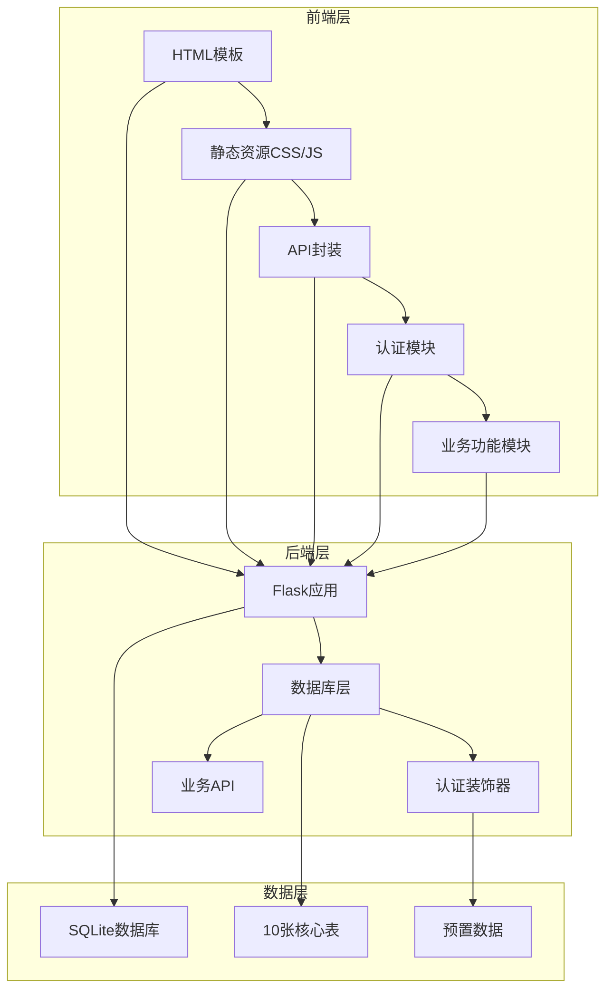
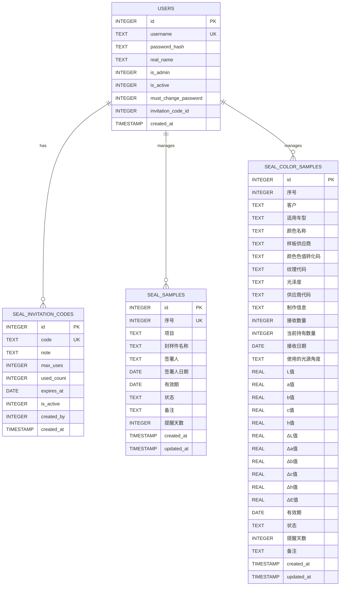
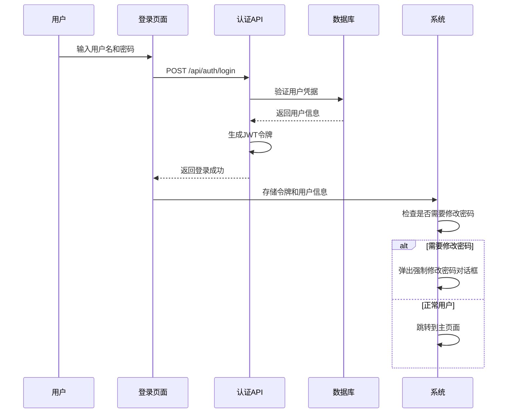
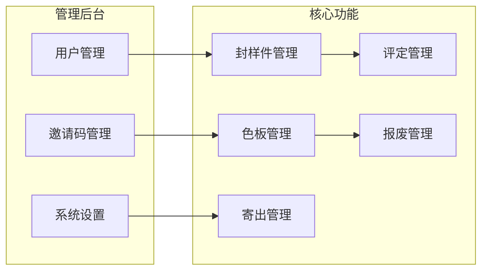
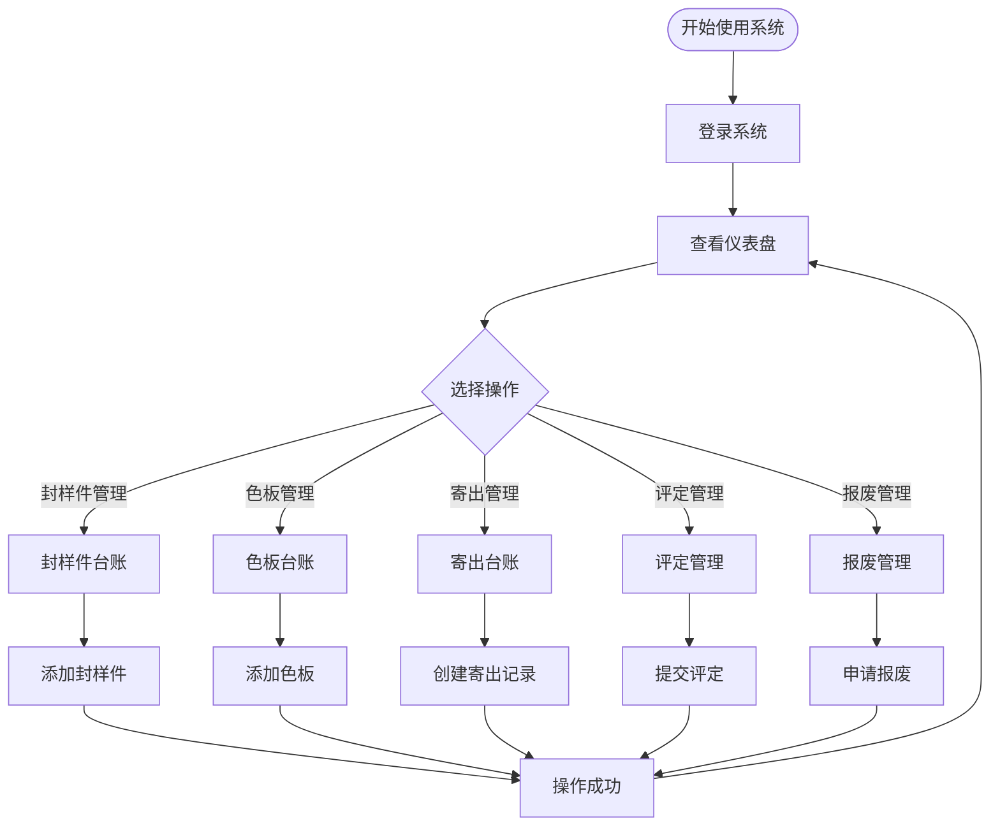

# 快速开始

<cite>
**本文档引用的文件**
- [app.py](file://app.py)
- [requirements.txt](file://requirements.txt)
- [start_server.bat](file://start_server.bat)
- [index.html](file://templates/index.html)
- [login.html](file://templates/login.html)
- [dashboard.html](file://templates/dashboard.html)
- [admin-panel.html](file://templates/admin-panel.html)
- [api.js](file://static/js/api.js)
- [auth.js](file://static/js/auth.js)
- [common.js](file://static/js/common.js)
</cite>

## 目录
1. [简介](#简介)
2. [项目结构](#项目结构)
3. [环境准备](#环境准备)
4. [数据库初始化](#数据库初始化)
5. [服务器启动](#服务器启动)
6. [初始用户配置](#初始用户配置)
7. [系统配置流程](#系统配置流程)
8. [首次使用操作示例](#首次使用操作示例)
9. [常见问题排查](#常见问题排查)
10. [总结](#总结)

## 简介

封样件及色板接收登记管理系统是一个基于Python Flask开发的企业级管理系统，主要用于管理封样件和色板的接收、登记、评定和处置全流程。系统采用SQLite作为数据库，支持JWT认证机制，提供完整的前后端分离架构。

## 项目结构

系统采用典型的前后端分离架构，主要包含以下组件：



**图表来源**
- [app.py:21-335](file://app.py#L21-L335)
- [index.html:1-239](file://templates/index.html#L1-L239)

**章节来源**
- [app.py:1-50](file://app.py#L1-L50)
- [requirements.txt:1-5](file://requirements.txt#L1-L5)

## 环境准备

### 系统要求

- **Python版本**: Python 3.7 或更高版本
- **操作系统**: Windows/Linux/macOS
- **内存**: 至少 2GB RAM
- **磁盘空间**: 至少 50MB 可用空间

### Python环境安装

1. **验证Python安装**
   ```bash
   python --version
   ```

2. **如果未安装Python，请访问官网下载安装**
   - 下载地址: https://www.python.org/downloads/
   - 建议选择最新稳定版本

3. **验证pip安装**
   ```bash
   pip --version
   ```

### 依赖包配置

系统使用以下核心依赖包：

| 依赖包 | 版本要求 | 用途 |
|--------|----------|------|
| Flask | >=3.0.0 | Web框架 |
| Flask-CORS | >=4.0.0 | 跨域支持 |
| PyJWT | >=2.8.0 | JWT令牌处理 |
| openpyxl | >=3.1.0 | Excel文件处理 |

**安装步骤**：
1. 打开命令提示符或终端
2. 导航到项目根目录
3. 执行安装命令：
   ```bash
   pip install -r requirements.txt
   ```

**章节来源**
- [requirements.txt:1-5](file://requirements.txt#L1-L5)

## 数据库初始化

系统使用SQLite作为默认数据库，数据库文件名为 `seal_samples.db`。

### 初始化过程

数据库初始化包含以下步骤：

1. **创建10张核心数据表**
2. **预置管理员用户**
3. **设置系统默认配置**

### 核心数据表结构

系统包含10张核心数据表：



**图表来源**
- [app.py:88-335](file://app.py#L88-L335)

### 预置数据

系统自动创建以下预置数据：

1. **管理员用户**
   - 用户名: `admin`
   - 密码: `admin`
   - 角色: 系统管理员
   - 需要修改密码: 是

2. **系统配置**
   - ΔE优秀阈值: 1.0
   - ΔE合格阈值: 2.0
   - ΔE需关注阈值: 999.0

**章节来源**
- [app.py:286-307](file://app.py#L286-L307)

## 服务器启动

### 方法一：使用批处理脚本（推荐）

1. **双击启动脚本**
   - 在项目根目录找到 `start_server.bat`
   - 双击运行批处理文件

2. **脚本执行流程**
   ```
   步骤1: 设置字符编码为UTF-8
   步骤2: 安装依赖包
   步骤3: 启动Flask服务器
   步骤4: 显示访问地址
   ```

3. **启动脚本内容**
   ```batch
   @echo off
   chcp 65001 >nul
   echo ========================================
   echo   封样件及色板接收登记管理系统
   echo   正在安装依赖并启动服务...
   echo ========================================
   cd /d "%~dp0"
   pip install -r requirements.txt -q
   echo.
   echo 依赖安装完成，正在启动Flask服务器...
   echo.
   echo 访问地址: http://127.0.0.1:5000
   echo 按 Ctrl+C 停止服务器
   echo ========================================
   python app.py
   pause
   ```

### 方法二：手动启动

1. **安装依赖**
   ```bash
   pip install -r requirements.txt
   ```

2. **启动服务器**
   ```bash
   python app.py
   ```

3. **访问系统**
   - 默认地址: http://127.0.0.1:5000
   - 系统会在控制台显示启动信息

**章节来源**
- [start_server.bat:1-17](file://start_server.bat#L1-L17)
- [app.py:21-25](file://app.py#L21-L25)

## 初始用户配置

### 管理员账户

系统默认提供管理员账户用于初始配置：

- **用户名**: admin
- **密码**: admin
- **角色**: 系统管理员
- **状态**: 需要修改密码

### 首次登录流程



**图表来源**
- [login.html:39-73](file://templates/login.html#L39-L73)
- [auth.js:44-67](file://static/js/auth.js#L44-L67)
- [index.html:115-141](file://templates/index.html#L115-L141)

### 密码修改流程

1. **强制修改密码**
   - 首次登录时系统会弹出强制修改密码对话框
   - 需要输入当前密码和新密码
   - 新密码长度至少6位

2. **修改密码要求**
   - 新密码必须与确认密码一致
   - 密码长度不少于6位
   - 修改后需要重新登录

**章节来源**
- [auth.js:123-182](file://static/js/auth.js#L123-L182)
- [app.py:544-570](file://app.py#L544-L570)

## 系统配置流程

### 管理后台功能

系统提供完整的管理后台，供管理员进行系统配置：



**图表来源**
- [admin-panel.html:1-107](file://templates/admin-panel.html#L1-L107)

### ΔE阈值配置

系统支持自定义色差阈值，影响色板评定时的颜色标识：

| 阈值级别 | 默认值 | 描述 |
|----------|--------|------|
| 优秀阈值 | 1.0 | 低于此值显示为绿色"优秀" |
| 合格阈值 | 2.0 | 介于优秀和此值之间显示为黄色"合格" |
| 需关注阈值 | 999.0 | 超过此值显示为红色"需关注" |

### 邀请码管理

系统支持邀请码机制，用于控制用户注册：

1. **生成邀请码**
   - 管理员可以生成唯一的16位邀请码
   - 可设置最大使用次数和过期时间

2. **邀请码状态**
   - 启用/停用状态
   - 已使用次数统计
   - 剩余可用次数

**章节来源**
- [admin-panel.html:51-102](file://templates/admin-panel.html#L51-L102)
- [app.py:1550-1577](file://app.py#L1550-L1577)

## 首次使用操作示例

### 仪表盘概览

系统启动后首先进入仪表盘页面，展示关键统计数据：

1. **统计卡片**
   - 封样件总数
   - 色板总数
   - 近期到期预警数量
   - 最近操作记录

2. **近期到期预警**
   - 显示即将到期的封样件和色板
   - 按剩余天数排序
   - 支持快速查看详情

### 基本操作流程



**图表来源**
- [dashboard.html:1-34](file://templates/dashboard.html#L1-L34)
- [index.html:21-63](file://templates/index.html#L21-L63)

### 常用功能示例

1. **添加封样件**
   - 点击左侧导航"封样件台账"
   - 点击"新增"按钮
   - 填写必填字段
   - 点击"保存"

2. **添加色板**
   - 点击左侧导航"色板台账"
   - 点击"新增"按钮
   - 填写色板基本信息
   - 点击"保存"

3. **创建寄出记录**
   - 点击左侧导航"寄出台账"
   - 点击"新增"按钮
   - 选择关联的色板
   - 填写寄出信息
   - 点击"保存"

**章节来源**
- [index.html:21-63](file://templates/index.html#L21-L63)

## 常见问题排查

### 环境问题

**问题1: Python版本不兼容**
- **症状**: 启动时报错，提示Python版本过低
- **解决方案**: 升级到Python 3.7或更高版本
- **验证方法**: `python --version`

**问题2: pip安装失败**
- **症状**: pip命令不可用或安装失败
- **解决方案**: 
  1. 升级pip: `python -m pip install --upgrade pip`
  2. 使用国内镜像源: `pip install -r requirements.txt -i https://pypi.tuna.tsinghua.edu.cn/simple/`

### 依赖安装问题

**问题3: Flask安装失败**
- **症状**: 安装Flask时报错
- **解决方案**: 
  1. 清理pip缓存: `pip cache purge`
  2. 重新安装: `pip install flask --upgrade`
  3. 使用代理: `pip install -r requirements.txt --proxy http://代理地址`

**问题4: openpyxl依赖冲突**
- **症状**: 安装openpyxl时报错
- **解决方案**: 
  1. 卸载冲突版本: `pip uninstall openpyxl`
  2. 重新安装: `pip install openpyxl==3.1.0`

### 服务器启动问题

**问题5: 端口占用**
- **症状**: 启动时报错，提示端口被占用
- **解决方案**: 
  1. 更改端口: 在app.py中修改`app.run(port=5001)`
  2. 关闭占用进程: `netstat -ano | findstr :5000`

**问题6: CORS跨域问题**
- **症状**: 前端请求被阻止
- **解决方案**: 
  1. 检查Flask-CORS安装: `pip install flask-cors`
  2. 确认CORS配置: `CORS(app)`

### 数据库问题

**问题7: 数据库文件权限**
- **症状**: 系统无法创建或修改数据库文件
- **解决方案**: 
  1. 检查文件夹权限
  2. 以管理员身份运行
  3. 更换数据库文件路径

**问题8: 数据库表结构不完整**
- **症状**: 部分功能无法使用
- **解决方案**: 
  1. 删除现有数据库文件
  2. 重启服务器让系统重新初始化
  3. 检查控制台输出确认初始化完成

### 认证问题

**问题9: 登录失败**
- **症状**: 输入正确凭据仍无法登录
- **解决方案**: 
  1. 检查管理员账户是否存在
  2. 验证密码哈希是否正确
  3. 清除浏览器缓存重新登录

**问题10: Token过期**
- **症状**: 登录后一段时间自动退出
- **解决方案**: 
  1. 检查JWT配置
  2. 验证服务器时间同步
  3. 检查客户端定时刷新逻辑

### 前端问题

**问题11: 页面加载失败**
- **症状**: 页面空白或加载错误
- **解决方案**: 
  1. 检查静态文件路径
  2. 确认模板文件完整性
  3. 查看浏览器控制台错误

**问题12: API请求失败**
- **症状**: 功能按钮点击无响应
- **解决方案**: 
  1. 检查网络连接
  2. 确认服务器正常运行
  3. 查看API响应状态

**章节来源**
- [api.js:20-41](file://static/js/api.js#L20-L41)
- [auth.js:44-67](file://static/js/auth.js#L44-L67)

## 总结

封样件及色板接收登记管理系统提供了完整的开发和部署指导。通过遵循本快速开始指南，开发者可以：

1. **快速搭建环境**: 完成Python环境和依赖包配置
2. **成功启动系统**: 通过批处理脚本或手动方式启动服务器
3. **完成初始配置**: 使用管理员账户登录并进行系统配置
4. **体验核心功能**: 通过仪表盘和各功能模块了解系统能力
5. **解决常见问题**: 掌握故障排查和问题解决方法

系统采用现代化的技术栈和设计模式，具有良好的扩展性和维护性。建议在生产环境中进一步完善安全配置和性能优化。