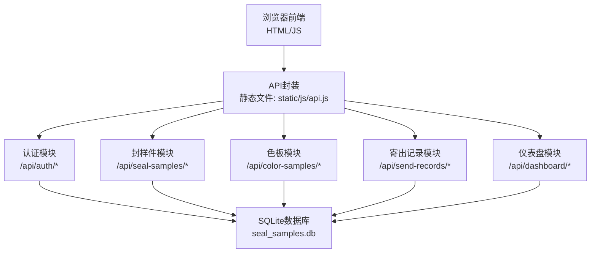
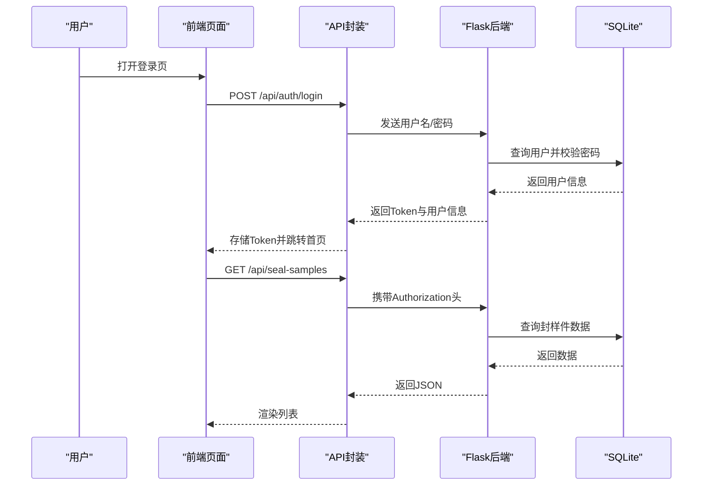
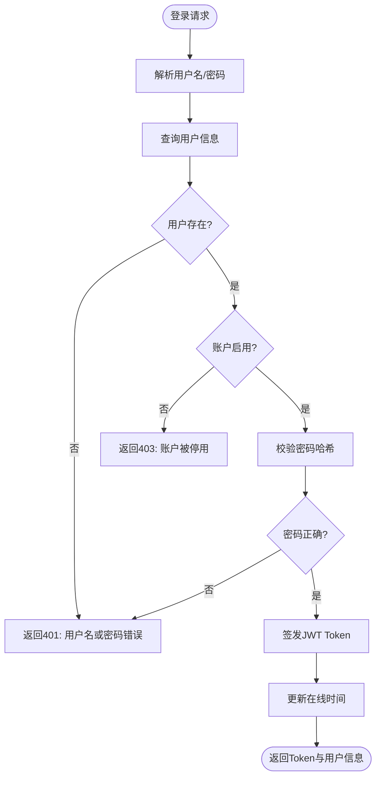
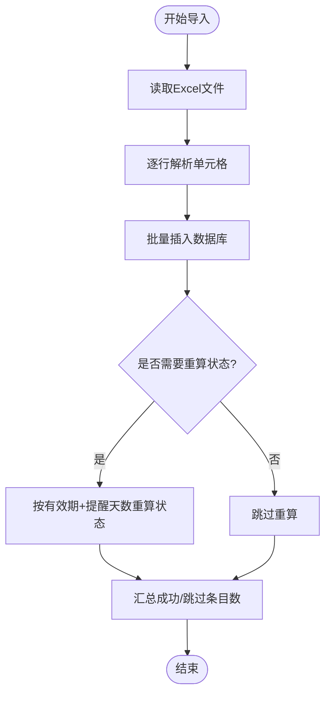
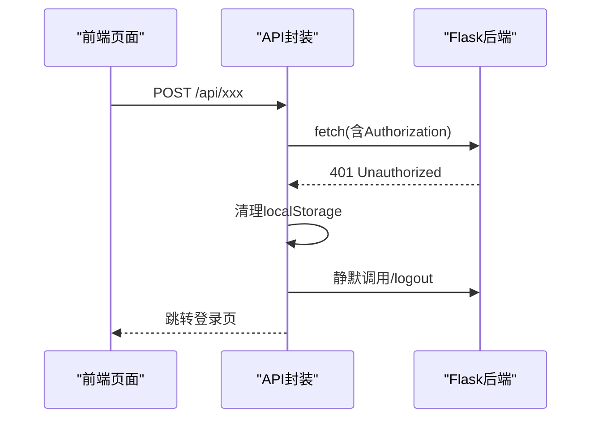
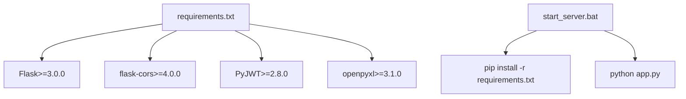

# 故障排除

<cite>
**本文引用的文件**
- [app.py](file://app.py)
- [requirements.txt](file://requirements.txt)
- [start_server.bat](file://start_server.bat)
- [templates/login.html](file://templates/login.html)
- [static/js/api.js](file://static/js/api.js)
- [static/js/auth.js](file://static/js/auth.js)
- [static/js/common.js](file://static/js/common.js)
- [static/js/dashboard.js](file://static/js/dashboard.js)
- [static/js/color-sample.js](file://static/js/color-sample.js)
- [static/js/seal-sample.js](file://static/js/seal-sample.js)
</cite>

## 目录
1. [简介](#简介)
2. [项目结构](#项目结构)
3. [核心组件](#核心组件)
4. [架构总览](#架构总览)
5. [详细组件分析](#详细组件分析)
6. [依赖分析](#依赖分析)
7. [性能考虑](#性能考虑)
8. [故障排除指南](#故障排除指南)
9. [结论](#结论)
10. [附录](#附录)

## 简介
本故障排除文档面向“封样件及色板接收登记管理系统”，聚焦后端Flask服务与前端JavaScript交互的常见问题，覆盖登录失败、数据导入错误、API调用异常、跨域与网络问题、日志分析与定位、性能瓶颈、系统崩溃与异常重启恢复、数据不一致与同步修复、第三方依赖排查以及紧急故障应急流程。

## 项目结构
系统采用前后端分离思路：前端HTML/JS通过API模块统一访问后端REST接口；后端基于Flask提供认证、封样件与色板台账、寄出记录、仪表盘等接口；数据库为SQLite，使用openpyxl进行Excel导入导出；CORS中间件支持跨域。

**图表来源**
- [app.py](file://app.py)
- [static/js/api.js](file://static/js/api.js)

**章节来源**
- [app.py:1-50](file://app.py#L1-L50)
- [requirements.txt:1-5](file://requirements.txt#L1-L5)
- [start_server.bat:1-17](file://start_server.bat#L1-L17)

## 核心组件
- 认证与鉴权：JWT Token校验、管理员权限控制、在线状态维护
- 数据模型：用户、封样件、色板、寄出记录、有效期管理、评定记录、报废记录、系统设置、用户表格配置
- 导入导出：基于openpyxl的Excel读写
- 前端API封装：统一fetch请求、401自动跳转、上传处理
- 页面脚本：登录、仪表盘、封样件/色板列表与表单、寄出流程

**章节来源**
- [app.py:88-335](file://app.py#L88-L335)
- [app.py:454-588](file://app.py#L454-L588)
- [app.py:592-795](file://app.py#L592-L795)
- [app.py:798-1041](file://app.py#L798-L1041)
- [app.py:1044-1181](file://app.py#L1044-L1181)
- [app.py:2082-2197](file://app.py#L2082-L2197)
- [static/js/api.js:1-88](file://static/js/api.js#L1-L88)
- [static/js/auth.js:1-204](file://static/js/auth.js#L1-L204)
- [static/js/common.js:1-135](file://static/js/common.js#L1-L135)
- [static/js/dashboard.js:1-117](file://static/js/dashboard.js#L1-L117)
- [static/js/color-sample.js:1-267](file://static/js/color-sample.js#L1-L267)
- [static/js/seal-sample.js:1-181](file://static/js/seal-sample.js#L1-L181)

## 架构总览
系统采用“前端SPA + 后端REST API”的轻量架构。前端通过API模块统一发起请求，携带Authorization头；后端通过装饰器校验Token，执行业务逻辑并返回JSON；数据库为本地SQLite，适合单机部署与演示环境。

**图表来源**
- [templates/login.html:1-144](file://templates/login.html#L1-L144)
- [static/js/api.js:1-88](file://static/js/api.js#L1-L88)
- [static/js/auth.js:42-68](file://static/js/auth.js#L42-L68)
- [app.py:454-494](file://app.py#L454-L494)
- [app.py:592-624](file://app.py#L592-L624)

## 详细组件分析

### 认证与鉴权组件
- Token校验：支持Header与Query两种方式；过期/无效返回401；管理员权限403
- 在线状态：登录与心跳接口更新last_active
- 注册：校验邀请码有效性与使用次数，创建用户并更新邀请码计数

**图表来源**
- [app.py:454-494](file://app.py#L454-L494)
- [app.py:572-579](file://app.py#L572-L579)

**章节来源**
- [app.py:49-84](file://app.py#L49-L84)
- [app.py:454-588](file://app.py#L454-L588)

### 封样件与色板导入组件
- Excel导入：openpyxl读取工作簿，逐行解析并插入数据库；支持跳过空行与异常行
- 导入错误：捕获异常并返回“导入失败”消息；部分成功时返回成功/跳过条目数
- 状态重算：导入后按有效期与提醒天数重算状态

**图表来源**
- [app.py:720-795](file://app.py#L720-L795)
- [app.py:952-1041](file://app.py#L952-L1041)

**章节来源**
- [app.py:720-795](file://app.py#L720-L795)
- [app.py:952-1041](file://app.py#L952-L1041)

### 前端API与错误处理
- 统一请求：自动附加Authorization头；401时清理本地Token并跳转登录
- 上传：FormData上传文件，401时同样处理
- 错误提示：网络失败弹出Toast；后端返回message用于展示

**图表来源**
- [static/js/api.js:1-88](file://static/js/api.js#L1-L88)

**章节来源**
- [static/js/api.js:1-88](file://static/js/api.js#L1-L88)

## 依赖分析
- Flask版本要求：>=3.0.0
- CORS支持：flask-cors>=4.0.0
- JWT：PyJWT>=2.8.0
- Excel：openpyxl>=3.1.0
- 启动脚本：自动安装依赖并启动Flask

**图表来源**
- [requirements.txt:1-5](file://requirements.txt#L1-L5)
- [start_server.bat:1-17](file://start_server.bat#L1-L17)

**章节来源**
- [requirements.txt:1-5](file://requirements.txt#L1-L5)
- [start_server.bat:1-17](file://start_server.bat#L1-L17)

## 性能考虑
- 数据库查询：导入与列表接口涉及多表查询与循环处理，建议：
  - 为常用查询字段建立索引（如有效期、状态、创建时间）
  - 分页参数pageSize合理设置，避免一次性全量返回
  - 导入时批量插入，减少事务次数
- 前端渲染：大数据量时启用虚拟滚动或更小的分页尺寸
- Excel处理：大文件导入建议拆分批次，避免内存峰值过高
- Token与在线状态：心跳接口频繁调用时可降低频率，避免数据库写放大

[本节为通用性能指导，无需特定文件引用]

## 故障排除指南

### 一、登录失败
- 现象
  - 输入正确凭据仍提示“用户名或密码错误”
  - 账户被停用但提示“账户已被停用，请联系管理员”
- 可能原因
  - 密码哈希不匹配（密码长度或字符集问题）
  - 账户被禁用或不存在
  - Token过期或无效
- 诊断步骤
  - 检查后端日志中认证接口返回码与消息
  - 确认前端是否携带Authorization头
  - 核对数据库users表字段与哈希值
- 解决方案
  - 重新注册并使用邀请码创建账户
  - 修改密码后重新登录
  - 清理浏览器缓存与localStorage后重试

**章节来源**
- [app.py:454-494](file://app.py#L454-L494)
- [app.py:49-84](file://app.py#L49-L84)
- [static/js/api.js:20-33](file://static/js/api.js#L20-L33)

### 二、数据导入错误
- 现象
  - 导入后提示“导入失败: …”或部分行跳过
  - 成功条数与实际不符
- 可能原因
  - Excel列顺序或字段不匹配
  - 日期格式不规范（非YYYY-MM-DD）
  - 数值字段为空或非数字
- 诊断步骤
  - 查看后端导入接口返回的错误摘要
  - 检查首条跳过的具体行列与值
  - 核对模板字段与实际数据
- 解决方案
  - 使用系统导出模板作为导入依据
  - 规范日期与数值格式
  - 分批导入并观察错误行位置

**章节来源**
- [app.py:720-795](file://app.py#L720-L795)
- [app.py:952-1041](file://app.py#L952-L1041)

### 三、API调用异常
- 现象
  - 前端弹出“网络请求失败，请检查连接”
  - 后端返回401/403/404/500
- 可能原因
  - Token缺失或过期
  - 权限不足（非管理员访问管理接口）
  - 资源不存在（ID错误）
  - 服务器内部异常
- 诊断步骤
  - 检查浏览器Network面板与响应状态码
  - 确认Authorization头是否包含Bearer Token
  - 查看后端日志中的异常堆栈
- 解决方案
  - 重新登录获取新Token
  - 确认接口权限与资源ID
  - 修复后端异常并重启服务

**章节来源**
- [static/js/api.js:14-42](file://static/js/api.js#L14-L42)
- [app.py:49-84](file://app.py#L49-L84)
- [app.py:592-624](file://app.py#L592-L624)

### 四、跨域与网络问题
- 现象
  - 浏览器报跨域错误
  - 请求被CORS拦截
- 可能原因
  - 前后端端口不同或Origin不在允许范围
- 诊断步骤
  - 检查浏览器开发者工具Headers中的CORS相关字段
  - 确认Flask-CORS已启用
- 解决方案
  - 使用同一域名/端口或配置允许的Origin
  - 生产环境建议通过反向代理统一入口

**章节来源**
- [app.py:22](file://app.py#L22)

### 五、日志分析与问题定位
- 后端日志
  - 关注认证、导入、查询接口的异常堆栈
  - 注意get_expiry_status等工具函数的警告日志
- 前端错误
  - Network面板查看401/404/500
  - Console查看API封装抛出的“网络请求失败”提示
- 定位技巧
  - 结合请求URL与参数，缩小问题范围
  - 对比成功/失败用例，定位字段或格式差异

**章节来源**
- [app.py:368-370](file://app.py#L368-L370)
- [static/js/api.js:37-41](file://static/js/api.js#L37-L41)

### 六、性能问题识别与优化
- 识别
  - 列表加载缓慢、导入耗时过长、Excel处理内存飙升
- 优化
  - 合理分页与索引
  - 批量插入与事务合并
  - 控制Excel单次处理行数
  - 减少不必要的状态重算

**章节来源**
- [app.py:777-788](file://app.py#L777-L788)
- [app.py:1031-1034](file://app.py#L1031-L1034)

### 七、系统崩溃与异常重启
- 现象
  - 服务进程异常退出
- 处理流程
  - 查看Windows任务管理器或命令行输出
  - 检查Python异常堆栈与依赖安装情况
  - 使用启动脚本自动安装依赖并重启服务
- 预防
  - 生产环境使用守护进程或容器化部署
  - 定期备份数据库与配置

**章节来源**
- [start_server.bat:1-17](file://start_server.bat#L1-L17)

### 八、数据不一致与同步问题
- 现象
  - 导入后状态未及时更新
  - 色差ΔE值未自动计算
- 修复
  - 导入完成后触发状态重算
  - 更新色板记录时自动补算ΔE值
  - 核对有效期与提醒天数逻辑

**章节来源**
- [app.py:777-788](file://app.py#L777-L788)
- [app.py:1024-1034](file://app.py#L1024-L1034)

### 九、第三方依赖问题
- 现象
  - 启动时报错缺少模块
  - openpyxl无法读取/写入Excel
- 排查
  - 使用启动脚本安装requirements.txt
  - 确认Python版本与依赖兼容性
- 解决
  - 重新执行pip安装
  - 升级至推荐版本范围

**章节来源**
- [requirements.txt:1-5](file://requirements.txt#L1-L5)
- [start_server.bat:8](file://start_server.bat#L8)

### 十、紧急故障应急流程
- 立即行动
  - 记录现象、URL、状态码、错误消息
  - 检查Token是否有效、网络连通性
- 临时措施
  - 清理localStorage并重新登录
  - 使用最小化数据集验证功能
- 深入排查
  - 查看后端日志与异常堆栈
  - 对比前后版本变更
- 恢复上线
  - 修复后进行回归测试
  - 逐步扩大影响范围

[本节为通用应急流程，无需特定文件引用]

## 结论
本系统以Flask+SQLite+JWT+openpyxl为核心，前端通过API模块统一访问后端接口。常见问题集中在认证失败、导入异常、跨域与网络、性能瓶颈等方面。建议结合本文提供的诊断步骤与优化策略，快速定位并解决问题；生产环境应加强日志监控、依赖管理与备份恢复机制。

## 附录

### A. HTTP状态码与业务错误码对照
- 400：请求参数不合法（如注册/登录/修改密码字段缺失、密码长度不足、邀请码无效等）
- 401：未提供Token、Token无效或过期、账户被停用（业务码：ACCOUNT_DISABLED）
- 403：需要管理员权限
- 404：资源不存在（如封样件/色板记录）
- 500：服务器内部异常（如导入过程中的未捕获异常）

**章节来源**
- [app.py:49-84](file://app.py#L49-L84)
- [app.py:454-588](file://app.py#L454-L588)
- [app.py:592-624](file://app.py#L592-L624)
- [app.py:720-795](file://app.py#L720-L795)
- [app.py:952-1041](file://app.py#L952-L1041)

### B. 前端错误提示与定位
- 登录/注册：表单校验失败会弹出Toast提示
- API请求失败：统一提示“网络请求失败，请检查连接”
- 401自动跳转：清理localStorage并跳转登录页

**章节来源**
- [static/js/auth.js:42-108](file://static/js/auth.js#L42-L108)
- [static/js/api.js:20-41](file://static/js/api.js#L20-L41)