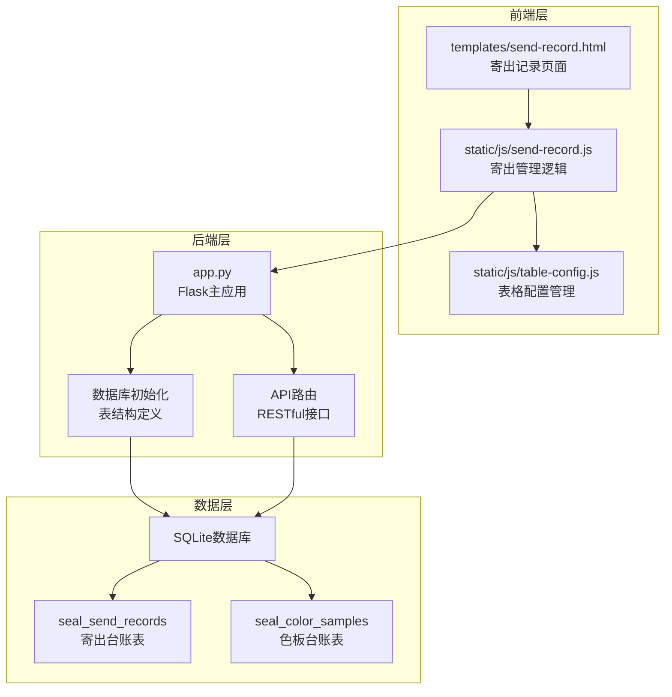
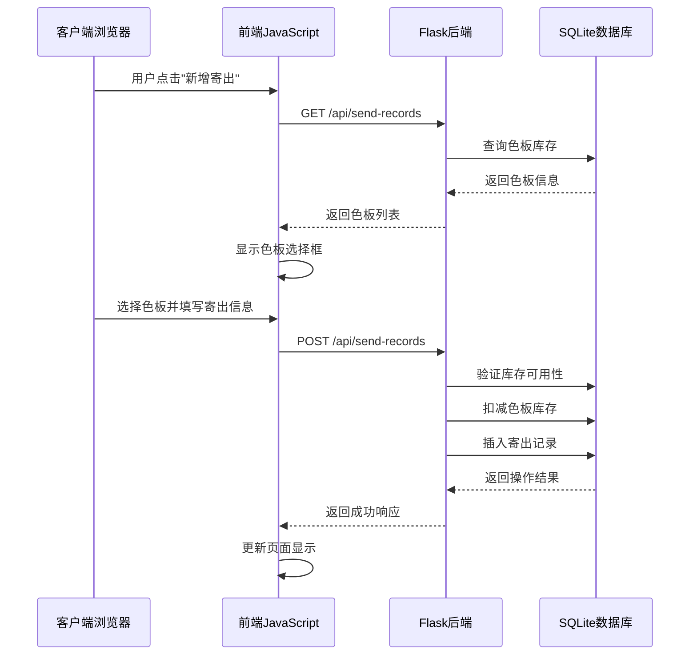
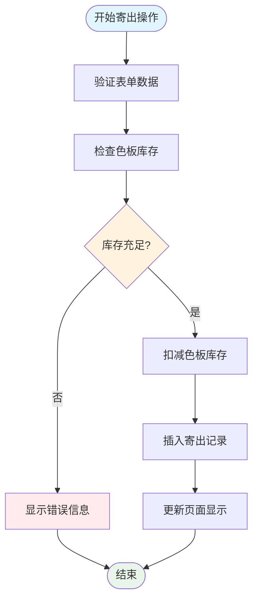
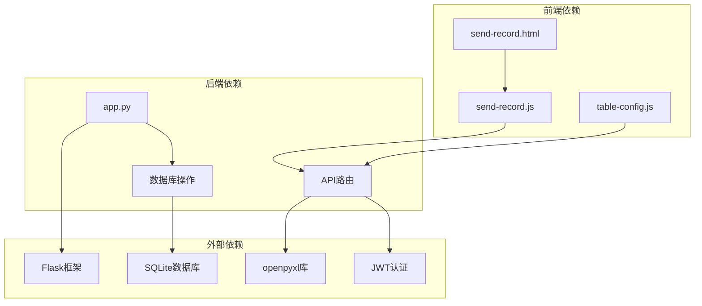

# 寄出台账表 (seal_send_records)

<cite>
**本文档引用的文件**
- [app.py](file://app.py)
- [send-record.js](file://static/js/send-record.js)
- [send-record.html](file://templates/send-record.html)
- [table-config.js](file://static/js/table-config.js)
</cite>

## 目录
1. [简介](#简介)
2. [项目结构](#项目结构)
3. [核心组件](#核心组件)
4. [架构概览](#架构概览)
5. [详细组件分析](#详细组件分析)
6. [依赖关系分析](#依赖关系分析)
7. [性能考虑](#性能考虑)
8. [故障排除指南](#故障排除指南)
9. [结论](#结论)

## 简介

寄出台账表(seal_send_records)是封样件及色板接收登记管理系统中的核心业务表，用于记录色板的寄出操作和库存变动情况。该表与色板台账表(seal_color_samples)建立外键关联，实现了完整的库存联动机制，确保寄出操作的准确性和可追溯性。

本系统采用Flask + SQLite + JWT + openpyxl的技术栈，提供完整的寄出管理功能，包括实时库存扣减、审计追踪、报表导出等特性。

## 项目结构

系统采用前后端分离架构，主要文件组织如下：

**图表来源**
- [app.py:88-335](file://app.py#L88-L335)
- [send-record.html:1-31](file://templates/send-record.html#L1-L31)

**章节来源**
- [app.py:1-50](file://app.py#L1-L50)
- [send-record.html:1-31](file://templates/send-record.html#L1-L31)

## 核心组件

### 数据库表结构

寄出台账表(seal_send_records)采用SQLite存储，包含以下核心字段：

| 字段名 | 数据类型 | 约束 | 描述 |
|--------|----------|------|------|
| id | INTEGER | PRIMARY KEY AUTOINCREMENT | 主键标识符 |
| sample_id | INTEGER | NOT NULL | 关联色板ID，外键约束 |
| 客户 | TEXT |  | 客户名称 |
| 颜色名称 | TEXT |  | 颜色名称 |
| 对方单位 | TEXT | NOT NULL | 寄件单位 |
| 寄出数量 | INTEGER | NOT NULL | 寄出数量 |
| 寄出日期 | DATE | NOT NULL | 寄件日期 |
| 经手人 | TEXT |  | 经办人员 |
| 备注 | TEXT |  | 备注信息 |
| created_at | TIMESTAMP | DEFAULT CURRENT_TIMESTAMP | 创建时间戳 |

**章节来源**
- [app.py:202-217](file://app.py#L202-L217)

### 外键关系设计

系统通过外键约束确保数据完整性：
- `sample_id` 字段引用 `seal_color_samples(id)`
- 实现级联约束，保证色板记录的完整性
- 支持ON DELETE CASCADE，删除色板时自动清理相关寄出记录

**章节来源**
- [app.py:215](file://app.py#L215)

## 架构概览

系统采用三层架构设计，实现业务逻辑与数据访问的分离：

**图表来源**
- [send-record.js:118-130](file://static/js/send-record.js#L118-L130)
- [app.py:1110-1140](file://app.py#L1110-L1140)

**章节来源**
- [send-record.js:1-156](file://static/js/send-record.js#L1-L156)
- [app.py:1044-1170](file://app.py#L1044-L1170)

## 详细组件分析

### 寄出记录管理API

系统提供完整的RESTful API支持寄出记录的CRUD操作：

#### GET /api/send-records
- 支持动态筛选条件
- 支持分页查询
- 支持按客户、颜色名称、对方单位等字段筛选
- 返回包含色板客户信息的联合查询结果

#### POST /api/send-records
- 创建新的寄出记录
- 实时验证库存可用性
- 自动扣减色板库存
- 返回操作结果和库存状态

#### DELETE /api/send-records/{id}
- 删除寄出记录
- 自动恢复色板库存
- 支持审计追踪

**章节来源**
- [app.py:1044-1170](file://app.py#L1044-L1170)

### 前端交互组件

前端采用模块化JavaScript实现，提供丰富的用户交互体验：

#### 寄出表单组件
- 色板选择下拉框，支持搜索和过滤
- 实时库存检查和提示
- 表单验证和错误处理
- 模态框界面设计

#### 数据表格组件
- 动态列配置
- 筛选工具栏
- 分页导航
- 导出功能

**章节来源**
- [send-record.js:55-130](file://static/js/send-record.js#L55-L130)
- [send-record.html:1-31](file://templates/send-record.html#L1-L31)

### 库存联动机制

系统实现了精确的库存联动机制：

**图表来源**
- [send-record.js:118-130](file://static/js/send-record.js#L118-L130)
- [app.py:1112-1140](file://app.py#L1112-L1140)

**章节来源**
- [send-record.js:97-116](file://static/js/send-record.js#L97-L116)
- [app.py:1119-1139](file://app.py#L1119-L1139)

### 审计追踪与历史记录

系统提供完整的审计追踪功能：

#### 时间戳管理
- `created_at` 字段自动记录创建时间
- 支持历史记录查询
- 提供时间范围筛选功能

#### 操作日志
- 寄出记录的创建、删除操作都会产生审计日志
- 支持导出审计记录
- 提供操作员身份识别

**章节来源**
- [app.py:1157-1170](file://app.py#L1157-L1170)

### 报表生成功能

系统支持多种报表导出格式：

#### Excel报表导出
- 寄出台账Excel报表
- 包含所有寄出记录详情
- 支持批量导出和筛选导出

#### 自定义报表
- 支持按时间段筛选
- 支持按客户、颜色名称等维度统计
- 提供数据可视化基础

**章节来源**
- [app.py:1157-1170](file://app.py#L1157-L1170)

## 依赖关系分析

系统各组件之间的依赖关系如下：

**图表来源**
- [app.py:1-25](file://app.py#L1-L25)
- [send-record.js:1-156](file://static/js/send-record.js#L1-L156)

**章节来源**
- [app.py:1-25](file://app.py#L1-L25)
- [send-record.js:1-156](file://static/js/send-record.js#L1-L156)

## 性能考虑

### 数据库优化策略

1. **索引设计**
   - 在常用查询字段上建立索引
   - 优化WHERE条件的查询性能
   - 支持复合索引提高复杂查询效率

2. **查询优化**
   - 使用LEFT JOIN优化联合查询
   - 实施分页查询避免大数据量加载
   - 优化动态筛选条件的SQL生成

3. **连接池管理**
   - 实现数据库连接复用
   - 合理管理事务生命周期
   - 避免连接泄漏问题

### 前端性能优化

1. **懒加载机制**
   - 表格数据按需加载
   - 模态框内容延迟渲染
   - 图片和资源的智能加载

2. **缓存策略**
   - 本地存储用户配置
   - API响应数据缓存
   - 减少重复请求

## 故障排除指南

### 常见问题及解决方案

#### 寄出数量超限
**问题现象**: 寄出数量大于当前持有数量
**解决方法**: 
- 检查色板当前持有数量
- 确认库存数据准确性
- 验证色板状态是否正常

#### 外键约束错误
**问题现象**: 无法创建寄出记录
**解决方法**:
- 确认关联的色板ID是否存在
- 检查色板状态是否为正常
- 验证数据库外键约束

#### 库存扣减异常
**问题现象**: 寄出后库存未更新
**解决方法**:
- 检查数据库事务是否提交
- 验证库存扣减逻辑
- 查看数据库日志

**章节来源**
- [app.py:1119-1155](file://app.py#L1119-L1155)
- [send-record.js:118-130](file://static/js/send-record.js#L118-L130)

## 结论

寄出台账表(seal_send_records)作为系统的核心业务表，通过精心设计的数据库结构和完善的业务逻辑，实现了色板寄出管理的完整闭环。系统的主要优势包括：

1. **数据完整性保障**: 通过外键约束和业务验证确保数据一致性
2. **实时库存联动**: 自动化的库存扣减和恢复机制
3. **完整的审计追踪**: 提供可追溯的操作历史记录
4. **灵活的查询统计**: 支持多种筛选条件和报表导出
5. **良好的用户体验**: 直观的界面设计和响应式交互

该系统为色板寄出管理提供了可靠的技术支撑，能够满足企业级应用的需求，并为未来的功能扩展奠定了坚实的基础。