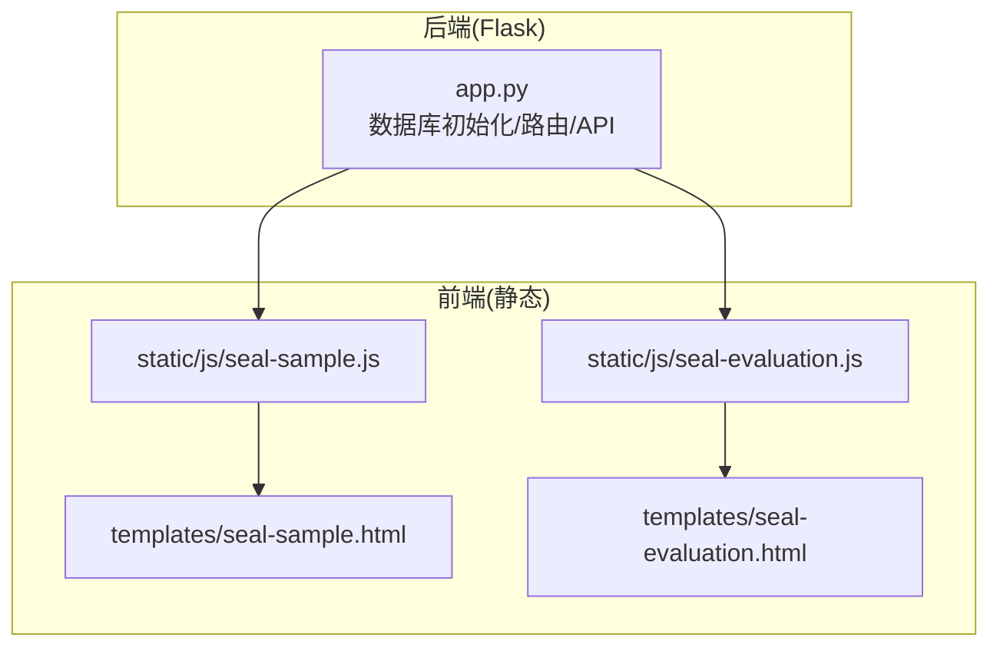
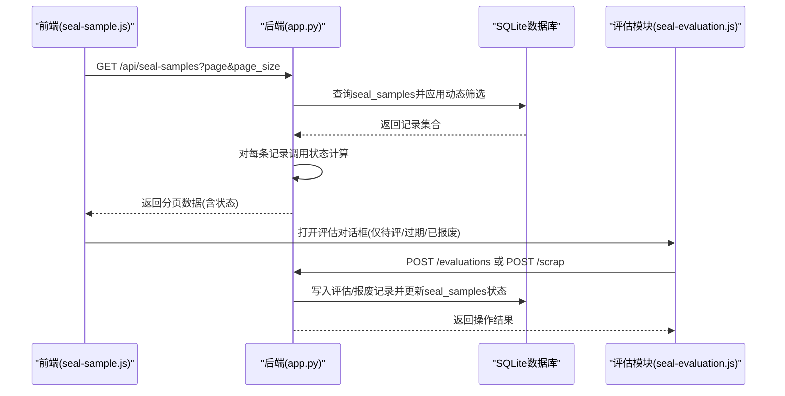
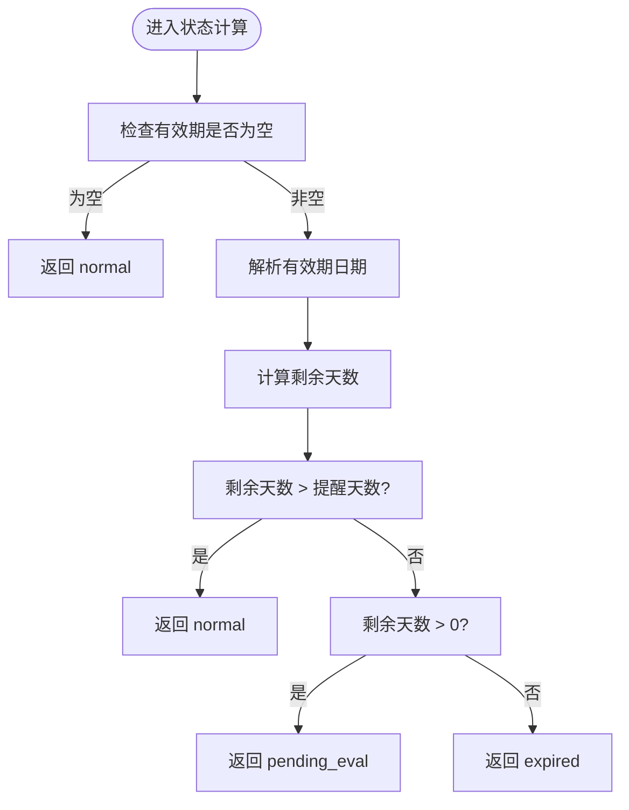
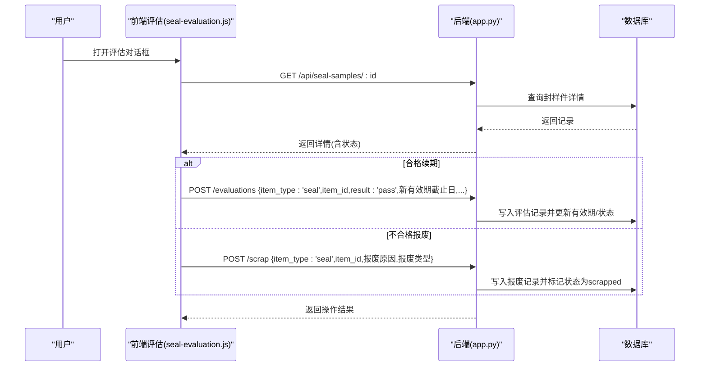
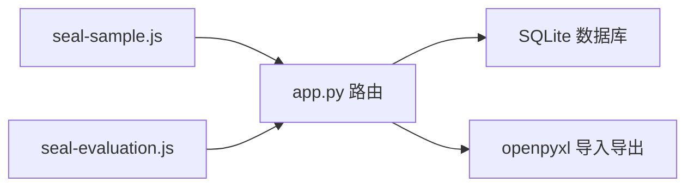

# 封样件台账表 (seal_samples)

<cite>
**本文引用的文件**
- [app.py](file://app.py)
- [seal-sample.js](file://static/js/seal-sample.js)
- [seal-evaluation.js](file://static/js/seal-evaluation.js)
- [seal-sample.html](file://templates/seal-sample.html)
- [seal-evaluation.html](file://templates/seal-evaluation.html)
</cite>

## 目录
1. [简介](#简介)
2. [项目结构](#项目结构)
3. [核心组件](#核心组件)
4. [架构总览](#架构总览)
5. [详细组件分析](#详细组件分析)
6. [依赖分析](#依赖分析)
7. [性能考虑](#性能考虑)
8. [故障排查指南](#故障排查指南)
9. [结论](#结论)
10. [附录](#附录)

## 简介
本文件为封样件台账表(seal_samples)的数据库表结构与业务实现文档，覆盖字段定义、编号生成规则、有效期管理与状态计算机制、查询筛选优化策略，以及封样件生命周期管理与到期提醒功能的实现细节。目标是帮助开发者与使用者准确理解表结构、字段语义与前后端交互流程。

## 项目结构
本项目采用Flask后端 + SQLite数据库 + 前端静态资源的单体式架构：
- 后端：数据库初始化、API路由、状态计算、导出导入等逻辑集中在后端脚本中
- 前端：以HTML模板与JS模块化脚本构成，负责表格渲染、筛选、导入导出、评估对话框等

图表来源
- [app.py:88-335](file://app.py#L88-L335)
- [seal-sample.js:1-181](file://static/js/seal-sample.js#L1-L181)
- [seal-evaluation.js:1-214](file://static/js/seal-evaluation.js#L1-L214)
- [seal-sample.html:1-45](file://templates/seal-sample.html#L1-L45)
- [seal-evaluation.html:1-24](file://templates/seal-evaluation.html#L1-L24)

章节来源
- [app.py:88-335](file://app.py#L88-L335)
- [seal-sample.js:1-181](file://static/js/seal-sample.js#L1-L181)
- [seal-evaluation.js:1-214](file://static/js/seal-evaluation.js#L1-L214)
- [seal-sample.html:1-45](file://templates/seal-sample.html#L1-L45)
- [seal-evaluation.html:1-24](file://templates/seal-evaluation.html#L1-L24)

## 核心组件
- 数据库表：seal_samples（封样件台账）
- 工具函数：有效期状态计算(get_expiry_status)
- API接口：封样件CRUD、导出导入、仪表盘预警
- 前端模块：封样件列表/表单、动态筛选、导入导出、评估对话框

章节来源
- [app.py:129-144](file://app.py#L129-L144)
- [app.py:350-371](file://app.py#L350-L371)
- [app.py:593-795](file://app.py#L593-L795)
- [seal-sample.js:1-181](file://static/js/seal-sample.js#L1-L181)
- [seal-evaluation.js:1-214](file://static/js/seal-evaluation.js#L1-L214)

## 架构总览
后端负责：
- 初始化数据库并创建seal_samples表
- 提供封样件CRUD、动态筛选、分页、导出导入
- 计算有效期状态(normal/pending_eval/expired)
- 仪表盘预警查询(近期到期)

前端负责：
- 渲染封样件列表与表单
- 动态筛选与列配置
- 导入导出、评估对话框、状态标签展示

图表来源
- [app.py:593-623](file://app.py#L593-L623)
- [app.py:625-680](file://app.py#L625-L680)
- [app.py:2116-2154](file://app.py#L2116-L2154)
- [seal-sample.js:1-181](file://static/js/seal-sample.js#L1-L181)
- [seal-evaluation.js:1-214](file://static/js/seal-evaluation.js#L1-L214)

## 详细组件分析

### 数据库表结构：seal_samples
- 主键：id (INTEGER PRIMARY KEY AUTOINCREMENT)
- 唯一编号：序号(INTEGER UNIQUE)
- 业务字段：项目(TEXT)、封样件名称(TEXT)、签署人(TEXT)、签署人日期(DATE)、有效期(DATE)
- 状态：状态(TEXT DEFAULT 'normal')
- 其他：备注(TEXT)、created_at(TIMESTAMP DEFAULT CURRENT_TIMESTAMP)、updated_at(TIMESTAMP DEFAULT CURRENT_TIMESTAMP)
- 提醒天数：提醒天数(INTEGER DEFAULT 30)，用于到期前N天转为“待评定”

字段约束与默认值
- 序号唯一，防止重复
- created_at/updated_at自动维护
- 状态默认normal，由工具函数动态计算

章节来源
- [app.py:129-144](file://app.py#L129-L144)
- [app.py:146-150](file://app.py#L146-L150)

### 字段定义与含义
- id：自增主键
- 序号：唯一编号，新增时自动生成(GKYJ-年月日时分秒)
- 项目：项目名称
- 封样件名称：封样件名称
- 签署人：签署人
- 签署人日期：签署人日期
- 有效期：有效期截止日期
- 状态：normal/pending_eval/expired/scrapped
- 备注：备注
- created_at/updated_at：创建与更新时间
- 提醒天数：到期前N天转为待评定

章节来源
- [app.py:129-144](file://app.py#L129-L144)
- [app.py:636-643](file://app.py#L636-L643)
- [seal-sample.js:67-82](file://static/js/seal-sample.js#L67-L82)

### 编号生成规则
- 规则：GKYJ-年月日时分秒
- 生成时机：新增时由后端自动生成并写入序号字段
- 前端提示：序号为只读，不可修改

章节来源
- [app.py:636-637](file://app.py#L636-L637)
- [seal-sample.js:67-68](file://static/js/seal-sample.js#L67-L68)

### 有效期管理与状态计算机制
- 状态计算函数：get_expiry_status(expiry_date, remind_days)
  - 输入：有效期截止日期字符串、提醒天数
  - 输出：normal/pending_eval/expired
  - 规则：
    - 有效期为空 → normal
    - 有效期距离今天大于提醒天数 → normal
    - 有效期距离今天在(0, 提醒天数]之间 → pending_eval
    - 有效期已过期 → expired
- 列表与详情接口：
  - 列表接口：对每条记录若状态为normal，动态计算真实状态
  - 详情接口：若状态为normal，动态计算真实状态
- 仪表盘预警：查询有效期≤30天(含已过期)的封样件，按剩余天数排序

图表来源
- [app.py:350-371](file://app.py#L350-L371)
- [app.py:619-623](file://app.py#L619-L623)
- [app.py:655-658](file://app.py#L655-L658)
- [app.py:2124-2136](file://app.py#L2124-L2136)

章节来源
- [app.py:350-371](file://app.py#L350-L371)
- [app.py:619-623](file://app.py#L619-L623)
- [app.py:655-658](file://app.py#L655-L658)
- [app.py:2124-2136](file://app.py#L2124-L2136)

### 查询与筛选优化策略
- 动态筛选参数：f_field_i/f_op_i/f_val_i
  - 支持操作符：包含/不包含、等于/不等于、大于/小于、日期before/after、为空
  - SQL安全：字段名白名单过滤，避免SQL注入
- 兼容旧参数：search(名称/签署人)、project(项目)
- 分页：支持pageSize=0返回全量；默认按id倒序
- 建议索引(性能优化建议)：
  - 有效期：WHERE 有效期 IS NOT NULL AND 有效期 <= ? ORDER BY 有效期
  - 状态：WHERE 状态 IN ('pending_eval','expired','scrapped')
  - 项目/名称：模糊匹配时建议在项目/封样件名称上建立索引
- 前端优化：
  - 动态筛选面板与列配置持久化
  - 导出时动态计算状态，避免存储冗余

章节来源
- [app.py:403-449](file://app.py#L403-L449)
- [app.py:593-623](file://app.py#L593-L623)
- [seal-sample.js:8-24](file://static/js/seal-sample.js#L8-L24)

### 生命周期管理与到期提醒
- 生命周期阶段：
  - 正常(normal)：有效期未临近
  - 待评定(pending_eval)：有效期距离今天≤提醒天数
  - 已过期(expired)：有效期已过期
  - 已报废(scrapped)：经评估后报废
- 到期提醒：
  - 仪表盘“近期到期预警”：查询有效期≤30天(含已过期)并排序
  - 评估对话框：仅对pending_eval/expired/scrapped开放
- 评估与报废：
  - 合格续期(pass)：提交新有效期，更新seal_samples状态为normal
  - 不合格报废(fail)：提交报废原因与类型，标记状态为scrapped

图表来源
- [seal-evaluation.js:95-199](file://static/js/seal-evaluation.js#L95-L199)
- [app.py:625-680](file://app.py#L625-L680)
- [app.py:1943-2037](file://app.py#L1943-L2037)

章节来源
- [seal-evaluation.js:1-214](file://static/js/seal-evaluation.js#L1-L214)
- [app.py:625-680](file://app.py#L625-L680)
- [app.py:1943-2037](file://app.py#L1943-L2037)

### 前端交互与界面要点
- 封样件列表页：动态筛选、列配置、分页、导入导出
- 表单页：序号只读、签署人日期与有效期联动(新增时签署人日期变化自动+1年)
- 评估页：按状态筛选(全部/待评定/已过期/已报废)，展示剩余天数与状态标签

章节来源
- [seal-sample.js:65-107](file://static/js/seal-sample.js#L65-L107)
- [seal-sample.html:1-45](file://templates/seal-sample.html#L1-L45)
- [seal-evaluation.js:1-91](file://static/js/seal-evaluation.js#L1-L91)
- [seal-evaluation.html:1-24](file://templates/seal-evaluation.html#L1-L24)

## 依赖分析
- 后端依赖：sqlite3、jwt、openpyxl(用于导入导出)
- 前端依赖：UI组件、API封装、表格配置、评估对话框
- 关系图：

图表来源
- [app.py:692-795](file://app.py#L692-L795)
- [seal-sample.js:164-174](file://static/js/seal-sample.js#L164-L174)
- [seal-evaluation.js:174-199](file://static/js/seal-evaluation.js#L174-L199)

章节来源
- [app.py:692-795](file://app.py#L692-L795)
- [seal-sample.js:164-174](file://static/js/seal-sample.js#L164-L174)
- [seal-evaluation.js:174-199](file://static/js/seal-evaluation.js#L174-L199)

## 性能考虑
- 查询优化
  - 在有效期、状态、项目、名称等高频筛选字段上建立索引
  - 分页与全量导出分离：列表分页，导出一次性拉取
- 导入导出
  - 导入时批量插入，完成后批量重算状态
  - 导出时动态计算状态，避免存储冗余
- 前端
  - 动态筛选参数拼接SQL时严格白名单过滤
  - 评估页一次性加载全量封样件，按tab筛选，减少请求次数

[本节为通用建议，无需特定文件引用]

## 故障排查指南
- 新增失败
  - 必填字段缺失：项目、封样件名称、签署人、签署人日期、有效期
  - 序号冲突：序号唯一，检查是否重复
- 状态异常
  - 若状态为normal但前端显示待评定/已过期，检查提醒天数与有效期是否正确
  - 仪表盘预警未显示：确认有效期字段非空且符合日期格式
- 评估/报废失败
  - 评估：确认新有效期合法且大于当前日期
  - 报废：确认报废原因与类型已填写
- 导入/导出问题
  - 导入：检查Excel列顺序与字段类型，注意日期截取YYYY-MM-DD
  - 导出：确认状态映射与动态计算逻辑

章节来源
- [app.py:629-632](file://app.py#L629-L632)
- [app.py:639-643](file://app.py#L639-L643)
- [app.py:670-678](file://app.py#L670-L678)
- [app.py:720-795](file://app.py#L720-L795)
- [seal-evaluation.js:174-199](file://static/js/seal-evaluation.js#L174-L199)

## 结论
seal_samples表结构简洁清晰，配合后端状态计算与前端动态筛选、评估、导入导出等功能，形成了完整的封样件生命周期管理体系。通过有效期与提醒天数的组合，系统实现了到期预警与待评定流转，保障了封样件的有效性与可追溯性。

[本节为总结性内容，无需特定文件引用]

## 附录

### 字段清单与类型
- id: INTEGER PRIMARY KEY AUTOINCREMENT
- 序号: INTEGER UNIQUE
- 项目: TEXT
- 封样件名称: TEXT
- 签署人: TEXT
- 签署人日期: DATE
- 有效期: DATE
- 状态: TEXT DEFAULT 'normal'
- 备注: TEXT
- created_at: TIMESTAMP DEFAULT CURRENT_TIMESTAMP
- updated_at: TIMESTAMP DEFAULT CURRENT_TIMESTAMP
- 提醒天数: INTEGER DEFAULT 30

章节来源
- [app.py:129-144](file://app.py#L129-L144)
- [app.py:146-150](file://app.py#L146-L150)

### API概览
- GET /api/seal-samples：分页列表，支持动态筛选与兼容旧参数
- POST /api/seal-samples：新增，自动生成序号
- GET /api/seal-samples/:id：详情，动态计算状态
- PUT /api/seal-samples/:id：更新，动态计算状态
- DELETE /api/seal-samples/:id：删除
- GET /api/seal-samples/export：导出
- POST /api/seal-samples/import：导入
- GET /api/dashboard/warnings：仪表盘预警

章节来源
- [app.py:593-795](file://app.py#L593-L795)
- [app.py:2116-2154](file://app.py#L2116-L2154)