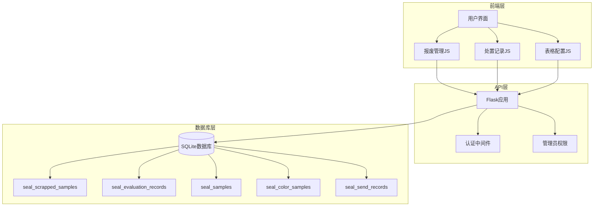
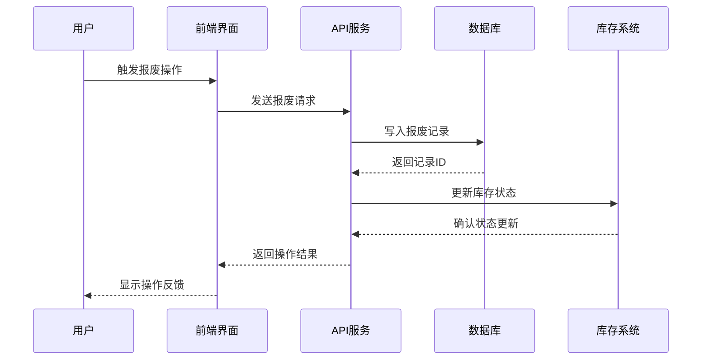
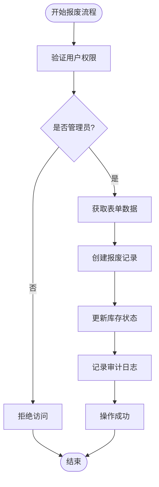
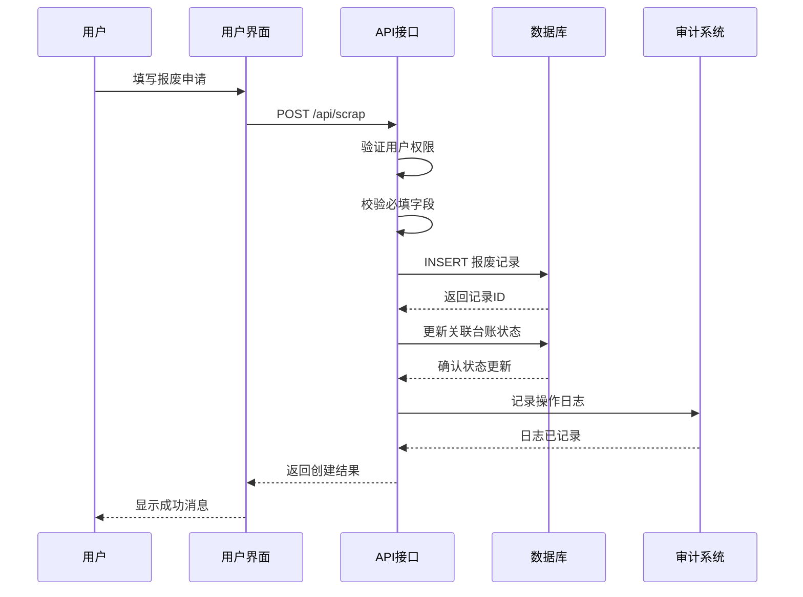
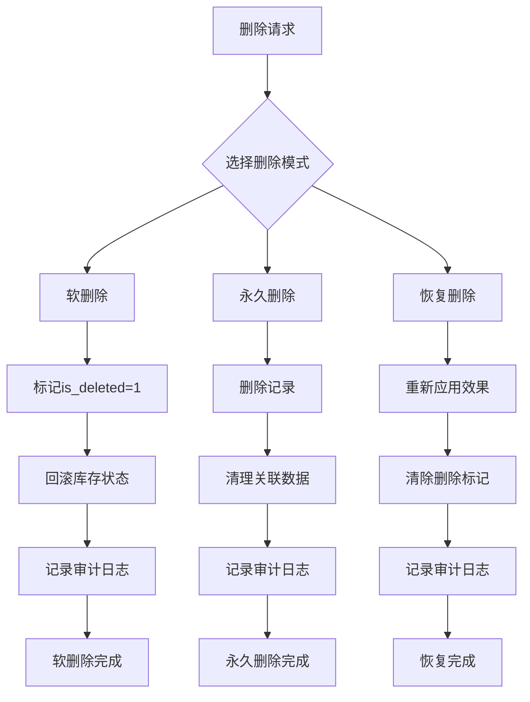
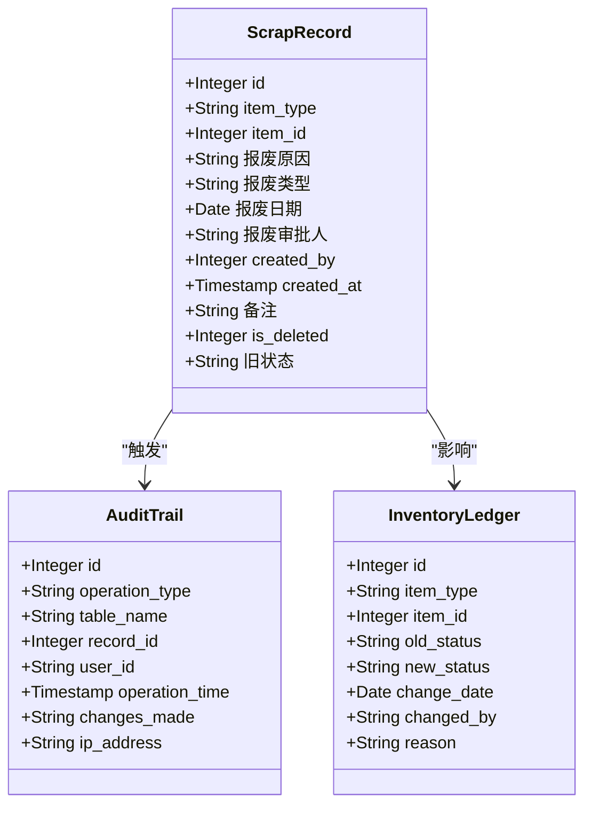
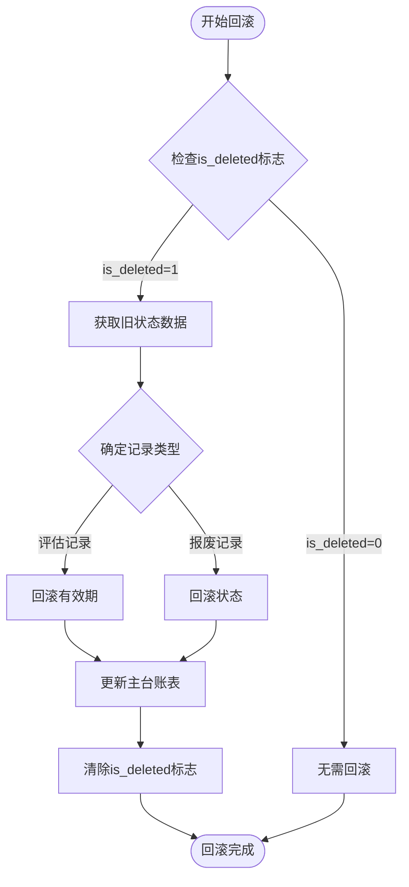
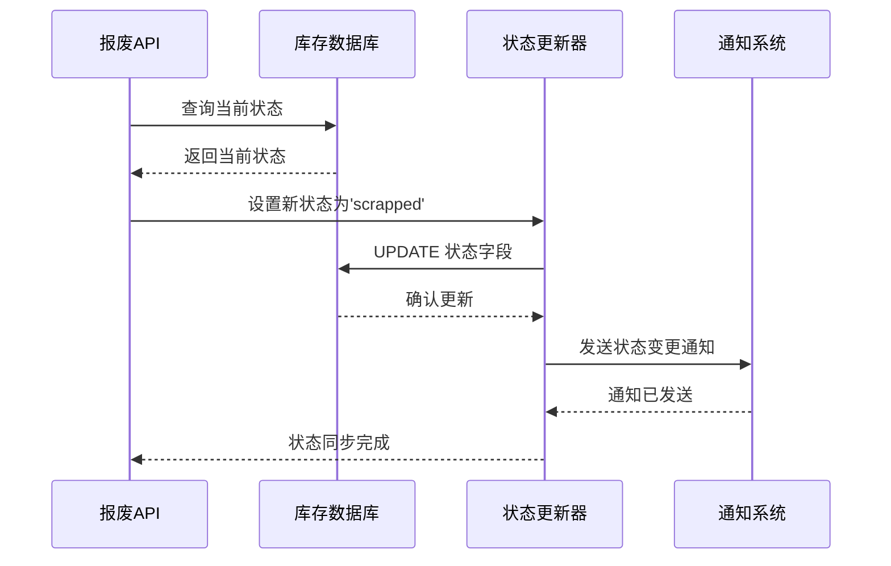
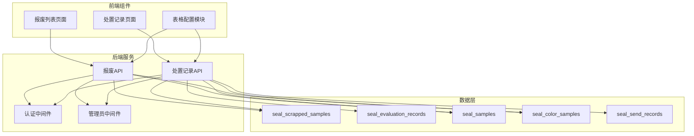

# 报废记录表 (seal_scrapped_samples)

<cite>
**本文档引用的文件**
- [app.py](file://app.py)
- [scrap-management.js](file://static/js/scrap-management.js)
- [disposal-records.js](file://static/js/disposal-records.js)
- [scrap-list.html](file://templates/scrap-list.html)
- [disposal-records.html](file://templates/disposal-records.html)
- [table-config.js](file://static/js/table-config.js)
</cite>

## 目录
1. [简介](#简介)
2. [项目结构](#项目结构)
3. [核心组件](#核心组件)
4. [架构概览](#架构概览)
5. [详细组件分析](#详细组件分析)
6. [依赖分析](#依赖分析)
7. [性能考虑](#性能考虑)
8. [故障排除指南](#故障排除指南)
9. [结论](#结论)

## 简介
本文档详细描述了报废记录表(seal_scrapped_samples)的数据库表结构、业务逻辑和相关功能实现。该表用于记录封样件和色板的报废信息，支持完整的报废流程管理，包括审批、软删除、状态回滚、审计追踪等功能。

## 项目结构
系统采用Flask + SQLite架构，主要包含以下关键组件：
- 数据库层：SQLite数据库，包含10张核心表
- API层：RESTful接口，提供CRUD操作和业务逻辑
- 前端层：基于JavaScript的单页应用(SPA)，提供用户界面



**图表来源**
- [app.py:257-271](file://app.py#L257-L271)
- [scrap-management.js:83-117](file://static/js/scrap-management.js#L83-L117)
- [disposal-records.js:1-325](file://static/js/disposal-records.js#L1-L325)

**章节来源**
- [app.py:257-271](file://app.py#L257-L271)
- [scrap-management.js:83-117](file://static/js/scrap-management.js#L83-L117)
- [disposal-records.js:1-325](file://static/js/disposal-records.js#L1-L325)

## 核心组件

### 数据库表结构
seal_scrapped_samples表是系统的核心表之一，用于存储所有报废记录信息。

| 字段名 | 类型 | 约束 | 描述 |
|--------|------|------|------|
| id | INTEGER | PRIMARY KEY, AUTOINCREMENT | 主键，自增ID |
| item_type | TEXT | NOT NULL | 物品类型：'seal'或'color' |
| item_id | INTEGER | NOT NULL | 物品ID，关联seal_samples或seal_color_samples |
| 报废原因 | TEXT |  | 报废的具体原因说明 |
| 报废类型 | TEXT |  | 报废的分类类型 |
| 报废日期 | DATE |  | 报废执行的日期 |
| 报废审批人 | TEXT |  | 审批人的姓名或标识 |
| created_by | INTEGER |  | 创建者的用户ID |
| created_at | TIMESTAMP | DEFAULT CURRENT_TIMESTAMP | 记录创建时间 |
| 备注 | TEXT |  | 其他补充说明信息 |

### 关键特性
1. **软删除支持**：通过is_deleted字段实现软删除，保留数据完整性
2. **状态回滚**：支持恢复报废记录时自动回滚台账状态
3. **审计追踪**：完整的创建时间和操作记录
4. **关联查询**：支持与主台账表的关联查询和显示

**章节来源**
- [app.py:257-271](file://app.py#L257-L271)
- [app.py:325-334](file://app.py#L325-L334)

## 架构概览

### 整体架构设计
系统采用三层架构设计，确保职责分离和可维护性：



**图表来源**
- [app.py:1290-1355](file://app.py#L1290-L1355)
- [scrap-management.js:83-117](file://static/js/scrap-management.js#L83-L117)

### 数据流分析
报废流程涉及多个组件的协同工作：



**图表来源**
- [app.py:1290-1355](file://app.py#L1290-L1355)
- [app.py:1895-1941](file://app.py#L1895-L1941)

## 详细组件分析

### 报废记录表结构详解

#### 字段定义与约束
每个字段都有明确的业务含义和技术约束：

**主键字段**
- `id`: 自增主键，确保每条记录的唯一性

**业务关联字段**
- `item_type`: 限定枚举值('seal'或'color')，决定关联的主表
- `item_id`: 外键关联到对应的主台账表

**业务信息字段**
- `报废原因`: 文本描述，支持多行说明
- `报废类型`: 分类标识，便于统计分析
- `报废日期`: 日期字段，记录实际报废时间
- `报废审批人`: 姓名或工号标识

**管理字段**
- `created_by`: 记录创建者的用户ID
- `created_at`: 自动记录创建时间戳
- `备注`: 扩展说明字段

#### 数据完整性保证
系统通过多种机制确保数据完整性：

```mermaid
erDiagram
SEAL_SCRAPPED_SAMPLES {
INTEGER id PK
TEXT item_type FK
INTEGER item_id FK
TEXT 报废原因
TEXT 报废类型
DATE 报废日期
TEXT 报废审批人
INTEGER created_by
TIMESTAMP created_at
TEXT 备注
}
SEAL_SAMPLES {
INTEGER id PK
TEXT 序号 UK
TEXT 项目
TEXT 封样件名称
TEXT 签署人
DATE 签署人日期
DATE 有效期
TEXT 状态
TEXT 备注
TIMESTAMP created_at
TIMESTAMP updated_at
}
SEAL_COLOR_SAMPLES {
INTEGER id PK
INTEGER 序号
TEXT 客户
TEXT 适用车型
TEXT 颜色名称
TEXT 样板供应商
TEXT 颜色色值转化码
TEXT 纹理代码
TEXT 光泽度
TEXT 供应商代码
TEXT 制作信息
INTEGER 接收数量
INTEGER 当前持有数量
DATE 接收日期
TEXT 使用的光源角度
REAL L值
REAL a值
REAL b值
REAL c值
REAL h值
REAL ΔL值
REAL Δa值
REAL Δb值
REAL Δc值
REAL Δh值
REAL ΔE值
TEXT 备注
DATE 有效期
TEXT 状态
TIMESTAMP created_at
TIMESTAMP updated_at
}
SEAL_SCRAPPED_SAMPLES }o|--|| SEAL_SAMPLES : "关联封样件"
SEAL_SCRAPPED_SAMPLES }o|--|| SEAL_COLOR_SAMPLES : "关联色板"
```

**图表来源**
- [app.py:257-271](file://app.py#L257-L271)
- [app.py:1328-1355](file://app.py#L1328-L1355)

**章节来源**
- [app.py:257-271](file://app.py#L257-L271)
- [app.py:1328-1355](file://app.py#L1328-L1355)

### 报废流程业务逻辑

#### 报废创建流程


**图表来源**
- [app.py:1290-1355](file://app.py#L1290-L1355)
- [scrap-management.js:83-117](file://static/js/scrap-management.js#L83-L117)

#### 报废删除流程
系统支持三种删除模式：

1. **软删除(恢复)**：标记记录为已删除，但保留数据
2. **永久删除**：彻底删除记录及相关关联数据
3. **状态回滚**：恢复到删除前的台账状态



**图表来源**
- [app.py:1328-1355](file://app.py#L1328-L1355)
- [app.py:1895-1941](file://app.py#L1895-L1941)

**章节来源**
- [app.py:1290-1355](file://app.py#L1290-L1355)
- [app.py:1895-1941](file://app.py#L1895-L1941)

### 审计追踪与历史查询

#### 审计日志设计
系统实现了完整的审计追踪机制：



**图表来源**
- [app.py:325-334](file://app.py#L325-L334)
- [app.py:1895-1941](file://app.py#L1895-L1941)

#### 历史查询功能
系统提供了灵活的历史查询能力：

**章节来源**
- [app.py:325-334](file://app.py#L325-L334)
- [app.py:1630-1807](file://app.py#L1630-L1807)

### 软删除设计与状态回滚

#### 软删除机制
软删除是系统的重要设计特性，通过以下字段实现：

- `is_deleted`: 0表示正常，1表示已删除
- `旧状态`: 存储删除前的原始状态，用于恢复时回滚

#### 状态回滚算法


**图表来源**
- [app.py:1895-1941](file://app.py#L1895-L1941)

**章节来源**
- [app.py:1895-1941](file://app.py#L1895-L1941)

### 报废统计分析与报表生成

#### 统计指标
系统支持多种统计分析维度：

**基础统计**
- 总报废数量
- 按物品类型分类的报废分布
- 按报废类型的统计
- 时间趋势分析

**高级分析**
- 报废原因分析
- 审批人效率统计
- 库存影响评估

#### 报表导出功能
系统提供Excel格式的报表导出：

**章节来源**
- [app.py:1808-1890](file://app.py#L1808-L1890)

### 与库存管理的联动机制

#### 库存状态同步
报废操作会自动更新相关库存状态：



**图表来源**
- [app.py:1328-1355](file://app.py#L1328-L1355)
- [app.py:1937-1940](file://app.py#L1937-L1940)

#### 库存联动策略
1. **实时同步**：报废创建时立即更新库存状态
2. **批量处理**：支持批量报废操作
3. **冲突处理**：避免并发操作导致的状态不一致

**章节来源**
- [app.py:1328-1355](file://app.py#L1328-L1355)
- [app.py:1937-1940](file://app.py#L1937-L1940)

## 依赖分析

### 组件耦合关系
系统各组件之间存在清晰的依赖关系：



**图表来源**
- [app.py:1290-1355](file://app.py#L1290-L1355)
- [app.py:1630-1807](file://app.py#L1630-L1807)

### 外部依赖
系统依赖的主要外部组件：
- **Flask**: Web框架，提供HTTP服务
- **SQLite**: 数据库引擎，轻量级本地存储
- **openpyxl**: Excel文件处理库
- **JWT**: JSON Web Token认证
- **CORS**: 跨域资源共享支持

**章节来源**
- [app.py:1290-1355](file://app.py#L1290-L1355)
- [app.py:1630-1807](file://app.py#L1630-L1807)

## 性能考虑

### 数据库优化
1. **索引策略**：在常用查询字段上建立索引
2. **查询优化**：使用JOIN查询减少数据库往返
3. **分页处理**：大数据量时使用分页机制
4. **连接池**：合理管理数据库连接

### 前端性能
1. **懒加载**：大表格使用虚拟滚动
2. **缓存策略**：合理使用浏览器缓存
3. **异步处理**：避免阻塞UI线程
4. **资源压缩**：JavaScript和CSS文件压缩

### 系统监控
1. **响应时间监控**：跟踪API响应时间
2. **错误率统计**：监控系统错误率
3. **数据库性能**：监控查询执行时间
4. **内存使用**：监控内存使用情况

## 故障排除指南

### 常见问题诊断

#### 报废记录无法创建
**可能原因**：
1. 用户权限不足
2. 必填字段缺失
3. 数据库连接异常
4. 外键约束冲突

**解决步骤**：
1. 验证用户是否具有管理员权限
2. 检查必填字段是否完整
3. 查看数据库连接状态
4. 确认关联记录是否存在

#### 报废记录删除失败
**可能原因**：
1. 记录已被删除
2. 权限不足
3. 数据库事务冲突
4. 外键约束限制

**解决步骤**：
1. 检查记录的is_deleted状态
2. 验证管理员权限
3. 查看数据库锁状态
4. 检查关联记录状态

#### 状态回滚异常
**可能原因**：
1. 旧状态数据缺失
2. 数据库事务失败
3. 并发操作冲突
4. 外键约束问题

**解决步骤**：
1. 检查旧状态字段数据
2. 验证数据库事务完整性
3. 处理并发冲突
4. 检查外键关系

**章节来源**
- [app.py:1290-1355](file://app.py#L1290-L1355)
- [app.py:1895-1941](file://app.py#L1895-L1941)

### 调试工具
1. **浏览器开发者工具**：检查网络请求和响应
2. **数据库客户端**：直接查询数据库状态
3. **日志分析**：查看系统日志输出
4. **性能分析器**：监控系统性能指标

## 结论

seal_scrapped_samples表作为系统的核心数据表，实现了完整的报废管理功能。通过软删除机制、状态回滚、审计追踪等设计，确保了数据的完整性和可追溯性。系统的前后端分离架构、RESTful API设计以及完善的权限控制，为后续的功能扩展和维护奠定了良好的基础。

该设计充分考虑了实际业务需求，在保证功能完整性的同时，也注重了系统的可维护性和扩展性。通过合理的数据库设计和API架构，为报废管理提供了高效、可靠的解决方案。