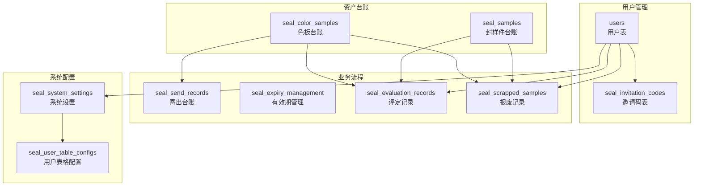
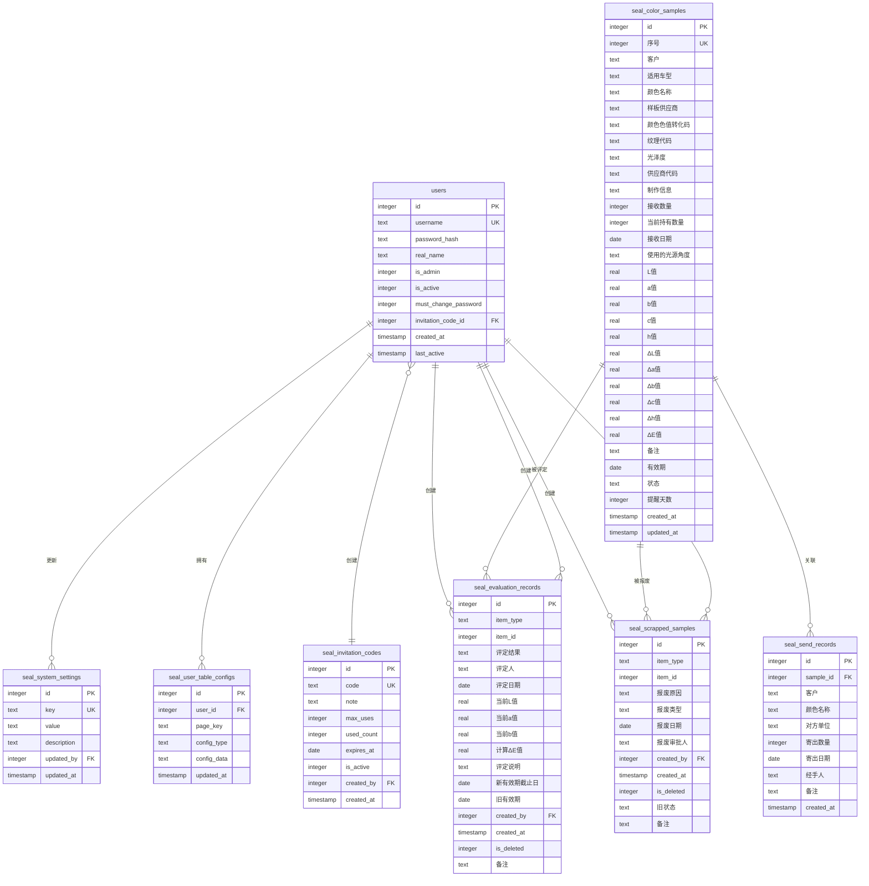

# 数据库设计

<cite>
**本文档引用的文件**
- [app.py](file://app.py)
- [requirements.txt](file://requirements.txt)
</cite>

## 目录
1. [项目概述](#项目概述)
2. [数据库架构总览](#数据库架构总览)
3. [核心数据表设计](#核心数据表设计)
4. [表关系与外键约束](#表关系与外键约束)
5. [数据字典](#数据字典)
6. [业务规则与完整性约束](#业务规则与完整性约束)
7. [性能优化建议](#性能优化建议)
8. [数据库迁移与版本管理](#数据库迁移与版本管理)
9. [查询模式分析](#查询模式分析)
10. [故障排除指南](#故障排除指南)
11. [总结](#总结)

## 项目概述

封样件及色板接收登记管理系统是一个基于Python Flask框架开发的企业级资产管理应用。系统采用SQLite作为底层数据库，支持封样件和色板的全生命周期管理，包括接收登记、有效期管理、评定流程、报废处理等功能。

### 技术栈
- **后端框架**: Flask 3.0.0+
- **数据库**: SQLite 3
- **认证机制**: JWT Token
- **Excel处理**: openpyxl 3.1.0+
- **跨域支持**: flask-cors 4.0.0+

**章节来源**
- [requirements.txt:1-5](file://requirements.txt#L1-L5)

## 数据库架构总览

系统采用集中式数据库架构，所有业务数据存储在一个SQLite数据库文件中。数据库初始化时自动创建10个核心数据表，涵盖用户管理、资产管理、业务流程跟踪等完整功能模块。



**图表来源**
- [app.py:88-335](file://app.py#L88-L335)

## 核心数据表设计

### 1. 用户表 (users)

用户表是系统的核心基础表，存储所有系统用户的认证和授权信息。

**表结构设计**：
- `id`: INTEGER PRIMARY KEY AUTOINCREMENT - 主键，自增标识
- `username`: TEXT UNIQUE NOT NULL - 用户名，唯一约束
- `password_hash`: TEXT NOT NULL - 密码哈希值
- `real_name`: TEXT NOT NULL - 真实姓名
- `is_admin`: INTEGER DEFAULT 0 - 是否管理员(0/1)
- `is_active`: INTEGER DEFAULT 1 - 账户状态(0/1)
- `must_change_password`: INTEGER DEFAULT 0 - 是否必须修改密码
- `invitation_code_id`: INTEGER - 外键，关联邀请码表
- `last_active`: TIMESTAMP - 最后活跃时间
- `created_at`: TIMESTAMP DEFAULT CURRENT_TIMESTAMP - 创建时间

**索引设计**：
- 主键索引: `PRIMARY KEY (id)`
- 唯一索引: `UNIQUE (username)`
- 外键索引: `invitation_code_id` (自动创建)

**约束条件**：
- 非空约束: `username`, `password_hash`, `real_name`
- 默认值: `is_admin=0`, `is_active=1`, `must_change_password=0`
- 外键约束: `invitation_code_id` → `seal_invitation_codes(id)`

**章节来源**
- [app.py:93-107](file://app.py#L93-L107)

### 2. 邀请码表 (seal_invitation_codes)

邀请码表用于用户注册管理和访问控制。

**表结构设计**：
- `id`: INTEGER PRIMARY KEY AUTOINCREMENT - 主键
- `code`: TEXT UNIQUE NOT NULL - 邀请码，唯一约束
- `note`: TEXT - 备注说明
- `max_uses`: INTEGER DEFAULT 1 - 最大使用次数
- `used_count`: INTEGER DEFAULT 0 - 已使用次数
- `expires_at`: DATE - 过期日期
- `is_active`: INTEGER DEFAULT 1 - 状态(0/1)
- `created_by`: INTEGER - 创建者ID
- `created_at`: TIMESTAMP DEFAULT CURRENT_TIMESTAMP - 创建时间

**索引设计**：
- 主键索引: `PRIMARY KEY (id)`
- 唯一索引: `UNIQUE (code)`
- 外键索引: `created_by` → `users(id)`

**约束条件**：
- 非空约束: `code`
- 默认值: `max_uses=1`, `used_count=0`, `is_active=1`
- 外键约束: `created_by` → `users(id)`

**章节来源**
- [app.py:113-127](file://app.py#L113-L127)

### 3. 封样件台账表 (seal_samples)

封样件台账表记录所有封样件的详细信息和状态管理。

**表结构设计**：
- `id`: INTEGER PRIMARY KEY AUTOINCREMENT - 主键
- `序号`: INTEGER UNIQUE - 封样件编号，唯一约束
- `项目`: TEXT - 项目名称
- `封样件名称`: TEXT - 封样件名称
- `签署人`: TEXT - 签署人
- `签署人日期`: DATE - 签署日期
- `有效期`: DATE - 有效期截止日期
- `状态`: TEXT DEFAULT 'normal' - 状态(normal/pending_eval/expired/scrapped)
- `备注`: TEXT - 备注说明
- `提醒天数`: INTEGER DEFAULT 30 - 到期提醒天数
- `created_at`: TIMESTAMP DEFAULT CURRENT_TIMESTAMP - 创建时间
- `updated_at`: TIMESTAMP DEFAULT CURRENT_TIMESTAMP - 更新时间

**索引设计**：
- 主键索引: `PRIMARY KEY (id)`
- 唯一索引: `UNIQUE (序号)`

**约束条件**：
- 默认值: `状态='normal'`, `提醒天数=30`
- 状态枚举: `normal`, `pending_eval`, `expired`, `scrapped`

**章节来源**
- [app.py:129-144](file://app.py#L129-L144)

### 4. 色板台账表 (seal_color_samples)

色板台账表记录详细的色板信息，包含丰富的色彩学数据。

**表结构设计**：
- `id`: INTEGER PRIMARY KEY AUTOINCREMENT - 主键
- `序号`: INTEGER - 色板编号
- `客户`: TEXT - 客户名称
- `适用车型`: TEXT - 适用车型
- `颜色名称`: TEXT - 颜色名称
- `样板供应商`: TEXT - 样板供应商
- `颜色色值转化码`: TEXT - 色值转化码
- `纹理代码`: TEXT - 纹理代码
- `光泽度`: TEXT - 光泽度
- `供应商代码`: TEXT - 供应商代码
- `制作信息`: TEXT - 制作信息
- `接收数量`: INTEGER - 接收数量
- `当前持有数量`: INTEGER DEFAULT 0 - 当前持有数量
- `接收日期`: DATE - 接收日期
- `使用的光源角度`: TEXT - 光源角度
- `L值`: REAL - L色彩值
- `a值`: REAL - a色彩值
- `b值`: REAL - b色彩值
- `c值`: REAL - c色彩值
- `h值`: REAL - h色彩值
- `ΔL值`: REAL - ΔL色差值
- `Δa值`: REAL - Δa色差值
- `Δb值`: REAL - Δb色差值
- `Δc值`: REAL - Δc色差值
- `Δh值`: REAL - Δh色差值
- `ΔE值`: REAL - ΔE色差值
- `备注`: TEXT - 备注
- `有效期`: DATE - 有效期
- `状态`: TEXT DEFAULT 'normal' - 状态
- `提醒天数`: INTEGER DEFAULT 30 - 提醒天数
- `created_at`: TIMESTAMP DEFAULT CURRENT_TIMESTAMP - 创建时间
- `updated_at`: TIMESTAMP DEFAULT CURRENT_TIMESTAMP - 更新时间

**索引设计**：
- 主键索引: `PRIMARY KEY (id)`

**约束条件**：
- 默认值: `当前持有数量=0`, `状态='normal'`, `提醒天数=30`

**章节来源**
- [app.py:152-187](file://app.py#L152-L187)

### 5. 寄出台账表 (seal_send_records)

寄出台账表记录色板的寄出和退回操作。

**表结构设计**：
- `id`: INTEGER PRIMARY KEY AUTOINCREMENT - 主键
- `sample_id`: INTEGER - 关联色板ID
- `客户`: TEXT - 客户名称
- `颜色名称`: TEXT - 颜色名称
- `对方单位`: TEXT - 对方单位
- `寄出数量`: INTEGER - 寄出数量
- `寄出日期`: DATE - 寄出日期
- `经手人`: TEXT - 经手人
- `备注`: TEXT - 备注
- `created_at`: TIMESTAMP DEFAULT CURRENT_TIMESTAMP - 创建时间

**索引设计**：
- 主键索引: `PRIMARY KEY (id)`
- 外键索引: `sample_id` → `seal_color_samples(id)`

**约束条件**：
- 外键约束: `sample_id` → `seal_color_samples(id)`

**章节来源**
- [app.py:202-217](file://app.py#L202-L217)

### 6. 有效期管理表 (seal_expiry_management)

有效期管理表提供灵活的自定义有效期规则配置。

**表结构设计**：
- `id`: INTEGER PRIMARY KEY AUTOINCREMENT - 主键
- `item_type`: TEXT - 项目类型(seal/color)
- `item_id`: INTEGER - 项目ID
- `有效期类型`: TEXT - 有效期类型
- `有效期时长`: INTEGER - 有效期时长
- `有效期单位`: TEXT - 有效期单位(天/月/年)
- `有效期截止日期`: DATE - 有效期截止日期
- `提醒天数`: INTEGER DEFAULT 30 - 提醒天数
- `备注`: TEXT - 备注
- `created_by`: INTEGER - 创建者ID
- `created_at`: TIMESTAMP DEFAULT CURRENT_TIMESTAMP - 创建时间
- `updated_at`: TIMESTAMP DEFAULT CURRENT_TIMESTAMP - 更新时间

**索引设计**：
- 主键索引: `PRIMARY KEY (id)`
- 外键索引: `created_by` → `users(id)`

**约束条件**：
- 默认值: `提醒天数=30`
- 外键约束: `created_by` → `users(id)`

**章节来源**
- [app.py:219-235](file://app.py#L219-L235)

### 7. 评定记录表 (seal_evaluation_records)

评定记录表跟踪封样件和色板的评定历史。

**表结构设计**：
- `id`: INTEGER PRIMARY KEY AUTOINCREMENT - 主键
- `item_type`: TEXT - 项目类型(seal/color)
- `item_id`: INTEGER - 项目ID
- `评定结果`: TEXT - 评定结果(pass/fail)
- `评定人`: TEXT - 评定人
- `评定日期`: DATE - 评定日期
- `当前L值`: REAL - 当前L色彩值
- `当前a值`: REAL - 当前a色彩值
- `当前b值`: REAL - 当前b色彩值
- `计算ΔE值`: REAL - 计算的ΔE色差值
- `评定说明`: TEXT - 评定说明
- `新有效期截止日`: DATE - 新有效期截止日
- `旧有效期`: DATE - 旧有效期
- `created_by`: INTEGER - 创建者ID
- `created_at`: TIMESTAMP DEFAULT CURRENT_TIMESTAMP - 创建时间
- `is_deleted`: INTEGER DEFAULT 0 - 是否已删除(软删除)
- `备注`: TEXT - 备注

**索引设计**：
- 主键索引: `PRIMARY KEY (id)`

**约束条件**：
- 默认值: `is_deleted=0`

**章节来源**
- [app.py:237-255](file://app.py#L237-L255)

### 8. 报废记录表 (seal_scrapped_samples)

报废记录表记录资产的报废历史和状态变更。

**表结构设计**：
- `id`: INTEGER PRIMARY KEY AUTOINCREMENT - 主键
- `item_type`: TEXT - 项目类型(seal/color)
- `item_id`: INTEGER - 项目ID
- `报废原因`: TEXT - 报废原因
- `报废类型`: TEXT - 报废类型
- `报废日期`: DATE - 报废日期
- `报废审批人`: TEXT - 报废审批人
- `created_by`: INTEGER - 创建者ID
- `created_at`: TIMESTAMP DEFAULT CURRENT_TIMESTAMP - 创建时间
- `is_deleted`: INTEGER DEFAULT 0 - 是否已删除(软删除)
- `旧状态`: TEXT - 旧状态
- `备注`: TEXT - 备注

**索引设计**：
- 主键索引: `PRIMARY KEY (id)`

**约束条件**：
- 默认值: `is_deleted=0`

**章节来源**
- [app.py:257-271](file://app.py#L257-L271)

### 9. 系统设置表 (seal_system_settings)

系统设置表存储全局配置参数。

**表结构设计**：
- `id`: INTEGER PRIMARY KEY AUTOINCREMENT - 主键
- `key`: TEXT UNIQUE NOT NULL - 设置键，唯一约束
- `value`: TEXT NOT NULL - 设置值
- `description`: TEXT - 描述说明
- `updated_by`: INTEGER - 更新者ID
- `updated_at`: TIMESTAMP DEFAULT CURRENT_TIMESTAMP - 更新时间

**索引设计**：
- 主键索引: `PRIMARY KEY (id)`
- 唯一索引: `UNIQUE (key)`
- 外键索引: `updated_by` → `users(id)`

**约束条件**：
- 非空约束: `key`, `value`
- 外键约束: `updated_by` → `users(id)`

**章节来源**
- [app.py:273-284](file://app.py#L273-L284)

### 10. 用户表格配置表 (seal_user_table_configs)

用户表格配置表存储用户的个性化界面配置。

**表结构设计**：
- `id`: INTEGER PRIMARY KEY AUTOINCREMENT - 主键
- `user_id`: INTEGER NOT NULL - 用户ID
- `page_key`: TEXT NOT NULL - 页面标识
- `config_type`: TEXT NOT NULL - 配置类型(filter/columns)
- `config_data`: TEXT NOT NULL DEFAULT '{}' - 配置数据(JSON格式)
- `updated_at`: TIMESTAMP DEFAULT CURRENT_TIMESTAMP - 更新时间

**索引设计**：
- 主键索引: `PRIMARY KEY (id)`
- 唯一索引: `UNIQUE (user_id, page_key, config_type)`
- 外键索引: `user_id` → `users(id)`

**约束条件**：
- 非空约束: `user_id`, `page_key`, `config_type`
- 默认值: `config_data='{}'`
- 外键约束: `user_id` → `users(id)`

**章节来源**
- [app.py:309-321](file://app.py#L309-L321)

## 表关系与外键约束

系统采用清晰的外键关系设计，确保数据一致性和参照完整性。



**图表来源**
- [app.py:93-107](file://app.py#L93-L107)
- [app.py:113-127](file://app.py#L113-L127)
- [app.py:152-187](file://app.py#L152-L187)
- [app.py:202-217](file://app.py#L202-L217)
- [app.py:237-255](file://app.py#L237-L255)
- [app.py:257-271](file://app.py#L257-L271)
- [app.py:273-284](file://app.py#L273-L284)
- [app.py:309-321](file://app.py#L309-L321)

**章节来源**
- [app.py:103-105](file://app.py#L103-L105)
- [app.py:125](file://app.py#L125)
- [app.py:215](file://app.py#L215)
- [app.py:282](file://app.py#L282)
- [app.py:319](file://app.py#L319)

## 数据字典

### 用户相关表
| 字段名 | 数据类型 | 约束 | 描述 |
|--------|----------|------|------|
| id | INTEGER | PRIMARY KEY, AUTOINCREMENT | 用户ID |
| username | TEXT | UNIQUE, NOT NULL | 用户名 |
| password_hash | TEXT | NOT NULL | 密码哈希 |
| real_name | TEXT | NOT NULL | 真实姓名 |
| is_admin | INTEGER | DEFAULT 0 | 是否管理员 |
| is_active | INTEGER | DEFAULT 1 | 账户状态 |
| must_change_password | INTEGER | DEFAULT 0 | 是否必须改密 |
| invitation_code_id | INTEGER | FOREIGN KEY | 邀请码ID |

### 资产管理表
| 字段名 | 数据类型 | 约束 | 描述 |
|--------|----------|------|------|
| id | INTEGER | PRIMARY KEY, AUTOINCREMENT | 资产ID |
| 序号 | INTEGER | UNIQUE | 资产编号 |
| 项目 | TEXT |  | 项目名称 |
| 封样件名称 | TEXT |  | 封样件名称 |
| 签署人 | TEXT |  | 签署人 |
| 签署人日期 | DATE |  | 签署日期 |
| 有效期 | DATE |  | 有效期截止日期 |
| 状态 | TEXT | DEFAULT 'normal' | 资产状态 |
| 备注 | TEXT |  | 备注说明 |
| 提醒天数 | INTEGER | DEFAULT 30 | 到期提醒天数 |

### 色彩学数据表
| 字段名 | 数据类型 | 约束 | 描述 |
|--------|----------|------|------|
| L值 | REAL |  | L色彩值 |
| a值 | REAL |  | a色彩值 |
| b值 | REAL |  | b色彩值 |
| ΔL值 | REAL |  | ΔL色差值 |
| Δa值 | REAL |  | Δa色差值 |
| Δb值 | REAL |  | Δb色差值 |
| ΔE值 | REAL |  | ΔE色差值 |
| 当前持有数量 | INTEGER | DEFAULT 0 | 当前持有数量 |

### 业务流程表
| 字段名 | 数据类型 | 约束 | 描述 |
|--------|----------|------|------|
| item_type | TEXT |  | 项目类型 |
| item_id | INTEGER |  | 项目ID |
| 评定结果 | TEXT |  | 评定结果 |
| 报废原因 | TEXT |  | 报废原因 |
| 报废类型 | TEXT |  | 报废类型 |
| 寄出数量 | INTEGER |  | 寄出数量 |

## 业务规则与完整性约束

### 数据完整性约束

1. **实体完整性**: 所有主键字段均设置为NOT NULL和唯一性约束
2. **参照完整性**: 外键约束确保相关表的数据一致性
3. **域完整性**: 字段类型和默认值确保数据格式正确
4. **用户定义完整性**: 业务逻辑约束通过应用程序层实现

### 业务规则实现

1. **有效期管理规则**:
   - 状态自动计算: `normal`/`pending_eval`/`expired`/`scrapped`
   - 提醒天数配置: 可自定义到期前提醒天数
   - 有效期计算: 基于到期日期和提醒天数动态判断

2. **库存管理规则**:
   - 寄出数量不能超过当前持有数量
   - 寄出操作自动扣减库存
   - 删除寄出记录自动恢复库存

3. **评定流程规则**:
   - 合格续期: 更新有效期和状态
   - 不合格: 触发报废流程
   - ΔE值自动计算: 基于CIE76标准算法

4. **软删除机制**:
   - 评定记录和报废记录支持软删除
   - 回收站功能支持恢复和永久删除
   - 删除时自动回滚对主表的影响

**章节来源**
- [app.py:350-371](file://app.py#L350-L371)
- [app.py:1120-1139](file://app.py#L1120-L1139)
- [app.py:1248-1286](file://app.py#L1248-L1286)
- [app.py:343-348](file://app.py#L343-L348)

## 性能优化建议

### 索引优化策略

1. **常用查询字段索引**:
   - `users.username`: 高频登录查询
   - `seal_samples.序号`: 唯一标识查询
   - `seal_color_samples.序号`: 唯一标识查询
   - `seal_send_records.sample_id`: 关联查询优化

2. **复合索引建议**:
   - `seal_evaluation_records(item_type, item_id)`: 评定记录查询
   - `seal_scrapped_samples(item_type, item_id)`: 报废记录查询
   - `seal_user_table_configs(user_id, page_key)`: 用户配置查询

### 查询优化策略

1. **分页查询优化**:
   - 使用LIMIT和OFFSET进行分页
   - 避免SELECT *，只查询必要字段
   - 对大数据量表使用适当的WHERE条件

2. **连接查询优化**:
   - 合理使用LEFT JOIN减少数据丢失
   - 在连接字段上建立索引
   - 避免N+1查询问题

3. **缓存策略**:
   - 系统设置缓存到内存
   - 用户配置缓存到会话
   - 频繁查询结果缓存

### 存储优化

1. **数据压缩**:
   - JSON配置数据压缩存储
   - 大文本字段考虑压缩
   - 重复数据去重

2. **归档策略**:
   - 历史数据定期归档
   - 软删除记录清理
   - 日志数据轮转

## 数据库迁移与版本管理

### 初始化脚本设计

系统采用自动初始化机制，在首次启动时创建所有表结构，并预置必要的初始数据。

**初始化流程**:
1. 创建10个核心数据表
2. 预置admin用户(admin/admin)
3. 预置ΔE阈值设置
4. 兼容性升级处理

### 兼容性升级策略

1. **列兼容性处理**:
   ```sql
   -- 添加新列时使用ALTER TABLE
   ALTER TABLE users ADD COLUMN last_active TIMESTAMP;
   ALTER TABLE seal_color_samples ADD COLUMN 提醒天数 INTEGER DEFAULT 30;
   ```

2. **约束升级**:
   - 添加唯一约束时检查现有数据
   - 修改字段类型时确保数据兼容
   - 外键约束的逐步添加

3. **数据迁移**:
   - 结构变更时的数据转换
   - 历史数据的向后兼容
   - 升级前的数据备份

### 版本控制策略

1. **语义化版本管理**:
   - 主版本: 重大架构变更
   - 次版本: 新功能添加
   - 修订版本: Bug修复和小改进

2. **迁移脚本管理**:
   - 每个版本对应独立迁移脚本
   - 迁移脚本幂等性保证
   - 回滚机制支持

**章节来源**
- [app.py:88-335](file://app.py#L88-L335)

## 查询模式分析

### 常见查询模式

1. **分页查询模式**:
   ```sql
   SELECT * FROM table WHERE conditions 
   ORDER BY id DESC 
   LIMIT page_size OFFSET (page-1)*page_size
   ```

2. **动态筛选查询模式**:
   - 支持多种操作符: contains, equals, gt, lt等
   - 动态构建WHERE条件
   - SQL注入防护

3. **关联查询模式**:
   - LEFT JOIN处理缺失数据
   - CASE WHEN条件选择
   - 多表联合排序

### 性能特征分析

1. **查询复杂度**:
   - 基础查询: O(log n) - 基于索引查找
   - 分页查询: O(k log n) - k为页面大小
   - 复合查询: O(n*m) - n为表大小，m为过滤条件数

2. **内存使用**:
   - 分页查询避免全量加载
   - 流式处理大数据集
   - 结果集压缩传输

3. **并发处理**:
   - SQLite默认支持并发读取
   - 写操作串行化
   - 事务管理确保一致性

**章节来源**
- [app.py:403-449](file://app.py#L403-L449)
- [app.py:377-396](file://app.py#L377-L396)

## 故障排除指南

### 常见问题诊断

1. **数据库连接问题**:
   - 检查DB_PATH配置
   - 验证文件权限
   - 确认SQLite驱动安装

2. **表结构异常**:
   - 使用PRAGMA table_info(table_name)检查结构
   - 检查约束冲突
   - 验证索引完整性

3. **数据一致性问题**:
   - 检查外键约束
   - 验证数据类型
   - 确认默认值设置

### 错误处理机制

1. **认证错误**:
   - Token过期处理
   - 用户不存在检查
   - 账户状态验证

2. **业务逻辑错误**:
   - 库存不足检查
   - 有效期验证
   - 权限控制

3. **系统错误**:
   - 数据库异常捕获
   - 文件操作异常
   - 网络请求超时

**章节来源**
- [app.py:49-76](file://app.py#L49-L76)
- [app.py:517-542](file://app.py#L517-L542)

## 总结

封样件及色板接收登记管理系统采用标准化的数据库设计，通过10个核心数据表实现了完整的资产管理生命周期管理。系统设计充分考虑了业务需求、数据完整性、性能优化和可维护性。

### 设计亮点

1. **清晰的表关系**: 通过外键约束建立了完整的数据关联
2. **灵活的配置管理**: 支持用户个性化界面配置
3. **完善的业务流程**: 覆盖从接收、使用到报废的全生命周期
4. **安全的权限控制**: 基于JWT的认证和基于角色的授权
5. **可靠的软删除机制**: 支持数据恢复和审计追踪

### 技术优势

1. **轻量级架构**: SQLite单文件数据库，部署简单
2. **高性能查询**: 合理的索引设计和查询优化
3. **强一致性**: ACID事务保证数据完整性
4. **可扩展性**: 模块化设计支持功能扩展

该数据库设计方案为企业的封样件和色板管理提供了可靠的技术支撑，能够满足日常运营和长期发展的需求。