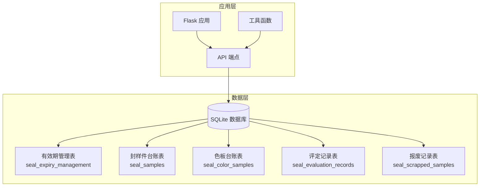
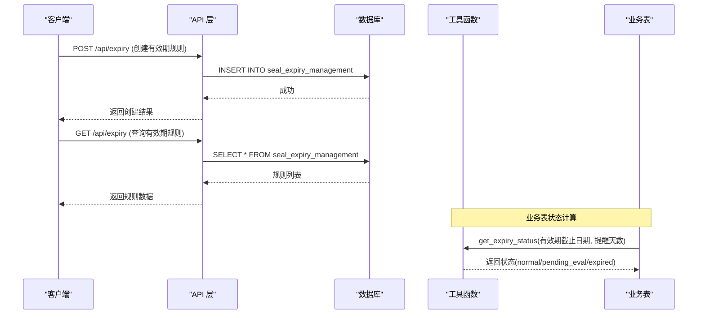
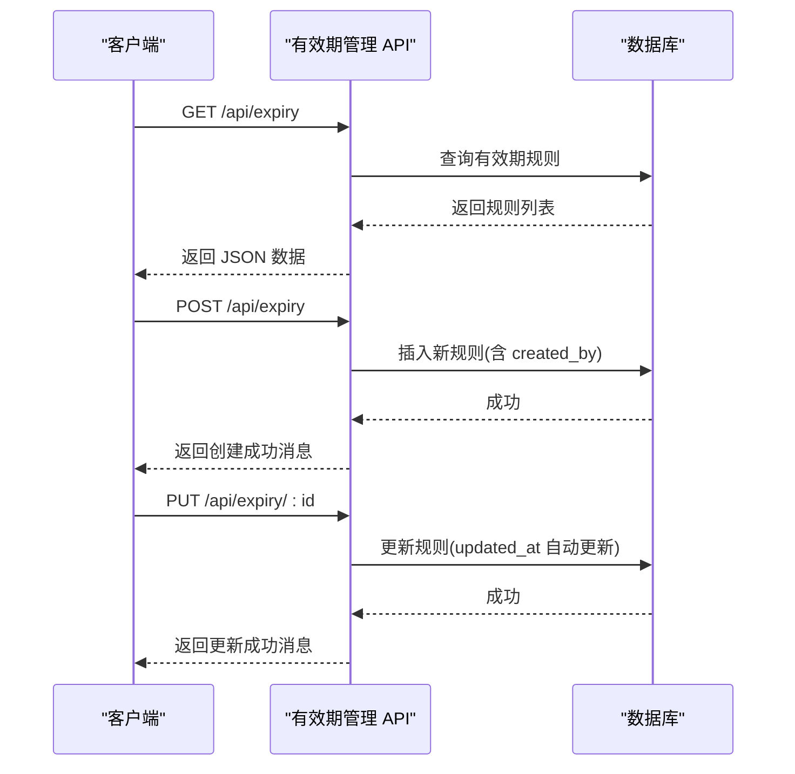
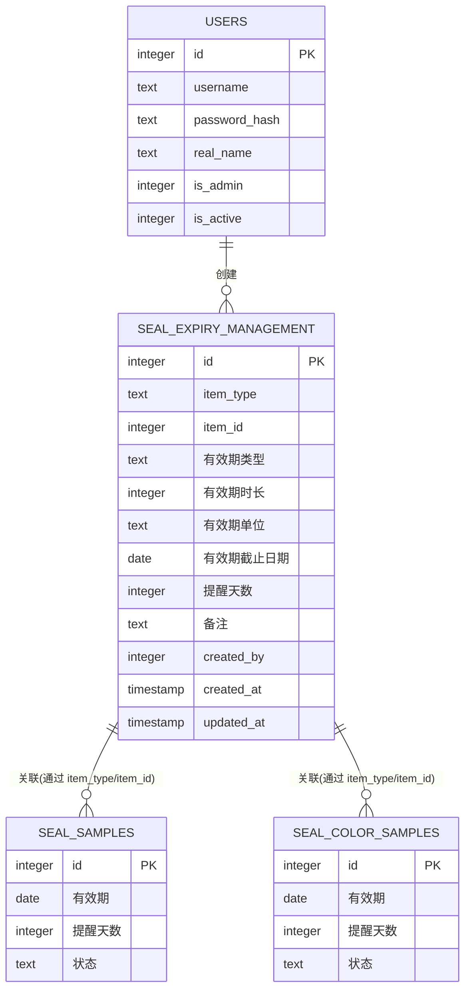
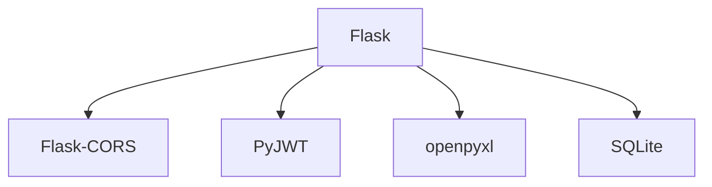

# 有效期管理表 (seal_expiry_management)

<cite>
**本文档引用的文件**
- [app.py](file://app.py)
- [requirements.txt](file://requirements.txt)
</cite>

## 目录
1. [简介](#简介)
2. [项目结构](#项目结构)
3. [核心组件](#核心组件)
4. [架构概览](#架构概览)
5. [详细组件分析](#详细组件分析)
6. [依赖分析](#依赖分析)
7. [性能考虑](#性能考虑)
8. [故障排除指南](#故障排除指南)
9. [结论](#结论)
10. [附录](#附录)

## 简介
本文件为有效期管理表 (seal_expiry_management) 的全面数据库表结构文档。该表采用通用化设计，支持对不同类型物品（如封样件、色板等）进行有效期配置与管理。通过统一的字段定义与计算逻辑，系统能够灵活地为不同业务实体设置有效期类型、时长、单位以及提醒策略，并提供状态计算、历史审计与统计查询能力。

有效期管理表的关键特性包括：
- 通用化设计：通过 item_type 与 item_id 标识任意类型的物品，实现跨业务实体的有效期统一管理
- 灵活的计算模型：支持基于有效期类型、时长与时单位的到期日期推算，或直接指定截止日期
- 完整的生命周期管理：从创建、更新到状态计算、提醒通知，覆盖有效期全生命周期
- 审计与追踪：记录创建者、创建时间、更新时间，便于审计与追溯
- 与现有业务表的协同：与封样件、色板等台账表配合，实现状态联动与提醒机制

## 项目结构
本项目为基于 Flask + SQLite 的小型管理系统，数据库初始化在应用启动时完成，有效期管理表作为十张核心表之一被创建并维护。系统通过 API 端点提供有效期规则的增删改查能力，并与状态计算、导入导出等功能集成。



**图表来源**
- [app.py:88-335](file://app.py#L88-L335)
- [app.py:1172-1207](file://app.py#L1172-L1207)

**章节来源**
- [app.py:88-335](file://app.py#L88-L335)
- [requirements.txt:1-5](file://requirements.txt#L1-L5)

## 核心组件
有效期管理表 (seal_expiry_management) 的核心字段定义如下：

- id (主键)
  - 类型：INTEGER
  - 约束：PRIMARY KEY AUTOINCREMENT
  - 说明：自增主键，唯一标识每条有效期规则

- item_type (物品类型)
  - 类型：TEXT
  - 约束：无
  - 说明：标识物品所属类型，如 "seal" 表示封样件，"color" 表示色板；用于区分不同业务实体

- item_id (物品ID)
  - 类型：INTEGER
  - 约束：无
  - 说明：与 item_type 组合唯一标识具体物品记录，通常指向对应业务表的 id

- 有效期类型 (有效期类型)
  - 类型：TEXT
  - 约束：无
  - 说明：有效期的计算类型，如 "固定期限"、"自然年度" 等，决定有效期推算规则

- 有效期时长 (有效期时长)
  - 类型：INTEGER
  - 约束：无
  - 说明：有效期时长数值，与有效期单位配合计算到期日期

- 有效期单位 (有效期单位)
  - 类型：TEXT
  - 约束：无
  - 说明：有效期时长的单位，如 "年"、"月"、"日"

- 有效期截止日期 (有效期截止日期)
  - 类型：DATE
  - 约束：无
  - 说明：直接指定的有效期截止日期，优先级高于通过时长与单位推算的日期

- 提醒天数 (提醒天数)
  - 类型：INTEGER
  - 默认值：30
  - 说明：距离到期前 N 天开始提醒，用于状态转换为待评定

- 备注 (备注)
  - 类型：TEXT
  - 约束：无
  - 说明：规则说明、特殊要求或其他补充信息

- created_by (创建者)
  - 类型：INTEGER
  - 约束：无
  - 说明：创建该有效期规则的用户 ID，用于审计与追踪

- created_at (创建时间)
  - 类型：TIMESTAMP
  - 默认值：CURRENT_TIMESTAMP
  - 说明：规则创建时间，自动记录

- updated_at (更新时间)
  - 类型：TIMESTAMP
  - 默认值：CURRENT_TIMESTAMP
  - 说明：规则最近一次更新时间，自动更新

字段设计遵循以下原则：
- 通用化：通过 item_type + item_id 解耦业务实体，支持未来扩展新的物品类型
- 可配置性：支持多种有效期类型与时长单位，满足不同业务场景
- 可追溯性：记录创建者与时间戳，便于审计与问题定位
- 兼容性：与现有封样件、色板等业务表的状态计算逻辑保持一致

**章节来源**
- [app.py:219-235](file://app.py#L219-L235)

## 架构概览
有效期管理表在整个系统中的作用与交互如下：



**图表来源**
- [app.py:1172-1207](file://app.py#L1172-L1207)
- [app.py:349-371](file://app.py#L349-L371)

## 详细组件分析

### 有效期计算与提醒机制
有效期状态计算逻辑通过工具函数实现，核心流程如下：

```mermaid
flowchart TD
Start([函数入口]) --> GetRemind["获取提醒天数参数<br/>默认30天"]
GetRemind --> CheckExpiry{"是否存在有效期截止日期?"}
CheckExpiry --> |否| ReturnNormal["返回 normal 状态"]
CheckExpiry --> |是| ParseDate["解析截止日期为日期对象"]
ParseDate --> CalcDays["计算剩余天数 = 截止日期 - 当前日期"]
CalcDays --> Compare{"剩余天数比较"}
Compare --> |> 提醒天数| SetNormal["状态=normal"]
Compare --> |在(0, 提醒天数]| SetPending["状态=pending_eval"]
Compare --> |<= 0| SetExpired["状态=expired"]
SetNormal --> End([函数退出])
SetPending --> End
SetExpired --> End
ReturnNormal --> End
```

该机制确保：
- 正常期内：剩余天数大于提醒天数时显示正常
- 待评定期：剩余天数处于(0, 提醒天数]区间时标记为待评定
- 已过期期：剩余天数小于等于0时标记为已过期

**图表来源**
- [app.py:349-371](file://app.py#L349-L371)

**章节来源**
- [app.py:349-371](file://app.py#L349-L371)

### API 端点与数据流
有效期管理的 API 端点提供完整的 CRUD 能力，数据流如下：



**图表来源**
- [app.py:1172-1207](file://app.py#L1172-L1207)

**章节来源**
- [app.py:1172-1207](file://app.py#L1172-L1207)

### 通用化设计思路
有效期管理表采用通用化设计，通过以下方式实现跨业务实体的支持：
- item_type + item_id 组合作为业务实体标识，无需为每个业务实体单独建表
- 有效期类型、时长、单位与截止日期字段集中管理，便于统一策略制定
- 与业务表状态计算逻辑解耦，通过工具函数独立实现状态判定
- 支持未来扩展新的物品类型，只需在 item_type 中新增枚举值并在前端/后端做相应处理

这种设计的优势：
- 降低重复建模成本，提高数据一致性
- 统一的提醒与状态计算逻辑，减少业务分散实现
- 便于后续扩展更多业务实体的有效期管理需求

**章节来源**
- [app.py:219-235](file://app.py#L219-L235)

### 历史追踪与审计
有效期管理表具备完善的审计能力：
- created_by 字段记录创建者，便于责任追溯
- created_at/updated_at 字段自动记录时间戳，支持审计与合规要求
- 与业务表的关联：在评定与报废流程中，相关记录会保留旧有效期与旧状态，形成完整的变更轨迹



**图表来源**
- [app.py:94-107](file://app.py#L94-L107)
- [app.py:130-144](file://app.py#L130-L144)
- [app.py:152-187](file://app.py#L152-L187)
- [app.py:219-235](file://app.py#L219-L235)

**章节来源**
- [app.py:94-107](file://app.py#L94-L107)
- [app.py:130-144](file://app.py#L130-L144)
- [app.py:152-187](file://app.py#L152-L187)
- [app.py:219-235](file://app.py#L219-L235)

## 依赖分析
系统运行依赖以下关键组件：
- Flask：Web 框架，提供路由与请求处理
- Flask-CORS：跨域支持
- PyJWT：JWT 认证
- openpyxl：Excel 导入导出



**图表来源**
- [requirements.txt:1-5](file://requirements.txt#L1-L5)

**章节来源**
- [requirements.txt:1-5](file://requirements.txt#L1-L5)

## 性能考虑
- 数据库索引：对于高频查询字段（如 item_type、item_id、created_at、updated_at）可考虑建立索引以提升查询性能
- 分页查询：API 已内置分页逻辑，建议在大数据量场景下始终使用分页参数
- 状态计算：状态计算为纯内存计算，复杂度低；若规则数量庞大，可在业务表层面缓存状态以减少重复计算
- 导入导出：Excel 导入导出涉及大量数据处理，建议控制单次导入量并进行错误隔离

## 故障排除指南
常见问题与解决方案：
- Token 无效或过期
  - 现象：返回 401 未授权
  - 处理：检查 Authorization 头或 token 参数，确认密钥与算法配置
- 数据库连接异常
  - 现象：数据库初始化失败或查询报错
  - 处理：确认 DB_PATH 配置正确，SQLite 文件权限充足
- 有效期状态异常
  - 现象：状态显示与预期不符
  - 处理：检查有效期截止日期格式与提醒天数配置，确认计算逻辑参数
- 导入失败
  - 现象：Excel 导入报错或部分数据跳过
  - 处理：检查文件格式与字段映射，查看返回的错误行号与原因

**章节来源**
- [app.py:49-76](file://app.py#L49-L76)
- [app.py:349-371](file://app.py#L349-L371)

## 结论
有效期管理表 (seal_expiry_management) 通过通用化设计实现了对多种业务实体的有效期统一管理。其清晰的字段定义、灵活的计算模型与完善的审计能力，为系统的有效期管理提供了坚实基础。结合现有的 API 端点与状态计算逻辑，系统能够高效地支持有效期配置、提醒与状态联动，满足实际业务需求。

## 附录
- 字段类型与约束：详见核心组件章节
- API 端点：/api/expiry (GET/POST/PUT)
- 状态计算函数：get_expiry_status
- 相关业务表：seal_samples、seal_color_samples、seal_evaluation_records、seal_scrapped_samples