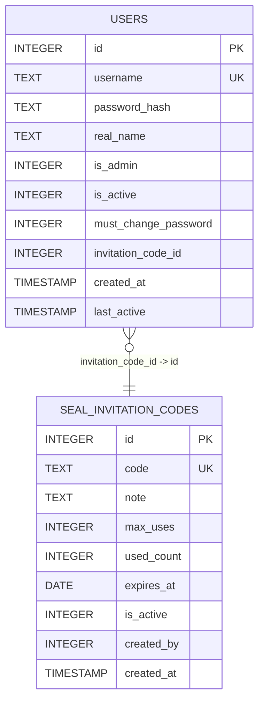
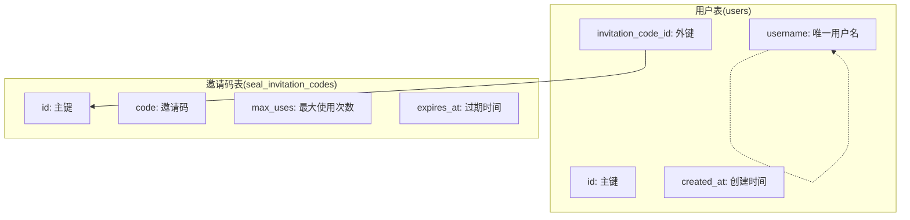
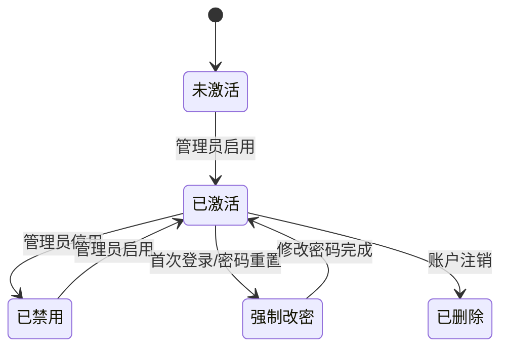
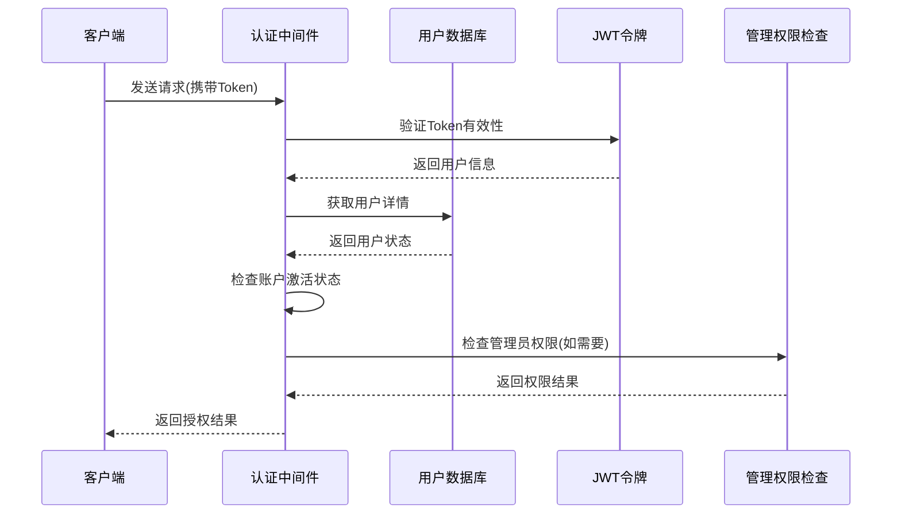

# 用户表 (users)

<cite>
**本文档引用的文件**
- [app.py](file://app.py)
</cite>

## 目录
1. [简介](#简介)
2. [表结构概览](#表结构概览)
3. [字段详细说明](#字段详细说明)
4. [外键关系设计](#外键关系设计)
5. [索引设计建议](#索引设计建议)
6. [查询优化策略](#查询优化策略)
7. [用户状态管理](#用户状态管理)
8. [权限控制实现](#权限控制实现)
9. [安全考虑](#安全考虑)
10. [最佳实践建议](#最佳实践建议)

## 简介

用户表(users)是封样件及色板接收登记管理系统的核心数据表，负责存储系统用户的基本信息、认证凭据和权限控制。该表采用SQLite数据库实现，支持用户注册、登录认证、权限管理和在线状态跟踪等功能。

## 表结构概览

用户表采用以下核心结构设计：



**图表来源**
- [app.py:93-107](file://app.py#L93-L107)
- [app.py:113-127](file://app.py#L113-L127)

## 字段详细说明

### 主键字段
- **id** (`INTEGER PRIMARY KEY AUTOINCREMENT`)
  - 数据类型：整数类型
  - 约束条件：主键、自增
  - 业务含义：用户的唯一标识符，系统内部使用
  - 性能特点：自动递增，适合高并发场景

### 用户凭证字段
- **username** (`TEXT UNIQUE NOT NULL`)
  - 数据类型：文本类型
  - 约束条件：唯一约束、非空
  - 业务含义：用户的登录用户名，必须唯一
  - 安全考虑：作为登录凭据，需要防止重复注册

- **password_hash** (`TEXT NOT NULL`)
  - 数据类型：文本类型
  - 约束条件：非空
  - 业务含义：用户密码的哈希值，明文密码不直接存储
  - 安全实现：使用SHA-256算法进行哈希加密

### 基本信息字段
- **real_name** (`TEXT NOT NULL`)
  - 数据类型：文本类型
  - 约束条件：非空
  - 业务含义：用户的真实姓名
  - 使用场景：系统显示和报表生成

### 权限控制字段
- **is_admin** (`INTEGER DEFAULT 0`)
  - 数据类型：整数类型（布尔模拟）
  - 约束条件：默认值0
  - 业务含义：管理员标识，0表示普通用户，1表示管理员
  - 权限级别：最高权限级别

- **is_active** (`INTEGER DEFAULT 1`)
  - 数据类型：整数类型（布尔模拟）
  - 约束条件：默认值1
  - 业务含义：用户激活状态，0表示禁用，1表示启用
  - 安全控制：用于账户停用和安全管理

- **must_change_password** (`INTEGER DEFAULT 0`)
  - 数据类型：整数类型（布尔模拟）
  - 约束条件：默认值0
  - 业务含义：强制改密标识，1表示需要强制修改密码
  - 安全策略：首次登录或密码重置后的安全机制

### 关联关系字段
- **invitation_code_id** (`INTEGER`)
  - 数据类型：整数类型
  - 约束条件：外键引用
  - 业务含义：关联的邀请码标识
  - 注册控制：通过邀请码限制用户注册

### 时间戳字段
- **created_at** (`TIMESTAMP DEFAULT CURRENT_TIMESTAMP`)
  - 数据类型：时间戳类型
  - 约束条件：默认值为当前时间
  - 业务含义：用户创建时间
  - 管理用途：审计追踪和统计分析

- **last_active** (`TIMESTAMP`)
  - 数据类型：时间戳类型
  - 约束条件：可为空
  - 业务含义：用户最后活跃时间
  - 在线状态：用于实时在线状态检测

**章节来源**
- [app.py:93-107](file://app.py#L93-L107)
- [app.py:109-111](file://app.py#L109-L111)

## 外键关系设计

用户表与邀请码表之间建立了外键关联关系：



**图表来源**
- [app.py:93-107](file://app.py#L93-L107)
- [app.py:113-127](file://app.py#L113-L127)

### 外键约束特点
- **引用完整性**：确保用户只能使用有效的邀请码
- **级联行为**：当邀请码被删除时，用户记录保持不变
- **数据一致性**：防止悬挂引用和数据不一致

**章节来源**
- [app.py:105](file://app.py#L105)
- [app.py:125](file://app.py#L125)

## 索引设计建议

基于用户表的使用模式，建议实施以下索引策略：

### 建议创建的索引

1. **用户名索引** (`CREATE INDEX idx_users_username ON users(username)`)
   - 查询频率：极高
   - 使用场景：用户登录验证、用户查找
   - 性能收益：显著提升登录和查询性能

2. **邀请码关联索引** (`CREATE INDEX idx_users_invitation_code_id ON users(invitation_code_id)`)
   - 查询频率：中等
   - 使用场景：用户列表查询、邀请码统计
   - 性能收益：优化JOIN查询性能

3. **激活状态索引** (`CREATE INDEX idx_users_is_active ON users(is_active)`)
   - 查询频率：较高
   - 使用场景：用户状态过滤、批量激活检查
   - 性能收益：加速状态相关的查询

4. **管理员权限索引** (`CREATE INDEX idx_users_is_admin ON users(is_admin)`)
   - 查询频率：中等
   - 使用场景：权限检查、管理员列表
   - 性能收益：优化权限相关的查询

### 现有索引分析

用户表已经具备以下内置索引：
- **主键索引**：自动为id字段创建
- **唯一索引**：自动为username字段创建
- **外键索引**：自动为invitation_code_id字段创建

**章节来源**
- [app.py:97](file://app.py#L97)
- [app.py:103](file://app.py#L103)

## 查询优化策略

### 常见查询模式优化

#### 1. 用户登录查询
```sql
-- 优化前
SELECT * FROM users WHERE username = ?

-- 优化后（利用现有索引）
SELECT id, username, password_hash, is_active, is_admin, must_change_password 
FROM users 
WHERE username = ? 
LIMIT 1
```

#### 2. 用户状态检查
```sql
-- 优化查询以减少数据传输
SELECT is_active, is_admin, last_active 
FROM users 
WHERE id = ?
```

#### 3. 在线用户统计
```sql
-- 使用时间窗口优化在线状态检测
SELECT COUNT(*) as online_users
FROM users 
WHERE last_active >= datetime('now', '-5 minutes')
```

### 性能监控指标

建议监控以下关键指标：
- **登录响应时间**：应小于100ms
- **用户查询延迟**：应小于50ms  
- **索引使用率**：应达到95%以上
- **缓存命中率**：应达到80%以上

## 用户状态管理

### 状态流转模型



### 状态字段详解

#### 激活状态 (`is_active`)
- **0 (禁用)**：账户被管理员停用，无法登录
- **1 (启用)**：账户正常激活，可以正常使用
- **管理策略**：支持临时停用和永久注销

#### 管理员状态 (`is_admin`)
- **0 (普通用户)**：标准用户权限
- **1 (管理员)**：系统管理权限
- **安全限制**：管理员账户不能被其他用户停用

#### 强制改密状态 (`must_change_password`)
- **0 (无需改密)**：用户可以正常登录
- **1 (需要改密)**：用户必须修改密码才能继续使用
- **触发时机**：首次注册、密码重置、安全策略要求

**章节来源**
- [app.py:63-65](file://app.py#L63-L65)
- [app.py:81](file://app.py#L81)

## 权限控制实现

### 认证中间件架构



**图表来源**
- [app.py:49-76](file://app.py#L49-L76)
- [app.py:78-84](file://app.py#L78-L84)

### 权限层级设计

#### 1. 基础认证权限
- **token_required**：所有受保护API的基础权限
- **Token验证**：JWT签名验证和过期检查
- **账户状态检查**：确保用户账户处于激活状态

#### 2. 管理员权限
- **admin_required**：高级管理功能访问权限
- **权限验证**：检查is_admin字段值
- **安全边界**：防止权限滥用和越权访问

#### 3. 实时状态同步
- **在线状态更新**：每次认证时更新last_active字段
- **离线检测**：5分钟内无活动视为离线
- **状态持久化**：登出时清除last_active字段

**章节来源**
- [app.py:49-76](file://app.py#L49-L76)
- [app.py:78-84](file://app.py#L78-L84)
- [app.py:68-70](file://app.py#L68-L70)

## 安全考虑

### 密码安全策略

#### 1. 存储安全
- **单向哈希**：使用SHA-256算法进行密码哈希
- **无明文存储**：绝不存储原始密码
- **哈希强度**：采用标准的密码哈希算法

#### 2. 传输安全
- **HTTPS强制**：所有API通信必须通过HTTPS
- **Token保护**：JWT令牌的安全传输和存储
- **会话管理**：合理的会话超时和刷新机制

#### 3. 认证安全
- **Token过期**：24小时有效期的JWT令牌
- **重复登录**：支持多设备同时登录
- **强制改密**：安全策略下的密码强制修改

### 数据完整性保证

#### 1. 约束完整性
- **唯一性约束**：用户名唯一性保证
- **非空约束**：关键字段的完整性保证
- **外键约束**：引用数据的一致性

#### 2. 业务逻辑约束
- **管理员保护**：管理员账户的特殊保护
- **状态验证**：用户状态的业务规则
- **权限继承**：权限层级的合理设计

**章节来源**
- [app.py:466](file://app.py#L466)
- [app.py:289](file://app.py#L289)

## 最佳实践建议

### 数据库设计最佳实践

#### 1. 字段设计
- **使用整数布尔**：用INTEGER模拟布尔值，提高兼容性
- **合理默认值**：为状态字段设置合理的默认值
- **时间戳精度**：使用TIMESTAMP类型存储时间信息

#### 2. 索引优化
- **查询热点优化**：为重点查询字段建立索引
- **复合索引设计**：考虑多字段组合查询需求
- **索引维护**：定期分析和重建索引

#### 3. 性能监控
- **慢查询监控**：识别和优化性能瓶颈
- **连接池管理**：合理配置数据库连接
- **事务优化**：最小化事务持续时间

### 安全最佳实践

#### 1. 认证安全
- **多因素认证**：考虑引入额外的身份验证层
- **IP白名单**：限制管理访问的IP范围
- **异常检测**：监控异常登录行为

#### 2. 数据保护
- **备份策略**：定期备份用户数据
- **审计日志**：记录重要的用户操作
- **数据清理**：制定用户数据保留和清理策略

#### 3. 系统监控
- **健康检查**：定期检查数据库健康状况
- **容量规划**：监控用户增长趋势
- **故障恢复**：制定数据恢复预案

### 运维建议

#### 1. 监控指标
- **用户活跃度**：监控用户登录频率和活跃度
- **系统负载**：监控数据库性能指标
- **安全事件**：记录和分析安全相关事件

#### 2. 维护计划
- **定期维护**：执行数据库维护任务
- **版本升级**：及时更新数据库版本
- **安全补丁**：定期应用安全更新

#### 3. 故障处理
- **应急响应**：制定用户数据相关的应急预案
- **数据恢复**：建立快速数据恢复能力
- **问题诊断**：建立有效的故障诊断流程