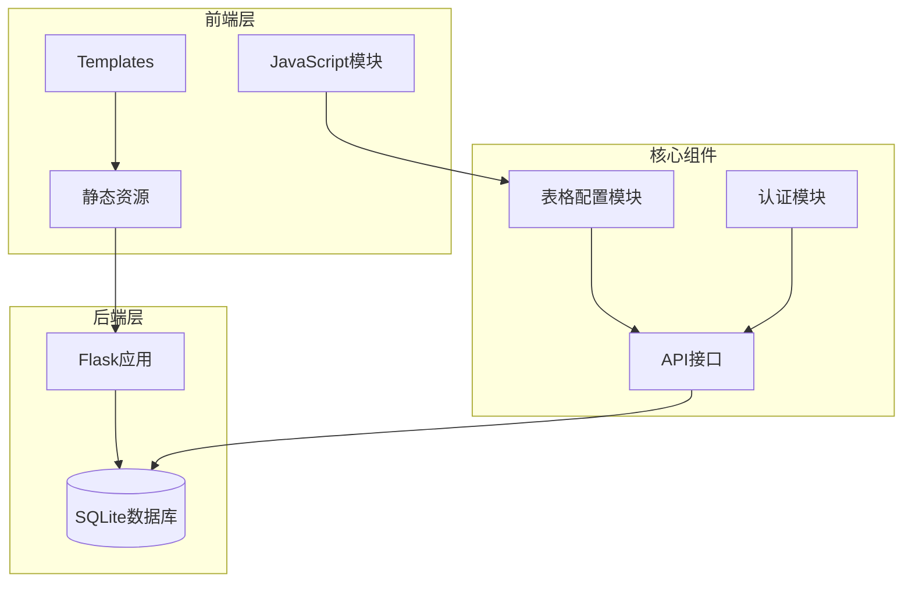
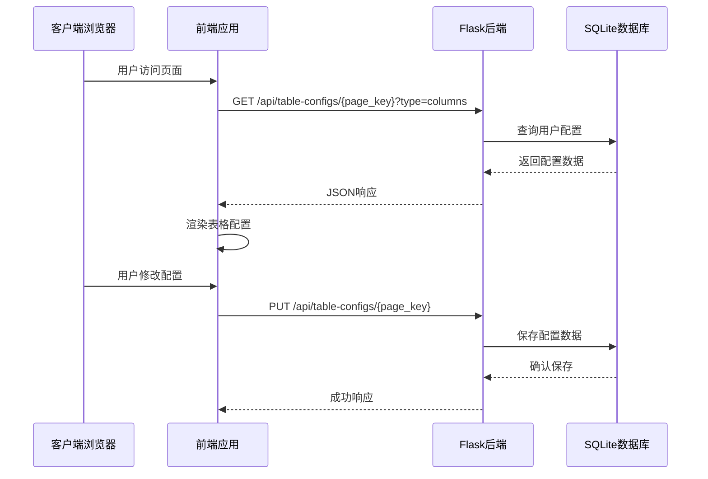
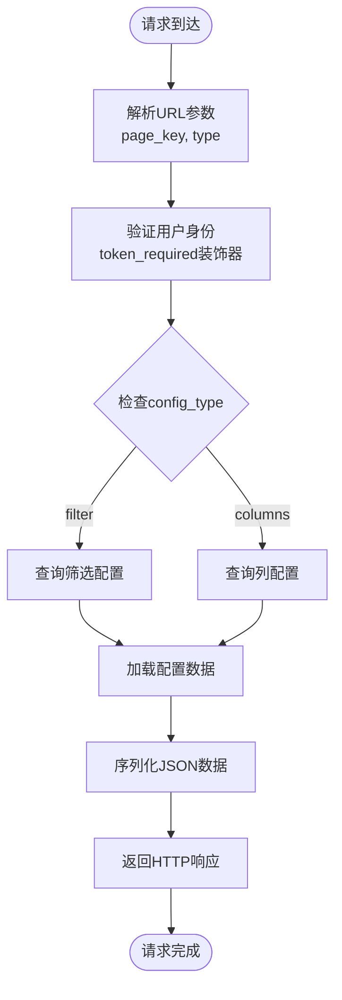
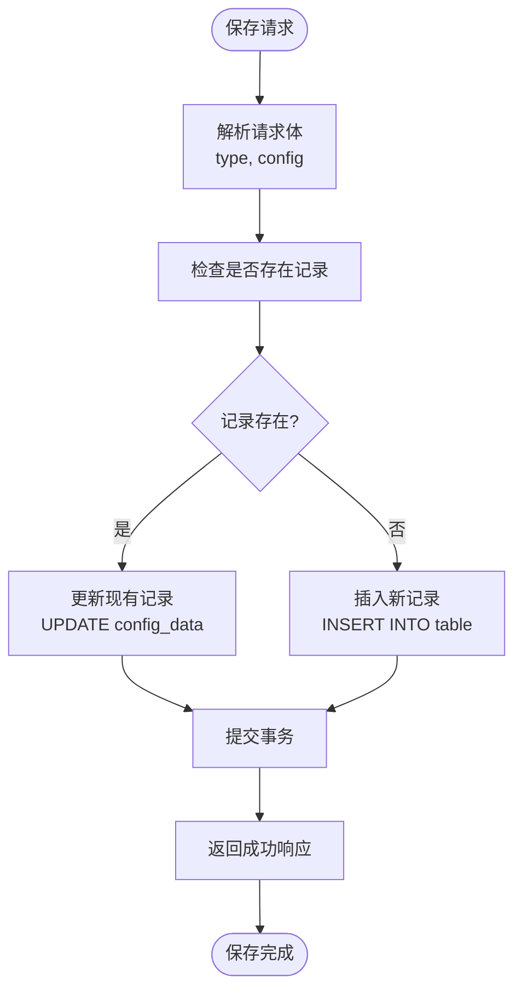
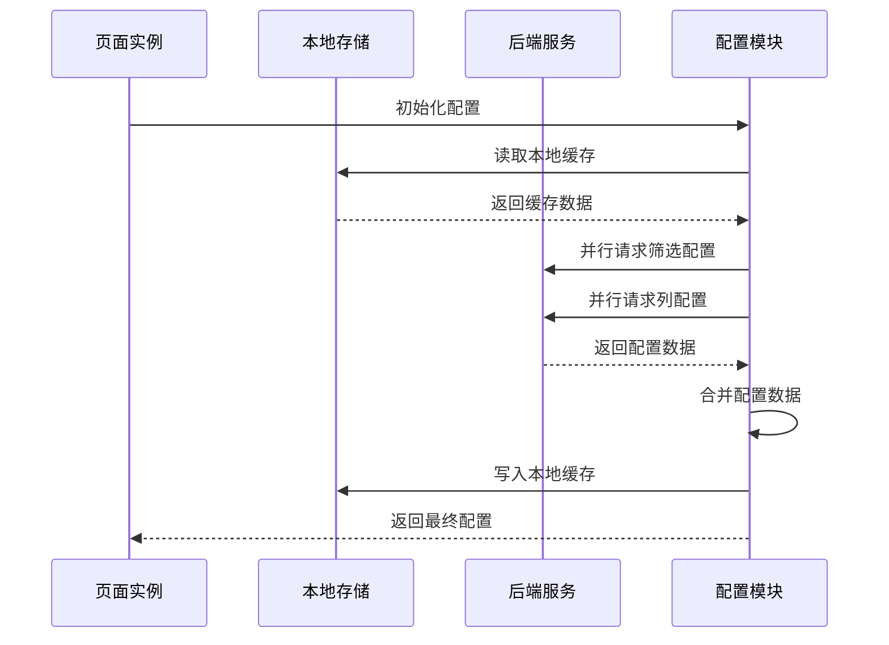
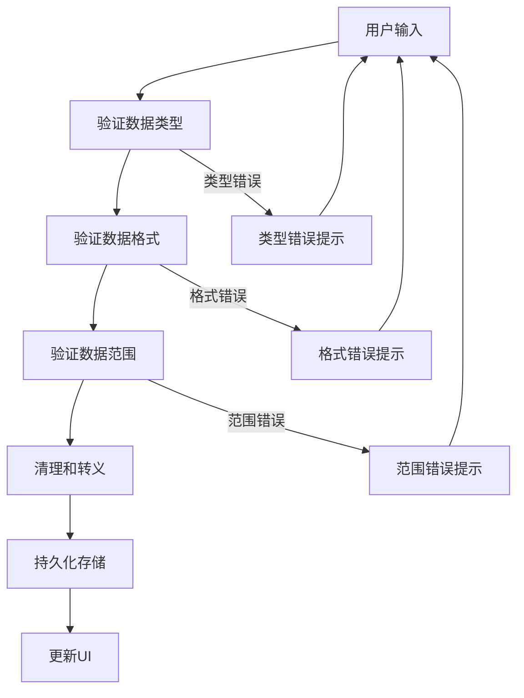
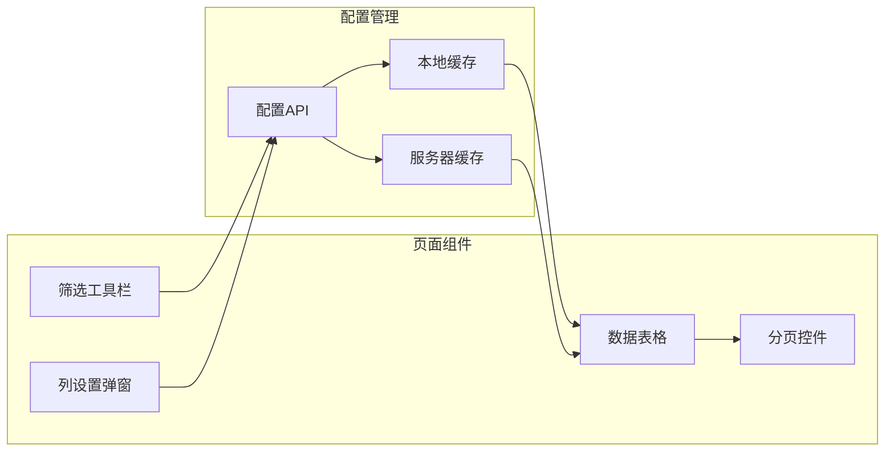
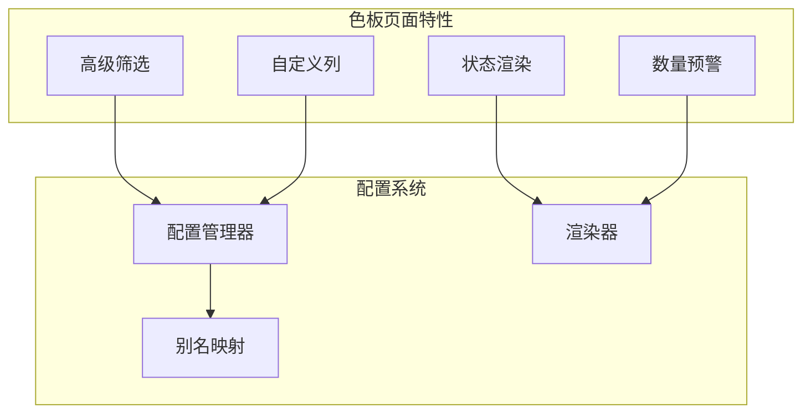
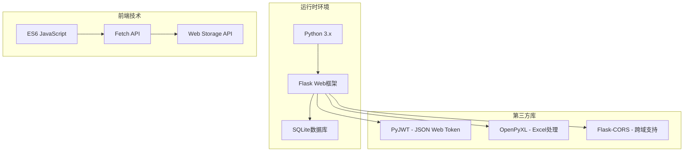
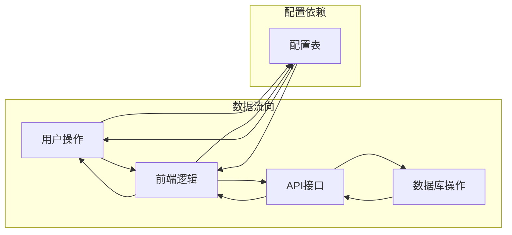

# 用户表格配置表 (seal_user_table_configs)

<cite>
**本文档引用的文件**
- [app.py](file://app.py)
- [table-config.js](file://static/js/table-config.js)
- [requirements.txt](file://requirements.txt)
- [index.html](file://templates/index.html)
- [seal-sample.html](file://templates/seal-sample.html)
- [color-sample.html](file://templates/color-sample.html)
</cite>

## 目录
1. [简介](#简介)
2. [项目结构](#项目结构)
3. [核心组件](#核心组件)
4. [架构概览](#架构概览)
5. [详细组件分析](#详细组件分析)
6. [依赖分析](#依赖分析)
7. [性能考虑](#性能考虑)
8. [故障排除指南](#故障排除指南)
9. [结论](#结论)

## 简介

用户表格配置表 (`seal_user_table_configs`) 是封样件及色板接收登记管理系统中的核心组件，负责存储用户的个性化表格配置信息。该表支持两个主要配置类型：
- **筛选条件配置** (`config_type='filter'`)：存储用户的动态筛选条件
- **列显示配置** (`config_type='columns'`)：存储用户自定义的列显示设置

该表实现了用户界面的个性化定制，允许用户根据自己的工作习惯调整表格的显示方式和筛选条件，提升系统的可用性和用户体验。

## 项目结构

系统采用Flask框架构建，采用前后端分离的架构设计：



**图表来源**
- [app.py:1-25](file://app.py#L1-L25)
- [table-config.js:1-10](file://static/js/table-config.js#L1-L10)

**章节来源**
- [app.py:1-25](file://app.py#L1-L25)
- [requirements.txt:1-5](file://requirements.txt#L1-L5)

## 核心组件

### 数据库表结构

用户表格配置表采用以下字段定义：

| 字段名 | 类型 | 约束 | 描述 |
|--------|------|------|------|
| id | INTEGER | PRIMARY KEY, AUTOINCREMENT | 主键标识符 |
| user_id | INTEGER | NOT NULL, FOREIGN KEY | 关联用户表的用户ID |
| page_key | TEXT | NOT NULL | 页面标识符，如 'seal_sample', 'color_sample' |
| config_type | TEXT | NOT NULL | 配置类型，'filter' 或 'columns' |
| config_data | TEXT | NOT NULL, DEFAULT '{}' | JSON序列化的配置数据 |
| updated_at | TIMESTAMP | DEFAULT CURRENT_TIMESTAMP | 更新时间戳 |

### 配置数据结构

系统支持两种主要的配置数据结构：

#### 筛选条件配置 (config_type='filter')
```javascript
{
  "filters": [
    {
      "field": "项目",
      "op": "contains",
      "value": "示例项目"
    },
    {
      "field": "状态",
      "op": "equals",
      "value": "normal"
    }
  ]
}
```

#### 列显示配置 (config_type='columns')
```javascript
{
  "columns": [
    "序号",
    "项目", 
    "封样件名称",
    "签署人",
    "签署人日期",
    "有效期",
    "状态"
  ]
}
```

**章节来源**
- [app.py:309-321](file://app.py#L309-L321)
- [table-config.js:15-154](file://static/js/table-config.js#L15-L154)

## 架构概览

系统采用三层架构设计，实现了前后端的清晰分离：



**图表来源**
- [app.py:1581-1625](file://app.py#L1581-L1625)
- [table-config.js:165-221](file://static/js/table-config.js#L165-L221)

## 详细组件分析

### 后端API实现

#### 配置获取接口
系统提供了RESTful API来管理用户表格配置：



**图表来源**
- [app.py:1581-1597](file://app.py#L1581-L1597)

#### 配置保存接口
配置保存流程支持自动创建和更新操作：



**图表来源**
- [app.py:1599-1625](file://app.py#L1599-L1625)

**章节来源**
- [app.py:1581-1625](file://app.py#L1581-L1625)

### 前端配置管理

#### 配置加载机制
前端使用异步加载策略，确保用户体验流畅：



**图表来源**
- [table-config.js:165-206](file://static/js/table-config.js#L165-L206)

#### 配置验证和清理
前端实现了多层验证机制：



**图表来源**
- [table-config.js:354-377](file://static/js/table-config.js#L354-L377)

**章节来源**
- [table-config.js:165-221](file://static/js/table-config.js#L165-L221)

### 页面集成

#### 封样件台账页面集成
封样件台账页面集成了完整的表格配置功能：



**图表来源**
- [seal-sample.html:1-45](file://templates/seal-sample.html#L1-L45)
- [table-config.js:403-466](file://static/js/table-config.js#L403-L466)

#### 色板台账页面集成
色板台账页面具有更复杂的配置需求：



**图表来源**
- [color-sample.html:1-42](file://templates/color-sample.html#L1-L42)
- [table-config.js:44-83](file://static/js/table-config.js#L44-L83)

**章节来源**
- [seal-sample.html:1-45](file://templates/seal-sample.html#L1-L45)
- [color-sample.html:1-42](file://templates/color-sample.html#L1-L42)

## 依赖分析

### 技术栈依赖

系统采用现代化的技术栈组合：



**图表来源**
- [requirements.txt:1-5](file://requirements.txt#L1-L5)

### 数据流依赖



**图表来源**
- [app.py:1581-1625](file://app.py#L1581-L1625)
- [table-config.js:165-221](file://static/js/table-config.js#L165-L221)

**章节来源**
- [requirements.txt:1-5](file://requirements.txt#L1-L5)

## 性能考虑

### 数据库优化
- **索引策略**：使用UNIQUE约束 `(user_id, page_key, config_type)` 确保查询效率
- **序列化优化**：使用JSON字符串存储复杂配置，减少表结构复杂度
- **缓存机制**：前后端双重缓存减少数据库访问频率

### 前端性能
- **异步加载**：配置数据异步加载，避免阻塞页面渲染
- **本地存储**：使用localStorage缓存配置，提升二次访问速度
- **批量操作**：支持并行请求多个配置类型

### 安全考虑
- **SQL注入防护**：使用参数化查询防止SQL注入攻击
- **XSS防护**：前端对用户输入进行HTML转义
- **CSRF防护**：通过JWT令牌验证请求合法性

## 故障排除指南

### 常见问题诊断

#### 配置无法保存
1. **检查网络连接**：确认API请求能够正常到达后端
2. **验证用户权限**：确保用户已通过认证
3. **检查数据格式**：确认配置数据符合预期格式

#### 配置丢失或异常
1. **检查浏览器存储**：确认localStorage中存在缓存数据
2. **验证数据库连接**：检查SQLite数据库文件完整性
3. **查看错误日志**：分析后端错误信息

#### 性能问题
1. **监控API响应时间**：使用浏览器开发者工具分析网络请求
2. **检查数据库查询**：验证SQL查询是否使用了适当索引
3. **优化前端渲染**：减少不必要的DOM操作

**章节来源**
- [app.py:48-76](file://app.py#L48-L76)
- [table-config.js:165-221](file://static/js/table-config.js#L165-L221)

## 结论

用户表格配置表 (`seal_user_table_configs`) 作为系统的核心组件，成功实现了用户个性化的表格配置管理。通过前后端分离的设计，系统提供了灵活的配置选项和良好的用户体验。

### 主要优势
- **灵活性**：支持多种配置类型和复杂的筛选条件
- **易用性**：直观的界面设计和实时预览功能
- **可扩展性**：模块化设计便于功能扩展和维护
- **可靠性**：完善的错误处理和数据验证机制

### 技术特色
- **双缓存策略**：本地存储和服务器存储相结合
- **异步处理**：非阻塞的配置加载和保存机制
- **安全设计**：多层次的安全防护措施
- **性能优化**：针对大数据量场景的优化策略

该系统为用户提供了一个强大而灵活的表格配置解决方案，显著提升了系统的可用性和用户体验。