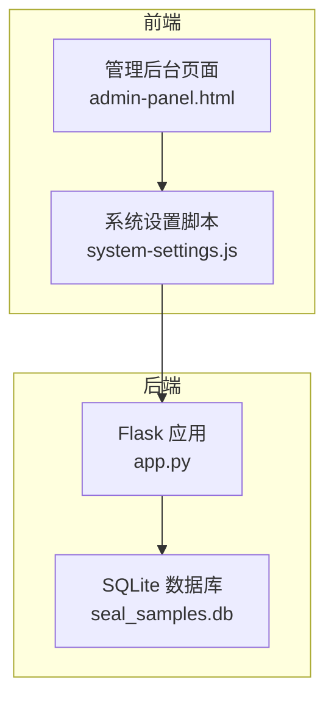
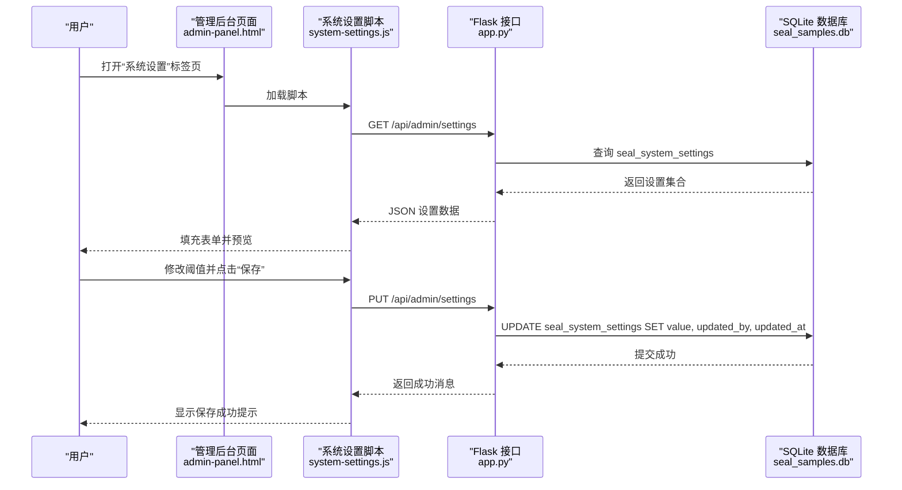
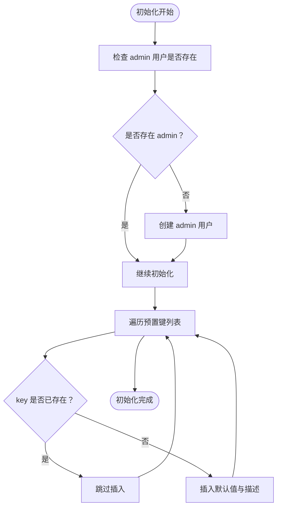
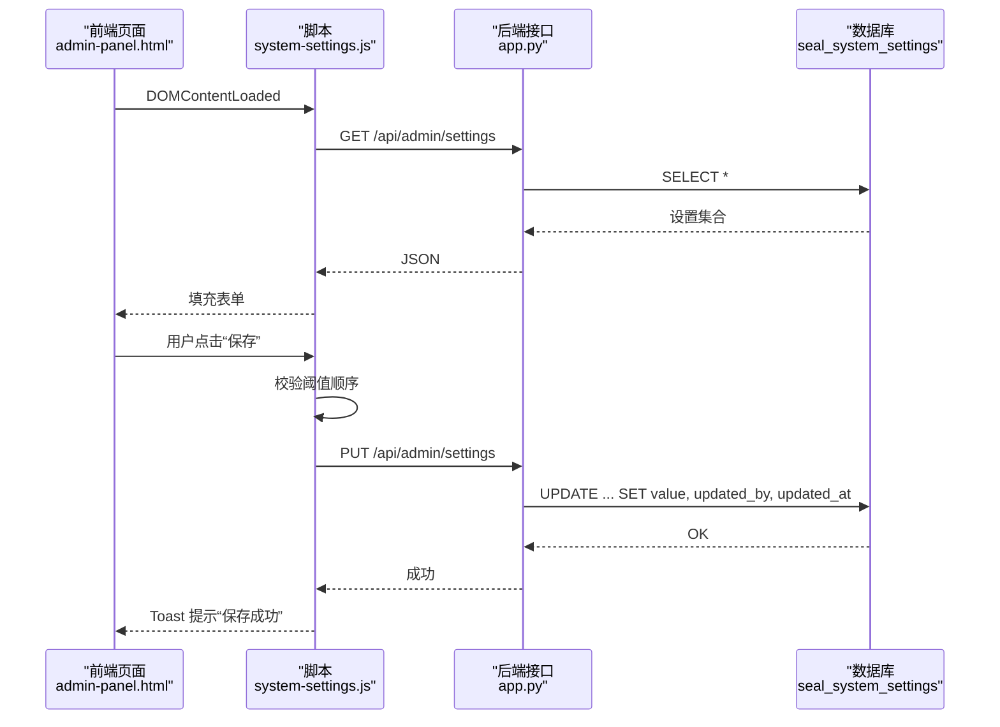

# 系统设置表 (seal_system_settings)

<cite>
**本文引用的文件**
- [app.py](file://app.py)
- [system-settings.js](file://static/js/system-settings.js)
- [admin-panel.html](file://templates/admin-panel.html)
</cite>

## 目录
1. [简介](#简介)
2. [项目结构](#项目结构)
3. [核心组件](#核心组件)
4. [架构总览](#架构总览)
5. [详细组件分析](#详细组件分析)
6. [依赖分析](#依赖分析)
7. [性能考虑](#性能考虑)
8. [故障排查指南](#故障排查指南)
9. [结论](#结论)
10. [附录](#附录)

## 简介
本文件针对系统设置表 (seal_system_settings) 提供完整的数据库表结构文档，涵盖字段定义、键值对存储机制、设置分类、预置设置初始化流程、查询与更新接口、审计追踪能力、业务含义与配置规则，以及备份与迁移策略。系统采用 SQLite 存储，Flask 提供 REST API，前端通过管理后台进行配置。

## 项目结构
- 后端入口与数据库初始化位于 [app.py](file://app.py)，其中包含系统设置表的建表语句与预置设置初始化逻辑。
- 前端管理后台页面包含“系统设置”标签页，负责展示与编辑 ΔE 阈值等设置，脚本位于 [system-settings.js](file://static/js/system-settings.js)。
- 页面模板位于 [admin-panel.html](file://templates/admin-panel.html)，承载设置表单与交互。

图表来源
- [app.py](file://app.py)
- [system-settings.js](file://static/js/system-settings.js)
- [admin-panel.html](file://templates/admin-panel.html)

章节来源
- [app.py](file://app.py)
- [system-settings.js](file://static/js/system-settings.js)
- [admin-panel.html](file://templates/admin-panel.html)

## 核心组件
- 系统设置表 (seal_system_settings)
  - 字段：id、key、value、description、updated_by、updated_at
  - 主键：id
  - 唯一键：key
  - 外键：updated_by 引用 users 表 id
  - 默认值：updated_at 使用数据库默认时间戳
- 预置设置
  - delta_e_excellent：优秀阈值上限
  - delta_e_good：合格阈值上限
  - delta_e_warning：需关注阈值上限
- 设置接口
  - GET /api/admin/settings：获取所有系统设置
  - PUT /api/admin/settings：批量更新系统设置

章节来源
- [app.py](file://app.py)
- [system-settings.js](file://static/js/system-settings.js)

## 架构总览
系统设置的前后端交互遵循典型的 REST 风格：
- 前端在“系统设置”页加载设置，实时预览阈值效果
- 用户提交后，前端调用后端 PUT 接口更新设置
- 后端写入 seal_system_settings，并记录 updated_by 与 updated_at

图表来源
- [app.py](file://app.py)
- [system-settings.js](file://static/js/system-settings.js)
- [admin-panel.html](file://templates/admin-panel.html)

## 详细组件分析

### 数据库表结构：seal_system_settings
- 表名：seal_system_settings
- 字段说明
  - id：整型，主键，自增
  - key：文本，唯一，非空，作为设置键
  - value：文本，非空，存储设置值
  - description：文本，描述性说明
  - updated_by：整型，外键，引用 users.id
  - updated_at：时间戳，默认 CURRENT_TIMESTAMP
- 约束与索引
  - 主键：id
  - 唯一约束：key
  - 外键：updated_by -> users(id)
- 初始化流程
  - 在数据库初始化时，若不存在对应 key 的记录，则插入默认阈值设置
  - 预置键：delta_e_excellent、delta_e_good、delta_e_warning
  - 描述字段用于前端展示与说明

章节来源
- [app.py](file://app.py)

### 键值对存储机制与设置分类
- 键值对存储
  - key 作为唯一标识，value 以文本形式存储，便于灵活扩展
  - 建议 value 为字符串格式，前端解析为数值或布尔值
- 设置分类
  - 当前仅包含 ΔE 阈值类设置
  - 可扩展为多类别（如“色差评估”、“有效期管理”、“界面偏好”等），通过 key 前缀或新增分类字段区分
- 值域与校验
  - 前端对 ΔE 阈值进行大小顺序校验（优秀 < 合格 < 需关注）
  - 后端在更新时直接写入，建议在业务层增加更严格的类型与范围校验

章节来源
- [app.py](file://app.py)
- [system-settings.js](file://static/js/system-settings.js)

### 预置设置初始化流程
- 触发时机：数据库初始化时
- 步骤
  - 检查是否存在对应 key 的记录
  - 若不存在，则插入默认值与描述
- 预置键
  - delta_e_excellent：优秀阈值上限
  - delta_e_good：合格阈值上限
  - delta_e_warning：需关注阈值上限

图表来源
- [app.py](file://app.py)

章节来源
- [app.py](file://app.py)

### 查询与更新接口
- 查询接口
  - 方法：GET
  - 路径：/api/admin/settings
  - 权限：需登录且管理员
  - 返回：所有设置的 key-value 集合
- 更新接口
  - 方法：PUT
  - 路径：/api/admin/settings
  - 请求体：settings 数组，元素包含 key 与 value
  - 权限：需登录且管理员
  - 行为：逐项更新 value，并记录 updated_by 与 updated_at
- 前端交互
  - 页面加载时拉取设置
  - 用户修改阈值后提交保存，前端进行顺序校验
  - 保存成功后即时生效

图表来源
- [app.py](file://app.py)
- [system-settings.js](file://static/js/system-settings.js)
- [admin-panel.html](file://templates/admin-panel.html)

章节来源
- [app.py](file://app.py)
- [system-settings.js](file://static/js/system-settings.js)
- [admin-panel.html](file://templates/admin-panel.html)

### 审计追踪功能
- 追踪内容
  - updated_by：记录最后一次更新的用户 ID
  - updated_at：记录更新时间
- 实现方式
  - 更新接口在执行 UPDATE 时同时写入 updated_by 与 updated_at
  - 前端保存成功后立即生效，无需额外审计日志表
- 建议增强
  - 可引入独立的审计日志表，记录每次变更的 key、旧值、新值、操作人、时间等，便于合规与问题追溯

章节来源
- [app.py](file://app.py)

### 业务含义与配置规则
- 业务含义
  - ΔE 阈值决定色差评估结果的颜色标识与等级划分
  - 优秀：ΔE < 优秀阈值
  - 合格：优秀阈值 ≤ ΔE < 合格阈值
  - 需关注：ΔE ≥ 合格阈值
- 配置规则
  - 优秀阈值 < 合格阈值 < 需关注阈值
  - 建议合理设置“需关注阈值”，避免过度触发
  - 前端已内置顺序校验，后端应进一步加强类型与范围校验

章节来源
- [system-settings.js](file://static/js/system-settings.js)
- [admin-panel.html](file://templates/admin-panel.html)

### 备份与迁移策略
- 备份
  - SQLite 数据库文件即为备份：seal_samples.db
  - 建议定期复制 seal_samples.db 至安全位置
- 迁移
  - 结构迁移：通过数据库初始化脚本（建表、ALTER 表）保证版本演进
  - 数据迁移：可导出/导入其他表的数据（如 Excel），但系统设置表通常较小，可直接复制数据库文件
- 注意事项
  - 迁移前停止服务，确保一致性
  - 迁移后验证关键设置（如预置阈值）是否正确

章节来源
- [app.py](file://app.py)

## 依赖分析
- 组件耦合
  - 前端脚本依赖后端接口；后端接口依赖数据库表结构
  - 管理后台页面承载前端交互，与脚本强关联
- 外部依赖
  - Flask、SQLite、openpyxl（用于导入导出，与设置表无直接依赖）

图表来源
- [app.py](file://app.py)
- [system-settings.js](file://static/js/system-settings.js)
- [admin-panel.html](file://templates/admin-panel.html)

章节来源
- [app.py](file://app.py)
- [system-settings.js](file://static/js/system-settings.js)
- [admin-panel.html](file://templates/admin-panel.html)

## 性能考虑
- 查询性能
  - 设置表规模小，单次查询成本极低
  - 建议保持 key 唯一，避免重复键导致的维护复杂度
- 写入性能
  - 更新接口批量写入，建议在高并发场景下增加事务封装与重试机制
- 前端体验
  - 实时预览减少反复提交，提升用户体验

## 故障排查指南
- 常见问题
  - 无法访问设置接口：确认已登录且具备管理员权限
  - 保存失败：检查请求体格式与阈值顺序是否满足要求
  - 预置设置缺失：确认数据库初始化是否执行成功
- 排查步骤
  - 查看后端日志与响应状态码
  - 核对 seal_system_settings 中是否存在对应 key
  - 确认 updated_by 与 updated_at 是否更新

章节来源
- [app.py](file://app.py)

## 结论
seal_system_settings 采用简洁的键值对设计，配合预置初始化与完善的接口，实现了 ΔE 阈值的灵活配置与即时生效。前端提供直观的阈值校验与预览，后端通过 updated_by 与 updated_at 实现基础审计。建议后续引入独立审计日志表以满足更严格的合规需求，并在后端增加更强的类型与范围校验，提升系统稳定性与安全性。

## 附录
- 接口清单
  - GET /api/admin/settings：获取所有系统设置
  - PUT /api/admin/settings：批量更新系统设置
- 前端页面
  - 管理后台“系统设置”标签页，承载阈值配置与预览