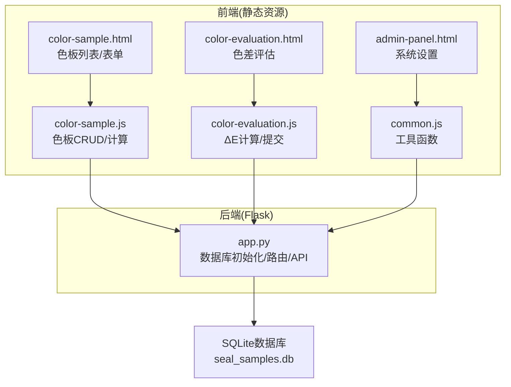
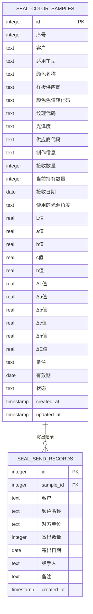
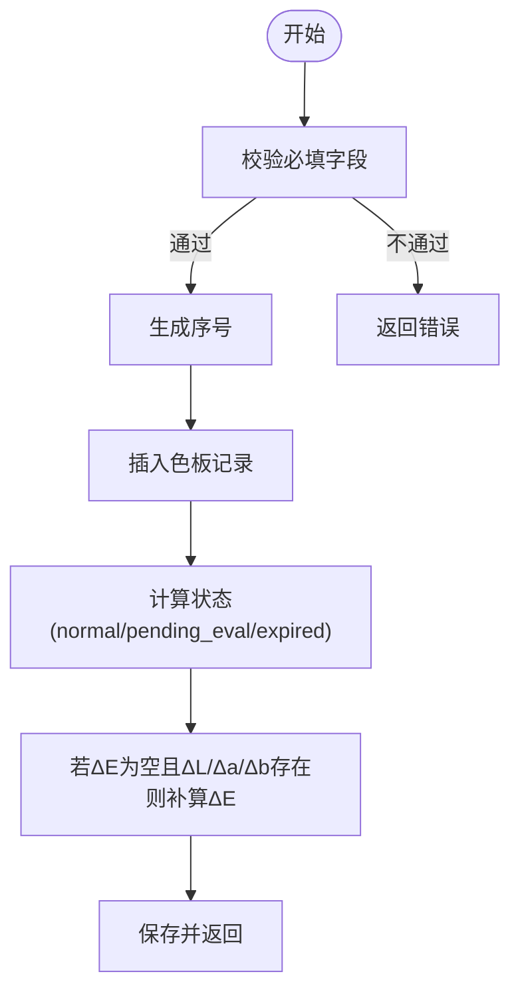
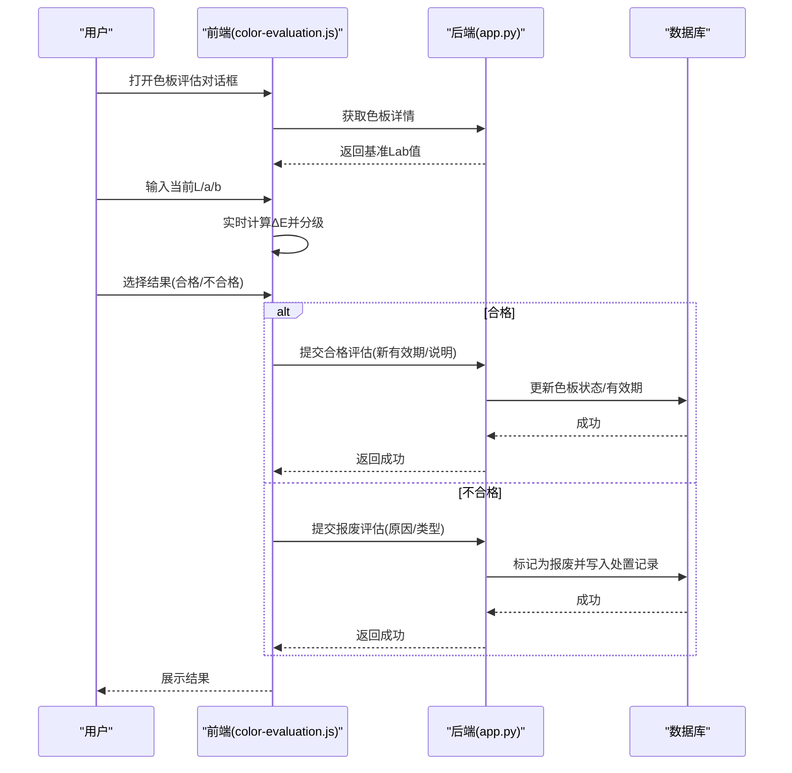
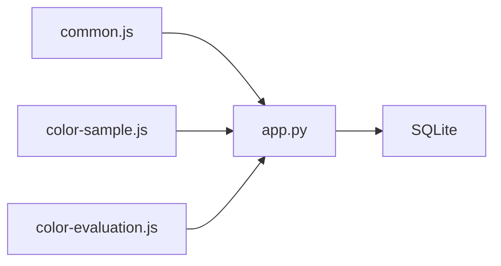

# 色板台账表 (seal_color_samples)

<cite>
**本文档引用的文件**
- [app.py](file://app.py)
- [common.js](file://static/js/common.js)
- [color-evaluation.js](file://static/js/color-evaluation.js)
- [color-sample.js](file://static/js/color-sample.js)
- [color-sample.html](file://templates/color-sample.html)
- [admin-panel.html](file://templates/admin-panel.html)
</cite>

## 目录
1. [简介](#简介)
2. [项目结构](#项目结构)
3. [核心组件](#核心组件)
4. [架构总览](#架构总览)
5. [详细组件分析](#详细组件分析)
6. [依赖分析](#依赖分析)
7. [性能考虑](#性能考虑)
8. [故障排查指南](#故障排查指南)
9. [结论](#结论)
10. [附录](#附录)

## 简介
本文件为色板台账表 (seal_color_samples) 的全面数据库表结构文档。该表承载色板的完整生命周期数据，涵盖基础信息、物理属性、光学测量、色差计算、业务管理等29个字段，并与前端色板管理、色差评估、寄出管理、系统设置等功能模块紧密集成。文档同时解释Lab色彩空间与CIE76 ΔE色差计算原理，说明库存管理与色差评估的业务逻辑，并提供查询与统计分析的优化策略。

## 项目结构
后端采用Flask + SQLite架构，数据库初始化在应用启动时完成，包含色板台账表、寄出台账表、有效期管理表、评定记录表、报废记录表、系统设置表、用户表、邀请码表、用户表格配置表等。前端通过静态资源提供色板管理界面、色差评估界面、仪表盘、系统设置等页面。

图表来源
- [app.py:88-335](file://app.py#L88-L335)
- [color-sample.html:24-42](file://templates/color-sample.html#L24-L42)
- [admin-panel.html:51-85](file://templates/admin-panel.html#L51-L85)

章节来源
- [app.py:88-335](file://app.py#L88-L335)

## 核心组件
- 数据库表：seal_color_samples（色板台账表，29字段）
- 后端API：色板CRUD、导入导出、有效期状态计算、寄出扣减、批量补算ΔE
- 前端组件：色板列表/表单、色差评估对话框、系统设置（ΔE阈值）、仪表盘
- 工具函数：ΔE计算、有效期状态判断、日期格式化、分页

章节来源
- [app.py:152-201](file://app.py#L152-L201)
- [app.py:843-901](file://app.py#L843-L901)
- [app.py:1010-1040](file://app.py#L1010-L1040)
- [common.js:25-40](file://static/js/common.js#L25-L40)
- [color-evaluation.js:1-200](file://static/js/color-evaluation.js#L1-L200)

## 架构总览
色板台账表作为核心实体，与寄出台账表形成一对多关系；前端通过API进行增删改查、导入导出、有效期预警、色差评估与阈值设置。系统支持自动补算ΔE值与状态重算，保障数据一致性。

图表来源
- [app.py:152-186](file://app.py#L152-L186)
- [app.py:202-217](file://app.py#L202-L217)

## 详细组件分析

### 数据库表结构定义（29字段）
- 基础信息字段
  - 序号：整型，唯一编号
  - 客户：文本
  - 适用车型：文本
  - 颜色名称：文本
  - 样板供应商：文本
- 物理属性字段
  - 颜色色值转化码：文本
  - 纹理代码：文本
  - 光泽度：文本
  - 供应商代码：文本
  - 制作信息：文本
- 光学测量字段
  - 接收数量：整型
  - 当前持有数量：整型，默认0
  - 接收日期：日期
  - 使用的光源角度：文本
  - L值、a值、b值：浮点数
  - c值、h值：浮点数
- 色差计算字段
  - ΔL值、Δa值、Δb值、Δc值、Δh值、ΔE值：浮点数
- 业务管理字段
  - 备注：文本
  - 有效期：日期
  - 状态：文本，默认normal
  - created_at、updated_at：时间戳
- 兼容性增强
  - 自动补全缺失列（备注、有效期、ΔL/Δa/Δb/Δc/Δh/ΔE、提醒天数）

章节来源
- [app.py:152-201](file://app.py#L152-L201)

### Lab色彩空间与CIE76 ΔE色差计算原理
- Lab色彩空间
  - L：亮度分量（0~100）
  - a：从绿色到红色的维度
  - b：从蓝色到黄色的维度
- CIE76 ΔE计算
  - ΔE = √[(L₂ - L₁)² + (a₂ - a₁)² + (b₂ - b₁)²]
  - 前端与后端均实现该公式，用于实时预览与批量补算
- 阈值分级
  - 优秀：ΔE < 优秀阈值
  - 合格：优秀阈值 ≤ ΔE < 合格阈值
  - 关注：ΔE ≥ 合格阈值
  - 阈值可通过系统设置动态调整

章节来源
- [app.py:343-348](file://app.py#L343-L348)
- [common.js:25-40](file://static/js/common.js#L25-L40)
- [color-evaluation.js:1-200](file://static/js/color-evaluation.js#L1-L200)
- [admin-panel.html:51-85](file://templates/admin-panel.html#L51-L85)

### 色板库存管理业务逻辑
- 接收与持有
  - 接收数量与当前持有数量初始值可同步
  - 寄出时从当前持有数量中扣减
- 状态流转
  - 正常(normal)：有效期剩余天数大于提醒天数
  - 待评定(pending_eval)：有效期剩余天数在提醒天数内但未过期
  - 已过期(expired)：有效期已过期
  - 已报废(scrapped)：经报废流程锁定
- 导入时自动补算
  - 若ΔE值为空且ΔL/Δa/Δb任一存在，则按CIE76公式补算ΔE
  - 状态根据有效期与提醒天数重算

图表来源
- [app.py:843-868](file://app.py#L843-L868)
- [app.py:1010-1034](file://app.py#L1010-L1034)

章节来源
- [app.py:843-901](file://app.py#L843-L901)
- [app.py:1010-1040](file://app.py#L1010-L1040)

### 色差评估业务逻辑
- 评估入口
  - 仅对状态为“待评定”或“已过期”的色板开放
- 评估流程
  - 输入当前实测L/a/b，实时计算ΔE并按阈值分级
  - 合格：可设定新有效期并续期
  - 不合格：选择报废原因与类型，执行报废流程
- 阈值配置
  - 可在系统设置中调整优秀/合格阈值，前端即时预览效果

图表来源
- [color-evaluation.js:1-200](file://static/js/color-evaluation.js#L1-L200)
- [app.py:882-901](file://app.py#L882-L901)

章节来源
- [color-evaluation.js:1-200](file://static/js/color-evaluation.js#L1-L200)
- [app.py:882-901](file://app.py#L882-L901)

### 寄出管理与库存扣减
- 寄出校验
  - 样品必须为正常状态
  - 寄出数量不得大于当前持有数量
- 扣减与回滚
  - 成功寄出后扣减当前持有数量
  - 删除寄出记录时恢复库存

章节来源
- [app.py:1110-1155](file://app.py#L1110-L1155)

### 前端交互与展示
- 色板列表
  - 动态列配置、筛选、分页
  - 显示有效期剩余天数、ΔE值、状态标签
- 色差评估
  - 实时ΔE计算与阈值提示
  - 合格/不合格路径的表单与确认
- 系统设置
  - ΔE阈值配置与预览

章节来源
- [color-sample.js:29-58](file://static/js/color-sample.js#L29-L58)
- [color-sample.js:153-185](file://static/js/color-sample.js#L153-L185)
- [color-evaluation.js:1-200](file://static/js/color-evaluation.js#L1-L200)
- [admin-panel.html:51-85](file://templates/admin-panel.html#L51-L85)

## 依赖分析
- 后端依赖
  - SQLite：存储色板、寄出、有效期、评估、报废、系统设置等数据
  - openpyxl：导入导出Excel
  - JWT：认证与授权
- 前端依赖
  - utils：日期格式化、ΔE计算、状态标签
  - 页面：色板管理、色差评估、系统设置、仪表盘

图表来源
- [common.js:1-64](file://static/js/common.js#L1-L64)
- [color-sample.js:153-185](file://static/js/color-sample.js#L153-L185)
- [color-evaluation.js:1-200](file://static/js/color-evaluation.js#L1-L200)
- [app.py:88-335](file://app.py#L88-L335)

章节来源
- [common.js:1-64](file://static/js/common.js#L1-L64)
- [color-sample.js:153-185](file://static/js/color-sample.js#L153-L185)
- [color-evaluation.js:1-200](file://static/js/color-evaluation.js#L1-L200)
- [app.py:88-335](file://app.py#L88-L335)

## 性能考虑
- 查询优化
  - 在高频筛选字段上建立索引（如客户、适用车型、颜色名称、有效期、状态）
  - 分页查询避免一次性加载全量数据
  - 动态筛选参数白名单与SQL注入防护
- 计算优化
  - 批量导入时一次性补算ΔE与状态，减少多次往返
  - 前端实时计算ΔE仅用于用户体验，最终以后端计算为准
- 存储优化
  - 合理使用TEXT/REAL/INTEGER类型，避免冗余精度
  - 定期清理历史评估/报废记录（可选）

## 故障排查指南
- 常见问题
  - 无法导入：检查Excel列顺序与必填字段，查看错误日志
  - ΔE值为空：确认ΔL/Δa/Δb是否填写，系统会在导入后自动补算
  - 寄出失败：确认色板状态为正常且寄出数量不超过持有量
  - 有效期状态异常：检查提醒天数与有效期日期格式
- 排查步骤
  - 查看后端日志与返回消息
  - 前端控制台Network面板定位API错误
  - 核对系统设置中的ΔE阈值是否合理

章节来源
- [app.py:1010-1040](file://app.py#L1010-L1040)
- [app.py:1110-1155](file://app.py#L1110-L1155)

## 结论
色板台账表 (seal_color_samples) 通过29个字段完整覆盖色板的生命周期管理，结合Lab色彩空间与CIE76 ΔE计算，实现了科学的色差评估与阈值分级。前后端协同确保数据一致性与用户体验，导入导出、寄出扣减、状态重算等机制保障了业务连续性。建议在生产环境中为关键字段建立索引，并定期维护系统设置与阈值配置，以提升查询效率与评估准确性。

## 附录

### 字段定义一览（按类别）
- 基础信息字段
  - 序号：整型，唯一编号
  - 客户：文本
  - 适用车型：文本
  - 颜色名称：文本
  - 样板供应商：文本
- 物理属性字段
  - 颜色色值转化码：文本
  - 纹理代码：文本
  - 光泽度：文本
  - 供应商代码：文本
  - 制作信息：文本
- 光学测量字段
  - 接收数量：整型
  - 当前持有数量：整型，默认0
  - 接收日期：日期
  - 使用的光源角度：文本
  - L值、a值、b值：浮点数
  - c值、h值：浮点数
- 色差计算字段
  - ΔL值、Δa值、Δb值、Δc值、Δh值、ΔE值：浮点数
- 业务管理字段
  - 备注：文本
  - 有效期：日期
  - 状态：文本，默认normal
  - created_at、updated_at：时间戳

章节来源
- [app.py:152-201](file://app.py#L152-L201)