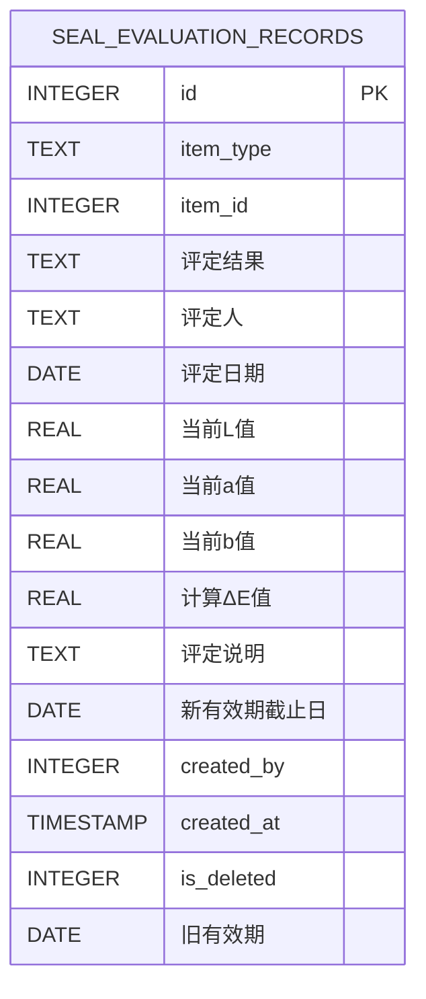
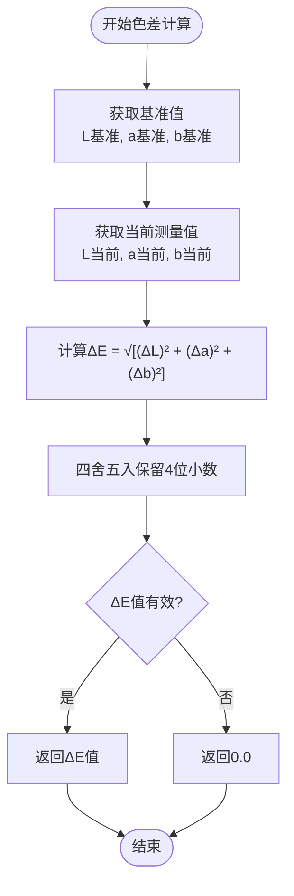
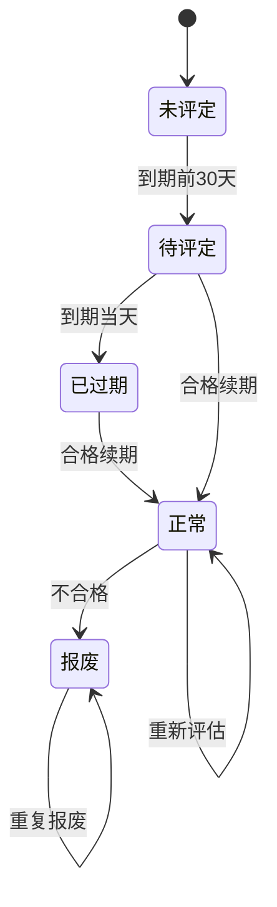
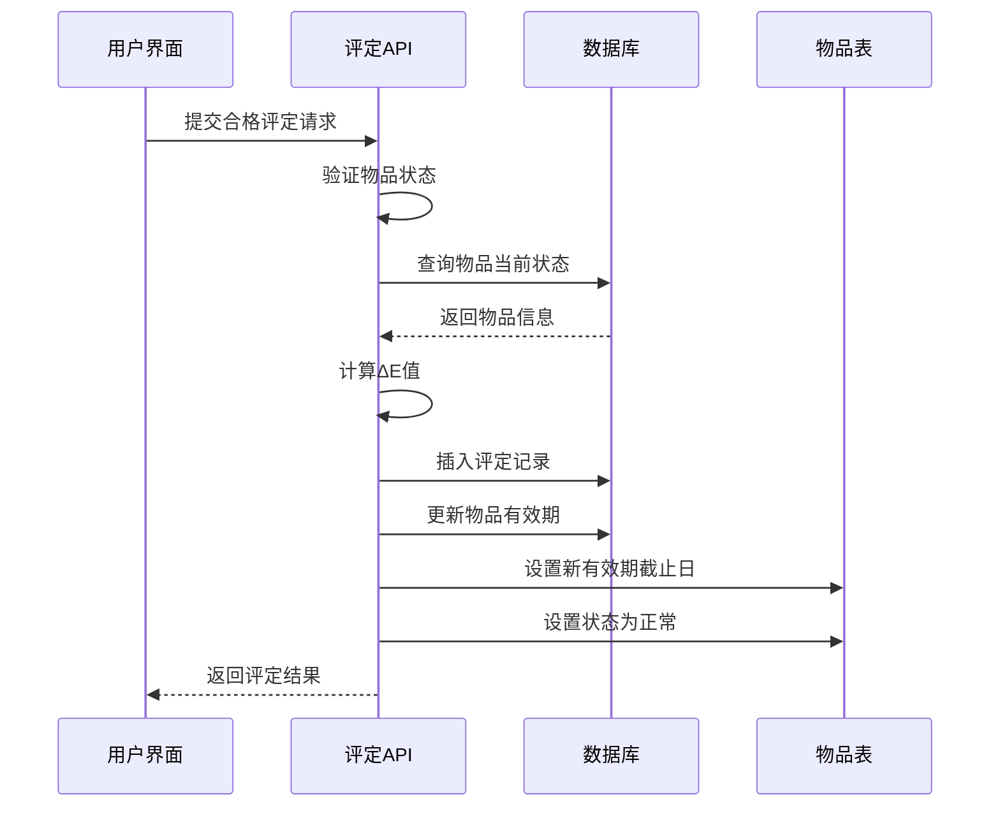
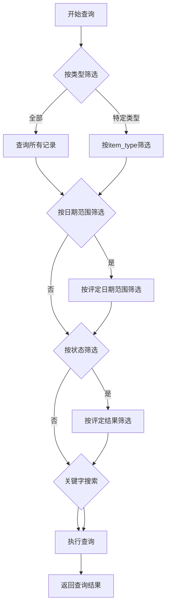
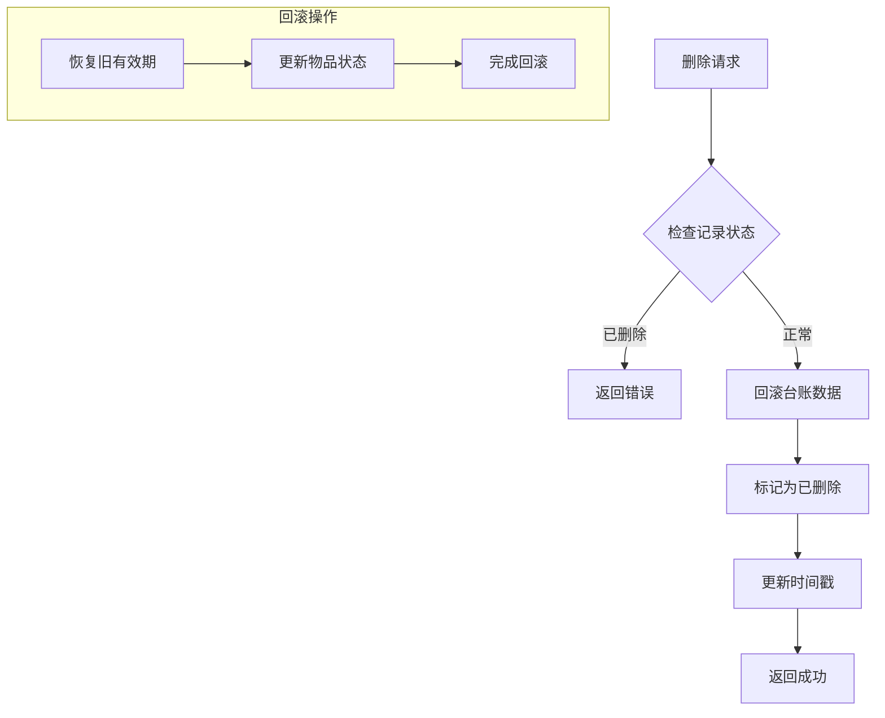
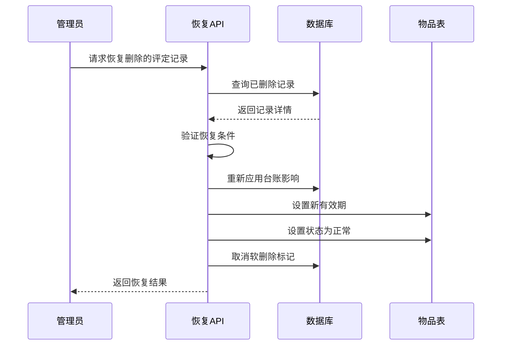
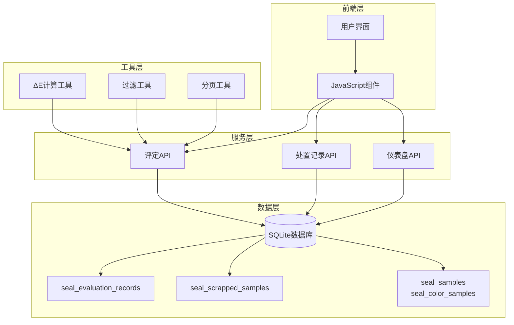
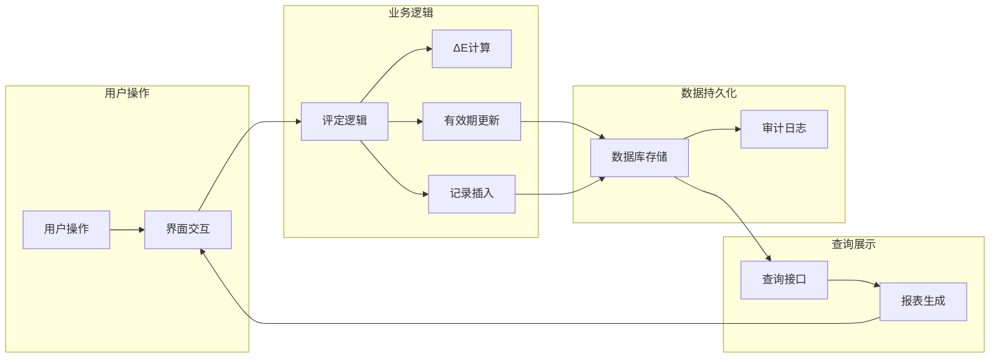

# 评定记录表 (seal_evaluation_records)

<cite>
**本文档引用的文件**
- [app.py](file://app.py)
- [seal-evaluation.js](file://static/js/seal-evaluation.js)
- [color-evaluation.js](file://static/js/color-evaluation.js)
- [disposal-records.js](file://static/js/disposal-records.js)
</cite>

## 目录
1. [简介](#简介)
2. [表结构概览](#表结构概览)
3. [字段详细说明](#字段详细说明)
4. [色差评估流程](#色差评估流程)
5. [状态转换机制](#状态转换机制)
6. [有效期延长机制](#有效期延长机制)
7. [查询统计功能](#查询统计功能)
8. [历史对比功能](#历史对比功能)
9. [软删除机制](#软删除机制)
10. [数据恢复功能](#数据恢复功能)
11. [架构设计图](#架构设计图)

## 简介

评定记录表(seal_evaluation_records)是封样件及色板接收登记管理系统中的核心数据表，专门用于记录所有物品的评定历史。该表不仅保存了评定的基本信息，还包含了完整的色差评估数据、有效期管理信息以及软删除支持，为系统的审计追踪和数据完整性提供了重要保障。

## 表结构概览

### 基本表结构

**图表来源**
- [app.py:237-255](file://app.py#L237-L255)

## 字段详细说明

### 主键字段
- **id** (`INTEGER PRIMARY KEY AUTOINCREMENT`)
  - 自增主键，唯一标识每条评定记录
  - 类型：整数，自动递增
  - 约束：主键，非空

### 关联标识字段
- **item_type** (`TEXT`)
  - 物品类型标识，支持 'seal'(封样件) 和 'color'(色板)
  - 类型：文本字符串
  - 约束：非空，用于区分不同类型的物品

- **item_id** (`INTEGER`)
  - 关联物品的ID，与seal_samples或seal_color_samples表的id关联
  - 类型：整数
  - 约束：非空，外键约束

### 评定基本信息
- **评定结果** (`TEXT`)
  - 评定结果状态，支持 'pass'(合格) 和 'fail'(不合格)
  - 类型：文本字符串
  - 约束：非空，用于区分续期或报废操作

- **评定人** (`TEXT`)
  - 执行评定操作的用户姓名
  - 类型：文本字符串
  - 约束：非空

- **评定日期** (`DATE`)
  - 评定执行的具体日期
  - 类型：日期格式
  - 约束：非空

### 色差评估数据
- **当前L值** (`REAL`)
  - 当前测量的L*值(Lightness亮度)
  - 类型：浮点数
  - 约束：数值类型，用于色差计算

- **当前a值** (`REAL`)
  - 当前测量的a*值(绿-红轴)
  - 类型：浮点数
  - 约束：数值类型，用于色差计算

- **当前b值** (`REAL`)
  - 当前测量的b*值(蓝-黄轴)
  - 类型：浮点数
  - 约束：数值类型，用于色差计算

- **计算ΔE值** (`REAL`)
  - 基于CIE76公式的色差计算结果
  - 类型：浮点数，保留4位小数
  - 约束：数值类型，用于质量判定

### 有效期管理
- **新有效期截止日** (`DATE`)
  - 续期后的有效期截止日期
  - 类型：日期格式
  - 约束：可空，仅在合格评定时有效

- **旧有效期** (`DATE`)
  - 评定前的有效期截止日期
  - 类型：日期格式
  - 约束：可空，用于软删除时的数据回滚

### 业务说明
- **评定说明** (`TEXT`)
  - 评定过程中的备注说明
  - 类型：文本字符串
  - 约束：可空

### 系统管理字段
- **created_by** (`INTEGER`)
  - 创建记录的用户ID
  - 类型：整数
  - 约束：外键，关联users表

- **created_at** (`TIMESTAMP`)
  - 记录创建时间戳
  - 类型：时间戳，默认当前时间
  - 约束：非空

- **is_deleted** (`INTEGER`)
  - 软删除标识，0表示正常，1表示已删除
  - 类型：整数，默认0
  - 约束：非负整数

**章节来源**
- [app.py:237-255](file://app.py#L237-L255)
- [app.py:326-334](file://app.py#L326-L334)

## 色差评估流程

### ΔE计算算法

系统采用CIE76标准色差公式进行色差计算：

**图表来源**
- [app.py:343-348](file://app.py#L343-L348)

### ΔE阈值设置

系统支持动态配置ΔE阈值，用于颜色质量等级判定：

| 等级 | 阈值范围 | 颜色标识 |
|------|----------|----------|
| 优秀 | ΔE < 1.0 | 绿色 |
| 合格 | 1.0 ≤ ΔE < 2.0 | 黄色 |
| 关注 | ΔE ≥ 2.0 | 红色 |

**章节来源**
- [color-evaluation.js:6](file://static/js/color-evaluation.js#L6)
- [color-evaluation.js:13](file://static/js/color-evaluation.js#L13)

## 状态转换机制

### 评定结果状态流转

### 状态转换规则

1. **正常状态** → **待评定**
   - 有效期剩余天数 ≤ 30天
   - 系统自动检测并标记

2. **正常/待评定** → **已过期**
   - 有效期已过期
   - 系统自动检测并标记

3. **待评定/已过期** → **正常**
   - 合格评定并通过续期
   - 更新有效期至新有效期截止日

4. **正常** → **报废**
   - 不合格评定
   - 系统自动标记为报废状态

**章节来源**
- [app.py:350-371](file://app.py#L350-L371)

## 有效期延长机制

### 续期流程

**图表来源**
- [app.py:1226-1286](file://app.py#L1226-L1286)

### 续期验证规则

1. **有效期有效性检查**
   - 新有效期必须晚于当前日期
   - 新有效期必须晚于物品原始有效期

2. **ΔE阈值验证**
   - 合格评定要求ΔE值小于等于设定阈值
   - 系统自动计算并验证

3. **物品状态检查**
   - 物品状态必须为正常或待评定
   - 物品不能为报废状态

**章节来源**
- [app.py:1273-1281](file://app.py#L1273-L1281)

## 查询统计功能

### 评定记录查询

系统提供灵活的查询接口，支持多种筛选条件：

### 统计指标

系统支持以下统计功能：

1. **总体统计**
   - 总评定次数
   - 合格率
   - 不合格率
   - 平均ΔE值

2. **趋势分析**
   - 月度评定趋势
   - 类型分布统计
   - ΔE值分布

3. **预警统计**
   - 待评定物品数量
   - 即将过期物品数量
   - 已过期物品数量

**章节来源**
- [app.py:1212-1224](file://app.py#L1212-L1224)

## 历史对比功能

### 多版本对比

系统支持评定记录的历史对比功能，可以：

1. **时间序列对比**
   - 同一物品不同时间点的评定结果对比
   - ΔE值变化趋势分析
   - 有效期变更历史

2. **批量对比**
   - 同类型物品的批量对比
   - 平均值统计分析
   - 标准差计算

3. **差异分析**
   - ΔL、Δa、Δb值的差异分析
   - 色差变化原因分析
   - 影响因素识别

### 对比报告生成

系统可以生成详细的对比报告，包含：

- 基础信息对比表
- 数值变化趋势图
- 统计分析结果
- 改进建议

**章节来源**
- [app.py:1740-1790](file://app.py#L1740-L1790)

## 软删除机制

### 软删除设计原理

**图表来源**
- [app.py:1943-1970](file://app.py#L1943-L1970)

### 回滚机制

当删除评定记录时，系统会自动执行以下回滚操作：

1. **有效期回滚**
   - 将物品的有效期恢复到评定前的状态
   - 更新物品状态为正常

2. **数据一致性保证**
   - 确保数据库状态的一致性
   - 防止孤儿记录产生

3. **审计追踪**
   - 保留删除操作的审计信息
   - 支持后续恢复操作

**章节来源**
- [app.py:1895-1917](file://app.py#L1895-L1917)

## 数据恢复功能

### 恢复流程

**图表来源**
- [app.py:1973-1997](file://app.py#L1973-L1997)

### 恢复策略

系统提供三种恢复策略：

1. **完全恢复**
   - 恢复所有数据和状态
   - 重新应用原有的有效期延长效果

2. **部分恢复**
   - 仅恢复基本数据
   - 不重新应用有效期延长

3. **数据修复**
   - 恢复数据但不改变物品状态
   - 用于数据修复场景

### 恢复限制

- 仅管理员可执行恢复操作
- 需要满足特定的恢复条件
- 恢复操作不可逆

**章节来源**
- [app.py:1977-1997](file://app.py#L1977-L1997)

## 架构设计图

### 系统架构图

### 数据流图

**图表来源**
- [app.py:1226-1286](file://app.py#L1226-L1286)
- [app.py:1740-1806](file://app.py#L1740-L1806)

## 结论

评定记录表(seal_evaluation_records)作为系统的核心数据表，不仅承担着记录评定历史的重要职责，还通过完善的软删除机制、有效期管理功能和统计分析能力，为整个色板和封样件管理系统提供了强大的数据支撑。其设计充分考虑了实际业务需求，既保证了数据的完整性，又提供了灵活的查询和分析功能，是系统稳定运行的重要基础。