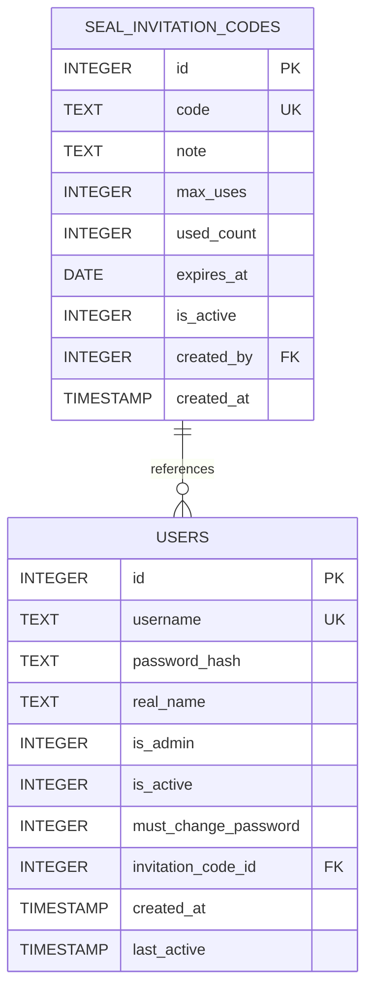
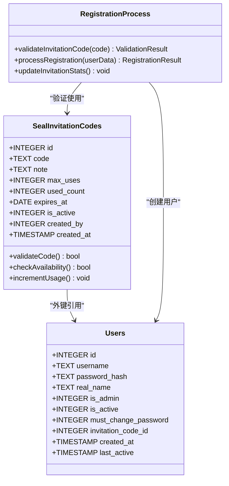
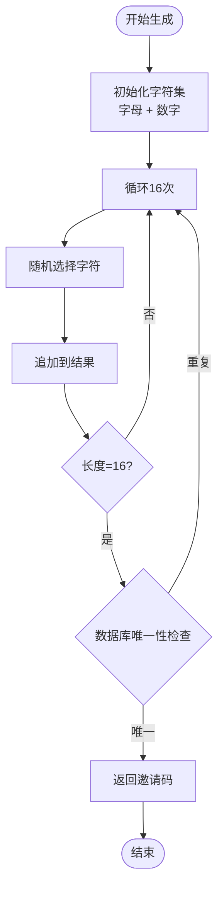
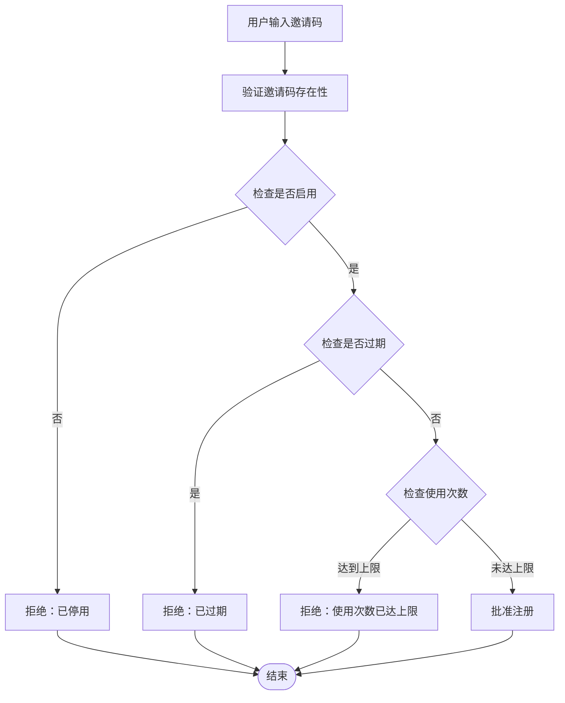
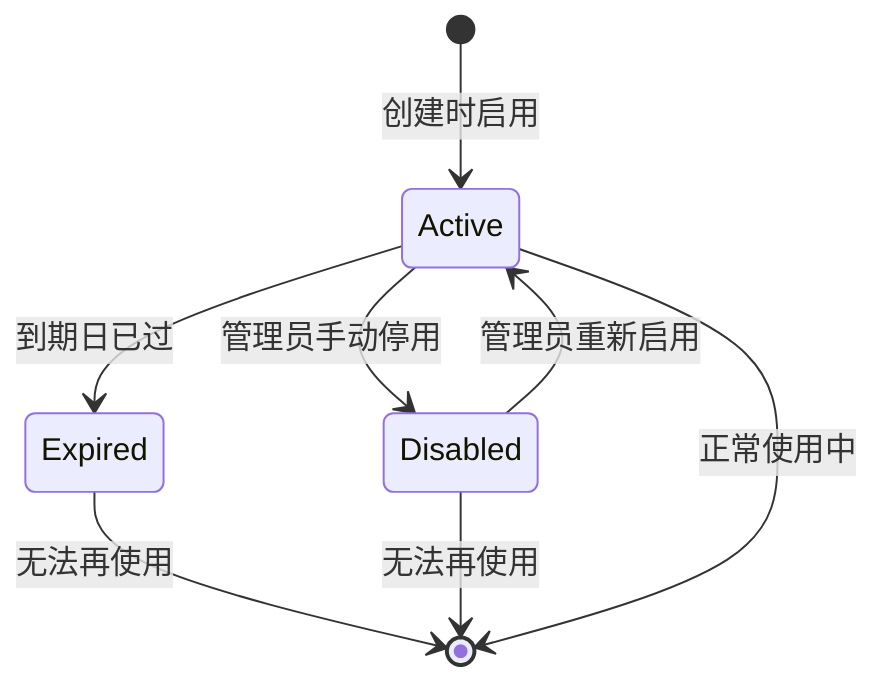
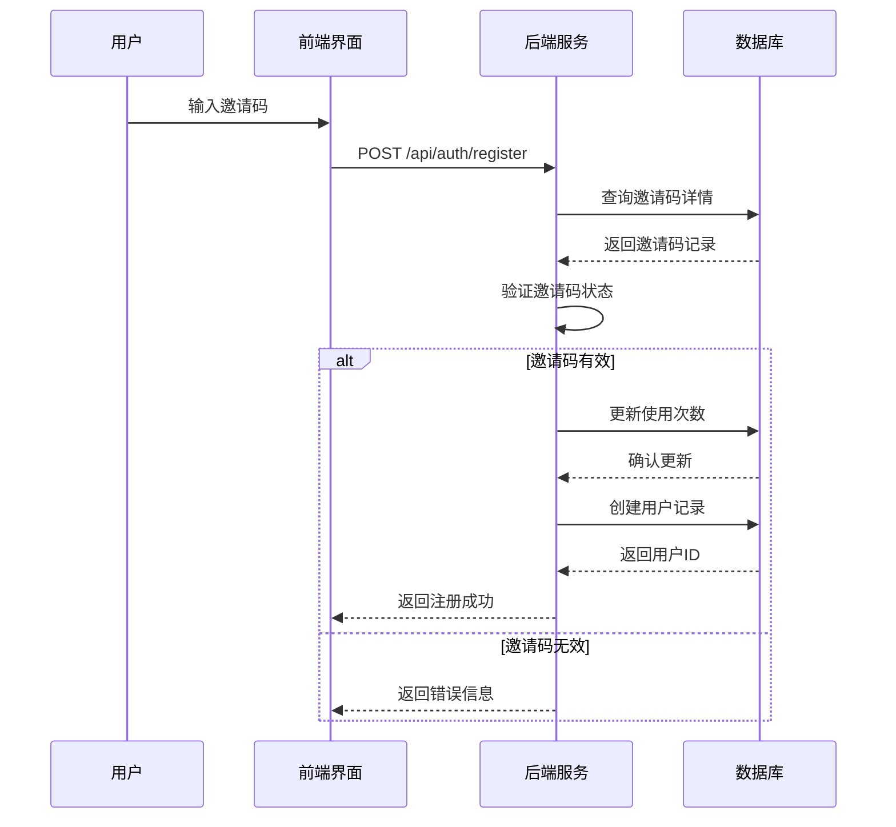
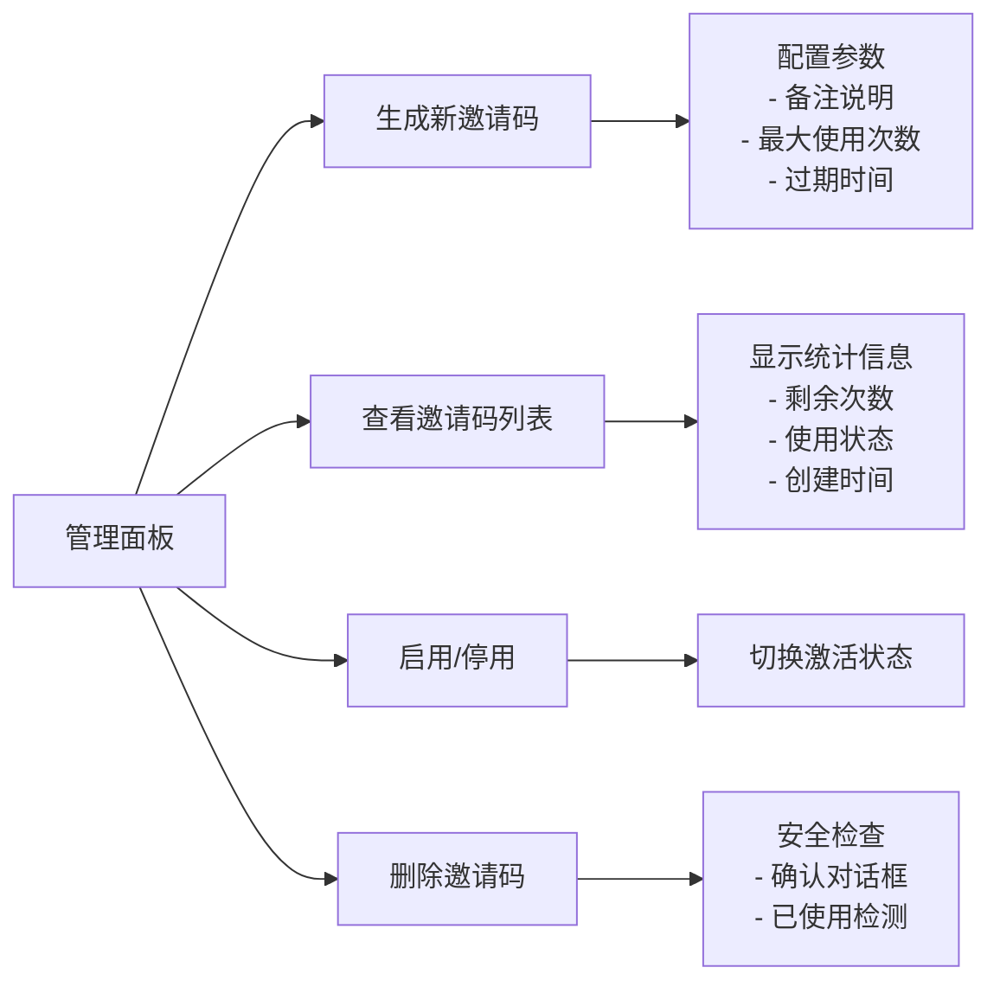
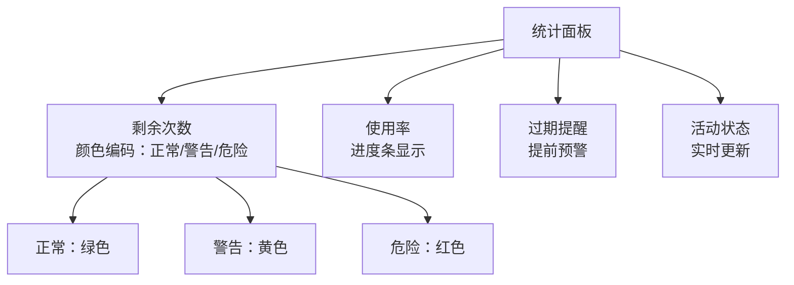

# 邀请码表 (seal_invitation_codes)

<cite>
**本文档引用的文件**
- [app.py](file://app.py)
- [admin-management.js](file://static/js/admin-management.js)
- [login.html](file://templates/login.html)
- [admin-panel.html](file://templates/admin-panel.html)
</cite>

## 目录
1. [简介](#简介)
2. [表结构概览](#表结构概览)
3. [字段详细定义](#字段详细定义)
4. [数据模型关系](#数据模型关系)
5. [邀请码生成规则](#邀请码生成规则)
6. [使用限制机制](#使用限制机制)
7. [过期机制](#过期机制)
8. [有效性验证流程](#有效性验证流程)
9. [管理功能](#管理功能)
10. [最佳实践与安全考虑](#最佳实践与安全考虑)
11. [使用统计功能](#使用统计功能)
12. [故障排除指南](#故障排除指南)
13. [总结](#总结)

## 简介

邀请码表(seal_invitation_codes)是封样件及色板接收登记管理系统中的核心组件之一，用于控制用户注册访问权限。该表通过唯一邀请码、使用次数限制和过期时间等机制，确保系统的安全性和可控性。

## 表结构概览

**图表来源**
- [app.py:113-127](file://app.py#L113-L127)
- [app.py:93-107](file://app.py#L93-L107)

## 字段详细定义

### 主键字段
- **id** (INTEGER PRIMARY KEY AUTOINCREMENT)
  - 自增主键，唯一标识每个邀请码记录
  - 类型：整数，自动递增
  - 约束：主键，自增

### 核心标识字段
- **code** (TEXT UNIQUE NOT NULL)
  - 唯一邀请码，用于用户注册验证
  - 类型：文本，长度16字符
  - 约束：唯一，非空
  - 特殊属性：数据库级唯一约束

### 描述性字段
- **note** (TEXT)
  - 备注说明，描述邀请码的用途或场景
  - 类型：文本
  - 约束：可空

### 使用控制字段
- **max_uses** (INTEGER DEFAULT 1)
  - 最大使用次数限制
  - 类型：整数，默认值1
  - 约束：非负数，默认1次

- **used_count** (INTEGER DEFAULT 0)
  - 已使用次数统计
  - 类型：整数，默认值0
  - 约束：非负数

### 时间管理字段
- **expires_at** (DATE)
  - 过期时间，为空表示永不过期
  - 类型：日期
  - 约束：可空

- **created_at** (TIMESTAMP DEFAULT CURRENT_TIMESTAMP)
  - 创建时间戳
  - 类型：时间戳，默认当前时间
  - 约束：默认值

### 状态控制字段
- **is_active** (INTEGER DEFAULT 1)
  - 激活状态标志
  - 类型：整数，0/1
  - 约束：默认启用

### 关系字段
- **created_by** (INTEGER)
  - 创建者用户ID，外键引用users表
  - 类型：整数
  - 约束：外键，引用users(id)

**章节来源**
- [app.py:113-127](file://app.py#L113-L127)

## 数据模型关系

### 外键关系设计

**图表来源**
- [app.py:113-127](file://app.py#L113-L127)
- [app.py:93-107](file://app.py#L93-L107)

### 反向关联设计

邀请码表与用户表之间建立了反向关联关系：
- 每个用户可以关联一个邀请码
- 每个邀请码可以被多个用户使用（在多用户场景下）

**章节来源**
- [app.py:102-106](file://app.py#L102-L106)

## 邀请码生成规则

### 生成算法

邀请码采用16位随机字符串生成策略：

**图表来源**
- [app.py:372-376](file://app.py#L372-L376)

### 字符集规范
- 字符类型：大小写字母 + 数字
- 总长度：16位
- 唯一性保证：数据库唯一约束 + 生成时检查

**章节来源**
- [app.py:372-376](file://app.py#L372-L376)

## 使用限制机制

### 使用次数控制

**图表来源**
- [app.py:517-527](file://app.py#L517-L527)

### 限制检查顺序
1. **存在性验证**：确认邀请码存在于数据库中
2. **状态验证**：检查邀请码是否处于启用状态
3. **时间验证**：确认当前日期未超过过期时间
4. **使用次数验证**：确保已使用次数小于最大允许次数

**章节来源**
- [app.py:517-527](file://app.py#L517-L527)

## 过期机制

### 过期时间管理

**图表来源**
- [app.py:524](file://app.py#L524)

### 过期检查逻辑
- **格式化比较**：将数据库存储的日期与当前中国标准时间进行比较
- **空值处理**：`expires_at` 为空表示永不过期
- **时间精度**：使用日期而非时间戳进行比较

**章节来源**
- [app.py:524](file://app.py#L524)

## 有效性验证流程

### 完整验证序列

**图表来源**
- [app.py:495-542](file://app.py#L495-L542)

### 验证步骤详解

1. **基础验证**
   - 检查所有必需字段是否完整
   - 验证密码强度要求

2. **邀请码验证**
   - 查询数据库确认邀请码存在
   - 检查邀请码状态为启用
   - 验证过期时间
   - 检查使用次数限制

3. **用户创建**
   - 生成密码哈希
   - 创建用户记录
   - 更新邀请码使用统计

**章节来源**
- [app.py:495-542](file://app.py#L495-L542)

## 管理功能

### 后台管理界面

管理员可以通过专门的管理界面进行邀请码的全生命周期管理：

**图表来源**
- [admin-management.js:66-142](file://static/js/admin-management.js#L66-L142)

### 管理功能特性

1. **生成邀请码**
   - 支持批量生成
   - 可配置使用次数和过期时间
   - 自动生成唯一码

2. **状态管理**
   - 实时切换启用/停用状态
   - 可视化的状态指示器
   - 即时生效的变更

3. **删除保护**
   - 防止删除已被使用的邀请码
   - 删除前确认提示
   - 安全的删除流程

**章节来源**
- [admin-management.js:66-142](file://static/js/admin-management.js#L66-L142)

## 最佳实践与安全考虑

### 安全建议

1. **邀请码生成安全**
   - 使用加密安全的随机数生成器
   - 确保字符集的均匀分布
   - 定期轮换邀请码

2. **存储安全**
   - 邀请码仅存储哈希值（如需要审计）
   - 敏感信息最小化存储
   - 定期清理过期邀请码

3. **传输安全**
   - 使用HTTPS协议
   - 防止邀请码泄露
   - 限制邀请码展示范围

### 运维建议

1. **监控指标**
   - 使用率统计
   - 过期预警
   - 异常使用检测

2. **备份策略**
   - 定期备份邀请码数据
   - 备份历史使用记录
   - 恢复测试验证

3. **合规要求**
   - 符合数据保护法规
   - 保留必要的审计日志
   - 支持数据删除请求

## 使用统计功能

### 统计指标

系统提供了完善的邀请码使用统计功能：

| 统计指标 | 计算公式 | 用途 |
|---------|---------|------|
| 剩余次数 | max_uses - used_count | 显示可用性 |
| 使用率 | (used_count/max_uses) × 100% | 监控使用情况 |
| 剩余天数 | expires_at - 当前日期 | 过期提醒 |
| 未使用比例 | (max_uses - used_count)/max_uses | 资源利用率 |

### 前端展示优化

**图表来源**
- [admin-management.js:76-98](file://static/js/admin-management.js#L76-L98)

**章节来源**
- [admin-management.js:76-98](file://static/js/admin-management.js#L76-L98)

## 故障排除指南

### 常见问题诊断

1. **邀请码无效**
   - 检查邀请码是否存在于数据库
   - 验证邀请码状态是否为启用
   - 确认过期时间是否已过

2. **使用次数限制**
   - 检查max_uses和used_count的数值
   - 验证数据库更新是否成功
   - 查看并发使用冲突

3. **过期问题**
   - 确认系统时区设置
   - 检查日期格式一致性
   - 验证本地时间同步

### 调试工具

- **数据库查询**：直接查询邀请码表验证状态
- **日志分析**：查看注册过程的日志输出
- **前端调试**：检查AJAX请求和响应

**章节来源**
- [app.py:517-527](file://app.py#L517-L527)

## 总结

邀请码表(seal_invitation_codes)作为系统访问控制的核心组件，通过精心设计的字段结构、严格的使用限制和完善的管理功能，为封样件及色板管理系统提供了可靠的安全保障。其16位随机生成的邀请码、灵活的使用次数控制和过期时间管理，确保了系统的可控性和安全性。

通过前后端协同的管理界面，管理员可以轻松地创建、监控和管理邀请码，而用户则可以在注册过程中获得流畅的体验。这种设计平衡了安全性与易用性，为系统的长期稳定运行奠定了坚实基础。