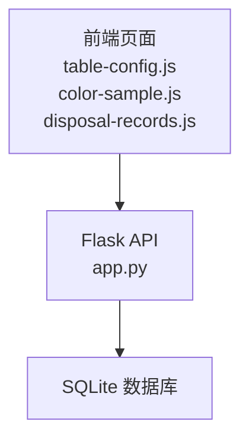
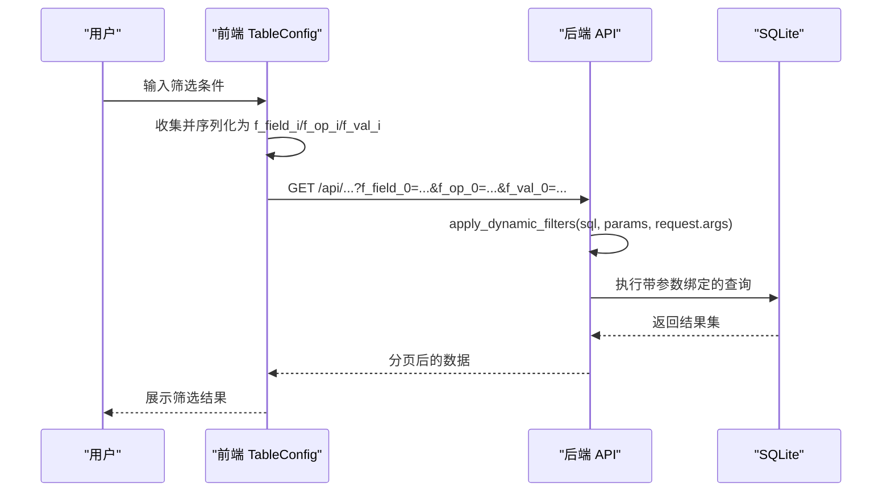
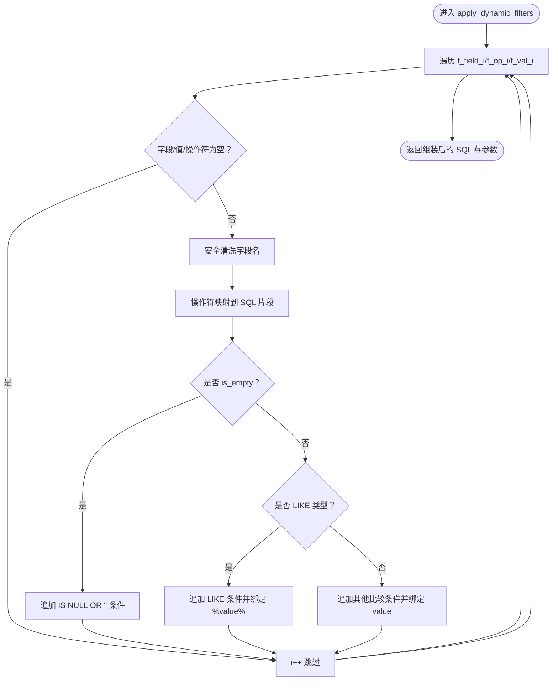
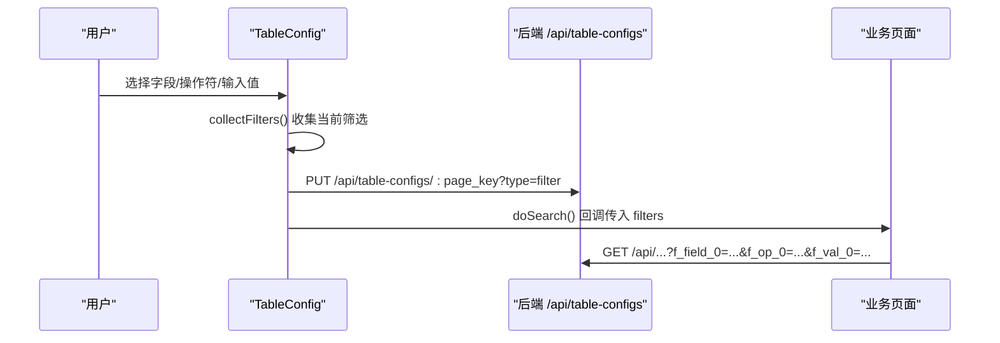
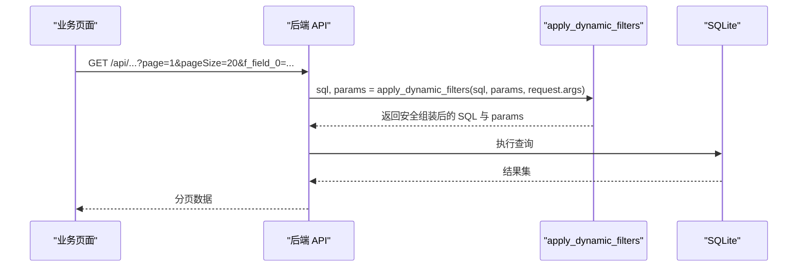
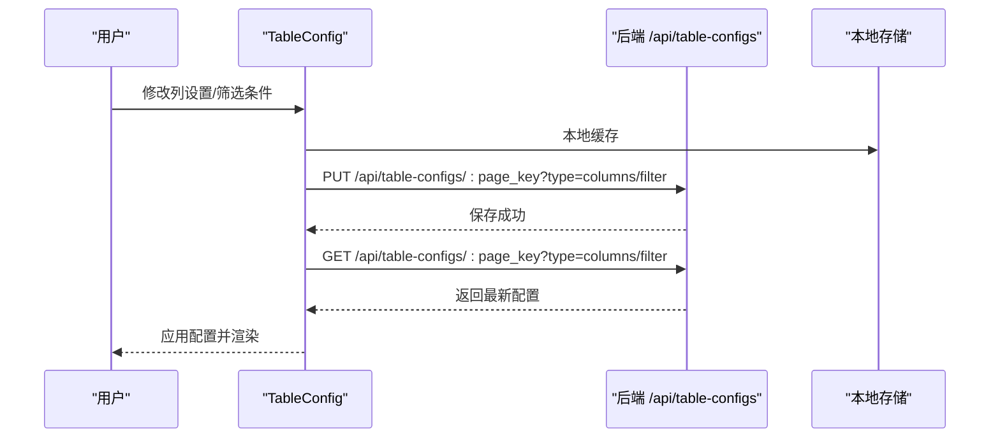
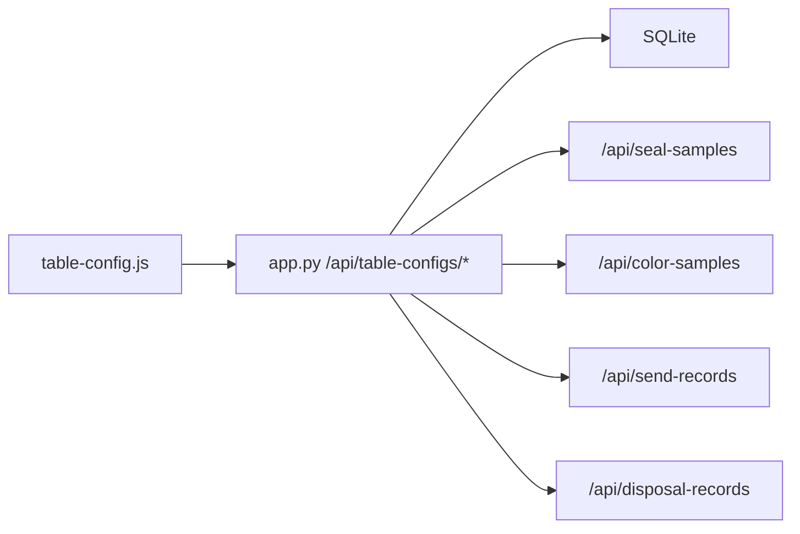

# 动态筛选算法

<cite>
**本文引用的文件**
- [app.py](file://app.py)
- [table-config.js](file://static/js/table-config.js)
- [color-sample.js](file://static/js/color-sample.js)
- [disposal-records.js](file://static/js/disposal-records.js)
</cite>

## 目录
1. [简介](#简介)
2. [项目结构](#项目结构)
3. [核心组件](#核心组件)
4. [架构总览](#架构总览)
5. [详细组件分析](#详细组件分析)
6. [依赖分析](#依赖分析)
7. [性能考虑](#性能考虑)
8. [故障排查指南](#故障排查指南)
9. [结论](#结论)
10. [附录](#附录)

## 简介
本文件针对封样件及色板接收登记管理系统中的“动态筛选算法”进行深入文档化，重点覆盖以下内容：
- apply_dynamic_filters 函数的实现逻辑与安全策略
- 前端筛选参数的接收与解析、参数绑定与查询构造
- 支持的筛选操作符及其 SQL 转换规则
- 筛选条件的组合逻辑与优先级处理
- 用户表格配置功能（列显示设置、筛选条件保存、个性化配置管理）
- 筛选性能优化建议（索引、查询优化、大数据量处理）

## 项目结构
系统采用前后端分离架构：
- 后端：Flask 应用，提供 REST API，负责数据访问、业务逻辑与动态筛选
- 前端：静态资源（HTML/CSS/JS），通过 TableConfig 模块构建筛选面板、列设置与查询参数序列化

图表来源
- [app.py:1580-1626](file://app.py#L1580-L1626)
- [table-config.js:1-552](file://static/js/table-config.js#L1-L552)
- [color-sample.js:1-58](file://static/js/color-sample.js#L1-L58)
- [disposal-records.js:1-152](file://static/js/disposal-records.js#L1-L152)

章节来源
- [app.py:1580-1626](file://app.py#L1580-L1626)
- [table-config.js:1-552](file://static/js/table-config.js#L1-L552)
- [color-sample.js:1-58](file://static/js/color-sample.js#L1-L58)
- [disposal-records.js:1-152](file://static/js/disposal-records.js#L1-L152)

## 核心组件
- 动态筛选核心函数：apply_dynamic_filters（后端）
- 前端筛选面板与参数序列化：TableConfig（前端）
- 用户表格配置：列设置与筛选条件持久化（前后端协同）
- 多个业务 API 的筛选集成点：封样件、色板、寄出、处置记录等

章节来源
- [app.py:403-449](file://app.py#L403-L449)
- [table-config.js:354-388](file://static/js/table-config.js#L354-L388)
- [app.py:1580-1626](file://app.py#L1580-L1626)

## 架构总览
动态筛选的端到端流程如下：
- 前端构建筛选面板，收集字段、操作符、值
- 将筛选条件序列化为 f_field_i/f_op_i/f_val_i 参数
- 后端 apply_dynamic_filters 解析参数，进行安全校验与 SQL 组装
- 结合业务 API 的兼容参数，最终执行查询并返回分页结果

图表来源
- [table-config.js:369-388](file://static/js/table-config.js#L369-L388)
- [app.py:403-449](file://app.py#L403-L449)
- [app.py:593-623](file://app.py#L593-L623)
- [app.py:799-841](file://app.py#L799-L841)

## 详细组件分析

### 后端：apply_dynamic_filters 动态筛选核心
- 参数接收：从 request.args 中按 f_field_i/f_op_i/f_val_i 迭代读取
- 安全校验：仅允许字母、数字、下划线、中文字符、Δ、连字符，防止 SQL 注入
- 操作符映射：将前端操作符映射为 SQL 条件片段
- 参数绑定：使用参数化查询，避免拼接字符串
- 空值处理：字段/操作符/值任一缺失则跳过该条件
- 特殊处理：is_empty 转换为 IS NULL OR '' 的组合条件

图表来源
- [app.py:403-449](file://app.py#L403-L449)

章节来源
- [app.py:403-449](file://app.py#L403-L449)

### 前端：TableConfig 筛选面板与参数序列化
- 字段定义：每个页面定义可筛选字段、类型、默认列、渲染器等
- 操作符生成：根据字段类型动态生成操作符（文本/日期/数值/选择）
- 输入控件：文本框、日期输入、数值输入、下拉选择
- 参数序列化：将筛选条件转为 f_field_i/f_op_i/f_val_i，供后端解析
- 筛选触发：doSearch 收集当前 filters，异步保存到后端配置并触发回调

图表来源
- [table-config.js:354-388](file://static/js/table-config.js#L354-L388)
- [table-config.js:165-221](file://static/js/table-config.js#L165-L221)
- [app.py:1580-1626](file://app.py#L1580-L1626)

章节来源
- [table-config.js:15-154](file://static/js/table-config.js#L15-L154)
- [table-config.js:327-351](file://static/js/table-config.js#L327-L351)
- [table-config.js:369-388](file://static/js/table-config.js#L369-L388)
- [app.py:1580-1626](file://app.py#L1580-L1626)

### 业务 API 中的筛选集成点
- 封样件列表：在基础 WHERE 1=1 后追加动态筛选，再叠加兼容旧参数
- 色板列表：同上，兼容 search/customer/model/colorName/supplier
- 寄出记录：对 JOIN 查询的字段进行表前缀处理与特殊字段映射
- 处置记录：统一视图，按 record_type 分支查询，动态筛选按表前缀映射字段

图表来源
- [app.py:593-623](file://app.py#L593-L623)
- [app.py:799-841](file://app.py#L799-L841)
- [app.py:1045-1108](file://app.py#L1045-L1108)
- [app.py:1630-1806](file://app.py#L1630-L1806)

章节来源
- [app.py:593-623](file://app.py#L593-L623)
- [app.py:799-841](file://app.py#L799-L841)
- [app.py:1045-1108](file://app.py#L1045-L1108)
- [app.py:1630-1806](file://app.py#L1630-L1806)

### 支持的操作符与 SQL 转换规则
- contains：模糊匹配（LIKE %value%）
- not_contains：反向模糊匹配（NOT LIKE %value%）
- equals：相等比较（=）
- not_equals：不等比较（!=）
- gt：大于（>）
- gte：大于等于（>=）
- lt：小于（<）
- lte：小于等于（<=）
- before：早于（<）
- after：晚于（>）
- is_empty：空值或空字符串（IS NULL OR ''）

注意：is_empty 为特殊处理，不使用 LIKE，而是直接拼接 IS NULL OR '' 条件；其余 LIKE 类型会自动包裹 %value%。

章节来源
- [app.py:422-434](file://app.py#L422-L434)
- [app.py:436-445](file://app.py#L436-L445)

### 筛选条件组合逻辑与优先级
- 逐条解析：按 f_field_i 的顺序依次处理，遇到空值即跳过
- AND 组合：每条条件都以 AND 连接，形成累积过滤
- 兼容参数：在某些 API 中，还会叠加旧版参数（如 search、customer、model 等），这些参数同样以 AND 追加
- 字段前缀：在 JOIN 查询场景中，动态筛选字段会根据表前缀映射到实际列名

章节来源
- [app.py:403-449](file://app.py#L403-L449)
- [app.py:593-623](file://app.py#L593-L623)
- [app.py:799-841](file://app.py#L799-L841)
- [app.py:1045-1108](file://app.py#L1045-L1108)
- [app.py:1630-1806](file://app.py#L1630-L1806)

### 用户表格配置功能
- 列设置：用户可选择显示哪些列，默认列与必选列保护
- 筛选条件保存：将当前筛选条件持久化到后端用户配置表，支持按页面键区分
- 个性化管理：前端本地缓存 + 后端持久化，首次加载时优先使用本地缓存，随后异步拉取后端最新配置
- 配置读写：GET /api/table-configs/:page_key?type=columns/filter 与 PUT 保存

图表来源
- [table-config.js:165-221](file://static/js/table-config.js#L165-L221)
- [app.py:1580-1626](file://app.py#L1580-L1626)

章节来源
- [table-config.js:165-221](file://static/js/table-config.js#L165-L221)
- [app.py:1580-1626](file://app.py#L1580-L1626)

## 依赖分析
- 前端依赖后端 API 提供的用户配置接口
- 后端依赖 SQLite 的参数化查询能力
- 多个业务 API 共享同一套动态筛选逻辑，降低重复与维护成本

图表来源
- [table-config.js:165-221](file://static/js/table-config.js#L165-L221)
- [app.py:1580-1626](file://app.py#L1580-L1626)
- [app.py:593-623](file://app.py#L593-L623)
- [app.py:799-841](file://app.py#L799-L841)
- [app.py:1045-1108](file://app.py#L1045-L1108)
- [app.py:1630-1806](file://app.py#L1630-L1806)

章节来源
- [table-config.js:165-221](file://static/js/table-config.js#L165-L221)
- [app.py:1580-1626](file://app.py#L1580-L1626)
- [app.py:593-623](file://app.py#L593-L623)
- [app.py:799-841](file://app.py#L799-L841)
- [app.py:1045-1108](file://app.py#L1045-L1108)
- [app.py:1630-1806](file://app.py#L1630-L1806)

## 性能考虑
- 索引建议
  - 在高频筛选字段上建立索引，如有效期、状态、创建时间等
  - 文本模糊匹配（LIKE %value%）通常无法命中索引，建议：
    - 仅在必要时使用 contains/not_contains
    - 对常用关键字建立前缀索引或使用全文检索（SQLite 扩展）
- 查询优化
  - 使用参数化查询（已实现），避免字符串拼接
  - 合理使用 LIMIT/OFFSET 进行分页，避免一次性返回大量数据
  - 对 JOIN 查询，尽量先缩小结果集再连接
- 大数据量处理
  - 对于大表，建议：
    - 将 is_empty 等低选择性条件放在 WHERE 末尾，减少早期过滤
    - 对日期范围查询使用 before/after 并限制范围
    - 使用物化视图或汇总表（如按状态/有效期聚合）加速统计类查询
- 前端优化
  - 使用本地缓存（localStorage）减少重复请求
  - 控制筛选条件数量，避免过多 AND 条件导致查询变慢

## 故障排查指南
- 筛选无效
  - 检查前端是否正确序列化为 f_field_i/f_op_i/f_val_i
  - 检查后端是否正确解析并追加到 SQL
- SQL 注入风险
  - 确认字段名经过安全清洗（仅允许字母、数字、下划线、中文、Δ、连字符）
  - 确认所有值均通过参数绑定传入
- 性能问题
  - 检查是否对高频字段建立索引
  - 检查是否存在过多 LIKE %value% 导致全表扫描
- 配置不同步
  - 确认 /api/table-configs 接口调用成功
  - 检查本地缓存与后端配置是否一致

章节来源
- [app.py:415-419](file://app.py#L415-L419)
- [app.py:440-445](file://app.py#L440-L445)
- [table-config.js:369-388](file://static/js/table-config.js#L369-L388)
- [app.py:1580-1626](file://app.py#L1580-L1626)

## 结论
本系统通过前后端协作实现了灵活、安全、可扩展的动态筛选能力：
- 后端以 apply_dynamic_filters 为核心，严格的安全校验与参数化查询保障了安全性
- 前端以 TableConfig 为基础，提供直观的筛选面板与配置持久化
- 多个业务 API 共享同一套筛选逻辑，降低了维护成本
- 配置持久化与本地缓存提升了用户体验
建议在生产环境中配合索引与查询优化策略，进一步提升筛选性能与稳定性。

## 附录
- 前端筛选参数序列化示例路径
  - [table-config.js:369-388](file://static/js/table-config.js#L369-L388)
- 后端动态筛选实现路径
  - [app.py:403-449](file://app.py#L403-L449)
- 用户表格配置接口路径
  - [app.py:1580-1626](file://app.py#L1580-L1626)
- 业务 API 筛选集成点路径
  - [app.py:593-623](file://app.py#L593-L623)
  - [app.py:799-841](file://app.py#L799-L841)
  - [app.py:1045-1108](file://app.py#L1045-L1108)
  - [app.py:1630-1806](file://app.py#L1630-L1806)