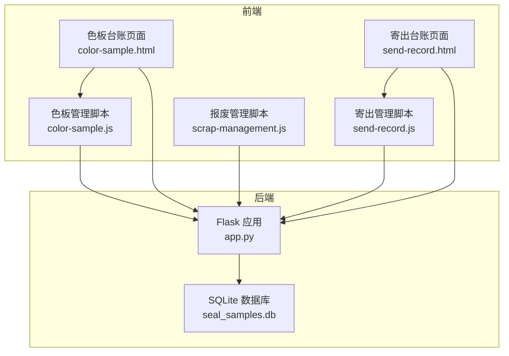
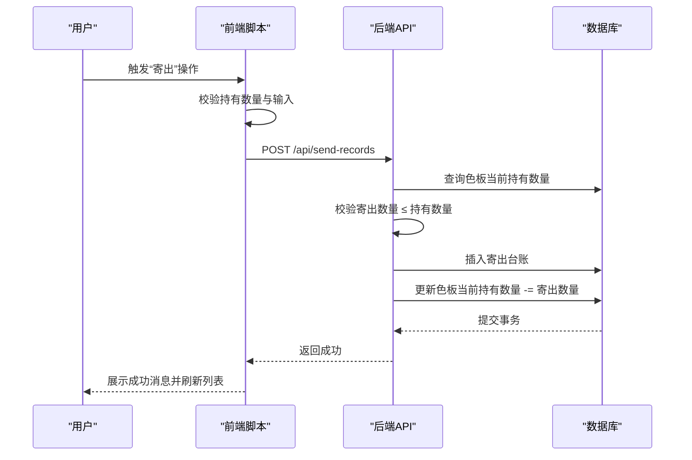
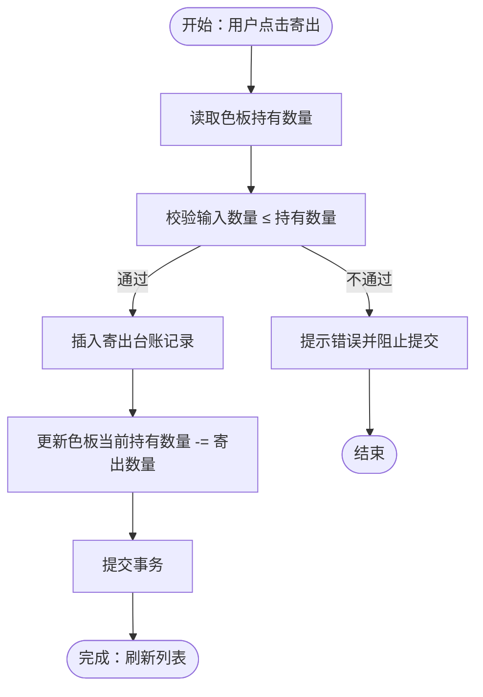
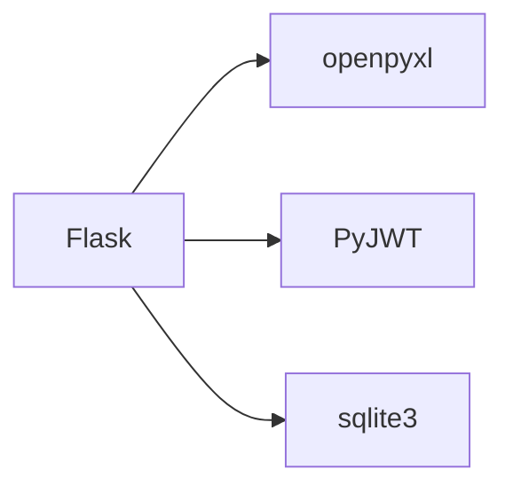

# 库存控制逻辑

<cite>
**本文引用的文件**
- [app.py](file://app.py)
- [requirements.txt](file://requirements.txt)
- [color-sample.js](file://static/js/color-sample.js)
- [send-record.js](file://static/js/send-record.js)
- [scrap-management.js](file://static/js/scrap-management.js)
- [color-sample.html](file://templates/color-sample.html)
- [send-record.html](file://templates/send-record.html)
</cite>

## 目录
1. [简介](#简介)
2. [项目结构](#项目结构)
3. [核心组件](#核心组件)
4. [架构总览](#架构总览)
5. [详细组件分析](#详细组件分析)
6. [依赖分析](#依赖分析)
7. [性能考量](#性能考量)
8. [故障排查指南](#故障排查指南)
9. [结论](#结论)
10. [附录](#附录)

## 简介
本文件针对“封样件及色板接收登记管理系统”的库存控制逻辑进行系统化梳理与说明，重点覆盖：
- 色板库存的增减控制机制：接收登记入库、寄出管理出库、报废处理清零
- 当前持有数量 current_holding_quantity 的计算与实时更新
- 库存不足预警机制与处理流程
- 色板寄出流程中的库存联动控制（数量验证、状态更新、记录生成）
- 库存数据准确性保障（事务性、并发控制、一致性校验）
- 最佳实践：盘点流程、异常处理、数据恢复

## 项目结构
后端采用 Flask + SQLite 架构，前端通过静态 JS 与后端 API 交互，模板负责页面布局与按钮触发。核心库存相关逻辑集中在后端 API 与前端交互脚本中。

图表来源
- [app.py](file://app.py)
- [color-sample.js](file://static/js/color-sample.js)
- [send-record.js](file://static/js/send-record.js)
- [scrap-management.js](file://static/js/scrap-management.js)
- [color-sample.html](file://templates/color-sample.html)
- [send-record.html](file://templates/send-record.html)

章节来源
- [app.py](file://app.py)
- [requirements.txt](file://requirements.txt)

## 核心组件
- 色板台账表（seal_color_samples）：承载色板基本信息、接收数量、当前持有数量、有效期、状态等字段
- 寄出台账表（seal_send_records）：记录每次寄出的色板、数量、日期、经手人等
- 报废记录表（seal_scrapped_samples）：记录报废原因、类型、审批人、旧状态等
- 后端 API：提供色板 CRUD、寄出新增/删除、报废提交、处置记录合并查询等
- 前端脚本：负责表单校验、库存联动、数量限制提示、分页与筛选

章节来源
- [app.py](file://app.py)
- [color-sample.js](file://static/js/color-sample.js)
- [send-record.js](file://static/js/send-record.js)
- [scrap-management.js](file://static/js/scrap-management.js)

## 架构总览
系统围绕“色板台账”为中心，通过寄出与报废两条路径改变“当前持有数量”，并通过有效期与状态共同决定业务可用性与预警。

图表来源
- [app.py](file://app.py)
- [send-record.js](file://static/js/send-record.js)

## 详细组件分析

### 色板库存增减控制机制
- 接收登记入库
  - 新增色板时，接收数量写入“接收数量”，当前持有数量初始为 0；前端表单在新增时将“当前持有数量”设为 0 并禁止修改
  - 该行为由后端创建接口与前端表单逻辑共同保证
- 寄出管理出库
  - 新增寄出记录时，后端先查询色板当前持有数量，再校验寄出数量不得大于持有数量，随后插入寄出台账并扣减色板当前持有数量
  - 删除寄出记录时，后端恢复色板当前持有数量
- 报废处理清零
  - 报废接口将色板状态标记为“已报废”，并写入报废记录；前端报废列表支持删除恢复与永久删除，删除恢复会将状态恢复为“正常”，永久删除会级联删除寄出记录与原记录

章节来源
- [app.py](file://app.py)
- [color-sample.js](file://static/js/color-sample.js)
- [send-record.js](file://static/js/send-record.js)
- [scrap-management.js](file://static/js/scrap-management.js)

### 当前持有数量(current_holding_quantity)的计算与实时更新
- 计算逻辑
  - 初始值：新增色板时，当前持有数量为 0
  - 增量：接收登记（入库）时，当前持有数量 = 接收数量（仅首次新增时生效）
  - 减量：寄出管理时，当前持有数量 = 当前持有数量 - 寄出数量
  - 清零：报废处理时，当前持有数量仍为 0（状态变为“已报废”）
- 实时更新机制
  - 后端在寄出新增与删除时即时更新数据库
  - 前端在寄出成功后刷新色板列表，确保 UI 与数据库一致
  - 前端在寄出表单中对输入数量进行最大值限制，防止超卖

章节来源
- [app.py](file://app.py)
- [color-sample.js](file://static/js/color-sample.js)
- [send-record.js](file://static/js/send-record.js)

### 库存不足预警机制与处理流程
- 预警维度
  - 有效期预警：当有效期距离当前日期小于等于设定的“提醒天数”时，状态转为“待评定”
  - 库存预警：前端在色板列表中，当“当前持有数量”小于等于阈值（例如 5）时，持有数量单元格会高亮提示
- 处理流程
  - 有效期预警：到期前自动转为“待评定”，需进行评定续期或报废
  - 库存不足：寄出前前端会限制最大可寄数量；若仍发生超卖风险，后端会在新增寄出时拒绝请求

章节来源
- [app.py](file://app.py)
- [color-sample.js](file://static/js/color-sample.js)

### 色板寄出流程中的库存联动控制
- 数量验证
  - 前端在寄出表单中读取色板当前持有数量，并限制输入最大值
  - 后端在新增寄出时再次校验，确保寄出数量不超过持有数量
- 状态更新
  - 寄出新增不影响色板状态（仍为“正常”），仅更新持有数量
- 记录生成
  - 新增寄出记录时，同时写入寄出台账表
- 删除回滚
  - 删除寄出记录时，恢复对应数量的持有数量

图表来源
- [app.py](file://app.py)
- [send-record.js](file://static/js/send-record.js)

章节来源
- [app.py](file://app.py)
- [send-record.js](file://static/js/send-record.js)

### 库存数据准确性保障
- 事务性
  - 寄出新增与删除均在单次请求中完成数据库更新，确保原子性
- 并发控制
  - 当前实现未显式使用锁或乐观并发控制，建议在高并发场景引入行级锁或版本号控制
- 一致性校验
  - 后端在寄出新增时进行持有数量校验，防止负库存
  - 前端在表单层面限制输入，降低超卖概率

章节来源
- [app.py](file://app.py)
- [send-record.js](file://static/js/send-record.js)

### 最佳实践
- 盘点流程
  - 建议定期比对“接收数量”与“累计寄出数量 + 当前持有数量”，核对差异
  - 对于长期未变动的色板，建议进行实物盘点与系统数据核对
- 异常处理
  - 寄出失败时，前端提示具体原因（如“超出持有数量”）
  - 报废记录删除恢复与永久删除需谨慎，建议保留审计痕迹
- 数据恢复
  - 报废记录支持软删除与恢复，便于回溯与修复
  - 导入/导出功能可用于批量数据迁移与备份

章节来源
- [app.py](file://app.py)
- [color-sample.js](file://static/js/color-sample.js)
- [send-record.js](file://static/js/send-record.js)
- [scrap-management.js](file://static/js/scrap-management.js)

## 依赖分析
- 后端依赖
  - Flask：Web 框架
  - openpyxl：Excel 导入导出
  - PyJWT：JWT 认证
  - sqlite3：本地数据库访问
- 前端依赖
  - 通过静态资源引入，与后端 API 交互

图表来源
- [requirements.txt](file://requirements.txt)

章节来源
- [requirements.txt](file://requirements.txt)

## 性能考量
- 数据库规模
  - 当前为单机 SQLite，适合中小规模使用；若数据量增长，建议迁移到关系型数据库并启用索引
- 查询优化
  - 建议为常用筛选字段（如颜色名称、客户、有效期）建立索引
- 前端渲染
  - 分页与动态筛选可有效降低一次性渲染压力

## 故障排查指南
- 寄出数量超出现有持有量
  - 现象：后端返回“寄出数量超出当前持有数量”
  - 处理：检查色板当前持有数量，确认是否存在未及时刷新的寄出记录
- 色板状态异常
  - 现象：色板状态非“正常”
  - 处理：检查有效期与提醒天数设置，确认是否已报废
- 报废记录误删
  - 现象：删除报废记录后状态恢复
  - 处理：通过软删除与恢复功能回滚，或使用永久删除清理

章节来源
- [app.py](file://app.py)
- [send-record.js](file://static/js/send-record.js)
- [scrap-management.js](file://static/js/scrap-management.js)

## 结论
本系统通过“色板台账 + 寄出台账 + 报废记录”的三表联动，实现了色板库存的闭环管理。后端在寄出环节严格校验持有数量，前端在表单层面进行数量限制，配合有效期与状态联动，形成较为完善的库存控制与预警体系。建议在高并发场景增强并发控制与索引策略，以进一步提升稳定性与性能。

## 附录
- 关键字段说明
  - 接收数量：入库时写入，用于首次初始化持有数量
  - 当前持有数量：实时库存，受寄出与报废影响
  - 有效期与提醒天数：用于状态与预警
  - 状态：normal/pending_eval/expired/scrapped