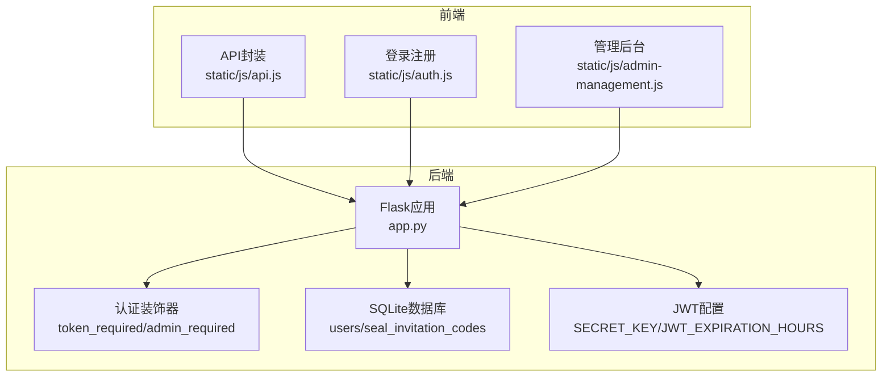
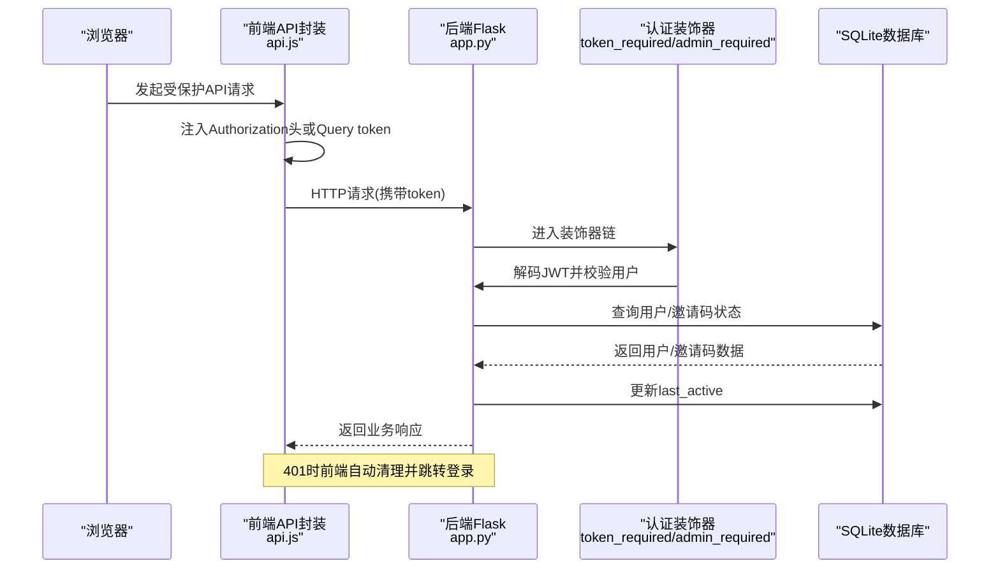
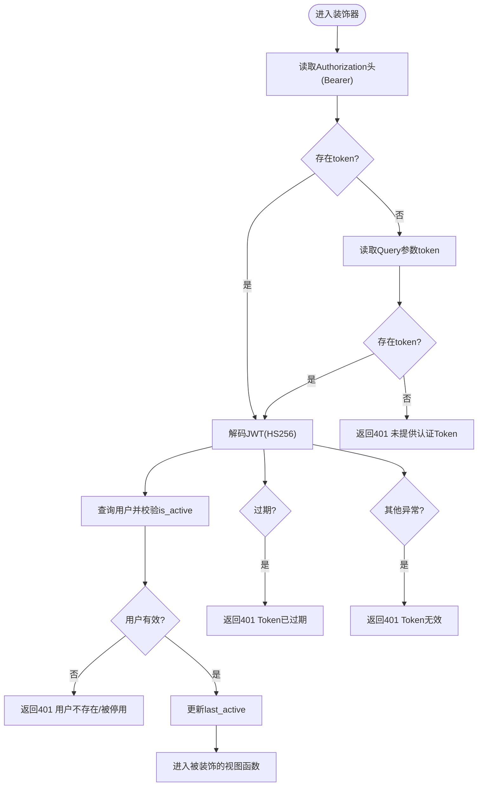
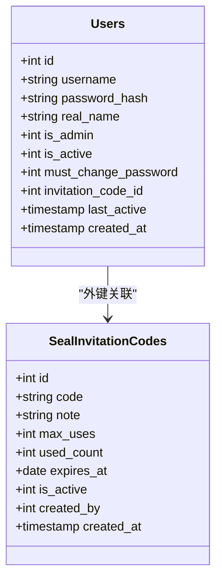
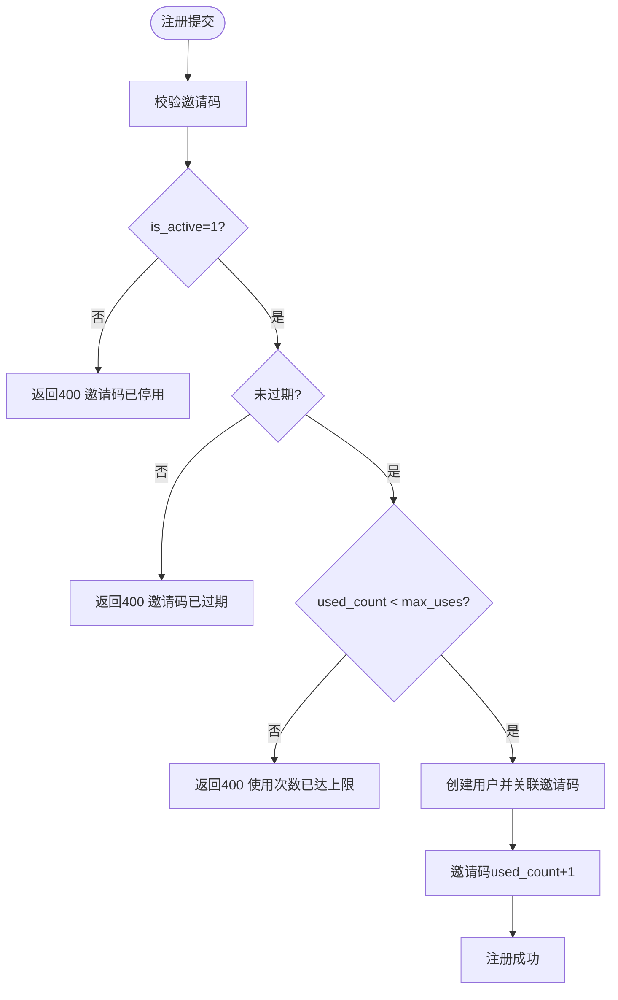
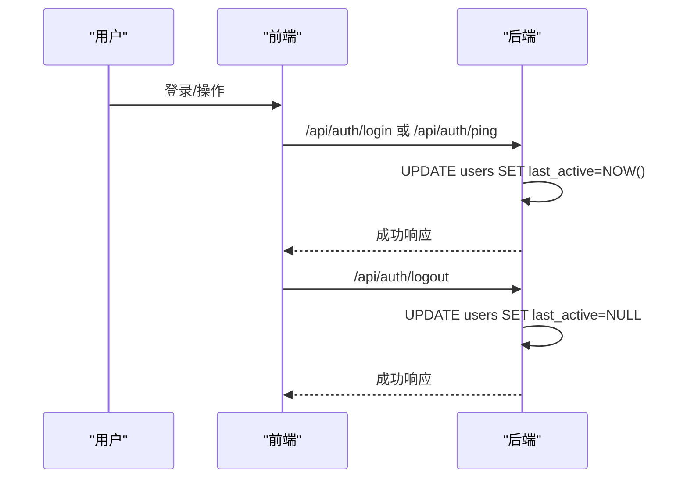
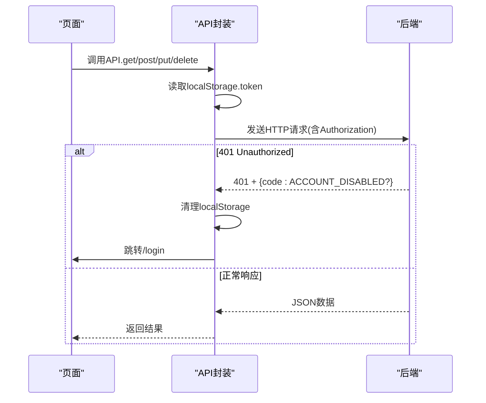
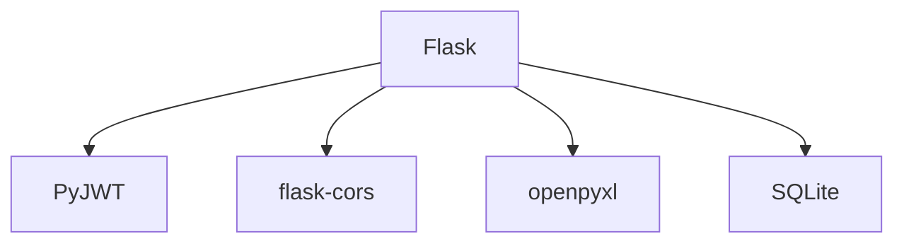

# 权限控制机制

<cite>
**本文引用的文件**
- [app.py](file://app.py)
- [api.js](file://static/js/api.js)
- [auth.js](file://static/js/auth.js)
- [admin-management.js](file://static/js/admin-management.js)
- [requirements.txt](file://requirements.txt)
</cite>

## 目录
1. [简介](#简介)
2. [项目结构](#项目结构)
3. [核心组件](#核心组件)
4. [架构总览](#架构总览)
5. [详细组件分析](#详细组件分析)
6. [依赖分析](#依赖分析)
7. [性能考虑](#性能考虑)
8. [故障排除指南](#故障排除指南)
9. [结论](#结论)

## 简介
本文件针对“封样件及色板接收登记管理系统”的权限控制机制进行系统化说明，重点覆盖以下方面：
- 基于JWT的认证流程：token生成、验证、过期处理与刷新机制
- 装饰器实现：token_required与admin_required的双重校验与Header/Query两种传递方式
- 用户角色体系：普通用户与管理员的权限差异、功能访问控制
- 在线状态追踪：last_active字段的更新与在线状态展示
- 邀请码权限控制：有效性验证、使用次数限制、过期控制
- 安全最佳实践：密码策略、会话管理、权限审计建议

## 项目结构
系统采用Flask后端与纯前端JavaScript交互的前后端分离模式，权限控制贯穿API层与前端拦截器：
- 后端：app.py集中定义认证装饰器、用户与邀请码表结构、JWT配置、以及各业务API
- 前端：静态资源位于static/js，包含API封装、登录注册、管理后台等模块
- 依赖：requirements.txt声明Flask、CORS、JWT、Excel处理等运行时依赖

**图表来源**
- [app.py](file://app.py)
- [api.js](file://static/js/api.js)
- [auth.js](file://static/js/auth.js)
- [admin-management.js](file://static/js/admin-management.js)

**章节来源**
- [app.py](file://app.py)
- [requirements.txt](file://requirements.txt)

## 核心组件
- 认证装饰器
  - token_required：支持Header Authorization: Bearer Token与Query参数token两种传递方式；解码JWT、校验用户存在与账户状态、更新last_active
  - admin_required：在token_required基础上进一步校验is_admin字段
- JWT配置：SECRET_KEY用于签名验证，JWT_EXPIRATION_HOURS控制过期时间
- 用户与邀请码表：users表包含角色、状态、邀请码关联；seal_invitation_codes表包含邀请码、使用次数、过期时间、启用状态
- 前端API拦截器：统一注入Authorization头，401时自动清理本地存储并跳转登录

**章节来源**
- [app.py](file://app.py)
- [api.js](file://static/js/api.js)

## 架构总览
整体认证与权限控制流程如下：

**图表来源**
- [app.py](file://app.py)
- [api.js](file://static/js/api.js)

## 详细组件分析

### JWT认证与装饰器实现
- token_required
  - 支持两种token传递方式：Header Authorization: Bearer <token> 或 Query参数token
  - 解码JWT并获取user_id，查询用户是否存在且is_active为真
  - 更新用户last_active为当前时间戳，用于在线状态追踪
  - 捕获过期与无效异常并返回401
- admin_required
  - 在token_required基础上校验用户is_admin字段，非管理员返回403
- JWT配置
  - SECRET_KEY用于HS256签名验证
  - JWT_EXPIRATION_HOURS定义token有效期（小时）

**图表来源**
- [app.py](file://app.py)

**章节来源**
- [app.py](file://app.py)

### 用户角色与权限控制
- 角色字段
  - users表的is_admin字段标识管理员；普通用户无管理员权限
- 功能访问控制
  - 管理员专属API：用户管理、邀请码管理、系统设置、处置记录软/硬删除等
  - 普通用户仅能访问与自身相关的业务API（如封样件、色板、寄出、评定、报废等）
- 在线状态展示
  - 管理后台通过last_active与当前时间对比，5分钟内活动即判定为在线
  - 展示在线状态标签，支持点击切换用户状态

**图表来源**
- [app.py](file://app.py)

**章节来源**
- [app.py](file://app.py)
- [admin-management.js](file://static/js/admin-management.js)

### 邀请码权限控制
- 生成与管理
  - 管理员可生成邀请码，设置最大使用次数、过期时间、备注
  - 支持启用/停用与删除（未使用过的邀请码才允许删除）
- 注册校验
  - 注册时必须提供有效邀请码，且满足：
    - 邀请码处于启用状态
    - 未过期
    - 使用次数未达上限
  - 成功注册后，邀请码used_count自增

**图表来源**
- [app.py](file://app.py)

**章节来源**
- [app.py](file://app.py)

### 在线状态追踪机制
- 登录/心跳/退出
  - 登录成功立即更新last_active
  - 心跳接口ping定期刷新last_active
  - 退出登录清空last_active
- 在线判定
  - 管理后台将UTC时间转换为本地时间，5分钟内活动即为在线
  - 展示在线/离线标签，支持排序与筛选

**图表来源**
- [app.py](file://app.py)
- [api.js](file://static/js/api.js)

**章节来源**
- [app.py](file://app.py)
- [api.js](file://static/js/api.js)
- [admin-management.js](file://static/js/admin-management.js)

### 前端API拦截与会话管理
- 请求拦截
  - 自动在请求头注入Authorization: Bearer <token>
  - GET/POST/PUT/DELETE/上传均携带token
- 401处理
  - 401时自动清理localStorage中的token与user
  - 若账户被停用，提示“账户已被管理员停用”
  - 跳转至登录页
- 登录/注册
  - 登录成功保存token与用户信息
  - 注册时校验密码长度与一致性，使用邀请码注册

**图表来源**
- [api.js](file://static/js/api.js)
- [auth.js](file://static/js/auth.js)

**章节来源**
- [api.js](file://static/js/api.js)
- [auth.js](file://static/js/auth.js)

## 依赖分析
- 运行时依赖
  - Flask：Web框架
  - flask-cors：跨域支持
  - PyJWT：JWT生成与解析
  - openpyxl：Excel导入导出
- 本地依赖
  - SQLite：轻量级数据库，存储用户、邀请码与业务数据

**图表来源**
- [requirements.txt](file://requirements.txt)

**章节来源**
- [requirements.txt](file://requirements.txt)

## 性能考虑
- token_required装饰器每次请求都会进行JWT解码与用户查询，建议：
  - 控制token负载大小，仅保留必要字段
  - 合理设置JWT_EXPIRATION_HOURS，平衡安全性与用户体验
  - 对高频接口可考虑缓存用户基本信息（谨慎使用，避免状态不同步）
- 在线状态判定采用5分钟阈值，可在管理后台按需调整
- Excel导入导出涉及大文件处理，建议：
  - 分批写入数据库，减少事务开销
  - 对异常行进行记录与跳过，保证整体导入成功率

## 故障排除指南
- 401 未提供认证Token
  - 检查前端是否正确注入Authorization头或Query参数token
  - 确认localStorage中存在token
- 401 Token已过期
  - 当前实现未提供自动刷新机制，需重新登录获取新token
- 401 用户不存在/被停用
  - 检查用户是否存在且is_active为真
  - 管理员可启用/禁用用户
- 403 需要管理员权限
  - 确认当前用户is_admin为真
  - 仅管理员可访问管理类API
- 注册失败：无效的邀请码/已停用/已过期/使用次数已达上限
  - 管理员需检查邀请码状态、过期时间与使用次数
- 在线状态不准确
  - 检查服务器时区与last_active存储格式
  - 管理后台在线判定基于UTC转本地时间，确保时区一致

**章节来源**
- [app.py](file://app.py)
- [api.js](file://static/js/api.js)

## 结论
本系统通过JWT与装饰器实现了清晰的认证与授权边界，结合邀请码机制与在线状态追踪，构建了较为完善的权限控制体系。建议后续增强点包括：
- 引入token刷新机制，提升用户体验
- 增加登录失败次数限制与账户锁定策略
- 完善权限审计日志，记录关键操作与变更
- 对敏感操作增加二次确认与风险提示