# 核心业务逻辑

<cite>
**本文引用的文件**
- [app.py](file://app.py)
- [requirements.txt](file://requirements.txt)
- [api.js](file://static/js/api.js)
- [auth.js](file://static/js/auth.js)
- [common.js](file://static/js/common.js)
- [color-evaluation.js](file://static/js/color-evaluation.js)
- [seal-evaluation.js](file://static/js/seal-evaluation.js)
- [send-record.js](file://static/js/send-record.js)
</cite>

## 目录
1. [简介](#简介)
2. [项目结构](#项目结构)
3. [核心组件](#核心组件)
4. [架构总览](#架构总览)
5. [详细组件分析](#详细组件分析)
6. [依赖分析](#依赖分析)
7. [性能考虑](#性能考虑)
8. [故障排查指南](#故障排查指南)
9. [结论](#结论)
10. [附录](#附录)

## 简介
本系统为“封样件及色板接收登记管理系统”，采用Flask + SQLite + JWT + openpyxl技术栈，提供封样件与色板的台账管理、有效期状态判定、库存控制、寄出流程、评定与报废、Excel导入导出、用户权限与邀请码注册、动态筛选与分页查询、仪表盘预警等功能。本文档聚焦核心业务逻辑与算法实现，包括：
- CIE76 ΔE色差计算算法的数学原理与代码实现
- 有效期状态管理机制（正常、待评定、已过期、已报废）
- 库存控制与色板寄出流程的状态转换
- Excel导入导出的数据验证规则与批量处理机制
- 用户权限控制与角色管理
- 动态筛选与分页查询算法
- 邀请码系统与用户注册流程
- 业务流程图与状态转换图
- 业务规则扩展与定制化建议

## 项目结构
后端为单一Flask应用，负责数据库初始化、认证鉴权、业务API、Excel导入导出、报表统计等；前端通过静态JS模块与后端API交互，实现动态筛选、分页、ΔE计算、寄出库存联动等。

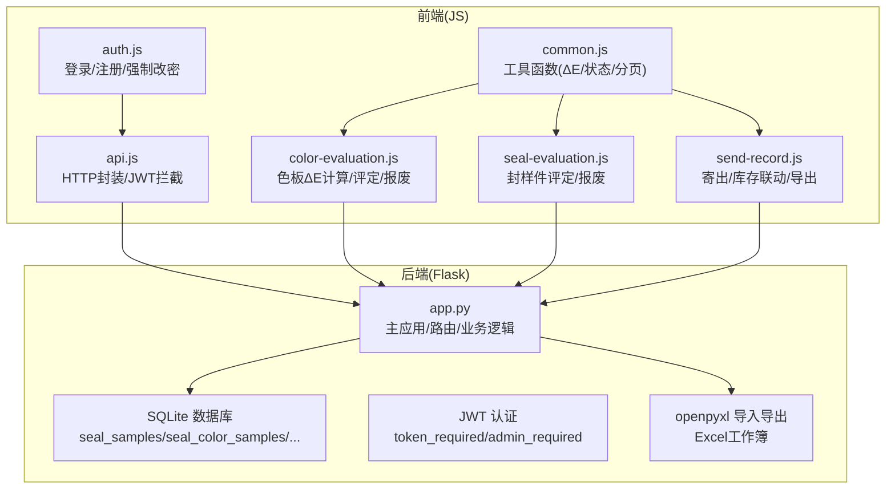

图表来源
- [app.py:1-2197](file://app.py#L1-L2197)
- [api.js:1-88](file://static/js/api.js#L1-L88)
- [auth.js:1-204](file://static/js/auth.js#L1-L204)
- [common.js:1-135](file://static/js/common.js#L1-L135)
- [color-evaluation.js:1-289](file://static/js/color-evaluation.js#L1-L289)
- [seal-evaluation.js:1-214](file://static/js/seal-evaluation.js#L1-L214)
- [send-record.js:1-156](file://static/js/send-record.js#L1-L156)

章节来源
- [app.py:1-2197](file://app.py#L1-L2197)
- [requirements.txt:1-5](file://requirements.txt#L1-L5)

## 核心组件
- 认证与权限
  - JWT Token生成与校验，支持Header与Query两种携带方式
  - 装饰器：token_required、admin_required
  - 用户状态在线检测与强制改密提示
- 数据模型与初始化
  - 10张核心表：用户、邀请码、封样件、色板、寄出、有效期管理、评定记录、报废记录、系统设置、用户表格配置
- 有效期状态管理
  - get_expiry_status：基于到期日与提醒天数计算状态
- CIE76 ΔE色差计算
  - calculate_delta_e：ΔE = sqrt(ΔL^2 + Δa^2 + Δb^2)
- 库存与寄出
  - 寄出时校验持有数量并扣减
  - 删除寄出记录时恢复库存
- Excel导入导出
  - 导入：字段映射、日期截断、批量插入、自动重算
  - 导出：中文状态映射、字段顺序固定
- 动态筛选与分页
  - apply_dynamic_filters：动态拼接SQL与参数
  - paginate：分页与总数统计
- 仪表盘与预警
  - dashboard_stats：统计总数与待评定数
  - dashboard_warnings：30天内到期预警

章节来源
- [app.py:48-84](file://app.py#L48-L84)
- [app.py:88-335](file://app.py#L88-L335)
- [app.py:343-371](file://app.py#L343-L371)
- [app.py:377-396](file://app.py#L377-L396)
- [app.py:403-449](file://app.py#L403-L449)
- [app.py:2084-2154](file://app.py#L2084-L2154)

## 架构总览
系统采用前后端分离架构：前端通过API封装统一访问后端，后端以REST风格提供资源接口，数据持久化使用SQLite，导入导出使用openpyxl。

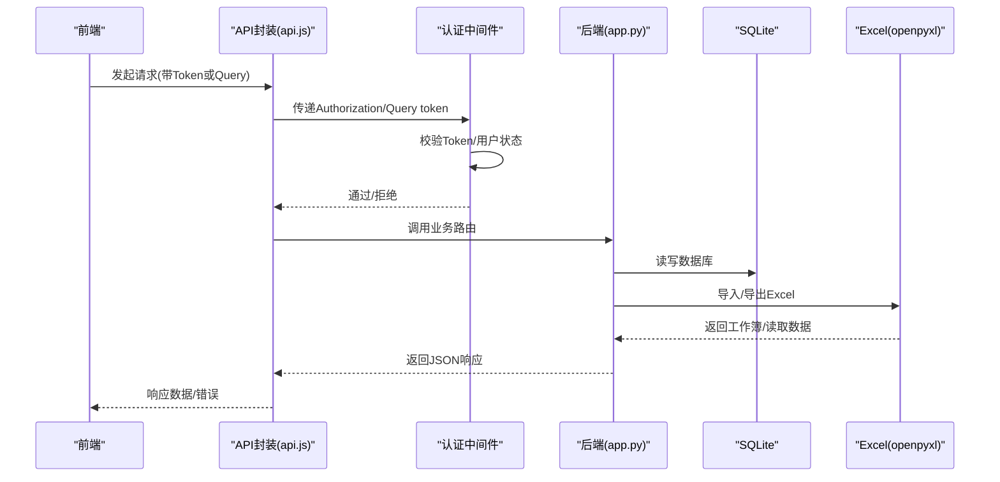

图表来源
- [api.js:7-42](file://static/js/api.js#L7-L42)
- [app.py:48-84](file://app.py#L48-L84)
- [app.py:88-335](file://app.py#L88-L335)

## 详细组件分析

### CIE76 ΔE色差计算
- 数学原理
  - ΔE = sqrt((L2 − L1)^2 + (a2 − a1)^2 + (b2 − b1)^2)
  - L、a、b为CIE Lab色彩空间坐标
- 代码实现
  - 后端：calculate_delta_e
  - 前端：Utils.calculateDeltaE
- 使用场景
  - 色板评定时，前端实时计算ΔE并给出等级（优秀/合格/需关注）

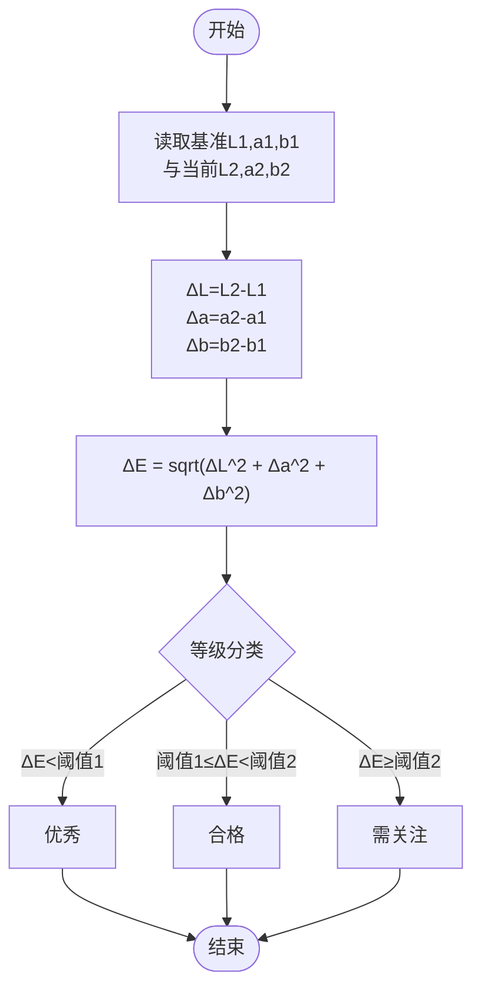

图表来源
- [app.py:343-348](file://app.py#L343-L348)
- [common.js:25-33](file://static/js/common.js#L25-L33)

章节来源
- [app.py:343-348](file://app.py#L343-L348)
- [common.js:25-40](file://static/js/common.js#L25-L40)
- [color-evaluation.js:206-235](file://static/js/color-evaluation.js#L206-L235)

### 有效期状态管理机制
- 状态定义
  - normal：正常
  - pending_eval：待评定（距离到期天数≤提醒天数）
  - expired：已过期（到期日已过）
  - scrapped：已报废（不可再评定）
- 判断逻辑
  - 基于有效期截止日期与提醒天数计算剩余天数
  - 若剩余天数>提醒天数：normal
  - 若剩余天数∈(0,提醒天数]：pending_eval
  - 若剩余天数≤0：expired
- 动态计算
  - 列表与详情接口均会在运行时根据有效期与提醒天数动态重算状态

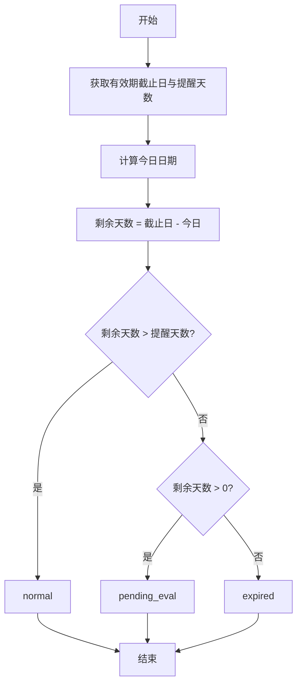

图表来源
- [app.py:350-371](file://app.py#L350-L371)
- [app.py:621-623](file://app.py#L621-L623)
- [app.py:839-841](file://app.py#L839-L841)

章节来源
- [app.py:350-371](file://app.py#L350-L371)
- [app.py:617-623](file://app.py#L617-L623)
- [app.py:835-841](file://app.py#L835-L841)

### 库存控制与色板寄出流程
- 寄出校验
  - 校验色板存在且状态为normal
  - 校验寄出数量不超过当前持有数量
- 库存变更
  - 成功寄出：扣减当前持有数量
  - 删除寄出记录：恢复当前持有数量
- 流程图

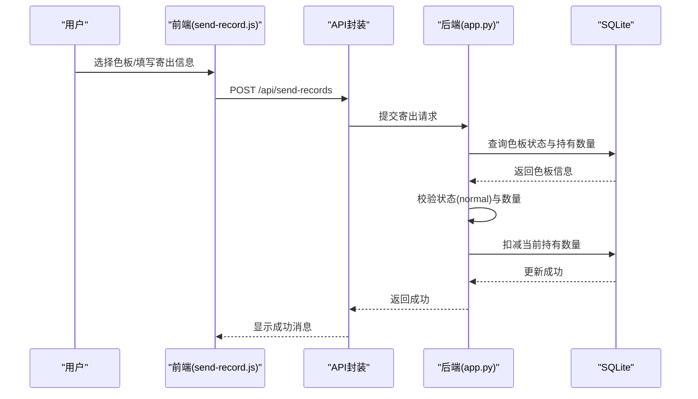

图表来源
- [send-record.js:118-130](file://static/js/send-record.js#L118-L130)
- [app.py:1110-1140](file://app.py#L1110-L1140)

章节来源
- [send-record.js:97-130](file://static/js/send-record.js#L97-L130)
- [app.py:1110-1140](file://app.py#L1110-L1140)

### Excel导入导出与数据验证
- 导入规则
  - 支持从导出模板重新导入（含ID列时自动跳过）
  - 字段映射：序号、项目/客户、封样件名称/颜色名称、签署人/适用车型、签署人日期/接收日期、有效期、提醒天数、备注
  - 日期字段截断为YYYY-MM-DD
  - 自动重算：导入后根据有效期与提醒天数重算状态；色板若ΔE为空则按ΔL/Δa/Δb补算ΔE
- 导出规则
  - 中文状态映射
  - 固定字段顺序，避免多余列
- 批量处理
  - 逐行解析与校验，记录错误行数与首条错误，保证导入过程可控

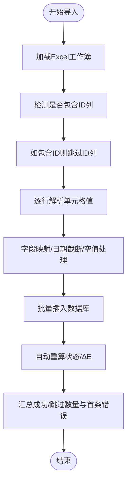

图表来源
- [app.py:720-794](file://app.py#L720-L794)
- [app.py:953-1040](file://app.py#L953-L1040)

章节来源
- [app.py:720-794](file://app.py#L720-L794)
- [app.py:953-1040](file://app.py#L953-L1040)

### 用户权限控制与角色管理
- 角色
  - is_admin：管理员，拥有最高权限（用户管理、邀请码管理、系统设置、处置记录软/硬删除）
  - 普通用户：普通操作权限
- 权限控制
  - token_required：校验Token与用户有效性
  - admin_required：仅管理员可用
  - 在线状态：登录/心跳/退出时维护last_active
- 管理员功能
  - 用户启/停、删除（不可操作自身与管理员）
  - 邀请码生成/启用/停用/删除（已使用不可删）
  - 系统设置（ΔE阈值等）读取/更新
  - 处置记录软删除/恢复/永久删除（含台账回滚）

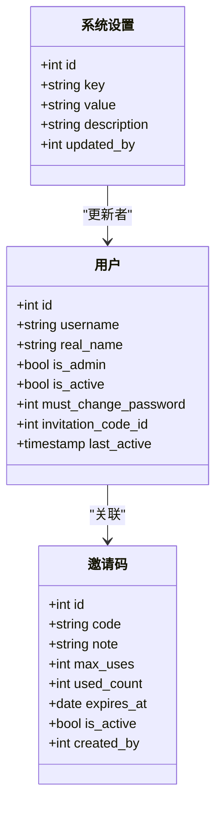

图表来源
- [app.py:93-127](file://app.py#L93-L127)
- [app.py:113-127](file://app.py#L113-L127)
- [app.py:273-284](file://app.py#L273-L284)

章节来源
- [app.py:48-84](file://app.py#L48-L84)
- [app.py:1426-1495](file://app.py#L1426-L1495)
- [app.py:1499-1548](file://app.py#L1499-L1548)
- [app.py:1552-1577](file://app.py#L1552-L1577)

### 动态筛选与分页查询
- 动态筛选
  - 前端以f_field_i/f_op_i/f_val_i形式传递筛选条件
  - 后端apply_dynamic_filters安全拼接SQL，防止注入
  - 支持contains/not_contains/equals/not_equals/gt/gte/lt/lte/before/after/is_empty等操作符
- 分页
  - paginate：支持page/pageSize，page_size<=0时返回全量
  - 返回items、total、page、page_size、total_pages

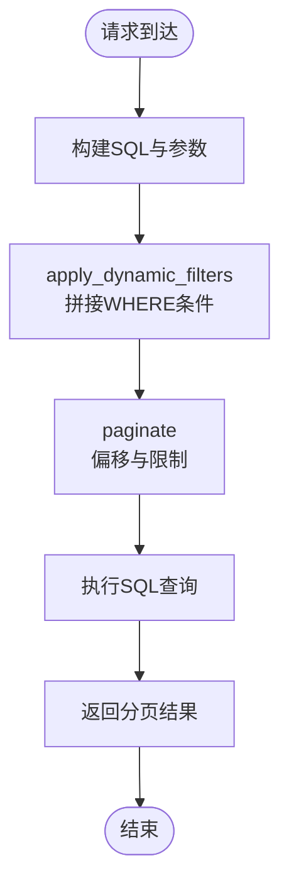

图表来源
- [app.py:403-449](file://app.py#L403-L449)
- [app.py:377-396](file://app.py#L377-L396)

章节来源
- [app.py:403-449](file://app.py#L403-L449)
- [app.py:377-396](file://app.py#L377-L396)

### 邀请码系统与用户注册流程
- 邀请码
  - 生成：generate_invitation_code（16位字母数字）
  - 管理：启用/停用/删除（已使用不可删）
- 注册
  - 校验：用户名唯一、密码一致性与长度、邀请码有效且未过期且未达使用上限
  - 创建：插入用户并更新邀请码使用计数
- 登录/强制改密
  - 登录成功写入Token与用户信息
  - 首次登录且must_change_password=1时弹窗强制改密

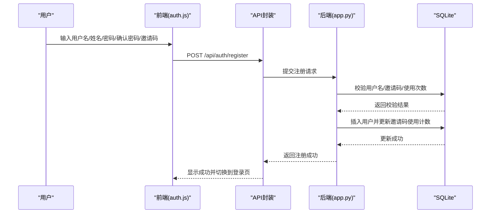

图表来源
- [auth.js:70-108](file://static/js/auth.js#L70-L108)
- [app.py:495-542](file://app.py#L495-L542)

章节来源
- [auth.js:70-108](file://static/js/auth.js#L70-L108)
- [app.py:495-542](file://app.py#L495-L542)

### 业务流程图与状态转换图
- 评定与报废流程
  - 合格：更新有效期与状态为normal
  - 不合格：进入报废流程，状态变为scrapped
- 处置记录管理
  - 软删除：标记is_deleted=1并回滚台账
  - 恢复：重新应用台账变更
  - 永久删除：删除处置记录并清理关联寄出记录

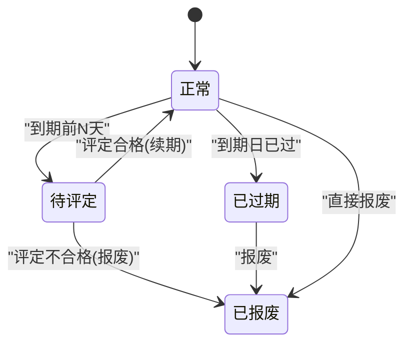

图表来源
- [app.py:1226-1286](file://app.py#L1226-L1286)
- [app.py:1291-1327](file://app.py#L1291-L1327)

章节来源
- [app.py:1226-1286](file://app.py#L1226-L1286)
- [app.py:1291-1327](file://app.py#L1291-L1327)

## 依赖分析
- 后端依赖
  - Flask、Flask-CORS、PyJWT、openpyxl、SQLite
- 前端依赖
  - 通过api.js统一发起请求，auth.js处理登录/注册/强制改密，common.js提供工具函数，各页面模块负责具体业务交互

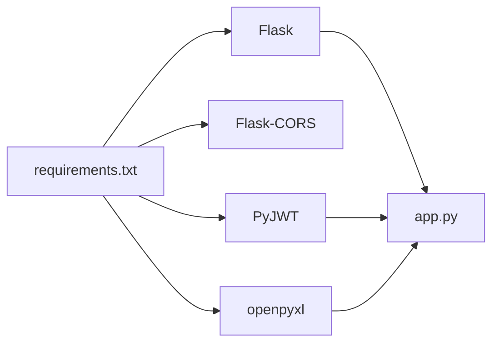

图表来源
- [requirements.txt:1-5](file://requirements.txt#L1-L5)
- [app.py:1-25](file://app.py#L1-L25)

章节来源
- [requirements.txt:1-5](file://requirements.txt#L1-L5)
- [app.py:1-25](file://app.py#L1-L25)

## 性能考虑
- 数据库
  - 使用SQLite，适合中小规模数据；如需高并发，建议迁移到PostgreSQL/MySQL并引入连接池与索引优化
- 导入导出
  - 导入逐行处理，建议在生产环境限制单次导入行数并增加进度反馈
- 分页
  - 前端分页与后端分页结合，建议对高频查询建立索引（如有效期、状态、创建时间）
- 前端
  - ΔE计算在前端实时进行，建议对大量数据时采用节流/防抖策略

## 故障排查指南
- 认证相关
  - 401未提供Token/Token无效/过期/账户被停用：前端自动跳转登录并清除本地状态
- 导入失败
  - 检查Excel格式与字段顺序；查看返回的错误行号与首条错误信息
- 寄出失败
  - 检查色板状态是否为normal；确认寄出数量不超过持有数量
- 有效期状态异常
  - 确认有效期截止日与提醒天数；系统会按剩余天数动态重算状态

章节来源
- [api.js:20-33](file://static/js/api.js#L20-L33)
- [app.py:720-794](file://app.py#L720-L794)
- [app.py:1110-1140](file://app.py#L1110-L1140)
- [app.py:350-371](file://app.py#L350-L371)

## 结论
本系统围绕封样件与色板两大核心对象，实现了从接收登记、有效期管理、库存控制、寄出流转、评定报废到Excel导入导出与仪表盘预警的完整闭环。CIE76 ΔE算法与有效期状态机设计清晰，前端通过统一API封装与工具函数提升了交互体验。建议在后续版本中增强数据库性能、完善导入导出的并发与进度反馈，并提供更灵活的业务规则配置能力。

## 附录
- 业务规则扩展与定制化建议
  - ΔE阈值：通过系统设置表动态调整，前端实时加载
  - 有效期规则：seal_expiry_management支持按对象类型与ID配置有效期类型与时长
  - 表格配置：用户可保存筛选与列显示偏好，提升个性化体验
  - 报废流程：支持多种报废类型，便于审计与统计

章节来源
- [app.py:273-284](file://app.py#L273-L284)
- [app.py:1175-1207](file://app.py#L1175-L1207)
- [app.py:1582-1625](file://app.py#L1582-L1625)